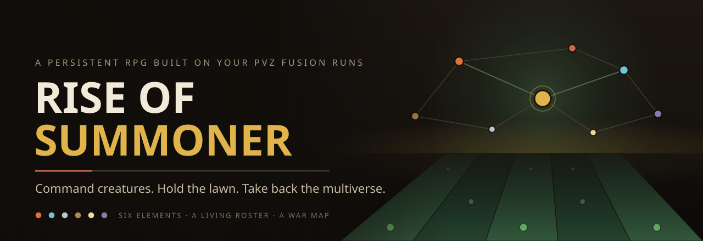
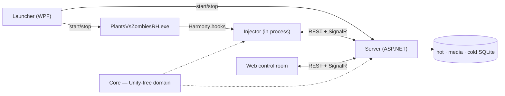

<div align="center">



<br>

[](LICENSE) [](https://github.com/letuhao/plant-vs-zombie-rise-of-summoner/actions/workflows/ci.yml) [](#play-it) [](#play-it)

**[What is this?](#an-rpg-layer-for-a-game-that-already-plays-great)** · **[Features](#what-you-get)** · **[Play it](#play-it)** · **[Roadmap](#roadmap)** · **[Under the hood](#under-the-hood)** · **[Docs](docs/README.md)**

</div>

---

## An RPG layer for a game that already plays great

**Plants vs. Zombies Fusion** took the lawn everyone knows and put a combinatorial engine on top of it. Two plants combine into a third that inherits from both, and the recipe tree runs deep enough that mapping it is a game in itself. The lane defense underneath is as sharp as it ever was.

Fusion is excellent on its own, and **Rise of Summoner does not change a frame of it.** Every plant, every fusion, every wave plays exactly the way its creators built it.

What this adds is a second layer *around* the lawn — the part that keeps going after the level ends. Every plant you place, every zombie you drop, every fusion you discover gets recorded and turned into something you keep: a roster, an economy, an almanac that fills itself in, and a war map sitting above it all.

You are Crazy Dave. The Fracture scattered Zomboss's time machine across the eras, and where a shard landed, plant and zombie **fused**. Those fusions became demons. Some of them will fight for you — if you can weaken them, bind them, and keep them loyal.

> **The loop:** hold the lawn → harvest souls → summon and bind demons → fuse them into something stronger → march a legion across the rift map → do it again on ground that fights back.

Your install stays untouched. No binary is patched, no game file is written, and uninstalling is deleting a folder.

---

## Two ways to play, one save file

Play the lawn, or play the RPG between lawns. Both write to the same roster.

<table>
<tr>
<th width="50%">🌱 &nbsp;Overlay mode</th>
<th width="50%">👹 &nbsp;Standalone mode</th>
</tr>
<tr>
<td valign="top">

PVZ Fusion is open. Harmony hooks read the live board every frame and mirror it into a browser control room you keep on a second monitor.

Your real runs feed the RPG: kills become souls, placements become XP, the zombies you meet fill an almanac that remembers what you have seen.

Deploy a bound demon into an actual lawn and watch it fight.

</td>
<td valign="top">

You are away from the lawn — the RPG keeps running without it.

Send squads out on expeditions that resolve while you are gone. Summon at the altar, run the fusion lab, work the contract board, push legions across the rift map.

Same roster, same souls, same ledgers — one economy, written by whichever mode you happened to be playing.

</td>
</tr>
</table>

Nothing is locked behind either mode. Play only the lawn and you miss nothing; play only the browser and you miss nothing. Fusion runs make the RPG richer — they are never a toll gate in front of it.

---

## What you get

### ⚔️ An elemental layer over the fight

Vanilla damage resolves the way it always has. On top of it sits a full elemental system.

Six elements — **fire, ice, air, earth, light, dark** — plus `omni`, arranged in a ring where every matchup is a real number, not a flavour label. Light and dark counter each other and nothing else. On top of that: layered shields, crit, resistances with two-phase rolls, internal cooldowns so nothing chain-procs into soup, and statuses that actually resolve instead of sitting in a table looking decorative.

Damage is one signed number produced by one resolver. The live lawn and the server's own battle engine run the same math, and the goldens keep them honest.

### 👹 Demons that are individuals

Every demon is a **specimen**: its own id, level, gear, traits, element, rarity, variant, and history. Duplicates are not dust — they are fusion material and trait donors.

- **Summon** at the altar with souls you earned. Gacha is *a* path, never the only one.
- **Bind** them to contract slots. Loyalty decays with daily upkeep; an insubordinate demon simply refuses to deploy.
- **Fuse** them into star merges that keep their identity, inherit traits, and unlock recipes you discover rather than read.
- **Patron** one of them to bathe your whole army in its element.

### 🗺️ A war map above the lawn

Sectors are nodes on a rift graph. Legions march between them. Each sector is its own board where you build economy, defenses, and bases on ground that has a **loam** rating — fertile land feeds an empire, barren land bleeds you dry until the Fracture takes it back.

**Dr. Zomboss plays too.** He is a real commander with his own fog of war, his own evaluation tables, and no access to your state. He decides. Twenty turns of him deciding sit in the test suite.

Win by finding and taking his fortress. Lose by letting the homeworld fall.

### 📈 Progression that survives the run

Per-save XP and levels for the player, every plant type, and every zombie type — driven from typed play facts, backed by an append-only ledger, with demotion debt so nothing is ever silently lost.

The almanac fills itself: click a card in-game and the overlay captures its portrait, its pedia text, its cost, and files it into a dossier you can actually browse.

### 🖥️ A control room on your second monitor

Twenty screens served from `http://127.0.0.1:5088`. No install, no Node, no npm.

| | | | |
|---|---|---|---|
| **Lawn** — live 12×5 mirror | **Roster** — specimens + gear | **Demons** — codex + altar | **Fusion** — the lab |
| **Expeditions** — dispatch/collect | **World** — the rift map | **Progression** — almanac dossiers | **Status** — what is connected |
| **Cheats** — the sandbox page | **Stats** — derived sheets | **Activity** — typed play facts | **Runs** — match history |
| **Types** · **Recipes** · **Log** | **Storage** — archive + purge | **Sim** — play with no game | **Icon / Almanac dump** |

### 🎛️ A sandbox you can trust

Testing a build, tuning a fight, or just messing around? Every knob lives on one web page, and that page is the only source of truth — there is no in-game menu to drift out of sync with it. An empty field means unset, not a `1` quietly left behind by a build from three versions ago. Clear removes. **Reset all** actually resets.

<!-- SCREENSHOT SLOT — drop real captures here once you have them, e.g.
     <p align="center">
       
       
     </p>
     Shot list: lawn mirror mid-run · roster with gear · demon codex · rift map · almanac dossier -->

---

## Play it

> ### 🚧 The first packaged build is not cut yet
>
> The stack runs today — it just runs from source. The one-click zip lands with the first tagged release.
> **[⭐ Star or watch the repo](https://github.com/letuhao/plant-vs-zombie-rise-of-summoner)** and GitHub will tell you the moment it does.

### When it ships, playing looks like this

1. Download `FusionRpg-win-x64.zip` from [Releases](https://github.com/letuhao/plant-vs-zombie-rise-of-summoner/releases).
2. Unzip anywhere → double-click **`FusionRpg.Launcher.exe`**.
3. **Browse** to your legal game folder → install **one** loader (BepInEx 6 IL2CPP *or* MelonLoader — never both) → **Play**.

The launcher starts the server, copies the plugin, starts the game, and opens the UI. You do not install Node, npm, a .NET SDK, or the Desktop Runtime. Builds are unsigned hobby builds, so read the **Trust & security** panel on first run — [the player runbook](docs/runbook/players.md) explains exactly what your antivirus is likely to say and why.

### Running it from source, right now

```powershell
# Windows · .NET 8 (+ .NET 6 for the injector) · Node 20+
$env:FUSIONRPG_GAME_DIR = "<your game folder — the one with PlantsVsZombiesRH.exe>"

dotnet test tests\FusionRpg.Core.Tests     # prove the domain
.\scripts\deploy-play.ps1                  # guards → injector → server → game → browser
```

Want the RPG without the game? Run `.\scripts\deploy-play.ps1 -NoGame` and open `http://127.0.0.1:5088`.

Full setup: [docs/contributing/dev-setup.md](docs/contributing/dev-setup.md) · [docs/runbook/local-dev.md](docs/runbook/local-dev.md)

---

## Roadmap

**✅ Shipped and green**

`live capture + stat overlay` · `cheats control room` · `six elements + ring matchups` · `statuses, shields, crit, resistances` · `atomic effect system` · `per-type XP, levels + ledger` · `almanac capture + dossiers` · `specimen roster, gear + XP` · `demon core, souls, summoning` · `contracts + loyalty` · `demon fusion` · `patron demon (sim)` · `expeditions — the first standalone loop` · `Phaser lawn mirror` · `rift map waves 1–2` · `Zomboss AI commander` · `loam economy` · `hot / media / cold persistence`

**🔨 In the forge**

Interactive turn-based web battles · the action layer joining effects to the turn kernel · sector development and the map→battle handoff · in-run demon capture · an in-game button that opens the control room without alt-tabbing · **the first tagged release**

**🗺️ Charted, not started**

The full three-layer world (rift graph → sector board → lane board) · hero recruitment into the commander slot already waiting for it · world events · fog-of-war depth

Nothing on this list is a promise with a date attached. It is one person's build order, and it moves.

---

## Under the hood

<details>
<summary><b>The architecture in one paragraph</b> — click to expand</summary>

<br>

A WPF **Launcher** starts a legal PVZ Fusion install with a Harmony **Injector** inside it and an independent **Server** (SQLite + REST + SignalR) beside it. A React **Web** control room, served from the server's own `wwwroot`, observes everything and issues commands. The injector never talks to the browser — both talk to the server on `127.0.0.1:5088`.



| Module | Path | Role |
|---|---|---|
| **Launcher** | `src/FusionRpg.Launcher` | Player entry — loader install, port pick, start game + server, self-update |
| **Injector** | `src/FusionRpg.Injector` (+ BepInEx / MelonLoader hosts) | Harmony hooks, capture, guarded apply |
| **Core** | `src/FusionRpg.Core` | Stats, actor hub, statuses, elements, combat, effects, match runtime — **no Unity** |
| **Data** | `src/FusionRpg.Data` | The only place SQL exists |
| **Server** | `src/FusionRpg.Server` | REST, SignalR, ingest, battle engine, static SPA — **no SQL** |
| **Contracts** | `src/FusionRpg.Contracts` | Shared DTOs across every boundary |
| **CheatCore** | `src/FusionRpg.CheatCore` | Cheat schema, identity/strip rules, codec |
| **Web** | `web/fusion-rpg-web` | Vite + React + Phaser control room |

</details>

<details>
<summary><b>The one rule everything hangs off</b></summary>

<br>

**Unity is the source of truth for physics, vanilla combat, entity lifetime, and current HP.** The overlay only ever does two things:

1. **Projects** Unity outward through Harmony capture — events → server → SQLite → browser.
2. **Mutates** Unity through a tiny set of guarded paths and nothing else: `EntityStatWriter` for stats, the CC executor for statuses, the effect Funnel for HP deltas, `pvz.*` intents for spawns.

Two state machines, no shared state, only messages. That is why 120 fps survives an RPG stapled to it, and why a bug in the overlay cannot corrupt your game.

Four scripts enforce it, on every CI run and every local deploy:

```powershell
.\scripts\guard-single-writer.ps1       # combat writes only via EntityStatWriter
.\scripts\guard-secondary-no-unity.ps1  # gameplay plugins stay Unity-free
.\scripts\guard-funnel-delta.ps1        # HP deltas only through the Funnel
.\scripts\guard-dal.ps1                 # SQL only inside FusionRpg.Data
```

</details>

<details>
<summary><b>Is it actually tested?</b></summary>

<br>

| | |
|---|---|
| **3,158** `[Fact]` / `[Theory]` tests | across 10 C# suites |
| **323** web tests | Vitest + Testing Library |
| **545** C# source files · **160** web TS files | |
| **4** architectural guards | run in CI *and* on every local deploy |
| Golden files | damage math, element matchups, battle resolution, world turns |
| Mutation testing | `scripts/mutate.ps1` — a covered line asserted by nothing is worth nothing |

Deterministic by design: battles resolve from recorded seeds, the world steps behind a command barrier, and replays are byte-comparable. That is not a testing convenience — it is what lets a save survive a version bump.

</details>

<details>
<summary><b>Safety, fair play, and what this thing is not</b></summary>

<br>

**Does it modify my game?** No. It never downloads, patches, or writes to the game binary. It installs a loader you choose, into a folder you point at, from that loader's official GitHub release. Uninstalling is deleting the plugin folder.

**Do I need a legal copy?** Yes. Game content is not part of this project and is not covered by its license.

**Is my save safe?** The RPG keeps its own databases next to the server executable. Updating the overlay preserves them and never touches PvZ's saves.

**Is this a cheat menu?** There is a sandbox page, because you cannot build a stat overlay without being able to set stats. It is single-player, local-only, and off by default — leave it alone and Fusion plays exactly as shipped.

**Multiplayer?** No. Localhost only. No auth, no telemetry, no network traffic beyond your own machine.

**Which game version?** Built and proven against PVZ Fusion 3.8.1; the MelonLoader host tracks 3.9.

</details>

---

## Read the docs

The docs are the design record, not an afterthought — architecture decisions, subsystem sources of truth, research notes, and the reasoning trails behind the things that got cut.

| Start here | For |
|---|---|
| [docs/README.md](docs/README.md) | The whole map |
| [architecture/software-architecture.md](docs/architecture/software-architecture.md) | The system on one page — modules, hot path, invariants, FSMs |
| [architecture/data-architecture.md](docs/architecture/data-architecture.md) | Every store and table, who owns what, hot → cold lifecycle |
| [architecture/decisions.md](docs/architecture/decisions.md) | The locked choices, and why |
| [docs/DESIGN-GATE.md](docs/DESIGN-GATE.md) | Read this before proposing anything |

---

## Contributing

Issues, ideas, and playtest reports are all welcome — especially playtest reports, because the lawn does things no offline test can see.

Start at [CONTRIBUTING.md](CONTRIBUTING.md), then [dev-setup.md](docs/contributing/dev-setup.md). PRs want a short test plan. Anything that locks behavior in goes through [decisions.md](docs/architecture/decisions.md) first. Be decent to each other: [CODE_OF_CONDUCT.md](CODE_OF_CONDUCT.md) · [SECURITY.md](SECURITY.md) · [SUPPORT.md](SUPPORT.md).

---

<div align="center">

**Rise of Summoner** is the player-facing name. `FusionRpg` is the internal prefix on every assembly, env var, and release zip — same project, two names.

Licensed under [AGPL-3.0-or-later](LICENSE) · Windows only · Bring your own legal copy of the game

Built by fans of Fusion, for fans of Fusion. All credit for the lawn itself belongs to the people who made it.

<sub>Plants vs. Zombies is a trademark of Electronic Arts Inc. This is an unofficial, non-commercial fan project, not affiliated with or endorsed by PopCap or Electronic Arts.</sub>

</div>
