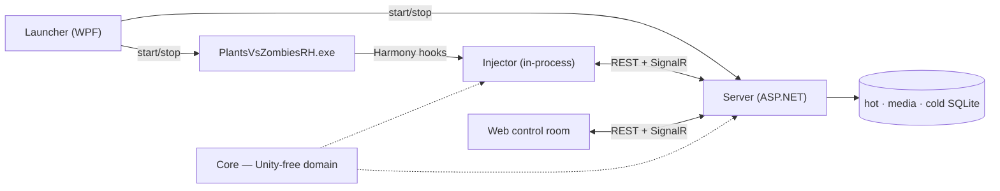

<div align="center">


<br>

[](LICENSE) [](https://github.com/letuhao/plant-vs-zombie-rise-of-summoner/actions/workflows/ci.yml) [](#play-it) [](#play-it)

**[What is this?](#an-rpg-plus-empire-building-game)** · **[Features](#what-you-get)** · **[Play it](#play-it)** · **[Roadmap](#roadmap)** · **[Under the hood](#under-the-hood)** · **[Player guide](docs/guide/site/)** · **[Docs](docs/README.md)**

</div>

---

## An RPG plus empire-building game

**Play the lawn. Raise demons. Run idle expeditions. Build the empire. Take back the multiverse.**

Rise of Summoner is an RPG plus empire-building game. The **lawn** is the **first core loop** — souls, levels, almanac, deploy — not the whole war. Idle expeditions run while you play. The rift is adventure and empire: farm, hunt, and defend ground that can fade if you neglect it.

You need a legal install of **Plants vs. Zombies: Fusion** (a fan-made Plants vs. Zombies pack). Rise of Summoner adds the RPG and empire layer on top — it does not replace those matches.

**Win** by finding Zomboss’s fortress and taking it. **Lose** if the homeworld falls. You keep who you are; you lose where you were.

> **The loop:** play the lawn → grow power, summon, and gear → dispatch idle expeditions → farm, hunt, and defend the empire → adventure the map and build the stage → delve and quest → do it again on ground that fights back.

Short feature list: **[docs/guide/features.md](docs/guide/features.md)**. Tabbed vision site: **[docs/guide/site/](docs/guide/site/)**. Full vision and named loops: **[player guide](docs/guide/)**.

---

## How the war is played

You start on the **lawn**. You raise demons. You send spare demons on **expeditions**. When you are ready, you step onto the **rift**: adventure on the map, empire on the world stage, crawls in delves, quests tying it together.

- Kills become souls; encounters fill the almanac; demons you raised deploy back onto the board
- Summon, bind, and fuse at home — gacha is one path, never the only one
- Dispatch idle expeditions with no stamina; march sectors, hold loam, End Turn against Zomboss
- After the first chapter, unlocked features stay playable with the **lawn game** closed

**Same roster, same souls, same world** — whichever place you are playing from. More voice: **[feature list (brief)](docs/guide/features.md)**.

---

## What you get

- **Play the lawn** — the lawn is the first core loop; souls, almanac, and deploy feed everything else
- **Raise demons** — persistent specimens; summon, bind, fuse; gacha is one path, never the only one
- **Fight for real** — six elements, shields, statuses; the roster you build is the roster that performs
- **Idle forever** — expeditions from 30 minutes to 20 hours; no stamina
- **Build the empire** — rift map, End Turn, loam, Zomboss as a real opponent; take his fortress or lose yours
- **Grow forever** — Dave’s level has no cap; free-build aptitudes; almanac that builds itself from play
- **Go deeper** — delves, sieges, and quests as the war opens (see the guide for Vision vs shipped)
- **On your machine** — local control room; no account, no cloud

**[Feature list (brief)](docs/guide/features.md)** · **[Vision site](docs/guide/site/)** · **[Full catalog](docs/guide/#feature-catalog)** (Shipped / WIP / Vision)

<!-- SCREENSHOT SLOT — drop real captures here once you have them, e.g.
     <p align="center">
       
       
     </p>
     Shot list: lawn mirror mid-run · roster with gear · demon codex · rift map · almanac dossier -->

---

## Play it

> ### 🚧 The first packaged build is not cut yet
>
> The stack runs today — it just runs from source. The one-click zip lands with the first tagged release.
> **[⭐ Star or watch the repo](https://github.com/letuhao/plant-vs-zombie-rise-of-summoner)** and GitHub will tell you the moment it does.

### When it ships, playing looks like this

1. Download `FusionRpg-win-x64.zip` from [Releases](https://github.com/letuhao/plant-vs-zombie-rise-of-summoner/releases).
2. Unzip anywhere → double-click **`FusionRpg.Launcher.exe`**.
3. **Browse** to your legal game folder → install **one** loader (BepInEx 6 IL2CPP *or* MelonLoader — never both) → **Play**.

The launcher starts the server, copies the plugin, starts the game, and opens the UI. You do not install Node, npm, a .NET SDK, or the Desktop Runtime.

Your lawn-game install stays untouched throughout — no binary patched, no game file written, and uninstalling is deleting a folder. Builds are unsigned hobby builds, so read the **Trust & security** panel on first run — [the player runbook](docs/runbook/players.md) explains exactly what your antivirus is likely to say and why.

### Running it from source, right now

```powershell
# Windows · .NET 8 (+ .NET 6 for the injector) · Node 20+
$env:FUSIONRPG_GAME_DIR = "<your game folder — the one with PlantsVsZombiesRH.exe>"

dotnet test tests\FusionRpg.Core.Tests     # prove the domain
.\scripts\deploy-play.ps1                  # guards → injector → server → game → browser
```

Want the RPG without the game? Run `.\scripts\deploy-play.ps1 -NoGame` and open `http://127.0.0.1:5088`.

Full setup: [docs/contributing/dev-setup.md](docs/contributing/dev-setup.md) · [docs/runbook/local-dev.md](docs/runbook/local-dev.md)

---

## Roadmap

Status SSOT for every named feature: **[player guide catalog](docs/guide/#feature-catalog)**. This list is a thin mirror — not a second schedule.

**Shipped (examples)**

Lawn mirror and first-core feeds · summon, pacts, fusion · expeditions (idle forever) · rift map, End Turn, fog, Zomboss, loam · six-element ring, shields, statuses, crit · almanac and chronicle · free-build aptitudes and Dave’s level · hot / media / cold persistence

**In the forge**

Interactive turn-based battles · relics armoury and crafting · map tools and map→battle handoff · in-run capture · sector buildings / world-stage surface · in-game open button · **the first tagged release**

**Vision (charted)**

Delve and siege stages · quest log · finished world stage · Dave-level unlock chapters · passive trees · enemy counter-development · failure branches · named combat reactions · build presets · party formations · three-layer world · world events and deeper fog

Nothing on this list is a promise with a date attached. It is one person's build order, and it moves.

---

## Under the hood

<details>
<summary><b>The architecture in one paragraph</b> — click to expand</summary>

<br>

A WPF **Launcher** starts a legal Plants vs. Zombies install with a Harmony **Injector** inside it and an independent **Server** (SQLite + REST + SignalR) beside it. A React **Web** control room, served from the server's own `wwwroot`, observes everything and issues commands. The injector never talks to the browser — both talk to the server on `127.0.0.1:5088`.



| Module | Path | Role |
|---|---|---|
| **Launcher** | `src/FusionRpg.Launcher` | Player entry — loader install, port pick, start game + server, self-update |
| **Injector** | `src/FusionRpg.Injector` (+ BepInEx / MelonLoader hosts) | Harmony hooks, capture, guarded apply |
| **Core** | `src/FusionRpg.Core` | Stats, actor hub, statuses, elements, combat, effects, match runtime — **no Unity** |
| **Data** | `src/FusionRpg.Data` | The only place SQL exists |
| **Server** | `src/FusionRpg.Server` | REST, SignalR, ingest, battle engine, static SPA — **no SQL** |
| **Contracts** | `src/FusionRpg.Contracts` | Shared DTOs across every boundary |
| **CheatCore** | `src/FusionRpg.CheatCore` | Cheat schema, identity/strip rules, codec |
| **Web** | `web/fusion-rpg-web` | Vite + React + Phaser control room |

</details>

<details>
<summary><b>The one rule everything hangs off</b></summary>

<br>

**Unity is the source of truth for physics, vanilla combat, entity lifetime, and current HP.** The overlay only ever does two things:

1. **Projects** Unity outward through Harmony capture — events → server → SQLite → browser.
2. **Mutates** Unity through a tiny set of guarded paths and nothing else: `EntityStatWriter` for stats, the CC executor for statuses, the effect Funnel for HP deltas, `pvz.*` intents for spawns.

Two state machines, no shared state, only messages. That is why 120 fps survives an RPG stapled to it, and why a bug in the overlay cannot corrupt your game.

Four scripts enforce it, on every CI run and every local deploy:

```powershell
.\scripts\guard-single-writer.ps1       # combat writes only via EntityStatWriter
.\scripts\guard-secondary-no-unity.ps1  # gameplay plugins stay Unity-free
.\scripts\guard-funnel-delta.ps1        # HP deltas only through the Funnel
.\scripts\guard-dal.ps1                 # SQL only inside FusionRpg.Data
```

</details>

<details>
<summary><b>Is it actually tested?</b></summary>

<br>

| | |
|---|---|
| **3,158** `[Fact]` / `[Theory]` tests | across 10 C# suites |
| **323** web tests | Vitest + Testing Library |
| **545** C# source files · **160** web TS files | |
| **4** architectural guards | run in CI *and* on every local deploy |
| Golden files | damage math, element matchups, battle resolution, world turns |
| Mutation testing | `scripts/mutate.ps1` — a covered line asserted by nothing is worth nothing |

Deterministic by design: battles resolve from recorded seeds, the world steps behind a command barrier, and replays are byte-comparable. That is not a testing convenience — it is what lets a save survive a version bump.

</details>

<details>
<summary><b>Safety, fair play, and what this thing is not</b></summary>

<br>

**Does it modify my game?** No. It never downloads, patches, or writes to the game binary. It installs a loader you choose, into a folder you point at, from that loader's official GitHub release. Uninstalling is deleting the plugin folder.

**Do I need a legal copy?** Yes. Game content is not part of this project and is not covered by its license.

**Is my save safe?** The RPG keeps its own databases next to the server executable. Updating the overlay preserves them and never touches PvZ's saves.

**Is this a cheat menu?** There is a sandbox page, because you cannot build a stat overlay without being able to set stats. It is single-player, local-only, and off by default — leave it alone and the **lawn game** plays exactly as shipped.

**Multiplayer?** No. Localhost only. No auth, no telemetry, no network traffic beyond your own machine.

**Which game version?** Built and proven against a legal Plants vs. Zombies pack commonly sold as PvZ Fusion 3.8.1; the MelonLoader host tracks 3.9.

</details>

---

## Read the docs

The docs are the design record, not an afterthought — architecture decisions, subsystem sources of truth, research notes, and the reasoning trails behind the things that got cut.

| Start here | For |
|---|---|
| [docs/guide/](docs/guide/) | **Player guide** — [vision site](docs/guide/site/), [brief feature list](docs/guide/features.md), [mechanisms](docs/guide/mechanisms/), loops, full catalog |
| [docs/README.md](docs/README.md) | The whole map |
| [architecture/software-architecture.md](docs/architecture/software-architecture.md) | The system on one page — modules, hot path, invariants, FSMs |
| [architecture/data-architecture.md](docs/architecture/data-architecture.md) | Every store and table, who owns what, hot → cold lifecycle |
| [architecture/decisions.md](docs/architecture/decisions.md) | The locked choices, and why |
| [docs/DESIGN-GATE.md](docs/DESIGN-GATE.md) | Read this before proposing anything |

---

## Contributing

Issues, ideas, and playtest reports are all welcome — especially playtest reports, because the lawn does things no offline test can see.

Start at [CONTRIBUTING.md](CONTRIBUTING.md), then [dev-setup.md](docs/contributing/dev-setup.md). PRs want a short test plan. Anything that locks behavior in goes through [decisions.md](docs/architecture/decisions.md) first. Be decent to each other: [CODE_OF_CONDUCT.md](CODE_OF_CONDUCT.md) · [SECURITY.md](SECURITY.md) · [SUPPORT.md](SUPPORT.md).

---

<div align="center">

**Rise of Summoner** is the player-facing name. `FusionRpg` is the internal prefix on every assembly, env var, and release zip — same project, two names.

Licensed under [AGPL-3.0-or-later](LICENSE) · Windows only · Bring your own legal copy of the game

Built by fans of Plants vs. Zombies, for fans of Plants vs. Zombies. All credit for the lawn itself belongs to the people who made it.

<sub>Plants vs. Zombies is a trademark of Electronic Arts Inc. This is an unofficial, non-commercial fan project, not affiliated with or endorsed by PopCap or Electronic Arts.</sub>

</div>
