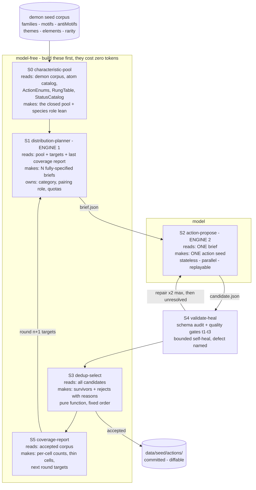
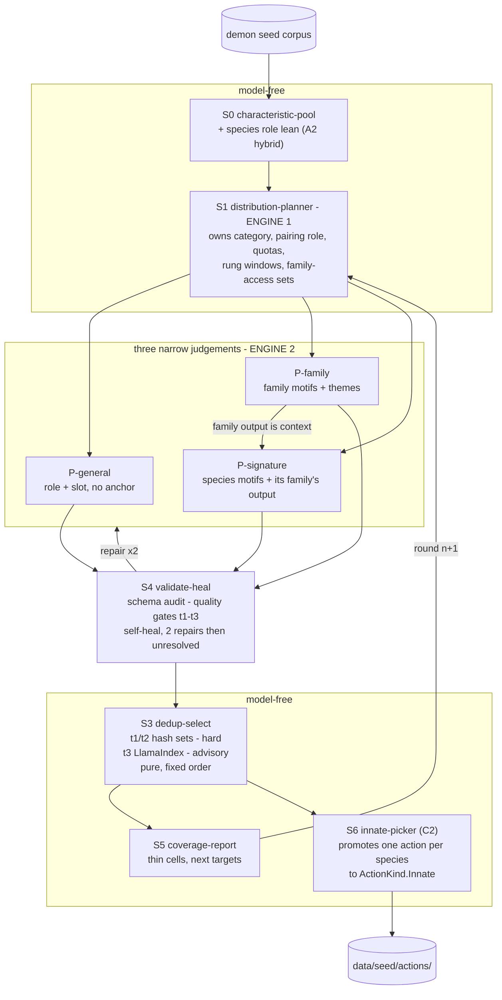

# Action corpus — the idea phase

**Status: proposed 2026-09-02, refocused the same day.** Idea phase only. No capability map, no module
specs, no build authorized.

**Program prefix:** `action-corpus`. Map (when approved) → `docs/architecture/action-corpus-map.md`;
module specs → `docs/architecture/action-corpus/spec-<module-id>.md`; plan →
`tasks/action-corpus-plan.md` + `tasks/action-corpus-todo.md`.

**Scope: the action corpus itself** — what actions exist, in three eligibility tiers, and how a species
comes to hold one. The per-species generation anchor (`type-weights.json`) is a *separate* concern and
is deliberately out of scope here; §9 records what is left of it.

---

## 0. The question this answers

An actor's actions come from three places today: **three basics + an innate** (intrinsic), **grants**
(items), and **unlocks** (the earn ladder). The ladder is built — chance decay, cap, rung, discard,
anti-farm. The roll that builds an action's contents is built.

**Nothing decides *which* action a species is eligible to unlock.** That is the hole, and it is exactly
where the three tiers go.

---

## 1. The laws this design is bound by — restated inline, not linked

A downstream session reads this document, not its links.

1. **Seed → concrete → per-player.** Seedsmith emits seeds — enums, offline, committed, diffable, no
   magnitudes. The **game runtime** rolls the concrete object per player, seeded, like Diablo loot. The
   SDK exists (`Instantiator.TryInstantiate`), and `ActionSeeder` reuses `Instantiator.Draw`
   **verbatim**. **Never design a second roll.**
2. **The model writes identity; deterministic code writes magnitude.** A number a model picks is a
   plausible-looking guess that survives review because nothing looks wrong with it. Enforced by schema
   audit, never by review.
3. **Every RPG feature lives in the RPG layer.** Never built by changing what PvZ is.
4. **One power ladder, and no private `f(level)`.** This document's §5 is entirely about honouring this
   one, because the obvious design breaks it.
5. **`long` for every magnitude, never `float`; widen before multiplying; divide by 1000 last; overflow
   throws.** No hard progression ceilings.
6. **A number a balance pass would change lives in `data/tuning/`, not in code.**

And the one from this program's own neighbourhood — `spec-action-seeding.md` §3:

> **Inventing a third vocabulary is the exact defect the atom program exists to stop.**

---

## 2. What exists — built · wiring gap · real gap

Verified against `src/` and `data/` on 2026-09-02.

### Built

| Thing | Evidence |
|---|---|
| **The unlock ladder** — chance decay to a floor, cap, discard that moves neither chance nor rung (the anti-farm property) | `Actions/Unlock/UnlockState.cs:81`, `UnlockLadder.cs` |
| **`rung(n) = min(earnCount, cap)`** — *"the ONLY input is `earnCount`"*, and no column stores a resolved rung | `UnlockLadder.cs:56-61` |
| **The rung table**, 10 authored rows: tier window, `poolRolls`, `qPowerMilli`, `costMulti`, `cdMulti`, `structureBudget` | `Rungs/RungRow.cs`, `data/tuning/action-rungs.v1.json` |
| **"Stronger costs more" is already mechanized and measured** — `qPower = 1.75^((r-1)/2)` vs `qCost = 1.38^(r-1)`: across rungs 2–10 power ×9.38 against cost ×13.15, **a 1.40× escalation tax** | `action-rungs.v1.json` `_meta` |
| **`structureBudget` per rung** — a closed list of complexity axes a rung may spend on (`scopeSplit`, `riderStatus`, `condition`, `sequence`, `consumption`, `reaction`, `restriction`), rejected at load naming rung and axis | `StructureBudgetGuard.cs:36`; the ladder in `action-rungs.v1.json` |
| **The species signature already has a slot** — `SpeciesBasicsRow(SpeciesKey, Attack, Guard, Move, InnateActionId)`, keyed on an opaque `species_key`, deliberately **not** a join into the demon catalog | `Actions/ActionRow.cs:86` |
| **The innate climbs the same rung curve** — a lagging `rung − 3` was rejected as *"a third curve for a small gain … the private-`f(x)` defect the power SSOT exists to end"* | `action-ideal.md` §1.3 |
| **Action set assembly** — intrinsic + live grants, provenance kept per source, never collapsed | `Grants/ActionSetAssembler.cs` |
| **The runtime roll** — atoms, target shape, name, all deterministic and seeded | `Seeding/ActionSeeder.cs:32,47` |
| **Enabler/payoff pairing** + its closed-loop coverage assertion | `Seeding/EnablerPayoffPairings.cs`, `EnablerPayoffCoverage.cs` |
| Closed vocabularies: `ActionKind` (Basic · Innate · Skill), `ActionCategory` (5), `ActionTag` (8), 6 elements, 4 area shapes | `ActionEnums.cs:7,26,39`; `ElementTable.cs:125-130`; `ActionTargetSpec.cs:42` |

### Wiring gap

| Thing | Evidence |
|---|---|
| `Instantiator.TryInstantiate` has **zero production callers** | `effect-pipeline` module 4 owns wiring it |
| `RendezvousLane` (link-strikes) built and tested, **zero production callers**, gated behind `RendezvousEnabled` which defaults off | `Battle/Timeline/RendezvousLane.cs`, `BattleModeProfile.cs:47` |
| `data/seed/actions/` is **configuration, not a corpus** — neither file carries `kind` + `entries`, so `Corpus.load` cannot read it | `seedsmith/spec-demon-themes.md:253-256` |

### Real gap — the subject of this document

| Thing | Evidence |
|---|---|
| **⭐ Nothing decides which action a species may unlock.** `UnlockState.TryAccept(unlockId, …)` takes the id **as a parameter**, and its only callers in the whole tree are tests passing `"skill.a"`, `"skill.b"`, `$"skill.{i}"` | `UnlockState.cs:81`; grep over `src/` + `tests/` |
| **No eligibility/scope field exists on an action.** `ActionRow` carries `ActionId, Name, Kind, Rung, Tags, Enabled, Revision, Grantable, DefaultAttackEligible, ContainerId, Envelope, Targeting, MinRange, MaxRange, RangeChannel, RequiresLineOfSight` — **and nothing naming who may hold it** | `ActionRow.cs:18-52` |
| **No authored action corpus.** `data/seed/actions/` holds `name-templates.json` and `pairings.json` (120 bytes) and nothing else | `ls data/seed/actions/` |
| `type-weights.json` and `TypeWeights.cs` are named in `spec-action-seeding.md`'s Structure section and **neither exists** | grep over the tree |

---

## 3. The three tiers, mapped onto what exists

| Owner's tier | Where it lands today | State |
|---|---|---|
| **General purpose, role-based** — every species may get them | nothing | **Real gap** |
| **Type/family specific** | nothing | **Real gap** |
| **Species signature** | **`SpeciesBasicsRow.InnateActionId`** — one nullable innate per species, already in the schema, already climbing the rung curve | **Slot built, corpus empty** |

**The signature tier is half-solved and nobody said so.** The innate *is* the species signature: it is
intrinsic (never bound, so loadout capacity never counts it), it is optional (`string?`), and
`action-ideal.md` §1.2 already rejects a species row that omits any of the three basics, naming the
species. What is missing is 904 innates, not the concept.

**The other two tiers need one new thing: an eligibility axis.** That is not a third *vocabulary* — it
does not duplicate category, tag, kind or rung. It answers a question none of them answer: **who may
hold this?**

---

## 4. The rung model is extended, not contradicted

**Owner, 2026-09-02: *"not conflict, extend it."*** Correct, and the shipped model is already built to
be extended. This section records the distinction that keeps the extension legal, because it is narrow
and easy to lose.

What the ladder does today:

```text
rung(n) = min(earnCount, cap)        UnlockLadder.cs:56 — "the ONLY input is earnCount"
```

`cap` is **the row count** of `data/tuning/action-rungs.v1.json`, and the spec is explicit that the
shipped ten rows are *"an illustration of one authored table, not a rule — at `cap = 8` or `cap = 15`
the rows carry…"* (`spec-rung-table.md:90`). The caps register lists this cap as **tunable**
(`ssot-power-scale.md:132`), and the neighbouring rarity ladder is already decided the same way:
**"the ladder extends"**, with new rungs above `almanac` expected rather than forbidden
(`ssot-power-scale.md:798`).

### The one line that is not negotiable

`action-ideal.md` §1.3 rejected a lagging innate climb:

> A lagging climb (`rung − 3`) is rejected: **a third curve for a small gain is the private-`f(x)`
> defect the power SSOT exists to end.**

**That rejects a *shifted function*, not a *bounded one*.** The difference is the whole design:

| Shape | Form | Verdict |
|---|---|---|
| `rung − 3` for one action kind | **a different function** of `earnCount` | **Second curve. Rejected, and stays rejected.** |
| `min(earnCount, cap, scopeMax)` | **the same function, clamped** | One curve, one `qPower`, one `qCost` |

A clamp adds no arithmetic, no exponent, and no per-kind slope. Every action still reads
`qPower(r)` and `qCost(r)` from the one authored table. What changes is **how far up that table a given
piece of content can reach** — which is a property of the content, not a second ladder.

## 5. ⭐ The extension — a rung window per scope

The rung table already carries a window of exactly this shape one level down: **`minTier` / `maxTier`,
"the pool tier window"** (`spec-rung-table.md:46`). Containers carry `min_tier` / `max_tier` for the
same reason. The extension is that shape, one level up:

```text
scope     minRung   maxRung
general      1         N1
family       1         N2        (N2 > N1)
signature    M         cap       (M > 1 makes a signature feel like one)
```

`effectiveRung = clamp(min(earnCount, cap), scope.minRung, scope.maxRung)`

**This delivers all three of the owner's properties from the single shipped ladder:**

| Owner's requirement | How the window delivers it | Cost of the mechanism |
|---|---|---|
| general < family < signature in **power** | a general action's ceiling is a lower `qPower(r)` | zero — same table |
| stronger **costs more** | `qCost` outruns `qPower` by a measured **×1.40** across rungs 2–10 (re-derived from the table, 2026-09-02) | zero — already shipped |
| stronger is **rarer** | the ladder's chance decays toward a floor, so a high rung is rare by construction | zero — already shipped |

**`minRung` is the half worth keeping.** Without it, a signature action earned as somebody's first
unlock arrives at rung 1 and is indistinguishable from a general one — the *"dead weight"* failure
`action-ideal.md` §1.3 names, arriving from the other end.

### Three constraints the extension must satisfy

1. **The window is data, not code** — a per-scope `minRung`/`maxRung` in `data/tuning/`, alongside the
   ladder it clamps. A balance pass will move these, so law 6 makes them tunable by definition.
2. **It is registered as a soft window, not a hard ceiling.** Law 5 and `ssot-power-scale.md` §11: a cap
   on a magnitude is removed or made a configurable soft cap. This one is configurable and it is a
   *content* window — a player is never blocked from progressing, they progress by acquiring
   better-scoped content, exactly as an ARPG's item tiers work. **It belongs in the §11 register with
   that justification written down**, or the next caps audit will read it as a progression ceiling and
   be right to.
3. **The existing assertions must still hold.** `spec-rung-table.md`'s own test list requires monotonic
   E9 pricing across every rung, `qCost(cap)/qCost(2) > qPower(cap)/qPower(2)`, and a contiguous
   `rung` sequence with a gap rejected at load. **A window clamps which rows a scope reaches; it must
   never make the sequence sparse.**

### Structure is the second differentiator, and it is free

`structureBudget` is already a per-rung closed list of complexity axes — `scopeSplit`, `riderStatus`,
`condition`, `sequence`, `consumption`, `reaction`, `restriction` — with `StructureBudgetGuard`
rejecting an over-budget action by naming the rung and the axis. Because the higher rungs carry the
richer budgets, **a scope's rung ceiling already gates its structure ceiling as a side effect.** A
general action capped at rung 4 can never spend on `condition`, `sequence`, `consumption`, `reaction`
or `restriction`, because those axes do not appear until rungs 5, 7 and 9.

So one window buys both halves of *"stronger"*: a bigger number **and** a wider capability, with no
second mechanism for either. `spec-action-seeding.md` §6 already states the principle this rests on —
**complexity is predicate usage, not atom count.**

**A third differentiator is available and should be decided explicitly:** whether a scope also gates
which *atom families* its containers may draw from. That is capability rather than magnitude, so it is
compatible — but it is the easiest place to smuggle power in behind E9's back. Open question 3.

## 6. The eligibility axis — shape

The minimum that closes §2's real gap:

```text
scope    : general | family | species        (closed, 3 values, `none` is not meaningful here)
scopeKey : null    | <family_id> | <species_key>
```

- `general` ⇒ `scopeKey` is null; eligible for every species.
- `family` ⇒ `scopeKey` names one of the **19 families the demon corpus already produced** (seedsmith
  D2, `family-consolidate`) — not a new taxonomy.
- `species` ⇒ `scopeKey` is the same **opaque `species_key`** `SpeciesBasicsRow` already uses,
  deliberately not a join into the generated catalog, which the action program does not own and must
  not edit.

A species' candidate set is then `general ∪ family(mine) ∪ species(mine)` — the thing
`UnlockState.TryAccept` currently has no way to compute, and the reason its only callers are tests.

**Whether this is a column on `ActionRow` or a separate eligibility table is a spec-phase decision, not
an idea-phase one.** The item lane already found one case where reusing a table was wrong while reusing
the *vocabulary* was right (`A1` §5's `rpg_action_grant`), so the same care applies.

---

## 7. Corpus scale — computed

| Tier | Rows | Basis |
|---|---:|---|
| **Signature** | **904** | one innate per species; `InnateActionId` is nullable, so a species may have none — but a tier that is mostly null is not a tier |
| **Family** | **19 × k** | 19 consolidated families. At k = 4, **76** |
| **General** | **~20–40** | role-based floor; 5 categories × 4 target shapes bounds it at 20 before rung variation |
| **Total authored identities** | **~1,000–1,020** | |

**Against the measured requirement this is thin.** `03-roster-scale.md` §2: *a 900-unit roster needs
roughly **1,500–3,500 named ability instances**.* One innate per species plus ~100 shared rows lands at
the bottom of that band, and only if every species actually gets a distinct innate.

**The gap closes through the roll, not through authoring.** An action row names a container; the
container rolls atoms, tier and target shape per player. `ActionSeeder` already composes the name from
the drawn families, so one authored signature row yields many concrete instances. **That is the whole
point of the seed → concrete law**, and it is why the corpus can be ~1,000 rows rather than ~3,000.

**What this does mean:** 904 signature rows cannot be hand-authored. They are the generated corpus, and
that is where seedsmith re-enters — as a **dev-time** tool that emits committed, diffable seed files.
`spec-action-seeding.md` is explicit that the runtime **"depends on seedsmith for nothing"**, and equally
explicit that *"the LLM half belongs to the authored corpus, and that corpus is seedsmith's — later."*
This document is that "later" arriving.

---

## 8. Build order — model-free first

A parse, a table, a schema and a dump produce real value with **zero tokens spent**, and they make the
expensive stage's inputs reviewable.

| # | Module (proposed id) | Model? | Value standalone |
|---|---|---|---|
| 1 | `action-eligibility` — the `scope` / `scopeKey` axis, its validation, and the candidate-set query `TryAccept` needs | **No** | **Closes the real gap.** Makes the built unlock ladder reachable from production for the first time |
| 2 | `action-corpus-shape` — give `data/seed/actions/` a `kind` + `entries` shape so `Corpus.load` can read it | **No** | Makes actions visible to every metric seedsmith already has |
| 3 | `general-tier` — author the ~20–40 role-based general actions by hand | **No** | The shared floor every species draws from; small enough to author well |
| 4 | `family-tier` — 19 × k, derived from family themes where possible | Mixed | `EXPRESSION_RULES` already has an `action` key (*"tempo and effect shape — how fast, how it lands"*) |
| 5 | `signature-tier` — the 904 innates | **Yes** | The corpus |
| 6 | `pairings-grow` — extend `pairings.json` against the built coverage assertion | Mixed | Turns a built-but-empty metric green |

**Module 1 is the one to insist on.** It is model-free, it is small, and until it exists the unlock
ladder — fully built, fully tested — cannot be called by anything but a test.

**Module 3 before module 5.** The general tier is the floor the other two are measured against, it is
small enough to hand-author, and authoring it is how the schema's negative clauses get written from real
cases rather than from imagination.

---

## 9. Open questions — ✅ ALL CLOSED 2026-09-02

> **Resolved in §19 (Part III) and §33 (Part V). Kept for the reasoning trail, not as live questions.**
>
> | # | Question | Answer |
> |---|---|---|
> | 1 | Scope axis: 3 values or 4? | **3** — `ActionKind` already separates an innate from an unlocked skill, and `LoadoutSet.cs:73` enforces it (`IntrinsicNotEquippable`) |
> | 2 | Is a species with no innate legal? | **Moot** — the innate is chosen *after* generation by `S6 innate-picker` (§19 C2), so no species ends up null while it has one eligible action |
> | 3 | May a tier gate atom-family access? | **Yes, structure *and* family access** — adopted with the three required E9 assertions in §21 |
> | 4 | Does the 820-species power gap block the signature tier? | **No.** `spec-action-seeding.md`:54 — *"an unlocked action is a container roll, and its rung is its rarity"*. The action's rarity is the rung, never the species' observed HP |


1. **Does the innate carry `scope = species`, or is intrinsic-vs-unlockable a separate axis?** An innate
   is never bound and never counts against loadout capacity, while an unlocked signature action would.
   If both exist, a species has two signature-shaped things and the difference must be stated. **This
   changes whether §6's axis has three values or four.**
2. **Is a species with no innate legal?** `InnateActionId` is `string?`, so the schema says yes, and
   `action-ideal.md` §1.2 rejects a row omitting any of the three *basics* — the innate is excluded from
   that rule. At 904 species, "mostly null" would make the signature tier decorative.
3. **May a tier gate atom-family access, or only structure?** §5 recommends structure and flags family
   access as the easier place to smuggle power. **If family access is allowed, E9 pricing is the gate**,
   and the rung's power budget must still hold — otherwise this reintroduces §4's defect through a side
   door.
4. **Does the 820-species power gap block the signature tier?** Rung is progression-derived, so it does
   *not* — but rarity, which `RarityForRank` derives from observed HP, may still be undefined for 820 of
   904 species (`seedsmith-map.md` D5). Whether the corpus needs rarity is worth settling before
   sequencing D5 in front of this.

Everything else the owner raised in this round is either already decided in `spec-action-seeding.md` /
`action-ideal.md` or resolved above.

---

## 10. What this document does not decide

- **The per-species generation anchor** (`type-weights.json`, the category/element/shape weight vector).
  It is specified in `spec-action-seeding.md` §3 and unauthored, but it answers *"what does a species'
  pool lean toward"*, not *"which actions may it hold"*. Separate concern, separate module.
- Any magnitude, weight, probability or duration — `numerics` and the tuning files own those.
- The element **reaction** layer. The ring is `attacker element × one defender type slot`
  (`ElementMatchupRelation.cs:3`), terminal, with no lingering element state on a target. A reaction
  layer is a combat change, not a corpus one.
- Wiring `RendezvousLane`. Noted only because link-strikes are the natural runtime consumer of a
  pairing corpus.
- Whether the roster is 904. `n` is a **measurement**, not a design point.

---

# Part II — the generation pipeline (proposal, 2026-09-02)

Owner's design, taken up and reconciled against the shipped laws and the
[`action-taxonomy`](../research/action-taxonomy/README.md) research. **Proposal for review. Not a spec.**

## 11. What holds from the owner's design

Four things are right and are adopted without change:

1. **The state machine lives outside the model.** A deterministic engine plans; the model answers one
   bounded question. This is seedsmith **P4** — *"findings → work order is a pure function… No model
   decides what work to do"* — and it is the direct lesson of the unique-item lane, where every
   expensive failure was a planning failure a model faithfully executed.
2. **A refined input JSON carries the context.** The model produces the right value because it
   understands what the field means, so the brief must carry species/family/role context, not just a
   field list.
3. **A deterministic mixer composes the brief from a characteristic pool**, so one pipeline serves every
   scope instead of one pipeline per shape.
4. **A statistics pass finds thin distribution and plans the next round.** That is the feedback loop
   `metrics → planner` that seedsmith's core already implements.

## 12. What "characteristics" are

The question the owner asked. **A characteristic is a closed-vocabulary constraint that the planner
chooses and the model obeys.** Never a number, never free text. Six groups:

| Group | Fields | Source vocabulary | Who picks |
|---|---|---|---|
| **A · Scope + anchor** | `scope` (general/family/species), `scopeKey` | §6 | planner |
| **B · Identity context** | `family`, `motifs[]`, `antiMotifs[]`, `element`, `themeKey`, `threatBand`, `rarity` | demon corpus (D2/D4), `ElementTable` (6), `ssot-rarity` (10) | read from the seed |
| **C · Mechanical slot** | `category` (5), `targetMode` (6), `areaShape` (4), `relation` (4), `kind` (3), `rungBand` | `ActionEnums.cs`, `ActionTargetSpec.cs`, `RungTable` | **planner** |
| **D · Pool constraints** | `allowedAtomFamilies[]`, `forbiddenAtomFamilies[]`, `structureAxes[]` | atom catalog; `RungRow.StructureBudget` | planner |
| **E · Pairing role** | `pairingRole` = `enabler` / `payoff` / `neutral`, plus `pairsWithStatus` when payoff | `StatusCatalog` (21) | **planner** |
| **F · Negative constraints** | `antiMotifs[]`, `avoidNeighbours[]` — the mechanical fingerprints of the nearest already-accepted actions | derived | planner |

**Group C is the load-bearing correction to the owner's sketch.** In the sketch the model picks the
category and a later pass measures whether the distribution came out right. **The planner should assign
the category instead**, because the planner is the thing that owns the distribution target. Three
consequences, all good:

- distribution is **correct by construction**, not by retry;
- `category` leaves the vote set entirely, which is the single largest cost saving available (§17);
- the statistics pass changes from *"did the model drift?"* to *"is the plan satisfiable?"*, which is a
  question a deterministic planner can actually answer.

**Group F is how duplicates are avoided proactively.** Feeding the nearest already-accepted actions into
the brief as *"do not produce anything like these"* is far cheaper than generating and rejecting. It
also matches the AI-native rule that a description without a negative clause is half-written.

**Group E is the gap the research says will bite.** `EnablerPayoffCoverage` already asserts that every
conditional payoff has an enabler in the same pool. If the planner does not assign the role, the model
will produce payoffs whose enabler never lands in reach — the documented Genshin failure where a
Cryo+Hydro team produces Frozen forever and never Shatters
([`04-control-status-actions.md`](../research/action-taxonomy/04-control-status-actions.md) §6).

## 13. Dedup must move out of the generation loop

**The owner's sketch has a rejection loop: generate one, query the index, if too similar generate
again.** That is correct in intent and wrong in placement, for one reason:

> **It makes the run order-dependent, and this repo has already shipped that defect once.** Action #500's
> acceptance depends on what #1–499 produced. A rerun after any upstream change reshuffles everything
> downstream, so *"a second run over unchanged inputs produces byte-identical files"* — the property
> `stale_ids()` and the provenance hash exist to guarantee — becomes undefinable.

**Proposed shape: generate, then dedup, then top up — three separate passes.**

- **Generation is pure and parallel.** One brief in, one candidate out, no shared state. Perfectly
  replayable, and it is the expensive stage.
- **Dedup is a pure function over the complete candidate set**, applied in a fixed order (sorted by
  `scopeKey`, then brief id). Same candidates in, same survivors out, every time.
- **Top-up rounds are explicit and numbered.** Round n+1's briefs are derived deterministically from
  round n's coverage report, so each round is individually replayable and the sequence is auditable.

The rejection loop still exists — it just runs *between* rounds instead of inside one.

## 14. What "duplicate" means — three tiers, and only one needs a vector index

The owner asked for criteria. The research answers it: **distinctness is carried by abilities, not
prose** — 71% of 5e's 2,472 trait names appear on exactly one creature, and Pokémon's type + ability set
gives median 1 species per cell with 68% singletons
([`game-design/03-roster-scale.md`](../research/game-design/03-roster-scale.md) §2). So the primary key
is **mechanical**, not semantic.

| Tier | Test | Verdict | Cost |
|---|---|---|---|
| **1 · Mechanical identity** | exact match on the tuple `(sorted atomFamilies, category, targetMode, areaShape, relation, sorted structureAxes, pairingRole)` | **hard reject** | a hash set. Free |
| **2 · Mechanical near-duplicate** | tuple matches modulo one field | **reject within the same `scope` + `scopeKey`; allow across different anchors** — a fire species and an ice species may both have "burst damage down a row", and *should* | a hash set per anchor. Free |
| **3 · Semantic / prose** | embedding similarity above a threshold | **advisory only — flags for review, never auto-rejects** | the only tier needing an index |

**Tier 3 is advisory on purpose.** Prose similarity is a weak proxy for mechanical sameness in both
directions: two actions can read alike and play differently, or read differently and be identical. Making
it a hard gate would reject genuine content and would put a stochastic component inside an acceptance
decision — which is how a non-reproducible run gets built by accident.

**Target, from the same research:** median 1 per mechanical cell, ~68% singletons. That is a
closed-loop metric — machine-checkable, so it may contribute to a pass verdict (seedsmith P3).

**A note on the vector index as a dependency.** Only tier 3 needs one, and tier 3 never blocks. So it can
be built last, or replaced by a cheaper token-overlap heuristic, without changing the architecture. Given
seedsmith's locked `dependency-baseline` (exact pins, lockfile, isolated venv, offline assert), adding a
vector store plus an embedding model is a real dependency decision that should be taken on its own
merits rather than inherited from the dedup requirement.

## 15. The pipeline set — six stages, four of them model-free



| # | Stage | Model? | Reads | Makes | Focus |
|---|---|---|---|---|---|
| **S0** | `characteristic-pool` | **No** | demon corpus, atom catalog, the four action enums, rung table, status catalog | the closed pool, **and the species role lean** | Makes every later stage's inputs reviewable before a token is spent |
| **S1** | `distribution-planner` | **No** | pool + run targets + last coverage report | N briefs, each fully specified | **Engine 1.** Owns category, pairing role and every quota. The state machine |
| **S2** | `action-propose` | **Yes** | exactly one brief | exactly one action seed | **Engine 2.** One judgement per call. No memory, no ordering |
| **S3** | `dedup-select` | **No** | the complete candidate set | survivors + rejects with reasons | Pure, fixed-order, replayable |
| **S4** | `validate-heal` | mixed | one candidate | accept / repair / `unresolved` | Reuses `call_with_self_heal`; two repairs then stop |
| **S5** | `coverage-report` | **No** | the accepted corpus | thin cells + next targets | Closed-loop metrics only |

**Build order is S0 → S1 → S5 → S3 → S4 → S2.** The model stage is built *last*: by then the pool, the
plan, the metrics and the dedup are all inspectable on real data, and the expensive stage is the only
unknown left. `motif-prose-filter` is the precedent — *"the highest value-per-cost item in the feature:
no model, no framework, and it fixes the input every later generator consumes."*

## 16. The brief — the refined input JSON

The contract between engine 1 and engine 2. **Every field is an enum, an id, or a list of them.** No
magnitudes, no weights, no probabilities, no durations — `audit_schema` rejects all four smuggling
shapes mechanically, before a call is made.

```jsonc
{
  "briefId": "brief.species.pyre-imp.002",      // deterministic: scope + key + ordinal
  "scope": "species",                            // general | family | species
  "scopeKey": "pyre-imp",

  "anchor": {                                    // group B - read from the demon seed, never invented
    "family": "infernal",
    "element": "fire",
    "rarity": "heirloom",
    "themeKey": "theme.ember-pact",
    "motifs": ["consumes-its-own-vitality", "spreads-on-contact"],
    "antiMotifs": ["patient", "shields-others"]  // what it must NOT be
  },

  "slot": {                                      // group C - the PLANNER decides these
    "category": "status",                        // attack|defense|support|movement|status
    "targetMode": "Area",
    "areaShape": "Row",
    "relation": "Enemy",
    "kind": "Innate",
    "rungBand": [5, 7],
    "structureAxes": ["riderStatus", "condition"]
  },

  "pool": {                                      // group D
    "allowedAtomFamilies": ["atom.burn", "atom.elemental-power", "atom.spread"],
    "forbiddenAtomFamilies": ["atom.crit-rate", "atom.crit-damage"]  // never both halves of a known multiplicative pair
  },

  "pairing": {                                   // group E - how the enabler guarantee is kept
    "role": "enabler",
    "enablesStatus": "burning"
  },

  "avoidNeighbours": [                           // group F - proactive dedup, cheaper than rejection
    { "actionId": "action.pyre-imp.001",
      "fingerprint": "status|Area|Row|Enemy|burn+spread|enabler" }
  ],

  "_provenance": { "corpusHash": "...", "promptVersion": 3, "round": 1 }
}
```

**What the model returns** is identity plus a constrained pick — never a number:

```jsonc
{
  "briefId": "brief.species.pyre-imp.002",
  "name": "Ember Pact",                            // identity - the model's actual job
  "flavor": "...",
  "atomFamilies": ["atom.burn", "atom.spread"],    // chosen from allowedAtomFamilies only
  "rationale": "...",                              // why these, against the motifs - feeds tier-3 review
  "confidence": "high"                             // high | split | unresolved
}
```

Magnitudes never appear. The runtime rolls them: `ActionSeeder.Generate` → `Instantiator.Draw` →
tier → value, from the container the accepted seed names. **One roll, the one that already exists.**

## 17. Cost — and the saving that comes from the planner owning category

Using the demon-seed measured rate (~1,162 calls/h on the local model).

At the owner's stated targets — 500 general, 5 x 19 families, 3 x 904 species = **3,307 actions**:

```text
naive (model picks category, 2 voted fields):
  3,307 base + 661 retries + 3,307 x 2 x 2 votes  =  17,196 calls  ~  14.8 h

planner owns category (1 voted field: the atom-family pick):
  3,307 base + 661 retries + 3,307 x 1 x 2 votes  =  10,582 calls  ~   9.1 h
```

**Moving one decision from the model to the planner saves about 6,600 calls — roughly a third of the
run.** That is the concrete payoff of §12's correction, and it is why the vote set must be argued per
field rather than applied by default.

## 18. Open questions — ✅ ALL CLOSED 2026-09-02

> **Resolved in §19 (Part III). Kept for the reasoning trail.** 1 → the species role lean is a **hybrid**
> (family floor, deterministic derive, model only for the residue). 2 → **withdrawn**, the brainstorm was
> never a pipeline. 3 → **closed**, the model is named in `.env` per run. 4 → **3 per species, tunable**.
> 5 → **moderate rung windows, tunable**.


1. ~~**The species role lean does not exist yet.**~~ **CLOSED (A2) — hybrid: family floor, deterministic derive, model only for the residue.** What remains is S0's build task, not a question. *"Some species favour support"* requires knowing each
   species' category bias, which is exactly the unauthored `type-weights.json` (§2's real-gap table).
   **S0 must either derive it deterministically from element + family + motifs, or this design blocks.**
   Deriving it is model-free and measurable — the highest-value thing to try first.
2. ~~**Is the model's brainstorm phase a pipeline or a design session?**~~ **WITHDRAWN (C3) — it is neither; it was this proposal's own authoring.** The owner describes an initial
   pass where a model reads the corpus and proposes the action index. If that output is *reviewed and
   committed once*, it is a design artifact and should not be a per-run stage — P4 says the plan is
   deterministic. If it re-runs, it needs provenance and idempotency like everything else.
3. ~~**A hosted model would reverse a locked decision.**~~ **CLOSED (C4) — the model is named explicitly in `.env` and chosen per run by the owner.** Seedsmith's model choice is locked to the local
   Gemma-26B, *"no hosted tier"*, on measured evidence (8/8 first-attempt pass, 0/8 anti-motif
   violations). Using a larger hosted model for the brainstorm in (2) is defensible precisely because it
   is one-off and reviewed; using one for the 3,307-row run is a decision to reopen, not to assume.
4. ~~**Is 3 signature actions per species right at 904 species?**~~ **CLOSED (B1) — yes, and §36.1
   derives it** rather than asserting it: 2,712 signature actions sits inside the measured 1,500-3,500
   band, where 1-per-species (904) falls below it and 5 (4,520) above.

   **And the caveat this item raised — *"confirm the target is seeds and not instances"* — resolves in
   favour of seeds, which is what makes the count comparable at all.** The research band counts **named**
   abilities (*"71% of 5e's 2,472 distinct trait NAMES appear on exactly one creature"*,
   [`03-roster-scale.md`](../research/game-design/03-roster-scale.md) §2). Under **Law 1** a concrete roll
   varies an action's *magnitudes*, never its identity — same name, same atoms, different numbers — so a
   rolled instance is **not** a new named ability. **Seeds map one-to-one onto the thing the band
   measures, and rolls do not inflate the count.** This item's own guess that *"effective distinctness is
   higher still"* was the misreading: rolls add depth, not distinctness.
5. ~~**Does the general tier get a rung ceiling?**~~ **CLOSED (B3) — yes, rungs 1-4** (§36.2). S1 carries
   the per-scope `rungBand` limits, which the brief already has a slot for.

---

# Part III — owner decisions, 2026-09-02

All ten open questions closed by the owner in one pass. **These are binding for the capability map.**
Where a decision overrides a recommendation in Part I or Part II, this section wins.

## 19. The decisions

| # | Question | Decision | Note |
|---|---|---|---|
| **A1** | Scope axis: 3 values or 4? | **3 — `general \| family \| species`** | `ActionKind` already distinguishes an innate from an unlocked skill, and `LoadoutSet.cs:73` already enforces it with `IntrinsicNotEquippable`. A fourth scope value would encode the same fact twice |
| **A2** | Where does the species role lean come from? | **Hybrid**: family-level floor, deterministic derivation to differentiate, model only for the residue | Measure after the deterministic pass; the residue size decides how much the model is asked for |
| **B1** | Signature actions per species | **3 by default, and a tunable parameter** | Lives in `data/tuning/`, not in code — Law 6. The run size is an input, not a constant |
| **B2** | Per-species or per-family briefs? | **⛔ The question was wrong.** Family-specific and species-signature are **two different pipelines**, never one parameterised one | See §20 — this changes the pipeline set |
| **B3** | Rung windows | **Moderate as default, tunable**: general 1–4, family 1–7, signature 5–10 | `data/tuning/`. Power ceilings ×2.3 / ×5.4 against general |
| **C1** | May a tier gate atom-family access? | **Yes — structure *and* family access** | Overrides Part II §12's structure-only recommendation. **Carries a required guardrail — see §21** |
| **C2** | Is a species with no innate legal? | **The innate is not decided at generation time.** A signature *or* a family-specific action may become the innate; a **later picker stage** chooses it | Adds a stage after generation. Removes the "mostly null" risk entirely |
| **C3** | Is the brainstorm phase a pipeline? | **No — it is not a pipeline phase at all.** It was this proposal's own authoring | Part II §18 Q2 was a misreading and is withdrawn |
| **C4** | Which model? | **Named explicitly in `.env`, chosen per run by the owner** | Not hardcoded, not inherited. `llm_caller` already reads `.env` |
| **C5** | Vector index | **Integrate LlamaIndex now. No defer** | Constraint on *where* it runs, not whether — see §22 |

## 20. ⛔ Correction — three generation pipelines, not one

**The owner is right and Part II §15 was wrong.** Its S2 `action-propose` took a `scope` field and served
all three tiers from one stage. That collapses three genuinely different judgements into one prompt:

| Pipeline | The question it asks | Context it needs |
|---|---|---|
| **P-general** | *"What is a good role-based action any creature could hold?"* | role + mechanical slot only. **No anchor at all** |
| **P-family** | *"What expresses THIS family?"* | family motifs, anti-motifs, themes — shared across ~48 species |
| **P-signature** | *"What makes THIS ONE creature unlike its siblings?"* | species motifs, anti-motifs, element, **and its family's actions, to differ from them** |

These are not the same question with a parameter changed. **P-signature's context includes its own
family's output** — it must differ from siblings, which P-family never has to do. That is a dependency,
not a flag, and it forces an ordering: **P-general and P-family may run in parallel; P-signature runs
after P-family.**

This also satisfies the AI-native rule directly — *"Narrow pipelines. One judgement per call."*

**Build cost of the correction:** three schemas and three prompt templates instead of one. The call
budget is unchanged (the same 3,307 actions are produced either way), but the *review* surface triples —
which is the honest price of three narrower, better-grounded judgements.

## 21. The guardrail C1 requires

Family access is now gated by tier, which means a signature action may reach atom families a general one
cannot. **That is a power difference that does not pass through the rung's `qPower`,** and it is exactly
the shape that broke all five documented composition systems:

> **The priced thing and the powerful thing were not the same thing.**
> ([`03-composable-skill-systems.md`](../research/action-taxonomy/03-composable-skill-systems.md) §11)

So the decision is adopted **with a required, non-negotiable assertion**, which the rung table's own test
list already has a slot for:

1. **Every tier's reachable atom-family set is priced through E9**, and the resulting power stays inside
   its rung's budget.
2. **Monotonicity across rungs still holds** with family access applied — `spec-rung-table.md`'s existing
   assertion, re-run against the widened sets.
3. **A planted violation fails the test.** A test that cannot fail is not a guardrail.

Without (1)–(3) this decision reintroduces §4's defect through a side door. With them it is safe and it
buys real differentiation.

## 22. Where LlamaIndex runs — the one constraint on C5

Integrating it now is fine. **The constraint is placement, not existence.**

- ✅ **In S3, over the complete candidate set, in a fixed order.** The index is *built* from the round's
  candidates, queried as a pure function of that set, and discarded. Same candidates in, same survivors
  out. Replay-safe.
- ⛔ **Not as a live mutable store queried mid-generation.** That is the order-dependence Part II §13
  rejects: candidate #500's fate would depend on #1–499, and *"a rerun over unchanged inputs is
  byte-identical"* stops being definable.

Tier 3 stays **advisory** — it flags a review queue, never auto-rejects — because a stochastic component
inside an acceptance decision is how a non-reproducible run gets built by accident. Tiers 1 and 2 remain
hash sets and remain the hard gates.

**Provenance must record the index state** each round: the embedding model id (from `.env`), its version,
and the candidate-set hash the index was built from. Without that, a rerun cannot prove it saw the same
neighbours.

## 23. The revised pipeline set — nine stages, five model-free



| # | Stage | Model? | Owns |
|---|---|---|---|
| S0 | `characteristic-pool` | No | The closed pool; the species role lean (family floor → derive → residue) |
| S1 | `distribution-planner` | No | **Engine 1.** Category, pairing role, quotas, rung windows, per-tier family-access sets |
| **P1** | `general-propose` | Yes | *"A good role-based action any creature could hold"* |
| **P2** | `family-propose` | Yes | *"What expresses this family"* |
| **P3** | `signature-propose` | Yes | *"What makes this creature unlike its siblings"* — **reads P2's output** |
| S4 | `validate-heal` | mixed | Schema audit, quality gates, bounded self-heal |
| S3 | `dedup-select` | No | t1/t2 hard hash sets; t3 LlamaIndex advisory. Pure, fixed order |
| S5 | `coverage-report` | No | Thin cells → next round's targets |
| **S6** | `innate-picker` | No (proposed) | Promotes one action per species to `ActionKind.Innate` |

**S6 is new, from C2.** Because the innate is chosen *after* generation, no species can end up with a
null innate as long as it has at least one eligible action — which removes the "mostly null, therefore
decorative" risk in one move. **Proposed as model-free:** pick the action whose category matches the
species' role lean and whose motif coverage is highest, deterministic tie-break on id. If that proves too
blunt, it becomes a fourth narrow judgement — but it should be tried model-free first.

## 24. Build order

```
S0 ─► S1 ─► S5 ─► S3 ─► S6        (all model-free — real value, zero tokens)
                    │
                    └─► S4 ─► P1 ∥ P2 ─► P3     (model stages last)
```

Five model-free stages first. By the time the first token is spent, the pool, the plan, the metrics, the
dedup and the innate picker are all inspectable against real data, and the only unknown left is the
judgement itself. This is `motif-prose-filter`'s lesson applied to a bigger feature.

**P-general and P-family run in parallel. P-signature waits for P-family** (§20).

## 25. What is still open — ✅ NOTHING, both former defers closed 2026-09-02

This section previously deferred two items *"by design"*. **Both were re-examined and both were
answerable from evidence that already existed** — see [Part VI](#part-vi--the-last-two-defers-closed-2026-09-02):

| Former defer | Closed as |
|---|---|
| Is S6 model-free or a fourth judgement? | **Model-free, permanently — §34.** Not "for now": the innate is a *free sixth slot that climbs*, so choosing it is a magnitude decision, and Law 2 puts those out of the model's reach. The escape hatch is struck |
| The rung-window and per-species-count values | **Shipped defaults with a stated derivation and a named re-tune trigger — §36.** Both were derivable from numbers already measured; what needs play data is *re-tuning*, which is what a tunable is |

**The idea phase carries no open question and no defer.** Next artifact is the capability map,
`docs/architecture/action-corpus-map.md`.

---

# Part IV — Phase 0: fix the resource distribution before anything generates

**Owner, 2026-09-02:** *"we need fix the code and consider it is a part of this idea and need to as
phase 0."* This section is that phase. **Nothing in Parts I–III may build until Phase 0 closes**, because
an action corpus cannot generate content for resources the stat layer does not govern.

Full audit: [`../research/resource-symmetry-audit-2026-09-02.md`](../research/resource-symmetry-audit-2026-09-02.md).

## 26. Review — what the twelve primary stats actually are

From `class-system/spec-primary-stats.md` and `Aptitude.cs`, verified 2026-09-02.

**Twelve aptitudes in three postures**, four each. Posture is *"a grouping for humans and a shape for
Zomboss patterns — never a container the player is placed in"*, so it is a derived read, never stored.
Each aptitude carries a `Role` string and a one-line reading, and the spec is explicit that **the reading
is part of the contract, not flavour**: under free build there is no class name, so the line is the entire
identity a player gets.

**Twelve is a measured outcome, not a decision.** The spec's own test: *"every aptitude is the best point
somewhere, and none everywhere."* `balance-guard` re-answers it after every coefficient change.

**Allocation is across four scopes** — Commander, DemonType, Aspect, UniqueDemon — each with its own
grant rate, summing to a `share` per aptitude.

## 27. ⭐ The design pattern the grid already follows — floor and owner

Measured across all 486 edges. Every `(family, resource)` cell that is filled has **exactly 12 edges,
one per aptitude**, shaped as a shared floor plus one owner spike:

| Family | Resource | Edges | Floor (modal) | Owner |
|---|---|---:|---:|---|
| `max` | hp | 12 | 6,000 ×7 | **Bulwark** @32,000 |
| `max` | stamina | 12 | 8,000 ×7 | **Vigor** @26,000 |
| `max` | hunger | 12 | 5,000 ×7 | **Retribution** @26,000 |
| `max` | spirit | 12 | 3,000 ×7 | **Composure** @28,000 |
| `max` | qi | 12 | 6,000 ×7 | **Focus** @30,000 |
| `regen` | hp | 12 | 21 ×6 | **Retribution** @800 |
| `regen` | stamina | 12 | 500 ×8 | **Vigor** @1,063 |
| `regen` | hunger | 12 | 300 ×10 | **Retribution** @1,500 |
| `regen` | spirit | 12 | 200 ×10 | **Composure** @1,000 |
| `regen` | qi | 12 | 400 ×8 | **Focus** @1,800 |

**This is a good design and it is working.** Every aptitude contributes a baseline to every pool, so no
build is helpless on any resource; one aptitude is the clear place to invest for each. It is exactly the
free-build test the spec names.

## 28. ⛔ The defect — the pattern was applied to 10 cells of 18

| Family | Resource | Edges | Should be | State |
|---|---|---:|---:|---|
| `efficiency` | hp | **0** | 12 | ⛔ empty |
| `efficiency` | stamina | **2** | 12 | ⛔ Agility @150, Focus @300 |
| `efficiency` | hunger | **1** | 12 | ⛔ Focus @300 |
| `efficiency` | spirit | **0** | 12 | ⛔ empty |
| `efficiency` | qi | **1** | 12 | ⛔ Focus @500 |
| `efficiency` | poise | **0** | 12 | ⛔ empty |
| `max` | poise | **0** | 12 | ⛔ empty |
| `regen` | poise | **0** | 12 | ⛔ empty |

**Totals: 124 resource edges exist where the pattern calls for 216. 92 are missing (computed).**

Two things this reframes:

1. **`resource.efficiency` is not "missing three resources" — it is missing the entire pattern.** Even
   the three resources it nominally has carry **1 or 2 edges instead of 12**. There are **four
   efficiency edges in the whole game**, and Focus is in three of them. Owner, 2026-09-02: *"it make the
   game only have 3 type of resource an action can consume, but it is 6 not 3."* The measured position is
   worse than three — no resource has a *complete* efficiency column.
2. **`poise` is absent from all three families.** `spec-poise-resource.md` states it *"⛔ blocks
   `guard-economy` completely"*, so **Bulwark — whose entire role is guard — has a resource no build can
   increase.** Tracked as P7.2.

   > **✅ CLOSED by Phase 0 (§33).** Measured against the shipped `aptitudes.v5.json`, 2026-09-02:
   > `resource.max.poise` **12 edges**, `resource.regen.poise` **12 edges**, and `resource.restore.poise`
   > **2** (sparse, per §29.2's efficiency-style reasoning — poise restoration is a specialisation, not a
   > universal floor). Poise is a raisable resource in every build, so **`guard-economy` is unblocked**
   > and P7.2 is done. The paragraph above is kept as the audit record of what was found, not as a
   > standing gap.

## 29. ⭐ The proposal — an ownership table, generated, never hand-typed

**The root cause is that 486 edges are hand-maintained.** `DerivedStatRegistry` gets this right by
looping `ResourceIds`; everything that types a list drifted. So the fix is not "add 92 rows by hand" —
that reproduces the defect at a larger size.

**Declare an ownership table of 18 rows and generate the 216 edges from it:**

```jsonc
// data/tuning/resource-ownership.v1.json  (proposed shape)
{
  "families": {
    "max":        { "floors": { "hp": 6000, "stamina": 8000, "hunger": 5000,
                                "spirit": 3000, "qi": 6000, "poise": 5000 },
                    "owners": { "hp": {"Bulwark": 32000}, "stamina": {"Vigor": 26000},
                                "hunger": {"Retribution": 26000}, "spirit": {"Composure": 28000},
                                "qi": {"Focus": 30000}, "poise": {"Bulwark": 28000} } },
    "regen":      { "floors": { ... }, "owners": { ..., "poise": {"Bulwark": 1200, "Fortitude": 600} } },
    "efficiency": { "floors": { ... }, "owners": { ...  } }
  }
}
```

**Three properties that follow, and each one closes a defect the audit found:**

- **A seventh resource is covered by construction.** Add it to `ResourceIds` and the generator emits its
  36 edges. This is exactly why registration never drifted.
- **The floor is declared once per cell** instead of being an emergent modal value nobody chose.
- **Ownership becomes reviewable** — 18 rows a human can read, against 216 rows nobody can.

**Same treatment for `DominanceGuard.ReservedFamilies`:** loop `ResourceIds`, do not hand-list. Its own
comment says the list must match `_baseline-dominance.json`'s coverage block, so this is a paired change.

### 29.1 Proposed ownership, derived from the pattern already in the data

**The rule: the aptitude that owns a resource's `max`/`regen` also owns its `efficiency`, with Focus as
universal secondary** — Focus's role is literally *"utility — qi, efficiency, cooldowns · Do it again,
sooner, cheaper."*

| Resource | `max` owner | `regen` owner | **`efficiency` owner (proposed)** |
|---|---|---|---|
| hp | Bulwark | Retribution | **Bulwark** + Focus |
| stamina | Vigor | Vigor | **Vigor** + Agility (existing 150) + Focus |
| hunger | Retribution | Retribution | **Retribution** + Focus |
| spirit | Composure | Composure | **Composure** + Focus |
| qi | Focus | Focus | **Focus** (already) |
| **poise** | **Bulwark** (new) | **Bulwark** + Fortitude (new) | **Bulwark** + Focus (new) |

**Poise to Bulwark is the one assignment that is not a judgement call** — guard *is* Bulwark's role, and
poise is the guard economy's pool. Fortitude as regen secondary reads correctly too: *"take less of
everything"* extends to recovering your guard.

### 29.2 ⚠️ One question the density raises

`resource.efficiency` is `SumIncreased`, **capped at 1.0** (`DerivedStatPolicy.ResourceEfficiencyCap`).
`max` and `regen` are uncapped `FlatSum`, so a dense floor across twelve aptitudes is harmless there.
**A dense efficiency floor is not obviously harmless** — twelve contributors against a hard 1.0 cap could
make the cap trivially reachable, which turns a build choice into a formality.

Two shapes, and this is a real decision rather than a detail:

| Shape | Effect |
|---|---|
| **Dense, tiny floor** (mirrors `max`/`regen`) | Every build gets some cost relief on every resource; owners still dominate. Consistent, but the 1.0 cap needs checking against 12 contributors |
| **Sparse, owners only** | Only the owning aptitude and Focus feed each efficiency cell. Keeps the cap far away and makes efficiency a genuine specialisation — but breaks the "floor for everyone" symmetry the other two families have |

**Recommendation: sparse for `efficiency`, dense for `max`/`regen`.** The cap is the reason, and it is a
property `efficiency` has and the other two do not — so treating it differently is principled rather than
inconsistent. **This needs the owner's call before edges are written.**

## 30. Phase 0 task list

Ordered. **Every item is model-free.**

| # | Task | Kind | Blocks |
|---|---|---|---|
| **0.1** | Add the six-coverage rule to `resource-hub-ssot.md` | doc | — **✅ done 2026-09-02** |
| **0.2** | Correct `spec-distribution-reconcile.md` and `spec-unit-class-close.md`, which read the defect as acceptable | doc | — **✅ done 2026-09-02** |
| **0.3** | Decide efficiency density and confirm ownership | owner decision | **✅ done 2026-09-02** — sparse efficiency, ownership as proposed |
| **0.4** ✅ | Author `resource-ownership.v1.json` + the generator that emits edges from it | data + code | 0.5 |
| **0.5** ✅ | Regenerate `aptitudes.v2.json` edges; re-bless `_baseline-residual` / `_baseline-dominance` / `_baseline-goldens`; re-run `prove-aptitude.ps1` | data | 0.6, and closes **P7.2** |
| **0.6** ✅ | `DominanceGuard.ReservedFamilies` loops `ResourceIds`; re-bless the coverage block | code | — |
| **0.7** ✅ | Fix the stale `UnitClassNote` in `DerivedStatRegistry.cs:207-209` (*"No shipped reader"* — `ExhaustionPolicy` and `Predictor` both read it) | code | — |
| **0.8** | Generalise `combat.heal.power` → `resource.restore.{resource}` | owner decision | **✅ done 2026-09-02** — §33 |

**0.8 is the one that touches this program directly.** Until it is answered, a generated support action
that restores qi has no channel scaling it, while one that restores hp does — so the corpus would encode
the asymmetry into content.

## 31. Cost, and what moves

- **+92 edges** if both families go dense (216 total); fewer if efficiency stays sparse.
- **All three class-system baselines re-blessed.** They are the diff target every later phase compares
  against, so this is expected, not a surprise.
- `prove-aptitude.ps1` re-run — it fails on any non-zero per-channel delta between the two engines.
- **`RulesetVersion`:** no combat formula changes, but actor resolve output does. Whether that warrants a
  bump follows the precedent already set twice in `decisions.md` — verify against content, do not assume.

**Not affected:** the action corpus, the atom catalog, the rung table, every closed action vocabulary,
and the omni amendment. Phase 0 is entirely inside the stat layer, which is why it can run in parallel
with spec work on Parts I–III and must simply finish first.

---

# Part V — decisions closed 2026-09-02 (second round)

## 32. The lawn position write

**Owner decision: add it.** ADR row drafted the same day in
[`decisions.md`](decisions.md) — *"Lawn position write (2026-09-02)"*, **status DRAFTED, not built**.
Spec and plan are scoped **as part of this program**, not handed to another.

**Why it is a real architecture change and not a wiring gap.** Verified 2026-09-02: **no plant or zombie
position write exists anywhere in the injector.** Every `transform.position =` is in `Fx/` pools
(`AuraPool`, `BurstPool`) and those are VFX GameObjects, not actors. Position is Unity-SSOT physics, so a
move widens the legal write surface past the four shipped apply paths — `EntityApply`/`EntityStatWriter`
(stats), the Unity CC executor (status), FA10 Add (HP), `pvz.*` Intent (spawns).

**The scope that keeps it safe, and each clause earns its place:**

| Clause | Why |
|---|---|
| **One entry point** — *move actor to cell*, through `EntityApply` | A second write path is how the single-writer invariant dies |
| **Single writer**, `guard-single-writer.ps1` extended so nothing else assigns a Plant/Zombie transform | The guard is the invariant; a rule without one is a comment |
| **Record-then-drain** — recorded in the hook, applied in the budgeted drain | Invariant 2. A move inside a Harmony hook is a frame-budget bug waiting to happen |
| Deltas-not-absolutes **does not** apply | A cell is a destination, not a magnitude. Stating this stops a later session "fixing" it into a delta |

**Standalone-first is preserved, and this is the load-bearing part.** A movement action's **payload**
(buff, status, tempo) is the RPG-layer half — legal today, works with the game closed. The **reposition**
is lawn enrichment; in web battle it is `A10`'s board. So a movement action is **enriched** by the
position write and never **gated** on it, which is exactly what invariant 9 requires.

**Prerequisite for** `A9` `movement-actions` and `A10` `battle-board`, both named-deferred in
[`action-map.md`](action-map.md).

## 33. Resource layer — Phase 0 fully closed

| Decision | Outcome |
|---|---|
| **The active-restoration family is `resource.restore`** | Renamed across **50 references in 18 files**. Its first spelling sat one letter from `resource.regen` — the passive drip — while meaning the active grant; the names are now unmistakable. The retired spelling is deliberately not written here as a channel token, because `SpecChannelClaimTests` reads `docs/architecture/**` for claims on unregistered channels and would flag it (it did) |
| **hp restoration owner** | **Ferocity (12000) and Composure (8000) kept, Fortitude added at 12000** as the named anchor. A restoration build now has an aptitude whose role — *"mitigation — take less of everything"* — actually reads as recovery |
| **0.7 stale note** | `DerivedStatRegistry`'s *"No shipped reader for any resource id"* was wrong: `ExhaustionPolicy.cs:59` reads `ResourceRegen(resourceId)` generically and `Predictor.cs` reads hp and poise. Corrected in code **and** in the `catalog.json` mirror so the two cannot disagree |

**Verified after every step:** `dominantCorners` empty, **0 unending pairs**, and **no aptitude's
win-count moved from the v2 baseline** — the whole Phase 0 sequence (v3 coverage → v4 generalisation →
v5 rename + anchor) is balance-neutral. **Core 5036/5036, Guard 161/161.**

### 33.1 The systemic defect Phase 0 exposed, and what now prevents it

Three separate hand-maintained lists had drifted from `ResourceIds`, and each was fixed by **deriving
instead of listing** — the same lesson three times:

| Was | Now |
|---|---|
| Aptitude edges covered 5/6, 5/6, 3/6 | **All four families cover all six**, asserted by `EveryResourceIsFedInEveryResourceFamily` |
| `DominanceGuard.ReservedFamilies` hand-listed 11 of 18 | Loops `ResourceIds` |
| The tuning **version literal** was pinned in ~15 places meaning *"whatever ships"* | Tests, the census script and one **guard** resolve the highest `aptitudes.v*.json`; the two hosts stay explicitly pinned, because naming a version **is** the ship decision |

And two tool gaps that were the real reason the defect survived: `publish.py` could neither **add an
edge** nor **rename a key**, while the tuning file forbids hand-editing. **A coverage gap had no legal
way to be closed.** Both are now supported, each refusing duplicates, unknown sources, new families and
malformed input.

### 33.2 The bug the coverage work uncovered

`AptitudeResolver.EffectiveKMilli` **truncated** where this repo's per-mille house rule rounds
(`effect-atom/definitions.md` §2). With `recovery.scaleMilli = 374`, **any edge with `kMilli ≤ 2` scaled
to exactly zero** — a silently dead edge the float POC still honoured, surfacing as a 22% Core-vs-POC
divergence. Fixed to round-half-away-from-zero: kMilli=5 46.5% → 7.0%, kMilli=10 19.8% → 7.0%,
kMilli=21 10.9% → 1.9%, and **unchanged above ~30**, so no large coefficient moved.

**And it could not have been tuned away** — every poise value large enough to close the divergence
reintroduced unending duel pairs. The parity test was reporting a real defect, not a tolerance problem.

---

# Part VI — the last two defers, closed 2026-09-02

Owner, 2026-09-02: *"let's clear opens and defers too — i want clear this idea because they are link
together."* They are linked: §34's answer is what makes §36's numbers safe to ship as defaults, because a
deterministic picker is the thing that keeps the free sixth slot inside the rung budget those numbers set.

**Neither item needed the evidence its deferral claimed to be waiting for.** Both were answerable from
what is already measured and already in code — which is the more useful finding, because a defer that was
never actually blocked is a decision nobody was making.

## 34. S6 `innate-picker` is model-free — permanently, not provisionally

§23 proposed S6 as model-free and added an escape hatch: *"if that proves too blunt, it becomes a fourth
narrow judgement."* **The escape hatch is struck.** It would have smuggled a magnitude decision to the
model through a side door, which is exactly the shape §21's guardrail exists to stop.

### 34.1 Why this is a magnitude decision, not an identity one

The innate is **not just another action**. Verified in code and spec, 2026-09-02:

| Property | Evidence |
|---|---|
| It occupies **no loadout capacity** — a free sixth | [`spec-action-model.md`](action/spec-action-model.md) §1: *"Innate \| 1 \| **no** — a free sixth"* |
| Putting one in the equipped set is a **category error**, not a wasted slot | [`LoadoutSet.cs:73-74`](../../src/FusionRpg.Core/Actions/Loadout/LoadoutSet.cs#L73-L74) rejects it with `IntrinsicNotEquippable` |
| The scarce thing it bypasses is **5 slots** | `LoadoutSet.MaxSize = 5` ([`LoadoutSet.cs:40`](../../src/FusionRpg.Core/Actions/Loadout/LoadoutSet.cs#L40)) |
| It **climbs** with earn history rather than sitting at a fixed rung | [`action-ideal.md`](action-ideal.md) §1.3 — *"same `rung(n)`, no second curve"* |

So the innate is a **permanent power grant outside the budget that prices every other action**, and it
scales for the life of the character. Choosing which of a species' actions receives that is a decision
about *how much power is free* — a magnitude, in the exact sense **Law 2** uses the word:

> *"A wrong enum is visible. A wrong number is not."*

A model picking the innate would not be writing identity — **every candidate's identity was already
written by P2/P3.** By the time S6 runs there is nothing left to author; there is only a ranking to
apply. Handing that to a component with no calibrated sense of scale buys nothing and costs the property
S3 was designed around.

### 34.2 Three further reasons, each independently sufficient

1. **Purity.** S3 is a pure function of its candidate set precisely so a rerun over unchanged inputs is
   byte-identical (§13, §22). S6 runs *after* it and writes the committed corpus. A model call there makes
   the final artifact non-reproducible — the exact defect `ai-native-generation` records this repo as
   **having already shipped once.**
2. **Law 6.** The picker's ranking weights are a balance surface: a balance pass would absolutely want to
   change how much role-lean match outweighs motif coverage. That makes them `data/tuning/` rows, and a
   tunable ranking is not something a model call can express.
3. **The deferral's own test was the wrong one.** It said *"decidable after S0 shows how sharply the role
   lean separates species."* But if the lean turns out flat, that makes the **ranking function** weak — and
   a weak deterministic rule is fixed by improving the rule (add element match, motif coverage, category
   scarcity as ordered tie-breakers), not by escalating a balance decision to a model. **No value of S0's
   output would have changed the answer**, which is why this was never really blocked.

### 34.3 The picker, stated

Deterministic, total, and tunable. Over each species' eligible actions — signature or family-specific,
never general (C2):

```
rank = (roleLeanMatch, motifCoverage, elementMatch, categoryScarcity, -rungCeiling)
tie-break: ordinal on action id     # total order, so the result cannot depend on enumeration order
```

Weights live in `data/tuning/`, not in code. **A species with no eligible action gets `null`** —
`InnateActionId` is already nullable and already validated for exactly this, so absence is a legal
recorded state, never a fabricated pick.

## 35. ⭐ C2 needs no data-model change — the code is already per-species

Worth stating plainly, because §23 wrote S6 as if it were expanding the innate model, and the spec prose
reads that way too. **It is not. This is built.**

`spec-action-model.md` §1 named the innate's source as *"the actor's demon type"*, and
[`concrete-action-roster.md`](action/concrete-action-roster.md) §8 ships **5 innates, one per demon-type
archetype**. Read together those suggest C2 (*a per-species pick*) is a structural change.

**The code disagrees, and per [`DESIGN-GATE.md`](../DESIGN-GATE.md) the code wins:**

| | Evidence |
|---|---|
| The innate is stored **on the species row**, not the demon type | [`ActionRow.cs:87`](../../src/FusionRpg.Core/Actions/ActionRow.cs#L87) — `SpeciesBasics(string SpeciesKey, …, string? InnateActionId)` |
| It is **nullable**, so "this species has none" is already legal | same line |
| It is **already validated** — must exist, and must be `kind = innate` | [`ActionValidator.cs:107-115`](../../src/FusionRpg.Core/Actions/ActionValidator.cs#L107-L115), whose message reads *"species '{SpeciesKey}' innate …"* |
| It is **already assembled** into the intrinsic set | [`ActionSetAssembler.cs:60-61`](../../src/FusionRpg.Core/Actions/Grants/ActionSetAssembler.cs#L60-L61) |
| It is **already persisted** | [`RpgStore.Actions.cs:549`](../../src/FusionRpg.Data/Sqlite/RpgStore.Actions.cs#L549) |

So §8's five archetype innates are a **worked roster example** — 904 species rows sharing five ids —
not a structural limit. S6 fills the same column per species. Column, validation, assembly and
persistence all exist.

**Sorted honestly:** **built** — every seam S6 needs. The only **real gap** is content (904 picks), which
is what the corpus is for. **One line of doc drift** to correct: `spec-action-model.md` §1's Source cell
said *"the actor's demon type"* where the shipped column is per-species. Corrected 2026-09-02.

## 36. B1 and B3 are derived defaults with named re-tune triggers, not open values

The former defer said these *"need play data, which does not exist yet."* That conflates two things: the
**default** (needed now, and derivable now) and the **re-tune** (needs play data, and is what a tunable
*is*). Recording a tunable's shipped default as an open question is the manufactured-uncertainty failure —
`tunables-ssot.md` T5 asks for a *stated derivation*, not for the number to stay unset.

### 36.1 B1 — 3 signature actions per species is derived from the measured roster band

| Step | Number |
|---|---|
| Species | **904** (`seedsmith-map.md` D5) |
| At 3 each | **2,712** signature actions — 2,712 of the 3,307-row corpus (§17) |
| Research band for a ~900-unit roster | **1,500–3,500 named ability instances** ([`03-roster-scale.md`](../research/game-design/03-roster-scale.md) §2) |
| At 1 each | 904 — **below the band**, so species collide on abilities: the 63%→93% distinctness finding in reverse |
| At 5 each | 4,520 — **above the band**, and it pushes the run past 9 h for distinctness the band says is not bought |

**3 is the only value in {1, 2, 3, 4, 5} that puts the corpus inside the band with headroom for the
family and general tiers.** That is a derivation, not a preference.

> **Re-tune trigger, stated so it is checkable:** S5's coverage report shows species colliding — two
> species whose signature sets are t2-identical (§14). Raise the count for the colliding families only;
> the parameter is per-run, so it never has to move globally.

### 36.2 B3 — the rung windows are geometrically even, which is the whole derivation

Windows: general **1–4**, family **1–7**, signature **5–10**. From
[`spec-rung-table.md`](action/spec-rung-table.md) §2's shipped `qPower(r) = 1.75^((r−1)/2)`:

| Tier | Ceiling rung | `qPower` at ceiling | vs general's ceiling |
|---|---:|---:|---:|
| general | 4 | 2.315 | 1.00× |
| family | 7 | 5.359 | **2.31×** |
| signature | 10 | 12.408 | **5.36×** |

**The ceilings are three rungs apart, so each tier's ceiling is the same 2.315× above the previous one.**
The ordering the owner set — *"stronger mean cost more… and rarier"* — is applied at a **constant ratio**
rather than at three separately chosen multipliers. That is what makes §19's *"×2.3 / ×5.4"* a consequence
of the window spacing instead of three more numbers to defend.

And the tier gap is **already priced**, which is the part that matters for §21's guardrail: across rungs
2→10 the shipped table gives power **×9.38** against cost **×13.15** — a **1.40× escalation tax**
(`spec-rung-table.md` §2). A signature action does not merely cost more than a general one; it costs
**disproportionately** more, by a ratio the table already ships.

> **Re-tune trigger:** the E9 pricing pass of §21 shows a tier's *reachable* power (structure **plus**
> family access, per C1) landing outside its rung's budget. Move the **window**, never the `1.75` —
> `spec-rung-table.md` §5 lists changing that ratio as an **ask-first** change.

## 37. Stale cleared — the class-system baselines were measuring a superseded config

Not a design item, but it was the one genuinely open thing found while auditing this phase, and it was
silently corrupting the diff target Phase 0's own balance-neutrality claims rest on.

**The defect:** `scripts/regen-class-system-baselines.ps1` had a variable named `$liveAptitudesPath`
pointing at `aptitudes.v2.json` — while **v5** shipped. `ClassSystemBaselineRegenTests` then asserted the
recorded metadata *said* `aptitudes.v2.json`. **Script, baselines and test agreed with each other and all
three disagreed with reality** — the same version-pinning class §33.1 already fixed in the tests, surviving
in the one path that writes the baselines.

**Fixed:** both sides now resolve the highest `data/tuning/aptitudes.v*.json`, sorted **numerically** (a
lexical sort puts v9 above v10 — the same latent bug was fixed in `guard-class-system.ps1`, which had it
too). Every `_meta.conditions` string now names the resolved file instead of a baked-in literal.

**Regenerated against v5, and the result is the strongest possible one:**

| Baseline | v2 → v5 |
|---|---|
| `_baseline-dominance.json` | **identical** — 12×12 `dominanceMatrix`, `dominantCorners` (still empty), and `chains` all byte-for-byte unchanged |
| `_baseline-residual.json` | **all 6 arrows identical.** Only `model` and `modelDescription` moved (`486 edges` → `526 edges`) |
| `_baseline-goldens.json` | **identical** |

**So Phase 0's 40 added edges move nothing that is measured** — an independent confirmation of §33's
balance-neutrality claim, this time against the residual and dominance baselines rather than the guards.

**One more thing cleared while here:** the baselines carried this machine's absolute repo root in their
`model` field (`D:\Works\source\…`), which `AGENTS.md` forbids in committed files and which made the
baselines diff noisily between contributors. The regen script now rewrites `model` repo-relative. Only
the *presence* of that field is asserted anywhere (`CombatSimJsonEmitTests.cs:22,41,64`), never its value.
