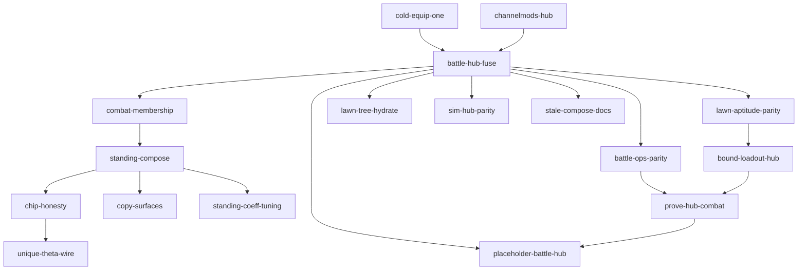

# Capability map: actor-hub-and-combat-power-solid-fixing

**Status:** Phase 0 map **approved**; specs **approved**; **plan written** — [tasks/actor-hub-and-combat-power-solid-fixing-plan.md](../../tasks/actor-hub-and-combat-power-solid-fixing-plan.md) · [todo](../../tasks/actor-hub-and-combat-power-solid-fixing-todo.md). World combat **out of scope** (track `world-actor-combat`). Fuse-first. Stub ideal **B1–B4 locked**.  
**Program id:** `actor-hub-and-combat-power-solid-fixing`  
**Ideal:** [combat-power-number-ideal.md](combat-power-number-ideal.md) (combat power / one-compose, Q1 accepted) · [actor-hub-and-combat-power-solid-fixing-ideal.md](actor-hub-and-combat-power-solid-fixing-ideal.md) (stub hygiene)  
**ADR:** `decisions.md` ActorHub sole Hot compose gate (dual-compose overturn) · **SOLID non-negotiable**  
**Procedure:** [spec-driven-development](../../.claude/skills/spec-driven-development/SKILL.md)  
**Plans (after `/plan`):** `tasks/actor-hub-and-combat-power-solid-fixing-plan.md` · `tasks/actor-hub-and-combat-power-solid-fixing-todo.md`  
**DESIGN-GATE:** Stats · ActorHub · SOLID §2.15 · power ladder · effect-atom Standing · Funnel/Writer (Bound loadout Wave 3) · World assault **out of scope** (track only)

---

## ASSUMPTIONS (correct now or these stand)

1. Ideal one-compose SSOT, Standing D2/D3, mandatory fuse (Q6), SOLID hard rule — **accepted**.
2. **Wave 1 = fuse first.** Do not ship Standing/chip/copy/lawn honesty before dual compose is retired (or sequenced so those modules only contribute/consume Hub).
3. **Q5 full membership** — breaking OK; fix stale dependents after Hub foundation (they fail to build).
4. **Q7 stub is debt** — Cold equip: rolled/atom path; Wave 5 deletes stub catalog as usable SSOT.
5. Lawn Bound UniqueCreature implementation stays [`aptitude-sheet/spec-unique-lawn-wire.md`](aptitude-sheet/spec-unique-lawn-wire.md) — this program adds parity Done criteria only (**no fork**).
6. Standing exclude: `progression.*`, loot/MF/XP class, **`resource.max.*` / `resource.regen.*`**.
7. Standing include: all `IsCombatChannel` (~196) + `skill.cooldown.*` + `skill.effectiveness.*` + `status.power.*` / `status.resist.*` that combat Apply reads.
8. Fuse may move battle/expedition goldens — **one** `RulesetVersion` bump under `battle-hub-fuse` (today `= 4`).
9. D4 per-family Standing coeffs owned by Wave 4 `standing-coeff-tuning` (not optional forever).
10. **World stage + world combat + world actor/force RPG state + intel combat Strength = OUT OF SCOPE.** Wave 5 only **deletes** stubs and **tracks** provisional program id **`world-actor-combat`** (rename at `/idea`). No Hub assault specs in this folder.
11. Existing **world-map-*** programs remain map/UI/runtime owners; they do **not** become the world combat engine by this clearance.
12. Wave 4 closes remaining ideal place-matrix / prove / stale-doc gaps for **lawn/sheet/battle/sim** — not world combat.
13. Further module specs for gaps found after this scope clear are **amended later** — not invented as world-combat work under this id.

---

## What this program is

1. **Retire the SOLID defect** — dual compose (ActorHub vs `BattleStatComposer`) and private ChannelMods combat writers.
2. **One Cold equip path** — rolled / atom bindings; delete stub equip as usable SSOT.
3. **Honest combat power** — Standing via synthetics + full membership filter; chip/copy vocabulary; D4 coeffs (Wave 4).
4. **Lawn / loadout parity** — Bound UniqueCreature + tree hydrate + Bound loadout via Hub (after fuse).
5. **Close non-world place-matrix leftovers** — Sim Full, unique Θ wire, prove scripts, stale dual-compose docs (Wave 4).
6. **Stub hygiene (Wave 5)** — delete PlaceholderBattleResolver / intel Strength fiction / leftover stubs; **track** `world-actor-combat`.

---

## Out of scope (binding)

| Concern | Disposition |
|---|---|
| World / district assault combat engine | Tracked → **`world-actor-combat`** (`/idea` later) |
| World force / actor persistent RPG state (Hub-honest members, campaign wounds, etc.) | Same track |
| Intel force combat Strength / bands as real weight | Same track (this program **drops** stub Strength only) |
| World stage product loops beyond stub delete | Same track / world-map owners as already split |
| PlaceholderV2 / Hp×Level “until later” | **Forbidden** |

---

## Tracked deferred program

| Provisional id | Owns (when idea starts) | Specs now? |
|---|---|---|
| **`world-actor-combat`** | World actor/force state · world/district combat resolve · intel combat weight from that truth | **No** — wait `/idea` → own map/specs |

Pointer only: [actor-hub-and-combat-power-solid-fixing-ideal.md](actor-hub-and-combat-power-solid-fixing-ideal.md) §Layers / B2–B4.

---

## Ownership splits (binding)

| Concern | Owner | Must not |
|---|---|---|
| Star/Loyalty/Zomboss/draught/injury → Hub | `channelmods-hub` | New `BattleChannelMod` producers |
| Cold equip real path; delete stub end-state | `cold-equip-one` | Leave stub as intentional SSOT |
| BattleEngine / delve / siege / web read Hub | `battle-hub-fuse` | Parallel composer; cite old ADR exception |
| Equip ops + tree via Hub | `battle-ops-parity` | Keep battle `ModsFor` ignore-op forever |
| Standing membership list | `combat-membership` | `IsCombatChannel` alone |
| Standing synthetics → Compose | `standing-compose` | Naive Hub snapshot (imports Θ) |
| Chip Lv / Θ copy | `chip-honesty` | Level labeled “power” |
| Combat power = O+S+C | `copy-surfaces` | Omni glance as “the power” |
| Bound lawn UniqueCreature | `aptitude-sheet` `unique-lawn-wire` + `lawn-aptitude-parity` | Second lawn-wire spec |
| Injector tree hydrate | `lawn-tree-hydrate` | Battle-only tree |
| Bound loadout via Hub | `bound-loadout-hub` | Writer-absolute beside Hub |
| Sim Full combat ops | `sim-hub-parity` | Leave Named Partial forever for combat equip |
| D4 Standing coeffs | `standing-coeff-tuning` | Second ladder; bare Policy literals |
| Unique Θ on wire | `unique-theta-wire` | Invent Θ from specimenLevel |
| Stale dual-compose docs | `stale-compose-docs` | Leave “composers stay separate” as law |
| Prove Hub combat | `prove-hub-combat` | Manual-only, no script gate |
| Delete world combat stub + drop intel Strength; track `world-actor-combat` | `placeholder-battle-hub` | Implement world combat / keep Hp×Level |

**ActorHub:** Every combat/derived magnitude **contributes** via `IActorStatSubsystem` / registered atom readers (GG-49 SourceIds) or **consumes** Hub only. Magnitudes are **`long`**; overflow throws.

---

## Modules

| Module id | Responsibility | Depends on | Spec | Wave |
|---|---|---|---|---|
| `channelmods-hub` | Migrate Star/Loyalty/Aptitude/UniqueCreature/Zomboss/Draught/Expedition injury writers to Hub/atoms | — | [spec-channelmods-hub.md](actor-hub-and-combat-power-solid-fixing/spec-channelmods-hub.md) | 1 |
| `cold-equip-one` | Sole Cold equip = rolled atom bindings; retire stub catalog as end-state | — | [spec-cold-equip-one.md](actor-hub-and-combat-power-solid-fixing/spec-cold-equip-one.md) | 1 |
| `battle-hub-fuse` | Retire `BattleStatComposer`; BattleEngine (+ delve/siege/web) compose via ActorHub | channelmods-hub · cold-equip-one | [spec-battle-hub-fuse.md](actor-hub-and-combat-power-solid-fixing/spec-battle-hub-fuse.md) | 1 |
| `battle-ops-parity` | Equip ops match Hub; tree via Hub; retire dead `TreeAtomSource` battle slot | battle-hub-fuse | [spec-battle-ops-parity.md](actor-hub-and-combat-power-solid-fixing/spec-battle-ops-parity.md) | 1 |
| `combat-membership` | Closed Q5 membership filter for Standing | battle-hub-fuse | [spec-combat-membership.md](actor-hub-and-combat-power-solid-fixing/spec-combat-membership.md) | 2 |
| `standing-compose` | HF-standing synthetics + filter → `ActorPowerCache.Compose` | combat-membership | [spec-standing-compose.md](actor-hub-and-combat-power-solid-fixing/spec-standing-compose.md) | 2 |
| `chip-honesty` | HF-chip: `Lv` / optional `Θ` — never level as “power” | standing-compose | [spec-chip-honesty.md](actor-hub-and-combat-power-solid-fixing/spec-chip-honesty.md) | 2 |
| `copy-surfaces` | HF-copy: player “combat power” = O+S+C | standing-compose | [spec-copy-surfaces.md](actor-hub-and-combat-power-solid-fixing/spec-copy-surfaces.md) | 2 |
| `lawn-aptitude-parity` | Done gate for Bound UniqueCreature Hot vs sheet | battle-hub-fuse · unique-lawn-wire | [spec-lawn-aptitude-parity.md](actor-hub-and-combat-power-solid-fixing/spec-lawn-aptitude-parity.md) | 3 |
| `lawn-tree-hydrate` | Injector PassiveTree → Hub | battle-hub-fuse | [spec-lawn-tree-hydrate.md](actor-hub-and-combat-power-solid-fixing/spec-lawn-tree-hydrate.md) | 3 |
| `bound-loadout-hub` | Bound combat via Hub/atoms — not Writer abs | lawn-aptitude-parity | [spec-bound-loadout-hub.md](actor-hub-and-combat-power-solid-fixing/spec-bound-loadout-hub.md) | 3 |
| `sim-hub-parity` | Sim combat Derived Full ops via Hub; retire Named Partial fork | battle-hub-fuse | [spec-sim-hub-parity.md](actor-hub-and-combat-power-solid-fixing/spec-sim-hub-parity.md) | 4 |
| `standing-coeff-tuning` | D4 per-family / category-mask coeffs (dodge → Survivability-weighted) | standing-compose | [spec-standing-coeff-tuning.md](actor-hub-and-combat-power-solid-fixing/spec-standing-coeff-tuning.md) | 4 |
| `unique-theta-wire` | Real `theta` on unique aptitude/GET when available for chip `Θ` | chip-honesty | [spec-unique-theta-wire.md](actor-hub-and-combat-power-solid-fixing/spec-unique-theta-wire.md) | 4 |
| `stale-compose-docs` | Overturn dual-compose / “adapters OK” prose after fuse | battle-hub-fuse | [spec-stale-compose-docs.md](actor-hub-and-combat-power-solid-fixing/spec-stale-compose-docs.md) | 4 |
| `prove-hub-combat` | Script prove: Hub battle ≡ sheet; Standing membership; Bound lawn | Waves 1–3 | [spec-prove-hub-combat.md](actor-hub-and-combat-power-solid-fixing/spec-prove-hub-combat.md) | 4 |
| `placeholder-battle-hub` | **Delete** world combat / intel Strength stubs; track **`world-actor-combat`** — no world combat build | battle-hub-fuse · prove-hub-combat | [spec-placeholder-battle-hub.md](actor-hub-and-combat-power-solid-fixing/spec-placeholder-battle-hub.md) | 5 |

**Still out:** second ladder; PvZ Unity rewrite; aptitude allocate UX; inventing loot/MF families; **entire `world-actor-combat` surface**.

---

## Build order

1. **Wave 1 — SOLID root:** `channelmods-hub` → `cold-equip-one` → `battle-hub-fuse` → `battle-ops-parity`
2. **Wave 2 — Standing honesty:** `combat-membership` → `standing-compose` → (`chip-honesty` ∥ `copy-surfaces`)
3. **Wave 3 — Lawn / loadout:** `lawn-aptitude-parity` → `lawn-tree-hydrate` → `bound-loadout-hub`
4. **Wave 4 — Place-matrix / D4 / prove (non-world):** `sim-hub-parity` ∥ `stale-compose-docs` ∥ (`standing-coeff-tuning` after standing) ∥ (`unique-theta-wire` after chip) → `prove-hub-combat`
5. **Wave 5 — Stub hygiene:** `placeholder-battle-hub` (delete + track `world-actor-combat`) · stub equip delete alignment · fold Level-as-Θ per O2

---

## Done when (program)

- [ ] No production `BattleStatComposer.Compose` under `src/` (guard stays green; allowlist emptied or class deleted).
- [ ] No new private ChannelMods combat writers; known producers migrated to Hub.
- [ ] Cold equip player path uses rolled/atom bindings — stub not the SSOT.
- [ ] Standing includes Hub combat writers via membership filter; chip never labels level “power”.
- [ ] Bound lawn UniqueCreature parity + Bound loadout via Hub.
- [ ] Sim combat ops Full via Hub; D4 coeffs tunable; unique Θ on wire when known; stale dual-compose docs gone.
- [ ] `prove-hub-combat` green.
- [ ] PlaceholderBattleResolver + placeholder intel Strength **deleted**; `world-actor-combat` tracked (no world combat Done claim).
- [ ] Ideal + aptitude-sheet Done checkboxes cross-linked; goldens re-blessed once under fuse bump.

---

## Spec amend queue (after scope clear)

Owner: extend / amend **in-scope** module specs only when gaps appear during review or `/plan`. Do **not** add world-combat modules here.
