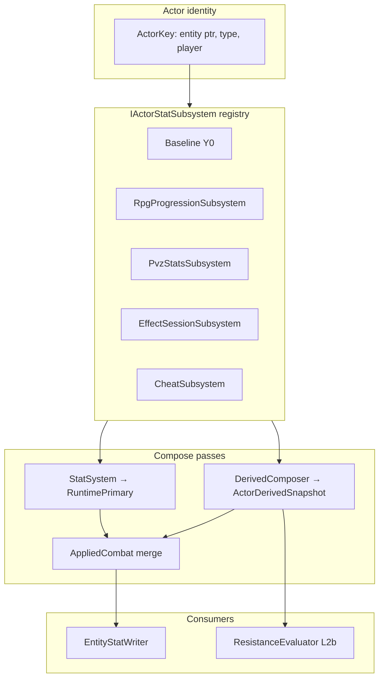

# Actor Hub — derived stats SSOT

**Status:** Design locked (docs). **Shipped** for status-derived channels and `ActorHub` compose (S0–S1, S2–S7 status path). **Overlay combat channels** (`combat.*`) are catalog-reserved — runtime registration and Element Hub integration **deferred** per [combat-element-implement-plan.md](combat-element-implement-plan.md).  
**Parent:** [decisions.md](decisions.md) (ADR rows **Actor Hub SSOT**, **Element Hub SSOT**). Status apply: [status-ssot.md](status-ssot.md) §6. Primary compose: [stat-system.md](stat-system.md). Progression grain: [rpg-progression.md](rpg-progression.md).

---

## 1. Problem

1. [status-ssot.md](status-ssot.md) **L2b ResistanceEvaluator** needs attacker **power** and defender **resist** at Apply — not primary `hp`/`atk`.
2. Progression will add flat combat bonuses — must not mutate vanilla **Y0** or confuse game capture with RPG growth.
3. **StatSystem** today composes only **primary** channels (`hp`, `maxHp`, `atk`, `defense`, armor…). There is no derived layer, no `status.power.*`, no `progression.power`.
4. **Overlay combat channels** (`combat.*`) need catalog registration here; **Element Hub** owns element semantics and matchup matrix — see [element-hub-ssot.md](element-hub-ssot.md) §8.6.

---

## 2. Layer model (locked)



| Layer | Code name | Meaning |
|---|---|---|
| **1 Game base** | `Y0` / `Baseline` | Vanilla Unity capture — **never** progression |
| **2 Runtime primary** | `RuntimePrimary` | `StatSystem` compose: Y0 + cheats + session primary mods |
| **3 Derived** | `ActorDerivedSnapshot` | Progression power tier + status power/resist + future flats |
| **Applied** | `AppliedCombat` | Writer input: `RuntimePrimary + progression.bonus.*` |

**Ban:** progression must never write bare `hp`/`maxHp`/`atk` or mutate Y0. Combat flats use **`progression.bonus.*`** only. Status tier uses **`progression.power`** and **`status.power.*` / `status.resist.*`**.

---

## 3. DerivedStatCatalog SSOT

**Rule:** Every derived channel must be registered in this catalog before use in content, PvzStats rows, status defs, or grant overlays. Unknown channel → reject (same as unknown `statusId` / unknown FA overlay key).

**Do not shrink this list without ADR.** New rows = ADR or explicit catalog appendix PR.

### A. Progression combat bonuses (Applied merge — flat add)

| Channel id | Compose | Default | Cap | Consumer |
|---|---|---|---|---|
| `progression.bonus.maxHp` | flat sum | 0 | — | AppliedCombat |
| `progression.bonus.atk` | flat sum | 0 | — | AppliedCombat |
| `progression.bonus.defense` | flat sum | 0 | — | AppliedCombat / defense view |
| `progression.bonus.arm1` | flat sum | 0 | — | Optional armor split |
| `progression.bonus.arm2` | flat sum | 0 | — | Optional armor split |

### B. Progression power tier (status delta + ApplyScale)

| Channel id | Compose | Default v1 | Consumer |
|---|---|---|---|
| `progression.power` | flat replace | **1.0** (hardcoded stub) | Status delta + dynamic ApplyScale |
| `progression.realm` | flat replace | **1.0** (stub) | Future breakthrough multiplier |

**Grain:** `(player_id, kind, type_id)` from [rpg-progression.md](rpg-progression.md) — plant/zombie type level today; player actor optional summoner-wide omni later.

**v1 stub contract:**

```text
// RpgProgressionSubsystem — until power system ADR
progression.power(actor) = ProgressionPowerStub.Default   // 1.0

// Future replace hook (document interface; no impl in Actor Hub v1 code plan):
IProgressionPowerProvider.UpdatePower(ActorKey, level, realm?) → progression.power
```

Hardcoded stub keeps StatusRuntime / Actor Hub testable before level→power curves exist. **`RpgXpPowerScale`** remains XP-only — do not conflate with combat `progression.power`.

**Tier power (locked):** use **`progression.tierPower = progression.power × progression.realm`** everywhere `progression.power` appears in delta and ApplyScale formulas. v1 stub: both **1.0** → `tierPower = 1.0`.

### C. Status attacker power (attacker ActorPtr at Apply)

| Channel id | Compose | Default | Cap | Consumer |
|---|---|---|---|---|
| `status.power.omni` | Σ Increased | **0** | MaxNetFactor | Omni baseline — adds to every category total |
| `status.power.dot` | Σ Increased | **0** | MaxNetFactor | DoT / overlay pulse family |
| `status.power.cc` | Σ Increased | **0** | MaxNetFactor | CC family |
| `status.power.contagion` | Σ Increased | **0** | MaxNetFactor | Spread re-Apply |
| `status.power.{statusId}` | Σ Increased | 0 | MaxNetFactor | Per-id override (sparse) |

**Combine rule:** `totalPower = tierPower(attacker) + power.omni + power.{category} + power.{statusId}` — **add only**, never multiply omni × category.

### D. Status defender resist (host at Apply)

| Channel id | Compose | Default | Cap | Consumer |
|---|---|---|---|---|
| `status.resist.omni` | Σ Increased | **0** | **none** (balance knob) | Omni baseline — blocks weak applies without specific resist |
| `status.resist.dot` | Σ Increased | 0 | **0.95** | Category resist |
| `status.resist.cc` | Σ Increased | 0 | 0.95 | Category resist |
| `status.resist.contagion` | Σ Increased | 0 | 0.95 | Category resist |
| `status.resist.{statusId}` | Σ Increased | 0 | 0.95 | Per-id override (sparse) |
| `status.immune.{tag}` | max-priority flag | 0 | 1 | Complete block before net |
| `status.immuneReduction.{tag}` | max reduction | 0 | 1 | Partial block — scales netFactor (see §4) |

**Combine rule:** `totalResist = tierPower(defender) × ResistFromPowerRatio + resist.omni + resist.{category} + resist.{statusId}` — category slices capped at **`StatusPolicy.CategoryResistCap` (0.95)** before sum; omni uncapped.

**v1 stub:** `ResistFromPowerRatio = 0` — progression contributes to attacker power and ApplyScale only until resist-from-level is designed.

### E. Overlay combat channels (catalog + runtime shipped)

Normative channel list and omni rule: [element-hub-ssot.md](element-hub-ssot.md) §6.

**Ownership split:**

| Concern | Owner |
|---|---|
| Channel id registration and validation | **Actor Hub** (this catalog) — **shipped C0** |
| Element roster, typing rules, matchup matrix | **Element Hub** spec — **shipped C1** |
| Hit/crit/damage formulas | **Overlay combat** spec — **shipped C2** (flag-gated C3) |

**40 channels (v1):** `combat.power.*`, `combat.defense.*`, `combat.crit.rate.*`, `combat.crit.resist.*`, `combat.crit.damage.*`, `combat.crit.resist.damage.*`, `combat.accuracy.*`, `combat.dodge.*` — each with `omni` + `fire|ice|air|earth`.

**Actor type metadata (not derived channels):** `element.type.primary`, `element.type.secondary` — validated per Element Hub §5.

Implement checklist: [combat-element-implement-plan.md](combat-element-implement-plan.md) — **C0–C4 shipped 2026-08-19**.

### F. Other reserved stubs (not v1 gameplay)

| Channel id | Notes |
|---|---|
| `status.expose.{category}` | Future vulnerability hook |

**Catalog count (status v1 locked):** 5 progression bonus + 2 tier + 4 power categories + 2 sparse power + 4 resist categories + 2 sparse resist + 2 immune patterns + reserved stubs above = **23 named status patterns** (excluding `{statusId}` / `{tag}` expansions). Overlay combat adds **40** additional reserved channels when C0 lands.

**Ban:** `totalPower = omni × category` or `totalResist = omni × category` — **forbidden** (Chaos Omni additive-only).

Category mapping: normative **StatusId → category** table in [status-ssot.md §9.5](status-ssot.md).

---

## 4. Two-phase status resolve (ResistanceEvaluator)

Design reference: Chaos Element Core probability + status-core apply order — see [../research/status-core-chaos-mapping.md](../research/status-core-chaos-mapping.md), [../research/actor-core-chaos-mapping.md](../research/actor-core-chaos-mapping.md).

**Fusion differs from Chaos on ApplyScale binding** — see §5.

**Skip v1 (research only):** Chaos intensity ODE (`dI/dt = α·Δ − β·I`), refractory curves, per-element fixed `trigger_scale` as product lock.

### Apply pipeline (locked order)

```text
Apply(hostPtr, statusId, baseMagnitude, baseDuration):
  Validate def + family mutex
  → Complete immunity (status.immune.{tag}) → Resisted
  → Resolve attacker + defender ActorDerivedSnapshot
  → Compute delta, netFactor = clamp(delta, Min, Max)
  → Partial immunity: netFactor *= (1 - status.immuneReduction.{tag}) per matching tag
  → if netFactor <= 0 → Resisted (reason: potency_floor) — skip sigmoid roll
  → Phase 1: p_final = grant.chance × sigmoid(delta / effectiveApplyScale); roll
  → Phase 2: effectiveMagnitude = base × netFactor; effectiveDuration = base × netFactor
  → If effective duration/magnitude useless → Resisted
  → Else create/refresh instance (snapshot at Apply v1)
```

Grant `chance` defaults to **1.0** when omitted — [effect-data.md](effect-data.md).

### Phase 1 — Will it apply? (sigmoid roll)

```text
tierPower(actor) = progression.power(actor) × progression.realm(actor)

totalAttackerPower = tierPower(attacker) + status.power.omni + status.power.{category} + status.power.{statusId}
totalDefenderResist = tierPower(defender) × ResistFromPowerRatio
                    + status.resist.omni + status.resist.{category} + status.resist.{statusId}

delta = totalAttackerPower - totalDefenderResist

matchPower = avg(tierPower(attacker), tierPower(defender))

effectiveApplyScale = max(
  StatusPolicy.ApplyScaleFloor,
  StatusPolicy.ApplyScaleK.{category} × matchPower   // fallback: ApplyScaleK when category override absent
)

p_apply = sigmoid(delta / effectiveApplyScale)
p_final = grant.chance × p_apply
```

**Potency-floor short-circuit:** when `netFactor <= 0` after partial immunity, **do not roll** — emit `debug.status.resisted` with `reason: potency_floor`.

**v1 with stub:** `matchPower = 1.0` → `effectiveApplyScale = 100`.

Optional steepness: `custom_sigmoid(delta / effectiveApplyScale, StatusPolicy.ApplySteepness.{category})`.

### Phase 2 — How strong / long? (linear netFactor)

**Do not** use `p_apply` for potency — apply uses sigmoid; potency uses linear netFactor.

```text
netFactor = clamp(delta, StatusPolicy.MinNetFactor, StatusPolicy.MaxNetFactor)

effectiveMagnitude = baseMagnitude × netFactor
effectiveDuration  = baseDuration  × netFactor
pulseDamage        = instance.effectiveMagnitude   // per tick; net snapshotted at Apply v1
```

**Defaults (v1 infra):** `tierPower = 1.0`, `status.power.* = 0`, `status.resist.* = 0`, `ResistFromPowerRatio = 0` → matched stub actors have **`delta = 0`**.

**Even-match potency special case:** when `delta = 0` exactly, **`netFactor = 1.0`** for potency (full base magnitude/duration if apply roll succeeds). When **`delta < 0`**, clamp → **`netFactor <= 0`** → **potency_floor short-circuit** (skip sigmoid roll).

### Roles at Apply

| Actor | Derived inputs |
|---|---|
| **Attacker** (`ActorPtr` / grant source) | `tierPower`, `status.power.omni`, `status.power.{category}`, optional `status.power.{statusId}` |
| **Defender** (status host / `TargetPtr`) | `tierPower`, `status.resist.omni`, `status.resist.{category}`, optional `status.resist.{statusId}`, `status.immune.{tag}`, `status.immuneReduction.{tag}` |
| **Attacker-less** (no ActorPtr — environmental / match-wide spread) | `tierPower = 1.0` stub; **`status.power.* = 0`** (not category defaults) |

Immunity (complete) → `Resisted` before delta. Partial immunity → multiply netFactor by `(1 - reduction)`.

**Apply-time snapshot (v1):** store effective magnitude/duration on instance; pulses use stored values.

### Worked examples

**Rot vs omni resist:**

```text
Attacker: tierPower=1, power.rot=100 → totalPower=101
Defender: tierPower=1, resist.omni=1_000_000 → totalResist=1_000_000
delta = -999_899 → netFactor clamped ≤ 0 → Resisted (potency_floor, skip roll)
```

**Even match (stub, apply chance):**

```text
Matched stub actors, no gear → delta = 0
effectiveApplyScale = 100 → p_apply ≈ 50%
netFactor = 1.0 (delta = 0 special case for potency)
```

### Golden numeric table (prove aid)

**Apply chance (`effectiveApplyScale = 100`):**

| delta | p_apply (approx) |
|---|---|
| −1500 | ~0% |
| 0 | ~50% |
| 50 | ~62% |
| 1500 | ~100% |

**Apply chance (post-power example, scale = 425_000):**

| delta | p_apply (approx) |
|---|---|
| 1500 | ~50.4% |

**Potency (`MinNetFactor = 0`, delta = 0 → netFactor = 1.0 special case):**

| delta | netFactor (potency) | Notes |
|---|---|---|
| −10 | 0 | potency_floor → skip roll |
| 0 | 1.0 | even match special case |
| 50 | 50 | linear until MaxNetFactor cap |

---

## 5. Dynamic ApplyScale (Fusion lock vs Chaos)

| | Chaos | Fusion (locked) |
|---|---|---|
| Sigmoid divisor | Fixed `trigger_scale` / `status_scaling_factor` (~50–100) per element | **`effectiveApplyScale = max(Floor, K × avg(tierPower))`** |
| Progression magnitude | `element_mastery` / `power_scale` from level × realm → feeds **delta** | **`tierPower`** feeds **both delta and ApplyScale** |
| v1 until power system | N/A | **Hardcoded `progression.power = 1.0`**; replace via `IProgressionPowerProvider` when power ADR lands |

Chaos level/realm curves are **reference for future `UpdatePower`** — not the ApplyScale binding itself. See [../research/actor-core-chaos-mapping.md](../research/actor-core-chaos-mapping.md).

### StatusPolicy keys (design defaults)

| Policy key | Default | Role |
|---|---|---|
| `StatusPolicy.ApplyScaleK` | 100 | Default multiplier on `matchPower` |
| `StatusPolicy.ApplyScaleK.{category}` | — | Optional per-category override (dot/cc/contagion) |
| `StatusPolicy.ApplyScaleFloor` | 1.0 | Minimum divisor |
| `StatusPolicy.ApplySteepness.{category}` | 1.0 | Optional custom_sigmoid |
| `StatusPolicy.CategoryResistCap` | 0.95 | Cap per `status.resist.{category}` slice before sum |
| `StatusPolicy.ResistFromPowerRatio` | 0 (v1 stub) | Defender resist from `tierPower` |
| `StatusPolicy.MinNetFactor` | 0 | Potency floor (see delta = 0 special case) |
| `StatusPolicy.MaxNetFactor` | — | Potency cap (TBD balance) |
| `ProgressionPowerStub.Default` | 1.0 | Hardcoded until power system |

**Deprecated alias:** `ResistanceCap` → use **`CategoryResistCap`** (subtractive model caps slices, not a single `(1 - resist)` multiplier).

---

## 6. Subsystem registry (design)

| Subsystem | Order | Primary | Derived v1 |
|---|---|---|---|
| `baseline` | 0 | Y0 in context | — |
| `rpg.progression` | 100 | no-op | Sets **`progression.power = 1.0`** stub; **`UpdatePower` hook reserved** |
| `pvz.stats` | 250 | existing plugin | rows on catalog channels when present |
| `foundation.effect` | 350 | session bag | future timed derived |
| `cheat.*` | 900+ | existing | debug derived optional |

Multi-progression: **`IProgressionSubsystem`** hook reserved; v1 registers **RpgProgression only**.

Future: `RpgProgressionSubsystem` reads SQLite `rpg_actor_progression.level` for `(player_id, plant|zombie, type_id)` bound to entity, computes power via documented curve, calls `UpdatePower`.

---

## 7. Integration with StatSystem

**StatSystem** remains SSOT for **primary** compose. **ActorHub** wraps Resolve:

```text
ActorHub.Resolve(entityKey):
  RuntimePrimary = StatSystem.Resolve(entityKey)
  Derived        = DerivedComposer.Compose(subsystems → catalog channels)
  AppliedCombat  = RuntimePrimary + progression.bonus.* (Applied merge only)
  return (RuntimePrimary, Derived, AppliedCombat)
```

- **EntityStatWriter** consumes **AppliedCombat** for HP/ATK writes (`progression.bonus.*` only from derived — not `status.power.*`).
- **ResistanceEvaluator** consumes **Derived** snapshots for attacker + defender at Apply.
- **PvzStats** may upsert modifiers on any **catalog** channel — validation rejects unknown ids.

### Derived snapshot lifecycle (locked)

| When | Behavior |
|---|---|
| **v1 Status Apply** | Compose derived **on each Apply/Refresh** for attacker ptr + defender ptr — no cross-match persistence |
| **Future cache** | Per `entity:{ptr}` cache invalidated on `StatSystem.Invalidate`, PvzStats revision bump, progression level change |
| **Ban** | Persist derived snapshot or AppliedCombat to SQLite as SSOT |

ActorHub may resolve primary stats for Writer on a different cadence than derived compose for Status Apply — derived for L2b is **Apply-scoped** in v1.

---

## 8. Ban list

- Never mutate Y0 with progression or runtime mods
- Progression combat flats use `progression.bonus.*` only — not primary hp/atk channels
- Do not wire level→damage silently; `progression.power` is catalog derived only
- Do not persist AppliedCombat or derived snapshot as SSOT
- No derived channel outside **DerivedStatCatalog**
- **Never multiply omni × category** for status power/resist totals
- Do not use fixed-only ApplyScale as Fusion product lock (Chaos fixed scale is reference only)
- No runtime YAML derived loader v1
- **StatusRuntime code must not ship** before Actor Hub derived resolve + `progression.power` stub channel exist
- Do not conflate `RpgXpPowerScale` (kill XP audit) with combat `progression.power`

---

## 9. Migration from flat StatSystem

| Today | After Actor Hub code |
|---|---|
| Resistance tags undocumented / missing | Catalog channels + DerivedComposer defaults |
| Status-ssot §6 defender-only `(1 - resist)` | Two-phase resolve: sigmoid apply + linear potency |
| No progression power at Apply | `progression.power = 1.0` stub via RpgProgressionSubsystem |
| EntityApply → StatSystem only | EntityApply → ActorHub.Resolve → Writer + status consumer |

---

## 10. Architecture audit (locked resolutions)

### Strengths (keep)

1. **Catalog SSOT** — unknown derived channel rejected like unknown `statusId`.
2. **Stub unblock** — `tierPower = 1.0` hardcoded lets StatusRuntime code plan proceed before power ADR.
3. **Chaos-aligned two-phase** — sigmoid apply vs linear potency; omni additive-only.
4. **Dynamic ApplyScale** — self-normalizes high-tier fights without copying fixed `trigger_scale`.

### Risks and mitigations

| Risk | Mitigation |
|---|---|
| Default math drift (category power 1.0) | **Locked to 0** — neutral stub `delta = 0` when gearless |
| Dynamic ApplyScale at high tier | Golden table + optional `ApplyScaleK.{category}` override |
| PvzStats on derived channels | Catalog validation in code plan; primary SSOT unchanged |
| UniqueActor vs type power | Open question — v1 stub masks; see §11 |
| `delta = 0` potency edge | Explicit **netFactor = 1.0** special case |

### Debates resolved

| Question | Decision |
|---|---|
| Fixed vs dynamic ApplyScale? | **Dynamic** `K × avg(tierPower)` — Chaos fixed scale is reference only |
| Category power default? | **0** (not 1.0 baseline competence) |
| Roll when netFactor ≤ 0? | **No** — potency_floor short-circuit before sigmoid |
| `progression.realm` in v1? | Catalog stub; **`tierPower = power × realm`** in all formulas |

---

## 11. Open questions (document only)

2. Mid-duration derived refresh when buff expires — snapshot at Apply v1; re-eval per tick open.
3. `MaxNetFactor` balance cap — TBD when power ADR lands.

Unique specimen vs type power: see [unique-actor-runtime.md](unique-actor-runtime.md) — v1 stub masks precedence.

---

## 12. Sequencing

```text
This spec (docs):     actor-hub-ssot.md + amendments
Status implement:     actor-hub-status-implement-plan.md (S0–S7 shipped)
Overlay combat next:  combat-element-implement-plan.md (C0–C4 deferred)
Later:                P1 Power ADR → UpdatePower from level/realm
Separate ADR:         P2 progression.bonus.* combat flats
```

**Status path:** [status-ssot.md](status-ssot.md) — **shipped** in Core + Injector (S0–S7).  
**Overlay combat path:** [element-hub-ssot.md](element-hub-ssot.md) + [combat-damage-ssot.md](combat-damage-ssot.md) — design locked; code in [combat-element-implement-plan.md](combat-element-implement-plan.md).

---

## 13. Related docs

- [actor-hub-status-implement-plan.md](actor-hub-status-implement-plan.md) — S0–S7 implement checklist, prove gates
- [status-ssot.md](status-ssot.md) — L2 StatusRuntime, L2b ResistanceEvaluator consumer
- [combat-element-implement-plan.md](combat-element-implement-plan.md) — overlay combat + Element Hub code plan (C0–C4)
- [element-hub-ssot.md](element-hub-ssot.md) — element typing and combat-element derived channels for overlay damage
- [combat-damage-ssot.md](combat-damage-ssot.md) — overlay combat consumer of derived combat and element channels
- [stat-system.md](stat-system.md) — primary Y0 + compose (unchanged ownership)
- [rpg-progression.md](rpg-progression.md) — type actor grain, power stub vs XP scale
- [pvz-stats.md](pvz-stats.md) — may contribute catalog channels; not progression power SSOT
- [../research/actor-core-chaos-mapping.md](../research/actor-core-chaos-mapping.md) — level/realm borrow
- [../research/status-core-chaos-mapping.md](../research/status-core-chaos-mapping.md) — apply pipeline borrow

