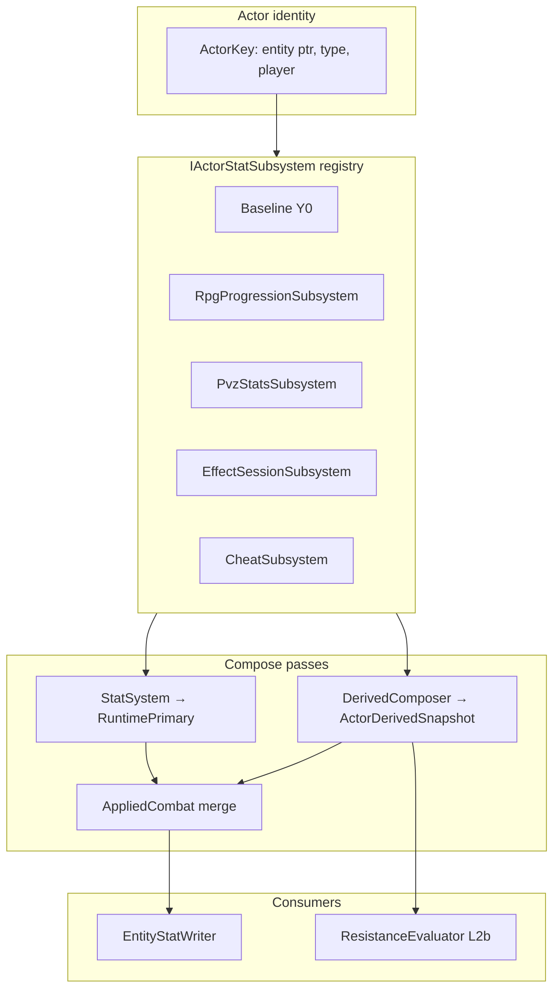

# Actor Hub — derived stats SSOT

**Status:** Design locked (docs). **Shipped:** status-derived channels and `ActorHub` compose (S0–S1, S2–S7), **and all 84 `combat.*` channels** — runtime registration and Element Hub integration landed with C0–C4 on 2026-08-19, and the four `combat.shield.*` families with the shield program.

> **Refreshed 2026-08-22.** This header previously read *"Overlay combat channels are catalog-reserved — runtime registration and Element Hub integration deferred"*, which had been untrue since C0 shipped. §3.E also understated the catalog as 40 channels over 4 elements when it is 84 over 6. Both corrected. The trigger for the sweep was a new combat feature set — [battle-timeline](battle-timeline-map.md), [action](action-map.md), [effect-atom](effect-atom-map.md), [resource-hub](resource-hub-ideal.md) — every one of which reads or writes this catalog, so a stale SSOT here becomes a wrong assumption in four programs at once. New consumers are named in §2.1, unregistered producers in §6.1, and proposed `resource.*` channels in §3.G.

**Parent:** [decisions.md](decisions.md) (ADR rows **Actor Hub SSOT**, **Element Hub SSOT**). Status apply: [status-ssot.md](status-ssot.md) §6. Primary compose: [stat-system.md](stat-system.md). Progression grain: [rpg-progression.md](rpg-progression.md).

---

## 1. Problem

1. [status-ssot.md](status-ssot.md) **L2b ResistanceEvaluator** needs attacker **power** and defender **resist** at Apply — not primary `hp`/`atk`.
2. Progression will add flat combat bonuses — must not mutate vanilla **Y0** or confuse game capture with RPG growth.
3. **StatSystem** today composes only **primary** channels (`hp`, `maxHp`, `atk`, `defense`, armor…). There is no derived layer, no `status.power.*`, no `progression.power`.
4. **Overlay combat channels** (`combat.*`) need catalog registration here; **Element Hub** owns element semantics and matchup matrix — see [element-hub-ssot.md](element-hub-ssot.md) §8.6.

---

## 2. Layer model (locked)



| Layer | Code name | Meaning |
|---|---|---|
| **1 Game base** | `Y0` / `Baseline` | Vanilla Unity capture — **never** progression |
| **2 Runtime primary** | `RuntimePrimary` | `StatSystem` compose: Y0 + cheats + session primary mods |
| **3 Derived** | `ActorDerivedSnapshot` | Progression power tier + status power/resist + future flats |
| **Applied** | `AppliedCombat` | Writer input: `RuntimePrimary + progression.bonus.*` |

**Ban:** progression must never write bare `hp`/`maxHp`/`atk` or mutate Y0. Combat flats use **`progression.bonus.*`** only. Status tier uses **`progression.power`** and **`status.power.*` / `status.resist.*`**.

### 2.1 Consumers — corrected 2026-08-22

The diagram above shows two consumers, which was true when it was drawn. It has been overtaken twice: once by overlay combat and shields shipping, and again by the combat feature set designed in 2026-08 (timeline kernel, action layer, atoms, resources). The catalog is the contract those all read, so it has to name them.

| Consumer | Reads | State |
|---|---|---|
| `EntityStatWriter` | `AppliedCombat` | Shipped |
| `ResistanceEvaluator` (L2b) | `status.power.*` / `status.resist.*` | Shipped |
| **Overlay combat** (`CombatDerivedReader`) | the 8 non-shield `combat.*` families | **Shipped — was missing from this doc** |
| **`ShieldRuntime`** | `combat.shield.capacity/toughness/pen/regen` | **Shipped — was missing from this doc** |
| Readiness / turn kernel | `turn.speed`, `turn.haste`, `turn.moveSpeed` | Designed; **channels not registered** — §11.4. Corrected 2026-08-24 (element-families, T3.1) — this row named only two; there are three, all declared on `DerivedTurnChannels` |
| Action costs | `resource.max.*`, `resource.regen.*` | Designed; **channels not registered** — §3.G |
| Exhaustion debuffs | writes derived mods, reads nothing | Designed — §3.G |

Owning docs for the designed rows: [battle-timeline-map.md](battle-timeline-map.md), [action-map.md](action-map.md), [resource-hub-ideal.md](resource-hub-ideal.md), [effect-atom-map.md](effect-atom-map.md).

---

## 3. DerivedStatCatalog SSOT

**Rule:** Every derived channel must be registered in this catalog before use in content, PvzStats rows, status defs, or grant overlays. Unknown channel → reject (same as unknown `statusId` / unknown FA overlay key).

**Do not shrink this list without ADR.** New rows = ADR or explicit catalog appendix PR.

### A. Progression combat bonuses (Applied merge — flat add)

| Channel id | Compose | Default | Cap | Consumer |
|---|---|---|---|---|
| `progression.bonus.maxHp` | flat sum | 0 | — | AppliedCombat |
| `progression.bonus.atk` | flat sum | 0 | — | AppliedCombat |
| `progression.bonus.defense` | flat sum | 0 | — | AppliedCombat / defense view |
| `progression.bonus.arm1` | flat sum | 0 | — | Optional armor split |
| `progression.bonus.arm2` | flat sum | 0 | — | Optional armor split |

### B. Progression power tier (status delta + ApplyScale)

| Channel id | Compose | Default v1 | Consumer |
|---|---|---|---|
| `progression.power` | flat replace | **Θ** from `IPowerIndexProvider.ActorIndex` — **0** when un-hydrated (`StubPowerIndexProvider`, the default) | Status delta + dynamic ApplyScale |
| `progression.realm` | flat replace | **1.0** (stub, permanent — SSOT: additive in `Θ`, never a contest multiplier) | Future breakthrough multiplier |

**Grain:** `(player_id, kind, type_id)` from [rpg-progression.md](rpg-progression.md) — plant/zombie type level today; player actor optional summoner-wide omni later.

**Contract (power-plan.md T3.2, shipped 2026-08-24):**

```text
// RpgProgressionSubsystem
progression.power(actor) = powerIndexProvider.ActorIndex(ctx)   // Θ; 0 if no provider hydrated it
progression.realm(actor) = StatusPolicy.ProgressionPowerStubDefault   // 1.0, permanent
```

`IPowerIndexProvider` ([power/spec-power-index.md](power/spec-power-index.md)) replaced
`IProgressionPowerProvider` (deleted, T1.4) as the hydration seam. The kill-XP power scale
(`RpgXpAwardMap.Award.PowerScale`; its old carrier class `RpgXpPowerScale` is deleted, T3.3) stays
XP-only — do not conflate with combat `progression.power`.

**Tier power (locked):** use **`progression.tierPower = progression.power × progression.realm`**
everywhere `progression.power` appears in delta and ApplyScale formulas. Un-hydrated default:
`0 × 1.0 = 0` — a real behaviour change from the retired POC curve's `level≤0 → 1.0` special case,
not a stub value chosen independently of it.

> **✅ ADR P1 amended 2026-08-23, built 2026-08-24 (power-todo.md T3.1/T3.2) — this section describes
> what ships now, not a pending change.**
> The POC curve `2^min(level,12)` is **retired and deleted**
> (`ProgressionPowerCurve.cs` is gone): it was geometric on a difference-based contest, and two
> identical level-12 actors measured `netFactor = 4096` (a base-20 status dealing 81,920) before the
> fix. `progression.power` is now **`Θ`** from `IPowerIndexProvider` (linear); `ResistFromPowerRatio`
> moved 0 → 1.0 (T3.1); `effectiveApplyScale` dropped its `× matchPower` (T3.2, audit F3); `netFactor`
> is now `1 + delta/NetFactorScale` (T3.2, audit F4). **`progression.realm` stays 1.0 permanently** —
> realm advancement is additive in `Θ`, never a contest multiplier.
> SSOT: [power/ssot-power-scale.md](power/ssot-power-scale.md) §6 · spec:
> [power/spec-status-contest.md](power/spec-status-contest.md). Full test suite green throughout;
> the one real defect the change surfaced (attacker-less scripted statuses going inert) was found
> and fixed in the same task, not shipped then discovered — see power-todo.md T3.1's evidence.

### C. Status attacker power (attacker ActorPtr at Apply)

| Channel id | Compose | Default | Cap | Consumer |
|---|---|---|---|---|
| `status.power.omni` | Σ Increased | **0** | MaxNetFactor | Omni baseline — adds to every category total |
| `status.power.dot` | Σ Increased | **0** | MaxNetFactor | DoT / overlay pulse family |
| `status.power.cc` | Σ Increased | **0** | MaxNetFactor | CC family |
| `status.power.contagion` | Σ Increased | **0** | MaxNetFactor | Spread re-Apply |
| `status.power.{statusId}` | Σ Increased | 0 | MaxNetFactor | Per-id override (sparse) |

**Combine rule:** `totalPower = tierPower(attacker) + power.omni + power.{category} + power.{statusId}` — **add only**, never multiply omni × category.

### D. Status defender resist (host at Apply)

| Channel id | Compose | Default | Cap | Consumer |
|---|---|---|---|---|
| `status.resist.omni` | Σ Increased | **0** | **none** (balance knob) | Omni baseline — blocks weak applies without specific resist |
| `status.resist.dot` | Σ Increased | 0 | **0.95** | Category resist |
| `status.resist.cc` | Σ Increased | 0 | 0.95 | Category resist |
| `status.resist.contagion` | Σ Increased | 0 | 0.95 | Category resist |
| `status.resist.{statusId}` | Σ Increased | 0 | 0.95 | Per-id override (sparse) |
| `status.immune.{tag}` | max-priority flag | 0 | 1 | Complete block before net |
| `status.immuneReduction.{tag}` | max reduction | 0 | 1 | Partial block — scales netFactor (see §4) |

**Combine rule:** `totalResist = tierPower(defender) × ResistFromPowerRatio + resist.omni + resist.{category} + resist.{statusId}` — category slices capped at **`StatusPolicy.CategoryResistCap` (0.95)** before sum; omni uncapped.

**Corrected 2026-08-25** (adversarial audit, T4.1/T4.2's staleness sweep missed this one occurrence):
`ResistFromPowerRatio` is **`1.0`** (T3.1, `data/tuning/status.v1.json`), not the retired "v1 stub: 0"
this line used to claim — see §3B above and §4's own combine-rule formula, both already correct.
Symmetric contest: `tierPower(defender) × ResistFromPowerRatio` is excluded (0) only for an
attacker-less application, never as a standing default.

### E. Overlay combat channels (catalog + runtime shipped)

Normative channel list and omni rule: [element-hub-ssot.md](element-hub-ssot.md) §6.

**Ownership split:**

| Concern | Owner |
|---|---|
| Channel id registration and validation | **Actor Hub** (this catalog) — **shipped C0** |
| Element roster, typing rules, matchup matrix | **Element Hub** spec — **shipped C1** |
| Hit/crit/damage formulas | **Overlay combat** spec — **shipped C2** (flag-gated C3) |

**Superseded by the line below — kept only as history.** This paragraph originally read "84 channels
— 12 families × (`omni` + 6 elements)" (corrected 2026-08-22 from an even older "40 channels"). The
derived-stats program's H.1 (2026-08-24) registered 16 more families — `penetration`/`absorption`/
`amplification`/`reduction`/`reflect.*`×4/`parry.*`×4/`block.*`×4 (already listed in the table below,
last row) — taking the generated total to **28 families, 196 channels**, per the very next line.

| Families (28) | Elements (7 slots) |
|---|---|
| `combat.power` · `combat.defense` · `combat.crit.rate` · `combat.crit.resist` · `combat.crit.damage` · `combat.crit.resist.damage` · `combat.accuracy` · `combat.dodge` | `omni` + `fire` · `ice` · `air` · `earth` · `light` · `dark` |
| `combat.shield.capacity` · `combat.shield.toughness` · `combat.shield.pen` · `combat.shield.regen` — see [shield-system-spec.md](shield-system-spec.md) §2.3 | same |
| `combat.penetration` · `combat.absorption` · `combat.amplification` · `combat.reduction` · `combat.reflect.resist.rate` · `combat.reflect.rate` · `combat.reflect.resist.damage` · `combat.reflect.damage` · `combat.parry.break` · `combat.parry.rate` · `combat.parry.shred` · `combat.parry.strength` · `combat.block.break` · `combat.block.rate` · `combat.block.shred` · `combat.block.strength` — §H.1, registered (T2, 2026-08-24); semantics in element-families (T3) | same |

**28 families, 196 channels** as of the derived-stats program's H.1 (was 12 / 84). The list is **generated, never hand-listed** — adding an element or a family changes the count by construction, which is why the assertion is on the generated total rather than on a literal list.

**Actor type metadata (not derived channels):** `element.type.primary`, `element.type.secondary` — validated per Element Hub §5.

Implement checklist: [combat-element-implement-plan.md](combat-element-implement-plan.md) — **C0–C4 shipped 2026-08-19**.

### F. Other reserved stubs (not v1 gameplay)

| Channel id | Notes |
|---|---|
| `status.expose.{category}` | Future vulnerability hook |

**Catalog count (status v1 locked):** 5 progression bonus + 2 tier + 4 power categories + 2 sparse power + 4 resist categories + 2 sparse resist + 2 immune patterns + reserved stubs above = **23 named status patterns** (excluding `{statusId}` / `{tag}` expansions). Overlay combat adds **196** (was 84 pre-H.1) — shipped, not reserved (C0 landed 2026-08-19; H.1 landed 2026-08-24).

**Whole-catalog total, corrected 2026-08-25 (was 99, verified 2026-08-22, before the derived-stats
program):** **256 registered channels** — `ShippedFamiliesClassify`/`CatalogResolves256` assert this
exactly. Breakdown: 196 `combat.*` (84 original + H.1's 112) + 24 status constants (8 original + H.2's
16 duration/intensity) + 9 `progression.*` (7 original + H.7's `xpRate`/`breakthroughSuccess`) + 1
healing (H.4) + 15 resource (H.5) + 1 `move.range` (H.6) + 10 action-category (H.3) = 256 — plus the
same five open-ended prefix families the locked 21-status catalog expands by a further 42, unchanged
by any of this.

### G. Resource channels — **registered and composing (H.5/H.6, T4.4, 2026-08-25)**

Superseded 2026-08-25 — this section previously read "PROPOSED, not registered." Registration
happened in Phase 2 (H.5/H.6); T4.4 wired the compose kinds and caps and proved the four properties
below that were previously only asserted as requirements. See
[spec-actor-channels.md](derived-stats/spec-actor-channels.md) for the built module.

Three families over five resource ids, plus `move.range`, giving **16 channels** — not 10: `efficiency`
was added alongside `max`/`regen` (H.5 supersedes the original §3G's count of 10):

| Family | Ids |
|---|---|
| `resource.max.{id}` | `hp` · `stamina` · `hunger` · `spirit` · `qi` |
| `resource.regen.{id}` | same five |
| `resource.efficiency.{id}` | same five — bounded `0..1`, `SumIncreased` + `Cap: DerivedStatPolicy.ResourceEfficiencyCap` (T4.4: `FlatSum` never applies a Cap) |
| `move.range` | one channel, `Pool`, `hp`/faction-independent |

Four properties, now proven rather than merely required:

1. **They form their own family list and never joined `AllCombatChannelIds`** (now asserted at 196, not 84). `ResourceChannelsNotInCombatRoster` (`tests/Stats/ActorChannelsTests.cs`) proves it directly.
2. **They are `rpg.*` layer, not `pvz.*`.** They are not `StatChannels` entries and never reach a Unity field; the only Writer-backed resource is `hp`. This is the layer split in [pvz-middle-layer.md](pvz-middle-layer.md), not a limitation.
3. **Resource *values* are not derived channels — the per-actor pool that holds them is a separate module, and it is now BUILT.** Only `max`/`regen`/`efficiency` compose here. **Corrected 2026-08-30:** this line previously claimed *"no runtime tracking class exists yet … building the actual per-actor pool that reads it is a later module's job"*, which has been false since the action-cost work landed and **actively misled a session into reporting 25% of the aptitude surface as inert.** The pool exists and is wired: `Actions/Cost/ActorResourcePools.cs` (with `ResourcePoolState`, `CommanderResourcePools`) holds the values and reads exactly these channels via `Stats/Derived/ResourceChannelReader.cs` (`Max` / `RegenPerTick`); real consumers are `CostLedger`, `PoiseLedger`, `AuraUpkeepDriver`, `UnlockDiscardService`, with persistence in `Data/Sqlite/RpgStore.RunPools.cs`. The lazy `value + rate × (now − lastTick)` resolve described here is what `ActorResourcePools` actually implements, and `LazyValueMatchesTicked` pins the formula (200 actors × 4 regenerating pools would otherwise be 800 recurring scheduled events against a 0.15 ms kernel slice — the reason to do it lazily at all). **Scope note, so this correction is not over-read:** those consumers are action/battle-mode, and PvZ-lawn mode has no action queue by design ([decisions.md](decisions.md), Action model row) — so `resource.*` doing nothing *on the lawn* is the architecture working as specified, not a gap.
4. **Exhaustion debuffs compose through this catalog like any other derived mod** — same four compose kinds, same per-channel caps, no new ordering rule. `FourExhaustionDebuffsStack` now actually runs four simultaneous debuffs (stamina/hunger/spirit/qi) on one actor, including two independent efficiency debuffs stacking past the cap on one pool while the other three are debuffed — the case this section used to flag as untested.

Faction naming (plant `hunger` displays as **Sun**, `qi` as **Yang**; zombie `qi` as **Yin**) is a **display label owned by content**, never a channel id and never a branch in this catalog.

### H. Combat-balance extension — **PROPOSED, not registered**

⚠️ **Nothing in this section is in the catalog.** Same bar as §3G: new rows are an ADR or an explicit
catalog appendix, and per [AGENTS.md](../../AGENTS.md) an architecture change that locks behaviour
needs a [decisions.md](decisions.md) row **first**. Recorded 2026-08-24 so the design is reviewable in
one place. External inventory it was audited against:
[../research/chaos-derived-stats-audit.md](../research/chaos-derived-stats-audit.md).

**157 new named channels; 99 → 256.** The family list for anything element-typed is
[element-hub-ssot.md](element-hub-ssot.md) §6's to own — this section registers, it does not define
semantics (the split in `decisions.md`'s Element Hub row).

**One locked row needs restating, not overturning.** `decisions.md`'s *Element Hub SSOT* row says
**"84 combat derived channels (12 families × roster)"**; §H.1 takes that to 196. The lock's *intent* —
channels are generated from families × roster, never hand-listed — is unchanged and in fact reinforced.
Only the literal count moves, and **R1(a) in §H.8 removes the literal** so it never has to move again.
Reconciliation, not a reversal. Every other disagreement in §H.8 is a one-line doc edit with a
recommendation attached, so nothing here gates drafting the specs.

#### H.0 The counterbalance rule, and the three classes it applies to

**Combat principle (owner, 2026-08-24):** *every combat derived stat is one half of a pair — one side
raises the attacker's result, the other lowers it.* `power ↔ defense`, `accuracy ↔ dodge`,
`crit.rate ↔ crit.resist`, `crit.damage ↔ crit.resist.damage`, `shield.pen ↔ shield.toughness`.

The rule is **specific to contest stats**, and the shipped catalog already proves it: `power ↔ defense`
are paired, while `combat.shield.capacity` and `combat.shield.regen` have no attacker-side counterpart
and never needed one.

**Four classes. Only one of them must be paired.**

| Class | Why | Pair? | Examples |
|---|---|---|---|
| **Contest** — two actors' values meet in one roll or one delta | The delta *is* the mechanic | **Required** | `power ↔ defense`, `accuracy ↔ dodge` |
| **Race** — both actors push the same direction; advantage is *being ahead* | A "counter-speed" stat is just negative speed. The race already counterbalances itself: the opponent's own value is the counter | **Never** | `turn.speed`, `turn.haste`, `skill.cooldown.*` |
| **Pool** — one actor's own capacity or rate | Nothing to contest; depletion is the limit | **Never** | `shield.capacity`, `shield.regen`, `resource.max` |
| **Feeder** — modifies a quantity that is contested **downstream** | The pair is **inherited**, not absent | **Inherited** | see below |
| Non-combat | Rule does not apply | — | `progression.*` |

**Race class (owner, 2026-08-24).** *"Cooldown and speed don't need a pair — it is a speed race, who
is faster has more advantage."* Correct, and it generalises: for any stat where both actors want the
same direction, the opponent's own value already plays the defender's role. Pairing it would mean
shipping a stat whose only purpose is to make an opponent slower, which is what a **status** is for.

**Feeder class, and the exact rule that decides it.** Read the shipped pipeline order in
[combat-damage-ssot.md](combat-damage-ssot.md) §6.7:

```text
powerAdjustedDamage = baseDamage + weightedDelta   ← power − defense lands HERE
finalDamage         = max(0, powerAdjustedDamage)
if crit: finalDamage = finalDamage × critMultiplier_final   ← AFTER mitigation
```

> **A modifier applied *before* mitigation inherits its pair from `defense`. A modifier applied
> *after* mitigation must carry its own.**

That is why `crit.damage` ships with an explicit `crit.resist.damage` and does not simply inherit —
the multiplier lands after the delta, so `defense` never sees it. The rule is not a convention; it is
readable off §6.7, and it decides every future modifier without another debate.

**Pairs are differences, not opposed multipliers.** `delta = attackerSide − defenderSide` fed to the
shipped sigmoid, exactly as `power − defense` already works. This is what lets **both halves stay
uncapped** and still be fair: a capped defender half against an uncapped attacker half is not a
counterbalance, it is a defender-side progression ceiling that loses by construction at high `Θ`.
Two opposed *multipliers* would force exactly that choice; a difference does not. It also satisfies
PS-8 on both halves at once.

**`StatClass` and `UnitClass` are two axes, not two schemes (T0.4).** Everything above — `Contest` ·
`Race` · `Pool` · `Feeder` — answers *does this channel need a counterpart*. It says nothing about *what
arithmetic the channel is or how it renders*; that is [spec-magnitude-and-units.md](../design/spec-magnitude-and-units.md)
§3's ten-class `UnitClass` ledger, each class verified against its consumer in `src/`. Every channel
declares both, neither is inferred from the other, and **no third scheme gets invented on top of
them** — `docs/architecture/derived-stats/spec-stat-taxonomy.md` §2.5 is the normative statement of
this boundary; this paragraph points to it rather than restating it, so it cannot drift a second way.

#### H.1 Element-typed combat families — 16 new families × 7 slots = **112**

Generated over `omni + ElementRoster.Concrete`, exactly like the shipped 12. Never hand-listed.
All 8 pairs are **contest** class, so all 16 halves are magnitudes read as a difference — `long`,
neither side capped, per H.0.

| Raises attacker result | Lowers attacker result | Contest over | Role note |
|---|---|---|---|
| `combat.penetration.*` | `combat.absorption.*` | damage that survives mitigation | standard |
| `combat.amplification.*` | `combat.reduction.*` | final damage multiplier | standard |
| `combat.reflect.resist.rate.*` | `combat.reflect.rate.*` | chance damage bounces back | **inverted** — the *defender* gains |
| `combat.reflect.resist.damage.*` | `combat.reflect.damage.*` | size of the bounce | **inverted** |
| `combat.parry.break.*` | `combat.parry.rate.*` | chance the hit is parried | **inverted** |
| `combat.parry.shred.*` | `combat.parry.strength.*` | how much a parry takes off | **inverted** |
| `combat.block.break.*` | `combat.block.rate.*` | chance the hit is blocked | **inverted** |
| `combat.block.shred.*` | `combat.block.strength.*` | how much a block takes off | **inverted** |

**Six of the eight pairs are role-inverted** — for parry, block and reflection the *defender* is the
one whose stat raises an outcome, and the attacker's half is the one that suppresses it. The
counterbalance rule still holds exactly (one raises, one lowers, same quantity); what flips is which
actor owns which half. Worth stating because the existing naming convention (`resist`, `defense`,
`dodge` = defender) does **not** survive the flip: here `break`/`shred` are the *attacker's*.

Two consequences to carry into the specs:

1. **`block.strength ↔ block.shred` is arithmetically the shipped `shield.toughness ↔ shield.pen`.**
   Different mechanic (a proc on a hit, not a pool), identical contest shape. **Reuse that saturation
   curve** — chip floor `0.10×`, pen cap `3×` ([shield-system-spec.md](shield-system-spec.md) §2.4).
   Two curves for one shape is how three level curves happened.
2. **Reflection needs a loop bound.** Two actors with `reflect.rate > 0` reflect at each other.
   `ProcDepthLimit` (default **6**, `decisions.md` Combat damage SSOT row) is the existing mechanism —
   reflection joins it rather than inventing a second depth counter.

#### H.2 Status potency — 4 families × 4 categories = **16** (+ sparse `{statusId}`)

`status.duration.{omni|dot|cc|contagion}` · `status.durationReduction.*` ·
`status.intensity.*` · `status.intensityReduction.*` — same axis and same combine rule as §3C/§3D.

**This is the gap that most limits status balance today.** §4's Phase 2 scales magnitude and duration
by **one** `netFactor`:

```text
effectiveMagnitude = baseMagnitude × netFactor
effectiveDuration  = baseDuration  × netFactor
```

"Long but weak" and "short but brutal" are currently inexpressible. Splitting them is a change to the
Phase-2 potency contract, not just a catalog addition — it belongs in a status spec, not here.

Open: `status.probability`/`status.resistance` (§3C/§3D) stay **category**-typed while everything in
§H.1 is **element**-typed. After this lands they are the only combat pair that cannot be tuned per
element. Decide: accept the asymmetry, or add element-typed halves (+14).

#### H.3 Action-category families — **10**

New axis, `attack · defense · support · movement · status`. **Must not join `AllCombatChannelIds`** —
same rule as §3G.1; they are not element-typed and would corrupt the generated roster.

| Family | Class | Note |
|---|---|---|
| `skill.cooldown.{category}` | bounded ratio | *how often* — cannot reduce below zero |
| `skill.effectiveness.{category}` | magnitude | *how hard* — uncapped |

Taking only `cooldown` gives builds that get faster but never stronger — the omission
[../research/chaos-derived-stats-audit.md](../research/chaos-derived-stats-audit.md) §8.2 names.
`cooldown` and `effectiveness` are **not** a counterbalance pair with each other, and per Q3 neither
needs one:

- **`skill.cooldown.{category}` is race class** — the opponent's own cooldown is the counter. Pairing
  it would mean a stat whose only job is to slow an enemy, which is a **status**.
- **`skill.effectiveness.{category}` is feeder class** — it scales `baseOverlayDamage` **before** the
  power/defense delta ([combat-damage-ssot.md](combat-damage-ssot.md) §6.7), so `combat.defense`
  already answers it. Applying it after mitigation instead would oblige a `.reduction` half, exactly
  as `crit.damage` was obliged. **It does not, so it must stay pre-mitigation** — that placement is
  the pair, and moving it later is a breaking change, not a refactor.

#### H.4 Healing — **1** (owner decision 2026-08-24: unpaired)

`combat.heal.power` — magnitude, `long`, **`Pool` class, no counterpart.**

Zero `heal*` channels exist in `src/` today; `lifesteal` is an atom only and `leech`'s heal half was
never built ([effect-atom/atom-catalog-ssot.md](effect-atom/atom-catalog-ssot.md) §Partial).

**Owner decision: `heal.power` ships unpaired**, and that reclassifies it. It is not a `Contest` with a
missing half — it is `Pool`, the healer's own output capacity, exactly as `combat.shield.capacity` and
`combat.shield.regen` are the owner's and have never needed counterparts. H.0's pairing requirement
binds `Contest` only, so nothing is being waived.

**This decision dissolves the §4.3 question rather than answering it.** An earlier draft proposed
`heal.power − heal.reduction`, a defender-side term, and flagged that as possibly reopening
[combat-damage-ssot.md](combat-damage-ssot.md) §4.3's locked boundary. With no defender term there is
**no delta on the heal path at all** — just the healer's own magnitude:

```text
effectiveHeal = baseOverlayHeal + heal.power(healer) → Funnel → FA10
```

No matchup, no roll, no opposed term. §4.3 is untouched, and **no `decisions.md` amendment is owed.**

**Anti-heal stays expressible — as a status, not a channel.** Same resolution Q4 gives root and drain:
the counter to a `Pool` is a status that suppresses it. This keeps one way to say "reduce incoming
healing" instead of two.

**Flat, not element-typed** (Q5) — element-typing healing needs a heal-element sub-roster and is its
own design.

#### H.5 Resource — **15** (supersedes §3G's 10)

`resource.max.{id}` · `resource.regen.{id}` · `resource.efficiency.{id}` over the five ids.
`max`/`regen` are magnitudes (`long`); `efficiency` is a bounded ratio.

§3G's four properties all still hold unchanged. `resource.efficiency` is the new third family —
`resource_regeneration` from the external inventory **is** `resource.regen`, not a second thing.

#### H.6 Movement — **1**

`move.range` — cells. Already promised to this section by
[action-map.md:382](action-map.md) (*"Registers in actor-hub-ssot.md §3 with `resource.*`"*), so it
lands with §H.5 rather than waiting on the grid.

`turn.speed` · `turn.haste` · `turn.moveSpeed`
([Battle/Timeline/DerivedTurnChannels.cs](../../src/FusionRpg.Core/Battle/Timeline/DerivedTurnChannels.cs))
stay **out** — declared vocabulary with no reader, owned by the battle stream, registered when that
stream gives them one.

#### H.7 Progression — **2**

`progression.xpRate` (magnitude, uncapped) · `progression.breakthroughSuccess` (bounded ratio).

Two collisions to honour:

- **`xpRate` overlaps `RpgXpAwardMap.Award.PowerScale`**, which §3B already says stays XP-only and must
  not be conflated with combat `progression.power`. The new channel is a **per-actor multiplier layered
  on** it, never a replacement.
- **`breakthroughSuccess` is a roll chance, and what a success grants must be `Θ`, not a multiplier.**
  ADR P1 pins `progression.realm` at **1.0 permanently** because a geometric realm multiplier on a
  difference-based contest measured `netFactor = 4096` (§3B). Realm advancement is additive in `Θ`.

#### H.8 Reconciliation — five docs, five one-line edits, nothing blocked

Each row below is a *reconciliation*, not a gate. The recommended option is stated so the work can
proceed while review happens; none of them is a design unknown.

| # | Doc that disagrees today | Options | Recommended |
|---|---|---|---|
| R1 | [decisions.md](decisions.md) *Element Hub SSOT* row locks **"84 combat derived channels"** | **(a)** restate as *"families × roster, generated — the count is derived, not fixed"* · **(b)** amend the literal to 196 · **(c)** list new families separately | **(a)** — ends the class of problem instead of re-amending on every future family |
| R2 | [element-hub-ssot.md](element-hub-ssot.md) §6 owns the normative family list | add §H.1's 16 families there; this section keeps registration only | same change, one commit |
| R3 | [combat-damage-ssot.md](combat-damage-ssot.md) §5 *"Deferred from Chaos"* names `Penetration`, `Absorption`, `Reflection`, `Parry*`, `Block*` as **not in v1** | **(a)** delete the list · **(b)** retitle it *"v1 shipped / v2 planned"* and move the five | **(b)** — preserves the v1 record, which is what attributes a moved golden |
| R4 | §4's Phase-2 potency uses one `netFactor` for magnitude **and** duration | split into two deltas (§H.2) | belongs to the status spec, not this doc |
| R5 | `DerivedStatDef` stores `double DefaultValue` / `double? Cap` | **`double` stands — corrected 2026-08-24.** An earlier draft of this row recommended widening to `long`; [power/ssot-power-scale.md](power/ssot-power-scale.md) **§10.7 already decided otherwise**, and reading it falsified the recommendation. See below |

**R5 in full, because the first answer was wrong.** §10.7: *"`double` stands in stat composition. The
A7 findings are not defects. What PS-8 and the overflow standard bind is **magnitudes** — the `long`
rule applies to the values composition **produces**, not to the arithmetic that composes ratios."*
`Increased` and `More` are genuinely fractional; composing them in integers would be wrong, not merely
awkward. So `DerivedStatDef` is untouched, and what §H actually owes is three different things:

1. **Declare a class per channel — corrected 2026-08-24.** The line below originally read *"a class per
   channel — `magnitude` · `bounded-ratio` · `structural`"*. That was a **third** classification of a
   thing that already has two, and `spec-stat-taxonomy.md` §2.5 retracted it the same day it was
   written: declare **both** `StatClass` (Contest/Race/Pool/Feeder — does it need a counterpart) and
   `UnitClass` (the ten-class ledger — what arithmetic is it) in the def and in
   [data/seed/derived-stats/catalog.json](../../data/seed/derived-stats/catalog.json). See §H.0's
   boundary paragraph, added the same pass this correction was.
2. **Materialize magnitudes as `long` at the boundary where they leave composition** — the point they
   reach `EntityStatWriter`, a `DamagePacket`, or `BattleRuleset`. That is the "value composition
   produces", and it is where invariant 13 actually binds.
3. **Register every bounded-ratio cap in §11.6** with the exemption comment PS-8 requires. A `0.95`
   with no comment is indistinguishable from a progression ceiling.

§10.7's one exclusion still bites: **a new `double` magnitude *outside* the composition path is A1,
not A7**, and the audit will keep flagging it. That is exactly what item 2 prevents.

Two tests assert the generated roster count and move with R1/R2, as designed:
[DerivedStatRegistryTests.cs:22](../../tests/FusionRpg.Core.Tests/ActorHub/DerivedStatRegistryTests.cs) ·
[ElementRosterDataTests.cs:124-142](../../tests/FusionRpg.Core.Tests/Atoms/ElementRosterDataTests.cs).

#### H.9 Decided — owner approved 2026-08-24

Six questions, all closed. **Every answer cost zero extra channels** — the §H.0 taxonomy did the work
instead of the catalog. Total is **157 new / 256 named** (Q5 dropped `heal.reduction`).

| # | Question | **Decided** |
|---|---|---|
| **Q1** | Status resist axis — category vs element | **Add one term to the combine rule, not 14 channels.** `status.resist.{element}` **already resolves** through the open prefix (`DerivedStatRegistry.TryResolveChannel`, `status.resist.` branch); only the reader is short. A burn tagged `fire` sums `resist.omni + resist.dot + resist.fire + resist.burn` — four already-legal ids. **0 new channels.** |
| **Q2** | Naming the six role-inverted pairs | **Keep the genre names** (`parry.break`, `block.shred`). There was no convention to break — `shield.pen` (attacker) and `shield.toughness` (owner) already ship with neither carrying `resist`. **Populate the seed catalog's `role` field** (`attacker`/`defender`/`owner`) so tooling never parses a name to learn the side. |
| **Q3** | §H.3's 10 action-category families | **Resolved by the taxonomy.** `skill.cooldown.*` is **race** class — unpaired by nature. `skill.effectiveness.*` is **feeder**, applied to `baseOverlayDamage` **before** the power/defense delta, so it inherits its pair from `defense` per H.0's mitigation rule. **10 stays 10.** |
| **Q4** | Resource + `move.range` unpaired | **Pool class — no pair.** The counters are **statuses, not stats**: a root sets `move.range` to 0, a qi-burn drains the pool. This is what `status.expose.*` was reserved for. |
| **Q5** | Healing flat or element-typed | **Flat, and — revised 2026-08-24 — `heal.power` ships _unpaired_.** It is `Pool` class (the healer's own output capacity, like `shield.capacity`), not a `Contest` with a missing half, so H.0's pairing rule is satisfied rather than waived. **This also dissolved a question rather than answering it:** with no defender-side term there is no delta on the heal path, so §4.3's boundary is untouched and no `decisions.md` amendment is owed. **Anti-heal is a status**, per Q4's precedent for root and drain. Element-typing still needs a heal-element sub-roster (light and dark plausibly heal; fire does not) and remains its own future design. **`heal.reduction` dropped: 158 → 157 new, 256 named.** |
| **Q6** | `block.strength ↔ block.shred` duplicates `shield.toughness ↔ shield.pen` | **One shared contest helper, two channel sets.** Modelling block *as* a 1-hit shield is attractive and reuses priorities/stacking/matrix/goldens — but [shield-system-spec.md](shield-system-spec.md) caps **3 shields per actor**, so a per-turn block shield permanently eats a third of every actor's budget and the admission rule would evict real shields. Revisit only if that cap moves. |
| **Q6b** | What bounds a parry/block exchange | **Decided 2026-08-24: the _status_ precedent, not the shield's.** Shield's chip floor exists because a shield is a **pool** that must always spend; a proc has no pool, so **no floor** — a fully shredded block removing zero is a legitimate contest outcome. The ceiling follows `StatusPolicy.CategoryResistCap`: **`950‰`, a block removes at most 95% of a hit, never all of it.** Immunity stays impossible, expressed on the side that has something to protect. Own keys `blockCapPermille` / `parryCapPermille` in `data/tuning/combat.v1.json`, both `950` — they *agree with* the status constant, they do not share it. Neither stat is capped; only the fraction one exchange removes. |

**Ban:** `totalPower = omni × category` or `totalResist = omni × category` — **forbidden** **[Ban removed 2026-09-02 — see `element-hub-ssot.md` §7; the omni combination is a tunable, default still additive.]** (Chaos Omni additive-only).

Category mapping: normative **StatusId → category** table in [status-ssot.md §9.5](status-ssot.md).

---

## 4. Two-phase status resolve (ResistanceEvaluator)

Design reference: Chaos Element Core probability + status-core apply order — see [../research/status-core-chaos-mapping.md](../research/status-core-chaos-mapping.md), [../research/actor-core-chaos-mapping.md](../research/actor-core-chaos-mapping.md).

**Fusion differs from Chaos on ApplyScale binding** — see §5.

**Skip v1 (research only):** Chaos intensity ODE (`dI/dt = α·Δ − β·I`), refractory curves, per-element fixed `trigger_scale` as product lock.

> **Corrected 2026-08-25, verified against shipped code, not inferred.** This section still described
> the retired POC-curve era after T3.2 shipped (2026-08-24) and status-ssot.md §6 was corrected: `matchPower`
> in `effectiveApplyScale` (dropped, audit F3), `netFactor = clamp(delta, Min, Max)` with a `delta = 0`
> special case (the shipped formula is the linear, special-case-free `1 + delta/NetFactorScale`, audit
> F4 — `RedTest_MatchedPairAtTheta12_NetFactorFlips4096To1` asserts the special case is actually absent
> from source), and a golden table computed from the old formula (`delta=50 → netFactor=50`; the
> shipped value is `6.0`, from `data/tuning/status.v1.json`'s `netFactorScale=10`). Below now matches
> `ResistanceEvaluator.cs` and layers **Phase 2's T4.1 split** (spec-status-potency.md) on top: Phase 1's
> `delta` still drives the apply roll unchanged, but potency is now two independent deltas (duration,
> intensity) instead of one shared number.

### Apply pipeline (locked order)

```text
Apply(hostPtr, statusId, baseMagnitude, baseDuration):
  Validate def + family mutex
  → Complete immunity (status.immune.{tag}) → Resisted
  → Resolve attacker + defender ActorDerivedSnapshot
  → Compute delta (Phase 1); netFactor(delta) reported unchanged by the split
  → Compute durationDelta, intensityDelta (Phase 2, T4.1); durationNetFactor = netFactor(durationDelta), intensityNetFactor = netFactor(intensityDelta)
  → Partial immunity: (1 - status.immuneReduction.{tag}) multiplies BOTH durationNetFactor and intensityNetFactor, per matching tag
  → if intensityNetFactor <= 0 → Resisted (reason: potency_floor) — skip sigmoid roll. Zero DURATION alone is instantaneous, not a resist (spec-status-potency.md §2.2)
  → Phase 1: p_final = grant.chance × sigmoid(delta / effectiveApplyScale); roll
  → Phase 2: effectiveMagnitude = base × intensityNetFactor; effectiveDuration = base × durationNetFactor
  → If effective duration/magnitude useless → Resisted
  → Else create/refresh instance (snapshot at Apply v1)
```

Grant `chance` defaults to **1.0** when omitted — [effect-data.md](effect-data.md).

### Phase 1 — Will it apply? (sigmoid roll, unchanged by T4.1)

```text
tierPower(actor) = progression.power(actor) × progression.realm(actor)   // progression.power = Θ, §3B

totalAttackerPower = tierPower(attacker) + status.power.omni + status.power.{category} + status.power.{statusId}
totalDefenderResist = tierPower(defender) × ResistFromPowerRatio   // 1.0 (T3.1); 0 for an
                                                                    // attacker-less application
                    + status.resist.omni + status.resist.{category} + status.resist.{statusId}
                    + status.resist.{element}   // Q1 (T4.1) — status def's own tag; absent -> 0 (T5)

delta = totalAttackerPower - totalDefenderResist

effectiveApplyScale = max(
  StatusPolicy.ApplyScaleFloor,
  StatusPolicy.ApplyScaleK.{category}   // no matchPower scaling (T3.2, audit F3)
)

p_apply = sigmoid(delta / effectiveApplyScale)
p_final = grant.chance × p_apply
```

**Potency-floor short-circuit:** when `intensityNetFactor <= 0` after partial immunity, **do not roll** — emit `debug.status.resisted` with `reason: potency_floor`. Duration hitting the floor alone is instantaneous, not resisted (T4.1, §2.2).

Optional steepness: `custom_sigmoid(delta / effectiveApplyScale, StatusPolicy.ApplySteepness.{category})`.

### Phase 2 — How strong, how long? (two independent linear netFactors, T4.1)

**Do not** use `p_apply` for potency — apply uses sigmoid; potency uses the linear `netFactor`.

```text
netFactor(x) = clamp(1 + x / StatusPolicy.NetFactorScale, StatusPolicy.MinNetFactor, StatusPolicy.MaxNetFactor)

durationDelta  = delta + status.duration.omni  + status.duration.{category}  + status.duration.{statusId}
               - status.durationReduction.omni - status.durationReduction.{category} - status.durationReduction.{statusId}
intensityDelta = delta + status.intensity.omni + status.intensity.{category} + status.intensity.{statusId}
               - status.intensityReduction.omni - status.intensityReduction.{category} - status.intensityReduction.{statusId}

effectiveMagnitude = baseMagnitude × netFactor(intensityDelta)
effectiveDuration  = baseDuration  × netFactor(durationDelta)
pulseDamage        = instance.effectiveMagnitude   // per tick; snapshotted at Apply v1
```

Before T4.1, both lines read the SAME `netFactor`, so a status could not be long-but-weak or
short-but-brutal — the single biggest limit on the status balance surface (spec-status-potency.md §1).
`status.duration.*` / `status.intensity.*` and their `Reduction` siblings follow the identical
omni+category+perId shape as `status.power` / `status.resist` (DerivedStatChannels.cs H.2).

**Defaults (v1 infra):** `status.power.* = 0`, `status.resist.* = 0`, `status.duration.* = 0`,
`status.intensity.* = 0`, and their `Reduction` siblings `= 0` → matched actors give
**`delta = durationDelta = intensityDelta = 0`**, so every status resolves identically to before
T4.1 (spec-status-potency.md §2.2 — the acceptance test).

**No more even-match special case:** `netFactor(x)` is one general linear formula with **no**
`x = 0` branch — it evaluates to `1.0` there because `1 + 0/scale == 1`, not because of a special
case (T3.2, audit F4). When `x` is negative enough, the `clamp` floor (`MinNetFactor = 0`) is what
makes it fully resisted — again not a hardcoded zero.

### Roles at Apply

| Actor | Derived inputs |
|---|---|
| **Attacker** (`ActorPtr` / grant source) | `tierPower`, `status.power.omni`, `status.power.{category}`, optional `status.power.{statusId}`, `status.duration.*`, `status.intensity.*` (T4.1) |
| **Defender** (status host / `TargetPtr`) | `tierPower`, `status.resist.omni`, `status.resist.{category}`, optional `status.resist.{statusId}`, `status.resist.{element}` (T4.1, Q1), `status.immune.{tag}`, `status.immuneReduction.{tag}`, `status.durationReduction.*`, `status.intensityReduction.*` (T4.1) |
| **Attacker-less** (no ActorPtr — environmental / match-wide spread) | `tierPower = 0` (un-hydrated default, §3B — not a `1.0` stub); **`status.power.* = 0`**; defender's own `tierPower × ResistFromPowerRatio` term excluded from `totalDefenderResist` (symmetric contest, T3.1 — a scripted rider has no real attacker side to contest tier power with) |

Immunity (complete) → `Resisted` before delta. Partial immunity → multiply BOTH `durationNetFactor` and `intensityNetFactor` by `(1 - reduction)` (T4.1: blunts a status overall, not one axis).

**Apply-time snapshot (v1):** store effective magnitude/duration on instance; pulses use stored values.

### Worked examples

**Rot vs omni resist:**

```text
Attacker: tierPower=1, power.rot=100 → totalPower=101
Defender: tierPower=1, resist.omni=1_000_000 → totalResist=1_000_000
delta = -999_899 → intensityNetFactor clamped to 0 → Resisted (potency_floor, skip roll)
```

**Even match (stub, apply chance):**

```text
Matched stub actors, no gear → delta = 0
effectiveApplyScale = 100 (ApplyScaleK, no matchPower term) → p_apply ≈ 50%
durationNetFactor = intensityNetFactor = netFactor(0) = 1.0
```

**Long-weak (T4.1):**

```text
Attacker adds status.duration.{statusId}=+15, status.intensity.{statusId}=-5; base delta otherwise 0
durationDelta=15 → durationNetFactor=2.5 (longer)
intensityDelta=-5 → intensityNetFactor=0.5 (weaker)
```

### Golden numeric table (prove aid)

**Apply chance (`effectiveApplyScale = 100`, the shipped `ApplyScaleK` default — `data/tuning/status.v1.json`):**

| delta | p_apply (approx) |
|---|---|
| −1500 | ~0% |
| 0 | ~50% |
| 50 | ~62% |
| 1500 | ~100% |

**Apply chance (post-power example, scale = 425_000):**

| delta | p_apply (approx) |
|---|---|
| 1500 | ~50.4% |

**Potency (`MinNetFactor = 0`, `NetFactorScale = 10` — shipped defaults, `ResistanceEvaluatorTests.Golden_potency_table`):**

| delta | netFactor | Notes |
|---|---|---|
| −10 | 0 | potency floor if this is `intensityDelta` — skip roll |
| 0 | 1.0 | the general formula, not a special case |
| 50 | 6.0 | `1 + 50/10`, not `50` — T3.2 removed the raw-delta cliff (audit F4) |

---

## 5. Dynamic ApplyScale (Fusion lock vs Chaos)

> **Corrected 2026-08-25** — this table and the keys below it still described the pre-T3.2 binding
> after the power program landed (2026-08-24) and §4 above was corrected. Checked against
> `ResistanceEvaluator.cs`, `StatusPolicy.cs`, and `data/tuning/status.v1.json` directly.

| | Chaos | Fusion (locked) |
|---|---|---|
| Sigmoid divisor | Fixed `trigger_scale` / `status_scaling_factor` (~50–100) per element | **`effectiveApplyScale = max(Floor, K.{category})`** — no power scaling (T3.2, audit F3) |
| Progression magnitude | `element_mastery` / `power_scale` from level × realm → feeds **delta** | **`tierPower`** feeds **delta only** — ApplyScale no longer reads it |
| Progression source | Chaos level/realm curves | **`progression.power = Θ`** from `IPowerIndexProvider` (0 if un-hydrated, §3B); **`progression.realm = 1.0`** permanently |

Chaos level/realm curves are **reference for future `UpdatePower`** — not the ApplyScale binding itself. See [../research/actor-core-chaos-mapping.md](../research/actor-core-chaos-mapping.md).

### StatusPolicy keys (design defaults)

| Policy key | Default | Role |
|---|---|---|
| `StatusPolicy.ApplyScaleK` | 100 | Default divisor — no longer a `matchPower` multiplier (T3.2, audit F3) |
| `StatusPolicy.ApplyScaleK.{category}` | — | Optional per-category override (dot/cc/contagion) |
| `StatusPolicy.ApplyScaleFloor` | 1.0 | Minimum divisor |
| `StatusPolicy.ApplySteepness.{category}` | 1.0 | Optional custom_sigmoid |
| `StatusPolicy.CategoryResistCap` | 0.95 | Cap per `status.resist.{category}` slice before sum |
| `StatusPolicy.ResistFromPowerRatio` | **1.0** (T3.1) | Defender resist from `tierPower` — symmetric contest; excluded (0) for an attacker-less application |
| `StatusPolicy.MinNetFactor` | 0 | Potency floor — `netFactor(x)` clamp floor, no `x = 0` special case (T3.2, audit F4) |
| `StatusPolicy.MaxNetFactor` | 10000 | Potency cap |
| `StatusPolicy.NetFactorScale` | 10 | `netFactor(x) = 1 + x / NetFactorScale` (T3.2, audit F4) |
| `StatusPolicy.ProgressionPowerStubDefault` | 1.0 | Backs **`progression.realm`** only, permanently — **not** `progression.power` (that reads `Θ`, §3B) |

**Deprecated alias:** `ResistanceCap` → use **`CategoryResistCap`** (subtractive model caps slices, not a single `(1 - resist)` multiplier).

---

## 6. Subsystem registry (design)

| Subsystem | Order | Primary | Derived v1 |
|---|---|---|---|
| `baseline` | 0 | Y0 in context | — |
| `rpg.progression` | 100 | no-op | Sets **`progression.power = Θ`** via `IPowerIndexProvider` (0 if un-hydrated) and **`progression.realm = 1.0`** permanently (§3B) |
| `pvz.stats` | 250 | existing plugin | rows on catalog channels when present |
| `foundation.effect` | 350 | session bag | future timed derived |
| `cheat.*` | 900+ | existing | debug derived optional |

Multi-progression: **`IProgressionSubsystem`** hook reserved; v1 registers **RpgProgression only**.

### 6.1 Unregistered producers — found 2026-08-22

The table above lists who is *supposed* to write derived channels. A repo sweep for the effect-atom program found **four magnitude sites already writing derived channels with no subsystem row and no opcode**: **patron**, **stars**, **injuries**, and **contracts** (`ContractPolicy` carries rank bonuses, loyalty rates, and per-personality modifiers).

That is the same failure mode §3 exists to prevent, arrived at from the producer side rather than the channel side: the catalog validates *which channel ids* are legal, but nothing validates *who may write them*. Four features grew their own path because there was no opcode to use.

The effect-atom program's `stat.derived` kind exists specifically to give them one — it is the one kind with full runtime support (lawn ✅ battle ✅ sim ✅). When it lands, these four collapse into containers of atoms and become a single registered producer.

| Producer | Writes | State |
|---|---|---|
| patron | derived channels, direct | **Unregistered** — adopts `stat.derived` |
| stars | derived channels, direct | **Unregistered** — adopts `stat.derived` |
| injuries | derived channels, direct | **Unregistered** — adopts `stat.derived` |
| contracts (`ContractPolicy`) | rank bonuses, loyalty rates, personality modifiers | **Unregistered** — adopts `stat.derived` |
| atom compiler | `stat.derived` atoms → derived mods | Designed — [effect-atom-map.md](effect-atom-map.md) E7 |

**Rule to adopt when that lands:** a derived write needs both a registered *channel* and a registered *producer*. Only half of that is enforced today.

Future: `RpgProgressionSubsystem` reads SQLite `rpg_actor_progression.level` for `(player_id, plant|zombie, type_id)` bound to entity, computes power via documented curve, calls `UpdatePower`.

---

## 7. Integration with StatSystem

**StatSystem** remains SSOT for **primary** compose. **ActorHub** wraps Resolve:

```text
ActorHub.Resolve(entityKey):
  RuntimePrimary = StatSystem.Resolve(entityKey)
  Derived        = DerivedComposer.Compose(subsystems → catalog channels)
  AppliedCombat  = RuntimePrimary + progression.bonus.* (Applied merge only)
  return (RuntimePrimary, Derived, AppliedCombat)
```

- **EntityStatWriter** consumes **AppliedCombat** for HP/ATK writes (`progression.bonus.*` only from derived — not `status.power.*`).
- **ResistanceEvaluator** consumes **Derived** snapshots for attacker + defender at Apply.
- **PvzStats** may upsert modifiers on any **catalog** channel — validation rejects unknown ids.

### Derived snapshot lifecycle (locked)

| When | Behavior |
|---|---|
| **v1 Status Apply** | Compose derived **on each Apply/Refresh** for attacker ptr + defender ptr — no cross-match persistence |
| **Future cache** | Per `entity:{ptr}` cache invalidated on `StatSystem.Invalidate`, PvzStats revision bump, progression level change |
| **Ban** | Persist derived snapshot or AppliedCombat to SQLite as SSOT |

ActorHub may resolve primary stats for Writer on a different cadence than derived compose for Status Apply — derived for L2b is **Apply-scoped** in v1.

---

## 8. Ban list

- Never mutate Y0 with progression or runtime mods
- Progression combat flats use `progression.bonus.*` only — not primary hp/atk channels
- Do not wire level→damage silently; `progression.power` is catalog derived only
- Do not persist AppliedCombat or derived snapshot as SSOT
- No derived channel outside **DerivedStatCatalog**
- **Never multiply omni × category** for status power/resist totals **[Ban removed 2026-09-02 — see `element-hub-ssot.md` §7; the omni combination is a tunable, default still additive.]**
- Do not use fixed-only ApplyScale as Fusion product lock (Chaos fixed scale is reference only)
- No runtime YAML derived loader v1
- **StatusRuntime code must not ship** before Actor Hub derived resolve + `progression.power` stub channel exist
- Do not conflate the kill-XP power scale (`RpgXpAwardMap.Award.PowerScale`; formerly `RpgXpPowerScale`, deleted T3.3) with combat `progression.power`

---

## 9. Migration from flat StatSystem

| Today | After Actor Hub code |
|---|---|
| Resistance tags undocumented / missing | Catalog channels + DerivedComposer defaults |
| Status-ssot §6 defender-only `(1 - resist)` | Two-phase resolve: sigmoid apply + linear potency |
| No progression power at Apply | `progression.power = Θ` via `RpgProgressionSubsystem` + `IPowerIndexProvider` (§3B; v1 shipped as a `1.0` stub, since replaced) |
| EntityApply → StatSystem only | EntityApply → ActorHub.Resolve → Writer + status consumer |

---

## 10. Architecture audit (locked resolutions)

### Strengths (keep)

1. **Catalog SSOT** — unknown derived channel rejected like unknown `statusId`.
2. **Stub unblock** — `tierPower = 1.0` hardcoded lets StatusRuntime code plan proceed before power ADR.
3. **Chaos-aligned two-phase** — sigmoid apply vs linear potency; omni additive-only. **[Ban removed 2026-09-02 — see `element-hub-ssot.md` §7; the omni combination is a tunable, default still additive.]**
4. **Dynamic ApplyScale** — self-normalizes high-tier fights without copying fixed `trigger_scale`.

### Risks and mitigations

| Risk | Mitigation |
|---|---|
| Default math drift (category power 1.0) | **Locked to 0** — neutral stub `delta = 0` when gearless |
| Dynamic ApplyScale at high tier | Golden table + optional `ApplyScaleK.{category}` override |
| PvzStats on derived channels | Catalog validation in code plan; primary SSOT unchanged |
| UniqueActor vs type power | Open question — v1 stub masks; see §11 |
| `delta = 0` potency edge | Explicit **netFactor = 1.0** special case |

### Debates resolved

| Question | Decision |
|---|---|
| Fixed vs dynamic ApplyScale? | **Dynamic** `K × avg(tierPower)` — Chaos fixed scale is reference only |
| Category power default? | **0** (not 1.0 baseline competence) |
| Roll when netFactor ≤ 0? | **No** — potency_floor short-circuit before sigmoid |
| `progression.realm` in v1? | Catalog stub; **`tierPower = power × realm`** in all formulas |

---

## 11. Open questions (document only)

2. Mid-duration derived refresh when buff expires — snapshot at Apply v1; re-eval per tick open.
3. `MaxNetFactor` balance cap — TBD when power ADR lands.
4. **Three `turn.*` channels exist in code but are not registered here** (found 2026-08-22; count corrected 2026-08-23 — this read "`turn.speed` / `turn.haste`" and missed **`turn.moveSpeed`**, declared on the same class). `Battle/Timeline/DerivedTurnChannels.cs` declares all three as constants; `DerivedStatRegistry.RegisterDefaults()` does not register them, so the "unknown channel → reject" rule in §3 would fire the moment a `turn.*` modifier reached the compose path. The battle-timeline program's readiness task already carries this as acceptance — *"a `turn.*` modifier through the compose path does not throw"* — with defaults of `turn.speed = 100` and `turn.haste = 1000` (zero would divide-by-zero or mean instant actions). Recorded here because the constants are in `src/` today and this catalog is the thing that decides whether they are legal.
5. **A proportional floor on the turn channels is a correctness requirement, not balance.** Readiness is `work / rate`; as rate approaches zero the arrival tick runs away toward never, which stalls the event queue rather than slowing an actor. `max(1, …)` is not sufficient — rate 1 against a base of 100 is a 100× wait. Relevant to §3.G because exhaustion debuffs are the first mechanic that would drive a turn channel down hard.

Unique specimen vs type power: see [unique-actor-runtime.md](unique-actor-runtime.md) — v1 stub masks precedence.

---

## 12. Sequencing

```text
This spec (docs):     actor-hub-ssot.md + amendments
Status implement:     actor-hub-status-implement-plan.md (S0–S7 shipped)
Overlay combat next:  combat-element-implement-plan.md (C0–C4 deferred)
Later:                P1 Power ADR → UpdatePower from level/realm
Separate ADR:         P2 progression.bonus.* combat flats
```

**Status path:** [status-ssot.md](status-ssot.md) — **shipped** in Core + Injector (S0–S7).  
**Overlay combat path:** [element-hub-ssot.md](element-hub-ssot.md) + [combat-damage-ssot.md](combat-damage-ssot.md) — design locked; code in [combat-element-implement-plan.md](combat-element-implement-plan.md).

---

## 13. Related docs

- [actor-hub-status-implement-plan.md](actor-hub-status-implement-plan.md) — S0–S7 implement checklist, prove gates
- [status-ssot.md](status-ssot.md) — L2 StatusRuntime, L2b ResistanceEvaluator consumer
- [combat-element-implement-plan.md](combat-element-implement-plan.md) — overlay combat + Element Hub code plan (C0–C4)
- [element-hub-ssot.md](element-hub-ssot.md) — element typing and combat-element derived channels for overlay damage
- [combat-damage-ssot.md](combat-damage-ssot.md) — overlay combat consumer of derived combat and element channels
- [stat-system.md](stat-system.md) — primary Y0 + compose (unchanged ownership)
- [rpg-progression.md](rpg-progression.md) — type actor grain, power stub vs XP scale
- [pvz-stats.md](pvz-stats.md) — may contribute catalog channels; not progression power SSOT
- [resource-hub-ideal.md](resource-hub-ideal.md) — the five resources and their exhaustion mechanic; source for the **proposed** `resource.*` families in §3.G
- [shield-system-spec.md](shield-system-spec.md) — the four `combat.shield.*` families counted in §3.E
- [battle-timeline-map.md](battle-timeline-map.md) — owner of `turn.speed` / `turn.haste` and the readiness model in §11.4–5
- [../research/actor-core-chaos-mapping.md](../research/actor-core-chaos-mapping.md) — level/realm borrow
- [../research/status-core-chaos-mapping.md](../research/status-core-chaos-mapping.md) — apply pipeline borrow

