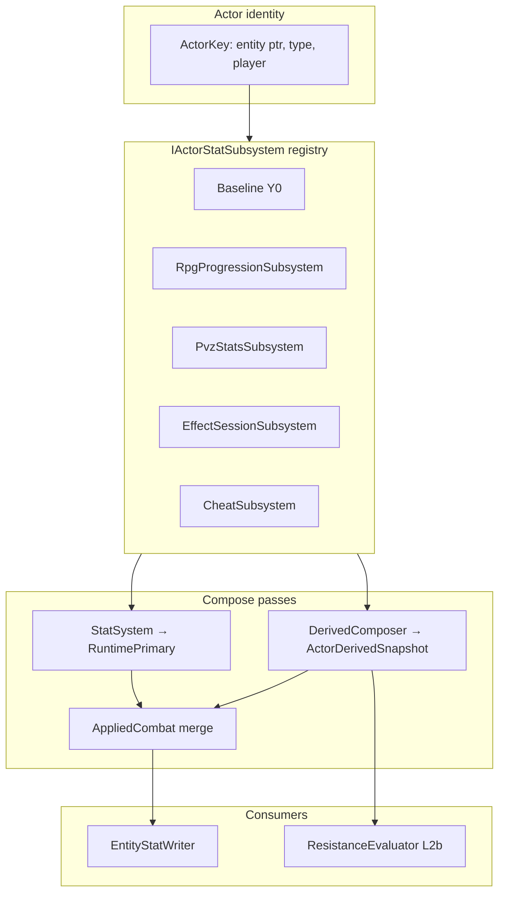

# Actor Hub — derived stats SSOT

**Status:** Design locked (docs). **Shipped:** status-derived channels and `ActorHub` compose (S0–S1, S2–S7), **and all 84 `combat.*` channels** — runtime registration and Element Hub integration landed with C0–C4 on 2026-08-19, and the four `combat.shield.*` families with the shield program.

> **Refreshed 2026-08-22.** This header previously read *"Overlay combat channels are catalog-reserved — runtime registration and Element Hub integration deferred"*, which had been untrue since C0 shipped. §3.E also understated the catalog as 40 channels over 4 elements when it is 84 over 6. Both corrected. The trigger for the sweep was a new combat feature set — [battle-timeline](battle-timeline-map.md), [action](action-map.md), [effect-atom](effect-atom-map.md), [resource-hub](resource-hub-ideal.md) — every one of which reads or writes this catalog, so a stale SSOT here becomes a wrong assumption in four programs at once. New consumers are named in §2.1, unregistered producers in §6.1, and proposed `resource.*` channels in §3.G.

**Parent:** [decisions.md](decisions.md) (ADR rows **Actor Hub SSOT**, **Element Hub SSOT**). Status apply: [status-ssot.md](status-ssot.md) §6. Primary compose: [stat-system.md](stat-system.md). Progression grain: [rpg-progression.md](rpg-progression.md).

---

## 1. Problem

1. [status-ssot.md](status-ssot.md) **L2b ResistanceEvaluator** needs attacker **power** and defender **resist** at Apply — not primary `hp`/`atk`.
2. Progression will add flat combat bonuses — must not mutate vanilla **Y0** or confuse game capture with RPG growth.
3. **StatSystem** today composes only **primary** channels (`hp`, `maxHp`, `atk`, `defense`, armor…). There is no derived layer, no `status.power.*`, no `progression.power`.
4. **Overlay combat channels** (`combat.*`) need catalog registration here; **Element Hub** owns element semantics and matchup matrix — see [element-hub-ssot.md](element-hub-ssot.md) §8.6.

---

## 2. Layer model (locked)



| Layer | Code name | Meaning |
|---|---|---|
| **1 Game base** | `Y0` / `Baseline` | Vanilla Unity capture — **never** progression |
| **2 Runtime primary** | `RuntimePrimary` | `StatSystem` compose: Y0 + cheats + session primary mods |
| **3 Derived** | `ActorDerivedSnapshot` | Progression power tier + status power/resist + future flats |
| **Applied** | `AppliedCombat` | Writer input: `RuntimePrimary + progression.bonus.*` |

**Ban:** progression must never write bare `hp`/`maxHp`/`atk` or mutate Y0. Combat flats use **`progression.bonus.*`** only. Status tier uses **`progression.power`** and **`status.power.*` / `status.resist.*`**.

### 2.1 Consumers — corrected 2026-08-22

The diagram above shows two consumers, which was true when it was drawn. It has been overtaken twice: once by overlay combat and shields shipping, and again by the combat feature set designed in 2026-08 (timeline kernel, action layer, atoms, resources). The catalog is the contract those all read, so it has to name them.

| Consumer | Reads | State |
|---|---|---|
| `EntityStatWriter` | `AppliedCombat` | Shipped |
| `ResistanceEvaluator` (L2b) | `status.power.*` / `status.resist.*` | Shipped |
| **Overlay combat** (`CombatDerivedReader`) | the 8 non-shield `combat.*` families | **Shipped — was missing from this doc** |
| **`ShieldRuntime`** | `combat.shield.capacity/toughness/pen/regen` | **Shipped — was missing from this doc** |
| Readiness / turn kernel | `turn.speed`, `turn.haste` | Designed; **channels not registered** — §11.4 |
| Action costs | `resource.max.*`, `resource.regen.*` | Designed; **channels not registered** — §3.G |
| Exhaustion debuffs | writes derived mods, reads nothing | Designed — §3.G |

Owning docs for the designed rows: [battle-timeline-map.md](battle-timeline-map.md), [action-map.md](action-map.md), [resource-hub-ideal.md](resource-hub-ideal.md), [effect-atom-map.md](effect-atom-map.md).

---

## 3. DerivedStatCatalog SSOT

**Rule:** Every derived channel must be registered in this catalog before use in content, PvzStats rows, status defs, or grant overlays. Unknown channel → reject (same as unknown `statusId` / unknown FA overlay key).

**Do not shrink this list without ADR.** New rows = ADR or explicit catalog appendix PR.

### A. Progression combat bonuses (Applied merge — flat add)

| Channel id | Compose | Default | Cap | Consumer |
|---|---|---|---|---|
| `progression.bonus.maxHp` | flat sum | 0 | — | AppliedCombat |
| `progression.bonus.atk` | flat sum | 0 | — | AppliedCombat |
| `progression.bonus.defense` | flat sum | 0 | — | AppliedCombat / defense view |
| `progression.bonus.arm1` | flat sum | 0 | — | Optional armor split |
| `progression.bonus.arm2` | flat sum | 0 | — | Optional armor split |

### B. Progression power tier (status delta + ApplyScale)

| Channel id | Compose | Default v1 | Consumer |
|---|---|---|---|
| `progression.power` | flat replace | **Θ** from `IPowerIndexProvider.ActorIndex` — **0** when un-hydrated (`StubPowerIndexProvider`, the default) | Status delta + dynamic ApplyScale |
| `progression.realm` | flat replace | **1.0** (stub, permanent — SSOT: additive in `Θ`, never a contest multiplier) | Future breakthrough multiplier |

**Grain:** `(player_id, kind, type_id)` from [rpg-progression.md](rpg-progression.md) — plant/zombie type level today; player actor optional summoner-wide omni later.

**Contract (power-plan.md T3.2, shipped 2026-08-24):**

```text
// RpgProgressionSubsystem
progression.power(actor) = powerIndexProvider.ActorIndex(ctx)   // Θ; 0 if no provider hydrated it
progression.realm(actor) = StatusPolicy.ProgressionPowerStubDefault   // 1.0, permanent
```

`IPowerIndexProvider` ([power/spec-power-index.md](power/spec-power-index.md)) replaced
`IProgressionPowerProvider` (deleted, T1.4) as the hydration seam. The kill-XP power scale
(`RpgXpAwardMap.Award.PowerScale`; its old carrier class `RpgXpPowerScale` is deleted, T3.3) stays
XP-only — do not conflate with combat `progression.power`.

**Tier power (locked):** use **`progression.tierPower = progression.power × progression.realm`**
everywhere `progression.power` appears in delta and ApplyScale formulas. Un-hydrated default:
`0 × 1.0 = 0` — a real behaviour change from the retired POC curve's `level≤0 → 1.0` special case,
not a stub value chosen independently of it.

> **✅ ADR P1 amended 2026-08-23, built 2026-08-24 (power-todo.md T3.1/T3.2) — this section describes
> what ships now, not a pending change.**
> The POC curve `2^min(level,12)` is **retired and deleted**
> (`ProgressionPowerCurve.cs` is gone): it was geometric on a difference-based contest, and two
> identical level-12 actors measured `netFactor = 4096` (a base-20 status dealing 81,920) before the
> fix. `progression.power` is now **`Θ`** from `IPowerIndexProvider` (linear); `ResistFromPowerRatio`
> moved 0 → 1.0 (T3.1); `effectiveApplyScale` dropped its `× matchPower` (T3.2, audit F3); `netFactor`
> is now `1 + delta/NetFactorScale` (T3.2, audit F4). **`progression.realm` stays 1.0 permanently** —
> realm advancement is additive in `Θ`, never a contest multiplier.
> SSOT: [power/ssot-power-scale.md](power/ssot-power-scale.md) §6 · spec:
> [power/spec-status-contest.md](power/spec-status-contest.md). Full test suite green throughout;
> the one real defect the change surfaced (attacker-less scripted statuses going inert) was found
> and fixed in the same task, not shipped then discovered — see power-todo.md T3.1's evidence.

### C. Status attacker power (attacker ActorPtr at Apply)

| Channel id | Compose | Default | Cap | Consumer |
|---|---|---|---|---|
| `status.power.omni` | Σ Increased | **0** | MaxNetFactor | Omni baseline — adds to every category total |
| `status.power.dot` | Σ Increased | **0** | MaxNetFactor | DoT / overlay pulse family |
| `status.power.cc` | Σ Increased | **0** | MaxNetFactor | CC family |
| `status.power.contagion` | Σ Increased | **0** | MaxNetFactor | Spread re-Apply |
| `status.power.{statusId}` | Σ Increased | 0 | MaxNetFactor | Per-id override (sparse) |

**Combine rule:** `totalPower = tierPower(attacker) + power.omni + power.{category} + power.{statusId}` — **add only**, never multiply omni × category.

### D. Status defender resist (host at Apply)

| Channel id | Compose | Default | Cap | Consumer |
|---|---|---|---|---|
| `status.resist.omni` | Σ Increased | **0** | **none** (balance knob) | Omni baseline — blocks weak applies without specific resist |
| `status.resist.dot` | Σ Increased | 0 | **0.95** | Category resist |
| `status.resist.cc` | Σ Increased | 0 | 0.95 | Category resist |
| `status.resist.contagion` | Σ Increased | 0 | 0.95 | Category resist |
| `status.resist.{statusId}` | Σ Increased | 0 | 0.95 | Per-id override (sparse) |
| `status.immune.{tag}` | max-priority flag | 0 | 1 | Complete block before net |
| `status.immuneReduction.{tag}` | max reduction | 0 | 1 | Partial block — scales netFactor (see §4) |

**Combine rule:** `totalResist = tierPower(defender) × ResistFromPowerRatio + resist.omni + resist.{category} + resist.{statusId}` — category slices capped at **`StatusPolicy.CategoryResistCap` (0.95)** before sum; omni uncapped.

**v1 stub:** `ResistFromPowerRatio = 0` — progression contributes to attacker power and ApplyScale only until resist-from-level is designed.

### E. Overlay combat channels (catalog + runtime shipped)

Normative channel list and omni rule: [element-hub-ssot.md](element-hub-ssot.md) §6.

**Ownership split:**

| Concern | Owner |
|---|---|
| Channel id registration and validation | **Actor Hub** (this catalog) — **shipped C0** |
| Element roster, typing rules, matchup matrix | **Element Hub** spec — **shipped C1** |
| Hit/crit/damage formulas | **Overlay combat** spec — **shipped C2** (flag-gated C3) |

**84 channels — 12 families × (`omni` + 6 elements).** Corrected 2026-08-22: this section read "40 channels … `omni` + `fire|ice|air|earth`", which predates both the light/dark elements and the shield families. `DerivedStatChannels.AllCombatChannelIds` generates the list from `CombatChannelFamilies × (omni + ElementRoster.Concrete)`, and a test asserts the count is exactly **84**.

| Families (12) | Elements (7 slots) |
|---|---|
| `combat.power` · `combat.defense` · `combat.crit.rate` · `combat.crit.resist` · `combat.crit.damage` · `combat.crit.resist.damage` · `combat.accuracy` · `combat.dodge` | `omni` + `fire` · `ice` · `air` · `earth` · `light` · `dark` |
| `combat.shield.capacity` · `combat.shield.toughness` · `combat.shield.pen` · `combat.shield.regen` — see [shield-system-spec.md](shield-system-spec.md) §2.3 | same |

The list is **generated, never hand-listed** — adding an element or a family changes the count by construction, which is why the assertion is on the generated total rather than on a literal list.

**Actor type metadata (not derived channels):** `element.type.primary`, `element.type.secondary` — validated per Element Hub §5.

Implement checklist: [combat-element-implement-plan.md](combat-element-implement-plan.md) — **C0–C4 shipped 2026-08-19**.

### F. Other reserved stubs (not v1 gameplay)

| Channel id | Notes |
|---|---|
| `status.expose.{category}` | Future vulnerability hook |

**Catalog count (status v1 locked):** 5 progression bonus + 2 tier + 4 power categories + 2 sparse power + 4 resist categories + 2 sparse resist + 2 immune patterns + reserved stubs above = **23 named status patterns** (excluding `{statusId}` / `{tag}` expansions). Overlay combat adds **84** — shipped, not reserved (C0 landed 2026-08-19).

**Whole-catalog total, verified 2026-08-22:** **99 pre-registered channels** — 84 `combat.*` + 8 `status.power.*` / `status.resist.*` constants + 7 `progression.*` — plus five open-ended prefix families (`status.power.{id}`, `status.resist.{id}`, `status.immune.{tag}`, `status.immuneReduction.{tag}`, `status.expose.{category}`), which the locked 21-status catalog expands by a further 42.

### G. Resource channels — **PROPOSED, not registered**

⚠️ **Nothing below is in the catalog yet.** Registering these is a new-rows change, which §3 requires be an ADR or an explicit catalog appendix — and per AGENTS.md an architecture change that locks behaviour needs a [decisions.md](decisions.md) row first. Recorded here so the SSOT is not silently overtaken by the design work; see [resource-hub-ideal.md](resource-hub-ideal.md).

Two families over five resource ids, giving **10 channels**:

| Family | Ids |
|---|---|
| `resource.max.{id}` | `hp` · `stamina` · `hunger` · `spirit` · `qi` |
| `resource.regen.{id}` | same five |

Four properties that must hold when they are registered:

1. **They form their own family list and must not join `AllCombatChannelIds`**, which is asserted at exactly 84. A resource channel appearing there breaks the assertion and, worse, would be swept into element expansion — resources are not element-typed.
2. **They are `rpg.*` layer, not `pvz.*`.** They are not `StatChannels` entries and never reach a Unity field; the only Writer-backed resource is `hp`. This is the layer split in [pvz-middle-layer.md](pvz-middle-layer.md), not a limitation.
3. **Resource *values* are not derived channels.** Only `max` and `regen` are composed here. The current value is per-actor runtime state resolved lazily as `value + rate × (now − lastTick)`, following the same compute-on-read law the rest of the server uses — 200 actors × 4 regenerating pools would otherwise be 800 recurring scheduled events against a 0.15 ms kernel slice.
4. **Exhaustion debuffs compose through this catalog like any other derived mod** — same four compose kinds, same per-channel caps, no new ordering rule. What is new is that up to four exhaustion debuffs can stack on one actor at once, which the cap logic has never been tested against.

Faction naming (plant `hunger` displays as **Sun**, `qi` as **Yang**; zombie `qi` as **Yin**) is a **display label owned by content**, never a channel id and never a branch in this catalog.

**Ban:** `totalPower = omni × category` or `totalResist = omni × category` — **forbidden** (Chaos Omni additive-only).

Category mapping: normative **StatusId → category** table in [status-ssot.md §9.5](status-ssot.md).

---

## 4. Two-phase status resolve (ResistanceEvaluator)

Design reference: Chaos Element Core probability + status-core apply order — see [../research/status-core-chaos-mapping.md](../research/status-core-chaos-mapping.md), [../research/actor-core-chaos-mapping.md](../research/actor-core-chaos-mapping.md).

**Fusion differs from Chaos on ApplyScale binding** — see §5.

**Skip v1 (research only):** Chaos intensity ODE (`dI/dt = α·Δ − β·I`), refractory curves, per-element fixed `trigger_scale` as product lock.

### Apply pipeline (locked order)

```text
Apply(hostPtr, statusId, baseMagnitude, baseDuration):
  Validate def + family mutex
  → Complete immunity (status.immune.{tag}) → Resisted
  → Resolve attacker + defender ActorDerivedSnapshot
  → Compute delta, netFactor = clamp(delta, Min, Max)
  → Partial immunity: netFactor *= (1 - status.immuneReduction.{tag}) per matching tag
  → if netFactor <= 0 → Resisted (reason: potency_floor) — skip sigmoid roll
  → Phase 1: p_final = grant.chance × sigmoid(delta / effectiveApplyScale); roll
  → Phase 2: effectiveMagnitude = base × netFactor; effectiveDuration = base × netFactor
  → If effective duration/magnitude useless → Resisted
  → Else create/refresh instance (snapshot at Apply v1)
```

Grant `chance` defaults to **1.0** when omitted — [effect-data.md](effect-data.md).

### Phase 1 — Will it apply? (sigmoid roll)

```text
tierPower(actor) = progression.power(actor) × progression.realm(actor)

totalAttackerPower = tierPower(attacker) + status.power.omni + status.power.{category} + status.power.{statusId}
totalDefenderResist = tierPower(defender) × ResistFromPowerRatio
                    + status.resist.omni + status.resist.{category} + status.resist.{statusId}

delta = totalAttackerPower - totalDefenderResist

matchPower = avg(tierPower(attacker), tierPower(defender))

effectiveApplyScale = max(
  StatusPolicy.ApplyScaleFloor,
  StatusPolicy.ApplyScaleK.{category} × matchPower   // fallback: ApplyScaleK when category override absent
)

p_apply = sigmoid(delta / effectiveApplyScale)
p_final = grant.chance × p_apply
```

**Potency-floor short-circuit:** when `netFactor <= 0` after partial immunity, **do not roll** — emit `debug.status.resisted` with `reason: potency_floor`.

**v1 with stub:** `matchPower = 1.0` → `effectiveApplyScale = 100`.

Optional steepness: `custom_sigmoid(delta / effectiveApplyScale, StatusPolicy.ApplySteepness.{category})`.

### Phase 2 — How strong / long? (linear netFactor)

**Do not** use `p_apply` for potency — apply uses sigmoid; potency uses linear netFactor.

```text
netFactor = clamp(delta, StatusPolicy.MinNetFactor, StatusPolicy.MaxNetFactor)

effectiveMagnitude = baseMagnitude × netFactor
effectiveDuration  = baseDuration  × netFactor
pulseDamage        = instance.effectiveMagnitude   // per tick; net snapshotted at Apply v1
```

**Defaults (v1 infra):** `tierPower = 1.0`, `status.power.* = 0`, `status.resist.* = 0`, `ResistFromPowerRatio = 0` → matched stub actors have **`delta = 0`**.

**Even-match potency special case:** when `delta = 0` exactly, **`netFactor = 1.0`** for potency (full base magnitude/duration if apply roll succeeds). When **`delta < 0`**, clamp → **`netFactor <= 0`** → **potency_floor short-circuit** (skip sigmoid roll).

### Roles at Apply

| Actor | Derived inputs |
|---|---|
| **Attacker** (`ActorPtr` / grant source) | `tierPower`, `status.power.omni`, `status.power.{category}`, optional `status.power.{statusId}` |
| **Defender** (status host / `TargetPtr`) | `tierPower`, `status.resist.omni`, `status.resist.{category}`, optional `status.resist.{statusId}`, `status.immune.{tag}`, `status.immuneReduction.{tag}` |
| **Attacker-less** (no ActorPtr — environmental / match-wide spread) | `tierPower = 1.0` stub; **`status.power.* = 0`** (not category defaults) |

Immunity (complete) → `Resisted` before delta. Partial immunity → multiply netFactor by `(1 - reduction)`.

**Apply-time snapshot (v1):** store effective magnitude/duration on instance; pulses use stored values.

### Worked examples

**Rot vs omni resist:**

```text
Attacker: tierPower=1, power.rot=100 → totalPower=101
Defender: tierPower=1, resist.omni=1_000_000 → totalResist=1_000_000
delta = -999_899 → netFactor clamped ≤ 0 → Resisted (potency_floor, skip roll)
```

**Even match (stub, apply chance):**

```text
Matched stub actors, no gear → delta = 0
effectiveApplyScale = 100 → p_apply ≈ 50%
netFactor = 1.0 (delta = 0 special case for potency)
```

### Golden numeric table (prove aid)

**Apply chance (`effectiveApplyScale = 100`):**

| delta | p_apply (approx) |
|---|---|
| −1500 | ~0% |
| 0 | ~50% |
| 50 | ~62% |
| 1500 | ~100% |

**Apply chance (post-power example, scale = 425_000):**

| delta | p_apply (approx) |
|---|---|
| 1500 | ~50.4% |

**Potency (`MinNetFactor = 0`, delta = 0 → netFactor = 1.0 special case):**

| delta | netFactor (potency) | Notes |
|---|---|---|
| −10 | 0 | potency_floor → skip roll |
| 0 | 1.0 | even match special case |
| 50 | 50 | linear until MaxNetFactor cap |

---

## 5. Dynamic ApplyScale (Fusion lock vs Chaos)

| | Chaos | Fusion (locked) |
|---|---|---|
| Sigmoid divisor | Fixed `trigger_scale` / `status_scaling_factor` (~50–100) per element | **`effectiveApplyScale = max(Floor, K × avg(tierPower))`** |
| Progression magnitude | `element_mastery` / `power_scale` from level × realm → feeds **delta** | **`tierPower`** feeds **both delta and ApplyScale** |
| v1 until power system | N/A | **Hardcoded `progression.power = 1.0`**; replace via `IProgressionPowerProvider` when power ADR lands |

Chaos level/realm curves are **reference for future `UpdatePower`** — not the ApplyScale binding itself. See [../research/actor-core-chaos-mapping.md](../research/actor-core-chaos-mapping.md).

### StatusPolicy keys (design defaults)

| Policy key | Default | Role |
|---|---|---|
| `StatusPolicy.ApplyScaleK` | 100 | Default multiplier on `matchPower` |
| `StatusPolicy.ApplyScaleK.{category}` | — | Optional per-category override (dot/cc/contagion) |
| `StatusPolicy.ApplyScaleFloor` | 1.0 | Minimum divisor |
| `StatusPolicy.ApplySteepness.{category}` | 1.0 | Optional custom_sigmoid |
| `StatusPolicy.CategoryResistCap` | 0.95 | Cap per `status.resist.{category}` slice before sum |
| `StatusPolicy.ResistFromPowerRatio` | 0 (v1 stub) | Defender resist from `tierPower` |
| `StatusPolicy.MinNetFactor` | 0 | Potency floor (see delta = 0 special case) |
| `StatusPolicy.MaxNetFactor` | — | Potency cap (TBD balance) |
| `ProgressionPowerStub.Default` | 1.0 | Hardcoded until power system |

**Deprecated alias:** `ResistanceCap` → use **`CategoryResistCap`** (subtractive model caps slices, not a single `(1 - resist)` multiplier).

---

## 6. Subsystem registry (design)

| Subsystem | Order | Primary | Derived v1 |
|---|---|---|---|
| `baseline` | 0 | Y0 in context | — |
| `rpg.progression` | 100 | no-op | Sets **`progression.power = 1.0`** stub; **`UpdatePower` hook reserved** |
| `pvz.stats` | 250 | existing plugin | rows on catalog channels when present |
| `foundation.effect` | 350 | session bag | future timed derived |
| `cheat.*` | 900+ | existing | debug derived optional |

Multi-progression: **`IProgressionSubsystem`** hook reserved; v1 registers **RpgProgression only**.

### 6.1 Unregistered producers — found 2026-08-22

The table above lists who is *supposed* to write derived channels. A repo sweep for the effect-atom program found **four magnitude sites already writing derived channels with no subsystem row and no opcode**: **patron**, **stars**, **injuries**, and **contracts** (`ContractPolicy` carries rank bonuses, loyalty rates, and per-personality modifiers).

That is the same failure mode §3 exists to prevent, arrived at from the producer side rather than the channel side: the catalog validates *which channel ids* are legal, but nothing validates *who may write them*. Four features grew their own path because there was no opcode to use.

The effect-atom program's `stat.derived` kind exists specifically to give them one — it is the one kind with full runtime support (lawn ✅ battle ✅ sim ✅). When it lands, these four collapse into containers of atoms and become a single registered producer.

| Producer | Writes | State |
|---|---|---|
| patron | derived channels, direct | **Unregistered** — adopts `stat.derived` |
| stars | derived channels, direct | **Unregistered** — adopts `stat.derived` |
| injuries | derived channels, direct | **Unregistered** — adopts `stat.derived` |
| contracts (`ContractPolicy`) | rank bonuses, loyalty rates, personality modifiers | **Unregistered** — adopts `stat.derived` |
| atom compiler | `stat.derived` atoms → derived mods | Designed — [effect-atom-map.md](effect-atom-map.md) E7 |

**Rule to adopt when that lands:** a derived write needs both a registered *channel* and a registered *producer*. Only half of that is enforced today.

Future: `RpgProgressionSubsystem` reads SQLite `rpg_actor_progression.level` for `(player_id, plant|zombie, type_id)` bound to entity, computes power via documented curve, calls `UpdatePower`.

---

## 7. Integration with StatSystem

**StatSystem** remains SSOT for **primary** compose. **ActorHub** wraps Resolve:

```text
ActorHub.Resolve(entityKey):
  RuntimePrimary = StatSystem.Resolve(entityKey)
  Derived        = DerivedComposer.Compose(subsystems → catalog channels)
  AppliedCombat  = RuntimePrimary + progression.bonus.* (Applied merge only)
  return (RuntimePrimary, Derived, AppliedCombat)
```

- **EntityStatWriter** consumes **AppliedCombat** for HP/ATK writes (`progression.bonus.*` only from derived — not `status.power.*`).
- **ResistanceEvaluator** consumes **Derived** snapshots for attacker + defender at Apply.
- **PvzStats** may upsert modifiers on any **catalog** channel — validation rejects unknown ids.

### Derived snapshot lifecycle (locked)

| When | Behavior |
|---|---|
| **v1 Status Apply** | Compose derived **on each Apply/Refresh** for attacker ptr + defender ptr — no cross-match persistence |
| **Future cache** | Per `entity:{ptr}` cache invalidated on `StatSystem.Invalidate`, PvzStats revision bump, progression level change |
| **Ban** | Persist derived snapshot or AppliedCombat to SQLite as SSOT |

ActorHub may resolve primary stats for Writer on a different cadence than derived compose for Status Apply — derived for L2b is **Apply-scoped** in v1.

---

## 8. Ban list

- Never mutate Y0 with progression or runtime mods
- Progression combat flats use `progression.bonus.*` only — not primary hp/atk channels
- Do not wire level→damage silently; `progression.power` is catalog derived only
- Do not persist AppliedCombat or derived snapshot as SSOT
- No derived channel outside **DerivedStatCatalog**
- **Never multiply omni × category** for status power/resist totals
- Do not use fixed-only ApplyScale as Fusion product lock (Chaos fixed scale is reference only)
- No runtime YAML derived loader v1
- **StatusRuntime code must not ship** before Actor Hub derived resolve + `progression.power` stub channel exist
- Do not conflate the kill-XP power scale (`RpgXpAwardMap.Award.PowerScale`; formerly `RpgXpPowerScale`, deleted T3.3) with combat `progression.power`

---

## 9. Migration from flat StatSystem

| Today | After Actor Hub code |
|---|---|
| Resistance tags undocumented / missing | Catalog channels + DerivedComposer defaults |
| Status-ssot §6 defender-only `(1 - resist)` | Two-phase resolve: sigmoid apply + linear potency |
| No progression power at Apply | `progression.power = 1.0` stub via RpgProgressionSubsystem |
| EntityApply → StatSystem only | EntityApply → ActorHub.Resolve → Writer + status consumer |

---

## 10. Architecture audit (locked resolutions)

### Strengths (keep)

1. **Catalog SSOT** — unknown derived channel rejected like unknown `statusId`.
2. **Stub unblock** — `tierPower = 1.0` hardcoded lets StatusRuntime code plan proceed before power ADR.
3. **Chaos-aligned two-phase** — sigmoid apply vs linear potency; omni additive-only.
4. **Dynamic ApplyScale** — self-normalizes high-tier fights without copying fixed `trigger_scale`.

### Risks and mitigations

| Risk | Mitigation |
|---|---|
| Default math drift (category power 1.0) | **Locked to 0** — neutral stub `delta = 0` when gearless |
| Dynamic ApplyScale at high tier | Golden table + optional `ApplyScaleK.{category}` override |
| PvzStats on derived channels | Catalog validation in code plan; primary SSOT unchanged |
| UniqueActor vs type power | Open question — v1 stub masks; see §11 |
| `delta = 0` potency edge | Explicit **netFactor = 1.0** special case |

### Debates resolved

| Question | Decision |
|---|---|
| Fixed vs dynamic ApplyScale? | **Dynamic** `K × avg(tierPower)` — Chaos fixed scale is reference only |
| Category power default? | **0** (not 1.0 baseline competence) |
| Roll when netFactor ≤ 0? | **No** — potency_floor short-circuit before sigmoid |
| `progression.realm` in v1? | Catalog stub; **`tierPower = power × realm`** in all formulas |

---

## 11. Open questions (document only)

2. Mid-duration derived refresh when buff expires — snapshot at Apply v1; re-eval per tick open.
3. `MaxNetFactor` balance cap — TBD when power ADR lands.
4. **Three `turn.*` channels exist in code but are not registered here** (found 2026-08-22; count corrected 2026-08-23 — this read "`turn.speed` / `turn.haste`" and missed **`turn.moveSpeed`**, declared on the same class). `Battle/Timeline/DerivedTurnChannels.cs` declares all three as constants; `DerivedStatRegistry.RegisterDefaults()` does not register them, so the "unknown channel → reject" rule in §3 would fire the moment a `turn.*` modifier reached the compose path. The battle-timeline program's readiness task already carries this as acceptance — *"a `turn.*` modifier through the compose path does not throw"* — with defaults of `turn.speed = 100` and `turn.haste = 1000` (zero would divide-by-zero or mean instant actions). Recorded here because the constants are in `src/` today and this catalog is the thing that decides whether they are legal.
5. **A proportional floor on the turn channels is a correctness requirement, not balance.** Readiness is `work / rate`; as rate approaches zero the arrival tick runs away toward never, which stalls the event queue rather than slowing an actor. `max(1, …)` is not sufficient — rate 1 against a base of 100 is a 100× wait. Relevant to §3.G because exhaustion debuffs are the first mechanic that would drive a turn channel down hard.

Unique specimen vs type power: see [unique-actor-runtime.md](unique-actor-runtime.md) — v1 stub masks precedence.

---

## 12. Sequencing

```text
This spec (docs):     actor-hub-ssot.md + amendments
Status implement:     actor-hub-status-implement-plan.md (S0–S7 shipped)
Overlay combat next:  combat-element-implement-plan.md (C0–C4 deferred)
Later:                P1 Power ADR → UpdatePower from level/realm
Separate ADR:         P2 progression.bonus.* combat flats
```

**Status path:** [status-ssot.md](status-ssot.md) — **shipped** in Core + Injector (S0–S7).  
**Overlay combat path:** [element-hub-ssot.md](element-hub-ssot.md) + [combat-damage-ssot.md](combat-damage-ssot.md) — design locked; code in [combat-element-implement-plan.md](combat-element-implement-plan.md).

---

## 13. Related docs

- [actor-hub-status-implement-plan.md](actor-hub-status-implement-plan.md) — S0–S7 implement checklist, prove gates
- [status-ssot.md](status-ssot.md) — L2 StatusRuntime, L2b ResistanceEvaluator consumer
- [combat-element-implement-plan.md](combat-element-implement-plan.md) — overlay combat + Element Hub code plan (C0–C4)
- [element-hub-ssot.md](element-hub-ssot.md) — element typing and combat-element derived channels for overlay damage
- [combat-damage-ssot.md](combat-damage-ssot.md) — overlay combat consumer of derived combat and element channels
- [stat-system.md](stat-system.md) — primary Y0 + compose (unchanged ownership)
- [rpg-progression.md](rpg-progression.md) — type actor grain, power stub vs XP scale
- [pvz-stats.md](pvz-stats.md) — may contribute catalog channels; not progression power SSOT
- [resource-hub-ideal.md](resource-hub-ideal.md) — the five resources and their exhaustion mechanic; source for the **proposed** `resource.*` families in §3.G
- [shield-system-spec.md](shield-system-spec.md) — the four `combat.shield.*` families counted in §3.E
- [battle-timeline-map.md](battle-timeline-map.md) — owner of `turn.speed` / `turn.haste` and the readiness model in §11.4–5
- [../research/actor-core-chaos-mapping.md](../research/actor-core-chaos-mapping.md) — level/realm borrow
- [../research/status-core-chaos-mapping.md](../research/status-core-chaos-mapping.md) — apply pipeline borrow

