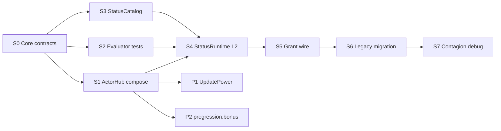

# Actor Hub + StatusRuntime — implementation plan

**Status:** Implement checklist (docs). **No code in this file** — each slice ships as its own PR citing slice id (`S0`, `S1`, …).  
**Design authority:** [actor-hub-ssot.md](actor-hub-ssot.md), [status-ssot.md](status-ssot.md), [combat-damage-ssot.md](combat-damage-ssot.md), [effect-funnel.md](effect-funnel.md).  
**Roadmap:** expands [implementation-roadmap.md](implementation-roadmap.md) W13/W14.

---

## 1. Dependency chain



**Hard gate:** **S4+** (StatusRuntime) must not merge until **S1** (Actor Hub derived resolve) lands.

**Hot path (locked):**

```text
EffectEvent → EffectBag grant (L1)
  → statusId overlay → StatusRuntime.Apply (L2)
  → ActorHub derived compose for attacker + defender (L2b)
  → ResistanceEvaluator (potency_floor → sigmoid → potency)
  → PulseHp → DamagePacket (L3) → Funnel → FA10 (L4)
  → UnityCc → StatusExecutor (L4)
```

---

## 2. Scope

| In scope (v1 implement S0–S7) | Out of scope (separate ADR / slice) |
|---|---|
| DerivedStatCatalog + DerivedComposer + stub `tierPower = 1.0` | **P1** — `IProgressionPowerProvider` / level→power curves |
| Two-phase L2b (potency_floor, sigmoid, dynamic ApplyScale) | **P2** — `progression.bonus.*` AppliedCombat merge |
| StatusRuntime instances + legacy DoT/Counter migration | CombatMath DEF/element/shield |
| 21-id StatusCatalog + §9.5 category registry | SQLite status catalog / YAML loader |
| Debug `/api/debug/status` | FE lawn status chips (optional triage) |
| Contagion spread with per-hop L2b | Chaos refractory / intensity ODE |

---

## 3. Global ban list (all slices)

- Never mutate **Y0** with progression or derived mods.
- StatusRuntime must not call **`TakeDamage`** or snapshot **`SetHp`**.
- Status HP pulses must not bypass **Funnel** → FA10 Writer Add.
- No **Server RTT** on Apply/Tick/Spread.
- No derived channel outside **DerivedStatCatalog** ([actor-hub-ssot.md §3](actor-hub-ssot.md)).
- Never multiply **omni × category** for status power/resist totals. **[Ban removed 2026-09-02 — see `element-hub-ssot.md` §7; the omni combination is a tunable, default still additive.]**
- Do not conflate **`RpgXpPowerScale`** with combat **`tierPower`**.
- After **S6** seals: no **new** grants with `delivery.mode = OverTime|Counter`.

---

## 4. Slice catalog

Each slice: **goal → files → depends on → prove gate → bans**.

---

### S0 — Core contracts and pure math

**Goal:** Types and testable pure functions in **FusionRpg.Core** with zero Injector dependency.

**Depends on:** design docs merged (done).

| Artifact | Proposed path |
|---|---|
| `DerivedStatRegistry` (catalog SSOT) | `src/FusionRpg.Core/Stats/Derived/DerivedStatRegistry.cs` |
| `ActorDerivedSnapshot` | `src/FusionRpg.Core/Stats/Derived/ActorDerivedSnapshot.cs` |
| `DerivedComposer` (pure compose from snapshot inputs) | `src/FusionRpg.Core/Stats/Derived/DerivedComposer.cs` |
| `StatusPolicy` defaults | `src/FusionRpg.Core/Status/StatusPolicy.cs` |
| `ResistanceEvaluator` (pure) | `src/FusionRpg.Core/Status/ResistanceEvaluator.cs` |
| `StatusCategoryRegistry` (§9.5 map) | `src/FusionRpg.Core/Status/StatusCategoryRegistry.cs` |

**Tests:** `tests/FusionRpg.Core.Tests/ActorHub/`, `tests/FusionRpg.Core.Tests/Status/`

**Prove gate:**

| Test | Expected |
|---|---|
| Unknown derived channel | Reject |
| Neutral stub (`tierPower=1`, power/resist 0) | `delta=0`, `p_apply≈0.5`, potency `netFactor=1.0` |
| `delta=-10` | `potency_floor` — skip sigmoid roll |
| Omni resist 1M vs power 100 | `potency_floor` |
| Golden table | Match [actor-hub-ssot.md §4](actor-hub-ssot.md) numeric rows |
| Category resist | Cap **0.95** per slice before omni sum |
| Attacker-less | `status.power.* = 0`, `tierPower = 1.0` stub |

**Reuse:** [StatSystem.cs](src/FusionRpg.Core/Stats/StatSystem.cs) patterns — **do not** fold derived into primary `StatComposer`.

**Slice bans:** No Injector references; no StatusRuntime instance bag yet.

---

### S1 — ActorHub compose + Injector wire

**Goal:** Wrap StatSystem; derived available for L2b; **Writer path unchanged** for primary stats until P2.

**Depends on:** S0.

| Artifact | Proposed path |
|---|---|
| `IActorStatSubsystem` | `src/FusionRpg.Core/Stats/Derived/IActorStatSubsystem.cs` |
| `RpgProgressionSubsystem` stub | `src/FusionRpg.Core/Stats/Derived/Subsystems/RpgProgressionSubsystem.cs` |
| `ActorHub` | `src/FusionRpg.Core/Stats/Derived/ActorHub.cs` |
| Bootstrap registration | `src/FusionRpg.Core/Stats/StatSystemBootstrap.cs` (extend) |
| EntityApply hook | [src/FusionRpg.Injector/Stats/EntityApply.cs](src/FusionRpg.Injector/Stats/EntityApply.cs) |

**Between-layer rule (locked):**

| Consumer | When to compose derived |
|---|---|
| **EntityStatWriter** | On existing invalidate/reapply cadence via `ActorHub.Resolve`; **AppliedCombat** uses primary + `progression.bonus.*` (all zero until P2) |
| **L2b ResistanceEvaluator** | **Per Status Apply** — fresh compose for attacker ptr + defender ptr; no cross-match persistence |

**Prove gate:**

- `dotnet test tests/FusionRpg.Core.Tests`
- Living spawn/reapply: HP/ATK **unchanged** vs pre-S1 baseline
- `scripts/guard-single-writer.ps1` green
- Optional debug: `GET /api/debug/actor-derived?ptr=` returns catalog channels + defaults

**Slice bans:** Do not merge `progression.bonus.*` into Writer until P2.

---

### S2 — ResistanceEvaluator integration tests

**Goal:** Table-driven Apply math with mock snapshots; all 21 status ids map to correct L2b category.

**Depends on:** S0 (can ship in same PR as S0 or immediately after).

**Prove gate:**

- Every id in [status-ssot.md §9.5](status-ssot.md) → `dot` | `cc` | `contagion`
- `grant.chance` default 1.0 combine: `p_final = chance × p_apply`
- Partial immunity: `netFactor *= (1 - immuneReduction.{tag})` before potency_floor check

**Slice bans:** No StatusRuntime; no Injector.

---

### S3 — StatusCatalog registry

**Goal:** In-memory registry for **21 locked ids** — kind, family, `categories[]`, tags, stacking, payload kinds.

**Depends on:** S0.

| Artifact | Proposed path |
|---|---|
| `StatusDef`, `StatusCatalog` | `src/FusionRpg.Core/Status/StatusCatalog.cs` |
| Bootstrap (all §9 ids) | `src/FusionRpg.Core/Status/StatusCatalogBootstrap.cs` |

**Prove gate:**

- Unknown `statusId` in grant overlay → reject (log + skip), same as unknown FA overlay key
- Unit: family mutex rules from [status-ssot.md §9.1](status-ssot.md)

**Slice bans:** No file/YAML loader; no Server catalog.

---

### S4 — StatusRuntime L2

**Goal:** Single SSOT for timed instances on `entity:{ptr}`; owns Apply/Tick/Refresh/Expire.

**Depends on:** S1, S2, S3.

| Artifact | Proposed path |
|---|---|
| `StatusInstance`, `StatusRuntime` | `src/FusionRpg.Core/Status/StatusRuntime.cs` |
| Tick coalesce ~100ms | Injector Hot loop (`RpgLoop` / EffectBag tick — single owner) |
| Withdraw on die | [p0-hot-path-hardening.md](p0-hot-path-hardening.md) P0 integration |

**Apply pipeline (code must mirror spec):**

```text
Validate + family mutex
→ complete immunity
→ ActorHub derived (attacker + defender)
→ ResistanceEvaluator (potency_floor → roll → potency)
→ store effectiveMagnitude/Duration on instance
→ UnityCc → StatusExecutor when payload kind requires
```

**Prove gate:**

- Unit: Apply → Tick → Expire
- Unit: status ICD ≠ grant ICD ≠ periodMs
- Unit: elemental family Replace
- Unit: snapshot at Apply — mid-duration resist refresh **not** re-eval (v1)

**Slice bans:** No Funnel enqueue from Apply directly; pulses go through L3 only.

---

### S5 — Grant path + L3/L4 sinks

**Goal:** EffectBag fires Status Apply; PulseHp uses existing combat instant path.

**Depends on:** S4.

| Touch | Role |
|---|---|
| [EffectBag.cs](src/FusionRpg.Core/Effects/EffectBag.cs) | Grant with `statusId` → `StatusRuntime.Apply` (not legacy scheduler for **new** grants) |
| [TargetResolver](src/FusionRpg.Core/Combat/) + Funnel | PulseHp → Instant `DamagePacket` |
| StatusExecutor (FA2) | UnityCc |
| [effect-funnel.md](effect-funnel.md) | Pulses = Funnel mailbox only |

**Prove gate:**

- New offline scenario: `tests/fixtures/effects/scenarios/status-wither-apply.json`
- LIVE: `POST /api/debug/effect/grant` with [examples/status/wither.overlay.json](examples/status/wither.overlay.json)
- `scripts/guard-funnel-delta.ps1` green

**Slice bans:** No new `delivery.mode=OverTime|Counter` content.

---

### S6 — Legacy migration (DoT / Counter)

**Goal:** Move timed state off EffectBag; keep scenario ids.

**Depends on:** S5.

| Remove from EffectBag | Owner after migration |
|---|---|
| [DoTTickScheduler.cs](src/FusionRpg.Core/Combat/DoTTickScheduler.cs) | StatusRuntime OverTime |
| [CounterProcState.cs](src/FusionRpg.Core/Combat/CounterProcState.cs) | StatusRuntime Counter |

**Migration table (normative):**

| Today (shipped) | After S6 |
|---|---|
| `delivery.mode = OverTime` | `statusId: wither` + overlay |
| `delivery.mode = Counter` | `statusId: bond` + overlay |
| `DoTTickScheduler` on EffectBag | Private to StatusRuntime |
| `CounterProcState` on EffectBag | Private to StatusRuntime |
| Debug `/api/debug/effect/dots`, `/counters` | Fold into `/api/debug/status` (aliases ok) |

**Prove gate:**

- `combat-dot`, `combat-counter-*` scenarios pass with [examples/status/](examples/status/) overlay shape
- [CombatDotTests.cs](tests/FusionRpg.Core.Tests/CombatDotTests.cs) / [CombatCounterTests.cs](tests/FusionRpg.Core.Tests/CombatCounterTests.cs) updated or superseded
- Update [combat-damage-ssot.md](combat-damage-ssot.md) shipped table rows

**Slice bans:** Do not delete legacy paths until scenarios green; feature-flag migration if needed.

---

### S7 — Contagion + debug surface

**Goal:** Spread re-Apply per hop; operator visibility.

**Depends on:** S6.

| Artifact | Role |
|---|---|
| `StatusRuntime.Spread` | TargetSpec from overlay; full L2b each hop |
| `/api/debug/status` | List instances, resisted events; alias dots/counters |
| PvzStats channel validation | Reject unknown derived id on upsert (if not done in S1) |

**Prove gate:**

- LIVE: [blight-row.overlay.json](examples/status/blight-row.overlay.json) — hop can fail resist on second host
- `ProcDepthLimit` (default 6) on spread re-entry
- Events: `debug.status.resisted` with `reason`: `immunity` | `potency_floor` | `apply_roll`
- Extend [debug-live-checklist.md](../runbook/debug-live-checklist.md) with status rows

**Slice bans:** No hardcoded contagion balance in Core — overlay only.

---

## 5. Deferred slices (post v1)

| Slice | Trigger | Spec | Touches |
|---|---|---|---|
| **P1 — Power ADR** | Level→`tierPower` curve | [rpg-progression.md](rpg-progression.md), [actor-core-chaos-mapping.md](../research/actor-core-chaos-mapping.md) | `IProgressionPowerProvider.UpdatePower`, SQLite level read |
| **P2 — progression.bonus.*** | Combat flat HP/ATK at Applied merge | [actor-hub-ssot.md §3A](actor-hub-ssot.md) | EntityStatWriter consumes AppliedCombat |

**Open — UniqueActor vs type power:** `max(typePower, specimenPower)` vs specimen override when bound unique deploys. v1 stub masks; see [unique-actor-runtime.md](unique-actor-runtime.md).

---

## 6. Cross-cutting prove matrix

| Concern | Slice | Command / gate |
|---|---|---|
| Core unit tests | S0, S2 | `dotnet test tests/FusionRpg.Core.Tests` |
| Guard single writer | S1 | `scripts/guard-single-writer.ps1` |
| Guard funnel delta | S5, S6 | `scripts/guard-funnel-delta.ps1` |
| Guard DAL | all | No SQL in Injector/Core status paths; `scripts/guard-dal.ps1` |
| Offline scenarios | S5, S6 | `tests/fixtures/effects/scenarios/status-*` |
| LIVE operator | S7 | [debug-live-checklist.md](../runbook/debug-live-checklist.md) |
| Deploy playtest | S7 | `scripts/deploy-play.ps1` optional smoke |

**Suggested PR order:** S0 → (S2 parallel) → S1 → S3 → S4 → S5 → S6 → S7. S2 may merge with S0.

---

## 7. Risk register

| Risk | Mitigation |
|---|---|
| EffectBag + StatusRuntime duplicate tick | S4: single `StatusRuntime.Tick` owner; EffectBag **listens only** |
| EntityApply HP/ATK regression | S1: prove unchanged vs baseline before/after |
| Legacy DoT/counter scenario break | S6: keep scenario ids; change overlay shape only |
| Derived compose cost at Apply | v1 per-Apply compose; ptr cache deferred |
| PvzStats invalid derived channels | S1 or S7: API validation against registry |
| Dynamic ApplyScale high-tier balance | Golden table + optional `ApplyScaleK.{category}` override |
| Status before Actor Hub | **Blocked** — enforce in review (S4 PR requires S1 merged) |

---

## 8. File touch map (summary)

```text
FusionRpg.Core/
  Stats/Derived/          S0, S1 — registry, snapshot, composer, ActorHub, subsystems
  Status/                 S0–S4 — policy, evaluator, catalog, runtime
  Effects/EffectBag.cs    S5, S6 — grant → Apply; remove legacy schedulers
  Combat/DoTTickScheduler S6 — deprecate / move
  Combat/CounterProcState S6 — deprecate / move

FusionRpg.Injector/
  Stats/EntityApply.cs    S1
  RpgLoop / Effect tick   S4

FusionRpg.Server/
  Debug/status routes     S7

tests/
  FusionRpg.Core.Tests/ActorHub/  S0, S1, S2
  FusionRpg.Core.Tests/Status/    S0–S4
  fixtures/effects/scenarios/     S5, S6
```

---

## 9. Related docs

- [actor-hub-ssot.md](actor-hub-ssot.md) — derived catalog, L2b formulas
- [status-ssot.md](status-ssot.md) — L2 lifecycle, §9 catalog, §9.5 categories
- [stat-system.md](stat-system.md) — primary compose (unchanged ownership)
- [effect-testing.md](effect-testing.md) — offline scenario kit
- [overlay-control-loops.md](overlay-control-loops.md) — Hot loop placement
- [implementation-roadmap.md](implementation-roadmap.md) — W13/W14 summary

---

## 10. Execution notes

1. Each slice = one implementation PR; cite slice id in PR description.
2. Update this checklist row status when a slice seals (optional).
3. Bump [decisions.md](decisions.md) only if behavior lock changes — not per slice.
4. Do not reopen Foundation FA* opcodes without ADR.
