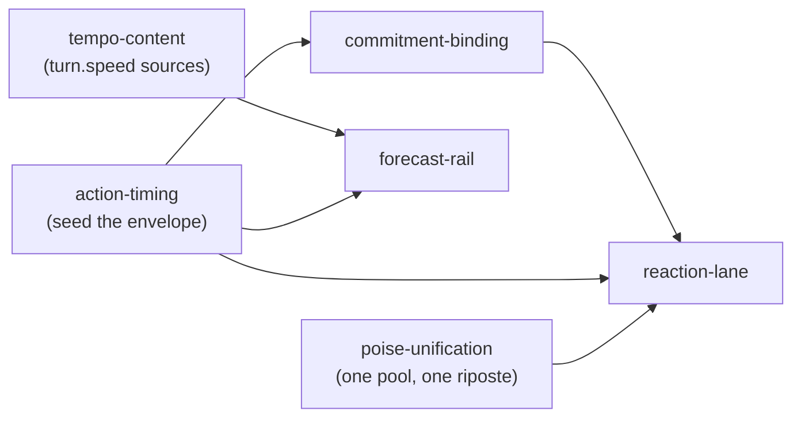

# Capability map — `battle-tempo`

**Status: proposed 2026-09-04, awaiting owner review.** No module spec is written and no build is
authorised until the map below is approved (spec-driven-development Phase 0).

**Read before touching this program:** [battle-turn-ideal.md](battle-turn-ideal.md) ·
[battle/audit-2026-08-21.md](battle/audit-2026-08-21.md) · [action-ideal.md](action-ideal.md) (sealed,
26 decisions) · [decisions.md](decisions.md). This map was written after reading all four.

---

## Why this program exists

The `battle-timeline` program is **complete** — 54/54, every module meeting its own acceptance. This
program does not extend the engine. It makes the engine's built capability **reachable**.

⭐ **The finding that produced it.** `B34`'s staged sweep measured the migration to `hybrid-atb`
axis by axis and found three of the four contributed **exactly 0.00 %**:

| Axis | Measured delta | Why it is zero |
|---|---:|---|
| `AdvancePolicy` (NextEvent → FixedIncrement) | **0.00 %** | no frames to step in a batch resolver |
| `W` (1 → 4) | **0.00 %** | slots cannot contend when nothing occupies one |
| `Commitment` (LateBound → EarlyBoundWithFallback) | **0.00 %** | unobservable with no window between commit and resolve |
| `ActionPoints(2)` | **−1.67 %** | the only axis that moved anything |

**All three zeros have one cause: every action's `ActionEnvelope.WindupTicks` is 0.** With no wind-up,
`Committed → Resolving` is instantaneous, so there is no interval in which a slot is held, a
commitment can be tested, or a defender could react.

This is not a surprise — it is the 2026-08-21 structured review's own prediction, verified:

> `ActionEnvelope` would have shipped at the T5 gate with **zero consumers**. `classic-round` sets
> every envelope field to zero, so the central abstraction would have been locked without a single
> real mechanic passing through it.

The abstraction shipped. The mechanic never arrived.

### The chain, verified end to end

| Layer | State |
|---|---|
| `ActionEnvelope` — windup, resolve offsets, recovery, cooldown class/key/ticks, interruptible, commitment | ✅ built |
| DB schema — `windup_ticks`, `resolve_offsets_json`, `recovery_ticks`, `cooldown_ticks`, `time_cost_ticks` | ✅ columns exist, all `DEFAULT 0` |
| **Action seeder — rolls category, atoms, targeting, rung… and no timing at all** | ⛔ **the gap** |
| Every shipped action | zeros; `BasicAttack` starts from `ActionEnvelope.NoOp` |

The committed corpus row carries `areaShape, atomFamilies, category, id, kindHint, motifsUsed, name,
pairedPayoffFamily, pairingRole, relation, rungBand, scope, scopeKey, targetMode` — **no timing field
of any kind.**

### It delivers two sealed decisions rather than reopening any

- **#11** — *"Cost rides rung and `Θ`; cooldown rides rung only. **Cooldown is ticks, not a
  magnitude.**"* The cooldown half is already decided; nothing rolls it.
- **#16** — *"A rung buys **STRUCTURE** as well as numbers — a rung-10 action plays differently, not
  just harder."* Wind-up and multi-hit `ResolveOffsets` **are** that structure. This program is how
  decision 16 stops being aspirational.
- **#4** — *"Actions are seeded, never handcrafted."* So this is generator work. No module here
  hand-authors an action.

### The gameplay it buys

**Actions take time, and you can see them coming.** Telegraphing is the readability mechanic action
combat runs on, and every dormant capability below hangs off it:

- **Speed stops being invisible** — wind-up divided by `turn.speed` is what makes `B39`'s readiness
  ordering something a player can perceive.
- **Guard becomes a real choice** — `action-ideal.md` decision **#3** makes guard a *stance*, and today
  it is a stance against nothing, because no attack has a window to guard through.
- **The forecast rail becomes worth rendering** — today it would show a flat list.
- **The reaction lane gets something to react into** — `WReact` can stay 0 until wanted.

---

## Modules

| Module id | Responsibility | Depends on |
|---|---|---|
| `action-timing` | Roll each action's timing envelope — `windupTicks`, `resolveOffsets`, `recoveryTicks`, `cooldownTicks`, `cooldownClass` — from its **rung and category**, into the columns that already exist. Seeder-side; no engine change. | — |
| `tempo-content` | Give **battle-owned content** a source for `turn.speed` / `turn.haste`, so readiness ordering varies between actors. Today nothing authors either and every actor clamps to `TurnDefaultSpeed`. | — |
| `commitment-binding` | Honour `Commitment` once a window exists: a target that dies mid-wind-up either fizzles (`EarlyBound`) or re-targets (`LateBound`). Knob 3 of the ideal, currently declared and never read. | `action-timing` |
| `poise-unification` | ⛔ **Collapse the two `poise` stacks into one.** `PoiseRuntime` keeps a private pool for a resource `ActorResourcePools` already owns, and the riposte formula exists twice. Both inert — `reaction-lane` is the first module that would call one. | — |
| `reaction-lane` | Raise `WReact` above 0 so a defender may act **into** an opponent's wind-up, using the cancellable pending-resolve handle the 2026-08-21 audit (D7) already bought. | `action-timing`, `commitment-binding`, `poise-unification` |
| `forecast-rail` | A player surface consuming `TurnOrderForecast` — the ideal's §7 "free read-model", built with zero consumers. | `action-timing`, `tempo-content` |

**Build order:** `action-timing` · `tempo-content` · `poise-unification` (parallel roots) →
`commitment-binding` → `reaction-lane` · `forecast-rail`

⭐ **`poise-unification` is a root and can be built first, alone.** It touches no battle path, moves no
golden, and is the only module that can land before the `action-timing` re-bless without waiting on
anything.

---

## Structured review — 2026-09-04, before any build

The specs were red-teamed against code the same day they were written, in the shape of
[battle/audit-2026-08-21.md](battle/audit-2026-08-21.md). **Seven findings; three were serious and two
contradicted a spec's own text.** All are now folded into the module specs.

| | Finding | Resolution |
|---|---|---|
| **D1** | **Payoff-scaled wind-up was unbounded.** `powerBudgetMilli` spans **37.2×** (1000 → 37 221) against `roundDurationMs` 1000 / `maxRounds` 50 — a linear map gives a rung-10 action a **3.7–14.9 round** telegraph, ~30 % of the maximum battle, so the best action would often never land | Bounded **relative to the round**, reusing `action-ideal.md` decision **#10** (*"a bound that is relative, never absolute"*). `ActionEnvelope` already reserves `DurationMin/MaxTicks`. ✅ **Driver settled by decision 8** — `qPowerMilli` (12.4×), not `powerBudgetMilli` |
| **D2** | **The seeder cannot compute realized power**, yet the spec told it to. `ContentValidation.Budget` is C#, called by `RpgStore.BuildActionCatalog` | Derive timing at **catalog build**, not seed time. **No Python change at all** — simpler than the original plan |
| **D3** | ⛔ **The forecast rail was impossible as specified.** `TurnOrderForecast` needs a live `EventQueue`; `roundQueue` is a local, drained and discarded, and `BattleReport` has no queue | **Owner: render the recorded acting order from `BattleTrace.Turns`.** It is a **record, not a forecast** — which keeps §2.1's one-source rule intact, since the client still computes nothing. ⚠️ No production caller passes a trace today; that cost is now the module's |
| **D4** | **`tempo-content` delivers order, not frequency**, and never said so. Speed is only a sort key in the batch resolver | Stated as an explicit scope boundary, including for player-facing copy — a speed stat that silently means "acts first" reads as a bug |
| **D5** | **Map and spec contradicted on golden movement.** The map claimed everything lands once; `tempo-content` moves goldens by definition | **Owner: `action-timing` + `tempo-content` land TOGETHER as one mover** — one bump, one re-bless, one sweep, one sign-off. Deltas measured separately in a staged sweep first, since the joint re-bless cannot separate them |
| **D6** | **`commitment-binding` re-selection had no seam.** `TryDeclare` returns action *and* target, so re-asking would re-choose the action | Resolve the reified `ActionTargetSpec` engine-side. ⛔ Explicitly **do not** add a second selection seam |
| **D7** | **`reaction-lane` never said where a reaction's intent comes from** | Reuses `IIntentSource`. Raised as **the one genuinely new design** in the program — an unconditional counter is free value. ✅ **Settled by decision 10**: a reaction costs `poise`, so declining is a resource judgement, not an AI heuristic |

### Round 2 — 2026-09-04, code verification of every symbol the specs cite

Round 1 red-teamed the *designs*. Round 2 re-read the **code** behind every claim. Two more findings,
and the second is the more consequential of the whole review.

| | Finding | Resolution |
|---|---|---|
| **D8** | ⭐ **The counter's PAYOFF is already built** — `PoiseRuntime.Riposte(spentPoise, shareMilli)`, 12 tests, with `RiposteShareCapPermille` already authored as a tunable. `ReactionLane`'s own `DepthLimit` comment names the shape it was sized for: *"a hit, a block, and **a riposte to the block**"* | `reaction-lane` calls `Riposte`. ⛔ Authoring a fresh counter-damage path is now a **Never** |
| **D9** | ⛔ **Two independent `poise` stacks exist and nothing in the repo acknowledges either from the other.** `Combat/Guard/PoiseRuntime.cs` (class-system P7.1–P7.3) keeps its **own** `Dictionary<string,long>` pool; `Actions/Defence/PoiseLedger.cs` (action T25/T26) wraps `ActorResourcePools` and says of itself *"never a second pool mechanism"* — which is precisely what the other one is. The riposte formula is duplicated across both too. **Both are inert**, so nothing is broken — but `reaction-lane` is the first module that would call one | Cost routes through **`PoiseLedger` / `ActorResourcePools`** — the resource SSOT, and the only side that yields the typed `CannotAfford` refusal decision 10 depends on. ⛔ **Reconciling the fork is not this program's job**; naming it is |

| **D10** | ⭐ **Decision 8 closes a hole, not just a curve.** `RungRow.PowerBudgetMilli` is **`long?`** and null for any pre-column table, with an explicit *"skip, do not guess"* contract — so a budget-driven wind-up would be **undefined** on those rungs and would have needed an invented fallback. `QPowerMilli` is a non-nullable `int` on every row | Recorded in `spec-action-timing.md` — the driver decision is now load-bearing, not merely better-shaped |
| **D11** | ⭐ **D6 needs no new plumbing at all.** `BattleRunState.BasicAttackCompiled` already carries `Targeting: TargetSpecCompiler.Compile(BasicAttackTargeting)` — the engine holds a **compiled** target spec for the action it is resolving | Re-selection reads that field. No compile, no lookup, no derivation at resolve time |
| **D12** | ⛔ **Round 3, build-time (2026-09-05): `tempo-content`'s §1.1 "already authored, no battle path reads it" was true of `ConcreteSpecies.AttackIntervalMs` and FALSE of the battle-facing roster.** `DemonSpeciesDef` (Core, DB-free — what `WaveCatalog` actually builds `BattleActorSetup` from) never carried the interval at all; `RpgStore.BuildDemonSpeciesSnapshot()` reads `ConcreteSpecies` (which does carry it) but never copied the field across. Not a corpus gap — a one-line projection gap between two already-existing records | Added `DemonSpeciesDef.AttackIntervalMs` (default `0`) → copied in `BuildDemonSpeciesSnapshot` → carried onto a new `BattleActorSetup.AttackIntervalMs` by `WaveCatalog.Enemies` → read by `BattleStatComposer.Compose`. ⚠️ **The new `BattleActorSetup` field moves `ExpeditionResolverTests.Tier_goldens_are_locked`'s hash** the moment a wave enemy carries a non-zero interval — a more specific instance of the module's own already-accepted golden cost, not a new one, but worth naming so `MEAS` sizes it rather than discovers it |

✅ **The question round 2 could not close from code is now settled — decisions 12 and 13 below.**

⭐ **A stale comment worth knowing about:** `PoiseRuntime`'s doc explains its standalone pool as *"the
action layer (spec-action-costs.md) does not exist to trigger yet."* `ActorResourcePools`, `CostLedger`
and `PoiseLedger` all ship now — the reason that pool was private has expired.

---

⭐ **What the review did not shake:** the program's premise. Three axes measure 0.00 % because wind-up is
0, the envelope and columns exist, and the fix is content rather than architecture. Every finding above
is about *how*, not *whether*.

---

## ⛔ Deliberately NOT in this program

| Excluded | Why |
|---|---|
| **Interactive battle sessions** | The Core half is built and tested, but the server half is an **architectural restructure**: `WebMatchService` resolves synchronously inside the request and *"holds no session state at all"* (its own comment), and **no battle UI exists** — only `ExpeditionsPage`, and expeditions are barred from interactive profiles by assertion. Audited 2026-09-04 and **deferred by the owner**. Also gated on reading `standalone-rpg-map.md`, which that audit did not. |
| **PvZ observer wiring** (T7) | Not wiring — **new hook work**. `PvzObserverProjection` has zero callers, and the injector emits no event that can source `Spawned`, `Idle` or `CoolingDown` (`plant.die` and `combat.hit` exist; a spawn hook does not). Belongs with an injector-hook program, not here. |
| **`galaxy-sync` adoption** | A shipped profile no content selects. Adopting it is a content decision with no capability behind it. |
| **Press-turn / side-scheduling** | Deferred by the 2026-08-21 audit's **D3** — the scheduled entity would be the *side*, which no part of the kernel models. A reviewed change, not a module. |

---

## ⚠️ Golden movement — stated up front, because it is the program's real cost

`battle-timeline` closed with **zero** golden movement across all 54 modules, and three separately
predicted movers each measured to move nothing. **This program is different, and pretending otherwise
would repeat the mistake `decisions.md`'s *Golden ordering across streams* row exists to prevent.**

Actions taking time changes **fight length, turn order and the win rate** — that is the point of it,
not a side effect. Expect:

- a `RulesetVersion` bump and a battle-golden re-bless,
- a win-rate sweep with **owner sign-off**, on the `combat-unification-plan.md:76` precedent,
- a balance pass, because wind-up is a nerf to whatever gets it and a buff to whatever does not.

⭐ **D5 (owner, 2026-09-04): `action-timing` and `tempo-content` land TOGETHER as the single mover.**
Both move goldens — wind-up changes fight length, species tempo changes turn order — and
`decisions.md`'s *Golden ordering across streams* is explicit that two re-bless events cost two sweeps
and two sign-offs for the same goldens. **One bump, one re-bless, one sweep, one sign-off.**

The three modules after them (`commitment-binding`, `reaction-lane`, `forecast-rail`) must each be
**byte-identical on top** — "freeze first, move last".

⭐ **`poise-unification` sits OUTSIDE the mover entirely, and that is provable rather than hoped.** Both
`poise` stacks have **zero production callers** — no battle path, damage pipeline or resolver reads
either — so no fixture can observe the change. It is the one module that can land **before** the joint
re-bless without waiting on anything, which is why it is a root.

⚠️ **Accepted cost:** a joint re-bless cannot separate the two deltas. Mitigate as `B34` did — measure
each axis in a **staged sweep before landing**, so the attribution exists even though the re-bless does
not preserve it.

---

## Owner decisions — settled 2026-09-04, before any module spec

| | Question | Decision | Consequence |
|---|---|---|---|
| **1** | Where does `turn.speed` come from? | **Both** — a species base, traits modify it | ⭐ **The species half turned out to need no new content, and no cross-program dependency.** Every species already carries `attackTempo`, already mapped to a number — `attackTempoIntervalMs`, ponderous **3000** → flurry **500**, a **6× spread** — already computed as `ConcreteSpecies.AttackIntervalMs` and already **persisted**. Battle simply never reads it. So the species half is a **projection of existing data**, not an authoring pass: no corpus column, no classifier run, and none of the risk of authoring against ids the demon stream is still reconciling. See [spec-tempo-content.md](battle-tempo/spec-tempo-content.md) §1.1 |
| **2** | Wind-up on the basic attack, or skills only? | **Basic gets a TOKEN wind-up** — small and non-zero; real telegraphs are reserved for earned skills | ⭐ **The cheap unlock.** A token wind-up is enough to make `W` contend and `Commitment` observable — the two axes measured at 0.00 % — **without** re-pitching the combat floor. It keeps the balance pass small while still killing the root cause |
| **3** | Is `forecast-rail` in scope? | **Yes, include it** | Speed becomes something the player can *see*, which is what makes `tempo-content` a mechanic rather than a hidden number |

| **4** | Does damage interrupt a wind-up? | **No — `Interruptible` stays `OnCC`** | Only crowd control stops a telegraph, so a slow action stays worth building around. **This is already the shipped default**, so it is a decision *not* to change something — recorded so a later session does not reopen it as an oversight |
| **5** | How does wind-up vary? | **Payoff-scaled, not category-scaled** | ⭐ **And the number already exists.** `ContentValidation.Budget` already computes a composed action's realized power and enforces it against the rung's `powerBudgetMilli` (1000 → 37 221), with `ActionRejection.PowerBudgetExceeded` for the failure. Wind-up reads that. **One coefficient gives scaling both across rungs and within a rung** — no second curve, so `ssot-power-scale.md`'s one-ladder rule holds by construction |
| **6** | Where does the forecast rail render? | **The expedition result view** | No new surface, no battle stage. ⚠️ **Forces an honesty constraint:** an expedition is resolved before the player sees it, so the rail is a **record, not a prompt** — the copy must never imply the player can act on it |
| **7** | Is `reaction-lane` in scope? | **Yes — `WReact = 1` on `hybrid-atb` only** | `classic-round` stays at 0 and keeps its byte-identity. One reaction in flight bounds the blast radius against a depth limit that has never run under load |

| **8** | Which power number drives wind-up? | **`qPowerMilli`** (12.4× at rung 10), not `powerBudgetMilli` (37.2×) | The budget is a ceiling; the quantum is what a rung **buys**. Halving the spread keeps the curve in the ladder — otherwise the D1 cap does the shaping and **the cap becomes the real curve** |
| **9** | How does turn order reach the expedition view? | **Trace opt-in per battle** | No engine change, no new report field. ⭐ Splits naturally: trace **where a human will look**, never in the **boot sweep** — which is the bulk path the cost would have mattered on |
| **10** | Reaction policy, or ship the lane closed? | **Design it now — a reaction costs `poise`** | ⭐ **The resource already exists with the right meaning**: `poise` pays for guarding, and exhaustion means *"cannot absorb"*. So countering **competes with guarding**, and declining becomes a resource judgement rather than an AI heuristic. No new mechanism; `ActionCostRow` + `CostLedger` already carry it. Only the *number* stays open, as a tunable |
| **12** | Counter cost vs payoff — both are `poise` | **Reading B: the spend IS the attack** — damage `= Riposte(spent, shareCapMilli)` | ⭐ Uses the shipped, tested `Riposte` and its already-authored tunable instead of leaving them inert. Turns the counter into a **how much** decision rather than yes/no, which is what BASTION's economy was built for: *"a guard that costs nothing when it stops nothing would also produce nothing"*. ⚠️ Costs a balance pass to size the spend range |
| **13** | The two `poise` stacks (D9) | **Reconcile NOW, inside `battle-tempo`** — new root module `poise-unification` | ⭐ The alternative (name it, hand it to class-system) was declined. ⚠️ **This edits another program's completed, reviewed work** — class-system P7.1–P7.3 and its 12 green tests — so it gets its own spec and acceptance criteria rather than hiding inside `reaction-lane`. ⛔ It also forces the one genuine semantic conflict to be decided: `PoiseRuntime` **floors at zero**, `PoiseLedger` **refuses**. Refuse wins — decision 12's declining counter *needs* the typed `CannotAfford` |
| **11** | How big is the basic attack's token wind-up? | **A meaningful fraction of the round — a felt beat** | ⭐ Pairs with decision 1: a felt wind-up turns speed ordering into **first-strike**, since acting earlier means landing before a rival and a kill removes their turn. ⚠️ Costs a larger balance pass than a minimal token, on a floor every actor shares |

⭐ **Decision 2 is what makes this program affordable.** The obvious reading of "give actions wind-up"
is a combat overhaul with a full re-pitch. A *token* wind-up on the basic attack plus real telegraphs
on skills gets the same architectural unlock — three dead knobs become live — while confining the
balance change to a floor everyone shares equally.
