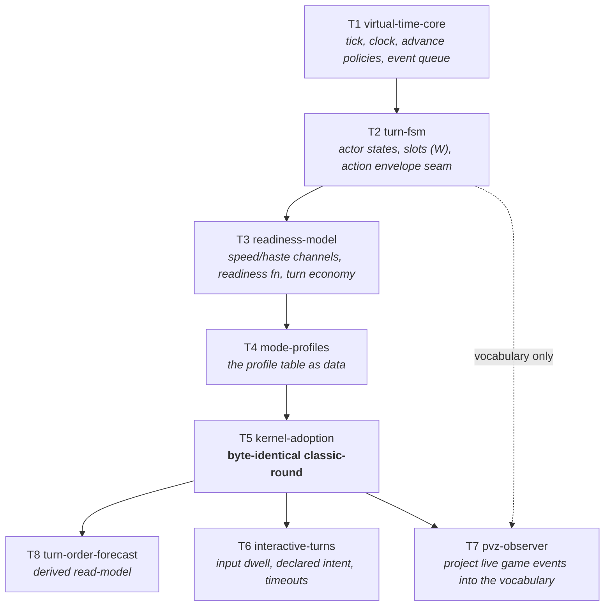

# Capability map — battle-timeline (the virtual-time battle kernel)

**Status:** **Map approved 2026-08-21.** T1–T5 specced ([battle/](battle/spec-virtual-time-core.md)); T6–T8 held pending the open questions below. **Phase 1 (T1–T4, Checkpoint A) and Phase 2 (T5, `BattleEngine` adoption, Checkpoint B) both built and closed 2026-08-28** — see `tasks/battle-timeline-todo.md` B2–B15. Phase 3 (T9, the deliberate timing fix) is next and unbuilt. Ideal: [battle-turn-ideal.md](battle-turn-ideal.md). Grounding: `chaos-backend-service/docs/combat-core/{01,05,08}`.

| Module | Spec | State |
|---|---|---|
| T1 `virtual-time-core` | [spec](battle/spec-virtual-time-core.md) | specced |
| T2 `turn-fsm` | [spec](battle/spec-turn-fsm.md) | specced |
| T3 `readiness-model` | [spec](battle/spec-readiness-model.md) | specced |
| T4 `mode-profiles` | [spec](battle/spec-mode-profiles.md) | specced |
| T5 `kernel-adoption` | [spec](battle/spec-kernel-adoption.md) | specced — **the safety gate** |
| T9 `subsystems-on-timeline` | — | **new (audit D5)**: status pulses + shield upkeep onto kernel ticks. Deliberate behavior change — version bump, re-bless, sweep. After T5 |
| T8 `turn-order-forecast` | — | spec at wave start: pure projection of the queue |
| T6 `interactive-turns` | — | spec at wave start: `Ready` dwell, intent declaration, **timeout recorded as a decision at a tick** |
| T10 `decision-trace` | — | **new (decision 3)**: `(setup, seed, trace)` determinism; trace persisted as the battle progresses; sweep refuses incomplete traces; expeditions barred from interactive profiles by assertion |
| T11 `live-sessions` | — | **new (decision 3)**: SignalR session lifecycle, reconnect, AFK. Depends on T6 + T10 |
| T7 `pvz-observer` | — | last: stateless projection, injector hot path, perf budget |
| T13 `injector-kernel-drive` | — | **new (decision 5)**: the kernel ticks inside the Unity frame and takes over the injector's ad-hoc timing grids (100 ms shield tick, 100 ms DoT grid) — those grids *are* a primitive scheduler, so this is the program's SSOT argument applied to the injector. **Highest-risk module**, sequenced last, gated by a stress measurement |
| P1 `kernel-performance` | [spec](battle/spec-kernel-performance.md) | **cross-cuts T1–T13.** The kernel runs per-frame in the injector (owner decision), so it is frame-critical Unity code: zero steady-state allocation, O(log n) operations, bounded resumable drains. Budgets inherited from `perf-probe-plan.md`, not restated |

**Performance is a constraint on type design, not a later pass.** Because the kernel ticks inside the Unity frame, the expensive mistakes are structural — a class where a struct belongs, a string key on a tick path — and they cost a rewrite rather than a tune. Enforced on two surfaces: **deterministic allocation and operation-count assertions in CI** (a wall-clock test in CI measures the build agent's mood), and **`PerfProbe` sections** measured live against the B1–B9 matrix. Standing clarification: the kernel schedules *our* timeline; Unity still owns when the game's own actors act, so PvZ stays observed and T7 stays a stateless projection.

**Audited 2026-08-21** — four passes (design red-team, code-integration verifier, forward-fit, owner process). Findings folded into T1–T5; see [audit-2026-08-21.md](battle/audit-2026-08-21.md). The thesis survived for actor-scheduled modes; the action model was underbuilt and the build order validated in the wrong order. Both are corrected below.

**Owner decisions (2026-08-21), post-audit:**

1. **Full kernel.** Reaction lane, side-scheduled press-turn, *and* multi-actor link-strikes are all in scope — the three mechanics the audit proved cannot be profile rows. T2 and T3 grow accordingly.
2. **T9 after the gate, versioned.** T5 preserves today's sub-round under-delivery; T9 fixes it deliberately with a `RulesetVersion` bump, one re-bless, and a sweep.
3. **Full live sessions.** Interactive battles ship with real input, which makes the determinism trace mandatory rather than optional — `(setup, seed)` stops being a complete description of a battle.
4. **Profile is content-chosen, per wave / per tier.**

**Decision 4 has a free resolution worth recording.** `BattleSetup` already carries `WaveId`, and the expedition tier is known at collect time — so the profile is **looked up from the existing content id** (`WaveCatalog.Get(waveId).Profile`, defaulting to `classic-round`) rather than stored. That satisfies "content chooses" with **zero serialization change**, which is what keeps the four expedition hashes still. A profile id field on `BattleSetup` remains a named Never in T5.

**Scope honesty:** decisions 1 and 3 together roughly double this program. The build order below is arranged so the existing game is protected early (the gate at T5) and every piece of new machinery lands behind its own checkpoint afterwards.

**Prerequisite before any build:** a `decisions.md` row. AGENTS.md makes architecture changes that lock behavior a hard boundary, and no battle-time-model row exists today. This program locks the virtual-time DES kernel, tick = 1 ms, and the mode-as-data rule.

## What this program is

A **virtual-time battle kernel**: a simulation clock, an event scheduler, and a per-actor state machine, on which every battle mode is a *configuration* rather than a code path. Formally this is discrete-event simulation — the two time-advance mechanisms (next-event and fixed-increment) are what make turn-based and real-time the same architecture.

**It exists to be the foundation for combat action management** (skills, attack, defence, movement, interaction). Those are the *next* program. This one defines the timeline they get scheduled on and the envelope they must fit.

## Scope boundary — read this first

| In scope | Out of scope (the next program) |
|---|---|
| Tick, clock, time-advance policies, dilation | Any specific skill, attack, or defence |
| Event queue, scheduling, cancellation | Damage math (**done** — resolver + pipeline + shields) |
| Per-actor state machine and transitions | Targeting shapes, AOE, line of sight |
| Concurrency width `W`, action slots | Projectiles as actors |
| Readiness function, Speed/haste stats | Movement and positioning |
| Turn economy (pluggable: one-action / AP / press-turn) | Skill content and catalogs |
| The **action envelope** — wind-up, recovery, cooldown class, commitment | What an action *does* |
| Mode profiles; interactive input dwell | Mid-battle mode switching (deferred prior art) |

The kernel must be provable with **zero real actions** — a test actor whose "action" is a no-op still exercises every state, every transition, and every scheduling path. If it can't be, the seam is in the wrong place.

## Dependency graph

## Modules

**T1 `virtual-time-core`** — The tick (proposed: **1 tick = 1 ms**, matching every duration the codebase already stores), the simulation clock, the two advance policies (next-event jump / fixed-increment step) plus dilation and pause, and the Future Event List: a priority queue keyed `(dueTick, stableSeq)` supporting schedule, cancel, and reschedule. Integer math only. *Independently testable: no actors, no game — clock and queue semantics alone.*

**T2 `turn-fsm`** — `Charging → Ready → Committed → Resolving → Recovering`, with `Incapacitated` as an orthogonal suspending layer and `Dead`/`Withdrawn` as exits. Owns the concurrency width `W` and slot acquisition, and defines the **action envelope** the next program must fill: wind-up ticks, recovery ticks, cooldown class (global / category / specific, per Chaos 05), and commitment (early-bound vs late-bound target). *Testable with a no-op action.*

**T3 `readiness-model`** — Speed and haste as real derived channels (names inherited from Chaos 01), the readiness function `next = now + (cost × rank × haste) / speed`, the seeded initiative tiebreaker, and the **turn economy as a pluggable strategy** — one-action, Action Points, or press-turn — so the gameplay choice (open question 2) does not become an architectural one. *Testable as pure functions over stat snapshots.*

**T4 `mode-profiles`** — A profile is data: advance policy + `W` + commitment + readiness function + economy. Ships `classic-round`, `galaxy-sync`, `hybrid-atb`. **Acceptance is structural: adding a mode adds a row, never a branch in the kernel.** If a profile needs an `if` inside the scheduler, the abstraction failed and we find out here, cheaply.

**T5 `kernel-adoption`** — `BattleEngine` stops owning its round loop and runs on the kernel under `classic-round`. **The gate: byte-identical.** All four battle goldens and all four expedition goldens unchanged, `RulesetVersion` stays 2, no economy sweep needed. Per the owner pick, any drift is a bug. This is the highest-risk module and the one that proves the whole design.

**T6 `interactive-turns`** — The input dwell in `Ready`: declared intent, `input_window_ms`, `afk_timeout_ms`, `round_time_ms` (defaults inherited from Chaos 08), and the default-action-on-timeout policy. Carries a server-contract question (open question 4) — pre-declared intent first, live sessions later, is the cheaper path.

**T7 `pvz-observer`** — Projects injector-observed Unity events into the same state vocabulary so telemetry, VFX, and the forecast speak one language across modes. **An adapter, not a scheduler** — we never pretend to schedule PvZ. Touches the injector hot path, so it carries a perf budget and lands last.

**T8 `turn-order-forecast`** — Pure projection of the queue: roll forward `K` events with no mutation, render the rail. Exact for `galaxy-sync`, soft-bounded for `hybrid-atb`, absent for real-time. Cheap, and it validates that the queue really is the single source of truth.

## Build order and checkpoints

1. **T1 → T2 → T3 → T4** — the kernel, pure, with **a real action driven through it** (T4's validation profile), not just a no-op.
   **Checkpoint A — capability — closed 2026-08-28:** every state and transition covered; `W` proven by contrast at `W=1` vs `W=2` with non-zero wind-up; the `Downed` revive path proven; a basic attack runs end to end under `galaxy-sync`. Zero production code rewired. Full evidence: `tasks/battle-timeline-todo.md` Checkpoint A.
2. **T5** — adoption.
   **Checkpoint B — safety — closed 2026-08-28:** goldens byte-identical, six suites green with no test edits, four boundary guards green. Nothing proceeds past a drift. Full evidence: `tasks/battle-timeline-todo.md` Checkpoint B (B13–B15).
3. **T9** — subsystems onto the timeline.
   **Checkpoint B2 — the deliberate change:** status pulses and shield upkeep fire at true times; `RulesetVersion` bumps; goldens re-blessed **once** with a predicted delta; win-rate sweep run and signed off.
4. **T8 → T6 → T7** — the new capabilities, cheapest and safest first.
   **Checkpoint C:** each new profile has determinism replays and report-event coverage; injector perf budget held.

**Why the order changed (audit D4):** the original plan built four modules of abstraction and then validated them against `classic-round` — the profile that uses the kernel *least*. With zero wind-up, `Commitment` is unobservable; with `W = N` and simultaneous readiness, slot contention is unobservable; with constant readiness, the readiness function is unobservable. `ActionEnvelope` would have reached the gate with **no consumer at all**. Checkpoint A now proves capability, Checkpoint B proves safety, and they are different questions.

## What this does to the enrichment plan

[spec-battle-enrichment.md](combat/spec-battle-enrichment.md) is **partly superseded and should be rebased after T5**:

- **E2 skills** — was the wave that most needed this. A cooldown *is* a readiness function; skills become actions on the timeline rather than a bolt-on. Respec after T5.
- **E1 riders** — a DoT pulse is a scheduled event. Rebasing fixes the sub-round `PeriodMs` under-delivery the current round loop cannot express.
- **E3 hybrid payloads** — genuinely independent (resolver-side, not timeline-side). **Can ship any time**, before or after this program.

## Standing constraints

- **Determinism** is inherited, not renegotiated: integer ticks, total ordering by `(dueTick, stableSeq)` never dictionary order, one seeded RNG stream per system, platform stamp still applies.
- **Every HP delta still flows through the pipeline** — the resolver → `DamageApplyPipeline` → shield gate path is finished and unchanged. The ban test stays green.
- **Git stays hands-off**; commit drafts are handed over per task group.

## Open before build

Answered in the ideal's owner picks: interactivity, mode scope, Speed, migration. Still open and listed in [battle-turn-ideal.md](battle-turn-ideal.md) §10 — the Speed/byte-identical resolution needs confirming (readiness is profile-scoped; `classic-round` ignores Speed), plus which profile expeditions run, which turn economy, whether `W` is content-configurable, and how live an interactive battle is.
