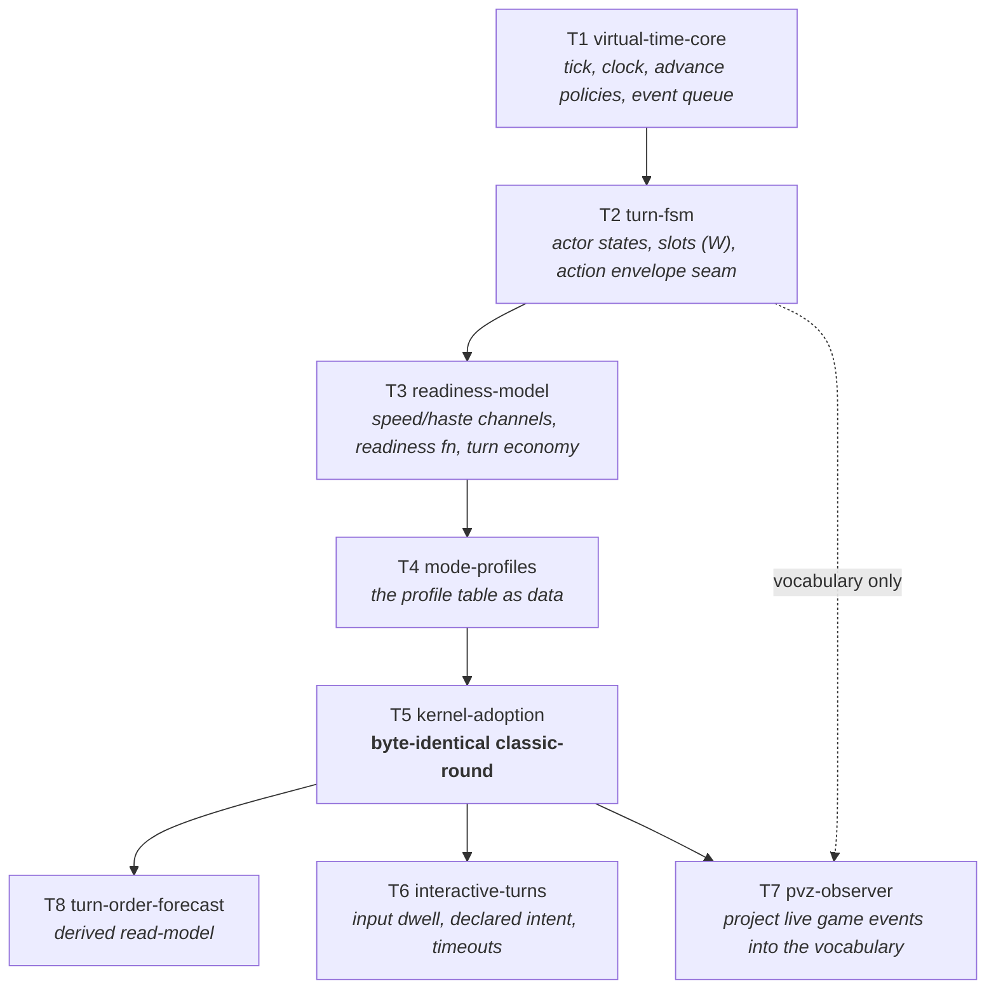

# Capability map — battle-timeline (the virtual-time battle kernel)

**Status:** **Map approved 2026-08-21.** T1–T5 specced ([battle/](battle/spec-virtual-time-core.md)); T6–T8 held pending the open questions below. **Phase 1 (Checkpoint A), Phase 2 (Checkpoint B), and Phase 3 / T9 (Checkpoint B2) all built and closed 2026-08-28** — see `tasks/battle-timeline-todo.md` B2–B18. T9 was not itself a bump (its fix has zero measurable delta on today's content — see `decisions.md`'s Battle time model row for the recorded trigger condition); **the live `RulesetVersion` is nonetheless 4 — see the box below.** Phase 4 (interactive battles) is next and unbuilt. Ideal: [battle-turn-ideal.md](battle-turn-ideal.md). Grounding: `chaos-backend-service/docs/combat-core/{01,05,08}`.

---

## ⛔ Reconciliation pass — 2026-09-04

The kernel was specced 2026-08-21 and built through 2026-08-31. In that window the repo adopted the
**power ladder** and the **tunables SSOT** (both 2026-08-24) and closed the **action vocabulary**
(2026-09-02), and two unrelated streams moved this engine's `RulesetVersion`. **The code kept up; the
documents did not.** This box records what was corrected, so the next session does not rediscover it.

**Audited clean — and explicitly not to be "fixed":** `audit-overflow.py` A1/A2 clean;
`audit-magic-numbers.py` M1 = 0 repo-wide; `TurnReadiness` and `CooldownMath` are `long` end to end
with `checked(...)` and throw rather than clamp; `MinTicksFloor`, `MaxPopPerPass`, `MicrosPerTick` and
`ReactionLane.DepthLimit` all carry the structural-exemption comment the standard requires. The
kernel meets current numeric standards already.

| # | Corrected | Was | Is |
|---|---|---|---|
| **D1** | `RulesetVersion` | Three documents assert **2** — including `spec-kernel-adoption.md:19,107`, where "still 2" is a *success criterion* | **4** (`BattleModels.cs:95`). Two bumps from unrelated committed streams; provenance `action-todo.md:344`, held at 4 by owner choice 2026-08-28 (`action-todo.md:1398`). T5's gate is **not** invalidated — it proved byte-identity at the version current *then*, which is what it was for |
| **D4** | `turn.*` channels | The ideal §10a says they *"stay unregistered"* | **Registered** (`DerivedStatRegistry.cs:110-112`) — correctly, by that same rule ("this stream registers each one when it gives it a reader"). The rule is right; the state sentence is stale |
| **D5** | The action layer | The scope table below puts action content in *"the next program"* | **Shipped.** `RpgStore.Actions.cs:321` builds an `ActionEnvelope` per `ActionRow` beside `ActionKind`/`ActionTag`/`ActionCategory` — `decisions.md:97`'s join row, real. T19 wired `ActionCatalog` into battle 2026-08-30 |
| **D6** | The power ladder | One incidental mention across this map, the ideal and eight specs | Stated in **§ Position on the power ladder** below |
| **D7** | The ideal's §10 open questions | A flat list mixing answered and open | Triaged in **§ Open questions, triaged** below |
| **W2** | The kernel's balance surface | Profiles and speed/haste constants in code; `battle.v1.json` has no timeline section | New module **T14 `timeline-tunables`** |

**Not corrected here, deliberately:** the `RulesetVersion` history belongs in `decisions.md` (whose
row 48 records only the power dial's 2→3) and the "stays 2" success criteria are inside
`spec-kernel-adoption.md`. Both are edits to files this map does not own; they are named so they are
not lost.

## Position on the power ladder

Added 2026-09-04 (D6). [ssot-power-scale.md](power/ssot-power-scale.md) is project-wide and predates
none of the battle code, yet no battle document has ever stated where the kernel sits on it.

**Readiness and initiative are a _contest_, and contests read `Θ` linearly.** `DESIGN-GATE.md`
invariant 14: *"Contests are decided by **differences**, which is why the contest read must stay
linear — a geometric curve makes a fixed level gap unboundedly decisive."* Turn order is decided by
comparing two actors' rates; if speed were shaped by `P(Θ)`, a fixed level gap would eventually mean
one side never acts at all. `TurnReadiness` is therefore correct as built — pure integer arithmetic
over `(work, rate)` with **no level curve of its own**, which is also why it is not in §10's
inventory of power-shaped scales and must not be added to it.

**Battle _magnitudes_ — damage, hp, shields — read `P(Θ)`**, and they already do: battle resolves
through the overlay SSOT (`combat-unification-map.md` decision 1), which is where the ladder is
applied. The kernel schedules; it never computes a magnitude, so it never needs the curve.

**The one thing to watch:** if a future profile makes speed itself scale with level, that is a new
`f(level)` and it needs a reviewed row in §10 before it is written — not after.

## Open questions, triaged

Added 2026-09-04 (D7). The ideal's [§10](battle-turn-ideal.md) lists five and
[spec-injector-kernel-drive.md](battle/spec-injector-kernel-drive.md) §11 two, undifferentiated.
Three are answered.

| Question | State |
|---|---|
| Which profile does content pick? | ✅ **Answered free** — `WaveCatalog.Get(waveId).Profile`, no serialization change. Recorded in this map's decision 4 note below |
| Which turn economy for interactive? | ✅ **Architecturally answered** — `ITurnEconomy` ships `PerActor`/`PerSide` and a press-turn outcome enum. The *gameplay* pick stays open, but it is a config choice now, not a design one |
| Speed real vs `classic-round` byte-identical | ✅ **Answered by construction** — readiness is profile-scoped; `classic-round` ignores speed. Shipped and proven by Checkpoint B |
| Which profile do expeditions and web matches run? | ✅ **`hybrid-atb`** (2026-09-04) — **W=4**, `FixedIncrement` advance, `EarlyBoundWithFallback`, ActionPoints(2/round); reaction lane and rendezvous off. New module **T15** owns the migration |
| Is `W` content-configurable? | ✅ **Yes, per wave** (2026-09-04) — `WaveCatalog` owns it. T14's config shape revised accordingly |
| How live is an interactive battle? | ✅ **True live SignalR sessions** (2026-09-04) — **this makes T10 mandatory**; T6+T10+T11 ship together |
| Does the kernel clock pause with the game? | ✅ **Fully scaled** (2026-09-04) — stops on pause **and accelerates on fast-forward**, see the box below |
| One kernel instance per board or per match? | ✅ **Per board**, torn down at `board.end` with the existing `ClearAll` barrier |

**All seven closed 2026-09-04.** Full reasoning and the two consequences that are easy to misread:
`decisions.md`, **Battle engine open questions (2026-09-04)**.

> ### ⛔ Two clocks, and only one of them scales
>
> Recorded because the fully-scaled decision is the kind that gets over-applied by the next session.
>
> - **The injector kernel clock scales** — it follows `Time.timeScale`, which `CheatActions.cs:28`
>   allows up to **10×**. So a DoT on the lawn ticks ten times as often on fast-forward. **This is
>   chosen, not a bug.** `event-pipeline-v2-ssot.md` records that unscaled was originally picked to
>   prevent exactly this; the owner was shown that and confirmed the change anyway.
> - **The battle/expedition clock does not, and cannot.** Core has no `Time.timeScale`, and
>   `SimulationClock` may not read a wall clock at all — `spec-virtual-time-core.md`'s
>   non-negotiables. Battle resolution is virtual-time and instantaneous.
>
> **They are separate on purpose. A change to one is never automatically a change to the other.**

---

| Module | Spec | State |
|---|---|---|
| T1 `virtual-time-core` | [spec](battle/spec-virtual-time-core.md) | specced |
| T2 `turn-fsm` | [spec](battle/spec-turn-fsm.md) | specced |
| T3 `readiness-model` | [spec](battle/spec-readiness-model.md) | specced |
| T4 `mode-profiles` | [spec](battle/spec-mode-profiles.md) | specced |
| T5 `kernel-adoption` | [spec](battle/spec-kernel-adoption.md) | specced — **the safety gate** |
| T9 `subsystems-on-timeline` | — | **new (audit D5)**: status pulses + shield upkeep onto kernel ticks. Deliberate behavior change — version bump, re-bless, sweep. After T5 |
| T8 `turn-order-forecast` | — | spec at wave start: pure projection of the queue |
| T6 `interactive-turns` | — | spec at wave start: `Ready` dwell, intent declaration, **timeout recorded as a decision at a tick** |
| T10 `decision-trace` | — | **new (decision 3)**: `(setup, seed, trace)` determinism; trace persisted as the battle progresses; sweep refuses incomplete traces; expeditions barred from interactive profiles by assertion |
| T11 `live-sessions` | — | **new (decision 3)**: SignalR session lifecycle, reconnect, AFK. Depends on T6 + T10 |
| T7 `pvz-observer` | — | last: stateless projection, injector hot path, perf budget |
| T13 `injector-kernel-drive` | [spec](battle/spec-injector-kernel-drive.md) | **specced 2026-08-31, ~~⛔ awaiting owner review~~ REVIEWED AND APPROVED 2026-08-31 — B24 is `[x]`, and this row went on saying otherwise until 2026-09-04.** The stale row was then read as the item's state and cost a run real time; **the todo, not the map, is authoritative for item state.** B24's acceptance ("spec reviewed before any injector edit") is met, so B25's injector half, B26 and B27 were never blocked. **Built and green 2026-09-04:** `KernelDriveHost` drives both 100 ms grids as scheduled events from `InjectorLoop`, with `FUSIONRPG_KERNEL_GRIDS=0` reverting to the accumulators. ⛔ The clock is **fully scaled** (2026-09-04 reversal of the spec's original unscaled answer) — it stops on pause and **accelerates to 10× on fast-forward, deliberately**. The kernel ticks inside the Unity frame and takes over the injector's ad-hoc timing grids (100 ms shield tick, 100 ms DoT grid) — those grids *are* a primitive scheduler, so this is the program's SSOT argument applied to the injector. **Highest-risk module**, sequenced last, gated by a stress measurement (P2 ✅). The Core-side primitives (`DeltaTickAdvance`, `TimelineDrive`, bounded `PopDue`) are **built and green** — they are not injector edits, so they are not behind the review gate |
| T14 `timeline-tunables` | [spec](battle/spec-timeline-tunables.md) | **new 2026-09-04 (reconciliation W2)**: the kernel's balance surface is code, and `battle.v1.json` has no timeline section at all. Triages every number under `Battle/Timeline/` into published-to-config or documented-structural — no third outcome. Four real moves, nine rows already correct or out of scope. **Byte-identical acceptance**: it relocates values, it does not change one, so a moved golden is a defect in the module. Also where the ideal's "is `W` content-configurable" question gets decided, because publishing `W` is what makes it a lever |
| T15 `profile-migration` | [spec](battle/spec-profile-migration.md) | **new 2026-09-04, from the profile decision.** Move expeditions and web matches from `classic-round` to `hybrid-atb`, making `turn.speed`/`turn.haste` live in production for the first time. **The highest-risk module in the program after T13** — it is the only one that deliberately moves the economy. ~~Carries the win-rate sweep, the expedition tier-hash re-bless, and the shared `RulesetVersion` **4 → 5** bump. **Lands back-to-back with B26's scaled clock under one re-bless**.~~ ⭐ **All of that was retired by measurement on 2026-09-04: it carries none of them.** Three predicted golden-movers turned out to move nothing — B26 (the scaled clock is injector-side; Core has no `Time.timeScale`), B36 (the golden fixtures use `"golden-*"` wave ids absent from `WaveCatalog`, and the expedition tier hash covers the *plan*), and B39 (readiness only reorders when speeds differ, and no content authors `turn.speed` yet). **`RulesetVersion` stays 4** — a bump is earned by a moved golden. **BUILT: B36 flipped 2026-09-04; B39 wired readiness into turn order the same day.** **Two tasks precede the migration itself:** (a) close the `KernelPurityScan` hole — it matches the `float `/`double ` declaration tokens, so `var x = 1.5f;` slips past (planted and verified during B25, left as owner's call, **answered 2026-09-04: fix it**), and determinism is the foundation all of this sits on; (b) **measure `FixedIncrement` expedition resolve and the boot sweep** against the `NextEvent` baseline — `hybrid-atb` is the only profile that steps rather than jumps, and the cost is estimated, never measured. If it is real, `galaxy-sync` for expeditions is the pre-agreed fallback |
| P1 `kernel-performance` | [spec](battle/spec-kernel-performance.md) | **cross-cuts T1–T13.** The kernel runs per-frame in the injector (owner decision), so it is frame-critical Unity code: zero steady-state allocation, O(log n) operations, bounded resumable drains. Budgets inherited from `perf-probe-plan.md`, not restated |

**Performance is a constraint on type design, not a later pass.** Because the kernel ticks inside the Unity frame, the expensive mistakes are structural — a class where a struct belongs, a string key on a tick path — and they cost a rewrite rather than a tune. Enforced on two surfaces: **deterministic allocation and operation-count assertions in CI** (a wall-clock test in CI measures the build agent's mood), and **`PerfProbe` sections** measured live against the B1–B9 matrix. Standing clarification: the kernel schedules *our* timeline; Unity still owns when the game's own actors act, so PvZ stays observed and T7 stays a stateless projection.

**Audited 2026-08-21** — four passes (design red-team, code-integration verifier, forward-fit, owner process). Findings folded into T1–T5; see [audit-2026-08-21.md](battle/audit-2026-08-21.md). The thesis survived for actor-scheduled modes; the action model was underbuilt and the build order validated in the wrong order. Both are corrected below.

**Owner decisions (2026-08-21), post-audit:**

1. **Full kernel.** Reaction lane, side-scheduled press-turn, *and* multi-actor link-strikes are all in scope — the three mechanics the audit proved cannot be profile rows. T2 and T3 grow accordingly.
2. **T9 after the gate, versioned.** T5 preserves today's sub-round under-delivery; T9 fixes it deliberately with a `RulesetVersion` bump, one re-bless, and a sweep.
3. **Full live sessions.** Interactive battles ship with real input, which makes the determinism trace mandatory rather than optional — `(setup, seed)` stops being a complete description of a battle.
4. **Profile is content-chosen, per wave / per tier.**

**Decision 4 has a free resolution worth recording.** `BattleSetup` already carries `WaveId`, and the expedition tier is known at collect time — so the profile is **looked up from the existing content id** (`WaveCatalog.Get(waveId).Profile`, defaulting to `classic-round`) rather than stored. That satisfies "content chooses" with **zero serialization change**, which is what keeps the four expedition hashes still. A profile id field on `BattleSetup` remains a named Never in T5.

**Scope honesty:** decisions 1 and 3 together roughly double this program. The build order below is arranged so the existing game is protected early (the gate at T5) and every piece of new machinery lands behind its own checkpoint afterwards.

~~**Prerequisite before any build:** a `decisions.md` row.~~ ✅ **Satisfied** — the **Battle time model** row exists (`decisions.md:42`) and locks the virtual-time DES kernel, `1 tick = 1 ms`, and the mode-as-data rule, enforced by an architecture test.

## What this program is

A **virtual-time battle kernel**: a simulation clock, an event scheduler, and a per-actor state machine, on which every battle mode is a *configuration* rather than a code path. Formally this is discrete-event simulation — the two time-advance mechanisms (next-event and fixed-increment) are what make turn-based and real-time the same architecture.

**It exists to be the foundation for combat action management** (skills, attack, defence, movement, interaction). Those are the *next* program. This one defines the timeline they get scheduled on and the envelope they must fit.

## Scope boundary — read this first

> **⛔ "The next program" is now shipped (D5, 2026-09-04).** This table was written 2026-08-21, when
> the action layer did not exist. It does: `ActionRow` carries an `ActionEnvelope` alongside
> `ActionKind` / `ActionTag` / `ActionCategory` (`RpgStore.Actions.cs:321`), T19 wired `ActionCatalog`
> into `BattleRunState` on 2026-08-30, and `A-E1 eligibility-axis` shipped the "who may hold this"
> field. **The right-hand column is still the correct scope boundary — read it as "owned by the
> action program", not as "does not exist yet."** Concretely: targeting, movement and the battle board
> are `action-map.md`'s (`A7`, `A9`, `A10`), and skill content is
> [spec-species-skills.md](combat/spec-species-skills.md)'s.

| In scope | Out of scope (owned by the action program) |
|---|---|
| Tick, clock, time-advance policies, dilation | Any specific skill, attack, or defence |
| Event queue, scheduling, cancellation | Damage math (**done** — resolver + pipeline + shields) |
| Per-actor state machine and transitions | Targeting shapes, AOE, line of sight |
| Concurrency width `W`, action slots | Projectiles as actors |
| Readiness function, Speed/haste stats | Movement and positioning |
| Turn economy (pluggable: one-action / AP / press-turn) | Skill content and catalogs |
| The **action envelope** — wind-up, recovery, cooldown class, commitment | What an action *does* |
| Mode profiles; interactive input dwell | Mid-battle mode switching (deferred prior art) |

The kernel must be provable with **zero real actions** — a test actor whose "action" is a no-op still exercises every state, every transition, and every scheduling path. If it can't be, the seam is in the wrong place.

## Dependency graph

## Modules

**T1 `virtual-time-core`** — The tick (proposed: **1 tick = 1 ms**, matching every duration the codebase already stores), the simulation clock, the two advance policies (next-event jump / fixed-increment step) plus dilation and pause, and the Future Event List: a priority queue keyed `(dueTick, stableSeq)` supporting schedule, cancel, and reschedule. Integer math only. *Independently testable: no actors, no game — clock and queue semantics alone.*

**T2 `turn-fsm`** — `Charging → Ready → Committed → Resolving → Recovering`, with `Incapacitated` as an orthogonal suspending layer and `Dead`/`Withdrawn` as exits. Owns the concurrency width `W` and slot acquisition, and defines the **action envelope** the next program must fill: wind-up ticks, recovery ticks, cooldown class (global / category / specific, per Chaos 05), and commitment (early-bound vs late-bound target). *Testable with a no-op action.*

**T3 `readiness-model`** — Speed and haste as real derived channels (names inherited from Chaos 01), the readiness function `next = now + (cost × rank × haste) / speed`, the seeded initiative tiebreaker, and the **turn economy as a pluggable strategy** — one-action, Action Points, or press-turn — so the gameplay choice (open question 2) does not become an architectural one. *Testable as pure functions over stat snapshots.*

**T4 `mode-profiles`** — A profile is data: advance policy + `W` + commitment + readiness function + economy. Ships `classic-round`, `galaxy-sync`, `hybrid-atb`. **Acceptance is structural: adding a mode adds a row, never a branch in the kernel.** If a profile needs an `if` inside the scheduler, the abstraction failed and we find out here, cheaply.

**T5 `kernel-adoption`** — `BattleEngine` stops owning its round loop and runs on the kernel under `classic-round`. **The gate: byte-identical.** All four battle goldens and all four expedition goldens unchanged, `RulesetVersion` stays 2, no economy sweep needed. Per the owner pick, any drift is a bug. This is the highest-risk module and the one that proves the whole design.

**T6 `interactive-turns`** — The input dwell in `Ready`: declared intent, `input_window_ms`, `afk_timeout_ms`, `round_time_ms` (defaults inherited from Chaos 08), and the default-action-on-timeout policy. Carries a server-contract question (open question 4) — pre-declared intent first, live sessions later, is the cheaper path.

**T7 `pvz-observer`** — Projects injector-observed Unity events into the same state vocabulary so telemetry, VFX, and the forecast speak one language across modes. **An adapter, not a scheduler** — we never pretend to schedule PvZ. Touches the injector hot path, so it carries a perf budget and lands last.

**T8 `turn-order-forecast`** — Pure projection of the queue: roll forward `K` events with no mutation, render the rail. Exact for `galaxy-sync`, soft-bounded for `hybrid-atb`, absent for real-time. Cheap, and it validates that the queue really is the single source of truth.

## Build order and checkpoints

1. **T1 → T2 → T3 → T4** — the kernel, pure, with **a real action driven through it** (T4's validation profile), not just a no-op.
   **Checkpoint A — capability — closed 2026-08-28:** every state and transition covered; `W` proven by contrast at `W=1` vs `W=2` with non-zero wind-up; the `Downed` revive path proven; a basic attack runs end to end under `galaxy-sync`. Zero production code rewired. Full evidence: `tasks/battle-timeline-todo.md` Checkpoint A.
2. **T5** — adoption.
   **Checkpoint B — safety — closed 2026-08-28:** goldens byte-identical, six suites green with no test edits, four boundary guards green. Nothing proceeds past a drift. Full evidence: `tasks/battle-timeline-todo.md` Checkpoint B (B13–B15).
3. **T9** — subsystems onto the timeline.
   **Checkpoint B2 — the deliberate change:** status pulses and shield upkeep fire at true times; `RulesetVersion` bumps; goldens re-blessed **once** with a predicted delta; win-rate sweep run and signed off.
4. **T8 → T6 → T7** — the new capabilities, cheapest and safest first.
   **Checkpoint C:** each new profile has determinism replays and report-event coverage; injector perf budget held.

**Why the order changed (audit D4):** the original plan built four modules of abstraction and then validated them against `classic-round` — the profile that uses the kernel *least*. With zero wind-up, `Commitment` is unobservable; with `W = N` and simultaneous readiness, slot contention is unobservable; with constant readiness, the readiness function is unobservable. `ActionEnvelope` would have reached the gate with **no consumer at all**. Checkpoint A now proves capability, Checkpoint B proves safety, and they are different questions.

## What this does to the enrichment plan

[spec-battle-enrichment.md](combat/spec-battle-enrichment.md) is **partly superseded and should be rebased after T5**:

- **E2 skills** — was the wave that most needed this. A cooldown *is* a readiness function; skills become actions on the timeline rather than a bolt-on. ~~Respec after T5.~~ ✅ **Done 2026-09-04, and the answer was stronger than "respec":** the wave is **replaced** by [spec-species-skills.md](combat/spec-species-skills.md). Its `SkillDef`/`SkillCatalog` turned out to re-invent five things that had shipped under other names, so the module builds no vocabulary at all — it wires two reads whose implementations already exist with zero callers.
- **E1 riders** — a DoT pulse is a scheduled event. Rebasing fixes the sub-round `PeriodMs` under-delivery the current round loop cannot express.
- **E3 hybrid payloads** — genuinely independent (resolver-side, not timeline-side). **Can ship any time**, before or after this program.

## Standing constraints

- **Determinism** is inherited, not renegotiated: integer ticks, total ordering by `(dueTick, stableSeq)` never dictionary order, one seeded RNG stream per system, platform stamp still applies.
- **Every HP delta still flows through the pipeline** — the resolver → `DamageApplyPipeline` → shield gate path is finished and unchanged. The ban test stays green.
- **Git stays hands-off**; commit drafts are handed over per task group.

## Open before build

Answered in the ideal's owner picks: interactivity, mode scope, Speed, migration. Still open and listed in [battle-turn-ideal.md](battle-turn-ideal.md) §10 — the Speed/byte-identical resolution needs confirming (readiness is profile-scoped; `classic-round` ignores Speed), plus which profile expeditions run, which turn economy, whether `W` is content-configurable, and how live an interactive battle is.
