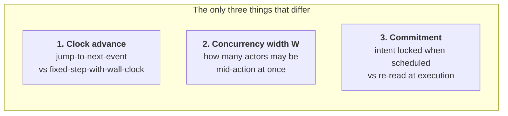
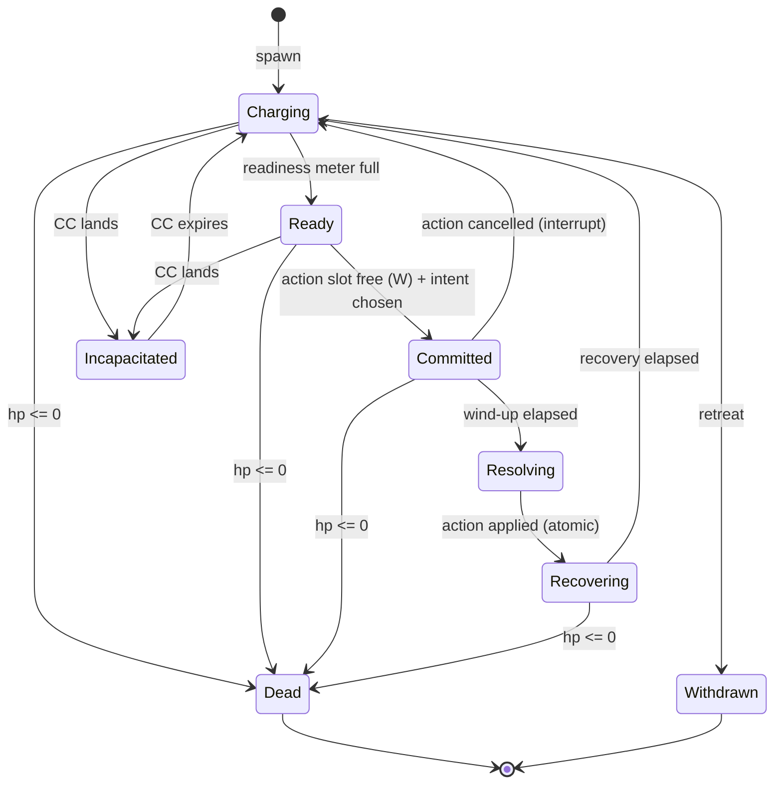
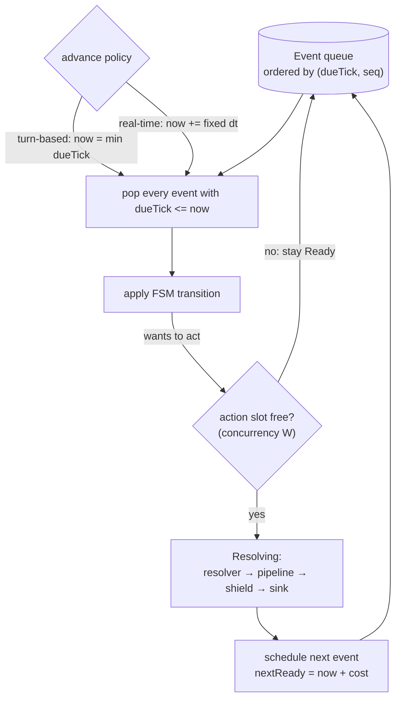
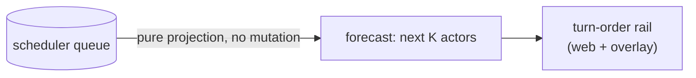

# The ideal — one battle state machine for every mode

**Status:** **Ideal capture (2026-08-21)** — a vision document, not a spec. No module ids, no build order, no acceptance criteria, nothing committed. It exists to be argued with, edited, and cut down before anything becomes a capability map. Written because [battle-enrichment](combat/spec-battle-enrichment.md) (riders → skills → hybrid payloads) has no turn model underneath it, and building cooldowns on a fixed round loop would hardcode the wrong foundation. Prior art in §11.

**Owner picks (2026-08-21):**

- **All four modes are in scope**, including the PvZ observer adapter. Named references: **Shin Megami Tensei** for interactive turn-based, **PvZ / tower-defense** for auto real-time, **FF15** for "feels like hack-n-slash, still turn-based."
- **Battle is both** auto-resolved and interactive — the kernel must support an input dwell from the start, not as a retrofit.
- **Speed is a real stat.** Grounding: the Chaos `combat-core` derived-stat families (§10a).
- **`classic-round` stays byte-identical.** No golden re-bless, no `RulesetVersion` bump, expedition economy untouched. Any drift is a bug, not a judgment call.

**The claim this document makes** (revised 2026-08-21 after the [structured review](battle/audit-2026-08-21.md), which held it in half):

> One virtual-time scheduler serves every mode **where we own the clock**. Turn-based and real-time are not different architectures — they are different *advance policies* over the same virtual clock (§4). A mode is data **as long as the scheduling unit is one actor taking one action**. Economies that schedule a *side* (SMT press-turn) and actions that resolve *inside* another action's resolution (reactions, counters) are kernel features that must be designed in, not profiled in.

What survived the attack: the advance-policy unification, and `classic-round` as a genuine degenerate parameter set. What did not: the original claim covered all four named modes and implied any mechanic was a row away. See the audit for the three that aren't.

---

## 1. The modes we must serve

| # | Mode | Shape | Who owns the clock |
|---|---|---|---|
| 1 | **PvZ realtime** | Totally free; everything acts whenever it wants | **The Unity game.** Not us. |
| 2 | **Synchronous turn-based** (Galaxy Online) | Exactly one actor acts per turn, everyone watches | Us |
| 3 | **Hybrid turn-based** (FF15 / FFXIII shape) | Many actors act at once, but time is still ours to stop | Us |
| 4 | **Today's battle engine** | Everyone acts once per round, initiative-ordered | Us |

Mode 4 is not a fourth design. It is mode 3 with the knobs pinned — which is the first evidence the unification is real.

---

## 2. The three knobs

Everything that distinguishes the modes reduces to these.



**Knob 1 — clock advance.** A turn-based battle and a real-time battle run the *same* event queue. The difference is one function:

- **Turn-based:** simulated time **jumps** straight to the next scheduled event. Zero wall-clock between events.
- **Real-time:** simulated time advances in **fixed steps** tied to wall-clock, and events fire as the clock passes them.
- **Hybrid:** fixed-step, but the step may be paused or dilated (the menu-open slow-motion of FFXIII/FF15).

This is the whole trick. A discrete-event simulation is "a central shared priority queue containing all scheduled events; repeatedly remove the event with the lowest timestamp, set simulation time to that timestamp, execute it." Turn-based orders by turn; real-time orders by timestamp; **both are the same queue**.

**Knob 2 — concurrency width `W`.** How many actors may hold an action slot simultaneously.

- `W = 1` → Galaxy Online. One attack per turn, strictly serialized.
- `W = N` → FF15 hybrid, and today's round loop.
- `W = ∞` → PvZ realtime, no gate at all.

The owner's own framing — *"same state machine and turn management, just different as number of parallel attack at same time"* — is exactly this knob, and it is the one that does the most work.

**Knob 3 — commitment.** Is an actor's target chosen when it becomes ready, or re-read the instant the action lands? Matters enormously once actions have wind-up: a slow spell aimed at a target that dies mid-cast either fizzles (locked) or re-targets (late-bound). Turn-based games usually lock; action games usually late-bind.

---

## 3. The state machine (the SSOT)

One FSM per actor. **Identical in every mode.** The mode changes only how much wall-clock is spent in each state, never which states exist or how they connect.



Reading the modes off this one diagram:

- **Galaxy Online:** only one actor may be in `Committed`/`Resolving` at a time. Everyone else waits in `Ready`.
- **FF15 hybrid:** many actors in `Committed`/`Resolving` concurrently; `Recovering` is the cooldown that keeps it from being a blur.
- **PvZ realtime:** no slot gate, and `Charging`/`Recovering` are driven by the game's own timers rather than ours.
- **Today's engine:** `Charging` is instantaneous (everyone becomes `Ready` at round start), `Committed` has zero wind-up, and `Recovering` is "the rest of the round."

**`Resolving` is atomic and already built.** It is the one place HP moves, and it goes resolver → `DamageApplyPipeline` → shield gate → sink. That layer is finished and unified; nothing in this document changes it. That matters: the expensive half of the work is done, and this design is the scaffolding around it.

---

## 4. The virtual clock, and the scheduler on top of it

**The load-bearing idea: battles run on virtual time, never on wall-clock time.**

A **tick** is the atom of virtual time. Everything schedules in integer ticks, and nothing in the simulation may ask what time it actually is. Proposed unit: **1 tick = 1 ms**, because the codebase already speaks milliseconds everywhere that matters — `RoundDurationMs = 1000`, status `PeriodMs`/`DurationMs`, shield durations at the content boundary. Adopting ms-ticks means content authored today needs no unit translation.

**We already have virtual time — we just have a coarse and rigid version of it.** `BattleEngine` resolves an entire battle instantly, advancing a synthetic clock 1000 ms per round and emitting a timeline of events; the client then plays that timeline back. So the existing engine is *already* a virtual-time simulation whose tick is one round and whose readiness function is a constant. This design doesn't introduce virtual time. It makes the tick fine-grained and the readiness function real.

That distinction is what makes the whole thing tractable: this is a generalization of something that works, not a new runtime.

**Virtual → wall-clock mapping is a per-mode presentation concern, outside the simulation:**

| Profile | How virtual ticks relate to wall-clock |
|---|---|
| `galaxy-sync` | No relation. The clock **jumps** event to event; the battle resolves instantly and the client paces playback however it likes. |
| `hybrid-atb` | Advances at a **dilation factor D** — `D=1` real-time, `D=0` paused, `0<D<1` the slow-motion input window FF15/FFXIII use. |
| `pvz-realtime` | Inverted: the game's frame clock is the source and we **sample** it into ticks. |
| `classic-round` | Jumps 1000 ticks per round. Today. |

Two consequences worth stating plainly:

1. **Simulation and presentation are already separate, and must stay separate.** A resolved battle is a timeline of virtual events. Whether the player watches it unfold over 40 seconds or sees the result immediately is a *playback* decision, not a simulation one. Server-authoritative resolution — which the match-source contract already requires — survives every mode for free.
2. **Replay is virtual-time replay.** Byte-identical reproduction means replaying the same integer ticks, which is exactly why §9 forbids floating-point in scheduling math. Wall-clock never enters the recording.

### The scheduler



**One readiness formula covers every mode.** Integer ticks only:

```
nextReadyTick = now + (BaseCost × ActionRank × HasteFactor) / Speed
```

`Speed` is a `Race` stat in a denominator — it needs a floor above zero, a **structural limit** (PS-8
exempt, must say so in a comment where it's implemented), not a re-derivation here. See
[spec-stat-taxonomy.md §2.4](derived-stats/spec-stat-taxonomy.md) (the divisor rule; the overflow
hazard inverts to *small* values for a denominator, registered in
[power/ssot-power-scale.md](power/ssot-power-scale.md) §11.4, termination guards — not §11.2).

- **FFX CTB** uses the same factors: *"Counter = Tick Speed × Rank × Haste Status"*. **But CTB decrements every tick and ATB fills continuously, so a precomputed arrival time is only equivalent while speed and haste stay constant.** An earlier draft of this document claimed CTB "is literally this" — the audit falsified it: under a precomputed deadline, a Haste landing mid-wait does nothing until the *next* action. Readiness therefore accrues **work**, and rebases when speed or haste change (see [spec-readiness-model.md](combat/../battle/spec-readiness-model.md)).
- **ATB** (FF4+) is the same relation inverted — a gauge filling at a rate set by Speed.
- **Today's engine** is the degenerate case: `Speed` equal for all, `ActionRank` constant → everyone becomes ready together → round-robin.

So adopting the timeline does not *replace* the current behavior; it **contains** it as a parameter set. That is the migration story, and it means `RulesetVersion 2` behavior stays reproducible as a named mode profile while new modes get new profiles.

---

## 5. Mode profiles

A mode is data, not code:

| Profile | Clock advance | `W` | Commitment | Ready formula |
|---|---|---|---|---|
| `classic-round` (today) | jump, fixed 1000 ms | N | late-bound | constant cost |
| `galaxy-sync` | jump to next event | **1** | locked at commit | speed-driven CTB |
| `hybrid-atb` | fixed step | N | late-bound | speed-driven ATB |

**PvZ is not a row — see §6.** It was listed here originally with three of five knobs marked "n/a", which falsified the acceptance rule stated immediately below it. The scheduler serves **three** modes; the state *vocabulary* serves four.

Adding a mode should mean adding a row, not a branch in the engine. If a mode needs an `if` inside the scheduler loop, the abstraction is wrong and we should find out at design time, not after E2.

---

## 6. The honest asymmetry: we author two modes, we *observe* one

This is the most important correction to "one architecture serves every mode."

For modes 2 and 3 we own the clock, the queue, and the outcome — we are the **simulator**. For PvZ realtime we own none of them. Unity spawns, moves, and swings on its own schedule; our injector observes hooks and routes deltas through the funnel.

So mode 1 is an **adapter, not a scheduler**: the injector projects observed game events into the same FSM vocabulary so telemetry, VFX cues, and the turn-order read-model speak one language across all modes. What we must *not* do is pretend we can schedule PvZ — that would be a fiction the hot path would punish us for, and it collides with the standing boundary that we extend combat rather than change the game.

Stated plainly: **one state vocabulary everywhere; scheduling authority only where we actually have it.**

---

## 7. Turn-order forecast — a free read-model

Not a design goal, just something the virtual clock hands over: because the queue *is* the state, "what happens next" is a **pure projection** — copy the queue, roll it forward `K` events with no side effects, render the list. This is FFX's CTB window, and it converts speed from an invisible stat into something the player can plan around.

Worth noting only because it costs nothing and would be expensive to bolt on later.



Fidelity honestly stated, because it degrades and the UI must not lie about it:

- **`galaxy-sync`** — exact. Nothing can reorder between now and the next event.
- **`hybrid-atb`** — exact until something changes a Speed or applies haste/slow/stun; show a soft boundary past the first few entries.
- **`pvz-realtime`** — not a forecast at all. At best a "currently acting" readout.

Design rule: **the forecast is a projection, never a second source of truth.** If the rail and the queue can disagree, we've built the bug the whole SSOT effort exists to prevent.

---

## 8. Why this must land before E1–E3

Each enrichment wave silently assumes a turn model that doesn't exist yet:

- **E1 riders** — a DoT that pulses "every 1000 ms" is a *scheduled future event*. On a round loop that's a round counter; on a timeline it's a tick. Today's sub-round periods already under-deliver because the round loop can't express them.
- **E2 skills** — a cooldown is a **ready-time function**, which is precisely what §4 defines. Build skills on rounds and every cooldown becomes "in rounds," which is untranslatable to real-time and would have to be rewritten for mode 3.
- **E3 hybrid payloads** — the one wave that's genuinely independent; it's resolver-side, not timeline-side.

So the owner's instinct is right, and sharper than "enrichment lacks an ideal": **E2 in particular cannot be designed correctly without §4.** E3 could ship any time.

---

## 9. Determinism rules (non-negotiable, and already house style)

The whole match-source contract is byte-identical replay, so the scheduler inherits the existing discipline:

1. **Integer ticks only** in scheduling math. Floating-point is the documented root cause of desync and broken replays.
2. **Total ordering** — `(dueTick, stableSeq)` where `stableSeq` comes from spawn order. Never a dictionary's enumeration order. *(A live instance of exactly this was found and fixed on 2026-08-21: status host iteration was raw `Dictionary` order and it reached report event ordering.)*
3. **One RNG stream per system**, derived from the seed — the existing `initiative`/`crit`/`essence`/`status` rule, and the reason riders get their own stream.
4. **The platform stamp still applies.** Cross-architecture `Math.Exp` divergence doesn't care which mode scheduled the swing.

---

## 10a. Adopted grounding — Chaos `combat-core`

The owner's own backend design already solved several of these, and we should inherit rather than reinvent. Source: `chaos-backend-service/docs/combat-core/{01_Cultivation_System_Integration, 05_Flexible_Action_System, 08_World_Core_Binding}.md`.

**Speed family (01).** `speed`, `haste` (attack speed), `moveSpeed`, plus `climbSpeed` / `swimSpeed` / `flightSpeed` / `jumpHeight` for movement modes we don't have yet. Our readiness function needs `speed` and `haste`; the rest are reserved names, not build scope.

**Classified `Race` (reconcile pass, F7, 2026-08-25).** All seven names above are `StatClass.Race`
([spec-stat-taxonomy.md](derived-stats/spec-stat-taxonomy.md) §2.1) — none of them ever needed a
counterpart, which used to be an unexamined absence and is now a stated rule. They stay
**unregistered**: this battle stream registers each one when it gives it a reader, not the derived-
stats program (spec-unbuilt-reconcile.md §3's own ban — registering `turn.*` here is out of that
module's scope).

**Initiative formula (08).** `initiative = speed × 1.0 + haste × 0.5 + seeded_tiebreaker`. Note it already carries a **seeded** tiebreaker — the same determinism discipline we enforce, arrived at independently.

**Action Points (08).** A second turn-economy axis I had missed: `base_ap_per_round`, an `ap_cost_formula` derived from the action's `duration_s` and `cooldown_s`, and a `minor_action_threshold_ap` separating minor from full actions. This is what makes "one actor, several small actions per turn" expressible — and it is the same family as **SMT's Press Turn**, where actions spend from a shared per-side turn budget that hits and crits refund. Worth designing the economy as a pluggable budget rather than hardcoding AP.

**Interactive turn timing (08).** `input_window_ms` (1500 default), `afk_timeout_ms` (5000), `round_time_ms`. Exactly the dwell the interactive mode needs, with the timeout policy already thought through.

**Action envelope (05).** `duration` + a cooldown *taxonomy* — global (GCD), category, specific, resource — plus optional `channeling`. Our kernel needs this envelope shape (wind-up, recovery, cooldown class) without any of the action *content*.

**Mode switching (08).** Realtime ↔ turn-based transitions finish the current tick/turn, hand over a deterministic snapshot, and re-attach at the next boundary; in-flight artifacts follow a policy table (projectiles `defer_to_entry`, statuses `persist`, queued actions `remap_to_wait`). **We almost certainly don't need mid-battle mode switching** — our modes are per-encounter, not per-area — so this is recorded as deferred prior art, not scope.

**Deliberately not inherited:** areas, shards, and world-core binding. That model assumes an MMO world server; our world layer is a separate ideal and our battles are discrete encounters. Taking the area/shard machinery now would be borrowed complexity.

---

## 10. Open questions — owner calls, not mine

**Settled** by the owner picks above: interactivity (both), mode scope (all four), Speed (a real stat), and migration (byte-identical `classic-round`).

**One tension those answers create, and how I propose to resolve it.** "Speed is a real stat" and "`classic-round` is byte-identical" cannot both hold if `classic-round` consumes Speed — a varying Speed changes turn order, which changes every golden. Proposed resolution: **Speed is real at the stat layer, but readiness is profile-scoped.** `classic-round` pins its readiness function to the current constant and ignores Speed entirely, so it reproduces today exactly; `galaxy-sync` and `hybrid-atb` are speed-driven from birth. Speed then costs nothing until a battle opts into a profile that reads it. **This needs confirming — it is my reading, not your instruction.**

**Genuinely still open:**

1. **Which profile do expeditions and web matches run?** Staying `classic-round` keeps the economy and goldens frozen. Moving them to a speed-driven profile is a balance change on the order of the U10 re-tune and would need another win-rate sweep.
2. **Which turn economy for the interactive mode?** Three real options with different feels: one-action-per-turn (simplest), **Action Points** (Chaos's model — minor and full actions from a per-round budget), or **Press Turn** (SMT's — a shared per-side budget where hitting weakness refunds, which is the mechanic that makes SMT combat distinctive). This is a *gameplay* decision, not an architectural one, but the kernel should treat the economy as pluggable either way.
3. **Is `W` content-configurable** per encounter, or fixed per profile? Configurable `W` is a genuinely novel difficulty lever — "this boss fight is strictly serialized" — but it widens the test matrix.
4. **How live is an interactive battle?** An input dwell implies a stateful session over SignalR with an AFK timeout, which is a real server-contract change. It may be worth shipping interactive battles as *client-side playback with pre-declared intent* first, and true live sessions later.
5. **Does the world map's turn lock bind the battle layer?** [world-graph-ideal.md](world-graph-ideal.md) locks the *world* to turns. Battle is a different layer and the owner picks above already admit real-time battle modes, so I read these as independent — flagging only because the two ideals should not silently contradict.

---

## 11. Prior art

- **Active Time Battle** (Hiroyuki Ito, *Final Fantasy IV*, 1991) — per-unit gauge filling at a rate set by Speed; the origin of "turn-based but time keeps moving." ([Wikipedia](https://en.wikipedia.org/wiki/Active_Time_Battle), [Final Fantasy Wiki](https://finalfantasy.fandom.com/wiki/Active_Time_Battle))
- **Conditional Turn-Based (CTB)**, *Final Fantasy X* — integer counters, `Counter = TickSpeed × Rank × Haste`, and the on-screen turn-order window this document's §7 is modelled on. ([FFX battle system](https://finalfantasy.fandom.com/wiki/Final_Fantasy_X_battle_system), [CTB window](https://jegged.com/Games/Final-Fantasy-X/Tips-and-Tricks/CTB-Window.html))
- **Active Cross Battle**, *Final Fantasy XV* (Takatsugu Nakazawa) — the hybrid the owner named: real-time action with AI party members and a timed gauge gating special attacks. ([FFXV combat](https://finalfantasyxv.wiki.fextralife.com/Combat), [battle systems](https://finalfantasy.fandom.com/wiki/Battle_system))
- **Discrete-event simulation** — the central-priority-queue formulation that makes §4 one loop instead of three. ([CMU intro](https://www.cs.cmu.edu/~music/cmp/archives/cmsip/readings/intro-discrete-event-sim.html), [Oracle: event-driven simulation](https://docs.oracle.com/cd/E19205-01/819-3703/11_3.htm))
- **Fixed-timestep / lockstep determinism** — why integer math and a fixed step are the price of replay and desync-free simulation; the practice StarCraft and Age of Empires shipped on. ([fixed timestep](https://jakubtomsu.github.io/posts/fixed_timestep_without_interpolation/), [deterministic simulation](https://gamesfromwithin.com/casey-and-the-clearly-deterministic-contraptions))
- **Hierarchical / layered FSMs** — the pattern behind §3's orthogonal `Incapacitated` layer disabling the action FSM beneath it. ([FSM patterns](https://silviocarrera.medium.com/building-game-behavior-with-finite-state-machines-c5756cddc971))

---

## 12. What this document does not do

It does not pick a mode, add a stat, or touch code. It asserts one thing worth arguing with: **turn management is a scheduler, the modes are its parameters, and the action-resolution layer beneath it is already finished.** If that holds, §10's answers turn this into a capability map. If it doesn't, better to break it here than after E2.
