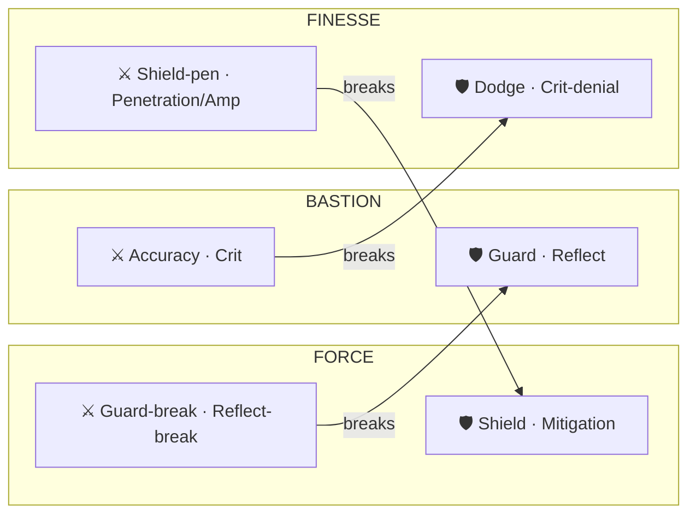

# Class system — the ideal

**Status:** **Ideal captured 2026-08-25. Discussion only — nothing specced, nothing built, no owner
sign-off.** This records a design worked out against the shipped catalog; it is not authority over
anything and does not amend a locked decision by existing.

**Reads (all in the session that wrote this):**
[stat-system.md](stat-system.md) · [actor-hub-ssot.md](actor-hub-ssot.md) §3 ·
[combat-damage-ssot.md](combat-damage-ssot.md) §6 · [resource-hub-ssot.md](resource-hub-ssot.md) ·
[power/ssot-power-scale.md](power/ssot-power-scale.md) §2, §4.6 ·
[element-hub-ssot.md](element-hub-ssot.md) · [design/spec-magnitude-and-units.md](../design/spec-magnitude-and-units.md) ·
[design/spec-derived-stat-sheet.md](../design/spec-derived-stat-sheet.md) ·
[research/chaos-derived-stats-audit.md](../research/chaos-derived-stats-audit.md) §4 ·
`DerivedStatChannels.cs` · `CombatDerivedReader.cs` · `OverlayCombatCalculator.cs` ·
`data/seed/derived-stats/catalog.json`.

**Amends if adopted:** `decisions.md` **Resource model** — (a) five → six pools (`poise`), and (b) a note
that `spirit` is drained by status affliction, which leaves *“never an action cost”* true and should be
seen to (§5c.7).

> ### ⛔ Owner correction, 2026-08-25 — read this before §6 or §7a
>
> **The player has no class. Character building is free.** Points go wherever the player wants, at one
> price, with no posture gate and no in/out-of-posture surcharge.
>
> **Classes survive, but they move.** They become **Zomboss AI patterns** — authored builds that make
> an opponent legible and give a generator a shape to vary. §6 is rewritten to that; §7a.3's class
> price is **deleted**.
>
> This is not a small edit. The class price was one of three cost layers, and it was the layer doing
> the work of *making specialising cheaper than dabbling*. Removing it hands that entire job to the
> share exponent `gamma`, and it changes what "a correct distribution" even means — from *these three
> builds form a cycle* to *no allocation dominates*. §7b is the new section that covers it.

---

## 0.0 State of the design — read this before anything else

**This document is 1,900 lines and it grew as a log.** Sections were written, measured against, and
several were **retracted in place**. That trail is worth keeping — §4 of the design gate is the
argument for recording what a wrong turn cost — but a spec author must not have to reconstruct the
present from it.

**This section is the present. Where it disagrees with a later section, this one wins.**

> **⛔ One ranking decides how to read every number below — the two acceptance criteria are not equals.**
>
> The **termination invariant** (§5d) is **HARD**: measured on quantities that are all live, unfixable
> by any later layer, and it **passes**. The **dominance matrix** (§8.8b) is **SOFT**: measured on a
> partial model, filled by the action/passive/skill layer, and it currently fails **as an upper bound on
> severity rather than as a verdict on the design** (§8.8a).
>
> **A red SOFT row beside a green HARD row is this design working as intended** (§0.2) — not a system in
> two minds, and not a reason to hold the spec. Full argument: §0.2.1.

### 0.0.1 Decided — do not reopen

| | Where | Owner decision |
|---|---|---|
| **Free build** — the player has no class; points go anywhere at one price | §1, §7a.3 | 2026-08-25 |
| **Classes are Zomboss AI patterns**, not player containers | §6 | 2026-08-25 |
| **`spirit` is the status pool** — drained by being afflicted, never an action cost | §5c.3, §5c.7 | 2026-08-25 |
| **Buffs and debuffs cost `qi`**, not `spirit` | §5c.6 | 2026-08-26 |
| **Every pool is shared across all 12 aptitudes** at different scales, with a nonzero floor | §5a.2 | 2026-08-25 |
| **Win rate is the metric** — never fight length, damage dealt or kill time | §0.1 | 2026-08-26 |
| **Termination invariant** — an unending fight between non-degenerate builds is an economy defect | §5d | 2026-08-26 |
| **Deliberate holes** — the aptitude layer is not meant to be complete | §0.2 | 2026-08-26 |

### 0.0.1a Decisions taken 2026-08-26 — the pre-spec gate

Four questions were put to the owner before spec. All four answered; recorded here because §0.0.1 is
what a spec author reads.

| # | Decision | Consequence |
|---|---|---|
| **1** | **Allocation is scoped four ways: commander → demon type → type variant → unique demon.** An actor's allocation is the SUM of four | §7c. **All four map onto shipped concepts** (§7c.5). `aspect` = the actor's element typing — `ActorElementTypes` + `BattleStatComposer`'s affinity divisors are its precedent. **The work it creates is a migration, not a design**: `ElementPrimary`/`ElementSecondary` and `TraitPool` sit on `DemonSpeciesDef` today and move down a tier |
| **2** | **Register `poise`** — `decisions.md` **Resource model** amendment, five → six | Unblocks §5.1 (guard costs something), §5b.3 (its cost shape), §8.9 (BASTION's missing offence). §5b.3's recommendation stands: a flat commit cost **plus** an absorb drain |
| **3** | **Status apply shape: `sigmoid` + a positive `applyOffsetK`** — keep the curve soft, move the neutral point off 50% | Chosen over `linearFromZero` so no amount of resistance confers immunity (rule 5). **It needs a second number** — see §0.0.1b |
| **4** | **Keep 12 aptitudes**, and strengthen `Focus` rather than cut it | §8.1a answers what `Focus` feeds and why it measures dead; §8.1b found the reason is not `Focus` |

**Confirmed the same day, on a veto pass** — each had a standing recommendation and a reason, so they
were put as "change any of these?" rather than re-asked:

| # | Decision | Where |
|---|---|---|
| **5** | **`poise` cost = flat commit + absorb drain ∝ what the guard stopped.** The flat part obeys *committing costs*; the proportional part obeys *price the output* — two rules governing two things, instead of breaking one | §5b.3 |
| **6** | **`poise` regen = per-tick, sized LOW against peer pressure.** Not a binary with per-encounter — that is the `r = 0` corner of the same continuum. Heavy hits break the guard, attrition does not | §8.3 |
| **7** | **BASTION gets a riposte** — spent `poise` converts into damage, so it is no longer the only posture with nothing to spend on winning | §8.9 |
| **8** | **Tier weights: commander SMALLEST, unique LARGEST.** A commander allocation replicates across the whole roster, so a dominant one is the worst case; unique investment is what makes a team diverse | §7c.2 |

**Together, 5 + 6 + 7 make the guard economy a single ratio.** `poise` drains proportionally to what it
stopped, regenerates at a rate sized against incoming pressure, and converts on release — so a heavy
attacker beats a guard by **arithmetic**, not by a special case, and BASTION's defensive spend also
wins fights.

### 0.0.1b Decision 3 needs `applyScaleK` to move with it — measured

`applyOffsetK` alone cannot deliver the chosen shape, because `applyScaleK = 100` is **wide relative to
the ~57-point delta range** an aptitude allocation produces. A sigmoid over ±0.57 of its own scale is
nearly flat, so raising the offset suppresses the specialist almost as fast as the non-investor:

| `applyScaleK` | `applyOffsetK` | non-investor apply | specialist apply | **spread** | non-investor cc lock |
|---|---|---|---|---|---|
| **100** (today) | any | 35–50% | 49–64% | **≤ 14 pts — dead contest** | 73–88% |
| 40 | 25 | 34.9% | 69.0% | 34 pts | 72% — still a near-lock |
| **30** | **60** | 11.9% | 47.5% | **36 pts** | **32%** ✅ |
| **15** | **40** | 6.9% | 75.6% | **69 pts** | **18%** ✅ **widest usable band** |

**Target: a specialist beats a non-investor by more than 30 points, and a non-investor cannot lock.**
Only `applyScaleK` in the **15–30** range satisfies both.

> This is §5c.8's finding arriving from the other side. `applyScaleK = 100` was sized when status power
> came from items; aptitude deltas are an order of magnitude smaller, and **the scale never followed**.
> Offset and scale are one decision, not two: **scale sets how much investment moves the result, offset
> sets where zero sits.**

`applyScaleK` is a `status`-domain tunable, so the value is theirs — but the class system cannot size a
single status coefficient until it lands, and the number is now derived rather than open.

### 0.0.2 Built in `src/` — shipped, tests green, no goldens moved

| | Where |
|---|---|
| `applyShape` (`sigmoid` \| `linearFromZero`) + `applyOffsetK` in `data/tuning/status.v1.json`, defaulting to the shipped behaviour byte-identically | §5c.12 |

Core 3486 · Guard 90 · Data 475, all green.

### 0.0.3 Measured — current numbers, superseding every earlier table

Everything below is on the **current** model: resources purchasable, actions costed, status applied,
regeneration ticked, both model bugs fixed (§8.8c).

| Measurement | Result |
|---|---|
| Closed form vs simulator — core combat | **1.8% mean / 2.4% max** |
| — with the action economy | 0.9% / 2.4% |
| — with status | 4.0% / 5.3% |
| — all four axes live | **4.1% / 7.7%** |
| `Θ`-invariance | **exact** — identical win rates `Θ` 10 → 5,000 |
| **Termination invariant** — the **HARD** criterion (§0.2.1) | ✅ **PASSES everywhere** — net attrition +3,937 to +14,107. Measured on live quantities only (damage, recovery), so nothing in the reservation list can be hiding a failure. **This is the one that had to pass at this layer, and it does.** |
| **Dominance** (win rate, no clock) — the **SOFT** criterion (§0.2.1) | ⛔ `Bulwark` beats all 11 corners — an **UPPER BOUND on severity, not a verdict on the design**: elements were neutralised (§7c.7) and 15–47% of every aptitude is unmeasurable (§8.1d). Owned by the action / passive / skill layer |
| Recovery share `r` | **0.670** — a max-sustain build stretches a fight exactly 3× |
| Marginal value of one point | best is **under 1%** everywhere (`Fortitude` +0.35%, `Vigor` +0.95%, `Bulwark` +0.56%) |

> **The marginal test has lost its resolution, and that is a result rather than a problem.** It was the
> primary instrument at ±3.6%; coefficient work compressed it 10× and every aptitude is now worth
> within a percent of every other. A local gradient that flat cannot rank twelve options. **The
> dominance matrix still shows a 100% spread on the same builds** — because free build converges to
> *corners*, and corners are where the differences live. **Use the corner test; keep the marginal test
> as a secondary read.**

### 0.0.4 Open — every hole named, with the layer that owns it

Per §0.2, a gap a later layer can fill is a design opportunity; a gap no layer can fill is a defect.
**There are no defects in this list.**

| Hole | Owned by | Blocks spec? |
|---|---|---|
| `Bulwark` dominates the corner matrix — **SOFT, and an upper bound** (§8.8a) | **action / passive / skill layer** — a passive scaling damage with damage taken, a reflect build, an anti-turtle status | **No** (§0.2.1: soft). The HARD criterion, §5d, passes |
| 29 catalog families still `unitClass: null` | `unit-class-close` — module 1 of the map | **No** — it is already the first build step |
| ~~Status apply neutral point~~ | **DECIDED: sigmoid + positive offset.** Needs `applyScaleK` 100 → 15–30 with it (§0.0.1b) — status program owns the value | No |
| `netFactorScale = 10` sized for item-tier deltas, not aptitude-scale | status program | No |
| `ApplyScaleKForCategory` ignores its parameter — per-category tuning stubbed | status program | No |
| ~~`poise` is not registered~~ | **DECIDED 2026-08-26: register it.** ADR amendment owed | No |
| `contagion` unmeasurable — a 1v1 has no second host | party simulation, unbuilt | No |
| `cc` turn-loss is modelled crudely, not through readiness | `battle-timeline` owns the readiness model | No |
| ~~Does `Focus` need a mechanism?~~ | **DECIDED: keep 12, and DELEGATE the fix to the action layer** (§8.1c) — flattening it into damage would trade a gameplay mechanism for a measurable number. §8.1a: two of its three dead levers are dead because the HARNESS lacks cooldowns and cost reduction | No |
| ~~The 4th tier is undefined~~ | **DECIDED: it is `aspect` — the element typing** (§7c.4–7c.6). Carries element + derived trait bias + starting skills; strengths/weaknesses are the shipped element ring | No |
| **NEW — move element off the species** | `variant-scope` module. `DemonSpeciesDef.ElementPrimary/Secondary` + `TraitPool` currently sit on the SPECIES, so one species is one element today. Moving them down is a schema + generator change | No — but it is the largest single piece of work §7c creates |
| **NEW — every measurement neutralised elements** (§7c.7) | `residual-fit`, and it should be its FIRST step, not its last | No — but §8.8a's dominance severity is an upper bound until it is redone |
| **NEW — `stamina` is free** (§8.1b): `strike` regen 3,784 > cost 1,544, so it never runs dry | `residual-fit` — an action cost only matters if it exceeds the regen of its pool. **It is the top reservation for 9 of 12 aptitudes (§8.1d)** — one number, more effect than any per-aptitude tuning | No |
| The two acceptance criteria are **coupled** and must be solved jointly | `residual-fit` (§5d.4b) | No |

### 0.0.5 Retracted — do not act on these

| Claim | Where | Why |
|---|---|---|
| A round clock removes the dominant corner, so the design is sound | §8.7a | It changes the **win condition**, penalising long fights. On win rate with no clock the dominance never left (§0.1.2) |
| Status power scales both potency axes from one delta | §5c.4 | The duration/intensity split **already exists** in shipped code; the axes were merely unfed (§5c.11) |
| The class price (in-posture 1, out-of-posture 2–3) | §7a.3 | There is no class to be outside of. `gamma` does that job now |
| The re-solved allocation in `builds/*.json` | §5c.13 | It **failed its falsification** — treat as unverified, not as balance |
| §4.3's "five of twelve are live" and §7b.3's marginal table | §4.3, §7b.3 | Measured on a model with no resources, actions or status and two live bugs. Superseded by §0.0.3 |

### 0.0.6 How to re-verify any of it

```powershell
cd tools\CombatSim
dotnet run --no-build -- predict  --actions basic --status -a force,finesse,bastion --theta 100 -n 4000
dotnet run --no-build -- trinity  --actions basic -a force --theta 100      # dominance + termination
dotnet run --no-build -- marginal --actions basic -a force,finesse,bastion --theta 100
dotnet run --no-build -- status   --actions basic -a force,finesse,bastion --theta 100
```

**No claim in this document should be believed without one of these producing it.** Two of the
measurements it was built on turned out to be model bugs in the tool rather than facts about the
design (§8.8c), and both were found by cross-checking the closed form against the simulator rather
than by reasoning.

---

## 0.1 The metric — win rate, and nothing else

**Owner correction, 2026-08-26.** Recorded first, before anything it invalidates, because it changes
how every measurement in this document should be read:

> **Count win rate. Not fight length, not total damage dealt, not kill time.** A survival or cc build
> makes a fight legitimately longer — a survivalist against a damage dealer takes longer *because* it
> has defence, heal and hp — and it still **loses** if the damage dealer wins the RPS. The damage
> dealer still loses if *it* loses the RPS: it dies to reflection, or to a passive that scales the
> survivalist's damage with damage taken. **Length is not the outcome. The outcome is the outcome.**

### 0.1.1 It reversed a finding on measurement alone

The status sweep (§5c.5) ranked categories by kill time as a share of the no-status baseline. Switching
that one column to win-rate swing, changing nothing else:

| Category | by kill time (wrong) | **by win-rate swing (right)** |
|---|---|---|
| `cc` | **207% of baseline** — read as *cc failing* | **51.9% mean swing — the LARGEST of the three** |
| `dot` | 68% — read as best | 31.2% |
| `contagion` | 70% | 16.3% |

**`cc` went from last to first.** A duration metric scores a crowd-control status as a failure *for
doing its job*, and it did. Nothing about the game changed; the ruler did.

### 0.1.2 ⛔ It retracts §8.7a's clock conclusion

§8.7a reported that a 25-round clock removes the dominant corner, and treated that as evidence the
design was sound once the harness was fixed. **That is withdrawn.**

A clock penalises fights for being **long**. It does clear the dominant corner — by **changing the win
condition**, not by fixing anything. Under win rate alone, with no clock, **the dominance never left**:
`Bulwark` beats every other corner at none, 40, 30, 25 and 20 rounds once win rate is what is counted.

> **The clock manufactured a balance that does not exist.** It is retained as an *encounter design*
> parameter — a real encounter may have a timer — and it must be **off** for any balance judgement.

What §8.7a was reaching for is real, and the **termination invariant (§5d) is the instrument for it**:
that targets fights which can never **resolve**, not fights which are merely long. One is a defect; the
other is a build.

---

## 0.2 Deliberate holes — the system is not supposed to be complete here

**Owner principle, 2026-08-26:**

> The system is not complete. **Leave holes in the matrix and fill them later** with actions, passive
> skills and builds. A perfect system from the beginning is boring, because there is no way to improve
> it.

This is not a licence to ship defects. It is a statement about **which layer owns which gap**, and it
sharpens the two acceptance criteria this document had been treating as equals.

### 0.2.1 The two criteria are not equals

| Criterion | Can a later layer fix it? | Status at the aptitude layer |
|---|---|---|
| **Unkillable pair** (§5d) — recovery ≥ damage on both sides | **No.** It is an economy identity. No passive, action or skill changes the fact that a pool refills faster than it drains — content added on top inherits the defect | **HARD. Must pass here.** |
| **Dominant corner** (§8.8b) — one spike beats all eleven | **Yes.** A passive that scales damage with damage taken, a reflect build, a counter-action, a status that punishes turtling — these are exactly what an anti-tank answer looks like, and they are the owner's own examples | **SOFT here. Hard only once the layers that could fill it exist.** |

> **A gap a later layer can fill is a design opportunity. A gap no layer can fill is a defect.**
> That is the whole distinction, and it is what decides whether an open item blocks the spec.

### 0.2.2 What it changes about "ready to spec"

The ideal does **not** need a perfect dominance matrix. It needs:

1. **No unfixable defect** — the termination invariant passes. ✅ (as of the recovery dial, §5d.4a)
2. **Every gap named, with the layer that owns it** — so a hole is a commitment rather than an oversight.
3. **The tests to exist**, so the layer that fills a hole can prove it did.

The dominant corner is then a **named hole owned by the action/passive/skill layer**, not a blocker.
It is even a useful one: a game whose aptitude layer already answered every question would leave those
layers with nothing to do, which is the owner's point exactly.

**What this does not excuse.** A hole must be *named and assigned*. `Bulwark` dominating is a hole for
the passive layer; it is not "we will get to it". The difference is that the first is written down with
an owner and a test, and the second is discovered later by a player.

---

## 1. The one-paragraph version

Three **postures** — FORCE, FINESSE, BASTION — form a rock-paper-scissors cycle. Each owns **two
defence mechanisms** and **two break mechanisms**, where its breaks are exactly the tools that defeat
the posture it counters. Each owns **four aptitudes** (the RPG-side primary stats) and **two
resources**. **A player is not a class — they are wherever their points are**; a posture is a *region*
of the allocation space, not a container you are placed in. Classes exist only as **Zomboss patterns**
(§6). Elements are orthogonal and come from skills, never from aptitudes.

---

## 2. Why three, and why these three

The cycle is not invented. All three arrows already exist in shipped combat code, and each runs on a
**different mechanism**:

| Arrow | Mechanism | Where it lives today |
|---|---|---|
| **FINESSE → FORCE** | **negation** — a miss deals `0` no matter the power behind it | `if (miss) finalDamage = 0;` |
| **BASTION → FINESSE** | **short-circuit** — a parried/blocked hit never rolls crit | §6.5; `ParryShortCircuits` gives the attacker `crit.rate 10,000` and proves it never fires |
| **FORCE → BASTION** | **saturation** — mitigation removes a fraction, never all; immunity is impossible by construction | `offense × K/(K + defense)`, asymptotic (2026-08-25) |

Three different mechanisms, not one ±25% matrix. That matters: it means the cycle cannot be tuned
away by accident, and it needs **no second matchup table** competing with the element ring.

**This is a competitive trinity, not the cooperative one.** Tank/healer/DPS *combine*; these *counter*.
Both can exist — postures decide who wins an exchange, party roles decide what a squad lacks.

---

## 3. The distribution — 2 defence + 2 break per posture

The catalog has **13 Contest pairs**. One is universal (`power ↔ defense`). The remaining **12 pairs
group into 6 defence mechanisms and their 6 breaks** — exactly 2 + 2 across three postures.

| Mechanism | Pairs | Defence channels | Break channels |
|---|---|---|---|
| Shield | 1 | `shield.toughness` (+`capacity`/`regen`) | `shield.pen` |
| Mitigation | 2 | `absorption` · `reduction` | `penetration` · `amplification` |
| Dodge | 1 | `dodge` | `accuracy` |
| Crit-denial | 2 | `crit.resist` · `crit.resist.damage` | `crit.rate` · `crit.damage` |
| Guard | 4 | `parry.rate/strength` · `block.rate/strength` | `parry.break/shred` · `block.break/shred` |
| Reflect | 2 | `reflect.rate` · `reflect.damage` | `reflect.resist.rate/damage` |

### 3.1 The assignment rule

> **A posture owns the breaks for the mechanisms of the posture it counters.**

> **⚠️ "Owns" means the STRONGEST source, never the only one.** Read literally as exclusivity, the
> tables in §3.1 and §5 contradict two later findings, and the later ones win:
>
> - **Rule 9 (§8.5c):** *a general mechanic cannot be posture-exclusive.* Each time one was left
>   exclusive — `power`, `accuracy`, `crit`, `mitigation` — its owner's counter went **absolute
>   (100/0) and no allocation could fix it.**
> - **§5a.2:** *a resource is as general as the actions it pays for.* `hp` and `stamina` are universal,
>   so they take **five sources each at five weights**, and every pool carries a **nonzero floor** on
>   every aptitude — because a build that can reach zero of a universal pool cannot act at all
>   (measured: 8,725-round fights).
>
> So the correct reading throughout is **specialist-plus-weaker-peers**: the owner keeps the largest
> coefficient and the other postures get real but smaller sources. That is what turns a hard counter
> into a favourable matchup, and it is what the shipped distribution does.


| Posture | Defends with | Breaks | ⇒ beats |
|---|---|---|---|
| **FORCE** | Shield · Mitigation | Guard-break · Reflect-break | **BASTION** |
| **FINESSE** | Dodge · Crit-denial | Shield-pen · Penetration/Amplification | **FORCE** |
| **BASTION** | Guard · Reflect | Accuracy · Crit | **FINESSE** |



Each posture's **⚔ breaks** point at the **🛡 defences** of the posture it counters, and nowhere else.
The cycle closes with no channel left over.

**This makes the cycle structural rather than emergent.** Under §2 the arrows held because of how the
formulas happen to work. Here each posture *literally holds the tools that defeat the one it counters*
— the arrow and the ownership are the same fact, so balance passes cannot quietly break it.

Every channel lands: 12 attacker + 12 defender + the universal pair + 4 owner = **29 combat families,
none orphaned, none doubled.**

### 3.2 The consequence worth naming

BASTION owning **accuracy + crit** is not a concession, it is the point. The patient guardian beats the
evader by being *unerring* — steady aim defeats footwork, and `crit` is precisely what breaks
crit-denial. It also fixes a real hole: before this rule, offence split **11 / 2 / 2** and two postures
had no way to kill anything. It is now **6 / 3 / 3** plus the universal pair.

---

## 4. The twelve aptitudes

**"Aptitude", not "primary".** `StatChannels.All` is already documented as *"The eleven primary
channels"* (`ModifierOp.cs:45`) — the Unity-facing layer. The two must stay separable.

Each aptitude owns **one mechanism role** plus a share of the utility load.

| Posture | Aptitude | Mechanism role | Also carries |
|---|---|---|---|
| **FORCE** | **Might** | universal offence — `power` | `progression.bonus.atk` |
| | **Fortitude** | defence: Mitigation — `defense` · `absorption` · `reduction` | `status.*.dot`, `progression.bonus.defense/arm1/arm2` |
| | **Vigor** | defence: Shield — `shield.capacity/regen/toughness` | `hp` + `stamina` pools, `progression.bonus.maxHp` |
| | **Onslaught** | breaks: Guard + Reflect — `parry.break/shred` · `block.break/shred` · `reflect.resist.*` | — |
| **FINESSE** | **Agility** | defence: Dodge — `dodge` | `move.range`, `status.*.cc` (+`turn.*` when registered) |
| | **Composure** | defence: Crit-denial — `crit.resist` · `crit.resist.damage` | `spirit` pool |
| | **Pierce** | breaks: Mitigation + Shield — `penetration` · `amplification` · `shield.pen` | — |
| | **Focus** | *(utility — see §8.1)* | `qi` pool, `resource.efficiency`, `skill.cooldown.*`, `xpRate`, `breakthroughSuccess` |
| **BASTION** | **Bulwark** | defence: Guard — `parry.rate/strength` · `block.rate/strength` | `poise` pool |
| | **Retribution** | defence: Reflect — `reflect.rate` · `reflect.damage` | `hunger` pool, `status.*.contagion` |
| | **Precision** | break: Dodge — `accuracy` | `skill.effectiveness.*` |
| | **Ferocity** | break: Crit-denial — `crit.rate` · `crit.damage` | `combat.heal.power` |

### 4.1 Two rules every edge carries

1. **Read mode (PS-3).** *Contests read `Θ` linearly; magnitudes read `P(Θ)`.* `Might → combat.power`
   is a **magnitude** edge; `Precision → combat.accuracy` is a **contest** edge. Every edge declares
   which. Without this we re-create the three-incompatible-curves defect the power ladder ended.
2. **Aptitudes feed `omni` only** — the base element. Element-specific channels belong exclusively to
   the skill layer. **Refined by §5c.10:** the rule is *an aptitude reaches a MECHANISM, never a
   FLAVOUR.* Elements are flavours, so aptitudes stop at `omni`. Status **categories** (`dot`/`cc`/
   `contagion`) are mechanisms, so aptitudes reach those too — and the per-status-**id** tier is
   flavour again, so it stays the skill layer's. Both halves stay additive, and they never come from the same currency.

### 4.2 What aptitudes deliberately do not reach

Measured against all 259 registered channels (256 → 259, `poise-resource` 2026-08-26 — the three new
channels are resource pool channels, reached by neither this count nor §4.2's skill-layer count),
aptitudes reach **84 — 32%.**

> **Corrected 2026-08-26: 83 → 84**, counted from the shipped edge list in
> `tools/CombatSim/tuning/aptitudes.v1.json` rather than restated. The same count found that
> **all 84 are registered** in the catalog, but **47 of them (56%) fall outside
> `BattleStatComposer`'s known-channel set** and would throw today — see
> [class-system/spec-distribution-reconcile.md](class-system/spec-distribution-reconcile.md) §3.2a.

| Source | Channels |
|---|---|
| Aptitudes | 84 |
| **Skills / items — every element slot** | **168 (66%)** |
| Structural — `progression.power`/`realm` (they *are* `Θ`) | 2 |
| Unwired — `status.immune`/`immuneReduction`/`expose` (sparse, nothing reads them) | 0 registered |

**Aptitudes are the smaller half by design.** They set breadth; the skill/item layer carries twice the
surface for depth.

### 4.3 The twelve as a player reads them — and how many are actually live

> **⚠️ The "live?" column is STALE.** It was measured before resources, actions or status existed and
> with two model bugs live (§8.8c). The one-line readings are still good; the counts are superseded by
> §0.0.3. The *shape* of the finding survived every correction — one mandatory, most dead — but the
> magnitudes fell about 10×.

A channel list is not an identity. Under free build there is no class name to carry meaning, so **the
aptitude's own one-line reading is the entire identity the player gets**, and every one of the twelve
has to earn a sentence a player would repeat.

| Aptitude | In one line | Live? (§7b.3) |
|---|---|---|
| **Might** | Hit harder. | weak — +0.10% / −1.15% |
| **Fortitude** | Take less of everything. | **mandatory** |
| **Vigor** | More to lose before you lose. | strong everywhere |
| **Onslaught** | Their guard stops mattering. | live vs FINESSE only |
| **Agility** | Be somewhere else. | **dead** |
| **Composure** | Nothing lands clean on you. | **mandatory** for FINESSE |
| **Pierce** | Armour stops mattering. | live vs FORCE only |
| **Focus** | Do it again, sooner, cheaper. | **dead in a duel** — by construction (§8.1) |
| **Bulwark** | Stop it outright, sometimes. | **dead** |
| **Retribution** | Hitting you costs them. | live vs BASTION only |
| **Precision** | They cannot dodge. | **dead** |
| **Ferocity** | Sometimes it is much worse. | **dead** |

**Five of twelve are live.** That is the honest count today, and it is the number that matters — not
twelve.

> **The aptitude count is not a design decision. It is a measured outcome.**
>
> A system does not *have* twelve primary stats because twelve are declared; it has as many as pass
> §7b.2's test. Declaring twelve and shipping five is worse than declaring five, because the player
> spends real attention discovering which seven were decoration. **"How many aptitudes?" is answerable
> only by `marginal`, never by argument** — and it must be re-answered after every coefficient change,
> which is cheap now that it costs milliseconds.

**What the table above is really showing** is that the live five are `Fortitude`, `Vigor`, `Composure`
and the two conditional breaks — i.e. **defence and anti-defence.** Straight offence (`Might`,
`Precision`, `Ferocity`) is dead across the board. §7b.4 has the cause and it is fixable; the point
here is that the *symptom* is legible on the aptitude sheet, in the player's own vocabulary, before
anyone opens a formula.

### 4.4 Two properties every aptitude needs under free build

Both fall out of §7b.2 and neither was required when a class chose for you.

**1. A general component.** An aptitude that pays only against one defence is dead in every matchup
where that defence is absent — and free build lets the player simply not take it. This is measurement
rule 4 restated, and free build makes it binding rather than advisory: `Onslaught`, `Pierce` and
`Retribution` above are each live in exactly one column, which is the shape of the problem.

**2. A reason not to take it.** Harder, and it is the half a class system used to supply for free. If
an aptitude has no matchup where it is *wrong*, it is mandatory. `Fortitude` currently has none — it
is the best point in every column of the measured table — which is why it fails.

> **The symmetric statement, which is the whole of the free-build requirement:**
> **every aptitude needs a fight it wins and a fight it wastes.**

---

## 5. Resources — 2 per posture

The SSOT's own class taxonomy was already **2/2/1** before postures existed:

| Class | Pools | Posture | Structural | Spendable |
|---|---|---|---|---|
| **body** | `hp` · `stamina` | FORCE | `hp` — depletion is death | `stamina` — physical actions |
| **essence** | `spirit` · `qi` | FINESSE | `spirit` — never a cost; harvested as soul | `qi` — skills |
| **energy** | `hunger` · **`poise`** | BASTION | `hunger` — gates regen | **`poise` — parry/block** |

**One new pool completes a taxonomy that already existed.** Each posture ends with one thing it *is*
and one thing it *spends*.

> **⚠️ "Posture" here names the STRONGEST source, not the only one.** Every pool is sourced by all
> twelve aptitudes at different scales with a nonzero floor (§5a.2) — the column above says who leads,
> not who has it. Read as exclusivity it produces builds that cannot act at all.

### 5.1 `poise` — the point of it

BASTION currently reacts **for free**: parry and block are passive procs on the attack roll, with no
cost and no failure state. `poise` fixes that and gives the FORCE→BASTION arrow a **second, economic
mechanism** on top of saturation — win by *pressure*, not only by power.

```text
poiseDrain = removed × PoiseDrainShare          // `removed` is what ClampedContest already computes
```

> **Drain must be proportional to damage removed, never per proc.** Per-proc drain would let many small
> FINESSE hits collapse a guard faster than a few heavy FORCE hits — **inverting the Bastion→Finesse
> arrow.** Proportional drain makes FORCE (few huge hits) break guard fast and FINESSE (many small hits)
> break it slowly, which is exactly the cycle.

| Mechanic | `poise` |
|---|---|
| `parry.*` / `block.*` | **gated** — zeroed at break (exhaustion-as-status, §10's existing vehicle) |
| `reflect.*` | **drains it, is not gated by it** — retribution survives the break |
| `absorption` · `reduction` · `defense` | **untouched** — passives; gating them death-spirals |

Reflect surviving the break is deliberate: it gives BASTION a **two-stage defence** (guard, then
retribution) instead of one cliff, and it is the first real reason Retribution is a separate aptitude
from Bulwark.

**Cost, per §13:** a max channel, a regen channel, an accrual rule, a serialization field, a UI element,
a balance axis, and a golden-visible number. Mitigations already in place: §14 — *"adding a sixth
changes no component"*; §5 — the registry is data; §8 — resource channels never join the combat 196.
**+3 channels, 256 → 259.**

---

## 5a. Resource distribution — and the measurement that was fake without it

**This section exists because the simulation was measuring a fight nobody could build for.** Until
2026-08-25 `hp` was a flat constant in every build: no aptitude could raise it, so mitigation was the
*only* survival lever in the model and had no competitor. The free-build marginal test then dutifully
reported "defence dominates", which was a fact about the harness, not the design.

### 5a.1 The pairing is real, and it was already in the SSOT

**Status: PROPOSED** for `poise` — it is not a registered channel and the sections below say so.

Each posture holds **one pool it *is* and one pool it *spends*** — confirmed against
[resource-hub-ssot.md](resource-hub-ssot.md) §2, not invented here:

| Posture | Survival pool — what you are | Spend pool — what you do | What the spend pays for |
|---|---|---|---|
| **FORCE** (body) | `hp` — depletion is death | `stamina` | move, basic attack, guard, reposition |
| **FINESSE** (essence) | `spirit` — never a cost; harvested as soul | `qi` | skills, anything with a trigger or an element |
| **BASTION** (energy) | `hunger` — gates regeneration | `poise` | parry and block |

> **One asymmetry, and it is worth naming rather than smoothing over.** FORCE and FINESSE each spend
> their pool to *act*: stamina attacks, qi casts. BASTION spends `poise` to **defend**. So BASTION is
> the only posture with no offensive resource — its economy is entirely about outlasting. That may be
> exactly right for a bastion, or it may be the reason BASTION needs a riposte that converts spent
> `poise` into damage. **Undecided; §8.9.**

> ### ✅ Resolved 2026-08-26 — this paragraph is the reasoning trail, not open work
>
> ~~**`poise` is blocked, not merely unbuilt.** `DerivedStatChannels.ResourceIds` is the locked five —
> `hp`, `stamina`, `hunger`, `spirit`, `qi` — so there is no `resource.max` channel for **poise**, and
> the config cannot author it. It needs the `decisions.md` **Resource model** amendment (five → six)
> this document has owed since it was written.~~
>
> The amendment landed: `decisions.md` *Resource model* reads **six** as of 2026-08-26, `poise` is the
> sixth id in `DerivedStatChannels.cs:521`, and `resource.max.poise`/`resource.regen.poise` each carry
> twelve aptitude edges in `data/tuning/aptitudes.v5.json:2570-2762`. What remains is **not** this
> blocker: `BattleStatComposer` seeds no `resource.*` channel for a battle actor, so the pools exist
> and sit at zero — see [battle-tempo/spec-battle-resources.md](battle-tempo/spec-battle-resources.md).

### 5a.2 How general is a resource? As general as the actions it pays for

This is rule 9 (*a general mechanic cannot be posture-exclusive*) applied to pools, and the answer is
**derived, not chosen**:

| Resource | Who needs it | Sources | Because |
|---|---|---|---|
| `hp` | **everyone** | 5 aptitudes at 5 weights | nothing is more universal than not dying |
| `stamina` | **everyone** | 5 aptitudes | it pays for the *basic attack* — a stamina-starved actor cannot act at all |
| `qi` | **broad** | 4, FINESSE strongest | anything with a trigger or an element draws on it |
| `hunger` | **broad** | 4, BASTION strongest | it gates regeneration for every pool |
| `spirit` | **narrow** | 3, FINESSE strongest | **nothing spends it**, so nothing forces a build to buy it |
| `poise` | **narrow** | 1 (blocked) | it pays for guard — **but whether that is an action cost at all is contested, §5b.3** |

**`hp` gets five sources at five different weights**, which is the owner's own requirement —
*"some primary stats will increase HP but less or more depending on the primary stat"*. One aptitude
owning `hp` would make it mandatory by construction: in free build, the stat that keeps you alive
cannot be a stat you can choose not to take.

### 5a.3 `hp` and `shield` must be substitutes — the shield-tank requirement

> *"someone who builds shield with low hp still becomes a tanker"*

For that to be a **build** rather than a footnote, three things have to hold, and the third is the one
that makes it interesting:

1. **Both are purchasable.** Now true — `resource.max.hp` and `combat.shield.capacity.omni` are both
   aptitude-fed, on top of a baseline.
2. **They come from different aptitudes.** `Vigor` buys shield; `Bulwark` and `Vigor` buy the most hp;
   `Fortitude` buys mitigation. Choosing is a real allocation decision only if one aptitude does not
   hand you both.
3. **They behave differently under pressure**, and they do — measurably:

```text
effective HP from a shield = S × input / damageToShield
damageToShield = ClampedContest(input, pen − toughness, …)  bounded to [100‰, 3000‰] of the hit
```

**At `pen = toughness` a shield point is worth exactly an HP point. Out-toughness your attacker and it
is worth up to 10×; get out-penetrated and it is worth 1/3.** A 30× swing, decided entirely by the
opposing build. That is what makes a shield tank a *different* build with a *named counter* (`Pierce`)
rather than an HP tank with extra steps — and it is why the closed form can now model shields at all
([class-analytic-balance-2026-08-25.md](../research/class-analytic-balance-2026-08-25.md) §6).

**A shield also suppresses its owner's own reflection.** `reflectReadsPostShield: true` means the
bounce fires only on damage that reached HP, and a fully-absorbed hit reaches none. **Shield and
thorns are anti-synergistic** — measured, not predicted: modelling reflection without this gate put
the closed form 31 points off on exactly the matchup where both are live.

### 5a.4 The rule this section's own first draft broke

The first resource distribution written here gave `Fortitude` the largest `hp` source **and** a shield
source **and** the whole mitigation chain. Measured result: `Fortitude`'s marginal went **up**, from
+3.56% to **+6.76%** — it became more mandatory, not less, which is the opposite of what adding
purchasable hp was supposed to achieve.

The cause is a rule that had not been stated:

> **No aptitude may feed both sides of a multiplication.**
>
> Effective HP is `pool ÷ mitigatedFraction`. An aptitude holding **both** the pool and the mitigation
> is **quadratic in its own share** — every point makes every other point in it worth more. That is
> not a strong stat, it is a stat with no competitor, and no coefficient will fix it because the shape
> is wrong, not the size.

Splitting the pair — mitigation stays with `Fortitude`, the pools move to `Vigor` and `Bulwark` — took
the best marginal from **+6.76% to +1.63%** and moved the mandatory slot off `Fortitude` for two of
three builds. A tank now has to buy *two* aptitudes, and which two is a real choice.

**This generalises past hp.** `power × critMult × ampFactor` is the same shape on the offensive side;
it is less severe only because divisive mitigation damps the product. Worth checking every time an
aptitude gains an edge: *does this multiply something it already feeds?*

### 5a.5 What is measurable, and what is currently just designed

Honest, because the file now contains 117 edges and only some of them are backed by anything:

| Layer | Status |
|---|---|
| combat channels, `hp`, `shield` | **measured** — `predict` reproduces the simulator to 0.7% mean / 1.4% max with all of it live |
| `stamina` · `qi` · `hunger` · `spirit` | **designed, not measured.** They price *actions*, and the action layer is not built. A duel spends none of them, so their coefficients are unfalsifiable today |
| `skill.cooldown` · `resource.efficiency` · `move.range` | same — they shape an action economy that does not exist |
| `status.*` · `progression.*` | designed. Status sits outside the RPS cycle entirely (§8.1) |
| `resource.regen.*` · `combat.shield.regen` | **neither the model nor the simulator ticks regen.** They agree, and both understate a regenerating pool |

**The distribution still fails free build's own test** (§7b.2): one mandatory aptitude and six dead per
build, down from one mandatory and seven dead. Better, not fixed. Fixing it is coefficient work against
a measurement — `residual-fit` — and doing it by feel here would just be re-deriving §5a.4 the slow way.

---

## 5b. Actions — how many kinds, and what each costs

**The count is not open.** `action-category` is already a **closed axis of five** — `attack`, `defense`,
`support`, `movement`, `status` — registered in the catalog and consumed by
`skill.cooldown.{category}` and `skill.effectiveness.{category}`. Proposing a different number is
proposing a second vocabulary for something the engine already names, which is the exact defect the
atom program exists to stop.

**What is open is what pays for each**, and `poise` changes that answer.

### 5b.1 Three cost kinds, and two drains that are not actions

| Cost kind | Pays with | Categories | Amount |
|---|---|---|---|
| **Physical** | `stamina` | `attack` (basic), `movement` | ∝ nominal output |
| **Channelled** | `qi` | `attack` (skill), `support`, `status` | ∝ nominal output, **larger share** |
| **Reactive** | `poise` | `defense` | ∝ what it **stopped** — §5b.3 |

| Not an action, still a drain | Spent by |
|---|---|
| `hp` | **being hit.** Nothing pays hp to act — that is the whole of *"hp for defense"* |
| `hunger` | **regenerating the others.** It gates regen, so it is spent by recovery rather than by acting |

> **The completeness test the resource set now passes:** *every pool is spent by something, and each
> by a different kind of thing.* Four by actions, one by damage, one by recovery — and `spirit` by
> nothing at all, because `spirit` is the **stake**: it is what the actor *is*, and what the summoner
> harvests when it is extinguished. A pool nothing spends is a spare part; `spirit` is the one
> deliberate exception, and it earns that by being the thing the whole summoner loop collects.

**Channelled costs more per point of damage than physical, on purpose.** The skill is not the
*efficient* option, it is the *fast* one — the choice is about tempo, not about value. If channelled
were also cheaper per point, `stamina` would be a pool nobody spends.

### 5b.2 The cost amount — and why "price the output" is not just a design preference

§7a.4 already decided: **cost is proportional to the output produced, not to the investment that
produced it.** Building the closed-form action economy turned that from a preference into a
requirement:

> Output is `P(Θ)`-scaled and pools are magnitude-read, so they are `P(Θ)`-scaled too. Every ratio the
> economy runs on — `max/cost`, `regen/cost` — is therefore a **pure number**, and the action economy
> is `Θ`-free like everything else. **Pricing investment instead would make the economy drift with the
> ladder**: a level-1000 actor would pay level-1000 prices for level-20 output.

**One exception, and it falls out of the rule rather than breaking it:** `movement` produces no
magnitude. Its output is *position*. So it cannot be priced ∝ output, and it should not be — **an
action with no magnitude is priced in time alone** (`TimeCostTicks`, which the timeline already
charges). That also keeps `move.range` a reach stat rather than a budget.

### 5b.3 `poise` is currently shield-shaped, not action-shaped

**Status: PROPOSED** — `poise` does not exist as a channel yet; this section is why.

This is the real finding, and it needs a decision before `poise` is registered.

§5.1 says `poise` drains by `removed × PoiseDrainShare` — **what the guard actually stopped**. But
[spec-action-costs.md](action/spec-action-costs.md) §3 is explicit the other way:

> *"Committing is what costs, not landing. Interrupted, fizzled, and missed actions have all paid. One
> rule with no exceptions, and it is what keeps slot accounting identical on every exit path."*

A guard priced on what it stopped costs **nothing when it stops nothing** — that is landing-costs, the
one shape that rule forbids. And §7 of the same spec excludes shields for precisely this reason:
*"nothing ever pays a shield to act."* **By its own definition, `poise` as designed is a shield, not an
action cost** — it is drained by absorbing, and today parry/block are passive procs on the attack roll,
so nothing declares them at all.

Three ways out:

| | What it means | Cost |
|---|---|---|
| **A** | `poise` moves to the **damage layer** — a shield-like pool with `toughness`/`pen` semantics | Honest, but BASTION keeps a passive defence and still has nothing to spend on winning (§8.9) |
| **B** | Guard becomes an **active declared action** (A8, reaction lane) with a flat commit cost | Obeys "committing costs", but throws away the "big hits drain you faster" pressure that made `poise` interesting |
| **C** | **Both components** — a small flat cost to *raise* the guard, plus an absorb drain ∝ what it stopped | Obeys both rules instead of breaking one |

> **DECIDED 2026-08-26 (owner veto pass): C.** The flat part is the *action* (committing costs, always), the proportional part is
> the *mitigation* (output is priced) — two different rules governing two different things, which is
> what they were each written for. It also makes guard a **decision** rather than a proc, and a
> decision is exactly what BASTION's economy is missing: it is currently the only posture with no
> resource it spends on winning (§8.9).

**Blocked regardless.** `DerivedStatChannels.ResourceIds` is the locked five, so a `resource.max` channel for poise
is not a registered channel and none of this is testable until the `decisions.md` **Resource model**
amendment lands. Until then guard costs `stamina`, which is what
[resource-hub-ssot.md](resource-hub-ssot.md) §2 already says it does.

### 5b.4 What the action economy did to the measurement

Modelled in **both** engines — the duel runner pays and regenerates, the closed form walks the same
schedule — because a residual between a model with an economy and a simulator without one measures
nothing.

**It is the biggest single change to the model so far, and it cut both ways:**

| | Before actions | With actions |
|---|---|---|
| Fight length | 20–50 rounds | **9–16 rounds** |
| What `resource.max.*` does | nothing | **burst** — how many actions you get up front |
| What `resource.regen.*` does | nothing | **sustain** — the rate you hold forever |
| Closed-form residual | 0.7% | **9.1% mean, 13.8% max** |

**The residual is diagnosed, not shrugged at.** Predicted kill-times match the simulator's median
rounds closely (12.2 vs 11.0, 16.5 vs 15.0, 14.7 vs 15.0) — so **the rate is right and the variance is
wrong**, and every disagreeing arrow sits *closer to 50%* than the simulator, which is the signature of
over-estimated variance. The cause is not the economy: it is that the economy **shortened fights into
the regime where the normal-race approximation is weakest**, which
[the proof record](../research/class-analytic-balance-2026-08-25.md) §7 already named as the model's
one soft spot and did not fix. The fix is an exact discrete convolution for short fights, and it is now
the highest-value unbuilt piece of `deterministic-core`.

**And a mechanic worth stating in its own right: `max` is burst, `regen` is sustain.** Short fights are
decided by the pool, long ones by the rate, and both come from the aptitude distribution. That is a
genuine allocation trade with no correct answer — which is exactly what §7b.2 asks every aptitude to
have.

---

## 5c. What `spirit` is for — and it is not reflection

The question was whether `spirit` should fund **reflection** or **absorption**. Taking each on its own
merits, then the answer that actually fits.

### 5c.1 Absorption — no, and the reason is structural

`combat.absorption` is a **counter-stat, not an effect.** Read at its only consumer:

```csharp
pierceFactor = 1.0 / (1.0 + Math.Max(0.0, penetration − absorption) / pierceScale)
```

The `Math.Max(0.0, …)` is the whole story: absorption can cancel penetration back to `1.0` and **never
past it**. It produces nothing of its own — it un-produces something the attacker bought. So there is
nothing to meter. "Running out of absorption" would mean *your penetration-cancelling stops working*,
which is coherent and pointless: a pool exists to make you choose *when* to spend, and there is no
when here.

**A pool belongs on a mechanic that produces an effect.** Absorption is a subtraction inside someone
else's formula.

### 5c.2 Reflection — no, because a budget does not fix what is wrong with it

Reflection *is* an effect and could take a pool. But its measured problems are not scarcity:

- **`reflectShare` is clamped to `[0,1]`**, so reflected damage can never exceed damage taken — against
  an equal-HP attacker a pure thorns build can only ever **tie** (decisions.md, *Combat mitigation
  shapes*). A pool makes that worse, not better.
- **The bounce is unmitigated, unavoidable and uncritable** — it carries no `ElementPayload`, so the
  calculator never runs for it (§5a.3). Metering it does not make it interactive.
- **A shield already suppresses it entirely** (§5a.3), so it has a hard on/off gate before any budget
  would bite.

Those are **shape** problems. Adding a budget to a mechanic whose shape is wrong buys a second dial
that cannot reach the fault.

### 5c.3 `spirit` funds **status resistance** — **DECIDED by the owner, 2026-08-25** (§5c.7)

> **A status is an attempt to change what an actor *is*. `spirit` is what an actor *is*. Resisting one
> spends the other.**

Five reasons, and the fifth is the one that settles it:

1. **Status has no economy at all.** It is the **fourth way to win** — not negated by dodge, not
   short-circuited by parry, not saturated by defence, so **no arrow of the RPS cycle touches it**
   (§8.1). It is the only combat axis with nothing but a stat contest behind it.
2. **It gives status a counter that is not another resist stat.** Attrition: burn the target's essence,
   and when it is gone statuses land freely. That is a *fight*, not a stat check.
3. **It does not violate the ADR.** [decisions.md](decisions.md) locks *"`spirit` is never an action
   **cost**"* — and this is not an action cost. Nothing the actor **does** spends it; it is spent by
   being **afflicted**, exactly the way `hp` is spent by being **hit**. Same layer, same shape.
4. **It is the most on-theme mechanic available.** `spirit` is what the summoner harvests as soul. If
   statuses burn it, then a status attack is **literally soul-stealing**, and afflicting an enemy
   before killing it means harvesting less. A real tension in the core loop, from one edge.
5. **`spirit` already has an exhaustion state that nothing can currently reach.**
   [resource-hub-ssot.md](resource-hub-ssot.md) §1 gives `spirit` a ✅ exhaustion debuff — but nothing
   drains it, so the state is unreachable. **This does not add a mechanic; it completes one that is
   already specified and inert.**

**What it does NOT do:** make `spirit` spendable by choice. There is no "spend spirit to resist harder"
action — the drain is automatic, like hp. That keeps rule 3 above true and keeps the summoner's harvest
a consequence of how the fight went rather than of a button.

### 5c.4 Status, simulated for the first time — and it is instantly lethal

The owner is right that the model was incomplete: **elements can be stood in for by `omni` (other
elements are a bonus on top), but status was never applied at all.** Both engines now run it, through
the shipped `ResistanceEvaluator` — the same object `StatusRuntime.Apply` drives, so the delta, the
potency split, the apply roll and both net factors are the real ones.

**First run, and it does not survive contact:**

| matchup | rounds to kill, before status | with status |
|---|---|---|
| BASTION → FORCE | 13.5 | **1.0** |
| BASTION → FINESSE | 20.4 | **1.5** |

**The cause is a defect the docs already flagged and could not quantify.**
[spec-magnitude-and-units.md](../design/spec-magnitude-and-units.md) §4.3 suppressed the whole family
from display rather than render a number it could not explain, calling it *"either a deliberate and
extraordinary affix class or a normalisation that was never written."* It is the second, and here is
the arithmetic:

```text
netFactor = clamp(1 + delta / netFactorScale, 0, 10000)      netFactorScale = 10
effectiveMagnitude = BaseMagnitude × intensityNetFactor
effectiveDuration  = BaseDuration  × durationNetFactor
```

BASTION brings `status.power.dot` (Ferocity) + `status.power.omni` (Precision) ≈ **57 points**. FORCE
sources `status.resist.dot` from Fortitude and `status.resist.omni` from Composure and holds **neither**
— zero resistance. So `delta ≈ 57`, and `netFactor ≈ 6.7`.

> **`netFactor` multiplies magnitude AND duration, so status power is QUADRATIC in its own delta.**
> A 3-round, 25%-of-base DoT becomes a **20-round, 168%-of-base** one — about **33× the authored
> output** from a single application.

That is §5a.4's rule — *no aptitude may feed both sides of a multiplication* — violated not by an
aptitude but **by the formula itself**: one channel lands on both sides of a product. And
`netFactorScale = 10` against a contest read that produces values on a 0–100 span makes it 10×
oversized before the quadratic even starts, which is §7b.4's sizing rule again.

**Three things follow — and point 1 below is RETRACTED by §5c.11: the split it asks for already
exists in shipped code. Read §5c.11 before acting on this list.**

1. ~~**Status power must not scale both axes from one delta.**~~ Either one axis (intensity, per §2.2's own
   reasoning that a zero-duration status is legitimate and a zero-intensity one is not), or two
   genuinely independent deltas — which is what the `duration`/`intensity` channel split already
   provides and which the aptitude distribution should therefore feed *separately* from
   `status.power`.
2. **`netFactorScale` is sized against the wrong span** and is a `status` domain tunable, not this
   program's.
3. **`spirit` as the status pool (§5c.3) bounds the damage regardless**, because an unresisted status
   would then be draining a finite thing rather than a stat that happens to be zero. That is an
   argument *for* §5c.3 rather than a substitute for fixing (1).

**Honest limits of this measurement.** Refreshes and stacking are not modelled — `StatusRuntime` owns
family mutex and stacking, and a second set of rules here would be exactly the reimplementation this
tool refuses, so a re-apply on an afflicted target over-counts. CC is not modelled either: it costs the
target its turn, which needs the readiness model. And the closed form attributes a DoT's whole tail to
the swing that caused it, which stops being true for fights short enough to end mid-tail — the same
short-fight regime the first-passage step already degrades in.

### 5c.5 All 21 statuses, swept — four findings, and one is a shipped defect

`dotnet run -- status --actions basic` runs every id in the locked catalog through the shipped
`ResistanceEvaluator`. Categories are treated as what they are: a `dot` is damage on a schedule, a `cc`
costs the target its turn, and a `contagion` spreads to a second host — **which a 1v1 does not have**,
so contagion is structurally unmeasurable here and reads as a DoT with its interesting half removed.

**1. Twenty-one statuses collapse into three behaviours.** Every `dot` produced byte-identical numbers;
so did every `cc`; so did every `contagion`. The per-id channels (`status.power.{statusId}`) are
registered and **nothing feeds them**, so at the aptitude layer a status id is cosmetic. That is
correct for now — per-id potency is an *item and skill* affix, not an aptitude edge (§4.2: aptitudes
reach 32% of channels by design) — but it means **the aptitude distribution can only ever tune three
knobs, not twenty-one**, and a balance pass that thinks otherwise is tuning nothing.

**2. `status.resist.contagion` had no source at all** — found by the sweep, not by reading. Contagion
was **unresistable by construction**, which no amount of allocation could fix. Fixed here (Vigor,
Retribution) and stated as a rule: **every category that can be applied must be resistable by
someone.** The same shape as rule 3 (accuracy is a gate, so it cannot be exclusive) and rule 5 (no
posture may own only hard-counterable defences) — an axis with no counter is not a mechanic, it is a
tax.

**3. DoT is quadratically lethal.** `BASTION → FORCE` kills in **6% of the no-status baseline** — a
sixteen-fold speed-up from one status. That is §5c.4's `netFactor` defect, now with a number attached.

**4. ⛔ CC at parity is a permanent lock — and it is the exact defect the evasion chain already fixed.**

Measured: with **zero** cc investment on both sides, FINESSE perma-locked FORCE, taking kill time to
**329% of baseline** (mean **207%** across all six orderings). The arithmetic:

```text
pApply = Sigmoid(delta / applyScale, steepness)      ResistanceEvaluator.cs:205
delta = 0  →  pApply = 0.5
p × duration = 0.5 × 3 = 1.5  ≥ 1   →   the target never acts again
```

**A sigmoid's neutral point is 0.5.** So *every* status lands on a coin flip against a target that has
bought no resistance — and for a `cc`, a coin flip every swing with any duration ≥ 2 rounds is not a
50% chance of anything, it is a **lock**.

This is not a new observation. It is written down, in this repo, about a different chain:

> *"Rate contests are linear and permille, not sigmoid: … a sigmoid would give 0.5 at delta=0 — a 50%
> parry chance for every actor before any content ever authors `parry.rate`, which is not 'empty bands
> are a no-op', it is a new default nobody chose."*
> — [OverlayCombatCalculator.cs:162-165](../../src/FusionRpg.Core/Combat/OverlayCombatCalculator.cs)

**The evasion chain fixed this by refusing the sigmoid. The status apply chain still has it.** Same
defect, same argument, one chain fixed and the other not — and status is worse than parry was, because
a parry wastes one hit while a cc removes every future one.

> **Recommendation, and it belongs to the `status` program rather than this one:** the apply roll needs
> a **linear-from-zero** contest like the evasion chain's, or an `applyFloorDelta` that puts the
> neutral point at "does not land" rather than "lands half the time". Recorded here because the sweep
> is what found it, and because the class system cannot distribute `status.power` sanely on top of a
> contest whose zero point is 50%.

**Metric note.** The *"vs none"* column is **kill time**, so a cc reads as >100% — it delays a kill
rather than hastening one. That is cc working, not cc failing; a lock that runs forever would read as
∞, and 329% is what a lock looks like when the locked actor still wins eventually on DoT-free
attrition.

### 5c.6 Should buffs and debuffs cost `spirit`? — no, and the reason is a rule the map already has

They are `support` (and `status`) actions, and **they cost `qi`.** That is not a preference, it is
[resource-hub-ssot.md](resource-hub-ssot.md) §2's own definition read literally:

> *"`qi` pays for skills and abilities — **anything with a trigger, an element, or a container of atoms
> behind it**."*

A buff is a container of atoms with a trigger. It is the definition, verbatim. And
[action-map.md](action-map.md) §9.1 sets the bar a new payer has to clear:

> *"Each pool must earn its place by answering a **different** question, or it is a second name for an
> existing one."*

A spirit-costed buff answers the same question `qi` already answers — *can I afford to channel this?*
— so it would make `spirit` a second name for `qi`. It also fights §5c.3: if `spirit` is what a status
*drains*, having it also *pay* for statuses puts one pool on both sides of the same exchange, which is
§5a.4's rule (nothing on both sides of a multiplication) in its other form.

**But there is one action shape that would genuinely earn `spirit`, and the action map already named
the hole it fills.** §9.2, on why the locked pools felt incomplete:

> *"the locked four are all **budgets**, and none of them produces the 'save it for the right moment'
> decision that a charge does."*

That is a different question — *is this the moment to spend part of what I am?* — so it clears §9.1's
bar. A **sacrifice**: convert essence directly into a large immediate effect, at the cost of the soul
the summoner would have harvested. It is the one resource in the game whose spend is felt by someone
who is not in the fight.

Two things that would have to be true, and both are decisions rather than design:

1. **The ADR says `spirit` is never an action cost** ([decisions.md](decisions.md), Resource model).
   A sacrifice action is a real amendment to that, not a reading of it — and it should be argued as
   *"one deliberate spend, on a pool otherwise drained passively"*, which is exactly the shape `hp`
   already has: drained by being hit, and spendable by a cost that chooses to.
2. **It must stay singular.** One sacrifice action, not a `spirit` cost category. The moment a second
   thing charges `spirit` routinely, it is a budget like the others and the "right moment" decision it
   exists for is gone.

**Recommendation: keep buffs and debuffs on `qi`, and treat a `spirit` sacrifice as a separate, later,
single-action proposal that goes through `decisions.md` on its own merits.** It is a good idea, and it
is not this program's to approve.


### 5c.7 `spirit` is the status pool — **decided by the owner, 2026-08-25**

Recorded as settled, not proposed. `spirit` is drained by being afflicted, never spent by an action
(§5c.3, §5c.6). What remains is a `decisions.md` note, because the ADR's own wording — *"`spirit` is
never an action cost"* — stays true and should be seen to stay true rather than looking like it was
worked around.

### 5c.8 Status was calibrated before primary stats existed — and here is the proof

The owner's read is right, and the evidence is one line apart in the shipped code. **The same `delta`
feeds two consumers whose scales differ by 10×:**

```text
pApply    = Sigmoid(delta / applyScaleK)          applyScaleK    = 100     ← sized for ~100-point deltas
netFactor = 1 + delta / netFactorScale            netFactorScale =  10     ← sized for ~10-point deltas
```

One delta, two scales, an order of magnitude apart. **`applyScaleK = 100` is exactly right for
aptitude-scale deltas** — a full-allocation status build lands `delta ≈ 57`, and `sigmoid(0.57) = 0.64`,
which is a sensible apply chance. **`netFactorScale = 10` is right for something ten times smaller** —
and against the same 57 it yields `netFactor ≈ 6.7`, applied to magnitude *and* duration, which is
§5c.4's 33× blow-up.

That is the signature of a system tuned against **item-authored** status power and never re-tuned when
a second, much larger source appeared. It is §7b.4's sizing rule one more time, and the third
independent place it has bitten today.

> **Correction to a doc, because code beats documentation.**
> [spec-magnitude-and-units.md](../design/spec-magnitude-and-units.md) §4.3 describes this defect as
> *"`netFactor = Clamp(delta, 0, 10000)`… so `+1 status power` doubles every status the wearer
> applies"*. **That arithmetic is stale** — the shipped formula is now
> `Clamp(1.0 + delta/NetFactorScale, …)`, so `+1` buys `+10%`, not `+100%`. The defect **survived the
> rewrite in a milder form** and the document's conclusion still holds; its numbers do not. Flagged
> for that document's owner rather than edited here.

### 5c.9 Does status support tuning? — it has a config, and the config cannot reach the problem

`data/tuning/status.v1.json` exists and carries nine keys, and
`python scripts/audit-magic-numbers.py --domain status` reports **clean** on all four codes. So this is
**not** a numbers-in-code problem. It is a *shape* problem, and three of them are invisible to that
audit:

| # | Gap | Why tuning cannot reach it |
|---|---|---|
| 1 | **The 0.5 neutral point** | `Sigmoid(x, k) = 1/(1 + e^(−x·k))`. At `x = 0` that is `1/2` for **every** scale and **every** steepness. No knob in the file can move it — the fix is a different curve, not a different number |
| 2 | **Per-category tuning is stubbed** | `ApplyScaleKForCategory(category) => ApplyScaleK` — **the parameter is ignored**, and so is `ApplySteepnessForCategory`'s. The signature promises per-category tuning; the body returns the global. So a `cc` and a `dot` cannot be tuned apart — and they must be, because a `dot`'s duration is more damage while a `cc`'s duration is a **lock** |
| 3 | **`IncludeTierPowerInDelta` is a `const bool`** | Not a magic *number*, so M1–M4 cannot see it. It decides whether `Θ` enters the contest at all — a structural choice that at least owes the comment T2 asks for |

> **The lesson worth keeping, beyond status.** Passing the tunables audit means every number lives in
> config. It does **not** mean the config can express what a balance pass needs. Gap 1 is a curve, gap
> 2 is a stubbed dispatch, gap 3 is a `bool` — **a clean audit and an untunable system are entirely
> compatible**, and this is the first place in the repo where that has been demonstrated rather than
> supposed.

**What the status domain needs, in the order the measurements found it:**

1. **A neutral point that is not 50%** — the evasion chain's linear-from-zero contest, or an explicit
   `applyFloorDelta`. Without it every status lands on a coin flip against an unequipped target and a
   `cc` at parity is a permanent lock (§5c.5).
2. **Wire the per-category dispatch that already has a signature.** `cc` needs a shorter duration
   response than `dot` at the same delta, and today they are the same number.
3. **Re-scale `netFactorScale` against aptitude-scale deltas**, and stop one delta scaling two axes
   (§5c.4).

**None of these belong to the class system.** What belongs here is the constraint they impose on it:
**the aptitude distribution cannot sensibly feed `status.power.*` until (1) and (3) land**, because
sizing a coefficient against a contest whose zero point is 50% and whose potency is quadratic means
sizing it against a moving target. The distribution's status edges are therefore **authored and frozen
at their current values, explicitly pending the status program** — not tuned, and not to be tuned, in
this program.


### 5c.10 Status has `omni` — and one tier MORE than elements

Yes, and the extra tier is the interesting part. Read at `ResistanceEvaluator.ComputeDelta`:

```csharp
totalPower  = TierPower + status.power.omni + status.power.{category} + status.power.{statusId}
totalResist = TierPower×ratio + status.resist.omni + status.resist.{category}
              + status.resist.{statusId} + status.resist.{element}
```

**Three tiers, all additive** — the same `omni + category` **default** the element hub now treats as a tunable
(never `omni × category`). **[Ban removed 2026-09-02 — see `element-hub-ssot.md` §7; the omni combination is a tunable, default still additive.]**

| Tier | Element system | Status system | Sourced by |
|---|---|---|---|
| universal | `combat.power.omni` | `status.power.omni` | **aptitudes** |
| **mechanism** | *(does not exist)* | `status.power.{dot,cc,contagion}` | **aptitudes** |
| specific | `combat.power.{fire,ice,…}` | `status.power.{statusId}` | **skills / items** |

So the owner's read is right, and the middle tier is why status does not simply copy the element rule.

> **The principle that separates them: an aptitude reaches a MECHANISM, never a FLAVOUR.**
>
> Elements are **flavours** — structurally interchangeable, differing only by matchup — so any
> aptitude→element mapping is arbitrary, and 6 elements × 12 aptitudes is a matrix nobody can author.
> §4.1 rule 2 stops aptitudes at `omni` for exactly that reason.
>
> Status **categories** are **mechanisms**: a `dot` is damage, a `cc` is denial, a `contagion` is
> spread. Not interchangeable at all — and §3's whole distribution logic is that **postures own
> mechanisms**. So category is precisely the tier aptitudes should reach, and doing so does not
> violate rule 2; it is a different kind of axis.
>
> The per-**id** tier is flavour again — `wither` and `poison` are both dots — so it is the skill
> layer's, exactly as element-specific channels are.

**This reframes §5c.5's first finding.** *"21 statuses collapse into 3 behaviours"* is not a defect —
it is **the correct state of a game whose flavour tier is unbuilt**. Aptitudes are supposed to reach
three knobs. The other eighteen are waiting on skills and items, and it would be wrong for an aptitude
to feed them.

**And it is six families, not one.** `power`/`resist`, `duration`/`durationReduction`,
`intensity`/`intensityReduction` — each carrying the identical three tiers
(`DerivedStatChannels.cs` H.2: *"same axis, same combine rule"*). Aptitudes should therefore reach
**6 families × 2 tiers = 12 status channels**, not the four the distribution currently authors.

**One asymmetry worth knowing:** the resist side carries an extra term, `status.resist.{element}` —
the **status def's own** element tag, never the attacker's. It is the only place the two systems touch,
and it is inert today because none of the 21 shipped statuses carries an element tag.

### 5c.11 ⛔ Correction to §5c.4 — the duration/intensity split already exists

§5c.4 said *"status power must not scale both axes from one delta"* and treated that as a formula
defect. **That was wrong about the code**, and the correction moves the fix from the status program
into this one.

`ComputePotencyDelta` computes the two axes **independently**:

```csharp
durationDelta  = baseDelta + status.duration.{omni,cat,id}  − status.durationReduction.{omni,cat,id}
intensityDelta = baseDelta + status.intensity.{omni,cat,id} − status.intensityReduction.{omni,cat,id}
```

The split is shipped. What the two axes **share** is `baseDelta` — the `status.power − status.resist`
contest. So the real statement is:

> **`status.power` is a shared base under both potency axes, and the per-axis terms that would
> separate them are UNFED.** With `status.duration.*` and `status.intensity.*` at zero, both net
> factors are driven entirely by the shared base, so magnitude and duration move together and the
> product is quadratic. It is not a missing split — it is a base with nothing competing against it.

**That makes it a distribution problem, which is ours.** The fix is to feed `status.duration.*` and
`status.intensity.*` from aptitudes at a scale comparable to `status.power.*`, so the two axes come
apart and an actor can be a *long-status* build or a *strong-status* build rather than automatically
both.

**§5c.9's constraint therefore narrows.** Of the three things the status program was owed, only **one**
still blocks this program:

| # | Owed to the status program | Still blocking? |
|---|---|---|
| 1 | A neutral point that is not 50% (`sigmoid(0)`) | ~~Yes~~ — **BUILT 2026-08-25** as `applyShape`/`applyOffsetK`, default unchanged, zero goldens moved (§5c.12) |
| 2 | Wire the stubbed per-category dispatch | Helpful, not blocking — the distribution can differentiate `dot`/`cc`/`contagion` through the category CHANNELS instead |
| 3 | ~~Stop one delta scaling two axes~~ | **No — retracted.** The split exists; feeding it is this program's job |


### 5c.12 The status apply shape — BUILT, and the tuning pass that followed it

**Built in `src/` 2026-08-25**, as a tuning-selectable shape whose old behaviour stays reachable —
the same pattern `ampShape` / `defenseShape` used earlier the same day, and for the same reason: the
defect was in a *curve*, and no value of any existing tunable could reach it.

| Key | Values | Default |
|---|---|---|
| `applyShape` | `sigmoid` · `linearFromZero` | **`sigmoid`** — unchanged |
| `applyOffsetK` | delta units | **`0.0`** — unchanged |

```csharp
public static double ApplyChance(double delta, double scale, double steepness)
{
    var shifted = delta - StatusPolicy.ApplyOffsetK;
    return StatusPolicy.ApplyShape switch
    {
        StatusApplyShape.LinearFromZero => scale <= 0 ? 0 : Math.Clamp(shifted / scale, 0.0, 1.0),
        _ => Sigmoid(shifted / scale, steepness)
    };
}
```

One enum plus one offset gives three behaviours: the shipped sigmoid; a **shifted** sigmoid that keeps
soft-counterability while moving the neutral point off 50%; and the evasion chain's
**linear-from-zero**, which is hard-counterable. Both alternatives are reachable, neither is imposed —
because the hard/soft trade is exactly what the RPS measurement's rule 5 is about, and it should be
decided by measurement rather than by whoever writes the patch.

**Goldens: none moved.** `Core 3486 · Guard 90 · Data 475`, all green, with the default preserving the
old expression exactly (`delta - 0.0` is exact in IEEE). Loader rejects an unknown shape by name (T5).

**A guard caught a real thing on the way.** `SpecChannelClaimTests` failed on
a `resource.max` claim for **poise** in the new docs — a channel that does not exist. It is genuinely proposed
and blocked, so the two sections were marked **PROPOSED**, which is the guard's own first remedy.
Working as designed.

#### What the tuning pass then found

| Change | `cc` kill time (mean of 6 orderings) | `dot` best case |
|---|---|---|
| shipped (`sigmoid`, offset 0) | **207%** of baseline, worst 329% | **6%** — a 16× instant kill |
| `linearFromZero` alone | 169%, worst 317% | 7% |
| **+ all six status families fed at omni+category** (§5c.11) | **117%**, worst 180% | **30%** |
| **+ `netFactorScale` 10 → 100** (§5c.8) | status stops dominating entirely | — |

**The shape alone did not fix the lock**, and that is the useful result. `linearFromZero` fixes the
*parity* case — delta 0 now gives 0 instead of 0.5 — but a lock needs only `uptime → 1`, which an
asymmetric matchup still reaches through **duration**. Feeding the duration axis so it contests the
shared base is what actually bounded it, exactly as §5c.11 predicted, and that was a distribution fix
in this program rather than a status-program one.

**`netFactorScale` is the magnitude fix and it is pure tuning.** At `10` (sized for item-tier deltas)
every matchup went to 0% or 100% with kill times of 1.4–5.4 rounds — status simply overwhelmed the
combat layer. At `100` (matching `applyScaleK`, i.e. sized for aptitude-scale deltas) the numbers
return to the same order as the status-off baseline. §5c.8 called this and the measurement confirms it.

### 5c.13 ⛔ The re-solve FAILED its falsification — recorded, not buried

With every axis live, `search --analytic` found a clean cycle in 3.3 s: **65.1 / 65.1 / 64.2, spread
0.9%**. Simulating the same builds **did not reproduce it** — mean residual **15.3%**, max **30.4%**,
and `FORCE v FINESSE` **reversed** (predicted 35.7%, simulated 66.2%).

**So the allocation is not accepted.** It sits in `builds/*.json` as the search left it and must be
treated as *unverified*, not as balance.

**One cause found and fixed; at least one remains.** The closed form returned DoT damage as
`p × magnitude × duration` **per swing** — attributing a whole tail to every swing, when
`StatusRuntime` and the duel runner both **refresh rather than stack**, so only one instance is ever
active. Over a 24-round fight that counted 24 overlapping applications. Corrected to steady-state
uptime:

```text
damage per round = (1 − (1 − p·pHit)^duration) × magnitude
```

That closed two arrows to ~1–2% and left `FORCE v FINESSE` at 30.4%.

> **The process failure is worth more than the fix.** The over-count was **written down in the code's
> own doc comment** — *"a re-apply on an already-afflicted target therefore over-counts"* — and then a
> search was pointed at that model to **design** an allocation. A known-wrong model was used as an
> oracle. The falsification caught it, which is the job claimed for the simulator working exactly as
> advertised; but nothing should have needed catching.
>
> **Rule: a model may not be optimised against while a known error in it is unfixed.** Measuring with
> a flawed model is honest if the flaw is stated. *Designing* with one launders the flaw into a
> decision.

**The remaining 30.4% is not diagnosed, and it is deliberately being left that way rather than chased
by guessing** — the failure mode this program has already paid for once (six speculative fixes before
building a diagnostic). The `simRnds` column says predicted kill times agree closely on the two clean
arrows and diverge on this one, which points at a rate error specific to the FORCE↔FINESSE pairing —
where reflect (FORCE's Retribution 30.0) meets dodge (FINESSE's Agility 42.9), the one interaction
neither engine has been cross-checked on with reflect, dodge and status all live at once.

**What is safe to carry forward from this pass:**

| | Status |
|---|---|
| `applyShape` / `applyOffsetK` in `src/` | **Built, tests green, zero goldens moved** |
| The DoT/CC uptime correction | **Fixed** — it was a genuine model error |
| `netFactorScale` 10 → 100 | **Proposed**, measured, not published — it moves goldens |
| Six status families fed at omni+category | **Authored** in the POC config |
| The re-solved allocation | **Unverified — do not treat as balance** |


## 5d. The termination invariant — an unending fight is an economy defect

**Owner principle, 2026-08-26.** Stated as given, because it is exactly right and it is testable:

> **Two actors at the same power scale, neither of which is a pure-survival build with no damage,
> must not fight forever.** That one case excepted, a fight that never ends is not a build outcome —
> it means the **resource economy is defective and needs rebalancing**. It usually happens because
> resources regenerate faster than they are consumed.

### 5d.1 The formal condition

Recovery is the quantity a fight is actually decided by, and damage alone is not:

```text
netAttrition(X) = damage taken by X per round  −  recovery by X per round
                  where recovery = resource.regen.hp + shield regen × (input / damageToShield)

TERMINATION:  netAttrition ≤ 0 on BOTH sides  ⇒  neither can ever die.
```

**The exemption is narrow and it is real.** Two builds that bought *no offence at all* genuinely cannot
resolve, and that must stay **possible** — banning it would be a hard restriction, and PS-8 refuses
those. It is a degenerate pair, not a defect, and it sits outside the invariant rather than inside it
as an exception.

**Everything else that never ends is a defect.**

### 5d.2 It fires, on the exact case the principle describes

Two identical max-`Vigor` corners at Θ=100 — same power scale, both holding offence, so the exemption
does **not** apply:

| | per round |
|---|---|
| damage taken | 7,535 |
| **recovery** | **9,992** |
| **net attrition** | **−2,457** |

**Recovery is 133% of damage. The fight cannot end.** Not "takes a long time" — cannot end, at any
length, at any clock.

And it was invisible until 2026-08-26, because **neither engine ticked regeneration**. A pool that
refills read as a pool that does not, so the whole class of defect this principle names was outside
what the harness could express. Both engines tick it now.

> **A second confirmation, unplanned.** Before regen was ticked, the dominance matrix crowned
> `Bulwark`. With regen ticked it crowns `Vigor` — the aptitude that holds `resource.regen.hp` and
> `combat.shield.regen`. **Adding regeneration changed who wins the game.** That is the principle's
> own diagnosis — *regeneration outpacing consumption* — arriving from a direction nobody aimed at it.

### 5d.3 The sizing rule this yields, and it is the actionable part

Let `r = recovery / peer damage`. Then net attrition is `damage × (1 − r)` and a fight stretches by:

| `r` | Fight length |
|---|---|
| 0 | ×1 |
| 0.5 | ×2 |
| 0.67 | ×3 |
| 0.9 | ×10 |
| **≥ 1** | **∞ — never ends** |

> **Regeneration must be sized against the damage a peer deals, never against the pool it refills.**
>
> `regen / maxPool` is a comfortable-looking number that says nothing about whether anything can die.
> `regen / peerDamage` is the one that decides it — and it is the only one with a hard ceiling at 1.

This is the same family as §2.2 (*size a coefficient against the shape of what consumes it*) and
§7b.4 (*sigmoid saturates, reciprocal compounds*). Third instance of one idea: **a number is only
meaningful relative to the thing that opposes it.**

**Concretely:** the shipped POC has `r = 1.33`. Choosing "a max-sustain build's fights run 3× longer"
sets `r = 0.67`, so `resource.regen.hp` and `combat.shield.regen` together must come down by about
**2×**. That is a derivation, not a guess — which is the whole point of having the invariant.

### 5d.4 Why this is better than the clock

§8.7a found that a round limit removes the dominant corner, and it does. But the two do different work
and only one of them is a fix:

| | What it does |
|---|---|
| **Round clock** (§8.7a) | **Bounds the symptom.** A fight that would run forever is cut off. Necessary for encounter design — an encounter needs a worst case — but it makes the unkillable build a *draw* rather than a loss, which is still the best outcome available to it |
| **Termination invariant** (this section) | **Removes the cause.** No pairing of non-degenerate builds can reach the state in the first place, so the clock never has to save the fight |

**A clock over a broken economy hides the break.** With one, "cannot lose" scores draws forever and
still beats everything else on the scoreboard; the invariant is what stops that build existing.

### 5d.4a The dial, solved — and what nerfing it cost

`recovery.scaleMilli` in `aptitudes.v{n}.json`: **one multiplier over every recovery family**, because
`r` is a global ratio and nerfing 24 regen rows one at a time cannot target it.

**Solved, not inverted.** `r` is *not* linear in the dial — cutting recovery also shortens the fight,
which moves damage — so it took three measured passes:

| dial | recovery | damage |  | stretch |
|---|---|---|---|---|
| 1000 (none) | 9,992 | 7,535 | **1.33** | **∞ — never ends** |
| 500 | 5,508 | 6,967 | 0.79 | 4.8× |
| 424 | 5,043 | 6,638 | 0.76 | 4.2× |
| **374** | **4,449** | **6,638** | **0.670** | **3.0× — target** |

**Re-solve after any coefficient change that touches damage.** The coupling means the dial does not
hold still on its own, and that is a property of the system rather than a defect in the dial.

### 5d.4b ⛔ The two invariants trade against each other

Nerfing recovery did its job — every pairing now terminates, net attrition 3,937 to 14,107, and the
closed form is back to **1.8% / 2.4%** against the simulator with regen live.

**It also made the dominance problem worse.** Before the nerf, a 25-round clock cleared the dominant
corner (§8.7a). After it, `Bulwark` dominates at **every** clock tested — none, 40, 30, 25, 20.

The reason is not subtle once seen: **regeneration was the counterplay.** It is the one defence that
scales with *time survived* rather than with a proc, so removing it globally transfers advantage to
whichever defence does not depend on it — here, guard.

> **A global recovery nerf is not distribution-neutral.** It is a nerf to every build that survives by
> outlasting, and a buff, relatively, to every build that survives by refusing hits.

**This does not argue against the nerf.** An unkillable pair is a worse defect than a dominant corner:
one breaks the game, the other unbalances it. But it settles how the two acceptance criteria relate:

> **§8.8b (nothing unbeatable) and §5d (nothing unkillable) are COUPLED and must be solved jointly.**
> Fixing either alone moves the other. `residual-fit` is a joint optimisation over both, not two
> independent passes — and any plan that sequences them will oscillate.

### 5d.5 It becomes a guard

Cheap, exact, closed-form, and it needs no trials:

```powershell
dotnet run --no-build -- predict  --actions basic -a <builds> --theta 100   # flags ⛔ NEVER ENDS
dotnet run --no-build -- trinity  --actions basic -a force  --theta 100     # marks ∞ in the matrix
```

> **The HARD acceptance criterion for `balance-guard` — see §0.2.1 for why it outranks §8.8b's:**
> **no pairing of builds that both hold offence may have `netAttrition ≤ 0` on both sides.**
>
> This one is hard because **no later layer can fix it.** A passive, an action or a skill cannot change
> the arithmetic that a pool refilling faster than it drains never empties — content added on top
> inherits the defect. A dominant corner, by contrast, is exactly what a counter-passive is for.

The two together are the free-build health check: *nothing is unbeatable* (§8.8b) and *nothing is
unkillable* (this). They fail differently and they catch different defects — the dominance matrix
found `Vigor` winning at 100%; only this one explains that a `Vigor` **mirror** never resolves at all.


---

## 6. Classes — they are Zomboss's, not the player's

A class is a **named allocation**: a point in the same 12-dimensional space the player builds in,
given a name and a portrait. Nothing about it is mechanically special. It cannot be, because the
player's build space and Zomboss's are the same space.

**Which is exactly why it is worth having on the AI and not on the player.**

| | For a player | For a Zomboss |
|---|---|---|
| A class is | a **restriction** on what they may become | a **description** of what they already are |
| Its value | negative — it forbids builds they can see | positive — it makes an opponent readable |
| Removing it costs | nothing | the player's ability to learn the game |

**The AI is the half that needs to be legible.** [world/spec-ai-commander.md](world/spec-ai-commander.md)
already settled this at the strategic layer, in those words: *"He needs to be **legible** first; a
blind opponent that visibly acts on old information is more interesting than a sharp one, and it is
the only version that can be tuned."* A Zomboss pattern is the same principle one layer down — a
**combat** build the player can read, name, and prepare for.

### 6.1 What a pattern buys that a random allocation does not

1. **It teaches the cycle.** The player learns FORCE→BASTION→FINESSE by *fighting* it. Three arrows
   are unlearnable against opponents whose builds are noise.
2. **It gives a generator a shape.** One pattern varies into a Zomboss at any `Θ` — the shares are
   fixed, `P(Θ)` supplies the scale (§4.1). No per-level authoring.
3. **It makes a counter-build a real decision.** "This one parries — bring guard-breaks" is only a
   decision if the pattern is stable enough to recognise, and only fair if it is announced before the
   fight rather than discovered during it.
4. **It is the anti-cheat on difficulty.** A pattern is an allocation from the same finite pool the
   player draws on, so a harder Zomboss is a *higher `Θ`* or a *better allocation* — never a stat
   nobody could have had. Difficulty stays inside the rules.

### 6.2 The pattern roster

**3 pure + 6 mixed = 9**, which sits in the 5–9 band every shipped game uses for a base tier (GW2 9,
PoE 7, Diablo 2 7, Lost Ark 5 base). The band is worth matching for the reason it exists: it is how
many distinct opponents a player can hold in their head.

| Mix | Reads as | What the player should bring |
|---|---|---|
| FORCE-defence + BASTION-breaks | armoured counter-puncher — soaks, then lands unerring crits | crit denial, penetration |
| FINESSE-defence + FORCE-breaks | evasive guard-breaker — never hit, smashes through blocks | accuracy, not guard |
| BASTION-defence + FINESSE-breaks | parrying armour-piercer | guard-break, not mitigation |

> **Watch:** a pattern taking a defence *and* the break that beats it (BASTION-defence + FORCE-breaks
> — guard and guard-breaking) is self-cancelling. On a player that was a trap to ban; on a Zomboss it
> is simply a **bad pattern that must not be authored**, which is a much cheaper problem — a content
> review, not a rule.

**Elements stay off pattern identity.** Adding a 7th element is free in the catalog (channels are
roster-generated) but **quadratic** in any class system keyed on elements. Posture-shaped patterns
with element chosen per Zomboss keeps that cost at zero.

### 6.3 Where a pattern lives

Not here, and not in `aptitudes.v{n}.json`. A pattern is **content** — a named allocation, like a
zombie type — so it belongs in seed data beside the roster it draws on, and the AI resolves it by id
the way [`FactionPolicies.Resolve(policyId)`](../../src/FusionRpg.Core/World/Ai/IFactionPolicy.cs)
already resolves a strategic policy: known ids only, validation rejects an unknown one. **Two
different catalogs, deliberately** — `PolicyId` decides *what a faction does on the map*, a pattern id
decides *what a body is made of*. Collapsing them would make "cautious" and "armoured" the same axis.

---

## 7. Progression — passives as coefficients

With no class to grant growth, **passives are the whole of build identity beyond allocation**. A
passive modifies the **coefficient on a named aptitude→channel edge**, and element specialisation
arrives only through skills. A formula-driven passive is then a small, generatable object — a
coefficient change on one declared edge — rather than hand-authored content.

**This gets more load-bearing under free build, not less.** Allocation is now continuous and
unconstrained, so two players at the same shares are mechanically identical; passives and skills are
the only place a *choice* other than "how many points" can live. Working ranges from the research:
**~6–10 active and ~30 total skills** per specialisation; skill bloat is a named direct cause of
identity loss.

---

## 7a. The point economy — every point earns and every point costs

### 7a.1 The distribution: channels declare their source, not the other way round

12 aptitudes × ~59 families would be a 700-cell matrix nobody can author or read. Invert it:

```text
channel  combat.penetration
  source Pierce        coefficient k      read  magnitude   // P(Θ)
channel  combat.accuracy
  source Precision     coefficient k      read  contest     // Θ, linear
```

**Each channel names its 1–2 source aptitudes, its coefficient, and its read mode.** Sparse,
channel-owned, and it makes *"what feeds this?"* answerable by reading one row instead of scanning
twelve lists. A passive is then a coefficient override on one named edge.

**The read mode is mandatory (PS-3).** An aptitude *point* is always a `Θ`-scale quantity — linear,
one point is one point at every level. What it *buys* depends on the target: a contest channel takes
the point linearly; a magnitude channel takes it scaled through `P(Θ)`. Same point, two curves,
declared per edge. Without this, the twelve aptitudes become twelve private `f(level)` curves — the
exact defect the power ladder was written to end.

### 7a.2 Points per level

| Per `Θ` | Grants |
|---|---|
| **3 aptitude points** | spendable across the twelve |
| **1 skill point** | separate currency — skills and elements only |

At the `Θ = 20` calibration point that is **60 aptitude points** — 5 each if spread flat, or ~20 each
in three if specialised. Two currencies, never interchangeable: **aptitudes buy breadth, skill points
buy element depth.** That is the same separation that keeps `omni` and element channels from
cannibalising each other (§4.1 rule 2) — if one pool bought both, the additive `omni + element` rule
would immediately favour whichever was cheaper.

**No aptitude cap.** PS-8: the pool is the constraint, never a ceiling.

### 7a.3 ~~Cost layer 1 — the class price~~ — **WITHDRAWN 2026-08-25 (free build)**

This proposed an in-posture point costing 1 and an out-of-posture point 2 or 3. **There is no class,
so there is no posture to be out of.** Every point costs exactly one point.

Recorded rather than deleted, because what it was *for* still needs doing. Its job was to make
**specialising cheaper than dabbling**, and with it gone that job falls entirely to the share exponent
`gamma` (§7a.1) — one number instead of a whole pricing table.

| | Old — class price | New — `gamma` |
|---|---|---|
| Where it lives | a table keyed on class × posture | one tunable, `read.*.shareExponentMilli` |
| Who it applies to | only players, only classed ones | everyone, including every Zomboss pattern |
| What a balance pass changes | 3 rows and every class definition | one number |
| Can it be measured? | only by comparing whole classes | yes — §7b's gradient, directly |

**This is a better mechanism than the one it replaces**, and that is worth saying plainly rather than
treating the removal as a loss. The class price expressed "specialising should pay" as an
*administrative* rule about categories; `gamma` expresses it as a *property of the curve*, applies to
every actor without exception, and is the only one of the two that can be tuned against a measurement.


### 7a.4 Cost layer 2 — output is priced, not investment

> **Every resource cost is proportional to the output it produced, and `resource.efficiency` is what
> buys the rate down.**

This generalises the rule already settled for `poise` in §5.1:

| Pool | Drains by | Already decided? |
|---|---|---|
| `poise` | `removed × PoiseDrainShare` — what the guard actually stopped | **yes**, §5.1 |
| `stamina` | ∝ the damage the physical action dealt | proposed |
| `qi` | ∝ the magnitude the skill produced | proposed |

**Pricing output rather than investment is the important half.** "High Might costs more stamina per
swing" would punish investment and make specialising feel bad. "A big hit costs more than a small one"
prices the *result*, so a light swing stays cheap no matter how strong you are — and it gives
`resource.efficiency` a real job as the sustain stat, rather than being a channel nobody reads.

It also gives the RPS an economic layer that already proved load-bearing once: FORCE beats BASTION by
*pressure* — heavy hits drain poise fast — not only by saturation. The same shape now applies to every
pool.

### 7a.5 So every point has both sides

| | Earn | Cost |
|---|---|---|
| **Aptitude point** | derived-stat contribution on its declared edges | one point from a finite pool — **one price, everywhere** |
| **Skill point** | element-specific channels, actives, passives | one point from a separate finite pool |
| **Using the output** | the effect | resource drain **∝ what the effect produced** |

**Two cost layers now, not three.** The pool makes you choose; the output price makes power cost
sustain. Neither is a cap, so neither violates PS-8.

The third layer did not vanish so much as change form: **`gamma` is now the whole of "what shape of
build pays"**, and it is a curve rather than a fee. That puts real weight on one number — §7b.3.

---

## 7c. Allocation scope — four tiers, and three of them already ship

**Owner decision, 2026-08-26.** The question *"who holds an allocation?"* was never asked in this
document, and the answer is not one of the obvious three:

> **commander → demon type → **aspect** → unique demon.**

**An actor's allocation is the SUM of four allocations**, one per scope. That is not a new mechanism —
it is the same tiered-additive shape the game already uses everywhere: `status.power.omni + .{category}
+ .{statusId}`, `combat.power.omni + .{element}`, `omni + category` never multiplied. One more instance
of a pattern, not a new one.

### 7c.1 Three tiers map onto the shipped identity grammar exactly

[unique-actor-runtime.md](unique-actor-runtime.md) §3 already locks *"three orthogonal IDs — never
collapse these"*, and §7 already splits type from specimen:

| Scope | Shipped key | Where it lives today |
|---|---|---|
| **commander** | `player_id` (`kind=player`) | `rpg_actor_progression`; it is what `Θ_actor`'s `daveLevel` term already reads |
| **demon type** | `(player_id, kind, type_id)` | §7's *"Type almanac — all Peashooters share one plant actor XP"* |
| **aspect** (was “variant”) | `ActorElementTypes` + `BattleStatComposer` affinity | §7c.5 — it has MORE shipped support than any other tier; §7c.1 said “nothing” and that was wrong |
| **unique demon** | `instance_id` (+ `player_id`) | §7's *"Unique specimen — one named Peashooter with gear/level across runs"*, `instance:{guid}` owner key |

**Three of four are shipped concepts with their own progression rows.** The design does not need new
identity plumbing; it needs a point budget per tier.

**The variant tier is the gap.** There is no `variant` between type and instance. Candidates already in
the demon program — `rarity`, `star` (`Demons/Fusion/StarPolicy.cs`), `personality` — but **nothing
declares which one is the allocation scope**, and it must be one thing rather than three. That is the
one genuinely new concept this decision introduces, and it belongs in the spec's Phase 0.

### 7c.2 The tier weights are a design decision, and they have a clear direction

Each tier draws points from its own progression source, which is what makes four budgets tractable
rather than arbitrary:

| Tier | Points scale with | What it expresses |
|---|---|---|
| commander | `Θ_player` — daveLevel, realms, runs | **who you are.** Shared by every demon you field |
| type | type almanac XP | **what a species is.** Shared by every specimen of it |
| variant | (undecided — rarity/star) | **which strain** |
| unique | specimen level (`instance_id`) | **this one, that you invested in** |

> **DECIDED 2026-08-26: the commander tier is the SMALLEST and the unique tier the LARGEST.**
>
> The commander tier applies to *every* demon you field, so a dominant commander allocation is the
> worst possible version of §8.8a's finding — one wrong build, replicated across your whole roster.
> The unique tier applies to one specimen, so a strong unique allocation is *specialisation*, which is
> what makes a team diverse.
>
> **Per-demon allocation is also what most blunts the dominance problem** (§0.2.1): when you field a
> mix, "one corner beats all eleven" stops being the whole game, because the question becomes which
> *team* to bring rather than which build to play. That is the summoner fantasy doing balance work.

### 7c.3 What it changes elsewhere in this document

| Section | Change |
|---|---|
| §7a.2 (3 aptitude points per `Θ`) | **Per tier now, not per actor.** Four grants, four sources. The single number becomes a table |
| §7b (free build) | Unchanged in principle — every tier is still free within itself. But "a build" now means a *stack* of four |
| §8.8a (dominance) | Still measured per-actor and still valid; its *severity* drops, because a player fields several actors rather than one |
| §6 (Zomboss patterns) | **Newly symmetric.** A pattern is an allocation at the type/variant tier, which is exactly what an authored enemy is — and the player's demons now work the same way |
| `residual-fit` | Must fit **four** budgets, not one. Larger job, and the tier weights are its first output |

### 7c.4 The fourth tier is `aspect` — element, and what element implies

**Owner, 2026-08-26:** *"one plant type maybe have many element type… not only element types, maybe
affect trait / initial skills or something? strong and weakness?"*

**Yes — carry more than element, and that is the argument for it being one tier rather than several.**
A sub-tier that carried *only* an element would be thin: a fire Peashooter and an ice Peashooter
differing by a damage type is not a build decision. Carrying trait bias and starting skills makes each
one a character.

**But derive it, never author it.** That is the whole discipline, and the repo already has the machinery:

```csharp
DemonSpeciesGenerator:  TraitPool = TraitsFor(rarity, typeId)      // today
                        TraitPool = TraitsFor(rarity, typeId, element)   // one more argument
```

Species are **generated from captured game data, output checked in**. So 20 species × 6 elements is
**120 generated aspects, not 120 authored ones** — and the alternative is the fifth content system the
atom program exists to stop. One generator argument versus a content project.

**Strengths and weaknesses need nothing at all.** They already ship: `fire → ice → earth → air → fire`
plus `light ⇄ dark`, with `MatchupShareK`. §2 is explicit that the posture cycle *"needs no second
matchup table competing with the element ring"* — and this needs no third. **An aspect's strength and
weakness ARE its element's.**

### 7c.5 What already ships, and the one thing that has to move

**Correcting §7c.1**, which said this tier had no shipped home. It has more than any other:

| Piece | Ships as |
|---|---|
| An actor's element identity | **`ActorElementTypes`** — `Primary` + `Secondary`, validated (secondary requires a primary; the two must differ) |
| Element routing a share of stats onto its own channels | **`BattleStatComposer`** — *"element affinity fills the actor's own element channels"*, `PrimaryAffinityDivisor` +25%, `SecondaryAffinityDivisor` +12.5% |
| Strength / weakness | the element ring + `ShieldElementMatrix` |
| Trait pools, generated per species | `DemonSpeciesGenerator.TraitsFor(rarity, typeId)` |

**`BattleStatComposer`'s affinity is this tier's shipped precedent, with a fixed share instead of a
budget.** The aspect tier is the same idea made allocatable: instead of a divisor handing you +25% on
your own element, you *spend points* there.

> **The one real migration.** `DemonSpeciesDef` carries `ElementPrimary` / `ElementSecondary`
> **on the species**, so today one species **is** one element — a fire Peashooter and an ice Peashooter
> would be two species, not two aspects of one. Making element an aspect means moving those two fields
> (and probably `TraitPool`) **down** a tier. That is a schema and generator change, not a rename, and
> it is the single largest piece of work this decision creates.

### 7c.6 The name — `aspect`

`race` is taken (`StatClass.Race`). `variant` is taken and means something else entirely —
`DemonSpeciesCatalog.KnownVariants` is a shipped closed list of `normal · ancient · mutated · corrupted
· blessed · cursed · shiny`, i.e. **cosmetic-rarity finishes**. Adopting it would create exactly the
collision `race` was avoided for.

`affinity` was the natural pick while this tier was element-only, and **it is now too narrow** — the
tier carries traits and starting skills, and `affinity` names a divisor share.

**`aspect`** — free everywhere in `src/`, reads correctly for what it is (*"the fire aspect of
Peashooter"*), implies more than a damage type, and carries no biological framing, which matters
because zombies and demons take element typings too.

### 7c.7 ⚠️ Every dominance measurement neutralised elements

Worth stating plainly next to the decision that makes elements a build axis.

The measurement record's §5.1 records elements being **deliberately switched off** — all builds set to
one element — because an uncontrolled element matchup was silently adding ±25% to two of three arrows.
That control was correct then and it means:

> **Every result in this document, including §8.8a's dominant corner, was measured on a 1-D slice of
> what is now a 2-D matchup space.**

With `aspect` as a tier, a team is chosen on **posture × element**, and a single dominant posture is
much less decisive — you would still be picking aspects against the ring. **§8.8a's severity is
therefore an upper bound**, and re-measuring with elements live is the first thing `residual-fit`
should do rather than the last.

---

## 7b. What free build changes about the distribution

This is the section the owner's correction forces, and it is the important one. **Free build does not
loosen the requirement on the aptitude distribution — it tightens it, and it changes what the
requirement even is.**

### 7b.1 The objective moves from "these builds cycle" to "no allocation dominates"

The search that produced §8.5c optimised *three named allocations* until they beat each other at 65%.
Under a class system that is the right question: a player picks a class, so the classes must be
balanced against each other.

**Free build asks a different question, and the two have different answers.** With no class gate, a
player does not pick from three points in the space — they move freely through all twelve dimensions,
toward whatever pays. So what must be true is not *"these three are balanced"* but:

> **No allocation is a best response to every opponent.**

Three arrows at 65% between three *arbitrary* points says nothing about that. It is a statement about
a **balanced set**; free build needs a statement about an **equilibrium**. A set can be perfectly
cyclic and still sit next door to a build that beats all three.

### 7b.2 The two failure modes, and the one measurement that finds both

Free build gives a crisp, symmetric test — and both halves are the *same* measurement: the marginal
win rate of one more point, `dW/d(share_i)`, taken against every opponent.

| Failure | Looks like | Why it is a failure |
|---|---|---|
| **Mandatory** | best point against **every** opponent | every build takes it, so it is a **tax**, not a choice. It removes a dimension from the build space by being obviously correct |
| **Dead** | best point against **no** opponent | nobody takes it, so it is not a choice either. It removes a dimension by being obviously wrong |

> **The condition, stated once:** *every aptitude must be the best point somewhere, and no aptitude may
> be the best point everywhere.*

Twelve aptitudes are worth having only if twelve decisions exist. A mandatory stat and a dead stat cost
exactly the same thing — one dimension — and a distribution can fail both ways at once.

**This is measurable, and only analytically.** The per-point effect is a fraction of a percent;
sampling noise at 3,000 duels is about 0.9 pp, so a simulated version of this table is buried in its
own error bars. The closed form ([../research/class-analytic-balance-2026-08-25.md](../research/class-analytic-balance-2026-08-25.md))
computes the whole 12 × N grid in milliseconds, exactly:

```powershell
cd tools\CombatSim
dotnet run --no-build -- marginal -a force-ns,finesse-ns,bastion-ns --theta 100
```

### 7b.3 Measured, 2026-08-25 — ⚠️ **SUPERSEDED**, and its verdict was overstated

> **⚠️ SUPERSEDED by §0.0.3.** These numbers predate resources, actions, status and two model-bug
> fixes. Re-measured on the current model, the best marginal fell from **+3.56% to under 1%**, and the
> best point now differs per build (`Fortitude` +0.35% / `Vigor` +0.95% / `Bulwark` +0.56%) rather than
> being `Fortitude` everywhere. **The three structural findings below still hold; the table does not** —
> and the flattening is itself a result: a gradient that shallow cannot rank twelve options, which is
> why the corner test (§8.8b) is now the primary instrument.


> **⚠️ SUPERSEDED by §0.0.3.** These numbers predate resources, actions, status and two model-bug
> fixes. Re-measured, the best marginal fell from **+3.56% to under 1%** and the best point now differs
> per build ( /  / ) rather than being  everywhere. **The three
> structural findings below still hold**; the table does not.

Marginal win rate of one point, at the converged §8.5c allocation, `Θ`=100. **Renormalised**, so every
other share falls: this is the point's value *net of what it costs elsewhere*, which is the only
question free build asks.

| As FORCE | vs FINESSE | vs BASTION | | As BASTION | vs FORCE | vs FINESSE |
|---|---|---|---|---|---|---|
| Fortitude | +2.83% | **+3.56%** | | Pierce | **+4.70%** | +0.07% |
| Composure | +3.06% | +3.40% | | Composure | +3.19% | +1.74% |
| Onslaught | +2.34% | +0.15% | | Fortitude | +1.87% | +0.94% |
| Might *(has 40.3)* | +0.10% | −1.15% | | Bulwark *(has 15)* | −1.43% | −0.84% |
| Agility | −0.90% | −2.50% | | Precision *(has 21.6)* | −1.30% | −0.45% |
| Focus | −1.87% | −4.00% | | Retribution | −2.80% | −2.66% |

**Three findings, none of which a class system would have shown:**

1. **Defence dominates offence everywhere.** `Fortitude`, `Composure` and `Vigor` are the best points
   for every build against every opponent, and `Composure` is flatly **MANDATORY** for FINESSE. Five to
   seven of twelve aptitudes come out **DEAD** in each build. A free-build population converges on a
   defensive blob.
2. **The converged allocation is not a local optimum.** FINESSE holds `Pierce` 59.2 while `Pierce`'s
   own marginal there is **−0.66%**. That is not a contradiction — it is §7b.1 exactly: the search
   optimised cycle fitness, and cycle fitness does not imply best response. **A class system hides
   this; free build cannot.**
3. **The strongest available point is usually one the build has none of.** BASTION's best point is
   `Pierce` (+4.70%), which it holds zero of. Under a class gate that is a tension; under free build it
   is just an instruction.

### 7b.4 The cause — saturating consumers and compounding ones, sized by one rule

Two hypotheses were tested against the closed form. **The first was wrong**, and recording that is
cheaper than having someone re-derive it:

> ~~Offensive aptitudes are weak because a large authored base damage owns most of the offence term, so
> `Might` has a smaller lever than `Fortitude`.~~ **Tested by cutting base damage 1.5 → 0.5 `P(Θ)` with
> hp rescaled to hold fight length constant. `Fortitude`'s marginal went UP, +3.56% → +6.36%.** The
> authored base is not the cause.

The second holds. Every contest channel is authored with a coefficient `k` and consumed by dividing by
a scale — and at the shipped numbers those land at comparable "scale-units" (`accuracy` 3.00,
`crit.rate` 3.00, `reduction` 3.00). **Equal scale-units are not equal value, because the consuming
functions have different shapes:**

| Consumer | Shape | Marginal, relative to what it controls |
|---|---|---|
| `accuracy` · `crit.rate` · `crit.damage` | **sigmoid** `1/(1+e^-x)` | `(1 − p)` — **collapses** as `p` → 1. At 3 scale-units it is ~5% per unit and still falling |
| `reduction` · `amplification` | **reciprocal** `1/(1+x)` | `1/(1+x)` — **compounds**. At 3 scale-units it is still 25% per unit, and it never reaches zero |
| `penetration` | **reciprocal**, and sized at **10.00** scale-units | 3× every other channel before the shape is even considered |

> **The rule that falls out:** *a coefficient must be sized against the SHAPE of what consumes it, not
> only against its scale.* A sigmoid channel and a reciprocal channel authored at the same `k` are not
> comparable investments — one stops paying and the other does not.

**Confirmed by test.** Resizing the three reciprocal-consumed channels so a full allocation delivers a
total effect comparable to a full allocation of a sigmoid channel (×1.9 rather than ×4 and ×11):

| | best marginal | DEAD aptitudes, as FORCE |
|---|---|---|
| shipped coefficients | +3.56% | 5 of 12 |
| resized (diagnostic only) | **+1.67%** | **4 of 12**, and the whole table compresses |

`Fortitude` stays mandatory, by 1.67% instead of 3.56% — so this is **most of the cause, not all of
it.** The residue is real and unexplained; §8.7 keeps it open rather than declaring the matter closed.

**This is not an argument against the reciprocal shapes.** They were adopted the same day for a good
reason: `max(0, 1 + d/s)` reaches exactly zero and hands out total immunity (decisions.md, *Combat
mitigation shapes*). PS-8 forbids capping them. **The shape is right; the sizing rule for coefficients
that face it was never written down**, and that is what this section is.

### 7b.5 Free build's one real dependency: respec must have friction

RPS is what stops free build collapsing into a single optimum — the best allocation depends on the
opponent, so no allocation wins everything. **That argument fails completely if the player can
re-allocate between fights.** With free respec there is no build, only a lookup table keyed on the
opponent, and every arrow of the cycle becomes a menu option.

So free build does not remove the constraint the class was providing — it **relocates it onto respec
cost**. A recommendation rather than an open question: **respec is available, unlimited, and costs a
resource that fighting also costs.** Not a cooldown (which punishes being away, which is the wrong
thing), not a cap (PS-8), and not free. That keeps a build a commitment without ever forbidding a
change of mind — the same "priced, never banned" shape §7a.3 was reaching for before it was withdrawn.

---

## 8. Open — genuinely undecided

### 8.1 Status offence sits outside the trinity

`status.power` / `duration` / `intensity` (9 channels) and `heal.power` are a **fourth way to win**.
They are not negated by dodge, short-circuited by parry, or saturated by defence — no arrow touches
them. They are parked in Focus and Ferocity above, which is a placement, not an answer. Either status
becomes a fourth posture (breaking RPS into a 4-cycle) or it is deliberately declared outside the cycle.

**Partly answered 2026-08-25 (§5c.3):** status stays outside the cycle, but stops being uncountered —
`spirit` becomes the pool a status drains, so the counter to status offence is **attrition against a
finite pool** rather than a resist stat. What remains open is whether status ALSO wants a posture; the
proposal is that it does not, because it now has an economy instead.

Related: **Focus owns no mechanism at all.** It is the utility aptitude, and it is the weakest of the
twelve. **Free build sharpens this from a caveat into a defect.** Under a class system Focus came
bundled with a posture and got taken anyway; with no class, nothing makes a player take a stat that
measures at -1.87% / -4.00% (7b.3). Either its value becomes visible inside a fight, or it is not an
aptitude - it is a progression setting wearing an aptitude costume.

### 8.1a Focus — what it actually feeds, and why it still measures dead

Asked directly by the owner, 2026-08-26. **Focus is not starved of channels — it has 42 edges, more
than most aptitudes.** The problem is which ones, and one of them is inert for a reason that has
nothing to do with Focus.

**What Focus leads on** (largest source of, not merely a contributor):

| Channel | `k` | Live in a duel? |
|---|---|---|
| `resource.max.qi` | **30.0** | **yes** — `qi` binds (§8.1b) |
| `resource.regen.qi` | **1.8** | **yes** |
| `resource.max.spirit` · `regen.spirit` | 14.0 · 0.7 | only once `spirit` is the status pool and something drains it |
| `resource.efficiency.qi` | 0.5 | **no** — no cost-reduction path is modelled |
| `skill.cooldown.{attack,support,status}` | 1.5 each | **no** — neither engine has cooldowns |
| `progression.xpRate` · `breakthroughSuccess` | 0.6 · 0.4 | **no, and correctly so** — meta, not combat |
| `status.duration.cc` | 1.2 | yes, once status is live |

**So its live lever is real: `qi` throughput → `skill-strike` uptime.** A `skill-strike` hits for ×1.8,
`qi` genuinely binds, and Focus roughly doubles `qi` throughput over the next-best source.

**Why it still measures −0.36%:** a point moved *into* Focus comes *out* of everything else, and
everything else is currently defence-dominated (§8.8a). Focus is not weak in isolation — it is
**out-competed by the same over-weighted defence that beats every other offensive aptitude**. Fixing
the dominance fixes Focus without touching Focus.

> **⛔ Superseded by §8.1c.** The owner's decision is to **delegate the fix to the action layer**
> rather than strengthen `Focus` here — the mechanisms it depends on (cooldowns, cost reduction) are
> *different gameplay*, and flattening them into damage would trade a mechanism for a number. The list
> below is retained as the menu that was considered, not as a plan.

**Three ways to strengthen it deliberately**, cheapest first:

1. **Raise the `skill-strike` multiplier** — makes `qi` throughput worth more per point. One number in
   `actions/basic.json`, and it lifts every `qi` source, not only Focus.
2. **Model cooldowns.** `skill.cooldown.*` is three of Focus's biggest coefficients and **neither
   engine has cooldowns at all**, so a third of what Focus buys is unmeasurable by construction. This
   is the largest single unlock and it belongs to `battle-timeline`'s readiness model.
3. **Model `resource.efficiency`.** Another Focus lever nothing reads.

**Not recommended: giving Focus a new combat mechanism.** Two of its three dead levers are dead
because the *harness* lacks cooldowns and cost reduction, not because Focus lacks a job. Inventing a
fourth mechanism would paper over that, and §8.1 already warns that status offence sits outside the
cycle for want of exactly this kind of discipline.

### 8.1b ⛔ `stamina` is free — one of the two action pools does nothing

Found while answering §8.1a, and it is a defect in its own right.

```text
strike        cost 1,544 stamina/round   vs   regen 3,784/round   →  NEVER runs dry
skill-strike  cost 3,791 qi/round        vs   regen 1,872/round   →  binds
```

**An actor can `strike` forever.** So `resource.max.stamina` and `resource.regen.stamina` — five
sources each across all twelve aptitudes (§5a.2) — currently buy **nothing**, and the physical half of
the action economy exerts no pressure at all.

> **The sizing rule, and it is the same family as every other one in this document:**
> **an action cost only matters if it exceeds the regeneration of the pool it draws on.** A cost
> sized against the *pool* looks meaningful and is not; sized against the *regen rate* it decides
> whether the economy exists.
>
> Compare §5d.3 (*regen is sized against peer damage, never against the pool*) — same shape, other
> direction. **A number is only meaningful relative to the thing that opposes it.** Fourth instance.

**Consequence for §5b.4's claim.** That section reported the action economy as *"the biggest single
change to the model so far"*. Half of that is true: `qi` binds and does real work. The `stamina` half
has been inert since it was written, which also means every `stamina` coefficient in the distribution
is unfalsified rather than balanced.

### 8.1c Reservation — delegating a balance fix to the layer that owns the mechanism

**Owner decision, 2026-08-26:** *"Focus depends on an action mechanism that is not built yet, so we
delegate the balance fix to the action layer. That makes the game more detailed and less boring
through different gameplay mechanisms."*

**Recorded as a decision, and generalised, because it is the reason §0.2's holes are good rather than
merely tolerable:**

> **An aptitude whose value depends on an unbuilt mechanism is a RESERVATION, not a defect.**
>
> The tempting fix is to flatten it into something the current harness can measure — give `Focus` more
> damage and it stops reading as dead. That trades **a gameplay mechanism for a measurable number**,
> and the mechanism is the point. Cooldown play, cost-reduction play and positioning play are
> *different kinds of decision*; collapsing them into damage makes the game smaller and duller in
> exchange for a green test.
>
> **Delegate the fix to the layer that owns the mechanism. Do not fix it here.**

### 8.1d ⛔ It is not a `Focus` problem — every aptitude is 15–47% reserved

Measured across the whole distribution, weighted by coefficient (an edge at `k=30` is not an edge at
`k=0.2`):

| Aptitude | reserved | biggest reservation |
|---|---|---|
| **Agility** | **47%** | `stamina` is free; nothing drains `spirit` |
| Might | 42% | `stamina` is free; `progression.*` is meta |
| Composure | 42% | nothing drains `spirit` (29k) |
| Fortitude | 39% | `progression.*` is meta (18k) |
| **Focus** | **36%** | nothing drains `spirit`; `stamina` is free |
| Vigor | 32% | `stamina` is free (28k) |
| Precision · Onslaught | 32% | `stamina` is free |
| Ferocity | 28% | `stamina` is free |
| Bulwark | 27% | `stamina` is free |
| Pierce | 21% | `stamina` is free |
| Retribution | **15%** | `stamina` is free |

**This corrects §8.1a's framing.** `Focus` was presented as the aptitude waiting on unbuilt mechanisms.
It is **fifth**, and four aptitudes are more reserved than it. `Focus` is not special — it is simply
where the reservation became *visible*, because its live remainder happens to be out-competed.

**And the single largest reservation is not per-aptitude at all: `stamina` is free** (§8.1b). It is the
top reservation for **nine of twelve**. Fixing that one number does more for the distribution than any
per-aptitude adjustment could.

### 8.1e What this does to §8.8a's dominance result

Two independent reasons the dominant corner is an **upper bound** rather than a measurement:

1. **Elements were neutralised** in every run (§7c.7) — a 1-D slice of a 2-D matchup space.
2. **15–47% of every aptitude is unmeasurable** — the corner test sees roughly **two thirds** of each
   build, and not the same two thirds for each.

> **`Bulwark` beats all eleven corners on the part of the game that currently exists.** That is a real
> finding about the shipped coefficients and it is worth acting on — but it is not a finding about the
> finished design, and the document should stop implying it is.

**What this does NOT excuse.** The termination invariant (§5d) is measured on quantities that are all
live — damage and recovery — so it is unaffected. It remains the hard criterion, and it passes.

### 8.2 `unitClass: null` blocks every coefficient

All 16 newer combat families ship no declared unit while the code has already committed to one. We can
say *Pierce feeds `combat.penetration`*; we cannot say *how much per point* until it is known whether
`penetration` is `Θ`-scale or `P(Θ)`-scale. **This blocks the numbers, not the structure.**

### 8.3 `poise` regeneration — **DECIDED: per-tick, sized low. The binary dissolves (§5d.3)**

The question was posed as per-tick *or* per-encounter: per-encounter makes guard break a decisive
once-per-fight event, per-tick makes it a throttle that punishes burst and forgives attrition. It
looked like it decided whether BASTION is a burst-defender or a sustain-defender.

**It is not a binary, and the answer is already a rule in this document.** §5d.3:

> *Regeneration must be sized against the damage a peer deals, never against the pool it refills.*

Apply it to `poise` with `r = poiseRegen / peerPressure`:

| `r` | What guard behaves like |
|---|---|
| `0` | **per-encounter** — a finite budget; break it and BASTION is defenceless for the rest of the fight |
| **low** | pressure outpaces regen: **heavy hits break the guard, attrition does not** |
| `≥ 1` | per-tick and unbreakable — guard never runs out, which is the same defect §5d names |

**Per-encounter is the `r = 0` corner of a continuum, not a rival to it.** So: **per-tick regen, sized
low against peer pressure** — that keeps the FORCE→BASTION arrow the *pressure race* §5.1 says it
should be (*"heavy hits drain poise fast"*) without making guard a coin-flip on fight length, which is
what a hard per-encounter budget does: in a long enough fight the break is guaranteed, and in a short
enough one it never happens.

**And it is the same dial as everything else.** `poise` joins `recovery.families` in
`aptitudes.v{n}.json` and gets solved the way `resource.regen.hp` was (§5d.4a) — measured, not guessed,
and re-solved whenever damage moves. **One mechanism, not a second.**

> **Consequence worth stating:** this makes §5b.3's recommendation C *necessary* rather than merely
> tidy. If `poise` drains proportionally to what the guard stopped, and regenerates at a rate sized
> against incoming pressure, then the whole guard economy is one ratio — and a heavy attacker beats it
> by arithmetic rather than by a special case.

### 8.4 Naming

`guard` is unavailable — it is A8's action category (the block→guard rename, F2). `poise` collides with
nothing in `src/`. Aptitude names above are placeholders and several no longer describe their contents
well.

### 8.5 The cycle holds — but the arrows are too absolute

**Measured 2026-08-25**, 3,000 mutual duels per cell via `tools/CombatSim matrix`, initiative
alternating each duel so first-strike advantage cannot manufacture a false cycle:

```
                 FORCE     FINESSE     BASTION
  FORCE              —        0.0%      100.0%
  FINESSE       100.0%           —       17.2%
  BASTION         0.0%       83.1%           —
```

**The cycle closes.** FORCE → BASTION → FINESSE → FORCE, no posture dominant, none dead.

**But two of three arrows are 100/0, and that is not rock-paper-scissors — it is a lookup table.** A
matchup you can read before it starts is not a matchup. Healthy RPS wants roughly **65/35**. This is a
tuning fault in the archetype numbers rather than a structural one — `FINESSE vs BASTION` (83/16, and
the only cell producing mutual kills) shows the structure can produce a real contest.

Softening the other two into the same band is the immediate next task, and it is now a measured loop
rather than an argument.

### 8.5a Seven structural rules the search found — none of them guessed

Searching aptitude allocations for a balanced cycle (`tools/CombatSim search`) failed seven times in
seven distinct ways. Each failure is a rule, and each was diagnosed from measurement rather than
argued. **They are the most transferable output of this whole exercise.**

| # | Rule | How it showed up |
|---|---|---|
| 1 | **Fight length decides whether RPS is probabilistic or deterministic** | At ~70 rounds a **4%-per-round** edge produced a **100%** win rate: variance averages away and the slightly-better build always wins. Shortening fights to ~12 rounds moved two arrows straight into the healthy band. This is the single biggest lever and it is not a stat at all |
| 2 | **The universal pair must actually be universal** | `power`/`defense` were sourced only by FORCE. It out-statted everyone on the two channels every actor needs, and no counter could bite |
| 3 | **Accuracy is a gate, so it cannot be posture-exclusive** | FORCE had no accuracy source and literally could not hit a dodging FINESSE. The one arrow that was healthy at that point was the only one whose break (`accuracy`) was shared |
| 4 | **Every aptitude needs a general component** | Onslaught fed *only* guard-break and reflect-break, so against a posture with neither it was 100% dead weight and FORCE fought with half a build |
| 5 | **A posture cannot own only hard-counterable defences** | Guard and reflect use `max(0, rate − break)/1000` — **linear, so they clamp to exactly 0**. Mitigation, shields, dodge and crit-denial are asymptotic or sigmoid and never reach 0. BASTION owned both hard ones, so one enemy aptitude zeroed its entire defence: **F>B was 100% in all ten restarts.** Swapping Mitigation to BASTION and Reflect to FORCE — one hard and one soft each — dropped the search score from 1.001 to **0.318** in one change |
| 6 | **A defence must fire often enough to be a defence** | `parry.rate` at 90‰ (9%) was trivially cut to 1.2% by `parry.break`. A rare mechanism is also a cheaply-countered one |
| 7 | **Constrain the search space, don't penalise afterwards** | Penalising spiked allocations left the degenerate corners reachable; they are strong attractors and the hill-climb kept rediscovering them and paying the fine. Projecting every candidate back into the legal space fixed it |

### 8.5b The `unitClass` answer — measured, and sharper than the question

The blocker in §8.2 was framed as *"are the 16 families `Θ`-scale or `P(Θ)`-scale?"* **Both answers
fail**, and measuring why produced a better rule than either.

| Model | Max drift, Θ 10 → 1000 | What it looks like |
|---|---|---|
| all 16 as `contest` | 27.8% | settles, then frozen at 0/100 |
| all 16 as `magnitude` | **100.0%** | matchups fully **invert** — `FINESSE v BASTION` runs 0% → 100% |
| split by what the formula compares them against | **0.1%** | **invariant** |

The split that works classifies each family by **what the formula measures it against**:

- `parry/block.strength` and `.shred` are compared against `baseLong` — *the hit itself* — so they are
  **magnitudes**.
- Everything else feeds a bounded ratio through a small scale (`pierceFactor`, `ampFactor`,
  permille rates), so they are **contests**.

**But the split alone was not enough.** The decisive correction was *how a contest is read*:

> **A contest channel reads allocation SHARE, not an absolute point count.**
>
> Points accrue ∝ `Θ`, so absolute reads make the *difference* between two builds grow ∝ `Θ` — and
> `sigmoid(delta/scale)` then saturates to 0 or 1, making every contest deterministic at depth.
> Measured: the cycle held only in a narrow band around Θ=100 and collapsed to 0/100 by Θ=300.
> Reading share reproduces the property [§2](power/ssot-power-scale.md) locks with its own baselines —
> `BaseAccuracy = 220 + 26L` against `BaseDodge = 26L`, built so **level cancels at parity**. The `Θ`
> term is a shared baseline that cancels between two actors at the same depth; only allocation
> differentiates them, and that gap must stay bounded.

With both corrections the model is **scale-invariant to 0.1% across a 628× change in `P(Θ)`** — which
means a balance pass can tune at one `Θ` and have the result hold at every `Θ`.

**Rule 5 is the one that matters for the distribution in §3.1.** The clean "each posture owns the breaks
for the posture it counters" rule is correct, but incomplete — it must be qualified: *and every posture
holds one hard-counterable and one soft-counterable defence.* Without that, the tidy assignment
produces hard counters rather than favourable matchups, which is a lookup table, not RPS.

An eighth, non-structural note: **Focus feeds no combat channel at all**, so a duel-fitness search
correctly drives it to zero. That is not a flaw in Focus — its value (qi economy, cooldowns, xp) is
invisible to a duel. It is exempt from the allocation floor for exactly that reason, and it remains
the weakest of the twelve (§8.1).

### 8.5c The converged distribution — and the one rule that produced it

**Result, verified at an independent seed (8888, 3,000 duels/arrow) and across the ladder:**

| | FORCE > BASTION | BASTION > FINESSE | FINESSE > FORCE | spread |
|---|---|---|---|---|
| search (Θ=100) | 65.8% | 64.4% | 66.6% | **2.1%** |
| independent verify | 64.3% | 64.0% | 67.4% | **3.4%** |
| across Θ 10→1000 | ~64% | ~63.5% | ~63.3% | **drift 0.9%** |

A closing cycle, every arrow near the 65% target, invariant across a **628× change in `P(Θ)`**.

**Allocation** (points per build, normalised to 100):

| FORCE | | FINESSE | | BASTION | |
|---|---|---|---|---|---|
| Might | 40.3 | Pierce | 59.2 | Fortitude | 36.8 |
| Retribution | 29.7 | Agility | 22.4 | Ferocity | 26.6 |
| Vigor | 15.0 | Composure | 15.4 | Precision | 21.6 |
| Onslaught | 15.0 | Focus | 3.0 | Bulwark | 15.0 |

> **THE RULE the search converged on, after arriving at it four separate times:**
>
> **A *general* mechanic cannot be posture-exclusive. Only *specialised* mechanics may be.**
>
> | General — all three postures source it | Specialised — one posture owns it |
> |---|---|
> | `power` · `defense` · `accuracy` · `crit` · `mitigation` | Guard · Dodge · Shields · Reflect |
>
> Each time a general mechanic was left exclusive, its owner's counter went **absolute (100/0) and no
> allocation could fix it** — `power` (rule 2), `accuracy` (rule 3), `crit`, and finally `mitigation`,
> which alone moved the last stuck arrow from 86.6% to 64.4%. The specialist keeps the strongest
> coefficient; the other two get a real but weaker source. That is what turns a hard counter into a
> favourable matchup.

**Honest caveats.** Four aptitudes sit exactly on the 15-point floor (Vigor, Onslaught, Bulwark, and
Composure near it) — the search wanted them *lower*, so they remain underpowered relative to their
peers even after the guard and sigmoid resizing. Focus at 3.0 is expected (§8.5a). And every
coefficient here is a **model** coefficient, not a shipped one: this validates the *structure*, and the
real `unitClass`/coefficient decisions still have to be made against `src/`.

### 8.6 The archetype numbers are guesses, because §8.2 is unresolved

The stat values in `tools/CombatSim/archetypes/*.json` — `combat.penetration.omni: 90`,
`combat.parry.break.omni: 400` — were chosen by feel, because nothing declares whether those channels
are `Θ`-scale or `P(Θ)`-scale. **Until `unitClass` is decided, every archetype number and every §7a.1
coefficient is a guess with a measurement attached, not a derivation.** The measurement is still worth
having; it just cannot be calibrated yet.

### 8.7 The residue after coefficient resizing — **RESOLVED, see §8.7a**

§7b.4 shows that sizing coefficients by scale rather than by consumer *shape* is **most** of why
defence dominates. It is not all of it: after resizing, `Fortitude` is still the best point in every
column, by 1.67%.

Three candidates, none tested:

1. **Defence multiplies survival time; offence divides kill time — and they are not symmetric once
   variance enters.** `Var[T] = h·σ²/μ³` means a defensive point shrinks both the mean *and* the
   variance of incoming damage, while an offensive point raises the mean and the variance together.
   In a race between two first-passage times, reducing your own variance is worth more than raising
   theirs.
2. **Defence is unconditional; offence is gated.** A defensive channel applies to every incoming hit.
   An offensive one is behind `p(hit)` — so offence is multiplied by ~0.6 before it is compared.
3. **The duel has no clock.** Nothing rewards killing *fast*, so trading kill speed for survival is
   free. A real encounter with adds, a timer, or a resource drain prices that trade; a duel does not.

Candidate 3 would mean the measurement, not the design, is what is asymmetric — and it is the one
that would invalidate the other two, so it is the one to test first. It is also the cheapest: give the
duel a round limit that counts as a loss for both, and see whether offence comes alive.

> **This is the honest state: the cause is diagnosed to about 60%, and the remainder is named rather
> than absorbed into a coefficient.** Fitting `Fortitude` down until the table looks flat would close
> the symptom and leave whichever of the three above is real still running.

### 8.8 Does the posture trinity survive free build? — **MEASURED: not on today's slice. See §8.8a**

Genuinely open, and it is the biggest one on this page.

Postures were a *partition* — four aptitudes each, and a class picked one or two. Under free build a
posture is only a **region of the allocation space**, and nothing stops a player standing between all
three. So the question is whether FORCE/FINESSE/BASTION are still **structure** or have become
**vocabulary**.

**The case that they are still structure:** the three arrows run on three different shipped mechanisms
(§2) — negation, short-circuit, saturation. Those do not stop existing because nobody is assigned to
them, and a build that stacks mitigation genuinely is beaten by a build that stacks penetration.

**The case that they are now only vocabulary:** the RPS cycle was *measured between three named
allocations*. §7b.1 is the objection — cycle fitness between three points says nothing about the space
around them, and §7b.3 found the converged points are not even best responses. It is entirely possible
the space has one attractor and the trinity is a story told about three arbitrary samples of it.

**This is answerable, and cheaply.** The closed form can sweep the whole allocation space, not three
points of it: find the best response to each posture, then the best response to *that*, and see
whether the sequence cycles or converges. **A cycle proves the trinity; convergence disproves it.**
That is a fixed-point question, it costs milliseconds per step, and until it is run the trinity is a
hypothesis with three data points.

### 8.9 BASTION has no offensive resource — **DECIDED 2026-08-26: reading 2, the riposte**

FORCE spends `stamina` to attack and FINESSE spends `qi` to cast. BASTION spends `poise` to **block**.
So two postures have an offence economy and one does not (§5a.1).

Three readings, and they are genuinely different games:

1. **Correct as-is.** A bastion outlasts; that is the fantasy. Its offence runs on `stamina` like
   everyone else and `poise` is pure defence.
2. **`poise` should convert.** Spent `poise` becomes a riposte — guard is BASTION's *setup*, and the
   counter-attack is what it is setting up. This is the only reading that makes BASTION's economy
   symmetric with the other two, and it fits the shipped short-circuit mechanic (§2): a parry already
   denies the attacker a crit, so it is already a tempo win, and a riposte prices it.
3. **The pairing is wrong.** `hunger` gates regeneration for *everyone*, so it may not be BASTION's at
   all - it may be a fourth, unowned pool, and BASTION's second slot is empty.

**Blocked either way**: `poise` is not a registered resource, so none of this is testable until the
`decisions.md` **Resource model** amendment (five → six) lands. Recommend reading 2 when it does — it
is the only one that gives every posture something to spend on winning rather than on not-losing.

### 8.8a MEASURED — the trinity does not survive the coefficients *on the part of the game that exists today*

> **⚠️ Read the scope before the result.** Everything in this section is an **UPPER BOUND on the
> severity of the problem, not a verdict on the design.** Two independent reasons, both measured rather
> than argued:
>
> 1. **Elements were neutralised in every run** (§7c.7) — every build set to one element, so this is a
>    1-D slice of what §7c turns into a 2-D matchup space.
> 2. **15–47% of every aptitude is unmeasurable** (§8.1d) — the corner test sees roughly **two thirds**
>    of each build, and not the same two thirds for each.
>
> It is a real finding about the **shipped coefficients** and it is worth acting on. It is **not** a
> finding about the finished design. It is also the **SOFT** criterion (§0.2.1) — the **HARD** one is
> the termination invariant (§5d), which is measured on live quantities only, and it **passes**.

§8.8 asked whether the posture trinity is structure or vocabulary under free build, and named the test:
best-response iteration — does the allocation space cycle, or converge? **It was run on 2026-08-26.**

**Answer, within that scope: it converges. One build beats all eleven others.**

#### The test that works, and the one that does not

Best-response *chasing* was the first attempt and it is **unreliable**: it reported a fixed point at
`Bulwark 55` — *"nothing beats it"* — while a direct check showed `Vigor 55` beating that same build
**100%**. A hill-climb that misses a 100% counter is not evidence of absence.

The reliable form is exhaustive: **spike each of the twelve aptitudes to the maximum a legal allocation
permits and play every spike against every other.** 144 closed-form evaluations, instant, and it cannot
miss. The corners are the right sample precisely because *every chain that converged, converged on a
corner*.

```powershell
dotnet run --no-build -- trinity --actions basic --status -a force --theta 100
```

#### What it found, three times over

| Pass | Change made | Dominant row |
|---|---|---|
| 1 | as authored | **Vigor** — beat all 11 at **100%**, and nothing beat Vigor |
| 2 | split Vigor's pool from its mitigation (§5a.4) | **Fortitude** — 11/11 |
| 3 | mitigation chain spread one stage per aptitude | **Bulwark** — 11/11 |

> **Dominance moved three times and never disappeared.** That is the finding, and it is about the
> *shape* rather than about *which* aptitude — moving one channel moved the crown.
>
> **What it does not license: *"so no redistribution can ever fix it."*** Three passes over a 1-D slice,
> with a third of each build unmeasurable, cannot support a claim about the whole space. The supported
> claim is narrower and still useful: **redistribution alone failed three times running, so the next
> attempt should not be a fourth redistribution.** §8.1d names the cheaper move — `stamina` is free, and
> it is the top reservation for nine of twelve aptitudes.

#### §5a.4 was stated too narrowly

The rule said *no aptitude may feed both sides of a multiplication*, framed as pool-versus-mitigation.
The mitigation chain is a **product of four stages**:

```text
base + power  →  × K/(K + defense · pierceFactor(absorption))  →  × critMult(crit.resist)  →  × ampFactor(reduction)
```

> **Generalised: no aptitude may accumulate several channels that multiply each other.** Any set of
> mitigation stages multiplies, so an aptitude holding three of them is *cubic* in its own share
> regardless of what pool it feeds. One primary stage per aptitude; secondaries strictly weaker.

Necessary, and — pass 3 proves — **not sufficient.**

### 8.7a ⛔ PARTLY RETRACTED — the clock was the wrong instrument (see §0.1.2)

§8.7 listed three candidates for why defence beat offence after coefficient resizing, and said of the
third:

> *"The duel has no clock. Nothing rewards killing fast, so trading kill speed for survival is free…
> Candidate 3 would mean the measurement, not the design, is what is asymmetric — and it is the one
> that would invalidate the other two, so it is the one to test first."*

**It was never tested. It is now, and it is right.** With a round limit where a timeout is a loss for
both sides:

| Clock | Result |
|---|---|
| none (every measurement before 2026-08-26) | ⛔ Bulwark dominates 11/11 |
| 40 rounds | ⛔ Bulwark dominates |
| **25 rounds** | ✅ no dominant corner — **and this reading is WITHDRAWN, §0.1.2** |
| 15 rounds | ⛔ Bulwark dominates again |

> **⛔ Withdrawn.** These numbers are real and the conclusion drawn from them was not. A clock removes
> the dominant corner by **changing the win condition** — it penalises fights for being LONG, which is
> what a survival or cc build legitimately makes them. Re-measured on **win rate with no clock**,
> `Bulwark` dominates at every setting: the balance the clock appeared to find does not exist.
> The termination invariant (§5d) is the instrument for the defect §8.7 was actually chasing.

> **Without a clock, "cannot lose" is optimal even when it also cannot win.** That is not a property of
> the design — it is what an unbounded duel measures. Every dominance result above was partly an
> artifact of a harness that let a fight run forever.

**The clock is not the fix — see §5d.4.** It bounds the symptom; the termination invariant removes
the cause. Both are needed and only one is a repair.

**And there is a BAND, not a threshold.** Too long and the turtle wins; too short and it degenerates
again. So:

> **Encounter length is a balance parameter with a window, and it belongs in the tuning config.**

This sharpens the very first thing the simulator ever found (measurement rule 1: *"fight length decides
whether RPS is probabilistic or deterministic — the largest single lever, and it is not a stat"*). It is
not only a variance lever. **It is what makes offence viable at all.**

### 8.8b The acceptance criterion this produces

The most durable output of this pass is not a number, it is a test:

> **A coefficient set is not balanced until no row of the dominance matrix beats every other** —
> measured on **win rate**, with **no clock** (§0.1.2: a clock manufactures a pass by penalising long
> fights).
>
> **This is the SOFT criterion (§0.2.1).** A dominant corner is a hole the action/passive/skill layer
> can fill — a passive that scales damage with damage taken, a reflect build, a status that punishes
> turtling. It blocks *shipping a balanced game*; it does **not** block specifying this layer, provided
> the hole is named and assigned rather than left to be discovered by a player.

> **A RED result must be reported with its scope, or the guard lies in the same way §8.8a did.** The
> matrix measures what is measurable, and today that is a 1-D element slice covering roughly two thirds
> of each build (§7c.7, §8.1d). So `balance-guard` prints the **coverage alongside the verdict** —
> which element axis was live, and which channel families were reserved — and a red row means *"the
> live part of these builds is unbalanced"*, never *"this design is unbalanced"*. The two converge only
> once `residual-fit` has done its two fixed first steps: elements live, and `stamina` binding.

144 closed-form evaluations. It is cheap enough to be a **guard**, it is exactly the free-build
condition §7b.2 asks for taken to the corners rather than to a local gradient, and it is the thing
`balance-guard` should assert. The marginal test (§7b.3) measures one point's value *from where you
already are*; the dominance matrix asks whether anywhere is unbeatable. **Free build converges to
corners, so corners are what must be checked.**

### 8.8c Model corrections found on the way — both mine, both material

Recorded because each invalidated earlier numbers in this document.

1. **Shield double-count.** `Build.At` seeded the granted shield pool with
   `combat.shield.capacity.omni` while `ShieldRuntime` computes `maxHp = grant.BaseHp + capacity` and
   reads the channel itself — so every shielded actor had **twice** the shield it bought. The warning
   was in my own adjacent comment. Fixing it took the core-combat residual from **30.8% to 3.5%**.
   *Corollary discovered by the fix:* a shield needs a **grant** to exist; capacity only adds to one, so
   with a zero baseline, buying capacity did nothing at all.
2. **Status rode the wrong base.** The simulator applies a status with the **action-multiplied** hit
   (a `skill-strike` at ×1.8 applies a ×1.8 status, because the status scales off the packet it rode in
   on); the closed form used the authored base. Residual with actions *and* status live: **15.4% → 4.1%**.
   Each layer alone had been under 4% — **the error was invisible until both were on**, which is an
   argument for measuring combinations rather than features.

**Current residuals:** core combat **1.8% / 3.5%** · actions **0.9% / 2.4%** · status **4.0% / 5.3%** ·
all four axes **4.1% / 7.7%**.


---

## 9. Related

- [derived-stats-map.md](derived-stats-map.md) — the 256-channel catalog this reads
- [resource-hub-ssot.md](resource-hub-ssot.md) — the five pools and their classes
- [power/ssot-power-scale.md](power/ssot-power-scale.md) — `Θ` / `P(Θ)` and PS-3
- [combat-damage-ssot.md](combat-damage-ssot.md) §6 — where every mechanism resolves
- [class-system-map.md](class-system-map.md) — **the capability map**: seven modules, three layers, build order
- [../research/class-rps-balance-2026-08-25.md](../research/class-rps-balance-2026-08-25.md) — **the measurement record**: method, controls, the nine rules with their evidence, and the limitations
- [../research/class-analytic-balance-2026-08-25.md](../research/class-analytic-balance-2026-08-25.md) — **the proof record**: the closed form, its validation to 0.4%, and why win rate is exactly invariant in `Θ`
- [../../tools/CombatSim/README.md](../../tools/CombatSim/README.md) — the simulator that produced it
