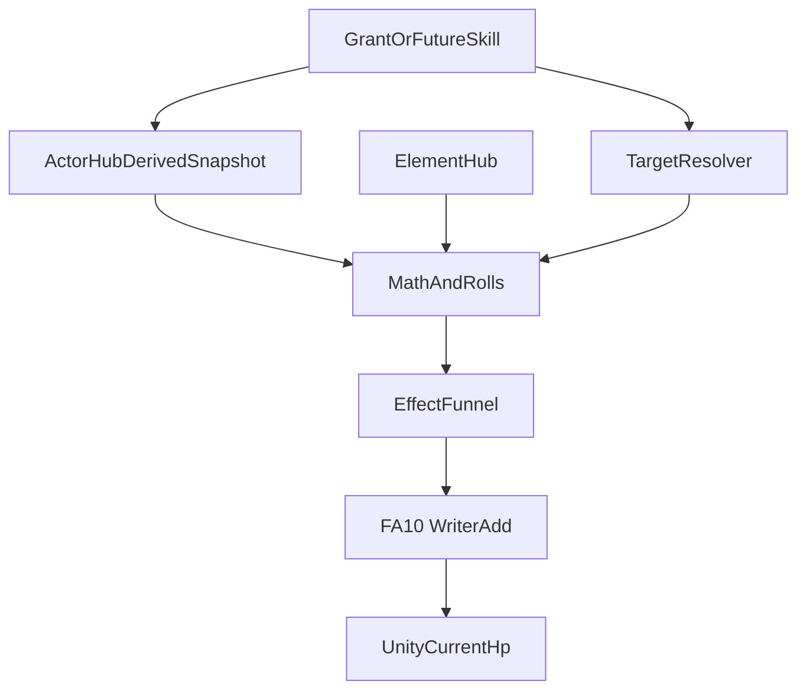
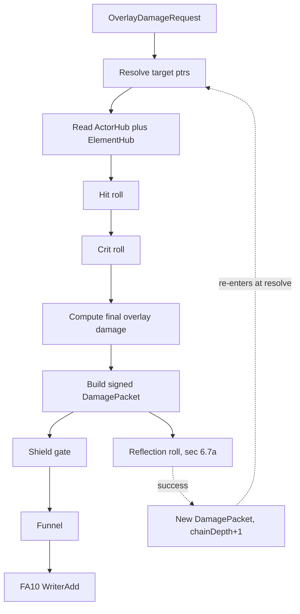

# Combat damage SSOT — RPG overlay damage layer

**Status:** **Shipped, default-on** (2026-08-30, aura-skill T8) — TargetResolver, instant Funnel fan-out, LIVE board snapshot, Element Hub ring-cycle runtime, and overlay combat calculator (`OverlayCombatMath`) are in code and proven C1–C13 green on a real lawn (`docs/runbook/melon-live-checklist.md` §8b). Cheat `OVERLAY-COMBAT` (or env `FUSIONRPG_OVERLAY_COMBAT=1`) now defaults **on** in all three cheat registries; the toggle still exists to turn it off for isolation. Packets without `elementPayload` still pass-through. Legacy Counter/DoT delivery may still use `DeliverySpec` until fully on StatusRuntime.  
**Parent:** [decisions.md](decisions.md) (ADR rows **Combat damage SSOT**, **Element Hub SSOT**, **Actor Hub SSOT**, **Status SSOT**). Targeting and apply path: [effect-funnel.md](effect-funnel.md), [effect-runtime.md](effect-runtime.md). Element input: [element-hub-ssot.md](element-hub-ssot.md) §8.5. Timed state stays in [status-ssot.md](status-ssot.md).

This spec defines how FusionRpg computes **overlay damage only**. It does **not** replace Unity projectile, bite, or vanilla `TakeDamage` flow.

---

## 1. Problem

FusionRpg already has:

- a single signed-delta apply path (`DamagePacket` -> Funnel -> FA10 Writer Add)
- target resolution for single / multi / random / area packet fan-out
- a status runtime that owns timed state and status Apply-time resistance

What is still missing is the **overlay damage calculator** that turns RPG data into the final signed HP delta.

That calculator must be explicit about three things:

1. It is **not** vanilla PVZ damage
2. It uses **Actor Hub derived channels**, not raw primary stats
3. It consumes **Element Hub** matchup data, then sends one final delta to the injector apply path

---

## 2. Product boundary (locked)

This layer is narrow by design.

- Vanilla PVZ `atk`, shooter hit logic, bite cadence, and Unity `TakeDamage` remain unchanged
- Overlay combat computes a second, RPG-owned damage result
- Output is a final **signed HP delta** sent through Funnel
- Status does not participate in the overlay combat formula in v1
- Status hits do not trigger from overlay combat in v1
- Status pulses do not route through overlay combat in v1

In short:

```text
vanilla hit pipeline != overlay combat pipeline
```

Both may exist in the same match, but they are separate authorities.

---

## 3. Layer model (locked)



| Layer | Owns | Must not |
|---|---|---|
| **Action / grant** | Base overlay amount, target, payload tags, damage element payload | Compute final HP directly |
| **Actor Hub** | Derived combat channels and actor metadata lookup | Apply damage |
| **Element Hub** | Actor types, matchup matrix, matchup bonus | Roll crit / hit or write HP |
| **Overlay combat** | Delta, hit, crit, final signed amount | Own timed status state |
| **Funnel / FA10** | Final injector apply | Re-run overlay combat math |

---

## 4. Request and result shape

### 4.1 Conceptual request

```text
OverlayDamageRequest
  source actor
  target actor
  base overlay damage
  damage element payload (single or hybrid)
  target spec / resolved ptr
  optional tags
```

Examples:

```text
single element: [{ element: fire, weight: 1.0 }]
hybrid payload: [{ element: fire, weight: 0.7 }, { element: air, weight: 0.3 }]
```

### 4.2 Conceptual result

```text
OverlayDamageResult
  final signed hp delta
  hit result (hit / miss)
  crit result (yes/no + multiplier)
  matchup bonus (sum of weighted component bonuses)
  debug breakdown
```

The output is final and injector-safe:

```text
signedAmount = -finalDamage   // damage
signedAmount = +finalHeal     // heal — same transport path only in v1 (see §4.3)
```

### 4.3 Healing boundary (locked v1)

Overlay **damage** runs the full pipeline: typed power/defense, matchup, hit, crit.

Overlay **heal** in v1 uses the **same Funnel → FA10 signed-delta transport** only. It does **not** re-run matchup, hit, or crit unless a future ADR explicitly adds a heal formula path.

```text
heal request → signedAmount = +baseOverlayHeal + heal.power(healer) → Funnel → FA10
```

**`combat.heal.power` (spec-healing-pair.md, T4.5, 2026-08-25) is healer-side only and this boundary is
unchanged, not reopened.** `heal.power` is `Pool` class — the healer's own output capacity, like
`combat.shield.capacity`/`regen` — so there is no defender-side term to read at all, and therefore no
delta on the heal path: `OverlayCombatMath.FinalizeHeal` resolves only `packet.ActorPtr` (the healer;
attacker-less resolves to the stub, composing `heal.power` to its default `0`), adds it to the base
heal, and floors at `0`. It still never touches `_elementHub`, `_rng`, or crit math
(`HealingPairTests.NoMatchupNoHitNoCrit` scans the method body for exactly that). This is **strictly
less** than what this section bans — no matchup, no roll, no opposed term — so the ban itself needed no
amendment.

This keeps one apply mailbox while element/combat math stays damage-only in v1.

---

## 5. v1 derived inputs (locked)

Overlay combat consumes these 4 stat families only.

| Family | Attacker | Defender | Role |
|---|---|---|---|
| Power / Defense | `combat.power.*` | `combat.defense.*` | Base damage delta |
| Crit probability | `combat.crit.rate.*` | `combat.crit.resist.*` | Crit roll |
| Crit magnitude | `combat.crit.damage.*` | `combat.crit.resist.damage.*` | Crit multiplier |
| Hit / miss | `combat.accuracy.*` | `combat.dodge.*` | Hit roll |

Each family has:

- `omni`
- `fire`
- `ice`
- `air`
- `earth`

Element typing comes from actor metadata owned by [element-hub-ssot.md](element-hub-ssot.md), not from numeric derived channels.

### Deferred from Chaos — v1 shipped in full (2026-08-25)

**Retitled 2026-08-24 (element-families, T3.2 — actor-hub-ssot.md §H.8 R3); readers landed 2026-08-25
(combat chain, T5.1–T5.4).** `Penetration`, `Absorption`, `Reflection`, `Parry*`, `Block*` shipped as
registered channels first (catalog-extension, T2, 2026-08-24), then gained their mechanism: mitigation
math §6.7, attack table §6.4a, reflection §6.7a. Nothing in this list is deferred any longer — kept as
the v1 record only so a reader's history is attributable, not read as an unexplained addition.

**Shipped, mechanism and all:**

- `Penetration`, `Absorption` → `combat.penetration.*` / `combat.absorption.*` — §6.7 (T5.1)
- `Parry*` → `combat.parry.break/rate/shred/strength.*` — §6.4a (T5.3)
- `Block*` → `combat.block.break/rate/shred/strength.*` — §6.4a (T5.3)
- `Reflection` → `combat.reflect.{resist.}rate.*` / `combat.reflect.{resist.}damage.*` — §6.7a (T5.4)

**Still not in v1:**

- `StatusProbability`, `StatusDuration`, `StatusIntensity` — see
  [element-hub-ssot.md](element-hub-ssot.md) §6's identical bundle for why this is not unpacked here
- mastery, terrain, social, or mobility systems

---

## 6. Core formulas (locked v1)

### 6.1 Typed totals

For a single typed component `E`:

```text
attackerPower(E) = combat.power.omni + combat.power.E
defenderDefense(E) = combat.defense.omni + combat.defense.E
```

Omni is additive-only.

### 6.2 Matchup bonus (per-component)

Element Hub owns the matrix ([element-hub-ssot.md](element-hub-ssot.md) §8.5). Overlay combat **consumes** per-component bonuses only.

For each payload component `E` with weight `w`:

```text
componentBonus(E) = ElementHub.resolveComponentBonus(E, defenderTypes, baseOverlayDamage)
matchupBonus = Σ (w × componentBonus(E))
```

Dual-type defenders use the product rule from Element Hub §8.5. Combat must not reimplement STR/WEK tables.

### 6.3 Effective delta

**Penetration/absorption (T5.1, spec-mitigation-chain.md §2, 2026-08-25) scale defense *inside* the
delta** — a target with no defense gains nothing from an attacker's penetration, which is what makes
`absorption` a real answer to it rather than a parallel damage knob:

```text
penDelta(E) = combat.penetration.omni + combat.penetration.E - (combat.absorption.omni + combat.absorption.E)
pierceFactor(E) = 1 / (1 + max(0, penDelta(E)) / PierceScale)   // identity (1.0) at penDelta = 0; bounded (0,1]
effectiveDefense(E) = defenderDefense(E) × pierceFactor(E)

effectiveDelta(E) = (attackerPower(E) - effectiveDefense(E)) + componentBonus(E)
weightedDelta = Σ (w × effectiveDelta(E))
```

`pierceFactor` is bounded `(0,1]` — structural, not a PS-8 cap: negative defense would turn mitigation
into a second, unintended damage source, not a progression ceiling. A negative `penDelta` (net
absorption) floors at exactly `1.0` rather than granting defense a bonus past its own base value —
absorption cancels penetration, it does not amplify defense. `PierceScale` lives in
`data/tuning/combat.v1.json`, shape only (both factors are identity at delta 0 for any positive scale).

#### 6.3a How defense combines — `defenseShape` (changed 2026-08-25, `RulesetVersion` 3 → 4)

**`combat.defense` divides; it does not subtract.** `defenseShape: divisive` is the shipped default.

```text
offense     = effectiveBaseDamage + Σ(w × (attackerPower(E) + componentBonus(E)))
defenseSum  = Σ(w × effectiveDefense(E))
ladderScale = BaseOverlayDamage + Σ(w × attackerPower(E))     // NOT offense — see below
K           = DefenseDivisorK × ladderScale                    // 0.45 shipped

powerAdjusted = defenseSum >= 0 ?  offense × K / (K + defenseSum)
                                :  offense × (2 − K / (K + |defenseSum|))
```

**Why not subtractive.** `base + (power − defense)` floors at zero the moment defense outruns offense,
which is **total immunity** — the same defect §6.7's `ampFactor` had, and just as unacceptable. Measured
over 50,000 simulated fights before the change: **17.1% of *landed* hits dealt nothing**. After it, the
zero-damage count equals the miss count exactly — no landed hit deals zero. Damage approaches zero
asymptotically and never arrives, so no clamp is needed and none is present.

**`K` reads ladder quantities only, and that is load-bearing.** `ladderScale` is the authored hit plus
power — both `P(Θ)`-scale magnitudes. It deliberately excludes `skill.effectiveness` and the matchup
bonus, which also ride in `offense`. Letting a per-action multiplier into the divisor makes it scale the
numerator *and* shrink the divisor's bite, i.e. **superlinear** — which would break `skill.effectiveness`'s
locked `Feeder` classification. Measured when an earlier draft used `offense`: a 1000× effectiveness
leaked **826** damage through a 5000× defense wall; reading ladder scale only, it leaks **1**.
`SkillModifiersTests.EffectivenessIsPreMitigation` pins the invariant (the mitigated fraction is flat in
effectiveness) rather than any literal.

**Scale invariance.** Tying `K` to the incoming hit rather than to a constant is what keeps the mitigated
*fraction* unchanged when attacker and defender climb the ladder together — the power-scaled-divisor
regime [power/ssot-power-scale.md](power/ssot-power-scale.md) §2 measures. WoW scales its armour constant
with attacker level and Path of Exile with the incoming hit for the same reason; a fixed divisor works
only in a level-capped game.

**Negative defense still amplifies**, via the mirrored branch above — the construction League of Legends
uses for negative resistances, continuous at zero (both branches give exactly `1.0`). `CombatGlass`
ships `defense.omni = -50`; clamping defense at zero would have silently deleted the glass-cannon
mechanic, which is what `Combat_glass_vs_neutral_increases_damage` exists to catch.

`defenseShape: subtractive` restores v1 exactly, and `DefenseDivisorK` is calibrated so adopting the
shape did not also move the balance (mean damage within 0.8% of the subtractive baseline).

### 6.4 Hit roll

For each component `E`:

```text
attackerAccuracy(E) = combat.accuracy.omni + combat.accuracy.E
defenderDodge(E) = combat.dodge.omni + combat.dodge.E
accuracyDelta(E) = attackerAccuracy(E) - defenderDodge(E)
p_hit(E) = sigmoid(accuracyDelta(E) / AccuracyScale)
```

**Hybrid aggregation (locked v1):** one final hit roll per request using the weighted mean:

```text
p_hit_final = Σ (w × p_hit(E))
roll once against p_hit_final   — T5.3 (§6.4a): this ONE roll now resolves parry/block too
```

All four elements share the same `AccuracyScale` in v1.

### 6.4a Attack table — parry and block (T5.3, spec-evasion-chain.md §3, 2026-08-25)

**One roll, cumulative bands — zero additional RNG draws.** The single draw §6.4 already makes is
reinterpreted, not supplemented:

```text
r = one draw (already made above, [0,1))

miss     ⟺ r >= p_hit_final                              // UNCHANGED from before T5.3
parried  ⟺ r <  p_hit_final AND r >= p_hit_final - p_parry
blocked  ⟺ r <  p_hit_final - p_parry AND r >= p_hit_final - p_parry - p_block
clean hit ⟺ otherwise
```

Parry/block are carved out of the TOP of the "would-have-been-a-hit" region, just below
`p_hit_final` — not out of the miss region's low end. This is what makes empty bands byte-identical
by construction: at `p_parry = p_block = 0` every one of the four conditions above collapses to
exactly `r < p_hit_final ⟺ hit`, the pre-T5.3 comparison, unchanged bit for bit.

```text
p_parry_raw = max(0, parry.rate.omni(defender) - parry.break.omni(attacker)) / 1000   // permille, linear
p_block_raw = max(0, block.rate.omni(defender) - block.break.omni(attacker)) / 1000

// §3.1: the CUMULATIVE avoidance band caps at 950‰ — an attack always retains ≥5% to land.
// Only parry/block scale down to make room; p_hit_final (miss) is never touched by this module.
room  = max(0, AvoidanceBandCapPermille/1000 - (1 - p_hit_final))
scale = min(1, room / (p_parry_raw + p_block_raw))   // 1 when raw already fits, no scaling
p_parry = p_parry_raw × scale
p_block = p_block_raw × scale
```

**Linear, not sigmoid, and why:** every other probability in §6.4–6.6 uses `sigmoid(delta/scale)`,
which gives `0.5` at `delta = 0`. Parry/block must give **`0` at `rate = break = 0`** — the shipped
default for every actor today, since no content authors these stats yet — so a sigmoid would silently
grant every actor a 50% parry chance before anyone chose it. The linear form above is exactly `0` at
defaults by construction, no guard clause, matching `p_parry_raw`/`p_block_raw`'s own permille units
(the same units `AvoidanceBandCapPermille` etc. already use) rather than inventing a new scale.

**Resolution on parry or block ("no block, no mitigation," ParryShortCircuits):**

```text
neutralBase = effectiveBaseDamage × ParryNeutralShareKPm/1000        // 500‰ shipped
removed = ClampedContest(deltaBase: neutralBase, delta: strength - shred, hitCount: 1,
                         boundsBase: effectiveBaseDamage, floorKPm: 0, capKPm: 950)   // §2's helper
finalDamage = max(0, effectiveBaseDamage - removed)
```

**Why the neutral point is not the whole hit (changed 2026-08-25, `parryNeutralShareKPm` 1000 → 500).**
v1 passed `effectiveBaseDamage` as `deltaBase`, which seats the neutral removal *on* the 950‰ cap —
`base > 0.95 × base` — so `removed` was pinned at the cap and **`strength` did nothing at all** until
`shred` already exceeded it by more than 5% of the hit. Measured before the change: sweeping
`parry.strength` from 0 to 2000 left mean damage flat at 789.3 across 4,000 fights. At 500‰ the
neutral point sits *inside* `[0, cap]`, so both halves of the pair move it — the shape `ShieldMath`
has always had, where the neutral value sits at a third of its own cap rather than on it. The bounds
still scale against the **full** hit: what is capped is the share of *this* hit a single proc may
remove. Tunable, PS-8-exempt bounded ratio; `1000` restores v1 exactly.

Neither parry nor block runs the mitigation chain (penetration/defense/crit/amplification, §6.1–6.7)
— resolution ends here. `strength`/`shred` follow the SAME role inversion as the rate pair: the
defender raises `parry.strength`/`block.strength`, the attacker suppresses via
`parry.shred`/`block.shred` — matching `shield.toughness`/`shield.pen`'s own polarity
(shield-system-spec.md §2.4). No elemMod concept for either (`deltaBase == boundsBase`): block/parry
never read `ShieldElementMatrix` (§7's ban — "block is not a shield"), and are resolved **omni
only** — the per-element channel slots H.1's generator still builds for these families stay
registered and unread, the same honest partial-wiring every other not-yet-consumed sparse slot in
this catalog already has.

### 6.5 Crit probability

Rolled only on a clean hit (§6.4a) — a parried or blocked hit never reaches this roll, matching
`ParryShortCircuits`/`BlockSubtractsBeforeMitigation`: "no block, no mitigation" means no crit either.

For each component `E`:

```text
attackerCritRate(E) = combat.crit.rate.omni + combat.crit.rate.E
defenderCritResist(E) = combat.crit.resist.omni + combat.crit.resist.E
critRateDelta(E) = attackerCritRate(E) - defenderCritResist(E)
p_crit(E) = sigmoid(critRateDelta(E) / CritRateScale)
```

**Hybrid aggregation (locked v1):**

```text
p_crit_final = Σ (w × p_crit(E))
roll once against p_crit_final
```

All four elements share the same `CritRateScale` in v1.

### 6.6 Crit magnitude

For each component `E`:

```text
attackerCritDamage(E) = combat.crit.damage.omni + combat.crit.damage.E
defenderCritDamageResist(E) = combat.crit.resist.damage.omni + combat.crit.resist.damage.E
critDamageDelta(E) = attackerCritDamage(E) - defenderCritDamageResist(E)
critMultiplier(E) = 1.0 + sigmoid(critDamageDelta(E) / CritDamageScale)
```

**Hybrid aggregation (locked v1):**

```text
critMultiplier_final = Σ (w × critMultiplier(E))
apply critMultiplier_final when crit roll succeeds
```

This keeps crit magnitude bounded and monotone without adding a second unrelated scaling family in v1.

### 6.7 Final damage

If miss (§6.4a):

```text
finalDamage = 0
```

If parried or blocked (§6.4a): resolution already ended there — this section never runs for them.

If clean hit (§6.4a's `otherwise` — the only outcome that reaches the mitigation chain):

```text
baseDamage = request.baseOverlayDamage
powerAdjustedDamage = baseDamage + weightedDelta
finalDamage = max(0, powerAdjustedDamage)
if crit succeeds:
  finalDamage = finalDamage × critMultiplier_final

// T5.1 (spec-mitigation-chain.md §2, 2026-08-25) — amplification/reduction, ONCE, after crit:
ampDelta = (combat.amplification.omni + Σ(w × combat.amplification.E)) - (combat.reduction.omni + Σ(w × combat.reduction.E))

// ampShape: reciprocal (shipped 2026-08-25) -- identity at 0, unclamped upward (PS-8),
// asymptotic downward so mitigation can never reach total.
ampFactor = ampDelta >= 0 ?  1 + ampDelta / AmpScale
                          :  1 / (1 - ampDelta / AmpScale)
finalDamage = finalDamage × ampFactor
```

**The reducing half is asymptotic because the linear one reached zero.** v1 used
`max(0, 1 + ampDelta/AmpScale)` for both halves. That floor is **reachable**: at
`ampDelta ≤ −AmpScale` the multiplier is exactly `0`, so **`combat.reduction` at 30 points made an
actor immune to every attack at any power** — 49,147 of 50,000 landed hits dealt literally nothing in
simulation. `reciprocal` keeps `1 + d/s` for every `ampDelta ≥ 0`, so nothing on the amplifying side
changes at all, and mirrors `PierceFactor`'s own shape below zero. **Raising `AmpScale` is not a fix**
— it moves the immunity threshold rather than removing it, and under-mitigates everywhere else.

This is the mitigation chain's half of the guarantee §6.4a already gives the evasion chain: a block
removes at most 950‰, *never* all of it — "immunity impossible by construction". That was true of
block and parry and false of `reduction` until this change. `ampShape: linearClamped` restores v1.

`weightedDelta` already includes per-component matchup bonuses from §6.2–6.3.

**`ampFactor` lands after crit, and order does not matter.** Both `critMultiplier_final` and
`ampFactor` are plain multipliers on `finalDamage` — multiplication commutes, so the two could apply in
either order with an identical result. Stated explicitly so it never becomes an argument, and so nobody
"fixes" `ampFactor` into a saturating form where it *would* start to matter. `ampFactor` therefore stays
unclamped upward: a ceiling would both make order significant and cap the attacker half (`amplification`)
of a `Contest` pair. The `max(0, ...)` floor is structural — it stops overwhelming `reduction` from
flipping a positive `finalDamage` negative — not a cap on `amplification`'s own unbounded contribution.
`amplification`/`reduction` apply **once** to the already-summed final damage, not per component, since
they read `omni + Σ(w × element)`; applying them per component and re-summing would double-count the
weights. `AmpScale` lives in `data/tuning/combat.v1.json`, shape only, same as `PierceScale` above.

**The mitigation-order rule (derived-stats program, T0.4).** This ordering is what decides whether a
new combat modifier is `Feeder` or `Contest` class (spec-stat-taxonomy.md §2.3):

> A modifier applied *before* mitigation — i.e. it lands inside `weightedDelta`, above — is `Feeder`
> class and inherits its counterpart from `combat.defense`. A modifier applied *after* mitigation, on
> `finalDamage`, is `Contest` class and must carry its own counterpart.

This is why `crit.damage` ships with an explicit `crit.resist.damage` rather than inheriting one: its
multiplier lands on `finalDamage`, after `weightedDelta` has already been consumed, so `defense` never
sees it. The rule is readable directly off the pipeline above, not a convention layered on top of it —
which is what lets it decide every future modifier's classification without a separate debate.

**`penetration`/`absorption` (T5.1) is the rule's one exception, and it is a real one, not a gap in the
rule.** They land *before* mitigation (inside `effectiveDelta`, via `effectiveDefense`), yet they are
`Contest` with their own direct counterpart — not `Feeder` inheriting from `combat.defense`. The rule's
"before mitigation → Feeder" clause describes a modifier that *scales an existing quantity* which
already has its own pair (`skill.effectiveness` scales `baseOverlayDamage`, inheriting `defense`'s
pair). `penetration`/`absorption` is different in kind: it does not scale an existing paired quantity,
it *is* a self-contained Contest pair that happens to modify `defense` as its mechanism. The
distinguishing question for a future modifier is not simply "before or after mitigation" but "does this
modifier have a real opposing value of its own (Contest), or does it only amplify something that
already does (Feeder)" — spec-stat-taxonomy.md §2.3 already asks this; position in the pipeline predicts
the answer for most modifiers, but is not the definition, and `penetration`/`absorption` is the proof.

### 6.7a Reflection (T5.4, spec-reflection.md, 2026-08-25)

**Fires on what actually reached HP — post-mitigation, post-crit, post-amp, and (since 2026-08-25)
POST-shield.** `reflectReadsPostShield: true` is the shipped default.

> **This reverses the original v1 reading, on measured evidence.** v1 read the pre-shield
> `finalDamage`, on the argument that "a shield protects its owner, it does not shrink what the owner
> bounces back" (spec-reflection.md §3/§9 — explicitly flagged there as a decided reading whose
> opposite was defensible). Simulated, that reading let shield and reflect compound into a trade no
> attacker can win: a shielded reflector **took zero damage and killed its attacker in 28 swings**,
> returning **542.8%** of the damage it received. Reading the post-shield amount instead — the value
> `DamageApplyPipeline` already returns, so it costs nothing to use — brings self-damage to **9.0%**
> and turns the same fight into an even trade at 84 swings. A fully absorbed hit now reflects nothing.
> `reflectReadsPostShield: false` restores the v1 reading, and `ReflectsPreShield_whenConfigured`
> keeps it under test.

Two `Contest` pairs, both
**role-inverted** like §6.4a's parry/block — the defender (the one who just took `finalDamage`) raises
`reflect.rate`/`reflect.damage`, the attacker suppresses via `reflect.resist.rate`/`reflect.resist.damage`:

```text
rateDelta = reflect.rate.omni(defender) - reflect.resist.rate.omni(attacker)
p_reflect = clamp(max(0, rateDelta) / ReflectRateScale, 0, 1)   // linear, not sigmoid -- see below
roll once (independent draw, not §6.4's shared roll -- a defender may reflect on a miss-that-still-
           applied-a-status or any other finalDamage < 0 path, not only a clean hit)
if success:
  dmgDelta     = reflect.damage.omni(defender) - reflect.resist.damage.omni(attacker)
  reflectShare = clamp(max(0, dmgDelta) / ReflectShareScale, 0, 1)   // §3: bounded [0,1], PS-8
                                                                       // exempt -- cannot bounce more
                                                                       // than was taken. reflect.damage
                                                                       // itself stays uncapped.
  bounced = round(|finalDamage| × reflectShare)
  if bounced > 0:
    new DamagePacket(actor: defender, target: attacker, signedAmount: -bounced,
                      chainDepth: packet.chainDepth + 1, elementPayload: none)
    → re-enters CombatDamageDispatcher.DispatchInstant at the top (§2.2 -- a later Funnel event,
      never an in-frame callback inside this section's own math)
```

**Linear, not sigmoid, same reasoning as §6.4a:** `sigmoid(0) = 0.5` would hand every actor a default
50% reflect chance before any content authors `reflect.rate`, contradicting "nothing moves at zero"
(`NoGoldensMoveAtZero`). `ReflectRateScale`/`ReflectShareScale` live in `data/tuning/combat.v1.json`.
`ReflectShareScale` moved 10.0 → **100.0** on 2026-08-25: at 10 the entire authoring range of
`reflect.damage` was 0–10 before `reflectShare` saturated at 1.0, two orders of magnitude tighter than
`parry.rate`'s permille range for a conceptually identical stat.

> **`reflectShare` is clamped to `[0,1]`, and that has a consequence worth stating.** Reflected damage
> can never exceed damage taken, so against an attacker with equal effective HP a pure thorns build
> can only ever **tie** — both actors die on the same swing. Simulated across `reflect.damage` 0 → 120
> there is no value at which the attacker dies and the reflector survives; the outcome jumps straight
> from "defender dies" to "both die" once share reaches 1.0. **Thorns wins on HP asymmetry alone**, not
> on the reflect stats themselves. Recorded as a property of the design, not a defect — but it means a
> thorns archetype whose ceiling is a mutual kill needs something else (durability, or a share that
> may exceed 1.0) if it is meant to be a winning build rather than a deterrent.

**No ElementPayload on the bounce packet.** §6.7's `finalDamage` is already fully mitigated —
re-running §6.1–6.7 on the bounce would mitigate it a second time. `OverlayCombatMath.Finalize` passes
an ElementPayload-less packet through unchanged (`PassThroughCombatMath`-equivalent for that one
packet), which is exactly the "already final" behaviour this needs; `bounced` is the packet's
`SignedAmount` verbatim from `CombatDamageDispatcher` on down.

**Termination — `ProcDepthLimit` is the only bound (spec §2, no second counter).** The bounce carries
`packet.ChainDepth + 1`, the same counter every other proc chain already shares
(`CombatDamageDispatcher.cs`, `EffectBag.cs`'s counter-burst). At `chainDepth >= ProcDepthLimit` the
packet is **dropped** before any roll or apply — never clamped to zero and applied, so a terminal
bounce cannot fire a downstream `OnDamageDealt` proc either. Two mutual reflectors therefore ping-pong
at most `ProcDepthLimit` times before the shared counter cuts them off; a reflected packet is itself
reflectable (banning re-reflection would hide whether the bound actually works) — the counter, not a
special case, is what proves termination.

### 6.8 Probability shape

The formula family is sigmoid-based like Chaos, but v1 ships flat policy values for all elements.

```text
sigmoid(x) = 1 / (1 + e^-x)
```

Future shape may expose per-element scales and steepness, but v1 keeps shared values.

---

## 7. Apply flow (locked)



Rules:

1. Resolve targets first, then compute per ptr
2. Read derived stats and actor type metadata per resolved ptr
3. Run hit / crit / delta math once per ptr
4. Build one final signed packet per ptr
5. Funnel and FA10 must treat the amount as final
6. No later stage re-runs element or combat logic
7. **Reflection (T5.4, §6.7a) reads the packet's `finalDamage` in parallel with the shield gate, not
   after it** — the bounce edge branches off the same signed packet the shield gate receives, so a
   fully-absorbed hit still reflects. The bounce is a brand-new `DamagePacket` that re-enters at
   `resolve`, gated by the shared `ProcDepthLimit` (never a second counter) — not a callback inside
   this flow's own damage math.

---

## 8. Injector boundary (hard)

The overlay combat layer stops at the signed delta.

- It must not call Unity `TakeDamage`
- It must not modify vanilla projectile or bite formulas
- It must not write absolute HP from an overlay snapshot
- It must not bypass Funnel
- It must not re-enter status Apply logic in v1

Allowed path:

```text
OverlayDamageResult -> DamagePacket.signedAmount -> Funnel -> FA10 Writer Add
```

This keeps one HP apply authority for overlay damage, aligned with [effect-funnel.md](effect-funnel.md).

---

## 9. Policy surface (documented now, tune later)

| Policy key | Role | v1 |
|---|---|---|
| `ElementMatchupPolicy.MatchupShareK` | STR/WEK share of `baseOverlayDamage` | **0.25** (Element Hub) |
| `CombatProbabilityPolicy.AccuracyScale` | Hit sigmoid divisor | shared constant |
| `CombatProbabilityPolicy.CritRateScale` | Crit sigmoid divisor | shared constant |
| `CombatProbabilityPolicy.CritDamageScale` | Crit magnitude divisor | shared constant |
| `CombatProbabilityPolicy.Steepness` | Optional custom sigmoid steepness | shared constant |

Do not use `CombatDamagePolicy.PowerScale` in v1 — typed delta comes from derived `combat.power.*` / `combat.defense.*` plus `MatchupShareK`. Per-element scale overrides remain deferred; see [element-hub-ssot.md](element-hub-ssot.md) §9.

---

## 10. Relationship to existing docs

### 10.1 Actor Hub

Actor Hub remains the SSOT for derived channels.

- combat channels must be registered in the same catalog style as status channels
- unknown combat channel should reject like unknown `statusId`
- progression may contribute to these channels later without touching primary stats

### 10.2 Element Hub

Element Hub owns:

- actor type metadata
- matchup matrix ([element-hub-ssot.md](element-hub-ssot.md) §8.5)
- per-component `componentBonus(E)` resolution

Overlay combat consumes those outputs but does not own them.

### 10.3 Status runtime

Status is separate in v1.

- no status-on-hit bridge here
- no status probability duplication here
- no contagion, ICD, or duration logic here

### 10.4 Funnel

Funnel remains the sole apply path.

- combat layer may enrich debug breakdowns
- Funnel still only sees final signed deltas and present tags

---

## 11. Ban list

- No vanilla `atk` as direct input to Element Hub
- No element multiplier on top of final signed delta after combat math
- No status hooks in overlay combat v1
- No per-element special cases beyond matchup bonus and typed channels
- No SMT null / absorb / reflect in v1
- No direct Unity HP writes from combat layer
- No second apply mailbox parallel to Funnel

---

## 12. Related docs

- [combat-element-implement-plan.md](combat-element-implement-plan.md) — phased code + prove plan for overlay CombatMath and Element Hub
- [element-hub-ssot.md](element-hub-ssot.md) — element ids, actor type slots, matchup matrix §8.5, omni rule
- [actor-hub-ssot.md](actor-hub-ssot.md) — derived snapshot SSOT and catalog discipline
- [status-ssot.md](status-ssot.md) — timed status runtime, fully separate in v1
- [effect-funnel.md](effect-funnel.md) — final overlay delta apply path
- [effect-runtime.md](effect-runtime.md) — hot runtime and Secondary/Funnel law
- [examples/combat/README.md](examples/combat/README.md) — packet and overlay examples
- [../research/effect-runtime/06-chaos-combat-element-adaptation.md](../research/effect-runtime/06-chaos-combat-element-adaptation.md) — Chaos borrow vs defer notes
