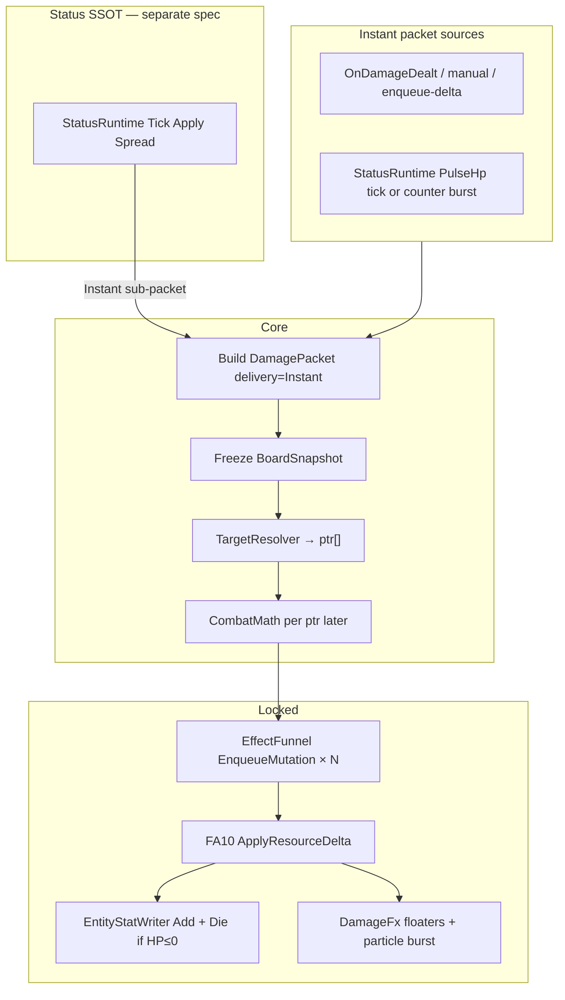

# Combat damage SSOT — target + instant delivery

**Status:** Partially shipped — TargetResolver, instant Funnel fan-out, LIVE board snapshot, overlay world flash. **Legacy:** Counter and DoT still use `DeliverySpec.OverTime|Counter` until [Status SSOT](status-ssot.md) code plan migrates them. CombatMath is a pass-through stub until a dedicated plan.  
**Parent:** [decisions.md](decisions.md) (ADR rows **Combat damage SSOT**, **Status SSOT**). Timed/counter **state:** [status-ssot.md](status-ssot.md). Apply path: [effect-funnel.md](effect-funnel.md), [effect-system.md](effect-system.md).

This spec defines how overlay **HP changes** choose targets and apply **instant** deltas. Scheduling (DoT ticks, hit counters, contagion) belongs to **StatusRuntime**, not `DeliverySpec`.

---

## 1. Problem

Today FA10 `ApplyResourceDelta` applies to a **single** `targetPtr` (usually the combat event target). Content needs:

- Target modes: single, multi, random, area (row/column/square/rectangle), all, filtered by plant/zombie type
- **Instant** overlay HP delta (damage or heal on the same pipeline)
- Heal on the **same** pipeline as damage (signed amount)

DoT, hit-counter bursts, and contagion spread are **status instances** that *emit* Instant packets — see [status-ssot.md](status-ssot.md). Status Apply reads **Actor Hub derived** power/resist — not primary `atk`/`hp` ([actor-hub-ssot.md](actor-hub-ssot.md)).

Without a SSOT, targeting logic would scatter across Secondary plugins, FA executors, and debug commands.

---

## 2. Core model

Three orthogonal pieces:

| Piece | Question | SSOT type |
|---|---|---|
| **Target** | Who receives the HP change? | `TargetSpec` → `TargetResolver` |
| **Delivery** | When does this **packet** apply? | **`Instant` only** (v1 forward). Omit or fix `mode: Instant`. |
| **Amount** | How much HP changes? | Signed delta on `DamagePacket`; CombatMath (later) adjusts per ptr |
| **Timed state** | DoT / counter / contagion on actor? | [status-ssot.md](status-ssot.md) — not `DeliverySpec` |

Envelope:

```text
DamagePacket
  ├── TargetSpec target
  ├── DeliverySpec delivery
  ├── long signedAmount     // negative = loss, positive = gain (heal)
  ├── int chainDepth        // proc re-entry guard
  ├── string channel        // v1: "hp" only
  └── … trace fields (packetId, sourceGrantId, actorPtr, tick, fxTag)
```

**Heal is not a separate feature.** Positive `signedAmount` uses the same target and delivery machinery. GUI maps sign → `DamageFxTag` (`Heal` vs `Neutral`) via existing [DamageFxDtos.cs](../../src/FusionRpg.Contracts/DamageFxDtos.cs).

**Planning vs execution:** `DamagePacket` is a **planning DTO**. Runtime still emits `RpgEffectEvent` mutations into [EffectFunnel](effect-funnel.md) — no second mailbox.

---

## 3. Apply flow (locked)



Rules:

1. **Multi-target = N Funnel mutations** (one per `entity:{ptr}`), not one FA10 with `targets[]`.
2. **CombatMath runs after resolve, once per ptr** — never one pass for the whole area.
3. **Snapshot freeze:** capture `BoardSnapshot` at start of flush; skip ptrs that died before apply (Writer no-op).
4. **Hot path only** — no Server RTT for target RNG ([overlay-control-loops.md](overlay-control-loops.md)).
5. **Never** FA10 → Unity `TakeDamage` (Prefix DEF + `combat.hit` re-entry).

---

## 4. Owner vs target (do not confuse)

| Concept | Mechanism | Meaning |
|---|---|---|
| **Grant owner** | `ownerKey` on grant (`match`, `plant:{typeId}`, `entity:{ptr}`, …) | Who **listens** to triggers / owns the effect |
| **Event filter** | Grant overlay `filters` | Which **events** match (side, typeId on spawn/death/hit) |
| **Damage target** | Overlay `target` (`TargetSpec`) | Who **receives** the HP delta when the action fires |

Example: grant owned by `entity:{plantPtr}` on `OnDamageDealt`, but `target.mode = Area` shape `Row` — the plant proc damages every zombie in the hit row, not only the event target.

---

## 5. TargetSpec

Resolved in Core against a **BoardSnapshot** (Sim + LIVE adapter over lawn census — same shape as `debug.board-stats`).

### 5.1 Modes

| `mode` | Behavior | Notes |
|---|---|---|
| `EventTarget` | `EffectEventDto.targetPtr` | Default; matches today’s FA10 |
| `Actor` | `EffectEventDto.actorPtr` | Thorns / self-damage |
| `Selected` | Cheat selected ptr | **Debug-only**; Sim uses `Single` + explicit ptr |
| `Single` | Overlay `ptr` | Scripted |
| `Multi` | Up to `count` from filtered pool | Stable ptr sort; cap `maxTargets` |
| `Random` | Pick `count` from pool | Match-scoped deterministic RNG + ptr tie-break |
| `Area` | Spatial query — see shapes | Entity-centric FA10; no vanilla cherry explode for HP |
| `All` | All living entities matching filters | Cap `maxTargets` |

### 5.2 Filters (on `TargetSpec.filters`)

| Key | Type | Notes |
|---|---|---|
| `side` | `plant` \| `zombie` | Required for most pool modes |
| `typeId` | int | Single type |
| `typeIdIn` | int[] | Allow-list |
| `excludeMindControlled` | bool | Default true for zombie-side damage |
| `row` | int | Fixed row |
| `col` | int or `{ min, max }` | Column or range |

### 5.3 Caps

| Key | Default | Notes |
|---|---|---|
| `maxTargets` | **8** | `Multi`, `Random`, `Area`, `All` — drop overflow by stable ptr order |
| Area shape max | policy | See §5.4 |

Tie to backlog **B-PROC-BUDGET** when documenting proc storms.

### 5.4 Area shapes (`target.mode = Area`)

Anchor: event target cell, or overlay `anchor: { row, col }`.

| `shape` | Footprint |
|---|---|
| `Row` | Entire lane at anchor `row` |
| `Column` | Entire column at anchor `col` |
| `Square` | N×N centered on anchor |
| `Rectangle` | W×H from anchor (corner or center — document in overlay `anchorOrigin`) |

**Defaults when size omitted:**

| Shape | Fallback constant (policy) | Notes |
|---|---|---|
| `Square` | `AreaDefaultSquareSize` = **3** | Modeled on cherry bomb grid footprint; tune when VFX session probes LIVE |
| `Rectangle` | `AreaDefaultRectangle` = **{ w: 3, h: 3 }** | Chili/cherry-class fallback |

Constants live in **`RpgConstants` / match policy** — not hardcoded in resolver source.

**Overlay AOE path:** TargetResolver → N× FA10 + damage floaters. Optional world-space flash is `Shader.Find` + a short `ParticleSystem` burst at `LawnCoords` (injector VFX). **No** vanilla `CreateCherryExplode` / FA5 `BoardAction` for overlay HP changes (avoids dual pipelines). Number popups stay IMGUI.

Legacy FA5 cherry/freeze/doom remains for old debug scenarios — not for new overlay damage content.

---

## 6. DeliverySpec (Instant-only forward)

| `mode` | Behavior |
|---|---|
| `Instant` | One packet → (CombatMath) → FA10 per resolved ptr |

**Legacy (shipped, migrate to Status SSOT):** `OverTime` and `Counter` on grant overlay still arm `DoTTickScheduler` / `CounterProcState` on `EffectBag`. New content should use `statusId` + status overlay per [status-ssot.md](status-ssot.md) when the code plan lands. Do **not** add new grants with `delivery.mode = OverTime|Counter` after StatusRuntime ships.

### 6.1 Legacy Counter (until migration)

| Key | Type | Notes |
|---|---|---|
| `everyHits` | int | Threshold |
| `resetOnBurst` | bool | Default true |
| `counterScope` | `Target` \| `Actor` | Meter key = target or actor ptr |

Maps to catalog id **`bond`** after migration. See [examples/combat/counter-scope-target.json](examples/combat/counter-scope-target.json).

### 6.2 Legacy OverTime (until migration)

| Key | Type | Notes |
|---|---|---|
| `periodMs` | int | Tick interval |
| `durationMs` | int | Total duration |
| `tickBudget` | int | B-DOT-BUDGET |

Maps to catalog id **`wither`** after migration. Each tick still spawns `delivery.mode = Instant` sub-packet. See [examples/combat/dot-overtime.json](examples/combat/dot-overtime.json).

**Forward shape (doc only):** [examples/status/wither.overlay.json](examples/status/wither.overlay.json).

---

## 7. Proc depth

| Field / policy | Notes |
|---|---|
| `DamagePacket.chainDepth` | Starts at 0; child packets (burst, DoT tick) = parent + 1 |
| `ProcDepthLimit` | From match config / `RpgConstants` / optional grant overlay — **default 6** |
| Halt rule | Do not enqueue when `chainDepth >= ProcDepthLimit` |

**Never hardcode** the limit literal in resolver, bag, or sink — read policy at runtime.

---

## 8. Ban list

| Banned | Why |
|---|---|
| Vanilla `BoardAction` cherry/chili for **overlay HP** | Dual pipeline vs FA10; confuses stats |
| FA11 multi-ptr opcode | Funnel fan-out is sufficient; keeps guards simple |
| Server-side target RNG | Breaks Hot loop |
| FA10 → `TakeDamage` | Prefix DEF + proc re-entry + double-dip |
| Separate heal packet / delivery mode | One signed `DamagePacket` |
| Target logic in Secondary plugins | Only `TargetResolver` interprets modes |
| Element type in this SSOT | CombatMath later |

---

## 9. JSON overlay shape (grant)

On FA10 actions, overlay may include:

```json
{
  "amount": -100,
  "target": {
    "mode": "Area",
    "shape": "Row",
    "anchor": "EventTarget",
    "filters": { "side": "zombie" },
    "maxTargets": 8
  },
  "delivery": { "mode": "Instant" }
}
```

Counter example:

```json
{
  "delivery": {
    "mode": "Counter",
    "everyHits": 5,
    "resetOnBurst": true,
    "counterScope": "Target"
  },
  "burst": {
    "amount": -500,
    "target": { "mode": "EventTarget" },
    "delivery": { "mode": "Instant" }
  }
}
```

DoT example:

```json
{
  "amount": -20,
  "target": { "mode": "EventTarget", "filters": { "side": "zombie" } },
  "delivery": {
    "mode": "OverTime",
    "periodMs": 1000,
    "durationMs": 5000,
    "tickBudget": 1
  }
}
```

Heal example (positive amount):

```json
{
  "amount": 30,
  "target": { "mode": "EventTarget" },
  "delivery": { "mode": "Instant" }
}
```

Copy-paste grants: [examples/combat/](examples/combat/).

---

## 10. Gap vs shipped code

| Feature | Shipped today | After Status SSOT code plan |
|---|---|---|
| Single ptr FA10 | Yes | — |
| Multi / random / area / all | Yes | — |
| Counter burst | Yes (legacy `Delivery.Counter`) | `statusId: bond` on StatusRuntime |
| DoT overlay | Yes (legacy `Delivery.OverTime`) | `statusId: wither` on StatusRuntime |
| Heal via FA10 | Yes | — |
| CombatMath | Pass-through | DEF / element / shield |
| Contagion spread | No | `Spread` payload — [status-ssot.md](status-ssot.md) |

---

## 11. Implementation checklist (separate plan)

When opening the code plan, expected waves:

| Wave | Deliverable |
|---|---|
| I1 | Contracts + pure `TargetResolver` + Sim fixtures |
| I2 | EffectBag fan-out + LIVE `IBoardSnapshot` |
| I3 | Counter + `ProcDepthLimit` enforcement |
| I4 | `OnTimer` DoT + tick budget |
| I5 | CombatMath per-ptr |

Verification (unit tests, guards, LIVE matrix) belongs in that plan — not here.

---

## 12. Related docs

- [status-ssot.md](status-ssot.md) — timed state, resistance, contagion, catalog ids
- [actor-hub-ssot.md](actor-hub-ssot.md) — derived power/resist at Status Apply
- [effect-data.md](effect-data.md) — overlay keys, runtime columns
- [effect-funnel.md](effect-funnel.md) — FA10 add-only, mutation sum
- [effect-testing.md](effect-testing.md) — scenario ids `combat-target-*`, `combat-counter-*`, `combat-dot-*`
- [examples/status/](examples/status/) — forward overlay shapes
- [../research/arpg-effects/03-effects-procs-triggers.md](../research/arpg-effects/03-effects-procs-triggers.md) — inspiration only
