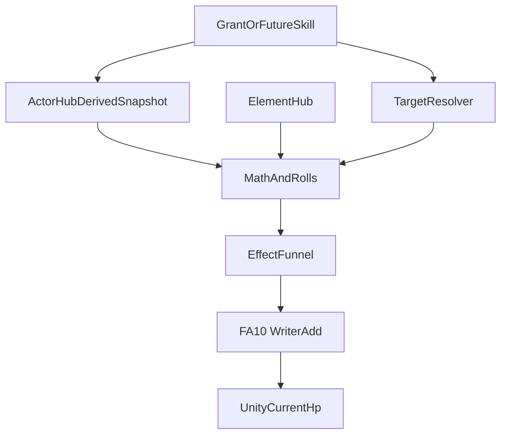
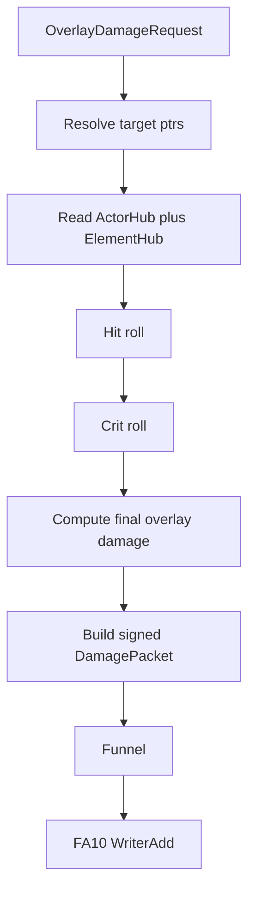

# Combat damage SSOT — RPG overlay damage layer

**Status:** **Shipped (flag-gated)** — TargetResolver, instant Funnel fan-out, LIVE board snapshot, Element Hub ring-cycle runtime, and overlay combat calculator (`OverlayCombatMath`) are in code. Enable with cheat `OVERLAY-COMBAT` or env `FUSIONRPG_OVERLAY_COMBAT=1`. Packets without `elementPayload` still pass-through. Legacy Counter/DoT delivery may still use `DeliverySpec` until fully on StatusRuntime.  
**Parent:** [decisions.md](decisions.md) (ADR rows **Combat damage SSOT**, **Element Hub SSOT**, **Actor Hub SSOT**, **Status SSOT**). Targeting and apply path: [effect-funnel.md](effect-funnel.md), [effect-runtime.md](effect-runtime.md). Element input: [element-hub-ssot.md](element-hub-ssot.md) §8.5. Timed state stays in [status-ssot.md](status-ssot.md).

This spec defines how FusionRpg computes **overlay damage only**. It does **not** replace Unity projectile, bite, or vanilla `TakeDamage` flow.

---

## 1. Problem

FusionRpg already has:

- a single signed-delta apply path (`DamagePacket` -> Funnel -> FA10 Writer Add)
- target resolution for single / multi / random / area packet fan-out
- a status runtime that owns timed state and status Apply-time resistance

What is still missing is the **overlay damage calculator** that turns RPG data into the final signed HP delta.

That calculator must be explicit about three things:

1. It is **not** vanilla PVZ damage
2. It uses **Actor Hub derived channels**, not raw primary stats
3. It consumes **Element Hub** matchup data, then sends one final delta to the injector apply path

---

## 2. Product boundary (locked)

This layer is narrow by design.

- Vanilla PVZ `atk`, shooter hit logic, bite cadence, and Unity `TakeDamage` remain unchanged
- Overlay combat computes a second, RPG-owned damage result
- Output is a final **signed HP delta** sent through Funnel
- Status does not participate in the overlay combat formula in v1
- Status hits do not trigger from overlay combat in v1
- Status pulses do not route through overlay combat in v1

In short:

```text
vanilla hit pipeline != overlay combat pipeline
```

Both may exist in the same match, but they are separate authorities.

---

## 3. Layer model (locked)



| Layer | Owns | Must not |
|---|---|---|
| **Action / grant** | Base overlay amount, target, payload tags, damage element payload | Compute final HP directly |
| **Actor Hub** | Derived combat channels and actor metadata lookup | Apply damage |
| **Element Hub** | Actor types, matchup matrix, matchup bonus | Roll crit / hit or write HP |
| **Overlay combat** | Delta, hit, crit, final signed amount | Own timed status state |
| **Funnel / FA10** | Final injector apply | Re-run overlay combat math |

---

## 4. Request and result shape

### 4.1 Conceptual request

```text
OverlayDamageRequest
  source actor
  target actor
  base overlay damage
  damage element payload (single or hybrid)
  target spec / resolved ptr
  optional tags
```

Examples:

```text
single element: [{ element: fire, weight: 1.0 }]
hybrid payload: [{ element: fire, weight: 0.7 }, { element: air, weight: 0.3 }]
```

### 4.2 Conceptual result

```text
OverlayDamageResult
  final signed hp delta
  hit result (hit / miss)
  crit result (yes/no + multiplier)
  matchup bonus (sum of weighted component bonuses)
  debug breakdown
```

The output is final and injector-safe:

```text
signedAmount = -finalDamage   // damage
signedAmount = +finalHeal     // heal — same transport path only in v1 (see §4.3)
```

### 4.3 Healing boundary (locked v1)

Overlay **damage** runs the full pipeline: typed power/defense, matchup, hit, crit.

Overlay **heal** in v1 uses the **same Funnel → FA10 signed-delta transport** only. It does **not** re-run matchup, hit, or crit unless a future ADR explicitly adds a heal formula path.

```text
heal request → signedAmount = +baseOverlayHeal → Funnel → FA10
```

This keeps one apply mailbox while element/combat math stays damage-only in v1.

---

## 5. v1 derived inputs (locked)

Overlay combat consumes these 4 stat families only.

| Family | Attacker | Defender | Role |
|---|---|---|---|
| Power / Defense | `combat.power.*` | `combat.defense.*` | Base damage delta |
| Crit probability | `combat.crit.rate.*` | `combat.crit.resist.*` | Crit roll |
| Crit magnitude | `combat.crit.damage.*` | `combat.crit.resist.damage.*` | Crit multiplier |
| Hit / miss | `combat.accuracy.*` | `combat.dodge.*` | Hit roll |

Each family has:

- `omni`
- `fire`
- `ice`
- `air`
- `earth`

Element typing comes from actor metadata owned by [element-hub-ssot.md](element-hub-ssot.md), not from numeric derived channels.

### Deferred from Chaos

Not in v1:

- `StatusProbability`, `StatusDuration`, `StatusIntensity`
- `Penetration`, `Absorption`, `Reflection`
- `Parry*`, `Block*`
- mastery, terrain, social, or mobility systems

---

## 6. Core formulas (locked v1)

### 6.1 Typed totals

For a single typed component `E`:

```text
attackerPower(E) = combat.power.omni + combat.power.E
defenderDefense(E) = combat.defense.omni + combat.defense.E
```

Omni is additive-only.

### 6.2 Matchup bonus (per-component)

Element Hub owns the matrix ([element-hub-ssot.md](element-hub-ssot.md) §8.5). Overlay combat **consumes** per-component bonuses only.

For each payload component `E` with weight `w`:

```text
componentBonus(E) = ElementHub.resolveComponentBonus(E, defenderTypes, baseOverlayDamage)
matchupBonus = Σ (w × componentBonus(E))
```

Dual-type defenders use the product rule from Element Hub §8.5. Combat must not reimplement STR/WEK tables.

### 6.3 Effective delta

```text
effectiveDelta(E) = (attackerPower(E) - defenderDefense(E)) + componentBonus(E)
weightedDelta = Σ (w × effectiveDelta(E))
```

### 6.4 Hit roll

For each component `E`:

```text
attackerAccuracy(E) = combat.accuracy.omni + combat.accuracy.E
defenderDodge(E) = combat.dodge.omni + combat.dodge.E
accuracyDelta(E) = attackerAccuracy(E) - defenderDodge(E)
p_hit(E) = sigmoid(accuracyDelta(E) / AccuracyScale)
```

**Hybrid aggregation (locked v1):** one final hit roll per request using the weighted mean:

```text
p_hit_final = Σ (w × p_hit(E))
roll once against p_hit_final
```

All four elements share the same `AccuracyScale` in v1.

### 6.5 Crit probability

For each component `E`:

```text
attackerCritRate(E) = combat.crit.rate.omni + combat.crit.rate.E
defenderCritResist(E) = combat.crit.resist.omni + combat.crit.resist.E
critRateDelta(E) = attackerCritRate(E) - defenderCritResist(E)
p_crit(E) = sigmoid(critRateDelta(E) / CritRateScale)
```

**Hybrid aggregation (locked v1):**

```text
p_crit_final = Σ (w × p_crit(E))
roll once against p_crit_final
```

All four elements share the same `CritRateScale` in v1.

### 6.6 Crit magnitude

For each component `E`:

```text
attackerCritDamage(E) = combat.crit.damage.omni + combat.crit.damage.E
defenderCritDamageResist(E) = combat.crit.resist.damage.omni + combat.crit.resist.damage.E
critDamageDelta(E) = attackerCritDamage(E) - defenderCritDamageResist(E)
critMultiplier(E) = 1.0 + sigmoid(critDamageDelta(E) / CritDamageScale)
```

**Hybrid aggregation (locked v1):**

```text
critMultiplier_final = Σ (w × critMultiplier(E))
apply critMultiplier_final when crit roll succeeds
```

This keeps crit magnitude bounded and monotone without adding a second unrelated scaling family in v1.

### 6.7 Final damage

If hit fails:

```text
finalDamage = 0
```

If hit succeeds:

```text
baseDamage = request.baseOverlayDamage
powerAdjustedDamage = baseDamage + weightedDelta
finalDamage = max(0, powerAdjustedDamage)
if crit succeeds:
  finalDamage = finalDamage × critMultiplier_final
```

`weightedDelta` already includes per-component matchup bonuses from §6.2–6.3.

### 6.8 Probability shape

The formula family is sigmoid-based like Chaos, but v1 ships flat policy values for all elements.

```text
sigmoid(x) = 1 / (1 + e^-x)
```

Future shape may expose per-element scales and steepness, but v1 keeps shared values.

---

## 7. Apply flow (locked)



Rules:

1. Resolve targets first, then compute per ptr
2. Read derived stats and actor type metadata per resolved ptr
3. Run hit / crit / delta math once per ptr
4. Build one final signed packet per ptr
5. Funnel and FA10 must treat the amount as final
6. No later stage re-runs element or combat logic

---

## 8. Injector boundary (hard)

The overlay combat layer stops at the signed delta.

- It must not call Unity `TakeDamage`
- It must not modify vanilla projectile or bite formulas
- It must not write absolute HP from an overlay snapshot
- It must not bypass Funnel
- It must not re-enter status Apply logic in v1

Allowed path:

```text
OverlayDamageResult -> DamagePacket.signedAmount -> Funnel -> FA10 Writer Add
```

This keeps one HP apply authority for overlay damage, aligned with [effect-funnel.md](effect-funnel.md).

---

## 9. Policy surface (documented now, tune later)

| Policy key | Role | v1 |
|---|---|---|
| `ElementMatchupPolicy.MatchupShareK` | STR/WEK share of `baseOverlayDamage` | **0.25** (Element Hub) |
| `CombatProbabilityPolicy.AccuracyScale` | Hit sigmoid divisor | shared constant |
| `CombatProbabilityPolicy.CritRateScale` | Crit sigmoid divisor | shared constant |
| `CombatProbabilityPolicy.CritDamageScale` | Crit magnitude divisor | shared constant |
| `CombatProbabilityPolicy.Steepness` | Optional custom sigmoid steepness | shared constant |

Do not use `CombatDamagePolicy.PowerScale` in v1 — typed delta comes from derived `combat.power.*` / `combat.defense.*` plus `MatchupShareK`. Per-element scale overrides remain deferred; see [element-hub-ssot.md](element-hub-ssot.md) §9.

---

## 10. Relationship to existing docs

### 10.1 Actor Hub

Actor Hub remains the SSOT for derived channels.

- combat channels must be registered in the same catalog style as status channels
- unknown combat channel should reject like unknown `statusId`
- progression may contribute to these channels later without touching primary stats

### 10.2 Element Hub

Element Hub owns:

- actor type metadata
- matchup matrix ([element-hub-ssot.md](element-hub-ssot.md) §8.5)
- per-component `componentBonus(E)` resolution

Overlay combat consumes those outputs but does not own them.

### 10.3 Status runtime

Status is separate in v1.

- no status-on-hit bridge here
- no status probability duplication here
- no contagion, ICD, or duration logic here

### 10.4 Funnel

Funnel remains the sole apply path.

- combat layer may enrich debug breakdowns
- Funnel still only sees final signed deltas and present tags

---

## 11. Ban list

- No vanilla `atk` as direct input to Element Hub
- No element multiplier on top of final signed delta after combat math
- No status hooks in overlay combat v1
- No per-element special cases beyond matchup bonus and typed channels
- No SMT null / absorb / reflect in v1
- No direct Unity HP writes from combat layer
- No second apply mailbox parallel to Funnel

---

## 12. Related docs

- [combat-element-implement-plan.md](combat-element-implement-plan.md) — phased code + prove plan for overlay CombatMath and Element Hub
- [element-hub-ssot.md](element-hub-ssot.md) — element ids, actor type slots, matchup matrix §8.5, omni rule
- [actor-hub-ssot.md](actor-hub-ssot.md) — derived snapshot SSOT and catalog discipline
- [status-ssot.md](status-ssot.md) — timed status runtime, fully separate in v1
- [effect-funnel.md](effect-funnel.md) — final overlay delta apply path
- [effect-runtime.md](effect-runtime.md) — hot runtime and Secondary/Funnel law
- [examples/combat/README.md](examples/combat/README.md) — packet and overlay examples
- [../research/effect-runtime/06-chaos-combat-element-adaptation.md](../research/effect-runtime/06-chaos-combat-element-adaptation.md) — Chaos borrow vs defer notes
