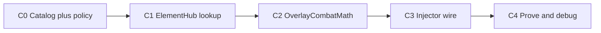

# Overlay combat + Element Hub — implementation plan

**Status:** **Shipped (2026-08-19)** — C0–C4 complete in code. Element Hub runtime, overlay combat calculator, injector wiring (flag `OVERLAY-COMBAT` / `FUSIONRPG_OVERLAY_COMBAT=1`), and offline golden tests (653 Core tests). LIVE rows in [debug-live-checklist.md](../runbook/debug-live-checklist.md) §10.  
**Design authority:** [element-hub-ssot.md](element-hub-ssot.md) §8.5 (matrix), [combat-damage-ssot.md](combat-damage-ssot.md) (formulas), [actor-hub-ssot.md](actor-hub-ssot.md) §3E (catalog), [effect-funnel.md](effect-funnel.md) (apply path).  
**Research bridge:** [../research/effect-runtime/06-chaos-combat-element-adaptation.md](../research/effect-runtime/06-chaos-combat-element-adaptation.md).

**Prerequisite shipped today:** TargetResolver, instant Funnel fan-out, pass-through `ICombatMath` stub, Actor Hub + StatusRuntime (S0–S7).

**Out of scope this plan:** vanilla `TakeDamage` / DEF Prefix changes, status-on-hit bridge, Chaos mastery/shield/reflect ports, YAML element registry.

---

## 1. Dependency chain

| Slice | Delivers | Blocked by |
|---|---|---|
| **C0** | `combat.*` channels in DerivedStatCatalog; `ElementMatchupPolicy`; actor type metadata shape | — | **Shipped** |
| **C1** | Ring-cycle matrix lookup; per-component `componentBonus(E)`; dual-type product | C0 | **Shipped** |
| **C2** | Full overlay pipeline: weighted delta, hit/crit aggregation, final signed delta | C0, C1 | **Shipped** |
| **C3** | Replace pass-through CombatMath when flag on; debug breakdown events; Funnel handoff unchanged | C2 | **Shipped** |
| **C4** | Golden tests + LIVE debug scenarios; matrix prove doc | C3 | **Shipped (offline); LIVE pending operator** |

---

## 2. C0 — Contracts and catalog

**Goal:** Register overlay combat vocabulary without changing gameplay math yet.

Tasks:

1. Add **40** `combat.*` channels to `DerivedStatChannels` / catalog bootstrap (mirror [element-hub-ssot.md](element-hub-ssot.md) §6).
2. Add actor type metadata fields (`element.type.primary`, `element.type.secondary`) to snapshot sidecar or equivalent DTO.
3. Add policy objects:
   - `ElementMatchupPolicy.MatchupShareK = 0.25`
   - shared `CombatProbabilityPolicy` scales (Accuracy, CritRate, CritDamage, Steepness)
4. Unit tests: unknown `combat.*` channel rejects; invalid type pairs reject (`primary == secondary`, `omni` in slot).

**Prove gate:** `dotnet test tests/FusionRpg.Core.Tests` — catalog registration tests green; no LIVE behavior change.

---

## 3. C1 — Element Hub runtime

**Goal:** Deterministic matrix lookup consumed by overlay combat.

Tasks:

1. Implement `IElementHub` (or static resolver) with ring-cycle table from §8.5.
2. `ResolveComponentBonus(element, defenderPrimary, defenderSecondary, baseOverlayDamage)`:
   - single-type: STR / WEK / NEU / same from table × `MatchupShareK`
   - dual-type: product rule `(m_primary × m_secondary − 1) × base`
   - no types: 0
3. Hybrid helper: `ResolvePayloadBonus(components[], defenderTypes, base)` = weighted sum of per-component bonuses.

**Prove gate:** golden table tests (§5 below) all pass offline.

---

## 4. C2 — Overlay combat calculator

**Goal:** Replace pass-through CombatMath with typed pipeline per [combat-damage-ssot.md](combat-damage-ssot.md) §6.

Tasks:

1. `OverlayDamageRequest` / `OverlayDamageResult` DTOs (if not already present).
2. Per-component power/defense from derived snapshot.
3. Consume C1 `componentBonus(E)` inside `effectiveDelta(E)`.
4. Hybrid aggregation:
   - `p_hit_final = Σ (w × p_hit(E))` — one roll
   - `p_crit_final = Σ (w × p_crit(E))` — one roll
   - `critMultiplier_final = Σ (w × critMultiplier(E))`
5. Final damage: `max(0, base + weightedDelta) × critMultiplier_final` on hit.
6. Heal path: signed positive delta only — **no** matchup/hit/crit (§4.3 combat-damage-ssot).

**Prove gate:** deterministic unit tests for hybrid fire+air payload, miss path, crit path.

---

## 5. Matrix golden tests (normative)

Use `baseOverlayDamage = 100`, `MatchupShareK = 0.25` unless noted.

### 5.1 Single-type defender

| Attacker element | Defender type | Expected componentBonus |
|---|---|---|
| fire | ice | +25 |
| fire | air | −25 |
| fire | earth | 0 |
| fire | fire | 0 (same) |
| ice | earth | +25 |
| air | fire | +25 |
| earth | air | +25 |

### 5.2 Dual-type defender (product rule)

| Attacker | Defender primary + secondary | Calc | Expected bonus |
|---|---|---|---|
| fire | ice + earth | 1.25 × 1.0 − 1 | +25 |
| fire | air + earth | 0.75 × 1.0 − 1 | −25 |
| fire | ice + air | 1.25 × 0.75 − 1 | −6.25 |
| ice | fire + air | 0.75 × 1.0 × 1.0 − 1 | −25 |

### 5.3 Hybrid payload

| Payload | Defender | Expected matchupBonus |
|---|---|---|
| `[{fire, 0.7}, {air, 0.3}]` | ice (single) | 0.7×25 + 0.3×0 = **+17.5** |
| `[{fire, 0.5}, {air, 0.5}]` | air (single) | 0.5×(−25) + 0.5×0 = **−12.5** |
| `[{fire, 1.0}]` | (none) | **0** |

### 5.4 No status coupling

Assert overlay combat path does **not** call `StatusRuntime.Apply` or read status instance state.

---

## 6. C3 — Injector integration

**Goal:** Wire C2 into existing DamagePacket → Funnel → FA10 path.

Tasks:

1. Replace `PassThroughCombatMath` with overlay calculator when request carries element payload (feature flag ok for first merge).
2. Emit debug breakdown (matchupBonus, weightedDelta, hit/crit rolls) on `debug.combat.overlay` or extend existing combat debug events.
3. Verify vanilla hit hooks still bypass overlay calculator.
4. Guard: no second HP writer; no `TakeDamage` from overlay layer.

**Prove gate:** `POST /api/debug/effect/enqueue-delta` still works for non-element stubs; new scenario applies typed overlay damage when flag on.

---

## 7. C4 — Prove and LIVE checklist

Offline:

- All §5 golden tests in `FusionRpg.Core.Tests`
- Hybrid hit/crit aggregation edge cases (single-component = degenerate mean)

LIVE (add rows to [debug-live-checklist.md](../runbook/debug-live-checklist.md) when C3 ships):

| Scenario | Assert |
|---|---|
| fire synthetic vs ice-typed zombie | positive matchup bonus in debug breakdown |
| fire synthetic vs air-typed zombie | negative matchup bonus |
| hybrid fire+air vs ice | weighted bonus ≈ §5.3 |
| overlay miss | finalDamage = 0, Funnel not called with damage |

Copy results to [../research/effect-runtime/04-proof-results.md](../research/effect-runtime/04-proof-results.md).

---

## 8. Ban list (implementation)

- No hardcoded STR/WEK tables outside Element Hub module
- No element-triggered status apply from combat hits in v1
- No `PowerScale` in matchup bonus
- No direct Unity HP writes from Element Hub or overlay combat
- No merge of StatusRuntime into overlay combat formulas

---

## 9. Related docs

- [element-hub-ssot.md](element-hub-ssot.md) — matrix §8.5, policy §9
- [combat-damage-ssot.md](combat-damage-ssot.md) — formulas §6, heal boundary §4.3
- [actor-hub-ssot.md](actor-hub-ssot.md) — catalog §3E
- [decisions.md](decisions.md) — Element Hub SSOT + Combat damage SSOT rows
- [actor-hub-status-implement-plan.md](actor-hub-status-implement-plan.md) — completed status path (S0–S7)
