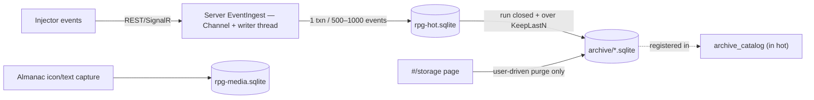

# Data architecture — Rise of Summoner (FusionRpg)

How data is stored, who owns each table, and how it flows from the game into SQLite and out to the web. Companion doc: [software-architecture.md](software-architecture.md). Authoritative DDL lives in `src/FusionRpg.Data/Sqlite/RpgStore.cs` (`EnsureHotSchema` / `EnsureMediaSchema`); doc mirror in [../database/schema.md](../database/schema.md).

## 1. Physical stores

Data dir: `{ServerExeDir}/data/` (override: env `FUSIONRPG_DATA`, tests only).

| File | Contents |
|---|---|
| `rpg-hot.sqlite` | Everything non-BLOB: players, settings, capture (events / spawn_stats / entities / mowers), runs, types, recipes, metrics, `archive_catalog`, `pvz_stat_*`, `pvz_activity_*`, `rpg_actor_progression`, `rpg_xp_ledger`, `rpg_unique_*` |
| `rpg-media.sqlite` | BLOB-only media: `type_icons`, `type_icon_layers`, `type_almanac_dump`. Separate connection — never joins the ingest transaction |
| `archive/*.sqlite` | Cold segments (capture per run, activity/XP tail slices), written **before** hot delete, registered in `archive_catalog` |
| `rpg.sqlite` (legacy) | One-time migrated into hot+media on first boot when hot is missing; backed up as `.pre-dal.bak`, never auto-deleted |

Connection policy (`SqliteConnectionFactory`): WAL, `busy_timeout=5000`, `synchronous=NORMAL`, shared cache; all `RpgStore` writes serialized behind one process-wide gate.



## 2. Table inventory by domain

### Identity & config
| Table | Key | Notes |
|---|---|---|
| `players` | `id` | Save slots only — **no XP columns**; seed `Player 1` |
| `settings` | `key` | JSON documents: `stats`, `current_player_id`, `cheats` |
| `metrics` | `name` | Global rollup counters (`plants_spawned`, `zombies_killed`, …) |

### Runs & capture (the observation log)
| Table | Key | Notes |
|---|---|---|
| `runs` | `id`, `match_key` UNIQUE | Match lifecycle, `result`, `modifiers_json`, `snapshot_json`, `archive_uri` (non-null ⇒ capture rows moved cold; run row stays hot) |
| `events` | `id` | Append-only envelope log (`player_id`, `run_id`, `kind`, `payload`) |
| `spawn_stats` | `id`; ix `(run_id, ptr)` | **One row per capture** (full dump JSON); recapture appends, never overwrites |
| `entities` | `UNIQUE(run_id, ptr)` | Identity + denormalized latest HP (convenience, **not SSOT**) |
| `mowers` | `UNIQUE(run_id, ptr)` | Place / start / die timestamps |

### Catalog & media
| Table | Key | Notes |
|---|---|---|
| `types` | `(game, side, type)` | Names + first-seen sample; combat columns are reference only |
| `recipes` | `(game, parent_a, parent_b, result)` | Fusion graph from `PlantMixTreeManager` |
| `type_icon_layers` / `type_icons` | `(side, type_id [, layer])` | PNG BLOBs (media DB), served via `/api/icons/...` |
| `type_almanac_dump` | `(side, type_id)` | Captured pedia fields for promote + review |

### Pvz middle layer (player-bound)
| Table | Key | Notes |
|---|---|---|
| `pvz_stat_modifiers` | `id`; UNIQUE(player, plugin, source, channel, op) | **SSOT for player attrs** — source-tagged modifier rows |
| `pvz_stat_snapshots` / `pvz_stat_contributions` | `player_id` / `id` | Caches, rebuilt on every mutate — never re-apply from finals |
| `pvz_stat_revisions` | `player_id` | Monotonic revision per player |
| `pvz_activity_facts` | `id`; UNIQUE(player, run, kind, dedupe_key) | **SSOT for play facts** — append-only, allowlisted kinds (`MatchStarted`, `ZombieKilled`, `PlantPlaced`, `ExtraSpawnFired`, …) |
| `pvz_activity_rollups` | `player_id` | Counter snapshot with `through_fact_id` watermark + `schema_version`; survives trim |
| `pvz_activity_revisions` | `player_id` | Revision |

### RPG progression & unique actors
| Table | Key | Notes |
|---|---|---|
| `rpg_xp_ledger` | `id`; UNIQUE(player, kind, type, reason, dedupe_key) | Append-only XP deltas with before/after audit columns |
| `rpg_actor_progression` | `(player_id, kind, type_id)` | Durable level/XP snapshot; `through_ledger_id` watermark + `xp_by_reason_json` buckets so charts survive trim |
| `rpg_unique_actors` | `instance_id` (GUID) | Specimen SSOT: phase FSM (`Roster → Deploying → ActiveBound → Roster`, terminal `Retired`), level/XP, `last_ptr`, `deploy_correlation_id`, revision |
| `rpg_unique_equipment` | `(instance_id, slot)` | Slots `weapon` / `armor` / `trinket` |
| `rpg_unique_stat_mods` | `instance_id` | Per-specimen mod definitions JSON |

### Archive registry
| Table | Key | Notes |
|---|---|---|
| `archive_catalog` | `id`, `uri` UNIQUE | `kind ∈ capture \| activity \| xp`, `meta_json` row counts (used to verify before trim) |

**Schema evolution:** `EnsureColumn` (ALTER TABLE ADD COLUMN) only. No table drops; legacy denormalized columns are kept.

## 3. SSOT map (who is the source of truth)

| Domain | SSOT | Explicitly NOT SSOT |
|---|---|---|
| Combat HP/ATK/armor | `events.payload` + `spawn_stats.stats_json` (per-spawn dumps, same keys) | `types` combat columns; `entities.hp*` (denormalized latest) |
| Catalog naming | `types` (fill-if-empty from spawn; almanac dump may prefer Chinese titles) | — |
| Live cheats | `settings['cheats']` JSON doc (web writes; absence = unset; identity values stripped; monotonic `revision`) | Injector state; the injector mirror updates `catalog` only, never `entries` |
| Player attrs | `pvz_stat_modifiers` | Snapshot/contribution caches |
| Play facts | `pvz_activity_facts` (append-only) | Rollups; never treat `events` as progression SSOT — project into facts |
| Type XP | `rpg_xp_ledger` + `rpg_actor_progression` (watermarked) | `players` |
| Unique specimens | `rpg_unique_actors` (must not write type almanac rows) | — |
| Current in-match HP | **Unity** (not the database at all) | Any overlay snapshot |

Foundation trust rules: RPG features read dumps (`spawn_stats.stats_json`, `runs.modifiers_json/snapshot_json`), never `types.hp_base`. Missing hook = missing fact — never invent HP from the catalog. `(run_id, ptr)` dies with the match. Match XP keys off `match.result` (GameOver), not `board.end` alone.

## 4. Ingest invariants

1. Every match-scoped row carries `player_id NOT NULL` (server stamps it; the injector never sends player ids).
2. `board.start` creates the run; spawns without a known `matchKey` are dropped.
3. Duplicate `(run_id, ptr)` spawn → `ON CONFLICT DO NOTHING` on `entities`; extra `spawn_stats` rows only via `entity.stats` recapture.
4. `*.die` sets `died_utc`; duplicate `match.result` ignored; `board.end` closes the run.
5. `types.sample_json` / first-seen baselines are written only when null.
6. Ingest is one writer thread, one transaction per 500–1000 events, projections (`entities`, `runs` rollups, `types`, `recipes`) inside the same transaction.

## 5. Data lifecycle (hot → cold → user purge)

Sealed policy (`SealedCompactionPolicy`): `KeepLastNFullCaptureRuns = 50`, `ActivityRetainTail = 10_000`/player, `XpRetainTailPerActor = 5_000`, snapshot schema versions = 1.

```
append (hot, mid-run: append only)
  → update durable snapshot/projection (watermark: through_fact_id / through_ledger_id)
  → on run end (CompactionWorker, queued on board.end only):
      over limit? → write archive/*.sqlite → verify row counts → trim hot
  → never compact mid-run; trim refuses if the snapshot doesn't cover the overflow
```

- **Capture promote** (`PromoteClosedRunCapture`): cold *move*, not delete-first — write `archive/capture-run-{id}.sqlite`, verify, then in one transaction set `runs.archive_uri` + insert `archive_catalog` + delete hot capture rows. Idempotent; refuses open runs.
- **Tails:** oldest activity facts / XP ledger rows beyond the retain tail are sliced into `archive/activity-*` / `archive/xp-*` segments, then trimmed.
- **User-driven purge only — no auto GC.** Web `#/storage` → `/api/storage/*`: summary, list archives, delete archives (paths must resolve under `archive/`; refused wholesale while any unique actor is `ActiveBound`), purge/delete closed runs, trim tails now. Cold-path query fan-in and automatic GC are deliberate deferred stubs (`IsImplemented => false`).
- **Full wipe:** `RpgStore.Reset()` clears every hot + media table (used by SIM tests).

## 6. DAL boundary

**All SQL lives in `FusionRpg.Data`.** The Server references it but contains zero SQL; the Injector and Core never touch a database. Enforced by `scripts/guard-dal.ps1` (scans all of `src/` outside Data for Sqlite/raw-SQL patterns; empty allowlist) — run by CI, `tests/FusionRpg.Guard.Tests`, and `deploy-play.ps1`.

`RpgStore` is one sealed partial class, partitioned by domain: core/ingest (`RpgStore.cs`), `Progression`, `UniqueActors`, `Compaction`, `Storage`, `Icons`, `Almanac`; thin adapters expose `IColdArchiveWriter` / `IColdArchiveCatalog` / `IHotCompactor`.

## 7. Versioning & revisions

| Knob | Value / mechanism |
|---|---|
| Game profile | `pvzrh-3.8.1` default, `pvzrh-3.9` (MelonLoader); build-level (`game-profiles.json`), stamped as `game` on every event — not a DB column |
| Cheats `revision` | Monotonic long inside `settings['cheats']`; bumped on every store write |
| PvzStats / PvzActivity / Progression / Unique revisions | Per-player (or per-row) monotonic revision columns, mirrored into caches on rebuild |
| Snapshot schema versions | `ActivitySnapshotSchemaVersion = 1`, `XpSnapshotSchemaVersion = 1` (sealed) |
| `FoundationContractVersion` | `2` (FA10 exists); stamped on `IntentPlan`, surfaced at `GET /api/debug/effects/contract` |
| `MatchRuntimeContractVersion` | `1` — orthogonal to the Foundation contract |

## 8. Related docs

[../database/data-model.md](../database/data-model.md) (invariants + FK story) · [../database/schema.md](../database/schema.md) (DDL mirror) · [../database/ledger-snapshot.md](../database/ledger-snapshot.md) (lifecycle detail) · [../database/persistence-implement-checklist.md](../database/persistence-implement-checklist.md) (shipped slices A–E + W12) · [../protocol/events.md](../protocol/events.md) (envelope + kinds).
