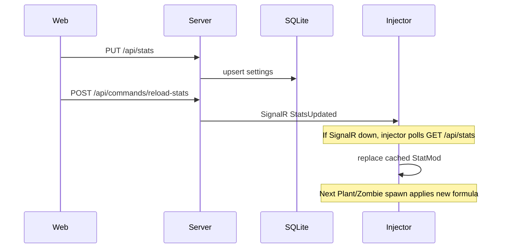
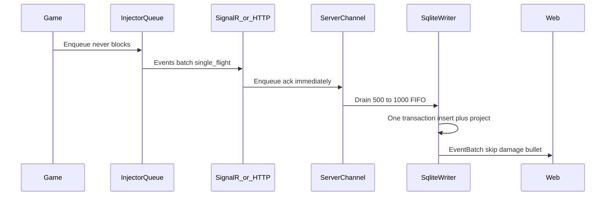

# Data flow

## Stat change (web → game)

## Game event (game → web)

120fps: Harmony and Update only enqueue / `TryFlush`. Network and SQLite are off the game thread.

## Match lifecycle

1. Injector `Hello` → `catalog.types` (Il2Cpp dump + `Lawnf.GetName`) and `catalog.recipes` (`ChildToParents`).
2. `Board.Awake` → mint `matchKey`, `board.start` + `modifiers_json`. Retry catalog if hello dump was 0.
3. `plant.place` / `zombie.place` from factories. `plant.spawn` / `zombie.spawn` write **full dump** JSON → `events` + `spawn_stats` + `entities` identity.
4. Recapture (`entity.stats`) **appends** `spawn_stats`. Does not overwrite the first dump.
5. Hits → `*.damage` only. Entity identity row stays; latest denormalized HP may update from recapture.
6. Deaths → `plant.die` / `zombie.die` / `board.plantDie`. `reasonName` on plant die.
7. Mowers → place / start (hook or poll `started`) / die.
8. `GameOver` → `match.result` + full `snapshot_json`. XP later uses this, not `board.end`.
9. `Board.Die` → `board.end` closes the run.

## Threading

Harmony patches must not block on HTTP. Injector uses `ConcurrentQueue<EventEnvelope>`. `TryFlush` from Update is time/size gated (256 or 16ms), one in-flight send. Server Channel + one writer thread.

## Cache if server is down

Injector keeps last successful `GET /api/stats` in memory (and a small JSON next to the plugin if useful). Apply that cache. Log a warning. Do not crash the game.
