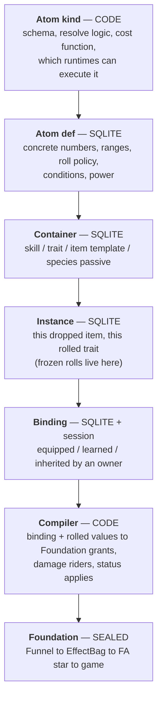

# The ideal — atom effects, containers, and power as a currency

**Status:** **Ideal capture (2026-08-22)** — a vision document, not a spec. No module ids, no build order, no acceptance criteria, nothing committed. It exists to be argued with, edited, and cut down before anything becomes a capability map. Grounding: the sealed Foundation set ([effect-system.md](effect-system.md), [effect-data.md](effect-data.md), [effect-runtime.md](effect-runtime.md), [effect-funnel.md](effect-funnel.md)) and the code audit in §2. Prior art in §12.

**Owner picks (2026-08-22):**

- **The atom effect is the smallest unit.** `+10 hp`. `5% on death, spawn 2 zombies with 500 hp / 100 atk`. `add 100–200 fire damage on hit`. Skills, traits, and items are **containers**; the effect system manages **how effects are defined and resolved**.
- **Ranges resolve at apply.** `100–200 fire damage` is not a number until the hit happens.
- **Fully data-driven SQLite.** Code owns the **logic**; SQLite owns the **values of concrete effects and their power**.
- **Power appears everywhere** — authoring budget, mechanical input, and display. It is the road to unique-actor power: an actor's power comes from its stats and items, and those come from atom power.
- **Power shape: a vector of category scores plus a derived scalar.** Not one added-up number.
- **Power storage: computed base + stored override**, with the gap between them asserted.
- **AI is not ours.** Atoms cover **definition and resolve**. Targeting, retreat, and decision-making need an AI layer spec, and this game has no AI layer yet.
- **Define ourselves first, then write the track.** Items, traits, statuses, and skills adopt the atom contract when *they* write real specs. We do not design their features for them.
- **Refactor whatever depends on us.** The power math itself is deliberately **not decided** in this document (§8.6).

---

## 1. The premise

Today an "effect" means four unrelated things depending on which file you open. The ideal is that it means exactly one thing, everywhere:

> An **atom** is one indivisible statement of *what happens*, with its numbers and its conditions attached, and a **power** price tag. Everything a player can own, learn, equip, or inherit is a **container** of atoms. Nothing in the game hand-codes an effect ever again.

The owner's three examples, decomposed:

| Plain words | Atom kind | When | Params | Value shape |
|---|---|---|---|---|
| `+10 hp` | `stat.modify` | while bound | `channel=maxHp, op=flat` | `10` — fixed |
| `5% on death spawn 2 zombies (500 hp, 100 atk)` | `spawn.entity` | `OnDeath`, chance 50‰ | `side=zombie, typeId=0, count=2` | `hp=500, atk=100` — fixed |
| `100% add 100–200 fire damage on hit` | `damage.rider` | `OnHitDealt`, chance 1000‰ | `element=fire` | `amount={100,200}` — **rolled on apply** |

Three different shapes, one row format. That is the whole claim.

---

## 2. Why now — what the code actually looks like

Verified 2026-08-22, in `src/`:

**Foundation is finished and does not move.** `EffectBag` plans FA1–FA10 from FT1–FT4; `EffectFunnel` is the sole Secondary→Bag path; FA10 is Writer-Add-only; three guard scripts hold the law. `FoundationContractVersion = 2`. **This document adds nothing to that layer and removes nothing from it.**

**Secondary is close to empty.** Three stub plugins (butter-on-hit, +10 flat ATK, patron marker), 16 hardcoded defs in `EffectSeedCatalog`, and a three-item equipment stub where one item points at a placeholder effect id.

**There is no effect data layer at all.** The `foundation_effect_*` tables in [effect-data.md](effect-data.md) are *logical* — none of the 38 real SQLite tables is one of them. Defs are C# literals. Grants live in RAM plus a JSON blob inside `rpg_unique_stat_mods.mods_json`.

**Four parallel content systems already exist, sharing no vocabulary:**

| System | Where | Size | Reaches Foundation | Shape |
|---|---|---|---|---|
| Effect defs | `EffectSeedCatalog` (C#) | 16 | yes, FA* | def + trigger + action |
| Statuses | `StatusCatalog` (C#, ADR-locked code-first) | 21 | yes, FA2/FA10 | def + grant overlay |
| Battle traits | `TraitBattleCatalog` (C#) | 13 | **no** | **15 hand-coded facet fields** |
| Items | `UniqueEquipmentCatalog` (C#) | 3 stubs | via grant template | `item_id → grant` |

Skills are unstarted and would become a fifth. Every new content kind currently buys its own catalog, its own fields, its own tests. **That is the cost this document exists to stop.**

**Power does not exist.** `combat.power.*` is a damage-side ‰ multiplier; `progression.power` is a hardcoded `1.0` stub; a star is `+30‰`. Nothing computes a rating. Clean slate.

---

## 3. The layer model



**The atom layer is a compiler, not an applier.** It never touches Unity, never writes a stat, never calls a status method. It produces the same `EffectGrant` / `RpgEffectEvent` shapes the Funnel already accepts. The hard law of [effect-system.md](effect-system.md) survives untouched — this layer *is* Secondary, just finally with a spine.

That is the whole reason this can be built without disturbing a sealed layer.

### Who owns what

| Layer | Owns | Must not own |
|---|---|---|
| **Atom kind** (code) | Param schema, validation, resolve semantics, cost function, runtime support matrix | Any magnitude, any content id |
| **Atom def** (data) | Numbers, ranges, roll policy, trigger/stage, chance, ICD, tags, power | Logic, code paths, Unity anything |
| **Container** (data) | Which atoms, in what order, with what overrides; slot and rarity rules | Its own effect semantics |
| **Instance** (data) | Frozen rolls, roll seed, power at roll time | Live combat state |
| **Binding** (data + session) | Who has it, since when, in which slot | Magnitudes |
| **Compiler** (code) | Binding → Foundation grant / rider / status apply | Applying anything itself |

---

## 4. The four roll moments

Every ARPG separates these; our schema must too. The owner's picks touch moments 2 and 4.

| # | Moment | Example | Where it lands | Prior art |
|---|---|---|---|---|
| 1 | **Authoring** | "this affix adds fire damage, tier 3 range" | `effect_atom` row | PoE mod tiers, D4 affix table |
| 2 | **Instantiation** | an item drops → `+7 atk`, frozen forever | `effect_instance_atom` | D2/D4/PoE roll at drop; Last Epoch tier + roll inside tier |
| 3 | **Bind / equip** | equipped → a grant enters the bag | `effect_binding` → Funnel | GAS spec creation, optionally snapshotting |
| 4 | **Apply** | this hit rolls 143 of the 100–200 | nothing persisted; RNG stream | PoE / D2 roll the damage range **per hit** |

**Every numeric value carries a roll policy.** One enum, three values:

```text
fixed             — the number is the number
rollOnInstantiate — rolled once when the instance is created, then frozen (moment 2)
rollOnApply       — rolled every time the atom resolves (moment 4)
```

GAS made exactly this distinction a per-value flag — snapshotted attributes captured at spec creation, non-snapshotted captured at apply — and it is the cleanest available answer. A value spec is therefore `{ min, max, roll }`, and `fixed` is just `min == max`.

**Determinism:** `rollOnInstantiate` draws from a named seed stored on the instance, so a re-read reproduces the item exactly. `rollOnApply` draws from the resolver's per-system stream — the battle engine already runs named streams (`initiative`, `damage`, `crit`, `essence`, `status`); `atom.apply` joins that list. Neither may call an ambient RNG.

---

## 5. Atom kinds — the vocabulary

An atom kind declares an **attach point**: the seam in the machine where its resolve hooks in. The attach point, not the kind name, is what makes the vocabulary finite and auditable.

| Attach point | What it does | Existing seam today | Example kinds |
|---|---|---|---|
| **Stat** | changes a composed channel while bound | ModifierBag → `EntityApply` → Writer | `stat.modify` (flat / increased / more), `stat.derived` (catalog channels) |
| **Damage stage** | rides on an outgoing or incoming hit | SSOT damage resolver, above the Funnel | `damage.rider`, `damage.convert`, `damage.mitigate` |
| **Trigger** | fires a payload on an event | FT1–FT4 + lifecycle | `on.death`, `on.hit`, `on.spawn` wrapping any payload kind |
| **Board** | mutates the lawn | FA4–FA9 via PvzIntent | `spawn.entity`, `board.action`, `grid.item`, `box.type`, `economy` |
| **Status** | applies or clears a status instance | StatusRuntime + StatusExecutor | `status.apply`, `status.clear`, `status.spread` |
| **Resource** | instant current-HP delta | FA10 Writer Add | `resource.delta` |

Every kind declares which **runtimes** can execute it: `lawn` (injector), `battle` (web engine), `world` (later). A container bound in a runtime that cannot execute one of its atoms is a **validation error at bind time**, not a silent no-op. That single rule is what stops the trait catalog from being reinvented.

### What is explicitly NOT an atom

Targeting choice, retreat, threat, ordering, and any other decision an actor *makes* are **not effects**. They are an AI layer that does not exist yet and needs its own spec. Three of today's traits (`coward`, `bloodthirsty`, `loyal`) are that layer wearing an effect costume, and two more (`greedy`, `genius`) are reward math.

The contract we offer that layer, in advance:

- AI reads **atom-declared tags** on an actor to make decisions; it never reads atom internals.
- An AI behavior is referenced from a container **by id**, alongside atoms, never instead of the atom schema.
- Reward and report multipliers get their own attach point when a rewards spec asks for one — not smuggled in as a combat atom.

---

## 6. Containers

A container is a named, ordered bundle of atom references with optional overrides.

| Container kind | Bound to | Notes |
|---|---|---|
| `item` | an actor slot | template → instance with rolled values; the direct road to item power |
| `trait` | a specimen | rolled at summon from a pool, as today |
| `skill` | a specimen | unstarted; needs activation and cooldown, which the turn kernel owns, not us |
| `species-passive` | every specimen of a species | always-on container |
| `patron` / `world-buff` | a match or a player | already exists as a marker grant |

**Atoms are a shared library; containers reference them.** A container may override any value spec of an atom it references (tighten a range, change a chance) — an override is itself a value spec, so it obeys the same roll policy rules. That is what makes "the same affix at five tiers" one atom and five overrides rather than five atoms.

**An instance freezes the rolls.** A dropped item is `effect_instance` plus one `effect_instance_atom` per atom, with `rollOnInstantiate` values resolved and stamped, and the power computed at that moment.

---

## 7. Data architecture

Six tables. Kind logic stays in code, so there is no `effect_kind` table — the kind id is a validated reference into the code registry, exactly the way `statusId` works today.

### `effect_atom` — the library

| Column | Type | Notes |
|---|---|---|
| `atom_id` | TEXT PK | stable kebab id (`atom.fire-rider.t3`) |
| `kind_id` | TEXT | validated against the code registry |
| `name` | TEXT | display |
| `when_json` | TEXT | trigger or damage stage, `chance` (‰), `icd_ms`, filters |
| `params_json` | TEXT | kind-schema-validated; numeric leaves are **value specs** |
| `tags_json` | TEXT | element, family, category — for AI, UI, and cost lookup |
| `power_json` | TEXT | computed category vector (§8), refreshed by tooling |
| `power_override_json` | TEXT | designer override, nullable |
| `power_note` | TEXT | required when an override is set |
| `enabled`, `revision` | INT | catalog push / cache bust |

A **value spec** is `{ "min": n, "max": n, "roll": "fixed|onInstantiate|onApply", "scale": "…" }`. Anywhere a number could go, a value spec can go.

### `effect_container` and `effect_container_atom`

| `effect_container` | Notes | | `effect_container_atom` | Notes |
|---|---|---|---|---|
| `container_id` TEXT PK | | | `container_id` TEXT FK | |
| `container_kind` TEXT | item / trait / skill / passive | | `seq` INT | resolve order |
| `slot`, `rarity`, `level_req` | authoring rules | | `atom_id` TEXT FK | |
| `tags_json`, `enabled`, `revision` | | | `overrides_json` TEXT | value-spec overrides |

### `effect_instance` and `effect_instance_atom`

| `effect_instance` | Notes | | `effect_instance_atom` | Notes |
|---|---|---|---|---|
| `instance_id` TEXT PK | | | `instance_id` TEXT FK | |
| `container_id` TEXT FK | | | `atom_id` TEXT FK | |
| `roll_seed` INT | replay the drop | | `values_json` TEXT | **frozen** moment-2 rolls |
| `created_utc`, `origin` | drop / craft / grant | | `power_json` TEXT | power at roll time |

### `effect_binding`

Replaces the logical `foundation_effect_grant` and absorbs today's `mods_json` grant blobs.

| Column | Notes |
|---|---|
| `binding_id` TEXT PK | |
| `instance_id` TEXT FK | |
| `owner_kind` / `owner_key` | `match` / `plant:N` / `zombie:N` / `entity:HEX` / `player` — the existing vocabulary, unchanged |
| `slot` | for items |
| `source` | plugin or feature id, for withdraw |
| `bound_utc`, `revision` | |

Runtime state — ICD clocks, stacks, status instances — stays exactly where it is: session RAM, per [status-ssot.md](status-ssot.md). **No new durable runtime table.**

### Determinism and content versioning

Content becoming data means goldens now depend on a content revision. The ideal:

- A **content hash** over the atom / container / instance-template tables is computed at load and stamped into the report alongside `engineVersion`, `rngAlgoVersion`, `rulesetVersion`, `seed`.
- Changing a number changes the hash, which is a **visible** golden re-bless, not a silent drift.
- SQL stays inside `FusionRpg.Data` (`guard-dal.ps1`). Core resolvers stay pure integer functions over loaded content.

---

## 8. Power — the currency

### 8.1 What it is

Power is a **price**: what an atom costs, in a unit comparable across every kind of effect. From that one price everything else derives — item power is the sum over an item's atoms, actor power is a function over the actor's stats and bound items, and an authoring budget is a ceiling on that sum.

### 8.2 A vector, not a number

Each atom contributes to a small fixed set of categories:

```text
offense · survivability · control · utility · economy
```

Diablo 3 needed three separate aggregates (Damage / Toughness / Recovery) for exactly this reason, and its sheet numbers are still famously wrong because they omit multiplicative sources. Adding a `+crit rate` atom to a `+crit damage` atom underprices both; adding an offense atom to a defense atom compares things that do not compare.

The **scalar** shown to a player is a combination function over the vector, chosen so a glass cannon does not read as stronger than a balanced actor. Which function is §8.6.

### 8.3 Computed base plus stored override

The cost function gives a number; a designer may override it, and must say why. A test recomputes every atom's power and fails when an override drifts beyond tolerance without a note. This is the escape hatch for effects the formula misprices — and a running list of which shapes the formula is bad at.

### 8.4 Shape of the cost function

```text
power[category] = coeff(kind, channel, category)
                × normalize(magnitude, referenceScale)
                × conditionality
```

- **`coeff`** is a per-kind, per-channel table — the same idea as the stat-cost multipliers in WoW's stat budget, where combat ratings and primary stats cost 1.0 and Stamina costs 2/3.
- **`normalize`** solves the `+10 atk` problem. A flat value is priced against the **baseline stat at a reference level**, not in raw points; our level curves (`BaseAtk = 12 + 4L`) already provide that reference. Power is denominated in budget points, and the budget itself grows with level. WoW's curve is `B(x) = a · 1.15^(x/15)` — +15% every 15 levels. Ours would be our own curve, but the same shape of idea.
- **`conditionality`** discounts the uncertain: `chance × triggerFrequency × icdFactor × targetCountFactor`. A 5% on-death spawn is worth a fraction of the same spawn unconditionally. For a `rollOnApply` range the priced magnitude is the mean of the range — with a note that variance itself has value, which the formula ignores by design.

### 8.5 Where power gets consumed

| Consumer | Use | Status today |
|---|---|---|
| Authoring | rarity R may spend ≤ N power; content test fails over budget | Last Epoch's forging potential is the same shape |
| Item generation | roll affixes until the budget is spent | D4 runs it **backwards** — item power picks the affix range band |
| Actor power | specimen power from stats plus bound items | the audit's missing number |
| Difficulty and rewards | node danger, encounter scaling, "harder pays more" | audit F-C2 / F-C3 — the gap this closes |
| UI | roster sorting, comparison, gear score | weighted by slot, as WoW does |

The two directions in that table are a real fork and both are legitimate: **value → power** (WoW: derive the score from what rolled) or **power → value** (D4: the band picks what may roll). They can coexist — derive for scoring, band for generation — but only if the coefficient table is the single source both read.

### 8.6 Deliberately open

The owner has **not** decided the math, and this document does not sneak it in. Still open:

1. The combination function for the scalar (weighted sum, geometric mean, offense × survivability).
2. Whether coefficients are hand-authored or calibrated by sweeping the deterministic battle engine and then frozen per ruleset version.
3. The budget curve's shape, and whether rarity or level drives it.
4. Whether generation is budget-spend (Last Epoch) or band-lookup (D4).
5. How multiplicative pairs (crit rate × crit damage, element matchup, shields) get priced without pretending they add.

Answering 1 and 2 is enough to start a capability map. The rest can resolve inside module specs.

---

## 9. What "easy to extend" has to mean

The test of this design is the cost of one new effect. Target:

| Change | Cost |
|---|---|
| New concrete effect using an existing kind | **one row.** No build, no code, power derived automatically |
| New container (item, trait, skill) | rows only |
| New atom **kind** | code: schema, resolve, cost coefficients, runtime support, tests. A reviewed change, not an ADR |
| New Foundation primitive (FA11) | ADR, as today. Should be rare — that is the point of a rich kind layer above a small opcode set |
| New attach point | ADR — this is the seam list, and it is meant to stay short |

If adding a normal effect ever costs more than a row, the design has failed and should be said to have failed.

---

## 10. The track for the dependents

Audited 2026-08-22. Each of these adopts the contract when **its own** spec is written; we do not write their features here.

| Dependent | Reality now | Track |
|---|---|---|
| **Effect defs** (16) | `EffectSeedCatalog` C# literals; consumed by harness, sim, injector, cheat runner, VFX catalog, 4 test files, **19 JSON fixtures** | First migration and the cheapest. The fixtures are already the data format. Proves the schema against effects Foundation executes today |
| **Items** (3) | Genuinely a stub: `rpg_unique_equipment(instance_id, slot, item_id)` — no item entity, no rolled values, no rarity, no power. One item points at a placeholder effect id | Greenfield. When an item spec lands it gets containers, instances, rolled values, and item power for free. **Do not build an item system here** |
| **Battle traits** (13) | Not a stub in wiring: read by `BattleEngine`, `BattleStatComposer`, `ExpeditionResolver`; locked by adoption tests, regression-lock tests, and content-hashed goldens. But 15 hand-coded facet fields, all passive | Split at migration: the 7 funnel-routed traits become containers of atoms; the 6 engine behaviors wait for the AI and rewards layers. Touches `RulesetVersion` and needs a golden re-bless — plan it as its own wave |
| **Statuses** (21) | Deeply wired; ADR-locked code-first | Status *kind* logic stays code — consistent with this design, since kinds are code everywhere. Only magnitudes would move, and only if a status spec asks. The lock does not need revisiting to start |
| **Skills** (0) | Unstarted (battle-enrichment wave E2) | Containers from day one. Activation and cooldown belong to the turn kernel ([battle-turn-ideal.md](battle-turn-ideal.md)), not to us |
| **AI** (none) | Does not exist | §5 contract, offered in advance |

---

## 11. What this refuses

| Refused | Why |
|---|---|
| Touching the Foundation contract | It is sealed and it works. Atoms compile *into* it |
| A Secondary-to-Unity shortcut "just for atoms" | Same hard law as today |
| A runtime YAML or mod loader | Data means our SQLite with a content hash, not arbitrary external content |
| A single added-up power scalar as SSOT | Diablo 3's sheet-DPS problem, adopted on purpose |
| Designing the item, skill, or AI systems here | They write their own specs and inherit this contract |
| Power that ignores level scale | `+10 atk` is not one price at level 1 and level 50 |
| A background job to recompute power | Same lazy-resolution law as the rest of the server: compute on read or on write, never on a schedule |
| Silent content drift | Content hash in the report stamp, or goldens become fiction |

---

## 12. Prior art

| Source | What we take | What we refuse |
|---|---|---|
| **GAS** (Unreal) | Atom = effect, container = ability; modifiers vs executions; **snapshot-at-creation vs at-apply as a per-value flag** | Its tag machinery and replication model |
| **PoE** | Mod tiers as ranges; tags plus spawn weights for generation; damage rolled per hit | Its refusal of any power score — we need one |
| **Diablo 4** | Item power bands select affix ranges (power as an *input*) | Breakpoint cliffs as a player-facing mechanic |
| **Diablo 2 / 3** | Min–max damage rolled per hit; Toughness as honest effective HP (`DR = armor / (armor + 3500)`) | Sheet DPS — a scalar that omits multiplicative sources |
| **WoW** | Stat budget `B(x) = a · 1.15^(x/15)`; per-stat cost multipliers; gear score as a slot-weighted sum | Item-level inflation and squishes |
| **Last Epoch** | Forging potential — a per-item spend budget; tier plus range within tier | Crafting durability RNG as a player-facing cost |

---

## 13. Open questions for the next round

1. **Does the atom library have tiers?** One atom with a tier column and a range per tier (PoE / Last Epoch), or one atom per tier sharing a family tag? Decides how big the library gets.
2. **Do containers roll their atom list, or is the list fixed?** Item templates that roll *which* affixes appear need a weighted pool table; fixed-list containers do not.
3. **Where does the compiler run** — server (cold, pushed to the injector like today's grant snapshot) or in Core on both sides? Decides whether the injector ever reads content rows.
4. **What happens to `mods_json`?** It currently holds grants and absolutes in one blob per instance. Absorbing grants into `effect_binding` leaves the absolutes needing a home.
5. **Power in the report stamp?** If difficulty and rewards read actor power, the report needs the power that was used, not a power recomputed later.
6. §8.6 items 1 and 2 — enough to start a capability map.
