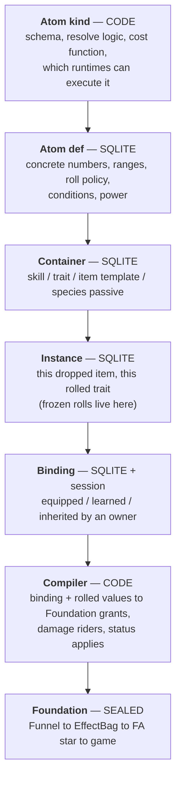

# The ideal — atom effects, containers, and power as a currency

**Status:** **Ideal capture (2026-08-22)** — a vision document, not a spec. **Superseded in three places by later work** — see the correction note at the end of §13; where this document and [effect-atom/definitions.md](effect-atom/definitions.md) disagree, **the definitions win.** No module ids, no build order, no acceptance criteria, nothing committed. It exists to be argued with, edited, and cut down before anything becomes a capability map. Grounding: the sealed Foundation set ([effect-system.md](effect-system.md), [effect-data.md](effect-data.md), [effect-runtime.md](effect-runtime.md), [effect-funnel.md](effect-funnel.md)) and the code audit in §2. Prior art in §12.

**Owner picks (2026-08-22):**

- **The atom effect is the smallest unit.** `+10 hp`. `5% on death, spawn 2 zombies with 500 hp / 100 atk`. `add 100–200 fire damage on hit`. Skills, traits, and items are **containers**; the effect system manages **how effects are defined and resolved**.
- **Ranges resolve at apply.** `100–200 fire damage` is not a number until the hit happens.
- **Fully data-driven SQLite.** Code owns the **logic**; SQLite owns the **values of concrete effects and their power**.
- **Power appears everywhere** — authoring budget, mechanical input, and display. It is the road to unique-actor power: an actor's power comes from its stats and items, and those come from atom power.
- **Power shape: a vector of category scores plus a derived scalar.** Not one added-up number.
- **Power storage: computed base + stored override**, with the gap between them asserted.
- **AI is not ours.** Atoms cover **definition and resolve**. Targeting, retreat, and decision-making need an AI layer spec, and this game has no AI layer yet.
- **Define ourselves first, then write the track.** Items, traits, statuses, and skills adopt the atom contract when *they* write real specs. We do not design their features for them.
- **Refactor whatever depends on us.** The power math itself is deliberately **not decided** in this document (§8.6).

**Owner picks — schema round (2026-08-22):**

- **Atoms carry a tier.** Rows are `(family_id, tier)` with that tier's range. **Tier is how strong; rarity is how many and which tiers are allowed** — two axes, never conflated. Loot and capture rarity fall out of tier + pool weights, with no third mechanism.
- **`scale` is a named curve reference.** A value spec points at a row in a curve table; scaling is data, never a formula string.
- **Conditions are a typed predicate tree** — AND/OR/NOT over a **closed** leaf list, with a hard depth limit, validation that rejects unknown leaves instead of ignoring them, and no power-pricing recursion past that depth.
- **Containers are a fixed core plus an optional weighted pool.** Traits, skills, and species passives use the core alone; item templates roll from the pool.

**Owner picks — power and plumbing round (2026-08-22):**

- **The server compiles and pushes compiled output.** The injector never holds content rows; this extends today's `effects.grants.apply` push. Per-hit rolls stay local because they are per-hit.
- **The contribution seam is declared, its shape deferred.** Damage atoms produce contributions and never apply; the applier spec owns the record's fields.
- **The display scalar is a geometric mean** over the category vector. The vector stays SSOT.
- **Coefficients are hand-authored now, fitted later.** A sweep harness follows and reports drift against the authored table.
- **Multiplicative pairs are priced by a marginal read**, not a smarter formula: stored atom power stays context-free for budgets and display; AI and the balance sweep read `vector(with) − vector(without)`, which captures interaction by construction (§13).
- **The per-hit path takes no dictionaries, no string comparison, and no recursion** — measured 2026-08-22 (§13). Content compiles at load; the exact encoding is a build-time benchmark.
- Defaults taken without objection: the **budget curve reads `effect_curve`** like any other scaled value, so "level or rarity" is a data choice; **generation is pool + tier weights**, with the budget as a **validation** check rather than a generation mechanism; **spawn-atom power recursion is depth 1, memoized**.

---

## 1. The premise

Today an "effect" means four unrelated things depending on which file you open. The ideal is that it means exactly one thing, everywhere:

> An **atom** is one indivisible statement of *what happens*, with its numbers and its conditions attached, and a **power** price tag. Everything a player can own, learn, equip, or inherit is a **container** of atoms. Nothing in the game hand-codes an effect ever again.

The owner's three examples, decomposed:

| Plain words | Atom kind | When | Params | Value shape |
|---|---|---|---|---|
| `+10 hp` | `stat.modify` | while bound | `channel=maxHp, op=flat` | `10` — fixed |
| `5% on death spawn 2 zombies (500 hp, 100 atk)` | `spawn.entity` | `OnDeath`, chance 50‰ | `side=zombie, typeId=0, count=2` | `hp=500, atk=100` — fixed |
| `100% add 100–200 fire damage on hit` | `damage.rider` | `OnHitDealt`, chance 1000‰ | `element=fire` | `amount={100,200}` — **rolled on apply** |

Three different shapes, one row format. That is the whole claim.

---

## 2. Why now — what the code actually looks like

Verified 2026-08-22, in `src/`:

**Foundation is finished and does not move.** `EffectBag` plans FA1–FA10 from FT1–FT4; `EffectFunnel` is the sole Secondary→Bag path; FA10 is Writer-Add-only; three guard scripts hold the law. `FoundationContractVersion = 2`. **This document adds nothing to that layer and removes nothing from it.**

**Secondary is close to empty.** Three stub plugins (butter-on-hit, +10 flat ATK, patron marker), 16 hardcoded defs in `EffectSeedCatalog`, and a three-item equipment stub where one item points at a placeholder effect id.

**There is no effect data layer at all.** The `foundation_effect_*` tables in [effect-data.md](effect-data.md) are *logical* — none of the 38 real SQLite tables is one of them. Defs are C# literals. Grants live in RAM plus a JSON blob inside `rpg_unique_stat_mods.mods_json`.

**Four parallel content systems already exist, sharing no vocabulary:**

| System | Where | Size | Reaches Foundation | Shape |
|---|---|---|---|---|
| Effect defs | `EffectSeedCatalog` (C#) | 16 | yes, FA* | def + trigger + action |
| Statuses | `StatusCatalog` (C#, ADR-locked code-first) | 21 | yes, FA2/FA10 | def + grant overlay |
| Battle traits | `TraitBattleCatalog` (C#) | 13 | **no** | **15 hand-coded facet fields** |
| Items | `UniqueEquipmentCatalog` (C#) | 3 stubs | via grant template | `item_id → grant` |

Skills are unstarted and would become a fifth. Every new content kind currently buys its own catalog, its own fields, its own tests. **That is the cost this document exists to stop.**

**Power does not exist.** `combat.power.*` is a damage-side ‰ multiplier; `progression.power` is a hardcoded `1.0` stub; a star is `+30‰`. Nothing computes a rating. Clean slate.

---

## 3. The layer model



**The atom layer is a compiler, not an applier.** It never touches Unity, never writes a stat, never calls a status method. It produces the same `EffectGrant` / `RpgEffectEvent` shapes the Funnel already accepts. The hard law of [effect-system.md](effect-system.md) survives untouched — this layer *is* Secondary, just finally with a spine.

That is the whole reason this can be built without disturbing a sealed layer.

### Who owns what

| Layer | Owns | Must not own |
|---|---|---|
| **Atom kind** (code) | Param schema, validation, resolve semantics, cost function, runtime support matrix | Any magnitude, any content id |
| **Atom def** (data) | Numbers, ranges, roll policy, trigger/stage, chance, ICD, tags, power | Logic, code paths, Unity anything |
| **Container** (data) | Which atoms, in what order, with what overrides; slot and rarity rules | Its own effect semantics |
| **Instance** (data) | Frozen rolls, roll seed, power at roll time | Live combat state |
| **Binding** (data + session) | Who has it, since when, in which slot | Magnitudes |
| **Compiler** (code) | Binding → Foundation grant / rider / status apply | Applying anything itself |

---

## 4. The four roll moments

Every ARPG separates these; our schema must too. The owner's picks touch moments 2 and 4.

| # | Moment | Example | Where it lands | Prior art |
|---|---|---|---|---|
| 1 | **Authoring** | "this affix adds fire damage, tier 3 range" | `effect_atom` row | PoE mod tiers, D4 affix table |
| 2 | **Instantiation** | an item drops → `+7 atk`, frozen forever | `effect_instance_atom` | D2/D4/PoE roll at drop; Last Epoch tier + roll inside tier |
| 3 | **Bind / equip** | equipped → a grant enters the bag | `effect_binding` → Funnel | GAS spec creation, optionally snapshotting |
| 4 | **Apply** | this hit rolls 143 of the 100–200 | nothing persisted; RNG stream | PoE / D2 roll the damage range **per hit** |

**Every numeric value carries a roll policy.** One enum, three values:

```text
fixed             — the number is the number
rollOnInstantiate — rolled once when the instance is created, then frozen (moment 2)
rollOnApply       — rolled every time the atom resolves (moment 4)
```

GAS made exactly this distinction a per-value flag — snapshotted attributes captured at spec creation, non-snapshotted captured at apply — and it is the cleanest available answer. A value spec is therefore `{ min, max, roll }`, and `fixed` is just `min == max`.

**Determinism:** `rollOnInstantiate` draws from a named seed stored on the instance, so a re-read reproduces the item exactly. `rollOnApply` draws from the resolver's per-system stream — the battle engine already runs named streams (`initiative`, `damage`, `crit`, `essence`, `status`); `atom.apply` joins that list. Neither may call an ambient RNG.

---

## 5. Atom kinds — the vocabulary

An atom kind declares an **attach point**: the seam in the machine where its resolve hooks in. The attach point, not the kind name, is what makes the vocabulary finite and auditable.

| Attach point | What it does | Existing seam today | Example kinds |
|---|---|---|---|
| **Stat** | changes a composed channel while bound | ModifierBag → `EntityApply` → Writer | `stat.modify` (flat / increased / more), `stat.derived` (catalog channels) |
| **Damage** | a *triggered payload*, not its own seam — see §5.1 | trigger → resource delta → FA10 → Writer Add, **shipped** | expressed as `on.hit` + `resource.delta` with an element payload |
| **Trigger** | fires a payload on an event | FT1–FT4 + lifecycle | `on.death`, `on.hit`, `on.spawn` wrapping any payload kind |
| **Board** | mutates the lawn | FA4–FA9 via PvzIntent | `spawn.entity`, `board.action`, `grid.item`, `box.type`, `economy` |
| **Status** | applies or clears a status instance | StatusRuntime + StatusExecutor | `status.apply`, `status.clear`, `status.spread` |
| **Resource** | instant current-HP delta | FA10 Writer Add | `resource.delta` |

Every kind declares which **runtimes** can execute it: `lawn` (injector), `battle` (web engine), `world` (later). A container bound in a runtime that cannot execute one of its atoms is a **validation error at bind time**, not a silent no-op. That single rule is what stops the trait catalog from being reinvented.

### 5.1 Dealing damage is a triggered payload — merging sources is someone else's layer

`add 100–200 fire damage on hit` needs **no new attach point**. It is a trigger plus a payload: `OnDamageDealt` fires, a resource-delta atom rolls its range, and the amount travels the shipped path — Funnel → FA10 → Writer Add, with the element payload the calculator already accepts. Foundation does this today.

What does **not** exist is a layer that takes many damage sources aimed at one hit — the vanilla hit itself, riders, statuses, shields, future skills — and decides how they **merge, order, and mitigate**. On the lawn there is no such gameplay layer at all: vanilla peas and bites run Unity `TakeDamage` and are observed only, while `DamageApplyPipeline` is reached from battle, sim, debug, and tests. That layer is undesigned by decision.

**Neither fact blocks an atom.** A single atom dealing damage works now. What waits on that layer is *combining* atoms into one coherent hit. The boundary we hold either way is the same one as with AI: we own **definition and resolve**; a neighbour owns **merge and apply**, writes its own spec, and inherits our contract.

What we owe that layer, in advance:

- A **contribution** is a resolved value plus its provenance. Its exact fields are **deliberately not fixed here** — the applier spec owns them. What is fixed: the value arrives already rolled and already attributed.
- Atoms **never** order, mitigate, or merge. Those are the applier's rules.
- One contribution shape serves every source, so the applier never learns where a number came from.

### 5.2 Runtime consumers — what actually exists

Audited 2026-08-22. A kind can only claim a runtime where a **consumer** exists. The honest picture:

| Attach point | Lawn (injector) | Battle (web engine) | Sim / offline |
|---|---|---|---|
| **Stat** | FA1 → ModifierBag → `EntityApply` → Writer — shipped, LIVE L1–L14 | `BattleStatComposer` at setup only; the bag sink **ignores** FA1 | plan only |
| **Damage** | **none** (§5.1) | inlined in the `BattleEngine` attack loop, hardcoded per trait | n/a |
| **Trigger** (FT*) | `EffectBag.OnEvent` from capture — shipped | **none — the engine never calls `OnEvent`** | `OnEvent` via harness / scenarios |
| **Board** | FA4–FA9 → PvzIntent — LIVE-proven | inert | recorded plan |
| **Status** | `StatusExecutor` + `StatusRuntime` — shipped | `StatusRuntime` is mounted, but entered only through scripted `InitialStatuses` — not through FA2 | plan only |
| **Resource delta** | FA10 → Writer Add — shipped | `BattleEffectSink` — **the only opcode battle consumes** | plan only |

`InjectorEffectActionSink` implements all ten opcodes. `BattleEffectSink` states it outright: *"battle mode consumes FA10 only; other actions are inert here."*

**Consequences for the spec, and they are not small:**

1. **"One vocabulary, many backends" is aspirational for battle**, not a description. Battle consumes one of six attach points and fires zero triggers.
2. The **bind-time validation error will fire constantly** at wave 1. That is correct behaviour — loud and honest beats silent no-ops — but it means wave 1 must not promise battle support it cannot deliver.
3. The runtime support matrix is a **living, audited table**, not a design assertion. It grows when a runtime grows a consumer, and it is the thing to re-read before promising any content works anywhere.

### What is explicitly NOT an atom

Targeting choice, retreat, threat, ordering, and any other decision an actor *makes* are **not effects**. They are an AI layer that does not exist yet and needs its own spec. Three of today's traits (`coward`, `bloodthirsty`, `loyal`) are that layer wearing an effect costume, and two more (`greedy`, `genius`) are reward math.

The contract we offer that layer, in advance:

- AI reads **atom-declared tags** on an actor to make decisions; it never reads atom internals.
- An AI behavior is referenced from a container **by id**, alongside atoms, never instead of the atom schema.
- Reward and report multipliers get their own attach point when a rewards spec asks for one — not smuggled in as a combat atom.
- We expose the **power vector** and the **matchup-conditioned read** (§8.7); the AI layer owns normalization, response curves, and weights. It never reads the display scalar.

---

## 6. Containers

A container is a named, ordered bundle of atom references with optional overrides.

| Container kind | Bound to | Notes |
|---|---|---|
| `item` | an actor slot | template → instance with rolled values; the direct road to item power |
| `trait` | a specimen | rolled at summon from a pool, as today |
| `skill` | a specimen | unstarted; needs activation and cooldown, which the turn kernel owns, not us |
| `species-passive` | every specimen of a species | always-on container |
| `patron` / `world-buff` | a match or a player | already exists as a marker grant |

**Atoms are a shared library; containers reference them.** A container may override any value spec of an atom it references (tighten a range, change a chance) — an override is itself a value spec, so it obeys the same roll policy rules. That is what makes "the same affix at five tiers" one atom and five overrides rather than five atoms.

**An instance freezes the rolls.** A dropped item is `effect_instance` plus one `effect_instance_atom` per atom, with `rollOnInstantiate` values resolved and stamped, and the power computed at that moment.

---

## 7. Data architecture

Six tables. Kind logic stays in code, so there is no `effect_kind` table — the kind id is a validated reference into the code registry, exactly the way `statusId` works today.

### `effect_atom` — the library

| Column | Type | Notes |
|---|---|---|
| `atom_id` | TEXT PK | stable kebab id (`atom.fire-rider.t3`) |
| `kind_id` | TEXT | validated against the code registry |
| `family_id` | TEXT | groups the tiers of one affix (`atom.fire-rider`) |
| `tier` | INT | strength band within the family; `1` when a family has one tier |
| `name` | TEXT | display |
| `when_json` | TEXT | trigger or damage stage, `chance` (‰), `icd_ms`, and the **predicate tree** |
| `params_json` | TEXT | kind-schema-validated; numeric leaves are **value specs** |
| `tags_json` | TEXT | element, family, category — for AI, UI, and cost lookup |
| `power_json` | TEXT | computed category vector (§8), refreshed by tooling |
| `power_override_json` | TEXT | designer override, nullable |
| `power_note` | TEXT | required when an override is set |
| `enabled`, `revision` | INT | catalog push / cache bust |

A **value spec** is `{ "min": n, "max": n, "roll": "fixed|onInstantiate|onApply", "scale": "curve.id?" }`. Anywhere a number could go, a value spec can go. `scale` names a row in `effect_curve`; omitted means no scaling.

### `effect_curve` — scaling as data

One table serves every scaled value, so scaling is never a formula in a string.

| Column | Type | Notes |
|---|---|---|
| `curve_id` | TEXT PK | `curve.atk.level`, `curve.rarity.band` |
| `input` | TEXT | what the curve reads — `level`, `rarity`, `tier` |
| `points_json` | TEXT | ordered `(x, multiplierMilli)` points; integer ‰, interpolated between points |
| `revision` | INT | joins the content hash |

The same table gives the power cost function its **reference scale** (§8.4), so a value and its price read one source.

### `effect_container_pool` — the rolled half of a container

| Column | Type | Notes |
|---|---|---|
| `container_id` | TEXT FK | |
| `atom_id` | TEXT FK | a candidate, usually one tier of a family |
| `weight` | INT | spawn weight; `0` excludes |
| `group` | TEXT | optional — roll at most one atom per family/group |

`effect_container` gains `pool_rolls` (how many to draw) and `pool_seed_scope`. A container with no pool rows is a plain fixed list, which is what traits, skills, and species passives use.

### `effect_container` and `effect_container_atom`

| `effect_container` | Notes | | `effect_container_atom` | Notes |
|---|---|---|---|---|
| `container_id` TEXT PK | | | `container_id` TEXT FK | |
| `container_kind` TEXT | item / trait / skill / passive | | `seq` INT | resolve order |
| `slot`, `rarity`, `level_req` | authoring rules | | `atom_id` TEXT FK | |
| `tags_json`, `enabled`, `revision` | | | `overrides_json` TEXT | value-spec overrides |

### `effect_instance` and `effect_instance_atom`

| `effect_instance` | Notes | | `effect_instance_atom` | Notes |
|---|---|---|---|---|
| `instance_id` TEXT PK | | | `instance_id` TEXT FK | |
| `container_id` TEXT FK | | | `atom_id` TEXT FK | |
| `roll_seed` INT | replay the drop | | `values_json` TEXT | **frozen** moment-2 rolls |
| `created_utc`, `origin` | drop / craft / grant | | `power_json` TEXT | power at roll time |

### `effect_binding`

Replaces the logical `foundation_effect_grant` and absorbs today's `mods_json` grant blobs.

| Column | Notes |
|---|---|
| `binding_id` TEXT PK | |
| `instance_id` TEXT FK | |
| `owner_kind` / `owner_key` | `match` / `plant:N` / `zombie:N` / `entity:HEX` / `player` — the existing vocabulary, unchanged |
| `slot` | for items |
| `source` | plugin or feature id, for withdraw |
| `bound_utc`, `revision` | |

Runtime state — ICD clocks, stacks, status instances — stays exactly where it is: session RAM, per [status-ssot.md](status-ssot.md). **No new durable runtime table.**

### Determinism and content versioning

Content becoming data means goldens now depend on a content revision. The ideal:

- A **content hash** over the atom / container / instance-template tables is computed at load and stamped into the report alongside `engineVersion`, `rngAlgoVersion`, `rulesetVersion`, `seed`.
- Changing a number changes the hash, which is a **visible** golden re-bless, not a silent drift.
- SQL stays inside `FusionRpg.Data` (`guard-dal.ps1`). Core resolvers stay pure integer functions over loaded content.

---

## 8. Power — the currency

### 8.1 What it is

Power is a **price**: what an atom costs, in a unit comparable across every kind of effect. From that one price everything else derives — item power is the sum over an item's atoms, actor power is a function over the actor's stats and bound items, and an authoring budget is a ceiling on that sum.

### 8.2 A vector, not a number

Each atom contributes to a small fixed set of categories:

```text
offense · survivability · control · utility · economy
```

Diablo 3 needed three separate aggregates (Damage / Toughness / Recovery) for exactly this reason, and its sheet numbers are still famously wrong because they omit multiplicative sources. Adding a `+crit rate` atom to a `+crit damage` atom underprices both; adding an offense atom to a defense atom compares things that do not compare.

The **scalar** shown to a player is a **geometric mean over the categories**. A near-zero category drags the product down, which is the honest statement that zero survivability makes offense worthless — and it degrades gracefully as categories are added later. The vector stays SSOT; the scalar is a derived read, never stored as truth.

### 8.3 Computed base plus stored override

The cost function gives a number; a designer may override it, and must say why. A test recomputes every atom's power and fails when an override drifts beyond tolerance without a note. This is the escape hatch for effects the formula misprices — and a running list of which shapes the formula is bad at.

### 8.4 Shape of the cost function

```text
power[category] = coeff(kind, channel, category)
                × normalize(magnitude, referenceScale)
                × conditionality
```

- **`coeff`** is a per-kind, per-channel table — the same idea as the stat-cost multipliers in WoW's stat budget, where combat ratings and primary stats cost 1.0 and Stamina costs 2/3.
- **`normalize`** solves the `+10 atk` problem. A flat value is priced against the **baseline stat at a reference level**, not in raw points; our level curves (`BaseAtk = 12 + 4L`) already provide that reference. Power is denominated in budget points, and the budget itself grows with level. WoW's curve is `B(x) = a · 1.15^(x/15)` — +15% every 15 levels. Ours would be our own curve, but the same shape of idea.
- **`conditionality`** discounts the uncertain: `chance × triggerFrequency × icdFactor × targetCountFactor`. A 5% on-death spawn is worth a fraction of the same spawn unconditionally. For a `rollOnApply` range the priced magnitude is the mean of the range — with a note that variance itself has value, which the formula ignores by design.

### 8.5 Where power gets consumed

| Consumer | Use | Status today |
|---|---|---|
| Authoring | rarity R may spend ≤ N power; content test fails over budget | Last Epoch's forging potential is the same shape |
| Item generation | roll affixes until the budget is spent | D4 runs it **backwards** — item power picks the affix range band |
| Actor power | specimen power from stats plus bound items | the audit's missing number |
| Difficulty and rewards | node danger, encounter scaling, "harder pays more" | audit F-C2 / F-C3 — the gap this closes |
| UI | roster sorting, comparison, gear score | weighted by slot, as WoW does |

The two directions in that table are a real fork and both are legitimate: **value → power** (WoW: derive the score from what rolled) or **power → value** (D4: the band picks what may roll). They can coexist — derive for scoring, band for generation — but only if the coefficient table is the single source both read.

### 8.6 Decided, and the one thing still open

**Decided 2026-08-22:** the scalar is a **geometric mean** (§8.2) · coefficients are **hand-authored now, fitted later**, with a sweep harness that reports drift rather than silently rewriting the table · the **budget curve is a row in `effect_curve`**, so whether level or rarity drives it is data, not schema · **generation is pool + tier weights**, and the budget is a **validation** check that fails content over its ceiling, not a generation mechanism.

**Still open — one item, and it is the hard one:**

> How do multiplicative pairs get priced without pretending they add? Crit rate × crit damage, the element matchup ring, and shield layers all multiply. A per-atom cost function prices each in isolation and will therefore underprice both halves of any pair.

Three candidate answers, none chosen: price pairs by **tagging interactions** and applying a joint coefficient when both tags are present on one actor; price at the **actor** level by evaluating the vector twice (with and without the atom) and taking the difference, which captures interaction by construction; or accept the error at atom level and let the **sweep** correct it via the override column. The third is the cheapest and matches the coefficient decision above.

This does not block the spec. It blocks trusting the number for balance.

### 8.7 Power for AI — the reader that actually needs it

**A human barely needs power.** A player compares two items by reading them. The reader that genuinely cannot function without a number is the **AI**: it has to pick a target, decide whether to commit or retreat, choose what to summon, and price a trade — all in code, all now. Game AI research is therefore the honest source for what shape this value takes, and its answer is consistent: **almost never one number.**

| Shape | What it is | Who uses it | Our analogue |
|---|---|---|---|
| **Weighted feature vector** | value = Σ (feature × weight); the standard static evaluation | chess engines — material, mobility, king safety | §8.2 category vector |
| **Position matrix** | value depends on *where* the piece is (piece-square tables, one set per game phase) | chess; material + PSQT alone is already a ~2000–2200 Elo engine | lawn row/column, world sector |
| **Matchup matrix** | value depends on *against whom*; damage-per-frame and counter matrices, learned from replays | RTS army composition, hard counters | **we already have one** — the element ring ±250‰ and light↔dark |
| **Influence map** | a spatial grid of summed threat, layered and decayed; strategic maps refresh 0.5–1 Hz, tactical 2–5 Hz | RTS attack/defend/kite decisions | the 5-lane board; later, world sectors |
| **Search tree** | no static value at all — simulate and back up the result | MCTS in card games, where hand-crafted evaluation is inadequate | our deterministic battle engine, used as evaluator |

The lesson is not "pick one." It is that **the same underlying price is read through different projections**, and the projection is chosen by the question being asked.

**How the numbers get defined.** Three methods, all in use:

1. **Hand-authored weights** — fastest, and where every system starts.
2. **Regression from outcomes** — chess piece values have been derived by regression analysis; Hearthstone card cost models as a linear model over attributes plus an intrinsic constant, where an ability is priced as a function of the stat it multiplies (charge on a 2-attack minion costs `2 × charge`).
3. **Fitted from recorded battles** — the StarCraft Lanchester work learned per-unit strength values by **maximum likelihood estimation from past battles**, and beat simulation-based prediction while being faster than it.

Method 3 is the one worth noting: **we can generate that data**. The battle engine is deterministic and seeded, so a sweep produces as many recorded battles as we want. Fitting coefficients rather than arguing about them is available to us in a way it is not to most projects.

**The proc / summon question is recursion, and it resolves cleanly.** "5% on death, spawn 2 zombies with 500 hp / 100 atk" is worth `0.05 × 2 × power(that actor)`. The atom's price therefore calls the *actor* power function, which sums *atom* prices. That is mutually recursive by construction — the same shape as a card-game cost model pricing a summon by the body it makes. It needs exactly two rules: a **depth guard** (a spawned actor's own spawn atoms are priced at depth 1 and then truncated) and **memoized** actor power, or a chain of summoners prices forever.

**AI does not consume raw power.** Utility AI clamps every consideration to `[0,1]` and multiplies them, which is what keeps a decision score bounded no matter how many considerations are added. So power reaches a decision as a *normalized, curved* consideration — never as a raw magnitude. Our contract to the future AI layer is therefore: **we expose the vector and the matchup-conditioned read; the AI layer owns normalization, curves, and weights.** It never sees the display scalar.

**The cautionary reference is Pokémon GO.** `CP = (Atk × √Def × √Sta × CPM²) / 10` is a real, shipped, geometric-shaped scalar with a level multiplier — close to what §8.2's derived scalar would look like. It is also documented as misleading: attack is weighted more heavily because it is not under a square root, so high-CP specimens are often the wrong ones for actual combat, and CP is not comparable across species at all. Worth copying the shape; worth refusing the claim that the scalar means anything precise.

**Net design consequence:** one price, three read shapes.

```text
power vector       — the SSOT, stored per atom / item / actor      (§8.2)
matchup-conditioned — vector × element matrix, computed on demand   (AI, difficulty)
display scalar      — combination function over the vector          (humans, sorting)
```

The matchup read is the one that would be impossible to retrofit onto a stored scalar, and it is the one the AI will want first — "how strong is this actor **against that one**" is a different question from "how strong is this actor", and our element ring already makes the answer differ by ±250‰.

---

## 9. What "easy to extend" has to mean

The test of this design is the cost of one new effect. Target:

| Change | Cost |
|---|---|
| New concrete effect using an existing kind | **one row.** No build, no code, power derived automatically |
| New container (item, trait, skill) | rows only |
| New atom **kind** | code: schema, resolve, cost coefficients, runtime support, tests. A reviewed change, not an ADR |
| New Foundation primitive (FA11) | ADR, as today. Should be rare — that is the point of a rich kind layer above a small opcode set |
| New attach point | ADR — this is the seam list, and it is meant to stay short |

If adding a normal effect ever costs more than a row, the design has failed and should be said to have failed.

---

## 10. The track for the dependents

Audited 2026-08-22. Each of these adopts the contract when **its own** spec is written; we do not write their features here.

**Live tracker:** [effect-adoption-audit-2026-08-22.md](effect-adoption-audit-2026-08-22.md) — all 11 sites that own effect-shaped logic, what "follows the effect SSOT" means, and a per-stream status table each stream updates itself. The summary below is the short version.

| Dependent | Reality now | Track |
|---|---|---|
| **Effect defs** (16) | `EffectSeedCatalog` C# literals; consumed by harness, sim, injector, cheat runner, VFX catalog, 4 test files, **19 JSON fixtures** | First migration and the cheapest. The fixtures are already the data format. Proves the schema against effects Foundation executes today |
| **Items** (3) | Genuinely a stub: `rpg_unique_equipment(instance_id, slot, item_id)` — no item entity, no rolled values, no rarity, no power. One item points at a placeholder effect id | Greenfield. When an item spec lands it gets containers, instances, rolled values, and item power for free. **Do not build an item system here** |
| **Battle traits** (13) | Not a stub in wiring: read by `BattleEngine`, `BattleStatComposer`, `ExpeditionResolver`; locked by adoption tests, regression-lock tests, and content-hashed goldens. But 15 hand-coded facet fields, all passive | Split at migration: the 7 funnel-routed traits become containers of atoms; the 6 engine behaviors wait for the AI and rewards layers. Touches `RulesetVersion` and needs a golden re-bless — plan it as its own wave |
| **Statuses** (21) | Deeply wired; ADR-locked code-first | Status *kind* logic stays code — consistent with this design, since kinds are code everywhere. Only magnitudes would move, and only if a status spec asks. The lock does not need revisiting to start |
| **Skills** (0) | Unstarted (battle-enrichment wave E2) | Containers from day one. Activation and cooldown belong to the turn kernel ([battle-turn-ideal.md](battle-turn-ideal.md)), not to us |
| **Damage consumer / applier** (none) | Not designed yet, by decision. No gameplay applier exists for the lawn — vanilla hits are observed only, and the pipeline in `Core/Combat` is reached from battle, sim, debug, and tests, never from lawn gameplay | §5.1 contract, offered in advance: atoms emit resolved contributions; that layer owns merge, order, mitigation, and apply |
| **AI** (none) | Does not exist | §5 contract, offered in advance |

---

## 11. What this refuses

| Refused | Why |
|---|---|
| Touching the Foundation contract | It is sealed and it works. Atoms compile *into* it |
| A Secondary-to-Unity shortcut "just for atoms" | Same hard law as today |
| A runtime YAML or mod loader | Data means our SQLite with a content hash, not arbitrary external content |
| A single added-up power scalar as SSOT | Diablo 3's sheet-DPS problem, adopted on purpose |
| Designing the item, skill, or AI systems here | They write their own specs and inherit this contract |
| Power that ignores level scale | `+10 atk` is not one price at level 1 and level 50 |
| A background job to recompute power | Same lazy-resolution law as the rest of the server: compute on read or on write, never on a schedule |
| Silent content drift | Content hash in the report stamp, or goldens become fiction |

---

## 12. Prior art

| Source | What we take | What we refuse |
|---|---|---|
| **GAS** (Unreal) | Atom = effect, container = ability; modifiers vs executions; **snapshot-at-creation vs at-apply as a per-value flag** | Its tag machinery and replication model |
| **PoE** | Mod tiers as ranges; tags plus spawn weights for generation; damage rolled per hit | Its refusal of any power score — we need one |
| **Diablo 4** | Item power bands select affix ranges (power as an *input*) | Breakpoint cliffs as a player-facing mechanic |
| **Diablo 2 / 3** | Min–max damage rolled per hit; Toughness as honest effective HP (`DR = armor / (armor + 3500)`) | Sheet DPS — a scalar that omits multiplicative sources |
| **WoW** | Stat budget `B(x) = a · 1.15^(x/15)`; per-stat cost multipliers; gear score as a slot-weighted sum | Item-level inflation and squishes |
| **Last Epoch** | Forging potential — a per-item spend budget; tier plus range within tier | Crafting durability RNG as a player-facing cost |
| **Chess engines** | Evaluation as a weighted linear combination of features; piece-square tables as a *positional* value matrix; piece values by regression | Its search — we are not searching a game tree |
| **RTS AI** (StarCraft, Lanchester) | Per-unit strength **fitted from recorded battles** by maximum likelihood; counter and damage-per-frame matrices learned from replays; influence maps as spatial threat | Real-time army micro-management |
| **Utility AI** (IAUS) | Considerations clamped to `[0,1]` and multiplied, so decisions stay bounded as considerations are added | Owning the decision layer ourselves — that is the AI spec's job |
| **Pokémon GO** | `CP = (Atk × √Def × √Sta × CPM²) / 10` — the shape of a geometric scalar with a level multiplier | Its documented flaws: attack overweighted, meaningless across species |

---

## 13. Open questions for the next round

**Resolved 2026-08-22 — schema round:** atom tiers → `(family_id, tier)` column · `scale` → `effect_curve` reference · conditions → typed predicate tree over a closed leaf list · containers → fixed core plus optional weighted pool.

**Resolved 2026-08-22 — power and plumbing round:** compiler → server compiles, pushes compiled output · contribution → seam declared, shape deferred to the applier spec · scalar → geometric mean over the category vector · coefficients → hand-authored now, fitted later · budget curve → a row in `effect_curve` · generation → pool + tier weights, budget as validation · spawn power recursion → depth 1, memoized.

**Defaults written unless a stream objects:** stacking sums, with a `unique` flag meaning highest-wins · `mods_json` absolutes stay where they are, only grants move to `effect_binding` · the content hash covers atom, container, container_atom, and curve rows, never instances · the report stamps the power that was used, never a power recomputed later · wave 1 is lawn-only · authoring starts as seed and migration files, with an editor only if a spec asks for one.

**Still open — nothing that blocks the spec.**

**Pricing multiplicative pairs — resolved by adding a read, not a formula (2026-08-22).** Crit rate × crit damage, the element ring, and shield layers all multiply, so a per-atom cost function prices each half in isolation and underprices both. The resolution follows from §8.7's "one price, several read shapes" — add a fourth:

```text
marginal power = vector(actor WITH the atom) − vector(actor WITHOUT it)
```

The difference captures whatever multiplies, by construction. **Stored atom power stays context-free** and keeps serving authoring budgets, sorting, and display, where being approximately right is fine. **AI and the balance sweep read marginal power**, where being exactly right matters. It costs close to nothing extra because actor power is memoized and the AI layer already evaluates actor power to make decisions. The sweep's job becomes reporting the gap between the two reads — which is also the list of shapes the cost function is bad at.

### Runtime form — measured 2026-08-22

A micro-benchmark of three representations doing identical work (a 3-leaf predicate tree, a chance gate, and an on-apply range roll), 6 atoms × 200 000 hits:

| Representation | ns/atom | Verdict |
|---|---|---|
| `Dictionary<string,object>` + nested-dict tree | **179.4** | out — 25× the cost of a typed graph, and against the probe plan's own "no dictionaries or strings on the record path" |
| Typed object graph, virtual dispatch | **7.0** | fastest as measured |
| Int opcode span, recursive walker | **47.2** | lost — recursion and span bounds checks defeat the flat layout |

**What this settles:** no dictionaries, no string comparison, and **no recursion** in the per-hit path. Content is compiled at load into a typed form; the predicate tree is evaluated without recursive descent.

**What it does not settle:** the exact compiled encoding. The benchmark used six identical trees, which is unrealistically kind to branch prediction and cache, and the flat encoding tested was a naive recursive interpreter rather than a flattened one. Choosing between a typed graph and a flattened non-recursive encoding is a **build-time benchmark against real content**, not a decision this document should pretend to make.

**Frame cost context:** even the worst form reaches only ~0.54 ms at 500 hits/frame — against a 1.0 ms budget for the *whole* injector. Compiling is a clear win, not a survival requirement, and the predicate-tree pick from the schema round is affordable either way.

### Ready for the spec

Every question raised in this document is now decided, defaulted, or explicitly scoped to a later spec. The capability map can start.


---

## Corrections — what later work overturned in this document

This is a historical capture, so its text is left as written. Three of its conclusions did not survive:

| This document says | Corrected to | Where |
|---|---|---|
| Atom rows are keyed `(family_id, tier)` (§1, §13) | **`(family_id, tier, variant)`** — the 2-tuple forbade the generation rule outright, rejecting 30 of `elemental_power`'s 35 rows | [definitions.md](effect-atom/definitions.md) §1 |
| *"no dictionaries, no string comparison, and **no recursion** in the per-hit path"* (§13) | **no dictionaries, no strings.** Recursion is **not** banned — the 7 ns benchmark winner is a typed object graph whose `AndNode.Evaluate` calls `child.Evaluate`, so a no-recursion law would have disqualified the form the measurement chose. The 47 ns loss is better explained by `ref int pc` plus span bounds checks defeating inlining | [spec-runtime-form-benchmark.md](effect-atom/spec-runtime-form-benchmark.md) |
| *"the proc / summon question is recursion, and it **resolves cleanly**"* via a marginal read (§12) | **It does not resolve.** `actorPower = Σ atom.power` is additive, so `marginal = p(x)` identically — the marginal read returns the same context-free number it was meant to improve on. Multiplicative pricing is open | [definitions.md](effect-atom/definitions.md) §13 **D2** |

Three more defects in the power model were found in the same pass and are recorded as **D1**, **D3**,
and **D4** in that section: the display scalar ranks a strictly better vector lower, a summon prices at
exactly zero, and every passive atom prices at zero.

---

# Wave 7 — the pool: idea SEALED 2026-09-02

**Status: idea phase sealed.** Owner, 2026-09-02: *"this phase we clear and seal idea, so avoid to stop
and ask in middle because not clear."* Nothing below is awaiting a decision. Build order, blocking, and
the live-check gate are **plan-phase** questions and are deliberately not answered here — the owner made
that split explicitly: *"that will a part of plan phase."*

Evidence base: [`../research/atom-effect-pool-audit-2026-09-02.md`](../research/atom-effect-pool-audit-2026-09-02.md),
plus four parallel code audits run the same day. Every number is counted from shipped code, shipped data,
or the shipped 3.9 interop assembly — never from a document.

## W7.1 ⭐ The finding that reframes the whole program

> **⛔ PARTLY WRONG — corrected in [W7.7.1](#w771--nobody-wrote-the-content-is-false--98-atom-families-are-already-authored).**
> *"Nobody wrote the content"* was measured only over the six folders `SeedScanner` sweeps. **98 atom
> families across all 12 kinds are already authored** in `data/seed/items/affix-families/`. The five
> defects and the four decisions below are unaffected; E30's job changes from *author* to
> *reconcile-and-expand*.

**Waves 1–6 built the machine. The machine is correct and closed. Nobody wrote the content.**

| | Built | Authored |
|---|---|---|
| Kinds | **12** — every one has ≥1 atom, so all 12 are proven executable end to end | — |
| Primary channels | **11** addressable | **1** |
| Derived channels | **267** addressable | **1** |
| Atoms | — | **21**, in 17 families |
| Containers | — | **6**, none with a `pool` |

`atom-family-library.md` §3.2 and `effect-atom-map.md` both describe a rule that *"turns 28 families into
~980 atom rows."* **That rule is implemented nowhere** — no file, no generator, no test. The phrase
*"already turns"* is how a design came to be read as a build.

**And the vocabularies behind the non-stat kinds are far larger than the stat ones** — measured from
`Assembly-CSharp.dll` with `PEReader`/`MetadataReader`:

| Kind | Addressable vocabulary | Authored |
|---|---|---:|
| `spawn.entity` | **1,168** type ids — PlantType 696 · ZombieType 228 · BulletType 244 | 3 |
| `grid.spawn` | 12 `GridItemType` (+3 `GraveType`) | 1 |
| `box.set` | 8 `BoxType` | 1 |
| `board.action` | 4 verbs (+6 `CherryBombType`) | 1 |
| `status.apply` | **21** statuses — battle reaches 21, **lawn reaches 8** | 4 |
| `shield.grant` | 6 elements + none × 3 source classes | 3 rows, **all `{}`** |
| `resource.economy` | 5 currencies × 2 ops | 1 |

**Only three of the ten non-stat kinds are constrained by architecture:** `resource.delta` accepts
exactly one channel, lawn statuses are zombie-only, and `grid.clear` cannot name a cell. Everything else
in the "not covered" column is **unwritten content, not missing capability.**

## W7.2 The five defects, each verified in code

| # | Defect | Evidence | Sorted |
|---|---|---|---|
| **1** | **The Runner path is undeliverable.** `AtomPushCodec.cs:170` ships only `catalog.Defs` + `catalog.Compiled`; `EffectBag.Grant` throws `unknown effect_id`. Any atom with a per-hit roll range, `capPerMatch`, `charges`, `everyHits`, `maxStacks`, or a non-legacy predicate **throws at grant time** | `AtomRunner.cs:207-209` states it outright: *"The def for a runner atom is not emitted by anything yet — E7 emits defs only for the compiled path"* | **wiring gap** |
| **2** | **Elements never reach the lawn.** A grep of all of `src/` finds **no call site passing `elementTypes:`**, so `StatContextFactory.cs:33,61` defaults every lawn actor to `ActorElementTypes.Neutral`. Battle assigns them properly | `BattleEngine.cs:36` vs `InjectorCombatBridge.cs:69-83` | **wiring gap** |
| **3** | **`resource.delta` is hp-only on the lawn.** Any channel ≠ `hp` sets `skipped = true` | `InjectorEffectActionSink.cs:146-151` | **wiring gap** |
| **4** | **`board.action` declares `damage` and drops it.** Declared, validated, never placed in the payload — every atom-driven AOE lands at a hardcoded 1800 | declared `AtomKindRegistry.cs:308`, read `DebugActions.cs:311`, dropped `InjectorEffectActionSink.cs:398-405` | **wiring gap** |
| **5** | **`status.apply` / `status.clear` are asymmetric.** Apply reaches 8 on the lawn, clear reaches 4. `ember`/`jala`/`kelp` can be applied and never removed — and have no Unity-side expiry either | `DebugActions.cs:869-912` vs `InjectorEffectActionSink.cs:307-318`; author's note at `DebugActions.cs:893-899` | **real gap** |

**Plus two that cost nothing to fix and mislead until they are:**

- **No value vocabulary is enforced for any non-stat kind.** `AtomKindRegistry.Validate` value-checks only
  `stat.modify` (rule G6). A `status: "wither"`, `currency: "souls"`, or `gridItemType: 999` validates,
  compiles, reaches the executor, matches no case, and does nothing forever. **`stat.derived` is the worst
  case** — `AtomRowValidator.cs:296` explicitly defers to *"G6's job"*, and G6 never runs for it, so one
  wrong letter out of 267 channel ids binds and writes nothing. **Real gap**, and 24× more valuable here
  than on `stat.modify`.
- **Content bug:** `fx.set_dirt_box` is named *"Set dirt box"* and authors **`boxType: 1`, which is Water**;
  Dirt is 2. The registry's own D7 comment shows the migration froze the broken value rather than
  correcting it.

## W7.3 The four sealed decisions

| # | Question | **Decision** |
|---|---|---|
| **W7-D1** | Where does this work live? | **A new effect-atom wave — Wave 7 — and nothing waits on anything.** Owner: *"all new effect-atom, and we wait nothing here… complete foundation first then build action corpus, nothing need to wait."* The foundation is built first **as an ordering**, not as a blocking dependency to negotiate |
| **W7-D2** | May generated atoms use roll ranges and caps? | **Fix E19's def emission first, then generate.** Owner chose the correct end state over the cheaper compiled-path-only path: content is authored against the full atom schema, not a subset that a later module would have to widen |
| **W7-D3** | Elements on the lawn? | **Wire it.** Owner: *"we will completely build then final phase will live check, so nothing block. fix bug phase will launch after live check."* The live check is a **plan-phase gate at the end**, not a per-module blocker |
| **W7-D4** | What does the generator emit? | ⛔ **RESTATED 2026-09-03 — see [W7.9](#w79--w7-d4-restated--the-pool-is-buckets-not-a-cartesian).** All 12 kinds **fully addressable**, but through **channel pools resolved at layer 4**, never a materialised cartesian. The owner's four-layer model (`effect-pipeline-ideal.md` §5) already settles this: *"don't try to multiply every variant, it is layer 3 or layer 4 in rpg game runtime/generator resolve it."* The row counts in W7.4/W7.8 are the cost of the **error**, kept as the reasoning trail |

## W7.4 What W7-D4 costs, computed

> **Measured for real in [W7.8](#w78-w7-d4-measured--what-41550-rows-actually-costs) on 2026-09-03.**
> The row count below holds. What it costs — 13.5 MiB (48.5% of the repo), a 6.9 MB lint dump, a 343k-token
> prompt, three CI gates that fail on the first row, and a UNIQUE index that dictates the id scheme —
> is there.

Stated once, as a fact the plan needs — not as a re-argument. Board is 10 × 5 = **50 cells**
(`LawnCoordMath.cs:12-13`); `T` = tiers per family, 5 in `atom-family-library.md`.

| Kind | Expansion | Rows |
|---|---|---:|
| `spawn.entity` | plant 696 × 50 cells · zombie 228 × 5 rows · bullet 244 × 5 rows | **37,160** |
| `stat.derived` | 267 channels × valid ops per compose kind × T | ~2,000 |
| `grid.spawn` | 12 × 50, + Grave × 3 `GraveType` | ~700 |
| `grid.clear` | 12 × 50 targeted, + 12 random | ~612 |
| `box.set` | 8 × 50 | 400 |
| `board.action` | 4 × 50 | 200 |
| `stat.modify` | 11 channels × 3 ops × T | 165 |
| `status.apply` | 21 × T | 105 |
| `shield.grant` | 7 element slots × 3 classes × T | 105 |
| `status.clear` | 21 × 3 targets | 63 |
| `resource.delta` | 6 channels × T | 30 |
| `resource.economy` | 5 × 2 | 10 |
| | **Total** | **≈ 41,550** |

**`spawn.entity` is 89% of the corpus** — the cell axis is the multiplier, and it is applied only to the
kinds that take `row`/`col`.

### ⛔ The one mechanical consequence, which is not a preference

`generate_affixes.py` **inlines every eligible atom id literally into the prompt**
(`build_brief`: *"never cites a file"*). At ~41,550 ids that is roughly a megabyte of prompt text — **no
model can receive it**, and the tool has no narrowing beyond the existing `--only` flag.

So **pool narrowing at the seedsmith seam is a required module, not an optimisation.** `--only` already
exists and is the seam; what does not exist is a principled way to derive a themed subset per run. This
is a derived requirement of W7-D4, not a second-guess of it: choosing the full cartesian is exactly what
makes the narrowing module necessary.

## W7.5 The modules — Wave 7, E26–E32

Ids continue from Wave 6's E25. **Dependency direction only; build order is plan-phase.**

| # | Module | What it closes | Depends on |
|---|---|---|---|
| **E26** | `runner-def-emit` | Defect 1 — emit a def per `RunnerEntry` (from its `Params`) so the runner path is deliverable. This is the E19 follow-up `AtomRunner.cs:208` already names. **W7-D2 makes it a prerequisite of generation** | — |
| **E27** | `lawn-element-bind` | Defect 2 — pass species `elementPrimary`/`Secondary` through `InjectorCombatBridge` / `InjectorStatusBridge` into `StatContextFactory`, mirroring `BattleEngine.cs:36`. Brings **196 element-expanded channels** live on the lawn | — |
| **E28** | `param-parity` | Defects 3, 4, 5 and the honestly-declared `NotImplementedNote` refusals: `resource.delta` over all 6 resources · `board.action` `damage` · `status.clear` to 21-status parity · `grid.clear` cell targeting · `spawn.entity` `count`/`atk` · `grid.spawn` `graveType` · `box.set` `cells[]`. Plus the `fx.set_dirt_box` value correction | — |
| **E29** | `kind-value-guard` | The unenforced value vocabularies — a registry-backed check per kind, and the `stat.derived` registered-channel check G6 never covered. **A silent no-op becomes a load-time refusal** | — |
| **E30** | `atom-family-emit` | W7-D4 — the authored family library plus a pure expander and a `--check`/`--emit` tool. All 12 kinds, full cartesian, cells included | E26, E28, E29 |
| **E31** | `affix-pool-narrowing` | W7.4's mechanical consequence — a principled per-run subset at the `--only` seam, so the affix stage receives a promptable pool | E30 |
| **E32** | `affix-import-path` | The chain that makes an authored affix loadable at all: `SeedContent.Affixes` · `AtomSeedFile.TryKind` has no `"affix"` case · `SeedScanner.OwnedFolders` has no `effects` · `UpsertAffix` has zero callers. **Also the container-pool key**: `AtomSeedFile.cs:253` reads JSON key `"atom"` into `ContainerPoolRow.AffixId`, whose own doc says *"references an AffixRow, never a bare atom directly"* — latent only because no shipped container has a pool, and **the rename window closes the moment E30 emits content** | E30 |

## W7.6 Sorted honestly, and what is explicitly NOT a gap

**Built** — the 12-kind vocabulary, the 12↔12 opcode bijection (`AtomCompiler.OpcodeOf`, no orphaned
opcode anywhere), shape validation, trigger eligibility, `Instantiator.Draw`, the affix model stage, and
the pool read path (`generate_affixes.load_eligible_atoms` reads `data/seed/atoms/*.json` and refuses
below two atoms).

**Not a gap, and worth stating so it is not "fixed":** the model's role is correctly bounded — identity
only, no magnitudes, derived `affix_class`, 3-way vote on both judgement fields, and an id derivation
that mirrors `AtomRow.DeriveId` exactly.

**Out of Wave 7's scope, named so it is not silently absorbed:** the Sim runtime stays `None` for
`stat.derived` and `shield.grant` — `SimEffectHost` has no consumer, and the registry's own reasoning
applies (*"flipping it on the strength of the other two would re-create the quarantine's cause"*). The
host-game surface with no atom kind at all — `Board.config` match modifiers, wave control, projectile
damage, second-tier entity fields, UI/HUD — is a **capability** question, not a pool question, and needs
its own ideal before any module claims it. Likewise the trigger vocabulary: only **five** host event
families reach atoms (`EffectEventAdapterCore.TryMap`), so there is no `onWave`, `onSunCollect`,
`onMatchStart`, or `onHitLand`, and `OnActivate` is authorable but raised nowhere in the injector.
**An effect that cannot be triggered by a wave is as blocked as one that cannot act on a wave** — that
is the next ideal, not this one.

## W7.7 ⛔ CORRECTIONS — adversarial review, 2026-09-03

**Wave 7's founding claim was wrong, and two of its numbers are unreconciled with this program's own
documents.** Found by a cross-program collision audit. Corrected here rather than rewritten above, so the
error and its cause stay visible.

### W7.7.1 ⛔ "Nobody wrote the content" is FALSE — 98 atom families are already authored

W7.1 states: *"Waves 1–6 built the machine… Nobody wrote the content,"* on the strength of **21 atoms in
`data/seed/atoms/`**.

**That measurement covered only the six folders `SeedScanner.OwnedFolders` sweeps** (`atoms, containers,
curves, rarity, elements, channel-policy` — `SeedScanner.cs:14-15`). It missed an authored corpus sitting
one directory away.

`data/seed/items/affix-families/` holds **98 authored `atom.*` families spanning all 12 kinds** — counted
2026-09-03:

| Kind | Families | Kind | Families |
|---|---:|---|---:|
| `stat.derived` | **33** | `spawn.entity` | 6 |
| `stat.modify` | **23** | `board.action` | 4 |
| `resource.delta` | 9 | `shield.grant` | 3 |
| `status.apply` | 7 | `status.clear` | 3 |
| `resource.economy` | 7 | `grid.spawn` · `grid.clear` · `box.set` | 1 each |

Each carries `id`, `kindId` and `params{channel, op}`, and cites `atom-family-library.md` §3.1 as its
source. **The item program authored the family library this wave proposed to author.**

**What is actually true, restated:** the families exist; they are **family definitions, not expanded tier
rows**; they live in a folder the atom importer does not sweep; and they are owned by a different
program. That is a **wiring and ownership problem**, not an empty pool.

**The consequence for E30 is large and it is a simplification.** E30's job is not *"author 98 families
from scratch"* — it is **reconcile with the 98 that exist, move or sweep them, and expand them.** Doing
otherwise creates a second family namespace for the same 12 kinds, which is precisely the duplicate
vocabulary `spec-action-seeding.md` §3 names as the defect the atom program exists to prevent.

> **The reusable lesson:** *"nobody wrote it"* is a claim about the whole repo, and it was tested against
> one importer's folder list. **A negative finding must be scoped to where it actually looked.**

### W7.7.2 ⛔ 41,550 is 31× this program's own sizing, and nothing reconciles them

| Source | Finished corpus |
|---|---:|
| `atom-family-library.md:310` — this program's own total | **~355 authored + ~980 generated ≈ 1,335** |
| Item program's approved content budget (D4) | ~355 + ~420 |
| **W7-D4 as sealed** | **≈ 41,550** |

**The decision stands** — the owner made it against a stated cost. But it silently supersedes a number in
this program's own reference document and an *approved* budget in another program's, and neither
supersession is written down anywhere. **The plan must state which figure governs**, because
`atom-family-library.md` is what an author reads.

### W7.7.3 ⛔ ~84% of the sealed corpus prices at exactly zero

Verified in code, and it is specific to the cartesian shape:

- `CostFunction.SpawnBody:193` — `if (hp == 0 && atk == 0) return PowerVector.Zero;`
- `AtomKindRegistry.cs:294-295` — `hp` and `maxHp` are `HonouredOnlyWhen: "kind=zombie"`, so a **plant**
  spawn cannot carry either.
- `AtomKindRegistry.cs:297-298` — `atk` carries a `NotImplementedNote`, so it is **refused at load for
  every kind**.

**Therefore every plant-spawn atom prices at exactly zero.** That is ~34,800 rows — **84% of the whole
41,550-row corpus** — and they still pass `Every_shipped_atom_can_be_priced`, which only asserts `Ok`.
**The budget gate stays green while E9 becomes meaningless for most of the corpus.**

This is the same defect class as **D3** (*"a summon prices at exactly zero"*), which E9 closed for the
`count` case and did not close for the plant case. **E28 unblocking `atk` is what fixes it**, which makes
E28 a hard prerequisite of E30 rather than a sibling — a dependency the module table does not show.

### W7.7.4 ⛔ E30 duplicates an already-approved module in another program

`effect-pipeline` **module 3 `affix-library`** is specified as *"the same rule that already turns 28
families into ~980 atom rows"* (`effect-pipeline-map.md:80`) — **the identical rule W7.1 calls
"implemented nowhere" and assigns to E30.** That program was **approved by the owner on 2026-09-02**, the
same day both ideals sealed, with all ten module specs written.

**Two programs, one rule, no reconciliation.** This is an ownership decision the plan must make; it is not
a design question.

Related, same seam: **`effect-pipeline` module 4 `instance-producer`** is the missing production binding
producer — `effect_binding` has **zero rows**, and `Instantiator.TryInstantiate`, `RpgStore.SaveInstance`
and `ActionSeeder.Generate` all have zero production callers. **Neither sealed ideal names it**, and
without it E30's pool and the action corpus are both authored into a runtime nothing reaches.

### W7.7.5 The channel count is branch-local

Every "267 derived channels / 196 element-expanded" figure in this wave and in the pool audit is measured
on **`features/derived-stat-extension`**. On `main`, `DerivedStatRegistryTests` asserts **84** combat
channels, and `ResourceIds` / `resource.restore` do not exist at all.

**⛔ The "unstated prerequisite" framing is WITHDRAWN — see W7.11.2.** Owner, 2026-09-03: this branch
*is* the development trunk, `main` is not a meaningful target during development, and specs are written
against what is measured here. What remains true and worth knowing is the **churn**: the vocabulary moved
**four times in nine days** (99 → 256 → 259 → 261 → 267), the last a **rename** with a migration shim.
That is a reason for `E30` to reference channels through a **pool** rather than pin them individually —
which is what W7.9 now specifies anyway.

### W7.7.6 Three CI gates that E26 and E30 break by construction

Not design problems — build facts the plan needs, each verified:

| Gate | Why it breaks |
|---|---|
| `EffectCatalogExecutionParityTests` asserts `Assert.Empty(compiled.Runtime)` | **E26 + W7-D2 deliberately author runner atoms** (roll ranges, `capPerMatch`, `charges`). The assertion encodes "no runner content exists" as an invariant |
| `EffectAtomCatalogGeneratedTests` asserts exact **16-id** equality, and the parity suite globs `fx-*.json` **AllDirectories** | E30's output must **not** be named `fx-*`, and the 16-id assertion must become a derived count |
| `ContentValidationTests` asserts `DoesNotContain("tier-gap")` / `"flat-tier"` over the whole tree | A cartesian emitted at **T=1** for the cell-expanded kinds **is** a tier gap by construction |

Plus: `AtomImporter` reports *"nothing changed"* when only compiler **code** changed, because the hash
covers seed data — and **E26 is exactly a compiler-code change**, so it would never trigger a re-push.

### W7.7.7 A units correction owed since 2026-08-22, and E30 authors magnitudes from it

`item/atom-layer-handoff.md:22-56` handed over a proven correction: `combat.power.*`, `combat.defense.*`
and `combat.shield.*` are **flat game units**, not resolver points. **`definitions.md:64` still carries
the wrong row**, and `atom-family-library.md:73`'s worked example repeats it verbatim.

`DESIGN-GATE.md` makes `definitions.md` *"win over any spec"*. **E30 would author ~2,000 `stat.derived`
tier bands from exactly these two documents.** Correcting them is a prerequisite of E30, not a tidy-up.

### W7.7.9 ✅ The E30 / effect-pipeline overlap — resolved by the code-or-data rule, not by seniority

W7.7.4 recorded that `effect-pipeline` module 3 `affix-library` and `E30 atom-family-emit` claim the same
generation rule, and called it *"an ownership decision the plan must make."* **It resolves in the ideal,
because the two are not actually the same rule** — reading both against shipped code separates them
cleanly:

| | Input | Output | Shipped code |
|---|---|---|---|
| **`E30 atom-family-emit`** | authored **family definitions** (the 98 in `data/seed/items/affix-families/`) | expanded **`AtomRow`s** — family × axis × tier | nothing; this is the rule W7.1 correctly found unimplemented |
| **effect-pipeline module 3 `affix-library`** | **`AtomRow`s** | one `AffixRow` per atom, **1:1** | `AffixLibraryGenerator.cs` — **already written and fully tested**, just unwired |

**They are consecutive stages, not competitors.** `atom-family-library.md`'s single sentence — *"the same
rule that already turns 28 families into ~980 atom rows"* — conflated a families→atoms expansion with an
atoms→affixes wrap, and both programs inherited the ambiguity from that one line.

**So the split is: E30 owns families → atoms. effect-pipeline module 3 owns atoms → affixes, and its
generator already exists.** E30 must not emit affixes; module 3 must not expand families. **E32
`affix-import-path` is the seam between them** — it builds the write path module 3's generator has never
had (`AffixLibraryGenerator` and `UpsertAffix` both have zero production callers).

**No owner decision needed**, and the ambiguous sentence in `atom-family-library.md` should be corrected
to name the two stages separately so the next reader does not re-derive this.

### W7.7.8 The corrected Wave 7 picture

| W7.1 claimed | Corrected |
|---|---|
| Nobody wrote the content | **98 families authored**, all 12 kinds, in an unswept folder owned by another program |
| The expansion rule is implemented nowhere | True of code — but it is **already assigned** to `effect-pipeline` module 3, approved 2026-09-02 |
| The pool is 21 rows | True **of what the importer sees**. Scoped correctly: 21 swept, 98 families authored elsewhere |
| 12 kinds proven executable end to end | **Holds** — unaffected |
| The five defects (W7.2) | **All hold** — independently verified |
| The four decisions (W7.3) | **All stand** — none depended on the false premise |

**Nothing here reopens a decision.** W7-D1 through W7-D4 survive intact. What changed is that E30's job is
**reconcile-and-expand**, not **author**; that E28 is its prerequisite; and that three unstated
prerequisites (the effect-pipeline overlap, the branch merge, the units correction) belong in the plan.

## W7.8 W7-D4 measured — what 41,550 rows actually costs

**Measured 2026-09-03**, not estimated: a synthetic 41,550-row corpus shaped exactly as W7.4 specifies,
run through the shipped `FusionRpg.Core` / `FusionRpg.Data` in Release. Baseline: 21 atoms, 6,776 bytes,
`rpg-hot.sqlite` at 7.36 MB.

**The decision stands. These are the costs it commits to, and five of them need a named change in the
plan.** The pattern behind all five is one sentence:

> **Five separate systems in this repo assume the atom table is small enough to be read, hashed,
> printed, or prompted *whole*.** None is gated by a toggle — each is written that way.

### W7.8.1 ⛔ The UNIQUE index settles the cell/variant question — there is only one legal scheme

`RpgStore.Atoms.cs:62-63` — `CREATE UNIQUE INDEX ux_effect_atom_family_tier_variant ON
effect_atom(family_id, tier, variant)` — and `AtomRow.DeriveId` builds
`atom_id = {family}[.{variant}].t{tier}`.

**37,160 spawn rows at tier 1 therefore require 37,160 distinct `(family_id, variant)` pairs.** The
obvious scheme — one family per entity class (`atom.spawn-plant`), `variant` = the cell — produces
**696-way collisions on every cell**, and `RefuseDuplicates` rejects the whole batch.

**This resolves an open question rather than adding one.** The action-corpus review asked whether the
cell should be part of `variant` (`action-corpus-ideal.md` §41): if it is not, the mod-family group key
`familyId|variant` collapses 50 cell-rows into one group and 49 of every 50 are unreachable; if it is,
the group key inflates. **The database removes the choice** — the cell *must* be distinguishable in
`(family, variant)`, so it must live in one of them. The remaining design call is only *which*, and the
mod-family consequence follows from that.

**The plan must state the id scheme as a hard contract**, not leave it to the emitter.

### W7.8.2 The measured costs

| Path | 21 atoms | **41,550** | Verdict |
|---|---:|---:|---|
| `ComputeContentHash()` — atoms + affixes + refs | ~6 ms | **430–573 ms** | **EXPENSIVE.** On the connect path (`AtomPushService.cs:42` ← `RpgHub.Hello`) and the web-match path (`WebMatchService.cs:63,105,202`). `RpgStore.ContentHash.cs:10-13` explicitly **refuses to cache** |
| `AtomSeedFile.Collect` | — | 591 ms | FINE |
| `ImportContent` (first / idempotent) | — | 3.1 s / 3.0 s | **FINE** — one transaction, one `catalog_revision` bump |
| `ListAtoms()` per call | — | 112–149 ms | `ResolveBindings` loads the whole catalog (`RpgStore.AtomInstances.cs:412`) |
| **A single `Hello`** | ~10 ms | **~0.6 s** | **EXPENSIVE**, cold path, once per connect |
| `UpsertAffix` × 41,550 | — | **12.9 s** | Opens its own connection per call; no batch entry point |
| `CostFunction.Price` over all rows | — | 294 ms | FINE — and 0 unpriceable, so the budget gate stays green |
| `rpg-hot.sqlite` | 7.36 MB | **22.5 MB** (+16 MB WAL peak) | FINE |

**The push payload does not grow** — `AtomPushService.cs:59-69` builds the catalog from *only the atoms
behind accepted bindings*, never `ListAtoms()`. Zero extra wire bytes, no per-frame cost.

**Battle goldens are safe** — `BattleGoldenTests.cs:147,157-160` nulls `ContentHash` and asserts the
report hash is excluded. And `ContentHashRegistry.CurrentSchemaVersion` needs **no** bump: no table joins
or leaves, only row counts change.

### W7.8.3 The five whole-set consumers, each needing a named change

| Consumer | Assumption at 21 rows | Breaks at 41,550 | Required change |
|---|---|---|---|
| **Content hash** (`RpgStore.ContentHash.cs:21-42`) | re-hash every table per call | 0.5 s on every `Hello` and web match | shard/incremental digest, or hoist the call the way `WebMatchService.cs:128` already does for its sweep |
| **Bind resolution** (`RpgStore.AtomInstances.cs:412`) | `ListAtoms()` into a dict | +130 ms per push build | fetch only the ids the bindings name |
| **Slot validation** (`RpgStore.Containers.cs:473`) | `ListAtoms().Any(...)` | **6 full catalog loads per slot-bearing affix ≈ 0.8 s** — the only O(members × N) path in the chain | indexed `SELECT 1 … WHERE family_id=? AND variant=? LIMIT 1` (one line; the existing index already leads on `family_id`) |
| **Lints** (`ContentValidation.cs:283-320`) | every unreferenced atom deserves a warning | **87,489 findings → a 6.9 MB console dump**, of which `orphan`/`orphan-affix` are 83,100 and 100% noise | exempt generated atoms from `orphan`, or summarise |
| **Model brief** (`prompts.py:59-73`) | every id fits in a prompt | **1,200,293 chars ≈ 343,000 tokens** | E31 — and this is the measured number behind it |

### W7.8.4 ⛔ Three hard gates that fail on the first generated row

1. **`EffectAtomCatalogGeneratedTests.cs:22-28` asserts the generated id set equals exactly 16 ids.**
   A single new atom under a `fx-*.json` name fails CI.
2. **`ElementEnumGen` globs `fx-*.json` AllDirectories** and `EffectCatalogGen` emits ~734 bytes / 23.8
   lines per def **inside one collection initializer in one method**. At 41,550 that is **~30.5 MB and
   ~987,000 lines in a single method body** — past what Roslyn will compile. **The corpus is saved from
   this only by not being named `fx-*`,** which is a filename convention nothing enforces. **The plan
   must make the naming rule a contract and change the glob to an allow-list.**
3. **`EffectCatalogExecutionParityTests` asserts `Assert.Empty(compiled.Runtime)`** — and W7-D2
   deliberately authors runner atoms. The assertion encodes *"no runner content exists"* as an invariant.

### W7.8.5 ⛔ Sharding is required, and it silently breaks seedsmith unless fixed in the same change

**Repo cost, measured in the repo's own envelope style:**

| | Bytes | |
|---|---:|---|
| **Proposed corpus** | **14,173,606** (13.5 MiB, 643,996 lines) | |
| Largest tracked file in the whole repo (`_dump/almanac/plant.json`) | 574,349 | corpus is **24.7×** |
| Entire `data/seed/` tree today | 3,505,778 | corpus is **4.0×** |
| Entire tracked repo at HEAD | 29,233,420 | corpus is **48.5% of the repo** |

`data/seed/atoms/` is tracked, so this is a real repo cost. **There is no precedent for a committed
generated file at that size.** The corpus must be **sharded** — one file per entity family, in
subdirectories.

**And sharding breaks the pool that W7.7 corrected into existence.** `generate_affixes.py:52` uses
`atoms_root.glob("*.json")` — **non-recursive** — while `SeedScanner` uses `SearchOption.AllDirectories`.
**Shard into subdirectories and seedsmith silently sees an empty pool while the importer sees all
41,550.** Both changes belong in one commit.

### W7.8.6 One rollout fact to state, not fix

`RpgStore.AtomInstances.cs:436-441` refuses any binding whose `instance.CatalogRevision != current`, and
the import bumps `catalog_revision` once. **So every previously rolled `effect_instance` in every
player's inventory becomes unbindable the moment the pool lands**, and there is no re-roll or migration
path in the tree. Pre-existing behaviour for *any* content change — but this decision guarantees it
fires, at maximum blast radius. It belongs in the rollout note.

---

## W7.9 ⛔⛔ W7-D4 RESTATED — the pool is buckets, not a cartesian

**Owner, 2026-09-03, correcting the framing of the question rather than the decision:**

> *"you try to multiply variant/derived into combination — like 6 element multiple 90+ derived stats.
> look up for diablo likes game, they don't do that… so the atom effect pool is very small bucket, each
> bucket have they own pools. **don't try to multiply every variant, it is layer 3 or layer 4 in rpg game
> runtime/generator resolve it.** check the idea again."*

**The owner is right, this was already decided, and it is already written down.** Both the ~41,550
cartesian and the ~1,335 "expand the families" alternative are **the same architectural error at
different sizes** — they materialise at seed time what the runtime resolver exists to produce.

### W7.9.1 The four layers — the owner's own words, recorded in `effect-pipeline-ideal.md` §5

> *"layer 1 define the shape of container, how many atom effect, chance it appear · **layer 2 define the
> pool, how many derived stats, chance it appear** · layer 3 define the range of value · layer 4 make
> resolve number, resolve derived stats, resolve list of atom in 3 layer above"*

And the worked example, same source:

> *"runtime read the json it shouldn't read `+x hp`, **that wrong**. it should read `+x derived stats in
> this pool` … so for example we have an affix `element master of X`, the seed is `+x element power of
> Y`, **Y is a pool of [6 type of element]**."*

| Layer | Decides | Status |
|---|---|---|
| **L1** container shape | how many atoms, chance each appears | **BUILT** — `pool_rolls`, `weight`, `group` |
| **L2** the channel pool | **which** derived stats, how many, chance each | ⛔ **DOES NOT EXIST** |
| **L3** value range | the min/max a magnitude rolls into | **BUILT** — the value spec `{min, max, roll, scale}` |
| **L4** resolve | pick atoms, pick stats, freeze numbers | **BUILT but inert** — `Instantiator.Draw` / `TryInstantiate` |

**Three of four layers are built. The missing one is exactly the one that removes the multiplication.**

### W7.9.2 What this means for E30 — its job changes completely

| | Wrong (both prior framings) | **Right** |
|---|---|---|
| A seed row says | `+x combat.power.fire` — one concrete channel | **`+x from {the element-power pool}`** |
| Element × 7 | **materialised as 7 rows** | **resolved at L4**, per player, per roll |
| Tier × 5 | materialised as 5 rows | **resolved at L4** — and the slot machinery already says so: *"a slot's pattern names a family/variant, **never a concrete tier** (tier resolves later, module 2)"* |
| Cell × 50 | materialised as 50 rows | **resolved at target time** — the cell is a target, never an identity |
| Corpus size | 41,550 · or 1,335 | **on the order of the ~100 buckets that already exist** |

**The slot half is already built and proves the pattern.** `AffixValidator` accepts a ref that is either
a **concrete atom** or a **slot** naming a *domain* (`AffixValidator.cs:14-23`), and
`RpgStore.Containers.cs:466-467` resolves `DomainMembers("element")` to the six concrete elements at
resolve time. **So "one row, six outcomes" is not a proposal — it ships.** What is missing is the same
idea for the **channel** axis, which is L2.

### W7.9.3 ⛔ The real gap, restated

**E30 is not an emitter. The missing thing is L2 — a channel pool an atom can reference instead of
naming one channel.** Concretely:

- A **pool** is an authored, named set of channels — *"the six element-power channels"*, *"the four shield
  channels"*, *"any crit channel"* — with a count and a per-member weight.
- An atom's `params.channel` becomes **either** a concrete channel (as today, unchanged) **or** a pool
  reference.
- **L4 resolves it** through `Instantiator`, on the existing `AtomRandom` stream, frozen into the
  `InstanceRow` — the same reproducibility contract over `(container_id, catalog_revision, roll_seed)`
  that already holds.

**This is Law 1 exactly** — *seedsmith emits seeds, the game runtime rolls the concrete object per
player.* A materialised cartesian is a second roll implemented at authoring time, which Law 1 forbids in
as many words.

### W7.9.4 The question in Q4 dissolves

The cell/`variant` question — *"does the cell live in `family_id` or `variant`, given the UNIQUE index"* —
**had a hidden third answer that is the correct one: the cell is not in the atom row at all.** It is a
**target**, resolved at L4 from the action's `ActionTargetSpec`, which is what that type exists for.

With cells out of atom identity, the ×50 multiplier disappears everywhere, `ux_effect_atom_family_tier_variant`
is a non-issue, and `Instantiator`'s one-per-group rule keeps working exactly as designed. **The measured
blockers in W7.8 mostly evaporate with it** — 13.5 MiB, the 6.9 MB lint dump, the 343k-token prompt, the
30 MB generated `.cs`, and mandatory sharding were all consequences of materialising.

### W7.9.5 What survives unchanged

**Every defect in W7.2 and every other decision.** The correction is to **W7-D4 only**:

- **W7-D1** — new effect-atom wave, nothing waits. **Stands.**
- **W7-D2** — fix E19's def emission before generating. **Stands**, and matters more: a pooled atom is a
  runner-shaped atom.
- **W7-D3** — wire lawn elements. **Stands**, and is now load-bearing: an element pool that resolves to
  `fire` is inert on a lawn where every actor is `Neutral`.
- **W7-D4** — ⛔ **RESTATED**: *all 12 kinds fully addressable* (the coverage the owner wanted) —
  **through pools resolved at L4**, not through a materialised cartesian.

### W7.9.6 The module change

**`E30 atom-family-emit` is withdrawn and replaced by `E30 channel-pool` (L2).** It builds the pool
vocabulary, the schema addition, and the resolver hook — **not** a corpus. It is smaller, it is model-free,
and it is the thing without which every other framing multiplies.

**`E31 affix-pool-narrowing` is also withdrawn.** It existed solely because a 41,550-id prompt cannot be
sent. At ~100 buckets the brief fits comfortably, which is what the measured 343k-token figure was really
telling us: **the prompt size was a symptom of the architecture error, not a constraint to engineer
around.**

## W7.10 Owner directive — small-batch proof before any full run

**Owner, 2026-09-03:**

> *"we only build and run small parts, smoke test and evaluate, fix bug, we don't run full everything. i
> don't want to cost time and money to run buggy pipeline. the cost must do multiple of test in small
> pattern and prove LLM pipeline work very well before big batch run. **i will decide when we fully run
> after you prove me quality is good enough, production ready quality.**"*

**This is binding on every generation module in both programs**, and it is a stronger form of the
build-order rule already in the seedsmith laws (*"order the build so the model-free modules come first…
they make the expensive stage's inputs reviewable"*).

Three consequences that are design constraints, not scheduling:

1. **Every model stage ships with a `--dry-run` and a small `--count`.** `generate_affixes.py` already has
   both; new stages match that shape rather than inventing one.
2. **A full run is an owner decision with a quality gate in front of it**, never a step a plan schedules.
   The gate is evidence — a smoke batch, its metrics, and the defects it found and fixed.
3. **The call-budget arithmetic in `action-corpus-ideal.md` §17 is a ceiling, not a plan.** No module may
   assume the full run happens.

## W7.11 Scope and branch — closed 2026-09-03, and the idea phase with them

### W7.11.1 Wave 7 keeps its full scope

**Owner:** *"not shrink, extend it, add new wave if need."*

Put to the owner because Wave 7 had, three separate times, drawn a module over one that
`effect-pipeline` already owns — a program **approved 2026-09-02 with all ten module specs written**.
The proposal was to trim Wave 7 to kinds-and-wiring. **Rejected: the program extends rather than
contracts, and a new wave is the right answer when scope grows.**

**So the overlap is resolved by stating the split, never by deleting a module** — the same treatment
W7.7.9 already gave `E30`/module 3:

| Seam | `effect-atom` owns | `effect-pipeline` owns |
|---|---|---|
| Atom **kinds**, params, triggers, executors, validation | ✅ all of it | — |
| **L2 channel pools** — the vocabulary an atom references | ✅ `E30` — the atom-side contract: what a pool *is*, and how `params.channel` may name one | modules 1+2 — the **slot declaration** and the **resolver** that turns it into a concrete channel at roll time |
| families → atoms | ✅ expansion rule | — |
| atoms → affixes (1:1) | — | ✅ module 3, `AffixLibraryGenerator` already written |
| binding production | — | ✅ module 4 `instance-producer` |
| the authoring run | — | ✅ module 9, coordinated with seed-to-concrete T7.2 |

**`E31` stays withdrawn, and not for scope.** It existed only to shrink a 41,550-id prompt; W7.9 removed
the multiplication that created it. **A module whose reason no longer exists is not a cut** — the
distinction matters, because *"extend, don't shrink"* is about ambition, not about keeping dead modules.

### W7.11.2 Branch — this branch is the trunk

**Owner:** *"no branch change, just keep this branch. i still in development phase, nothing release or
usable, so branch is almost useless for now."*

Every measurement in Waves 7–8 and in the pool audit — **267 derived channels, 196 element-expanded, six
resources, `resource.restore`** — is taken on `features/derived-stat-extension`. `main` carries 84 combat
channels and no `ResourceIds`.

**That is not a prerequisite and not a risk to track.** During development this branch *is* the
development trunk; `main` is not a meaningful target. **Specs are written against what is measured here**,
and the earlier framing of *"merge as an unstated prerequisite"* (W7.7.5) is **withdrawn** — it treated a
release-time concern as a design-time one.

### W7.11.3 ✅ IDEA PHASE CLOSED — Waves 7 and 8

**Nothing is open.** Every question raised by the four-audit adversarial pass is answered, corrected in
place, or explicitly recorded as a task with a known shape.

| Decision | Outcome |
|---|---|
| W7-D1 | New effect-atom wave, nothing waits |
| W7-D2 | Fix E19's def emission before generating |
| W7-D3 | Wire lawn elements |
| W7-D4 | ⛔ **Restated (W7.9)** — all 12 kinds addressable **through L2 pools resolved at layer 4**, never a materialised cartesian |
| W7.10 | **Small-batch proof before any full run** — binding on every generation module |
| W7.11.1 | Wave 7 keeps full scope; overlap stated, not deleted |
| W7.11.2 | This branch is the trunk |
| Wave 8 | **In scope, specced alongside Wave 7** |

**Next artifact is the capability map, which is the gate to spec** (`seedsmith-design`: *"capability map
— approved before any module spec"*):

- **`effect-atom-map.md`** — exists; needs Waves 7 and 8 added, and Wave 8 needs module ids it does not
  yet have.
- **`action-corpus-map.md`** — does not exist.

# Wave 8 — the capability ideal: what the atom layer cannot express

**Status: idea phase, 2026-09-03.** This is the ideal Wave 7 deliberately did not absorb, named at the
time so it would not be silently inherited by a module that never sized for it:

> *"The host-game surface with no atom kind at all… is a **capability** question, not a pool question,
> and needs its own ideal before any module claims it."* — W7.6

**Wave 7 fills the pool. Wave 8 asks whether the pool can hold the game.** They are independent: Wave 7
is content for capabilities that exist; Wave 8 is capabilities that do not.

## W8.1 Why this is a separate wave and not more rows

`atom-catalog-ssot.md`'s founding rule is that **richness comes from families × tiers × containers, never
from growing the kind list** — *"if a proposed effect needs a new kind, that is a design conversation; if
it needs a new row, that is Tuesday."*

**Everything below is a design conversation.** Not one item is fixable by authoring a row, because no
kind, param or trigger reaches it. That is the whole test for belonging in this wave, and it is why the
list is short: the 12-kind vocabulary genuinely covers most of the game.

Measured 2026-09-02/03 against the shipped injector, the 3.9 interop assembly, and eight existing
research files. Sorted with the words the design gate requires.

## W8.2 ⭐ The half nobody counts — the trigger vocabulary

**An effect that cannot be *triggered* by a wave is as blocked as one that cannot *act* on a wave.** Every
capability audit before this one measured what atoms can *do*; the input side is smaller and is the harder
constraint.

`EffectEventAdapterCore.TryMap` maps **exactly five host event families** to atom triggers — verified:

| Host event | → trigger |
|---|---|
| `combat.hit` | `OnDamageDealt` |
| `plant.damage` · `zombie.damage` | `OnDamageTaken` |
| `plant.die` · `zombie.die` · `debug.kill.signal` | `OnDeath` |
| `plant.place` · `zombie.place` · `bullet.init` | `OnSpawn` |
| `effect.timer` · `combat.timer` | `OnTimer` |

Everything else the injector emits **raises no atom trigger at all**. Absent, and each is a named
capability rather than a wish: `onWave`, `onMatchStart` / `onMatchEnd`, `onSunCollect` (or any economy
event), `onGridPlace`, `onCardPlay`, `onMowerTrigger`, `onHitLand`, `onMindControl`.

`06-unsourced.md` and `07-effect-opportunities.md` already class `onWave` and `onMindControl` as **PROBE**
and `onHitLand` as **NOT SHIPPED** — so the host-side feasibility work is partly done and should be read
before anyone re-derives it.

### W8.2.1 ⛔ `OnActivate` is authorable and fires nowhere on the lawn

The sharpest instance, because it is not a missing trigger — it is a **shipped, authorable trigger with
no producer**:

- It is in the atom vocabulary: `AtomTriggers.OnActivate` (`AtomKind.cs`), added by A18b through a
  reviewed cross-program spec, and `TriggerCount = 8` counts it.
- It is **absent from the runtime contract** — `EffectDtos.EffectTriggers` declares `OnSpawn`,
  `OnTimer` and the rest, and **not** `OnActivate`.
- A grep of the whole injector for `OnActivate` returns **nothing**. It is never raised.

**So it works in Battle and is inert on the lawn.** Sorted: **wiring gap**, not a real gap — but a
load-bearing one, because *"the actor decided to act"* is the trigger an **action** runs on.

## W8.3 ⛔ The contradiction this wave must resolve first

Two rows of `decisions.md` disagree, and the action corpus depends on which wins.

| Row | Says |
|---|---|
| **97 — Action model (2026-08-22)** | *"**Actions are a battle-mode concept only** — PvZ mode is a stateless observer with no queue and no per-actor machine, so **the lawn never schedules an action**."* |
| **105 — Lawn position write (2026-09-02, DRAFTED)** | *"**Movement actions need to actually move a plant or zombie on the lawn**"* — and drafts a fifth Unity write path to do it |

Row 105 was drafted in this program's own session and **row 97 was never amended**, so the tree currently
carries both.

**The owner already resolved this in substance, 2026-09-02**, when commissioning the movement category:

> *"let's define some movement action in lawn run… movement when active will help the plant/zombie move
> on the lawn run and receive special buff like buff 1000% ommi defense in some second or reset
> cooldown… because lawn game don't have really good movement advantage so we will change to this."*

**So the direction is decided and the paperwork is not.** What Wave 8 owes is the reconciliation, and it
is narrower than row 97's wording suggests:

- Row 97's *reason* remains true and is worth keeping: the lawn has **no scheduler and no per-actor turn
  machine**, and Wave 8 does not propose building one.
- What the lawn needs is not a scheduler but an **activation edge** — a player or AI act that raises
  `OnActivate` — plus row 105's single guarded write path. That is strictly less than "the lawn schedules
  actions."

**Amending row 97 to say *"the lawn does not queue or sequence actions; a lawn action is activated, not
scheduled"* is the smallest change that makes rows 97 and 105 consistent**, and it is the one design
decision Wave 8 must land before `A9 movement-actions` can be specced.

## W8.4 The capability gaps, ordered by what they unlock

Each row states the shape of the fix, because *"no kind reaches it"* is a finding and *"it needs a new
kind vs a new param"* is the design.

| # | Capability | Shape of the fix | Why it ranks here |
|---|---|---|---|
| **1** | **Match-wide board modifiers** — `Board.config`: zombie HP/damage/speed/count multipliers, starting armor, plant/zombie modify bands, `waveInterval`, `conveyInterval` | **A new kind** (`match.modify`) on a **new attach point** — none of the five existing points is a match. `CheatActions.ApplyBoardConfig` already writes it, reachable only from cheat state | The entire *"curse this level / affix the match"* axis. Proven live (F35). It is the single biggest missing design surface, and it is a **match**-scoped concept the atom layer has no attach point for |
| **2** | **Wave control** — summon a wave, huge wave, set or freeze the wave timer | A new kind **plus** the `onWave` trigger from W8.2 — this one needs both halves | Pressure is the lawn's core loop. Without it, no generated effect can shape the thing the player is actually fighting |
| **3** | **Projectile damage and behaviour** — `Bullet.Damage` on fired *and* spawned bullets, homing, type swap, `moveWay` | **Params on `spawn.entity`**, plus a `bullet.modify` kind for game-fired bullets. `atk` is already declared-and-refused; `DebugActions.SpawnBullet` already reads `damage`/`y`/`moveWay` | `spawn.entity` can create a bullet and **cannot say how hard it hits** — the most visible hole in a shipped kind |
| **4** | **Second-tier entity fields** — `takeDmgMultiplier`, `theArmor`, `theSpeed`/`theOriginSpeed`, `attackSpeedAdder`, attack/produce countdowns, plant `theShieldHealth`, `theLevel`/`shootingLevel` | **Primary channels 12+** — the same channel-extension shape E16 already ran once for 8 → 11 | All are injector-writable today. `takeDmgMultiplier` alone is the *"takes +X% damage"* knob every debuff design wants |
| **5** | **Plant-side status** | **Widen the executor**, not the vocabulary — `ExecApplyStatus` iterates `FindObjectsOfType<Zombie>()` only | Half the board cannot be statused. Battle's path is already ptr-generic, so this is a lawn-only asymmetry |
| **6** | **Non-grid spawnables** — pets, buckets, presents, coins, mowers | Either widen `spawn.entity`'s `kind`, or a new kind. `grid.spawn` covers `GridItemType` only (12 values) | Economy and reward design |
| **7** | **UI / HUD** — show a number, flash a banner, toggle a health bar | **A new attach point.** There is none of any kind | Every other row changes what happens; this one changes what the player *knows* happened |

### W8.4.1 Out of scope, and each says why

- **`Time.timeScale`, plant-anywhere, free `SetPlant`, auto-collect, card/tool cooldowns, mowers as a
  player action** — several are **product-OUT by policy**, not merely unbuilt (`modifiable-gameplay.md`).
  Say which before designing against any of them.
- **Fusion / mix recipes** — the host is **CAPTURE-only**; this is a joint gap with the host, not an atom
  gap.
- **Fog, scene weather, ice trail** — **NOT SHIPPED host-side**. Not an atom gap at all.
- **Sim runtime** — `stat.derived` and `shield.grant` stay `RuntimeState.None` for Sim deliberately;
  `SimEffectHost` has no consumer and the registry's own reasoning holds.

## W8.5 The rule this wave must not break

**Every RPG feature lives in the RPG layer.** Rows 1–7 look like PvZ changes and mostly are not:

- Rows 1, 2, 3, 6 are **signed deltas and intents** into the foundation — the same shape `pvz.*` Intent
  already uses for spawns. The RPG layer decides; PvZ executes.
- Row 4 is a **channel extension** — pure RPG layer, exactly what E16 did.
- Row 5 is **widening an executor's target set**, not a new capability.
- Row 7 is the only one that genuinely needs a new surface, and it is **read-only** — a HUD shows state,
  it does not own it.

**So Wave 8 adds at most two new attach points (match, ui) and a handful of kinds** — it does not rewrite
what PvZ is, and the *"does the lawn support X"* framing stays the wrong question throughout.

## W8.6 What this wave does NOT do

- **It does not size a corpus.** No row counts, no generation. Wave 7 owns content.
- **It does not renumber or re-decide anything in Waves 1–7.** Every W7 decision stands.
- **It does not claim the host-side probes.** `onWave` / `onMindControl` are PROBE and `onHitLand` is NOT
  SHIPPED per existing research — confirming them is prior work this wave consumes, not repeats.

## W8.7 Status — the honest close

**This is an ideal, not a map.** It names capabilities and the shape of each fix; it does not assign
module ids, dependencies or build order. That is the capability map's job and it is deliberately not
started here.

**One decision is owed before `A9 movement-actions` can be specced** (W8.3): amend `decisions.md` row 97
so *"actions are battle-only"* becomes *"the lawn does not queue or sequence actions; a lawn action is
activated, not scheduled."* Everything else in this wave is design work with a known shape and no fork.
