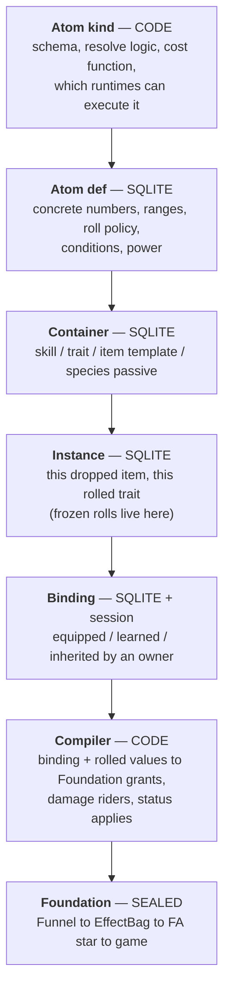

# The ideal — atom effects, containers, and power as a currency

**Status:** **Ideal capture (2026-08-22)** — a vision document, not a spec. **Superseded in three places by later work** — see the correction note at the end of §13; where this document and [effect-atom/definitions.md](effect-atom/definitions.md) disagree, **the definitions win.** No module ids, no build order, no acceptance criteria, nothing committed. It exists to be argued with, edited, and cut down before anything becomes a capability map. Grounding: the sealed Foundation set ([effect-system.md](effect-system.md), [effect-data.md](effect-data.md), [effect-runtime.md](effect-runtime.md), [effect-funnel.md](effect-funnel.md)) and the code audit in §2. Prior art in §12.

**Owner picks (2026-08-22):**

- **The atom effect is the smallest unit.** `+10 hp`. `5% on death, spawn 2 zombies with 500 hp / 100 atk`. `add 100–200 fire damage on hit`. Skills, traits, and items are **containers**; the effect system manages **how effects are defined and resolved**.
- **Ranges resolve at apply.** `100–200 fire damage` is not a number until the hit happens.
- **Fully data-driven SQLite.** Code owns the **logic**; SQLite owns the **values of concrete effects and their power**.
- **Power appears everywhere** — authoring budget, mechanical input, and display. It is the road to unique-actor power: an actor's power comes from its stats and items, and those come from atom power.
- **Power shape: a vector of category scores plus a derived scalar.** Not one added-up number.
- **Power storage: computed base + stored override**, with the gap between them asserted.
- **AI is not ours.** Atoms cover **definition and resolve**. Targeting, retreat, and decision-making need an AI layer spec, and this game has no AI layer yet.
- **Define ourselves first, then write the track.** Items, traits, statuses, and skills adopt the atom contract when *they* write real specs. We do not design their features for them.
- **Refactor whatever depends on us.** The power math itself is deliberately **not decided** in this document (§8.6).

**Owner picks — schema round (2026-08-22):**

- **Atoms carry a tier.** Rows are `(family_id, tier)` with that tier's range. **Tier is how strong; rarity is how many and which tiers are allowed** — two axes, never conflated. Loot and capture rarity fall out of tier + pool weights, with no third mechanism.
- **`scale` is a named curve reference.** A value spec points at a row in a curve table; scaling is data, never a formula string.
- **Conditions are a typed predicate tree** — AND/OR/NOT over a **closed** leaf list, with a hard depth limit, validation that rejects unknown leaves instead of ignoring them, and no power-pricing recursion past that depth.
- **Containers are a fixed core plus an optional weighted pool.** Traits, skills, and species passives use the core alone; item templates roll from the pool.

**Owner picks — power and plumbing round (2026-08-22):**

- **The server compiles and pushes compiled output.** The injector never holds content rows; this extends today's `effects.grants.apply` push. Per-hit rolls stay local because they are per-hit.
- **The contribution seam is declared, its shape deferred.** Damage atoms produce contributions and never apply; the applier spec owns the record's fields.
- **The display scalar is a geometric mean** over the category vector. The vector stays SSOT.
- **Coefficients are hand-authored now, fitted later.** A sweep harness follows and reports drift against the authored table.
- **Multiplicative pairs are priced by a marginal read**, not a smarter formula: stored atom power stays context-free for budgets and display; AI and the balance sweep read `vector(with) − vector(without)`, which captures interaction by construction (§13).
- **The per-hit path takes no dictionaries, no string comparison, and no recursion** — measured 2026-08-22 (§13). Content compiles at load; the exact encoding is a build-time benchmark.
- Defaults taken without objection: the **budget curve reads `effect_curve`** like any other scaled value, so "level or rarity" is a data choice; **generation is pool + tier weights**, with the budget as a **validation** check rather than a generation mechanism; **spawn-atom power recursion is depth 1, memoized**.

---

## 1. The premise

Today an "effect" means four unrelated things depending on which file you open. The ideal is that it means exactly one thing, everywhere:

> An **atom** is one indivisible statement of *what happens*, with its numbers and its conditions attached, and a **power** price tag. Everything a player can own, learn, equip, or inherit is a **container** of atoms. Nothing in the game hand-codes an effect ever again.

The owner's three examples, decomposed:

| Plain words | Atom kind | When | Params | Value shape |
|---|---|---|---|---|
| `+10 hp` | `stat.modify` | while bound | `channel=maxHp, op=flat` | `10` — fixed |
| `5% on death spawn 2 zombies (500 hp, 100 atk)` | `spawn.entity` | `OnDeath`, chance 50‰ | `side=zombie, typeId=0, count=2` | `hp=500, atk=100` — fixed |
| `100% add 100–200 fire damage on hit` | `damage.rider` | `OnHitDealt`, chance 1000‰ | `element=fire` | `amount={100,200}` — **rolled on apply** |

Three different shapes, one row format. That is the whole claim.

---

## 2. Why now — what the code actually looks like

Verified 2026-08-22, in `src/`:

**Foundation is finished and does not move.** `EffectBag` plans FA1–FA10 from FT1–FT4; `EffectFunnel` is the sole Secondary→Bag path; FA10 is Writer-Add-only; three guard scripts hold the law. `FoundationContractVersion = 2`. **This document adds nothing to that layer and removes nothing from it.**

**Secondary is close to empty.** Three stub plugins (butter-on-hit, +10 flat ATK, patron marker), 16 hardcoded defs in `EffectSeedCatalog`, and a three-item equipment stub where one item points at a placeholder effect id.

**There is no effect data layer at all.** The `foundation_effect_*` tables in [effect-data.md](effect-data.md) are *logical* — none of the 38 real SQLite tables is one of them. Defs are C# literals. Grants live in RAM plus a JSON blob inside `rpg_unique_stat_mods.mods_json`.

**Four parallel content systems already exist, sharing no vocabulary:**

| System | Where | Size | Reaches Foundation | Shape |
|---|---|---|---|---|
| Effect defs | `EffectSeedCatalog` (C#) | 16 | yes, FA* | def + trigger + action |
| Statuses | `StatusCatalog` (C#, ADR-locked code-first) | 21 | yes, FA2/FA10 | def + grant overlay |
| Battle traits | `TraitBattleCatalog` (C#) | 13 | **no** | **15 hand-coded facet fields** |
| Items | `UniqueEquipmentCatalog` (C#) | 3 stubs | via grant template | `item_id → grant` |

Skills are unstarted and would become a fifth. Every new content kind currently buys its own catalog, its own fields, its own tests. **That is the cost this document exists to stop.**

**Power does not exist.** `combat.power.*` is a damage-side ‰ multiplier; `progression.power` is a hardcoded `1.0` stub; a star is `+30‰`. Nothing computes a rating. Clean slate.

---

## 3. The layer model



**The atom layer is a compiler, not an applier.** It never touches Unity, never writes a stat, never calls a status method. It produces the same `EffectGrant` / `RpgEffectEvent` shapes the Funnel already accepts. The hard law of [effect-system.md](effect-system.md) survives untouched — this layer *is* Secondary, just finally with a spine.

That is the whole reason this can be built without disturbing a sealed layer.

### Who owns what

| Layer | Owns | Must not own |
|---|---|---|
| **Atom kind** (code) | Param schema, validation, resolve semantics, cost function, runtime support matrix | Any magnitude, any content id |
| **Atom def** (data) | Numbers, ranges, roll policy, trigger/stage, chance, ICD, tags, power | Logic, code paths, Unity anything |
| **Container** (data) | Which atoms, in what order, with what overrides; slot and rarity rules | Its own effect semantics |
| **Instance** (data) | Frozen rolls, roll seed, power at roll time | Live combat state |
| **Binding** (data + session) | Who has it, since when, in which slot | Magnitudes |
| **Compiler** (code) | Binding → Foundation grant / rider / status apply | Applying anything itself |

---

## 4. The four roll moments

Every ARPG separates these; our schema must too. The owner's picks touch moments 2 and 4.

| # | Moment | Example | Where it lands | Prior art |
|---|---|---|---|---|
| 1 | **Authoring** | "this affix adds fire damage, tier 3 range" | `effect_atom` row | PoE mod tiers, D4 affix table |
| 2 | **Instantiation** | an item drops → `+7 atk`, frozen forever | `effect_instance_atom` | D2/D4/PoE roll at drop; Last Epoch tier + roll inside tier |
| 3 | **Bind / equip** | equipped → a grant enters the bag | `effect_binding` → Funnel | GAS spec creation, optionally snapshotting |
| 4 | **Apply** | this hit rolls 143 of the 100–200 | nothing persisted; RNG stream | PoE / D2 roll the damage range **per hit** |

**Every numeric value carries a roll policy.** One enum, three values:

```text
fixed             — the number is the number
rollOnInstantiate — rolled once when the instance is created, then frozen (moment 2)
rollOnApply       — rolled every time the atom resolves (moment 4)
```

GAS made exactly this distinction a per-value flag — snapshotted attributes captured at spec creation, non-snapshotted captured at apply — and it is the cleanest available answer. A value spec is therefore `{ min, max, roll }`, and `fixed` is just `min == max`.

**Determinism:** `rollOnInstantiate` draws from a named seed stored on the instance, so a re-read reproduces the item exactly. `rollOnApply` draws from the resolver's per-system stream — the battle engine already runs named streams (`initiative`, `damage`, `crit`, `essence`, `status`); `atom.apply` joins that list. Neither may call an ambient RNG.

---

## 5. Atom kinds — the vocabulary

An atom kind declares an **attach point**: the seam in the machine where its resolve hooks in. The attach point, not the kind name, is what makes the vocabulary finite and auditable.

| Attach point | What it does | Existing seam today | Example kinds |
|---|---|---|---|
| **Stat** | changes a composed channel while bound | ModifierBag → `EntityApply` → Writer | `stat.modify` (flat / increased / more), `stat.derived` (catalog channels) |
| **Damage** | a *triggered payload*, not its own seam — see §5.1 | trigger → resource delta → FA10 → Writer Add, **shipped** | expressed as `on.hit` + `resource.delta` with an element payload |
| **Trigger** | fires a payload on an event | FT1–FT4 + lifecycle | `on.death`, `on.hit`, `on.spawn` wrapping any payload kind |
| **Board** | mutates the lawn | FA4–FA9 via PvzIntent | `spawn.entity`, `board.action`, `grid.item`, `box.type`, `economy` |
| **Status** | applies or clears a status instance | StatusRuntime + StatusExecutor | `status.apply`, `status.clear`, `status.spread` |
| **Resource** | instant current-HP delta | FA10 Writer Add | `resource.delta` |

Every kind declares which **runtimes** can execute it: `lawn` (injector), `battle` (web engine), `world` (later). A container bound in a runtime that cannot execute one of its atoms is a **validation error at bind time**, not a silent no-op. That single rule is what stops the trait catalog from being reinvented.

### 5.1 Dealing damage is a triggered payload — merging sources is someone else's layer

`add 100–200 fire damage on hit` needs **no new attach point**. It is a trigger plus a payload: `OnDamageDealt` fires, a resource-delta atom rolls its range, and the amount travels the shipped path — Funnel → FA10 → Writer Add, with the element payload the calculator already accepts. Foundation does this today.

What does **not** exist is a layer that takes many damage sources aimed at one hit — the vanilla hit itself, riders, statuses, shields, future skills — and decides how they **merge, order, and mitigate**. On the lawn there is no such gameplay layer at all: vanilla peas and bites run Unity `TakeDamage` and are observed only, while `DamageApplyPipeline` is reached from battle, sim, debug, and tests. That layer is undesigned by decision.

**Neither fact blocks an atom.** A single atom dealing damage works now. What waits on that layer is *combining* atoms into one coherent hit. The boundary we hold either way is the same one as with AI: we own **definition and resolve**; a neighbour owns **merge and apply**, writes its own spec, and inherits our contract.

What we owe that layer, in advance:

- A **contribution** is a resolved value plus its provenance. Its exact fields are **deliberately not fixed here** — the applier spec owns them. What is fixed: the value arrives already rolled and already attributed.
- Atoms **never** order, mitigate, or merge. Those are the applier's rules.
- One contribution shape serves every source, so the applier never learns where a number came from.

### 5.2 Runtime consumers — what actually exists

Audited 2026-08-22. A kind can only claim a runtime where a **consumer** exists. The honest picture:

| Attach point | Lawn (injector) | Battle (web engine) | Sim / offline |
|---|---|---|---|
| **Stat** | FA1 → ModifierBag → `EntityApply` → Writer — shipped, LIVE L1–L14 | `BattleStatComposer` at setup only; the bag sink **ignores** FA1 | plan only |
| **Damage** | **none** (§5.1) | inlined in the `BattleEngine` attack loop, hardcoded per trait | n/a |
| **Trigger** (FT*) | `EffectBag.OnEvent` from capture — shipped | **none — the engine never calls `OnEvent`** | `OnEvent` via harness / scenarios |
| **Board** | FA4–FA9 → PvzIntent — LIVE-proven | inert | recorded plan |
| **Status** | `StatusExecutor` + `StatusRuntime` — shipped | `StatusRuntime` is mounted, but entered only through scripted `InitialStatuses` — not through FA2 | plan only |
| **Resource delta** | FA10 → Writer Add — shipped | `BattleEffectSink` — **the only opcode battle consumes** | plan only |

`InjectorEffectActionSink` implements all ten opcodes. `BattleEffectSink` states it outright: *"battle mode consumes FA10 only; other actions are inert here."*

**Consequences for the spec, and they are not small:**

1. **"One vocabulary, many backends" is aspirational for battle**, not a description. Battle consumes one of six attach points and fires zero triggers.
2. The **bind-time validation error will fire constantly** at wave 1. That is correct behaviour — loud and honest beats silent no-ops — but it means wave 1 must not promise battle support it cannot deliver.
3. The runtime support matrix is a **living, audited table**, not a design assertion. It grows when a runtime grows a consumer, and it is the thing to re-read before promising any content works anywhere.

### What is explicitly NOT an atom

Targeting choice, retreat, threat, ordering, and any other decision an actor *makes* are **not effects**. They are an AI layer that does not exist yet and needs its own spec. Three of today's traits (`coward`, `bloodthirsty`, `loyal`) are that layer wearing an effect costume, and two more (`greedy`, `genius`) are reward math.

The contract we offer that layer, in advance:

- AI reads **atom-declared tags** on an actor to make decisions; it never reads atom internals.
- An AI behavior is referenced from a container **by id**, alongside atoms, never instead of the atom schema.
- Reward and report multipliers get their own attach point when a rewards spec asks for one — not smuggled in as a combat atom.
- We expose the **power vector** and the **matchup-conditioned read** (§8.7); the AI layer owns normalization, response curves, and weights. It never reads the display scalar.

---

## 6. Containers

A container is a named, ordered bundle of atom references with optional overrides.

| Container kind | Bound to | Notes |
|---|---|---|
| `item` | an actor slot | template → instance with rolled values; the direct road to item power |
| `trait` | a specimen | rolled at summon from a pool, as today |
| `skill` | a specimen | unstarted; needs activation and cooldown, which the turn kernel owns, not us |
| `species-passive` | every specimen of a species | always-on container |
| `patron` / `world-buff` | a match or a player | already exists as a marker grant |

**Atoms are a shared library; containers reference them.** A container may override any value spec of an atom it references (tighten a range, change a chance) — an override is itself a value spec, so it obeys the same roll policy rules. That is what makes "the same affix at five tiers" one atom and five overrides rather than five atoms.

**An instance freezes the rolls.** A dropped item is `effect_instance` plus one `effect_instance_atom` per atom, with `rollOnInstantiate` values resolved and stamped, and the power computed at that moment.

---

## 7. Data architecture

Six tables. Kind logic stays in code, so there is no `effect_kind` table — the kind id is a validated reference into the code registry, exactly the way `statusId` works today.

### `effect_atom` — the library

| Column | Type | Notes |
|---|---|---|
| `atom_id` | TEXT PK | stable kebab id (`atom.fire-rider.t3`) |
| `kind_id` | TEXT | validated against the code registry |
| `family_id` | TEXT | groups the tiers of one affix (`atom.fire-rider`) |
| `tier` | INT | strength band within the family; `1` when a family has one tier |
| `name` | TEXT | display |
| `when_json` | TEXT | trigger or damage stage, `chance` (‰), `icd_ms`, and the **predicate tree** |
| `params_json` | TEXT | kind-schema-validated; numeric leaves are **value specs** |
| `tags_json` | TEXT | element, family, category — for AI, UI, and cost lookup |
| `power_json` | TEXT | computed category vector (§8), refreshed by tooling |
| `power_override_json` | TEXT | designer override, nullable |
| `power_note` | TEXT | required when an override is set |
| `enabled`, `revision` | INT | catalog push / cache bust |

A **value spec** is `{ "min": n, "max": n, "roll": "fixed|onInstantiate|onApply", "scale": "curve.id?" }`. Anywhere a number could go, a value spec can go. `scale` names a row in `effect_curve`; omitted means no scaling.

### `effect_curve` — scaling as data

One table serves every scaled value, so scaling is never a formula in a string.

| Column | Type | Notes |
|---|---|---|
| `curve_id` | TEXT PK | `curve.atk.level`, `curve.rarity.band` |
| `input` | TEXT | what the curve reads — `level`, `rarity`, `tier` |
| `points_json` | TEXT | ordered `(x, multiplierMilli)` points; integer ‰, interpolated between points |
| `revision` | INT | joins the content hash |

The same table gives the power cost function its **reference scale** (§8.4), so a value and its price read one source.

### `effect_container_pool` — the rolled half of a container

| Column | Type | Notes |
|---|---|---|
| `container_id` | TEXT FK | |
| `atom_id` | TEXT FK | a candidate, usually one tier of a family |
| `weight` | INT | spawn weight; `0` excludes |
| `group` | TEXT | optional — roll at most one atom per family/group |

`effect_container` gains `pool_rolls` (how many to draw) and `pool_seed_scope`. A container with no pool rows is a plain fixed list, which is what traits, skills, and species passives use.

### `effect_container` and `effect_container_atom`

| `effect_container` | Notes | | `effect_container_atom` | Notes |
|---|---|---|---|---|
| `container_id` TEXT PK | | | `container_id` TEXT FK | |
| `container_kind` TEXT | item / trait / skill / passive | | `seq` INT | resolve order |
| `slot`, `rarity`, `level_req` | authoring rules | | `atom_id` TEXT FK | |
| `tags_json`, `enabled`, `revision` | | | `overrides_json` TEXT | value-spec overrides |

### `effect_instance` and `effect_instance_atom`

| `effect_instance` | Notes | | `effect_instance_atom` | Notes |
|---|---|---|---|---|
| `instance_id` TEXT PK | | | `instance_id` TEXT FK | |
| `container_id` TEXT FK | | | `atom_id` TEXT FK | |
| `roll_seed` INT | replay the drop | | `values_json` TEXT | **frozen** moment-2 rolls |
| `created_utc`, `origin` | drop / craft / grant | | `power_json` TEXT | power at roll time |

### `effect_binding`

Replaces the logical `foundation_effect_grant` and absorbs today's `mods_json` grant blobs.

| Column | Notes |
|---|---|
| `binding_id` TEXT PK | |
| `instance_id` TEXT FK | |
| `owner_kind` / `owner_key` | `match` / `plant:N` / `zombie:N` / `entity:HEX` / `player` — the existing vocabulary, unchanged |
| `slot` | for items |
| `source` | plugin or feature id, for withdraw |
| `bound_utc`, `revision` | |

Runtime state — ICD clocks, stacks, status instances — stays exactly where it is: session RAM, per [status-ssot.md](status-ssot.md). **No new durable runtime table.**

### Determinism and content versioning

Content becoming data means goldens now depend on a content revision. The ideal:

- A **content hash** over the atom / container / instance-template tables is computed at load and stamped into the report alongside `engineVersion`, `rngAlgoVersion`, `rulesetVersion`, `seed`.
- Changing a number changes the hash, which is a **visible** golden re-bless, not a silent drift.
- SQL stays inside `FusionRpg.Data` (`guard-dal.ps1`). Core resolvers stay pure integer functions over loaded content.

---

## 8. Power — the currency

### 8.1 What it is

Power is a **price**: what an atom costs, in a unit comparable across every kind of effect. From that one price everything else derives — item power is the sum over an item's atoms, actor power is a function over the actor's stats and bound items, and an authoring budget is a ceiling on that sum.

### 8.2 A vector, not a number

Each atom contributes to a small fixed set of categories:

```text
offense · survivability · control · utility · economy
```

Diablo 3 needed three separate aggregates (Damage / Toughness / Recovery) for exactly this reason, and its sheet numbers are still famously wrong because they omit multiplicative sources. Adding a `+crit rate` atom to a `+crit damage` atom underprices both; adding an offense atom to a defense atom compares things that do not compare.

The **scalar** shown to a player is a **geometric mean over the categories**. A near-zero category drags the product down, which is the honest statement that zero survivability makes offense worthless — and it degrades gracefully as categories are added later. The vector stays SSOT; the scalar is a derived read, never stored as truth.

### 8.3 Computed base plus stored override

The cost function gives a number; a designer may override it, and must say why. A test recomputes every atom's power and fails when an override drifts beyond tolerance without a note. This is the escape hatch for effects the formula misprices — and a running list of which shapes the formula is bad at.

### 8.4 Shape of the cost function

```text
power[category] = coeff(kind, channel, category)
                × normalize(magnitude, referenceScale)
                × conditionality
```

- **`coeff`** is a per-kind, per-channel table — the same idea as the stat-cost multipliers in WoW's stat budget, where combat ratings and primary stats cost 1.0 and Stamina costs 2/3.
- **`normalize`** solves the `+10 atk` problem. A flat value is priced against the **baseline stat at a reference level**, not in raw points; our level curves (`BaseAtk = 12 + 4L`) already provide that reference. Power is denominated in budget points, and the budget itself grows with level. WoW's curve is `B(x) = a · 1.15^(x/15)` — +15% every 15 levels. Ours would be our own curve, but the same shape of idea.
- **`conditionality`** discounts the uncertain: `chance × triggerFrequency × icdFactor × targetCountFactor`. A 5% on-death spawn is worth a fraction of the same spawn unconditionally. For a `rollOnApply` range the priced magnitude is the mean of the range — with a note that variance itself has value, which the formula ignores by design.

### 8.5 Where power gets consumed

| Consumer | Use | Status today |
|---|---|---|
| Authoring | rarity R may spend ≤ N power; content test fails over budget | Last Epoch's forging potential is the same shape |
| Item generation | roll affixes until the budget is spent | D4 runs it **backwards** — item power picks the affix range band |
| Actor power | specimen power from stats plus bound items | the audit's missing number |
| Difficulty and rewards | node danger, encounter scaling, "harder pays more" | audit F-C2 / F-C3 — the gap this closes |
| UI | roster sorting, comparison, gear score | weighted by slot, as WoW does |

The two directions in that table are a real fork and both are legitimate: **value → power** (WoW: derive the score from what rolled) or **power → value** (D4: the band picks what may roll). They can coexist — derive for scoring, band for generation — but only if the coefficient table is the single source both read.

### 8.6 Decided, and the one thing still open

**Decided 2026-08-22:** the scalar is a **geometric mean** (§8.2) · coefficients are **hand-authored now, fitted later**, with a sweep harness that reports drift rather than silently rewriting the table · the **budget curve is a row in `effect_curve`**, so whether level or rarity drives it is data, not schema · **generation is pool + tier weights**, and the budget is a **validation** check that fails content over its ceiling, not a generation mechanism.

**Still open — one item, and it is the hard one:**

> How do multiplicative pairs get priced without pretending they add? Crit rate × crit damage, the element matchup ring, and shield layers all multiply. A per-atom cost function prices each in isolation and will therefore underprice both halves of any pair.

Three candidate answers, none chosen: price pairs by **tagging interactions** and applying a joint coefficient when both tags are present on one actor; price at the **actor** level by evaluating the vector twice (with and without the atom) and taking the difference, which captures interaction by construction; or accept the error at atom level and let the **sweep** correct it via the override column. The third is the cheapest and matches the coefficient decision above.

This does not block the spec. It blocks trusting the number for balance.

### 8.7 Power for AI — the reader that actually needs it

**A human barely needs power.** A player compares two items by reading them. The reader that genuinely cannot function without a number is the **AI**: it has to pick a target, decide whether to commit or retreat, choose what to summon, and price a trade — all in code, all now. Game AI research is therefore the honest source for what shape this value takes, and its answer is consistent: **almost never one number.**

| Shape | What it is | Who uses it | Our analogue |
|---|---|---|---|
| **Weighted feature vector** | value = Σ (feature × weight); the standard static evaluation | chess engines — material, mobility, king safety | §8.2 category vector |
| **Position matrix** | value depends on *where* the piece is (piece-square tables, one set per game phase) | chess; material + PSQT alone is already a ~2000–2200 Elo engine | lawn row/column, world sector |
| **Matchup matrix** | value depends on *against whom*; damage-per-frame and counter matrices, learned from replays | RTS army composition, hard counters | **we already have one** — the element ring ±250‰ and light↔dark |
| **Influence map** | a spatial grid of summed threat, layered and decayed; strategic maps refresh 0.5–1 Hz, tactical 2–5 Hz | RTS attack/defend/kite decisions | the 5-lane board; later, world sectors |
| **Search tree** | no static value at all — simulate and back up the result | MCTS in card games, where hand-crafted evaluation is inadequate | our deterministic battle engine, used as evaluator |

The lesson is not "pick one." It is that **the same underlying price is read through different projections**, and the projection is chosen by the question being asked.

**How the numbers get defined.** Three methods, all in use:

1. **Hand-authored weights** — fastest, and where every system starts.
2. **Regression from outcomes** — chess piece values have been derived by regression analysis; Hearthstone card cost models as a linear model over attributes plus an intrinsic constant, where an ability is priced as a function of the stat it multiplies (charge on a 2-attack minion costs `2 × charge`).
3. **Fitted from recorded battles** — the StarCraft Lanchester work learned per-unit strength values by **maximum likelihood estimation from past battles**, and beat simulation-based prediction while being faster than it.

Method 3 is the one worth noting: **we can generate that data**. The battle engine is deterministic and seeded, so a sweep produces as many recorded battles as we want. Fitting coefficients rather than arguing about them is available to us in a way it is not to most projects.

**The proc / summon question is recursion, and it resolves cleanly.** "5% on death, spawn 2 zombies with 500 hp / 100 atk" is worth `0.05 × 2 × power(that actor)`. The atom's price therefore calls the *actor* power function, which sums *atom* prices. That is mutually recursive by construction — the same shape as a card-game cost model pricing a summon by the body it makes. It needs exactly two rules: a **depth guard** (a spawned actor's own spawn atoms are priced at depth 1 and then truncated) and **memoized** actor power, or a chain of summoners prices forever.

**AI does not consume raw power.** Utility AI clamps every consideration to `[0,1]` and multiplies them, which is what keeps a decision score bounded no matter how many considerations are added. So power reaches a decision as a *normalized, curved* consideration — never as a raw magnitude. Our contract to the future AI layer is therefore: **we expose the vector and the matchup-conditioned read; the AI layer owns normalization, curves, and weights.** It never sees the display scalar.

**The cautionary reference is Pokémon GO.** `CP = (Atk × √Def × √Sta × CPM²) / 10` is a real, shipped, geometric-shaped scalar with a level multiplier — close to what §8.2's derived scalar would look like. It is also documented as misleading: attack is weighted more heavily because it is not under a square root, so high-CP specimens are often the wrong ones for actual combat, and CP is not comparable across species at all. Worth copying the shape; worth refusing the claim that the scalar means anything precise.

**Net design consequence:** one price, three read shapes.

```text
power vector       — the SSOT, stored per atom / item / actor      (§8.2)
matchup-conditioned — vector × element matrix, computed on demand   (AI, difficulty)
display scalar      — combination function over the vector          (humans, sorting)
```

The matchup read is the one that would be impossible to retrofit onto a stored scalar, and it is the one the AI will want first — "how strong is this actor **against that one**" is a different question from "how strong is this actor", and our element ring already makes the answer differ by ±250‰.

---

## 9. What "easy to extend" has to mean

The test of this design is the cost of one new effect. Target:

| Change | Cost |
|---|---|
| New concrete effect using an existing kind | **one row.** No build, no code, power derived automatically |
| New container (item, trait, skill) | rows only |
| New atom **kind** | code: schema, resolve, cost coefficients, runtime support, tests. A reviewed change, not an ADR |
| New Foundation primitive (FA11) | ADR, as today. Should be rare — that is the point of a rich kind layer above a small opcode set |
| New attach point | ADR — this is the seam list, and it is meant to stay short |

If adding a normal effect ever costs more than a row, the design has failed and should be said to have failed.

---

## 10. The track for the dependents

Audited 2026-08-22. Each of these adopts the contract when **its own** spec is written; we do not write their features here.

**Live tracker:** [effect-adoption-audit-2026-08-22.md](effect-adoption-audit-2026-08-22.md) — all 11 sites that own effect-shaped logic, what "follows the effect SSOT" means, and a per-stream status table each stream updates itself. The summary below is the short version.

| Dependent | Reality now | Track |
|---|---|---|
| **Effect defs** (16) | `EffectSeedCatalog` C# literals; consumed by harness, sim, injector, cheat runner, VFX catalog, 4 test files, **19 JSON fixtures** | First migration and the cheapest. The fixtures are already the data format. Proves the schema against effects Foundation executes today |
| **Items** (3) | Genuinely a stub: `rpg_unique_equipment(instance_id, slot, item_id)` — no item entity, no rolled values, no rarity, no power. One item points at a placeholder effect id | Greenfield. When an item spec lands it gets containers, instances, rolled values, and item power for free. **Do not build an item system here** |
| **Battle traits** (13) | Not a stub in wiring: read by `BattleEngine`, `BattleStatComposer`, `ExpeditionResolver`; locked by adoption tests, regression-lock tests, and content-hashed goldens. But 15 hand-coded facet fields, all passive | Split at migration: the 7 funnel-routed traits become containers of atoms; the 6 engine behaviors wait for the AI and rewards layers. Touches `RulesetVersion` and needs a golden re-bless — plan it as its own wave |
| **Statuses** (21) | Deeply wired; ADR-locked code-first | Status *kind* logic stays code — consistent with this design, since kinds are code everywhere. Only magnitudes would move, and only if a status spec asks. The lock does not need revisiting to start |
| **Skills** (0) | Unstarted (battle-enrichment wave E2) | Containers from day one. Activation and cooldown belong to the turn kernel ([battle-turn-ideal.md](battle-turn-ideal.md)), not to us |
| **Damage consumer / applier** (none) | Not designed yet, by decision. No gameplay applier exists for the lawn — vanilla hits are observed only, and the pipeline in `Core/Combat` is reached from battle, sim, debug, and tests, never from lawn gameplay | §5.1 contract, offered in advance: atoms emit resolved contributions; that layer owns merge, order, mitigation, and apply |
| **AI** (none) | Does not exist | §5 contract, offered in advance |

---

## 11. What this refuses

| Refused | Why |
|---|---|
| Touching the Foundation contract | It is sealed and it works. Atoms compile *into* it |
| A Secondary-to-Unity shortcut "just for atoms" | Same hard law as today |
| A runtime YAML or mod loader | Data means our SQLite with a content hash, not arbitrary external content |
| A single added-up power scalar as SSOT | Diablo 3's sheet-DPS problem, adopted on purpose |
| Designing the item, skill, or AI systems here | They write their own specs and inherit this contract |
| Power that ignores level scale | `+10 atk` is not one price at level 1 and level 50 |
| A background job to recompute power | Same lazy-resolution law as the rest of the server: compute on read or on write, never on a schedule |
| Silent content drift | Content hash in the report stamp, or goldens become fiction |

---

## 12. Prior art

| Source | What we take | What we refuse |
|---|---|---|
| **GAS** (Unreal) | Atom = effect, container = ability; modifiers vs executions; **snapshot-at-creation vs at-apply as a per-value flag** | Its tag machinery and replication model |
| **PoE** | Mod tiers as ranges; tags plus spawn weights for generation; damage rolled per hit | Its refusal of any power score — we need one |
| **Diablo 4** | Item power bands select affix ranges (power as an *input*) | Breakpoint cliffs as a player-facing mechanic |
| **Diablo 2 / 3** | Min–max damage rolled per hit; Toughness as honest effective HP (`DR = armor / (armor + 3500)`) | Sheet DPS — a scalar that omits multiplicative sources |
| **WoW** | Stat budget `B(x) = a · 1.15^(x/15)`; per-stat cost multipliers; gear score as a slot-weighted sum | Item-level inflation and squishes |
| **Last Epoch** | Forging potential — a per-item spend budget; tier plus range within tier | Crafting durability RNG as a player-facing cost |
| **Chess engines** | Evaluation as a weighted linear combination of features; piece-square tables as a *positional* value matrix; piece values by regression | Its search — we are not searching a game tree |
| **RTS AI** (StarCraft, Lanchester) | Per-unit strength **fitted from recorded battles** by maximum likelihood; counter and damage-per-frame matrices learned from replays; influence maps as spatial threat | Real-time army micro-management |
| **Utility AI** (IAUS) | Considerations clamped to `[0,1]` and multiplied, so decisions stay bounded as considerations are added | Owning the decision layer ourselves — that is the AI spec's job |
| **Pokémon GO** | `CP = (Atk × √Def × √Sta × CPM²) / 10` — the shape of a geometric scalar with a level multiplier | Its documented flaws: attack overweighted, meaningless across species |

---

## 13. Open questions for the next round

**Resolved 2026-08-22 — schema round:** atom tiers → `(family_id, tier)` column · `scale` → `effect_curve` reference · conditions → typed predicate tree over a closed leaf list · containers → fixed core plus optional weighted pool.

**Resolved 2026-08-22 — power and plumbing round:** compiler → server compiles, pushes compiled output · contribution → seam declared, shape deferred to the applier spec · scalar → geometric mean over the category vector · coefficients → hand-authored now, fitted later · budget curve → a row in `effect_curve` · generation → pool + tier weights, budget as validation · spawn power recursion → depth 1, memoized.

**Defaults written unless a stream objects:** stacking sums, with a `unique` flag meaning highest-wins · `mods_json` absolutes stay where they are, only grants move to `effect_binding` · the content hash covers atom, container, container_atom, and curve rows, never instances · the report stamps the power that was used, never a power recomputed later · wave 1 is lawn-only · authoring starts as seed and migration files, with an editor only if a spec asks for one.

**Still open — nothing that blocks the spec.**

**Pricing multiplicative pairs — resolved by adding a read, not a formula (2026-08-22).** Crit rate × crit damage, the element ring, and shield layers all multiply, so a per-atom cost function prices each half in isolation and underprices both. The resolution follows from §8.7's "one price, several read shapes" — add a fourth:

```text
marginal power = vector(actor WITH the atom) − vector(actor WITHOUT it)
```

The difference captures whatever multiplies, by construction. **Stored atom power stays context-free** and keeps serving authoring budgets, sorting, and display, where being approximately right is fine. **AI and the balance sweep read marginal power**, where being exactly right matters. It costs close to nothing extra because actor power is memoized and the AI layer already evaluates actor power to make decisions. The sweep's job becomes reporting the gap between the two reads — which is also the list of shapes the cost function is bad at.

### Runtime form — measured 2026-08-22

A micro-benchmark of three representations doing identical work (a 3-leaf predicate tree, a chance gate, and an on-apply range roll), 6 atoms × 200 000 hits:

| Representation | ns/atom | Verdict |
|---|---|---|
| `Dictionary<string,object>` + nested-dict tree | **179.4** | out — 25× the cost of a typed graph, and against the probe plan's own "no dictionaries or strings on the record path" |
| Typed object graph, virtual dispatch | **7.0** | fastest as measured |
| Int opcode span, recursive walker | **47.2** | lost — recursion and span bounds checks defeat the flat layout |

**What this settles:** no dictionaries, no string comparison, and **no recursion** in the per-hit path. Content is compiled at load into a typed form; the predicate tree is evaluated without recursive descent.

**What it does not settle:** the exact compiled encoding. The benchmark used six identical trees, which is unrealistically kind to branch prediction and cache, and the flat encoding tested was a naive recursive interpreter rather than a flattened one. Choosing between a typed graph and a flattened non-recursive encoding is a **build-time benchmark against real content**, not a decision this document should pretend to make.

**Frame cost context:** even the worst form reaches only ~0.54 ms at 500 hits/frame — against a 1.0 ms budget for the *whole* injector. Compiling is a clear win, not a survival requirement, and the predicate-tree pick from the schema round is affordable either way.

### Ready for the spec

Every question raised in this document is now decided, defaulted, or explicitly scoped to a later spec. The capability map can start.


---

## Corrections — what later work overturned in this document

This is a historical capture, so its text is left as written. Three of its conclusions did not survive:

| This document says | Corrected to | Where |
|---|---|---|
| Atom rows are keyed `(family_id, tier)` (§1, §13) | **`(family_id, tier, variant)`** — the 2-tuple forbade the generation rule outright, rejecting 30 of `elemental_power`'s 35 rows | [definitions.md](effect-atom/definitions.md) §1 |
| *"no dictionaries, no string comparison, and **no recursion** in the per-hit path"* (§13) | **no dictionaries, no strings.** Recursion is **not** banned — the 7 ns benchmark winner is a typed object graph whose `AndNode.Evaluate` calls `child.Evaluate`, so a no-recursion law would have disqualified the form the measurement chose. The 47 ns loss is better explained by `ref int pc` plus span bounds checks defeating inlining | [spec-runtime-form-benchmark.md](effect-atom/spec-runtime-form-benchmark.md) |
| *"the proc / summon question is recursion, and it **resolves cleanly**"* via a marginal read (§12) | **It does not resolve.** `actorPower = Σ atom.power` is additive, so `marginal = p(x)` identically — the marginal read returns the same context-free number it was meant to improve on. Multiplicative pricing is open | [definitions.md](effect-atom/definitions.md) §13 **D2** |

Three more defects in the power model were found in the same pass and are recorded as **D1**, **D3**,
and **D4** in that section: the display scalar ranks a strictly better vector lower, a summon prices at
exactly zero, and every passive atom prices at zero.
