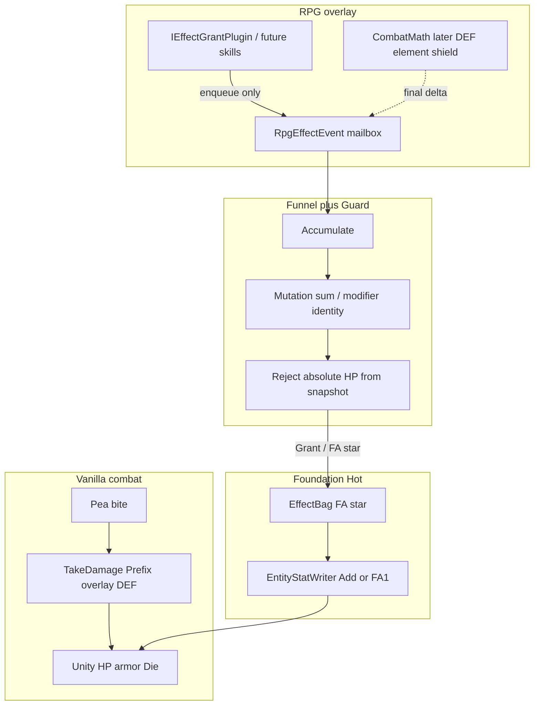

# Effect Funnel + Guard (design lock)

**Status:** Core `EffectFunnel` + injector FA10 Writer Add + `scripts/guard-funnel-delta.ps1` shipped (`FoundationContractVersion = 2`). CombatMath and LIVE prove of enqueue-delta remain later.  
**Parent:** [effect-system.md](effect-system.md). Runtime: [effect-runtime.md](effect-runtime.md). Loops: [overlay-control-loops.md](overlay-control-loops.md). Target/delivery: [combat-damage-ssot.md](combat-damage-ssot.md). ADR: [decisions.md](decisions.md).

A **Funnel** is a command buffer between **Secondary** (RPG content: plugins, future skills) and sealed **Foundation** (`EffectBag` FA*). It is the **sole Secondary→Bag path** — no Grant exception. A **Guard** rejects stale absolute combat writes (`hp=4000` from an overlay snapshot) and keeps Secondary off Unity.

This is the same idea as Unity ECB / EndSimulation, Unreal GAS modifiers vs executions, and PoE “calculate then one apply.”

---

## 1. Why it exists

Secondary plugins enqueue through `EffectFunnel` ([`MatchButterSecondaryPlugin`](../../src/FusionRpg.Core/Effects/Plugins/MatchButterSecondaryPlugin.cs), [`MatchPassiveAtkSecondaryPlugin`](../../src/FusionRpg.Core/Effects/Plugins/MatchPassiveAtkSecondaryPlugin.cs)). **No plugin→Bag.Grant exception.**

Without a Funnel:

| Failure | What happens |
|---|---|
| Stale snapshot HP | Overlay sees zombie HP 5000; Unity already took a hit (4500); RPG sends `SetHp(4000)` after “deal 1000” → **wrong** (should be 3500). |
| 100 Grants ≠ 100 stacks | `ModifierBag.Upsert` is keyed: the same grant+channel **replaces**. 100 crit packets as 100 duplicate Grants do not sum. |
| FA1 used as damage | FA1 `ModifyStat` composes **absolute** `EntityFinal` then Writer `SetHp`. Vanilla hits already use live Unity `TakeDamage`. There is **no** v1 FA opcode for `currentHp -= n`. |
| `preserveHpRatio` | `ReapplyLivingForOwner(preserveHpRatio=true)` remaps current HP by old/new **max** — still not a combat delta. |
| Absolute spawn writes | `UniqueBoundLoadout` `ForceSet*Hp` is Writer-owned absolute ptr write. RPG snapshot HP must not travel the same path. |
| TakeDamage re-entry | FA10 calling Unity `TakeDamage` re-enters Prefix overlay DEF + `combat.hit` → `OnEvent` → more FA10. Future RPG DEF/element/shield on top of that is **double-dip**. |

**Fix:** Secondary never sends `hp=4000`. It enqueues `ResourceDelta { channel: hp, amount: -1000 }` (already a **final** delta). Funnel merges 100 such events into one packet. Injector flush reads **live** Unity HP and Writer **Add**. It does **not** call `TakeDamage`.

---

## 2. Layers (locked)

```text
Secondary  →  Funnel.Enqueue ONLY   (no ctx.Bag.Grant)
Funnel     →  pass-through modifiers | sum mutations | Guard
Foundation EffectBag  →  FA* executors  →  game
```



Two **apply adapters**, one **HP SSOT** (Unity). Do not run vanilla Prefix DEF and RPG CombatMath on the same packet.

**Funnel is not a second EffectBag.** It is the only Secondary entry. Modifier Grants still land in the bag (one Grant per source). Mutations coalesce, then one FA10.

**Present mailbox is GUI only.** `EnqueuePresent` is not an FA opcode and never writes HP. Flush drains presents **after** FA10 and calls `IDamageFxSink.Show` so the injector can draw colored floaters (IMGUI) and an optional world particle burst (`ParticleSystem` + a shader Fusion already shipped). Same `(ptr, tag)` sums; a tagged present suppresses Neutral/Heal for that ptr (order-independent). CombatMath later fills `DamageFxTag` (weak / resist / null / crit / …); until then, each FA10 mutation enqueues a default Neutral or Heal present. FA10 Writer still only Add HP.

| Layer | May | Must not |
|---|---|---|
| **Secondary** | `Funnel.Enqueue(RpgEffectEvent)` (modifier or mutation) | Unity, Writer, `TakeDamage`, `SetHp`, StatusExecutor, `CreateZombie`, **`EffectBag.Grant` / `Withdraw`** |
| **Funnel** | Pass-through modifier Grants; sum mutations; Guard; emit Grant / FA* | Await SignalR / HTTP / SQLite; emit `mode=set` HP; fold distinct `grantId`s into one overlay |
| **Foundation** | Sole apply (`EffectBag` → Writer / Status / Intent; FA10 Writer **Add** + Die if HP≤0) | Accept RPG absolute HP; call `TakeDamage` for overlay deltas |
| **CombatMath** (later) | Compute final signed delta **above** Funnel (DEF / element / shield) | Sit inside Funnel or FA10; re-use TakeDamage Prefix as RPG mitigation |

Multi-target overlay damage (area / random / all) resolves to **N mutation enqueues** (one per ptr) — see [combat-damage-ssot.md](combat-damage-ssot.md). Funnel still sums per `targetKey|ResourceDelta|hp`.

Stub plugins enqueue modifiers via `ctx.Funnel.EnqueueModifier`. Mutations sum to FA10. Nested `Flush` is a no-op; leftover Enqueue from OnDeath is **drained** in the same depth-0 window (Die capture stays on so OnDeath Secondary still runs).

---

## 3. Two families (do not mix)

| Family | RPG example | Funnel job | Foundation output | Apply on live object |
|---|---|---|---|---|
| **Modifier** (persistent) | +50% ATK, stacked passives, butter-on-hit Grant | **Pass-through** (identity). Coalesce only if **same** `grantId`+channel in one window | Existing **FA1 / Triggered Grant** per source | Writer compose as today (derived ATK / maxHP). Not the stale-HP bug. |
| **Mutation / delta** (instant) | 100 crits this tick; “deal 1000” | **Sum** amounts (`mergedCount` kept) | **FA10 `ApplyResourceDelta`** (v2, **hp only**) | Writer **Add** `live + delta` — **never** `SetHp(observed - 1000)`, **never** `TakeDamage` |

Lag / 100-crits-this-tick is **Mutation**. Stale `hp=4000` is **Mutation applied as absolute**. FA1 is the wrong opcode for “deal 1000”.

**Trap:** Funnel must **not** compose Flat→Inc→More across distinct modifier sources. Ten gear pieces of `+10 ATK` stay ten `ModifierBag` keys (`effect:{grantId}`). Folding them into one Grant overlay means unequip cannot withdraw one Xi.

Butter-on-hit stays a **Grant of a Triggered def** that still fires on `OnEvent` (chance / ICD on the bag). It enters via Funnel enqueue, not `ctx.Bag.Grant`.

### Modifier vs mutation on HP

- Changing **max HP** (gear, Passive) → Modifier → FA1 `channel=hp` / `maxHp` → compose → Writer absolute `EntityFinal` **max**. `preserveHpRatio` may remap current HP by max. That is **not** a hit.
- Dealing or healing **current HP** this tick → Mutation → FA10 add-only.

### Current HP vs composed Y

After spawn, **current HP is Unity-owned** (vanilla `TakeDamage` and FA10 Add). Compose writes **max / ATK**. Ratio-remap current only when max changes (`preserveHpRatio` on reapply **and** `cheat.pushScales`). Spawn / absolute / UniqueBound `ForceSet*` still write composed `y.Hp`.

`ForceSet*Hp` on unique spawn stays **spawn-only**, not a combat apply.

---

## 4. Mailbox, accumulate key, merge algebra

### `RpgEffectEvent` (logical)

| Field | Notes |
|---|---|
| `family` | `modifier` \| `mutation` |
| `op` | Modifier: FA1 / Triggered Grant-shaped. Mutation: `ResourceDelta` |
| `channel` | Modifier: stat channels. Mutation: **`hp` only** |
| `targetPtr` / `ownerKey` | Live apply target. Ptrs are flush-time, not snapshot SSOT |
| `amount` | Mutation: signed add (final). Modifier: `flat` / `increased` / `more` on that grant |
| `stackPolicy` | Mutation default `sum`. Modifier default `identity` |
| `source` | `plugin_id`, `effect_id`, **`grant_id` required for modifiers** |

Secondary must not put `absoluteHp`, `setHp`, or `EntityFinal.Hp` on this event.

CombatMath (later) emits mutation `amount` **after** shield/element/RPG DEF. Funnel does not grow a second mitigation stage.

### Accumulate key

```text
Modifier:  (grantId, channel)     // identity; same grant+channel in one window may coalesce
Mutation:  (targetPtr | ownerKey, op, channel, stackPolicy)
```

Do **not** key modifiers as `(ownerKey, channel)` alone — that would merge distinct sources.

### Merge

| Family | Algebra | Telemetry |
|---|---|---|
| Mutation `sum` | `amount = Σ amount_i` | `mergedCount = N` |
| Modifier `identity` | One Grant per `grantId`; optional coalesce only if same `grantId`+channel | `mergedCount` 1 unless same grant repeated |

100 `ResourceDelta { target:Z, channel:hp, amount:-crit }` → one packet `{ amount: -sum, mergedCount: 100 }`.

Opposite-sign mutations on the same key in one window **net** (heal 200 + damage 1000 → `-800`). Both sides are Writer Add, so netting is valid. Document `mergedCount`.

### Caps (runtime Guard)

| Cap | Intent |
|---|---|
| Max mailbox depth | Drop oldest or fail-closed skip (product: skip + log, do not throw) |
| Max `\|amount\|` per flush | Clamp or reject the packet |
| ICD / chance | Still on damage-side **grants** ([effect-runtime.md](effect-runtime.md) default 250ms). Funnel merge does not replace proc policy |

---

## 5. Flush timing (Hot vs ingest)

| Path | What | Funnel? |
|---|---|---|
| **Hot Funnel flush** | End of `EffectBag.OnEvent` and/or Unity frame barrier, **same process** as capture | **Yes** — combat mutations |
| Injector ingest `RpgClient.TryFlush` (256 / 16ms) | Telemetry to Server (`ConcurrentQueue` → HTTP/SignalR) | **No** — cousin idea, **not** the same Channel |
| Server `EventIngest` Channel | SQLite + observe | **No** |

**Ban:** Funnel must not wait on SignalR, HTTP, or SQLite for the roll or apply — same as [overlay-control-loops.md](overlay-control-loops.md) Hot rules.

**Re-entry depth = 0:** do not flush FA10 from inside a nested `OnEvent`. Overlay apply must not emit `combat.hit` that retriggers the same skill. Harmony TakeDamage Prefix **ignores** Writer Add (source tag / in-apply flag).

Cold (equip, loadout push) still hydrates grants **through Funnel**. Funnel does not sit on Server. Combat Funnel lives **next to `EffectBag` in Core**, flushed on the injector game thread.

```text
Unity vanilla hit → Capture → EffectBag.OnEvent (FT*)
  → already-granted Triggered FA* (status, etc.)
  → Secondary mutation enqueue → Funnel mailbox
  → flush barrier (depth 0) → Guard → FA10 Writer Add / FA1 Grant
  → async observe to Server (not a decision gate)
```

Modifier Grants from match-start plugins enqueue at `OnMatchStart` and flush once (or coalesce with later loadout events) — not per hit.

ICD/chance stay on EffectBag grants (Triggered butter). Funnel does not replace proc policy.

---

## 6. Delta apply (5000 / 4500 / 1000)

Illegal Funnel output:

```json
{ "hp": 4000 }
```

computed from an overlay snapshot (5000 observed − 1000 “deal”).

Legal:

```json
{ "op": "ResourceDelta", "channel": "hp", "amount": -1000, "targetPtr": "…" }
```

Injector flush reads **current** Unity HP (4500) and Writer-Adds to 3500. Capture / vanilla `combat.hit` stay observation of **vanilla** hits only.

| Direction | LIVE apply (v2 executor) | Must not |
|---|---|---|
| `amount ≠ 0` (damage or heal) | `EntityStatWriter` **Add** (read live HP, write `live + amount`). If HP ≤ 0 → Writer `ForceKill` / vanilla `Die` | `SetHp(snapshot ± n)`; Unity `TakeDamage`; 100 separate Adds that should have merged |
| Dead / missing ptr | Skip; do not throw | Await Server to “confirm” |

Vanilla combat hits (peas, bites) stay Unity `TakeDamage` + existing Prefix overlay DEF. Funnel FA10 does **not** replace that path and does **not** share it.

### Dual pipeline (locked) — no TakeDamage Bend

| Pipeline | Compute | Apply | Armor / DEF |
|---|---|---|---|
| **Vanilla** | Game + Prefix `StatMath.ScaleIncoming` | Unity `TakeDamage` | Vanilla armor + current overlay DEF on Prefix |
| **Overlay / RPG** | CombatMath later (element / shield / RPG DEF) **above** Funnel; Funnel only sums | FA10 Writer Add + Die | RPG layers only. **Not** vanilla armor, **not** Prefix DEF |

Dropped: “one merged `TakeDamage(sum)` so vanilla armor runs once.” That Bend mixed the two pipelines and would double-mitigate when CombatMath lands (PoE double-dip; GAS Execution vs calling the same hit hook).

GAS analogue: FA1 = modifiers (stats). FA10 = execution output to Health. Shield/element belong in CombatMath / AttributeSet **before** the delta reaches Funnel, not in the Writer.

---

## 7. Foundation contract gap — FA10 (v2)

FA1–FA9 lawn proofs (L1–L14) stay valid. `FoundationContractVersion.Current = 2` flags that plans may contain FA10.

Instant current-HP damage/heal is **not** FA1. Economy **set\|add** stays **FA9** (sun / money are not FA10).

**Decision (ADR):** v2 adds:

| ID | Action | Foundation params | Overlay / Funnel packet |
|---|---|---|---|
| FA10 | `ApplyResourceDelta` | `channel`: **`hp` only** | `amount` (signed); `mode` **add only** |

- `hp` + `mode=set` from RPG → **Guard reject**.
- Sun / money stay FA9 `add`. Do not duplicate economy on FA10.
- Executor: `EffectBag` → Writer **Add**; HP ≤ 0 → `ForceKill` / `Die`. Single writer preserved ([stat-system.md](stat-system.md)).
- Do **not** add a Secondary→Unity shortcut “just for damage.” Do **not** call `TakeDamage` from FA10.

Seed defs do not list FA10 (mutations are not persistent Grants). Core mailbox + plugin `ctx.Funnel` + FA10 Writer Add are shipped. **Not** a skill engine. **Not** CombatMath.

FA10 ForceKill still emits `plant.die` / `zombie.die` so OnDeath Secondary can run. Nested Flush is a no-op; Funnel **drains** Enqueue that OnDeath adds in the same depth-0 window. OverlayApplyGuard still skips TakeDamage Prefix DEF and `combat.hit`.

---

## 8. Guard

Extends [guard-secondary-no-unity.ps1](../../scripts/guard-secondary-no-unity.ps1) and [guard-single-writer.ps1](../../scripts/guard-single-writer.ps1). Does not replace them.

### Compile-time (`scripts/guard-funnel-delta.ps1`)

Scan Secondary plugins / `IEffectGrantPlugin` implementers **and** Funnel emit DTOs:

| Ban token / shape | Why |
|---|---|
| Existing Secondary bans (`UnityEngine`, `HarmonyLib`, `StatusExecutor`, `EntityStatWriter`, `FindObjectsOfType`, `CreateZombie`) | Unchanged |
| `TakeDamage`, `SetHp`, `thePlantHealth=`, `theHealth=` in Secondary | Apply shortcut |
| Funnel output `setHp` / `absoluteHp` / `EntityFinal.Hp` sourced from overlay snapshot | Stale write |
| Secondary calling `EffectBag.Grant` or `Withdraw` | Skip Funnel (no exception) |
| `EntityStatWriter` / `AddPlantHp` / `targetPtrs` in Core | Combat HP must fan-out via dispatcher → Funnel → one FA10 per ptr |
| Injector `EntityStatWriter.AddPlantHp` / `AddZombieHp` outside the FA10 sink | Bypass Funnel / dispatcher |

Only Funnel may `EffectBag.Grant` / `Withdraw` / enqueue FA* for Secondary-originated work. Modifier Grants after Funnel identity pass-through are Funnel→Bag, not plugin→Bag.

**Do not scan** `EffectFunnel.cs` (rejection strings would false-positive). Wired from Guard.Tests + `deploy-play.ps1`.

### Runtime

1. Drop/reject `ResourceDelta` with `mode=set` (or any absolute HP/ATK payload) from RPG.
2. Missing / dead `ptr` → skip; do not throw.
3. Never await SignalR / HTTP / SQLite.
4. Mailbox depth and `|amount|` caps (section 4).
5. Withdraw `entity:{ptr}` grants on die **before** ptr reuse — unchanged ([unique-entity-effects.md](unique-entity-effects.md)).
6. Re-entry: nested `Flush` is a no-op. FA10 must not emit `combat.hit`. Die capture **stays on** so OnDeath Secondary runs; Funnel drains Enqueue from that nested `OnEvent`.

### Tests

| Case | Expect |
|---|---|
| 100 mutation events, same key | 1 IntentPlan / FA10, `mergedCount=100`, `amount=sum` |
| Snapshot HP 5000, live 4500, delta −1000 | Live 3500 via Writer Add, **not** 4000, **not** TakeDamage |
| Ten distinct modifier `grantId`s +10 ATK | Ten ModifierBag keys; unequip one withdraws one |
| Secondary file with `SetHp` / `TakeDamage` / `Bag.Grant` | `guard-funnel-delta.ps1` fail |
| FA1 Passive ATK via Funnel enqueue | One Grant overlay; not FA10 |

Offline only for Funnel unit tests (`SimEffectHost` / Recording sink). LIVE HP+FX prove uses `POST /api/debug/effect/enqueue-delta` — see [debug-pipeline.md](../runbook/debug-pipeline.md). Do not open PVZ for Secondary asserts ([effect-testing.md](effect-testing.md)).

---

## 9. Code layout

```text
FusionRpg.Core/Effects/     EffectFunnel mailbox, merge, Guard, RpgEffectEvent
FusionRpg.Contracts/        FA10 + FoundationContractVersion = 2
FusionRpg.Injector/Effects/ FA10 executor (Writer Add + Die)
FusionRpg.Core/Effects/     OverlayApplyGuard (TakeDamage Prefix skip)
scripts/                    guard-funnel-delta.ps1
tests/FusionRpg.Guard.Tests FunnelDeltaGuardTests
```

CombatMath (DEF / element / shield) is a **later** Core module **above** Funnel — not an FA opcode and not a TakeDamage Prefix.

Guard script + FA10 Writer Add are shipped. LIVE enqueue-delta prove is the next session.

---

## 10. Anti-patterns

| Anti-pattern | Why it breaks |
|---|---|
| RPG sends `{ hp: 4000 }` from last capture | Stale vs live Unity HP |
| 100 Grants of the same FA1 key to “stack crits” | Upsert replaces; no sum |
| Funnel compose of distinct modifier `grantId`s | Unequip cannot withdraw one Xi |
| FA1 heal-on-hit as compose-from-Y0 then `SetHp` | Absolute overlay HP, not a hit delta |
| FA10 calls Unity `TakeDamage` | Prefix DEF + `combat.hit` re-entry; double-dip with CombatMath |
| Server rolls damage then POSTs apply | Hot ban — [overlay-control-loops.md](overlay-control-loops.md) |
| Secondary calls `TakeDamage` / Writer / `Bag.Grant` | Hard law — Funnel enqueue only |
| Funnel flush on the 256/16ms ingest Channel | Telemetry path; ptr may be dead |
| `mode=set` HP “for convenience” | Re-opens stale snapshot writes |
| Funnel or FA10 applies RPG DEF/shield | Second mitigation stage; CombatMath owns that later |
| `pushScales` write `hp = y.Hp` after FA10 | **Fixed:** pushScales / reapply ratio-remap live HP; spawn/absolute still `y.Hp` |

---

## See also

- [effect-system.md](effect-system.md) — Secondary never applies; FA* catalog  
- [effect-runtime.md](effect-runtime.md) — Hot bag; flush = game thread  
- [overlay-control-loops.md](overlay-control-loops.md) — Funnel sits on Hot mailbox  
- [stat-system.md](stat-system.md) — Flat→Inc→More; Writer  
- [decisions.md](decisions.md) — Funnel + FA10 v2 row  
