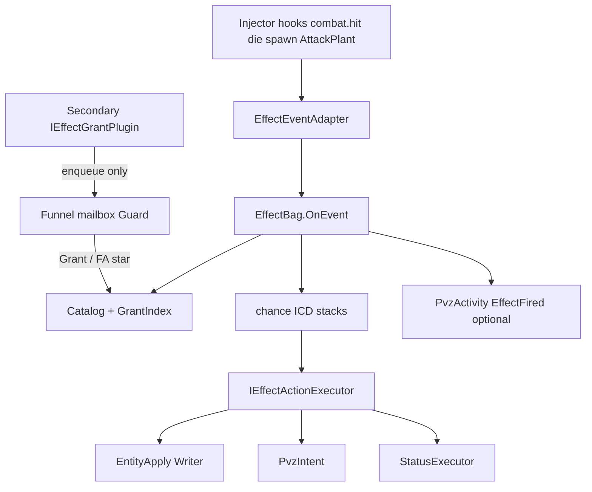

# Foundation Effect runtime

How Foundation Effects evaluate and apply. Secondary **enqueues through Funnel only** — never calls executors, Unity, or `EffectBag.Grant`.

Parent: [effect-system.md](effect-system.md). Data: [effect-data.md](effect-data.md).  
Funnel: [effect-funnel.md](effect-funnel.md) — Secondary enqueue → mailbox (modifier identity / mutation sum) → Guard → Bag. Flush is the **injector game thread**, not ingest 256/16ms. FA10 = Writer Add, not `TakeDamage`.  
Unique monsters (design): [unique-entity-effects.md](unique-entity-effects.md).  
Control loops: [overlay-control-loops.md](overlay-control-loops.md) — this runtime is the **Hot** loop (bag + Funnel mailbox + executors on Injector; Server catalog push is **Cold**).  
Aligns with [pvz-middle-layer.md](pvz-middle-layer.md), [pvz-intent.md](pvz-intent.md), [stat-system.md](stat-system.md).

**Implemented** — `FusionRpg.Core.Effects.EffectBag` + injector `EffectRuntime` / `InjectorEffectActionSink`. Testing: [effect-testing.md](effect-testing.md).

---

## Patterns

| Pattern | Type | Role |
|---|---|---|
| **Facade** | `EffectBag` | Public apply API: `Grant`, `Withdraw`, `OnEvent` (Funnel is the Secondary caller) |
| **Registry** | `EffectActionExecutorRegistry` | FA* → `IEffectActionExecutor` |
| **Strategy** | `IEffectActionExecutor` | One family per action opcode |
| **Plugin** | `IEffectGrantPlugin` | Secondary contributes grants/overlays **via Funnel only** |
| **Funnel** | `EffectFunnel` | Sole Secondary→Bag path; modifier pass-through; mutation sum + Guard |
| **Command** | PvzIntent | Auditable lawn mutations |
| **Adapter** | `EffectEventAdapter` | Capture/hooks → `EffectEvent` (FT*) |
| **Source-tagged bag** | ModifierBag | Passive withdraw via `effect:{id}` |

Secondary implements **plugins + data**, not new executors (new FA* requires architecture decision). FA10 `ApplyResourceDelta` is that decision — [effect-funnel.md](effect-funnel.md) / [decisions.md](decisions.md). Core mailbox + Writer Add are shipped.

---

## Hosting

| Piece | Where |
|---|---|
| Catalog + grants SSOT | **Server** (push revision to injector) — **Cold** loop |
| `EffectBag` + adapters + executors | **Injector** (events are local) — **Hot** loop |
| Sim | Server can run bag with Intent no-op / sim stubs |

Same push pattern as cheat mods → injector. **Ban:** do not evaluate combat procs on Server then POST apply back for each hit — [overlay-control-loops.md](overlay-control-loops.md). Funnel flush for combat deltas is **this process, game thread** (end of `OnEvent` / frame barrier, **re-entry depth 0**). Do not piggyback injector ingest `RpgClient.TryFlush` (256 / 16ms) — that is telemetry. Do not flush FA10 into a nested `OnEvent`.

### Grant rehydrate on Hello (W0-E)

Server keeps an in-memory **match-scoped** session grant snapshot (`EffectGrantSession`):

- Recorded when debug grant/withdraw/clear/reload run (**HTTP and scenario `debug.run-steps` expand**)
- Cleared on `board.start` / `board.end` (aligned with injector `ClearMatch`)
- On injector `Hello` (cold start and SignalR reconnect), Server pushes `effects.grants.apply` → injector upserts by **required** `grantId` (no `ClearAll`, no Guid mint on Hot)

**Session only** for now — ActiveBound UniqueActor loadouts are W5+. Entity `ptr` grants are not meaningful across process restart (ptrs die). Re-grant after a new board (session was cleared with the match).

---

## Secondary contract (`IEffectGrantPlugin`)

**Target (Funnel shipped):**

```text
OnMatchStart / OnLoadoutChanged / OnOwnerChanged
  → Funnel.Enqueue(RpgEffectEvent)   // modifier or mutation
On removed
  → Funnel withdraw / EffectBag.Withdraw(grantId) via Funnel
```

**Shipped:** stub plugins `Funnel.EnqueueModifier` / `EnqueueMutation`. UniqueBound loadout grants also enqueue through Funnel.

**Banned:** any call into StatusExecutor, EntityApply, Intent enqueue, Unity types, `TakeDamage`, `SetHp`, or **`EffectBag.Grant` / `Withdraw`** from Secondary assemblies.

---

## Event pipeline



### `EffectEvent` (logical)

| Field | Notes |
|---|---|
| `trigger` | FT* |
| `matchKey` | |
| `side` | plant / zombie / bullet |
| `actorPtr` / `targetPtr` | Event context only |
| `typeId` | When known |
| `damage` | When known |
| `killerPtr` | Optional — enables overlay `actorIsKiller` |
| `scenarioId` | Debug stamp |

### Adapter mapping (LIVE signals)

| Hook / kind | FT* |
|---|---|
| `combat.hit` (TakeDamage Bullet / AttackPlant) | `OnDamageDealt` |
| `plant.damage` / `zombie.damage` | `OnDamageTaken` |
| `plant.place` / `zombie.place` / `bullet.init` | `OnSpawn` |
| `plant.die` / `zombie.die` | `OnDeath` |
| Grant upsert | `OnGranted` |
| Grant remove | `OnRemoved` |

### FT* on-hit SSOT (W0-D)

**Primary `OnDamageDealt` surface = enriched TakeDamage + melee `AttackPlant`.** Do not treat base `Bullet.HitZombie` / `HitPlant` Harmony as architecture.

| Path | Emit | LIVE prove |
|---|---|---|
| Projectile → zombie/plant | TakeDamage Prefix: `damageFrom` cast `Bullet` → `combat.hit` (`source=takeDamage`) | F4 / melon-live |
| Zombie → plant melee | `Zombie.AttackPlant` → `combat.hit` (`source=attackPlant`) | F4b (TakeDamage often sees plant-as-damageFrom) |

`EffectEventAdapterCore` maps those payloads (`attackerPtr` or `bulletPtr`) → `OnDamageDealt`. Hit* stays off (`EnableUnsafeHitPatches=false`; Melon `[HarmonyDontPatchAll]`). HitLand / `combat.hitland` is separate (W12 triage), not required for on-hit FT*.

**Emit gate:** `combat.hit` fires when debug hit-capture / LogDamage **or** the bag has an `OnDamageDealt` grant (`ShouldEmitCombatHit`). Not always-on.

**Actor identity:** pea TakeDamage stamps `bulletPtr` (no shooter plant ptr yet). Type-scoped `plant:N` grants match via `fromType`; `entity:{plantPtr}` unique-gear OnDamageDealt for pea hits needs later shooter enrichment.

**A2:** when TakeDamage will emit bullet `combat.hit`, skip `*.damage` → `OnDamageTaken` (`CombatHitEmitPolicy`). Melee bites do not predictive-skip (LIVE `damageFrom` is often the plant); `DealtIdentity` covers AttackPlant-before-damage order.

See: [p0-hot-path-hardening.md](p0-hot-path-hardening.md) Slice D, [../runbook/debug-live-checklist.md](../runbook/debug-live-checklist.md) F4/F4b, [../runbook/melon-live-checklist.md](../runbook/melon-live-checklist.md).

---

## Evaluation sequence (Triggered)

```text
1. Adapter builds EffectEvent
2. EffectBag loads grants for match + entity owners (GrantIndex)
3. Keep grants whose def lists this trigger
4. Apply typed overlay filters (side, typeId, actorIsKiller, …)
5. Roll chance (overlay; default 1)
6. ICD: read grant.icd_ms; if trigger is OnDamageDealt|OnDamageTaken and missing → 250ms
7. If within ICD or stack cap → skip; else stamp foundation_effect_runtime
8. For each action seq:
     merge action.params_json ∪ overlay (typed; reject unknown keys)
     executor.Execute(ctx, merged)
9. Optional Activity EffectFired; debug.effect.fired
```

### Passive

```text
OnGranted → run ModifyStat (and any other OnGranted actions)
OnRemoved → ModifierBag.WithdrawSource(effect:{id}) + clear runtime row
```

Retarget on `OnSpawn` only if def also lists `OnSpawn` (elite-on-spawn Passive pattern).

---

## Central write paths

| FA* | Executor exit | Must not |
|---|---|---|
| `ModifyStat` | Upsert ModifierBag (`ApplyOwnerKey` ← grant `ownerKey`) → Resolve filter → EntityApply → EntityStatWriter | Direct field assign; unscoped `ReapplyAllLiving` for entity/type grants |

LIVE read path for scope prove: `POST /api/debug/board-stats` → event `debug.board-stats` (`plants[]`/`zombies[]` combat fields + effect `sessionMods[].applyOwnerKey`). See [`smoke-effect-scoped-atk.ps1`](../../scripts/smoke-effect-scoped-atk.ps1).
| `ApplyStatus` / `ClearStatus` | **StatusExecutor** only | Call `Buttered` from Secondary |
| `SpawnEntity` | PvzIntent (`pvz.effect.spawn` or reuse spawn-extra / plant / bullet cmds) | Feature-local Create* |
| `BoardAction` | PvzIntent board ops | Board field poke |
| `SpawnGridItem` / `ClearGridItem` | PvzIntent grid | |
| `SetBoxType` | PvzIntent box | |
| `Economy` | PvzIntent economy | Board.theSun = from plugin |
| `ApplyResourceDelta` (FA10) | Writer **Add** (`live + amount` on `hp`); HP ≤ 0 → `ForceKill` / `Die` | `SetHp` from overlay snapshot; Unity `TakeDamage`; Secondary apply |

Intent payloads carry `effect_id`, `grant_id`, `plugin_id` for audit.

---

## Default ICD (damage)

`AttackPlant` can emit many `OnDamageDealt` events per second. Foundation runtime:

- If grant omits `icd_ms` and trigger ∈ {`OnDamageDealt`, `OnDamageTaken`} → treat as **250ms**.
- `icd_ms: 0` is explicit “no ICD” (Secondary must opt in; dangerous).

LIVE proof of ICD still outstanding — engine behavior is designed first.

---

## SpawnEntity

One opcode, three LIVE backends selected by `kind`:

| kind | Injector path (existing) |
|---|---|
| `zombie` | spawn zombie / Intent spawn-extra; overlay may set `mindControlled` |
| `plant` | SetPlant / debug spawn plant |
| `bullet` | SetBullet + Damage from overlay |

typeId / HP / ATK / MC / cell → **overlay only**.

---

## StatusExecutor vs StatusRuntime

| Component | Role |
|---|---|
| **StatusRuntime** (L2, design) | SSOT for actor status **instances**, lifecycle, resistance at Apply, contagion hops |
| **StatusExecutor** (L4, shipped) | Sole Unity CC **apply** adapter (`Buttered`, `SetFreeze`, …) |

Status HP changes still go **Funnel → FA10**. StatusExecutor never writes overlay HP deltas.

Full spec: [status-ssot.md](status-ssot.md). Catalog ids include butter, freeze, cold, poison, hypno, ember, jala, kelp, and overlay ids (wither, bond, blight, …).

---

## StatusExecutor (L4 apply adapter)

Single class wrapping LIVE methods:

| status | Method family |
|---|---|
| butter | `Buttered` / `UnButtered` |
| freeze | `SetFreeze` |
| cold | `SetCold` |
| poison | `SetPoison` |
| floatSlow | float speed fields (weak VFX; documented) |

Forward catalog (design): `ember`, `jala`, `kelp` — see [status-ssot.md](status-ssot.md) §9.

No second butter path outside this executor.

---

## How Secondary stays clean

| Secondary wants | Does | Does not |
|---|---|---|
| Lucky butter on pea hit | Enqueue grant `fe.damage.butter` + overlay chance/icd/duration | Call `Buttered` |
| Spawn elite on plant death | Enqueue grant `fe.death.spawn_zombie` + typeId/hp overlay | Call CreateZombie |
| +25% ATK passive | Enqueue Passive `fe.passive.power` + more overlay | EntityStatWriter |
| Deal 1000 / 100 crits this tick | Enqueue `ResourceDelta` hp `amount` (Funnel sums) | `SetHp(snapshot)`; FA1 as a hit; `TakeDamage` |

### Alt damage sinks (W11-C)

Product DEF and FT* on-hit for **vanilla** peas/bites stay on `TakeDamage` (+ melee `AttackPlant`). Overlay/RPG current-HP uses FA10 Writer Add — **not** this Prefix (re-entry / double-dip). Alt sinks are capture-only; **no new Harmony this wave**. `Bullet.HitLand` already emits `combat.hitland` when debug hit-capture / LogDamage; W11-C does **not** promote HitLand to on-hit FT* / gear DEF.

| Sink | Capture | Product DEF | Gear honesty |
|---|---|---|---|
| `Plant`/`Zombie.TakeDamage` | `*.damage` `path=take` + `combat.hit` | yes | SSOT |
| `Plant.RealTakeDamage` | `path=real` | no (god only) | bypass — not gear DEF |
| `Zombie.BodyTakeDamage` | `path=body` | no (god only) | bypass — not gear DEF |
| `Zombie.ApplyDamage` | `path=apply` | no (god only) | bypass — not gear DEF |
| `Bullet.HitLand` | `combat.hitland` when debug hit-capture / LogDamage | no | **W12** B-HITLAND (not FT* SSOT) |

---

## Code layout

```text
FusionRpg.Core/Effects/     EffectBag, catalog interfaces, proc policy, EffectFunnel
FusionRpg.Injector/Effects/ Adapters, executors, StatusExecutor, FA10 Writer Add + Die
FusionRpg.Server/           Grant/def SSOT + revision push
```

Guard (W11-A): `scripts/guard-secondary-no-unity.ps1` fails CI if Secondary plugins / `IEffectGrantPlugin` implementers reference Unity apply APIs (`UnityEngine`, `HarmonyLib`, `StatusExecutor`, `EntityStatWriter`, `FindObjectsOfType`, `CreateZombie`). Wired from Guard.Tests + `deploy-play.ps1`.

Funnel Guard: `scripts/guard-funnel-delta.ps1` + `tests/FusionRpg.Guard.Tests` — reject Secondary `TakeDamage`/`SetHp`/`Bag.Grant`. Wired from Guard.Tests + `deploy-play.ps1`. LIVE HP+FX: `POST /api/debug/effect/enqueue-delta` ([debug-pipeline.md](../runbook/debug-pipeline.md)).
