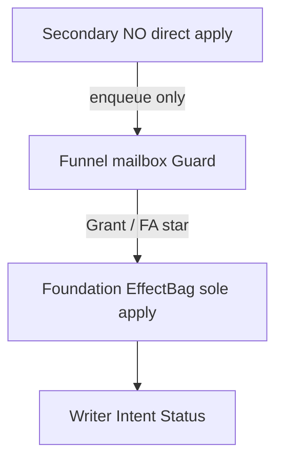

# Foundation Effect system

Architecture for **Foundation Effects**: minimal LIVE-proven lawn opcodes with a **centralized apply path**.  
**Secondary Effects** compose Foundation via grants/overlays only — they never apply to the game.

See also: [effect-data.md](effect-data.md), [effect-runtime.md](effect-runtime.md), [effect-funnel.md](effect-funnel.md) (Secondary → Funnel → Foundation; FA10 v2 spec), [combat-damage-ssot.md](combat-damage-ssot.md) (target + instant delivery SSOT for overlay HP), [status-ssot.md](status-ssot.md) (timed status instances, ICD, contagion — design locked), [effect-testing.md](effect-testing.md), [match-runtime.md](match-runtime.md) (live match FSM / caps — design spec), [unique-actor-runtime.md](unique-actor-runtime.md) (durable specimens — design), [stat-system.md](stat-system.md), [pvz-middle-layer.md](pvz-middle-layer.md).  
Evidence surface: [../research/effect-runtime/07-effect-opportunities.md](../research/effect-runtime/07-effect-opportunities.md).  
Peer inspiration: [../research/arpg-effects/06-fusionrpg-mapping.md](../research/arpg-effects/06-fusionrpg-mapping.md).

**Shipped / sealed:** Core `EffectBag` + injector FA1–FA9 (L1–L14); Funnel + FA10 at `FoundationContractVersion = 2`. Offline IntentPlan kit + LIVE L1–L14 lawn PASS (see [effect-testing.md](effect-testing.md) and [`_checklist-effect-foundation-live.json`](../research/effect-runtime/_checklist-effect-foundation-live.json)). Secondary enqueue via Funnel. See [effect-funnel.md](effect-funnel.md).

---

## Vocabulary

| Term | Meaning |
|---|---|
| **Foundation Effect** | Minimal LIVE-proven lawn opcode. **Only layer allowed to apply** to the game (`EffectBag` → Writer \| Intent \| StatusExecutor \| v2 FA10 Writer Add). |
| **Secondary Effect** | Composes Foundation via **grants + overlays** (type, stats, chance, ICD). Never applies to the game. Content design is out of scope here. |

### Hard law: Secondary never applies to the game

Secondary **must not** call apply / lawn mutation APIs:

- No status methods (`Buttered`, `SetFreeze`, …)
- No `EntityStatWriter` / `EntityApply` / combat field writes
- No spawn / BoardAction / grid / economy APIs
- No injector debug commands as a feature shortcut
- No lawn Harmony that mutates for a Secondary fantasy

```text
Secondary  →  Funnel.Enqueue ONLY   (no ctx.Bag.Grant)
Funnel     →  pass-through modifiers | sum mutations | Guard
Foundation EffectBag  →  FA* executors  →  game
```



Stub plugins enqueue through `EffectFunnel` (modifiers pass-through; mutations sum to FA10). Instant current-HP mutation is **not** FA1; v2 **FA10 `ApplyResourceDelta`** is hp add-only, Writer Add — not `TakeDamage`. See [effect-funnel.md](effect-funnel.md).

**Rule:** Data-only differences → one Foundation primitive; Secondary puts the data in `overlay_json`.

---

## Debate outcomes (locked)

| # | Issue | Decision |
|---|---|---|
| D1 | 5 EffectTypes redundant | **2 types:** Passive \| Triggered |
| D2 | chance/icd on def | **Proc fields on grant**; Foundation **engine** enforces |
| D3 | OnKill vs OnDeath | **OnDeath only**; optional killer on event + overlay `actorIsKiller` |
| D4 | ModifyStat amounts on def | Action = **channel only**; magnitudes in overlay |
| D5 | mindControlled on spawn action | **Overlay only** |
| D6 | Three spawn actions | **`SpawnEntity`** kind=plant\|zombie\|bullet |
| D7 | Freeform overlay | **Typed schema per FA***; reject unknown keys |
| D8 | AttackPlant spam | Damage grants need `icd_ms`; **default 250ms** if omitted |
| D9 | Passive vs cheat Stat plugins | Effect Passive = Grant→ModifyStat→Writer; cheats stay operator path |
| D10 | Field/Instant types | Dropped — Triggered + BoardAction/SetBoxType |

**Accepted risks:** default ICD unproven LIVE; killer filter needs event enrichment; cheat `IStatModifierPlugin` remains outside Effect bag.

---

## EffectType (2)

| EffectType | Role |
|---|---|
| **Passive** | `OnGranted` / `OnRemoved` → usually `ModifyStat` into ModifierBag |
| **Triggered** | On FT* → FA* list |

Flat → Increased → More stays in [stat-system.md](stat-system.md). Foundation Passive/Duration-like status is `ApplyStatus`, not a third compose phase.

---

## Catalog: triggers (4 + lifecycle)

| ID | Trigger | LIVE signal |
|---|---|---|
| FT1 | `OnSpawn` | `plant`/`zombie`/`bullet` place/spawn/init |
| FT2 | `OnDamageDealt` | `combat.hit`, TakeDamage arms, `AttackPlant` |
| FT3 | `OnDamageTaken` | `plant.damage` / `zombie.damage` |
| FT4 | `OnDeath` | `plant.die` / `zombie.die` |
| — | `OnGranted` / `OnRemoved` | Passive attach lifecycle |

Keep **both** FT2 and FT3: pea→butter needs dealt damage; retaliate needs taken.

---

## Catalog: actions (FA1–FA10 shipped)

| ID | Action | Foundation params | Secondary overlay |
|---|---|---|---|
| FA1 | `ModifyStat` | `channel` | Flat/Inc/More amounts |
| FA2 | `ApplyStatus` | `status` enum | duration, level |
| FA3 | `ClearStatus` | optional status | target |
| FA4 | `SpawnEntity` | `kind` plant\|zombie\|bullet | typeId, stats, MC, cell |
| FA5 | `BoardAction` | `op` freeze\|doom\|fireline\|cherry | position |
| FA6 | `SpawnGridItem` | `gridItemType` | cell |
| FA7 | `ClearGridItem` | — | selector |
| FA8 | `SetBoxType` | `boxType` | cells |
| FA9 | `Economy` | currency + set\|add | amount, caps |
| FA10 | `ApplyResourceDelta` | `channel` **hp only** | signed `amount`; **add only** |

FA1–FA9 remain v1 frozen. FA10 is shipped in v2: Funnel emits it so RPG never sends absolute snapshot HP. Sun/money stay FA9. Executor is Writer **Add** + Die if HP≤0 — not Unity `TakeDamage`. See [effect-funnel.md](effect-funnel.md).

### Not Foundation

OnKill-as-separate-enum · HitLand / HitZombie / HitPlant Harmony · ice-road · scene weather · `takeDmgMultiplier` · OnWave · Update auras · chance/icd on def rows · Secondary direct apply.

---

## R/W constitution

1. Secondary never applies to the game — `Funnel.Enqueue` only; no `Bag.Grant`.  
2. Foundation is the **sole Effect apply path**. Funnel is a command buffer, not a second bag.  
3. Entry: Funnel flush → `EffectBag.Grant` / `Withdraw` / `OnEvent`. Secondary does not Grant.  
4. Exits:
   - `ModifyStat` → ModifierBag `effect:{id}` → **EntityApply → EntityStatWriter**
   - Spawn / board / grid / economy → **PvzIntent** → injector
   - `ApplyStatus` / `ClearStatus` → **StatusExecutor** only
   - `ApplyResourceDelta` (v2) → Writer **Add** (`live + amount`); HP ≤ 0 → `ForceKill` / `Die` — never `SetHp` from overlay snapshot, never `TakeDamage` ([effect-funnel.md](effect-funnel.md))
5. Optional PvzActivity `EffectFired` — observation, not a second apply path.  
6. Source-tag every grant and Intent (`plugin_id`, `effect_id`, `grant_id`).  
7. Damage-side grants: enforce ICD (default **250ms** if `icd_ms` omitted).

---

## vs researched ARPGs

Foundation ≈ **Diablo II CtC + Last Epoch ailments + PoE ICD engine**, sitting above locked Flat/Inc/More (StatSystem).

| Peer | Foundation |
|---|---|
| On striking / on struck | FT2 / FT3 |
| On death | FT4 |
| Ailment apply | FA2 |
| Summon | FA4 |
| Ground / tile | FA6–FA8 |
| Resource | FA9; current-HP delta = FA10 v2 |
| Attr → power / Lucky Hit / aura | Secondary or deferred |

**Steal:** event + ICD + spawn/economy caps.  
**Adapt:** independent rolls v1 (not D4 Lucky Hit budget).  
**Avoid:** Vulnerable-mandatory buckets; calling compose ops “Foundation Effects”; Secondary→Unity shortcuts; FA10 via Unity `TakeDamage` (re-entry / double-dip).

---

## Flagship compositions

1. Triggered FT2 → FA2(butter) — overlay: chance, `icd_ms`, duration  
2. Triggered FT4 → FA4(zombie) — overlay: typeId, stats  
3. Triggered FT4 → FA6(grave)  
4. Passive OnGranted → FA1 — overlay: magnitudes  
5. Triggered / OnGranted → FA5(cherry) or FA9(sun)  
6. Triggered → FA8(dirt)

---

## See also

- [effect-atom-ideal.md](effect-atom-ideal.md) — **ideal capture (not a spec)** for the Secondary layer above this one: atom effects, containers, SQLite values, power as a currency  
- [effect-data.md](effect-data.md) — tables and typed overlays  
- [effect-runtime.md](effect-runtime.md) — Facade, executors, evaluation  
- [effect-funnel.md](effect-funnel.md) — Secondary → Funnel → Foundation; delta vs modifier; FA10 v2  
- [unique-entity-effects.md](unique-entity-effects.md) — lawn unique power path (FA1 apply scope shipped; bind → `entity:{ptr}`)  
- [unique-actor-runtime.md](unique-actor-runtime.md) — UniqueActor FSM for durable specimens (design)  
- [match-runtime.md](match-runtime.md) — MatchRuntime above Effects (phase, BoardProjection, AdmitSpawn, UniqueBindings); **spec only until a separate impl plan**  
- [decisions.md](decisions.md) — locked product decisions row for Foundation Effects 
