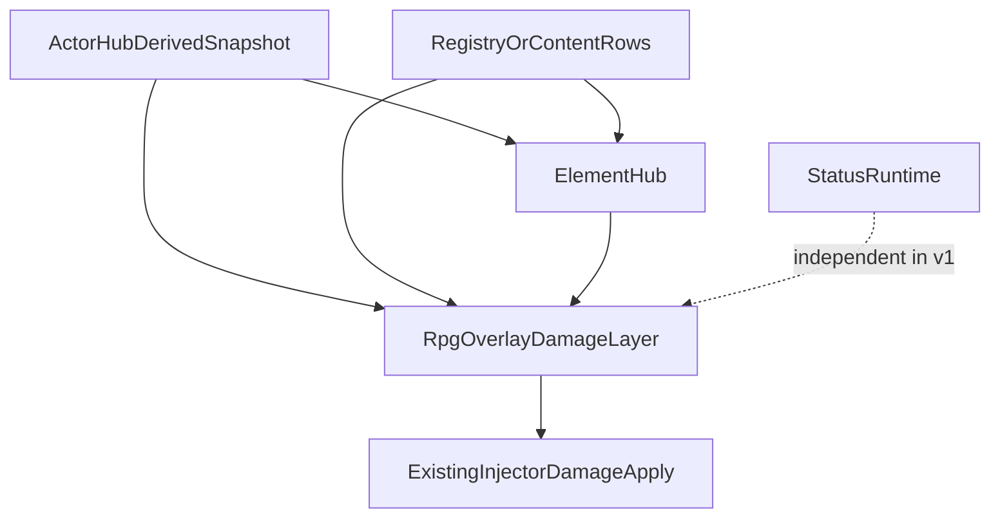
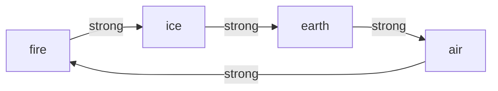

# Element Hub SSOT — actor typing and derived element stats

**Status:** **Shipped (2026-08-19)** — Element Hub runtime (`ElementHub`, ring-cycle matrix §8.5), actor type validation, and overlay combat consumption path are in code. See [combat-element-implement-plan.md](combat-element-implement-plan.md).  
**Parent:** [decisions.md](decisions.md) (ADR rows **Element Hub SSOT**, **Actor Hub SSOT**, **Combat damage SSOT**). Derived base: [actor-hub-ssot.md](actor-hub-ssot.md). Overlay damage consumer: [combat-damage-ssot.md](combat-damage-ssot.md). Timed status system stays separate: [status-ssot.md](status-ssot.md).

This spec defines the **element layer** for the RPG overlay. It does **not** replace vanilla PVZ attack math, and it does **not** absorb the status runtime.

---

## 1. Problem

FusionRpg now has a derived-status vocabulary for Apply-time power/resist, but no matching SSOT for:

1. Actor **element typing**
2. Actor **element power / resist**
3. Element matchup rules for overlay damage
4. Hybrid or multi-element payloads on one overlay hit

Without an element SSOT, content would scatter matchup logic across grant overlays, future CombatMath code, and injector helpers.

---

## 2. Product boundary

This layer is intentionally narrow.

- Vanilla PVZ `atk`, pea hit logic, bite timing, and Unity `TakeDamage` stay unchanged.
- Element math exists only for **RPG overlay damage**.
- Status stays its own runtime with its own `status.power.*` and `status.resist.*` channels.
- Element does **not** apply statuses in v1.
- Element does **not** own shields, absorption, reflection, penetration, or SMT-style null/drain/repel in v1.

Element Hub answers only these questions:

- What element types does this actor have?
- What derived element power and resist values does this actor expose?
- Given a damage payload and a defender type set, what matchup bonus feeds overlay combat?

---

## 3. Layer model (locked)



| Layer | Owns | Must not |
|---|---|---|
| **Actor Hub** | `ActorDerivedSnapshot`, channel registry, actor metadata lookup | Hardcode element matchups |
| **Element Hub** | Element ids, actor type slots, matchup matrix, element derived channels | Write Unity HP, ATK, or timed status state |
| **Overlay combat** | Power / defense / crit / hit rolls, final overlay damage | Reimplement status runtime or vanilla attack loop |
| **StatusRuntime** | Timed state, ICD, pulses, status Apply-time resist | Depend on element hit output in v1 |

---

## 4. Element roster (extended 2026-08-21 — [demons/spec-element-extension.md](demons/spec-element-extension.md))

FusionRpg element ids:

- `omni`
- `fire`
- `ice`
- `air`
- `earth`
- `light` *(extension)*
- `dark` *(extension)*

Rules:

- `omni` is **not** an actor type slot.
- `omni` is an additive baseline for power and resist.
- Each actor may have **0, 1, or 2** concrete types from the roster.
- A damage payload may carry **one or more** element components.
- Code iterates elements via **`ElementRoster.Concrete`** only; the 56 combat channels (8 families × roster + omni) are generated from it. Element name parsing is strict (names only; numeric strings reject).
- **Light/dark matchups:** `light ⇄ dark` are a **mutual counter** (each STR vs the other); both are NEU vs the four ring elements in both directions. The ring itself is unchanged. `void`/`chaos` are traits, never elements.

Examples:

```text
Peashooter specimen:
  type.primary = fire
  type.secondary = air

Overlay hit payload:
  [{ element: fire, weight: 0.7 }, { element: air, weight: 0.3 }]
```

---

## 5. Actor typing SSOT

Actor element types are metadata, not numeric derived channels.

```text
element.type.primary
element.type.secondary
```

Recommended storage shape for implementation:

- metadata on `ActorKey` / actor snapshot sidecar
- optional PvzStats or progression contribution later
- not encoded as fake numeric `DerivedStatChannels`

Why:

- typing is categorical, not additive math
- actor type slots need validation (`0..2` concrete types, no `omni` slot)
- combat math only reads them when resolving matchup bonus

### Validation rules

- `primary == secondary` is invalid
- `omni` may not appear in primary or secondary slot
- Unknown type id rejects the content row or actor metadata update
- Empty secondary is valid
- Empty primary + empty secondary is valid and means neutral actor typing

---

## 6. Derived channel catalog (locked v1)

Element Hub extends Actor Hub with these named derived channels:

### 6.1 Offense

| Channel id | Compose | Default | Consumer |
|---|---|---|---|
| `combat.power.omni` | flat sum | 0 | Overlay damage delta |
| `combat.power.fire` | flat sum | 0 | Overlay damage delta |
| `combat.power.ice` | flat sum | 0 | Overlay damage delta |
| `combat.power.air` | flat sum | 0 | Overlay damage delta |
| `combat.power.earth` | flat sum | 0 | Overlay damage delta |
| `combat.crit.rate.omni` | flat sum | 0 | Crit roll |
| `combat.crit.rate.fire` | flat sum | 0 | Crit roll |
| `combat.crit.rate.ice` | flat sum | 0 | Crit roll |
| `combat.crit.rate.air` | flat sum | 0 | Crit roll |
| `combat.crit.rate.earth` | flat sum | 0 | Crit roll |
| `combat.crit.damage.omni` | flat sum | 0 | Crit magnitude |
| `combat.crit.damage.fire` | flat sum | 0 | Crit magnitude |
| `combat.crit.damage.ice` | flat sum | 0 | Crit magnitude |
| `combat.crit.damage.air` | flat sum | 0 | Crit magnitude |
| `combat.crit.damage.earth` | flat sum | 0 | Crit magnitude |
| `combat.accuracy.omni` | flat sum | 0 | Hit roll |
| `combat.accuracy.fire` | flat sum | 0 | Hit roll |
| `combat.accuracy.ice` | flat sum | 0 | Hit roll |
| `combat.accuracy.air` | flat sum | 0 | Hit roll |
| `combat.accuracy.earth` | flat sum | 0 | Hit roll |

### 6.2 Defense

| Channel id | Compose | Default | Consumer |
|---|---|---|---|
| `combat.defense.omni` | flat sum | 0 | Overlay damage delta |
| `combat.defense.fire` | flat sum | 0 | Overlay damage delta |
| `combat.defense.ice` | flat sum | 0 | Overlay damage delta |
| `combat.defense.air` | flat sum | 0 | Overlay damage delta |
| `combat.defense.earth` | flat sum | 0 | Overlay damage delta |
| `combat.crit.resist.omni` | flat sum | 0 | Crit roll |
| `combat.crit.resist.fire` | flat sum | 0 | Crit roll |
| `combat.crit.resist.ice` | flat sum | 0 | Crit roll |
| `combat.crit.resist.air` | flat sum | 0 | Crit roll |
| `combat.crit.resist.earth` | flat sum | 0 | Crit roll |
| `combat.crit.resist.damage.omni` | flat sum | 0 | Crit magnitude |
| `combat.crit.resist.damage.fire` | flat sum | 0 | Crit magnitude |
| `combat.crit.resist.damage.ice` | flat sum | 0 | Crit magnitude |
| `combat.crit.resist.damage.air` | flat sum | 0 | Crit magnitude |
| `combat.crit.resist.damage.earth` | flat sum | 0 | Crit magnitude |
| `combat.dodge.omni` | flat sum | 0 | Hit roll |
| `combat.dodge.fire` | flat sum | 0 | Hit roll |
| `combat.dodge.ice` | flat sum | 0 | Hit roll |
| `combat.dodge.air` | flat sum | 0 | Hit roll |
| `combat.dodge.earth` | flat sum | 0 | Hit roll |

**Catalog size (v1):** 40 combat derived channels + 2 actor type metadata fields.

### Deferred from Chaos

Do not define these in v1:

- `StatusProbability`, `StatusDuration`, `StatusIntensity`
- `ElementPenetration`
- `ElementAbsorption`
- `ElementReflection`
- `Parry*`
- `Block*`
- mastery / social / mobility stats

Status already owns timed-state apply math; those extra combat families would widen the surface too early.

---

## 7. Omni rule (locked)

Omni is additive-only.

```text
totalOffense = offense.omni + offense.{element}
totalDefense = defense.omni + defense.{element}
```

Bans:

- `omni × element`
- `omni × crit`
- `omni × dodge`
- any multiplicative omni snowball rule

This matches the status design in [actor-hub-ssot.md](actor-hub-ssot.md): omni is the baseline, element is the typed slice.

---

## 8. Matchup matrix (locked structure)

Element Hub owns a matrix for typed advantage.

### 8.1 Relationship vocabulary

The doc must explicitly define how each attacker element relates to each defender type:

- stronger against
- weaker against
- neutral against

v1 keeps the shape simple. It does **not** import Chaos generating / overcoming dynamics, refractory, or status hooks.

### 8.2 Resolution cases

The matrix must cover:

1. single-element hit vs single-type defender
2. single-element hit vs dual-type defender
3. hybrid hit vs single-type defender
4. hybrid hit vs dual-type defender

### 8.3 Output rule (locked v1)

The matrix returns an **additive bonus or penalty** to overlay damage delta, not a final-damage multiplier applied after crit.

Matchup bonus is a **base-damage share**, Pokemon-like, independent from power scale:

```text
componentBonus(E) = componentMatchupShare(E, defenderTypes) × baseOverlayDamage
matchupBonus = Σ (componentWeight × componentBonus(E))
effectiveDelta(E) = (attackerPower(E) - defenderDefense(E)) + componentBonus(E)
```

Policy constant (v1): **`MatchupShareK = 0.25`**

- strong relation → `+MatchupShareK × baseOverlayDamage`
- weak relation → `−MatchupShareK × baseOverlayDamage`
- neutral / same / no defender types → `0`

Why base-damage share instead of power scale:

- element advantage stays readable in debug breakdowns
- typed power/defense remain separate knobs
- dual-type defenders can use a Pokemon-style product without touching power stats

Element Hub returns **per-component** bonuses. Overlay combat weights and sums them; it does not collapse the payload into one lookup first.

### 8.4 Hybrid payload rule (locked v1)

A hit may carry a weighted component list:

```text
[{ element: fire, weight: 0.7 }, { element: air, weight: 0.3 }]
```

The resolver computes one matchup contribution **per component**, then combines:

```text
matchupBonus = Σ (componentWeight × componentBonus(componentElement))
```

This borrows the Chaos hybrid idea but keeps the result to one additive delta instead of a separate hybrid subsystem.

### 8.5 v1 matchup matrix (locked)

**Ring (strong → beats →):** `fire → ice → earth → air → fire`

```text
Attacker ↓ / Defender → │ fire      │ ice       │ air       │ earth
────────────────────────┼───────────┼───────────┼───────────┼──────────
fire                    │ same 0    │ STR +0.25 │ WEK −0.25 │ NEU 0
ice                     │ WEK −0.25 │ same 0    │ NEU 0     │ STR +0.25
air                     │ STR +0.25 │ NEU 0     │ same 0    │ WEK −0.25
earth                   │ NEU 0     │ WEK −0.25 │ STR +0.25 │ same 0
```

Legend: values are **× baseOverlayDamage** with `MatchupShareK = 0.25` (e.g. STR on a 100-base hit = **+25** overlay bonus before typed power/defense).



**Flavor (balance copy only, not mechanics):** fire melts ice; ice cracks earth; earth blocks air; air blows out fire.

**Extension rows (2026-08-21):** `light` vs `dark` = STR +0.25 both directions (mutual counter); `light`/`dark` vs any ring element = NEU 0 both directions; same-vs-same = 0 as always. The ring rows above are unchanged; the golden matrix test generates all 36 pairs from `ElementRoster`.

#### Single-type defender

Lookup attacker element vs the one defender type. Apply STR / WEK / NEU / same from the table.

#### Dual-type defender (locked v1)

Convert each slot relation to a multiplier, multiply (Pokemon-style), then convert back to additive share:

```text
m_slot = 1.0 + relationShare(slot)     // STR → 1.25, WEK → 0.75, NEU/SAME → 1.0
combinedMult = m_primary × m_secondary   // missing slot → 1.0
componentBonus(E) = (combinedMult − 1.0) × baseOverlayDamage
```

Example: `fire` component vs defender `ice + earth` → `1.25 × 1.0 − 1 = +0.25 × base`.

Example: `fire` component vs defender `air + earth` → `0.75 × 1.0 − 1 = −0.25 × base`.

#### Special cases

| Case | Rule |
|---|---|
| No defender types (empty primary + secondary) | bonus = 0 for every element |
| Attacker element matches a defender type slot | **same** → 0 bonus (no STAB in v1) |
| Unknown defender type id | reject content row / metadata update |
| Hybrid payload | per-component bonus, then weight sum (§8.4) |

### 8.6 Authority and precedence (locked v1)

| Topic | Owner | Rule |
|---|---|---|
| Element ids and roster | Element Hub spec + ADR | `omni` + `ElementRoster.Concrete` (`fire`, `ice`, `air`, `earth`, `light`, `dark` since 2026-08-21) |
| Actor type metadata | Element Hub semantics; Actor Hub storage | `element.type.primary` / `.secondary` validated at content ingest |
| Matchup matrix content | Element Hub | Combat layer must not hardcode STR/WEK tables |
| Derived channel registration | Actor Hub catalog | Element Hub defines ids; Actor Hub registers and validates |
| Matchup bonus computation | Element Hub runtime | Combat consumes `componentBonus(E)` only |
| Final HP delta | Overlay combat → Funnel | Element Hub never writes HP |

One authoritative source per actor for type metadata at a time (baseline, progression row, or cheat override — not stacked conflicting types).

---

## 9. Matchup and probability policy (v1)

| Policy key | Role | v1 lock |
|---|---|---|
| `ElementMatchupPolicy.MatchupShareK` | STR/WEK share of `baseOverlayDamage` | **0.25** |
| `CombatProbabilityPolicy.AccuracyScale` | Hit sigmoid divisor | shared constant (all elements) |
| `CombatProbabilityPolicy.CritRateScale` | Crit sigmoid divisor | shared constant |
| `CombatProbabilityPolicy.CritDamageScale` | Crit magnitude divisor | shared constant |
| `CombatProbabilityPolicy.Steepness` | Optional sigmoid steepness | shared constant |

Per-element scale overrides remain **deferred**. Document the shape only:

```text
CombatProbabilityPolicy.{AccuracyScale|CritRateScale|CritDamageScale|Steepness}.{element}
```

Do not add `PowerScale` to v1 matchup math — matchup uses `MatchupShareK`, not typed power.

---

## 10. Per-element probability config (deferred tuning)

v1 ships **equal** sigmoid scales for all four elements (see §9). Per-element overrides use the future shape documented in §9; no element gets a distinct scale in v1 code or balance.

---

## 11. Contribution model

Element Hub should mirror Actor Hub / Chaos data-hub structure at a small scale.

Possible contributors:

| Contributor | v1 role |
|---|---|
| `baseline` | default no-type actor metadata and zero channels |
| `rpg.progression` | future typed power or crit rows from progression |
| `pvz.stats` | optional debug or balance rows on combat channels |
| `foundation.effect` | temporary derived buffs / debuffs later |
| `cheat.*` | debug overrides |

v1 doc lock:

- contributions modify **derived combat channels only**
- contributors must not mutate vanilla `atk`, `hp`, or status runtime state
- actor element type metadata may come from one authoritative source at a time

---

## 12. Rejected Chaos paths (v1)

Do not port into Element Hub v1:

- generating / overcoming **dynamics** (intensity, refractory, decay)
- element-triggered status pools or apply hooks
- mastery / realm progression on element channels
- penetration, absorption, reflection, null / drain / repel
- YAML/runtime file registry for element defs
- `PowerScale` inside matchup bonus (matchup uses `MatchupShareK` only)

---

## 13. Ban list

- No runtime YAML or file-based element registry in v1
- No Chaos mastery SQL / realm progression port
- No element-triggered status apply in v1
- No null / drain / reflect / repel / absorb semantics in v1
- No element-specific shield engine in v1
- No vanilla `atk` rewrite through Element Hub
- No direct Unity HP writes from Element Hub
- No duplicate typed vocab outside Actor Hub catalog and this spec

---

## 14. Related docs

- [combat-element-implement-plan.md](combat-element-implement-plan.md) — phased code + prove plan for Element Hub and overlay CombatMath
- [actor-hub-ssot.md](actor-hub-ssot.md) — derived snapshot SSOT and channel registration rule
- [combat-damage-ssot.md](combat-damage-ssot.md) — overlay damage pipeline that consumes this element layer
- [status-ssot.md](status-ssot.md) — timed state stays separate in v1
- [effect-funnel.md](effect-funnel.md) — final overlay delta goes through Funnel → FA10 Writer Add
- [rpg-progression.md](rpg-progression.md) — progression grain and future derived contributors
- [../research/effect-runtime/06-chaos-combat-element-adaptation.md](../research/effect-runtime/06-chaos-combat-element-adaptation.md) — copy vs adapt vs defer from Chaos
