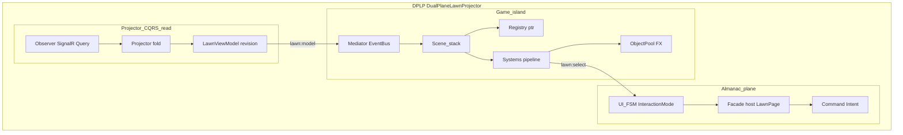
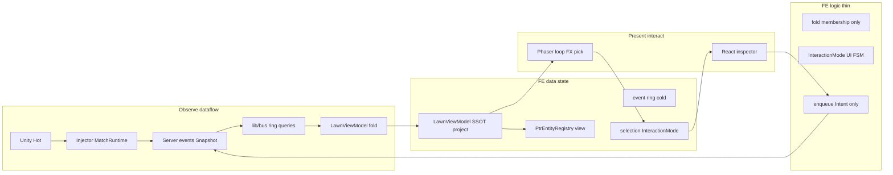
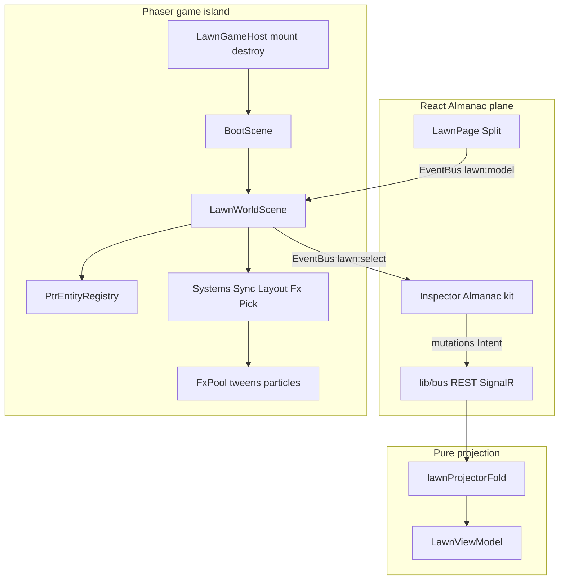

# FE game foundation — Dual-Plane Lawn Projector (DPLP)

**Status:** Architecture lock / design SSOT. **W6-0 docs shipped.** **W6-A–D monitor + W7 Intent/debug interact shipped** (`phaser@^4.2`, `#/lawn`).  
> **Revised 2026-08-22 — the lawn is a *stage*, not a route.** The `decisions.md` **Game GUI** row
> makes the layer model binding: the player is on one **stage** and every other surface is a **layer**
> over it. For this document that changes exactly one thing — **every lifetime rule that said
> "while `#/lawn` is mounted" or "on route leave" now reads "while the lawn stage is current" /
> "on leaving the lawn stage."** The Phaser `Game` is created on **entering** the lawn stage and
> destroyed on **leaving** it, and **never** when a panel opens over it (GG-11). Everything else here
> — DPLP, the plane locks, RT-01…RT-15, the system allow-list, the destroy checklist itself, the
> folder law — is **unchanged and still binding**. Governing docs:
> [game-gui-principles.md](game-gui-principles.md), [design/information-architecture.md](../design/information-architecture.md).

**Related:** [lawn-projector.md](lawn-projector.md) (projection model + observe≠control), [overlay-control-loops.md](overlay-control-loops.md), [match-runtime.md](match-runtime.md), [unique-actor-runtime.md](unique-actor-runtime.md), [web/spec.md](../web/spec.md), [implementation-roadmap.md](implementation-roadmap.md), [research/architecture-stress/00-index.md](../research/architecture-stress/00-index.md).

W6 monitor implements this foundation. W7 adds Intent chrome only.

---

## 1. Named architecture

**Name:** Dual-Plane Lawn Projector (DPLP)

**One-liner:** Almanac SPA + Phaser game island, driven by a pure observe projection (`LawnViewModel`) and Intent-only control — FE never owns Unity/Server game sim.

| Style | Where it applies |
|---|---|
| **Projector / read-model** | Observe path: Snapshot/events → fold → `LawnViewModel` (lagged mirror of MatchRuntime) |
| **Unidirectional data flow (UDF)** | Model flows React→EventBus→Phaser; pick/select flows Phaser→React; mutations leave via Intent only |
| **Dual-plane hybrid** | React owns chrome/inspector/**stage + layer stack**; Phaser owns frame loop/sprites/FX; pure TS owns fold |
| **Thin client** | Product game logic stays Hot/Cold/Intent on Injector/Server; FE = display + interact chrome |
| **Lite ECS (registry + systems)** | Inside Phaser only — CapPolicy-scale; no bitECS/YAGE dependency |

Aligns with [lawn-projector.md](lawn-projector.md) (observe≠control, pure `LawnViewModel`) and extends it with runtime + pattern catalog + red-team invariants.

---

## 2. Design pattern catalog

| Pattern | FE use | Primary home |
|---|---|---|
| **Projector (ViewModel fold)** | Pure fold Snapshot/events → `LawnViewModel` + `revision` | `features/lawn/lawnProjectorFold.ts` |
| **CQRS-lite (observe vs command)** | Observe = projection; Command = Intent/debug via `lib/bus` — never Phaser `fetch` | fold vs inspector/Intent |
| **Mediator / EventBus** | Decouple React mount from Phaser scenes | `game/EventBus.ts` |
| **Facade** | `createLawnGame` / host create+destroy `Phaser.Game` | `game/createLawnGame.ts` + React host |
| **Scene stack** | Boot (assets) → LawnWorld (while the lawn stage is current) | `game/scenes/*` |
| **Registry (entity index)** | `ptr → view record + GameObject refs`; diff on model | `game/entities/PtrEntityRegistry.ts` |
| **System (update pipeline)** | Ordered: Sync → Layout → StatusFx → Pick | `game/systems/*` |
| **Object pool** | Reuse FX GameObjects/tweens; reset on release | `game/fx/FxPool.ts` |
| **Finite State Machine (UI-only)** | `InteractionMode`: Idle / TileSelected / OccupantSelected / SpawnTargeting | `features/lawn/interactionMode.ts` |
| **Command** | Enqueue Intent/debug; Server may reject; FE does not Admit | React inspector → `lib/bus` |
| **Observer** | SignalR + React Query feed the fold; Phaser observes `lawn:model` | `lib/bus` + EventBus |
| **Adapter** | React adapts Almanac kit; Phaser adapts model → sprites | LawnPage vs LawnWorldScene |

### Rejected anti-patterns

| Rejected | Why |
|---|---|
| Full ECS library / browser game-sim | Overkill vs CapPolicy lawn; risks second sim |
| Redux/Zustand as living entity SSOT for sprites | Dupes VM + registry; fights the frame loop |
| Mega-scene God Object | Sync/layout/FX/pick in one `update` blob |
| React owns GameObjects via refs every frame | Breaks Phaser ownership; lifecycle hell |
| Phaser owns HTTP/SignalR | Breaks observe/control and plane locks |
| Client prediction of living set / procs | Second sim; contradicts thin client + Hot/Cold locks |

### Pattern → layer map



---

## 3. Red team (Hold / Bend / Break)

Method matches [architecture-stress](../research/architecture-stress/00-index.md). Verdicts below are **FE locks**, not backlog seeds.

| ID | Attack | Risk | Verdict | Hardened lock |
|---|---|---|---|---|
| RT-01 | VM vs Registry vs selection as three truths | P0 | **Hold** | `LawnViewModel` = content SSOT; Registry = view mirror; selection clears when `ptr` absent |
| RT-02 | `lawn:model` before `lawn:ready`; select after destroy | P0 | **Hold** | Per-Game **generation**; drop foreign gen; buffer until ready; destroy checklist |
| RT-03 | `ptr` reuse / stale `instanceId` | P0 | **Hold** | Identity `(revision, ptr)` ephemeral; `instanceId` only from Snapshot Bindings; die → clear selection |
| RT-04 | Optimistic Occupant before Admit/observe | P0 | **Hold** | Spawn ghost = InteractionMode chrome only — not living Occupant |
| RT-05 | Snapshot + event fold dual living sets | P0 | **Hold** | Snapshot membership wins; event fold interim Bend or delta-only |
| RT-06 | SpawnTargeting while Idle/Ending | P1 | **Bend** | Gate modes by observe MatchPhase; Intent fail-closed on race |
| RT-07 | Destroy leaks (tweens, listeners, WebGL) | P1 | **Hold** | Kill tweens → drain FxPool → clear Registry → remove listeners → `game.destroy(true)` |
| RT-08 | Lite ECS grows combat/HP logic | P0 | **Hold** | W6–W7 allow-list: Sync, Layout, StatusFx, Pick; else ADR |
| RT-09 | `features/lawn/phaser/` vs `src/game/` | P2 | **Hold** | Phaser under **`src/game/`**; React+fold under `features/lawn/` |
| RT-10 | Out-of-order / stormed revisions | P1 | **Hold** | Monotonic `revision`; ignore `revision <= lastApplied`; optional rAF coalesce |
| RT-11 | Global bus crosstalk (StrictMode) | P1 | **Hold** | Messages carry `generation`; host create/destroy idempotent |
| RT-12 | FE paints Intent success before observe | P1 | **Hold** | Ack observe-only or HTTP error toast; no fake living / Bound |
| RT-13 | In-place mutate VM desyncs planes | P1 | **Hold** | Publish by replace + bump revision; read-only after publish |
| RT-14 | Bound select with Bindings lag / Cleared | P1 | **Bend** | Inspector “binding unknown/stale”; UniqueActor link only with `instanceId` |
| RT-15 | Client prediction / rewind | P2 | **Break** if chosen | **Rejected:** no FE prediction of living/procs; lag OK |

### Hardened invariants

1. **Content SSOT:** only `LawnViewModel` defines who is living on the FE lawn.
2. **View mirror:** `PtrEntityRegistry` may lag one frame; must converge on next applied revision — never invent occupants.
3. **No optimistic living:** Intent never writes Occupants; ghosts are UI-only.
4. **Ephemeral identity:** `ptr` is not a specimen id; clear UI bindings on die / Cleared / missing from model.
5. **Generation-scoped bus:** every cross-plane event includes generation; foreign gen dropped.
6. **Monotonic sync:** apply model only if `revision > lastApplied`.
7. **Feed law:** Snapshot membership overrides event-fold membership when both exist.
8. **System allow-list:** Sync / Layout / StatusFx / Pick until ADR expands.
9. **Destroy checklist** mandatory on **leaving the lawn stage** and on StrictMode remount — **not** when a layer opens over the stage (GG-11).
10. **Folder law:** Phaser under `src/game/`; lawn React under `features/lawn/`.
11. **Stage lifetime (added 2026-08-22):** the `Game` is created on entering the lawn stage and destroyed on
    leaving it. **A band-2 layer opening over the stage must not unmount it, destroy the canvas, reset the
    `LawnViewModel`, or drop the hub subscription** — GG-11. The canvas keeps rendering behind the scrim;
    whether the *board* advances underneath is the separate pause decision in `overlay-spec.md`.

**Outcome:** DPLP **Holds** if these invariants are enforced in W6 implement. Residual **Bend**: phase-gate races, Binding lag. **Break rejection:** client prediction.

---

## 4. Purpose / non-goals

### Purpose

Foundation for all future game-like FE features (lawn monitor, later interact chrome, FX): frame loop, ptr-keyed objects, UI FSMs, cosmetic FX — without a second Unity/Server.

### Non-goals

| Non-goal | Why |
|---|---|
| Second physics / combat sim in browser | Unity + Hot EffectBag remain SSOTs |
| Hot AdmitSpawn / CapPolicy in FE | MatchRuntime / injector only |
| On-hit proc RNG or grant compose in FE | Hot EffectBag only |
| Pixel-parity with Unity | Almanac-quality projection is enough |
| Implementing Phaser / `#/lawn` in the **W6-0 docs** workstream | W6-0 was docs-only; **W6-A–D code shipped** separately |
| Full ECS library | CapPolicy-scale lite registry + systems |

---

## 5. Full FE layer stack



| Layer | What it is on FE | What it is NOT |
|---|---|---|
| **1. Observe dataflow** | SignalR/REST → `lib/bus` → fold → `LawnViewModel` → EventBus `lawn:model` → Phaser sync | SQLite as living SSOT; Activity rollups as living set |
| **2. Control dataflow** | React inspector / Intent → `lib/bus` → Server → Injector Hot | Phaser calling APIs; FE AdmitSpawn / CapPolicy |
| **3. Data state** | Multiple stores by lifetime (table below) | One React mega-blob for lawn entities |
| **4. FE “game logic”** | Thin: fold (place≠living), InteractionMode, selection, Intent enqueue | Combat, procs, HP math, spawn authority, UniqueActor writes |
| **5. Presentation runtime** | Phaser update loop, PtrEntityRegistry, systems, FX pools | Almanac CRUD pages |
| **6. Chrome / Almanac UI** | Existing React kit for panels, forms, tables | Frame-loop sprites |

FE owns almost none of the *product* game logic — only **projection + interaction chrome**.

### Data state map

| Store | Lifetime | Writer | Readers |
|---|---|---|---|
| Hub event ring (`lib/bus`) | Session / ring cap | SignalR | Fold, Log page |
| React Query caches | Cache TTL / invalidate | REST + hub invalidate | Almanac pages, LawnPage |
| `LawnViewModel` | While the lawn stage is current (reset on leaving it, not on a layer opening) | Pure fold from Snapshot/events | Phaser via `lawn:model`; inspector summary |
| `InteractionMode` + selection | While the lawn stage is current | React + Pick events | Inspector, spawn-target UI, Phaser select ring |
| `PtrEntityRegistry` + GameObjects | Phaser Game lifetime | SyncFromModelSystem | Layout / Fx / Pick systems |
| FxPool instances | Pooled across frames | StatusFxSystem | Canvas only |

Prefer **Snapshot.revision / model.revision** as sync token; event fold is interim Bend until Snapshot is primary feed ([lawn-projector.md](lawn-projector.md)). Apply monotonic + generation-scoped bus (§3).

### FE logic allow-list (W6–W7)

**Allowed**

- Fold living membership from spawn/die/Snapshot (ignore place-as-living)
- Map observe MatchPhase → HUD chrome
- InteractionMode transitions + select tile/occupant (phase-gated, RT-06)
- Enqueue Intent/debug mutations (Server may reject; no optimistic living)
- Cosmetic FX from model flags (chip pulse ≠ rolling freeze proc)

**Forbidden**

- CapPolicy / AdmitSpawn / living-count SSOT
- EffectBag chance/ICD/grant compose
- UniqueActor Roster/Deploying/ActiveBound writes
- Treating `ptr` as durable specimen id
- Physics / pathing / combat resolution
- Client prediction of living set or procs (RT-15)

---

## 6. Plane locks



| Plane | Owns | Must not own |
|---|---|---|
| **React Almanac** | The lawn **stage** (`#/lawn/{matchKey}`), its HUD, inspector, Intent via `lib/bus` | Sprites, RAF game loop, ptr maps |
| **Pure fold** | Event/Snapshot → `LawnViewModel` (Vitest) | Phaser types, DOM |
| **Phaser island** | Scenes, GameObjects, update(delta), pick, FX | `fetch` / SignalR / Admit / EffectBag RNG |

MatchPhase on HUD is **observe chrome**. `InteractionMode` is UI-only FSM — never CapPolicy; phase-gated (RT-06).

---

## 7. EventBus API

Generation-scoped Mediator between React host and Phaser. Foreign `generation` dropped.

| Event | Direction | Payload (min) |
|---|---|---|
| `lawn:model` | React → Phaser | `{ generation, revision, model: LawnViewModel }` |
| `lawn:select` | Phaser → React | `{ generation, kind: "tile" \| "occupant", row?, col?, ptr? }` |
| `lawn:interaction` | React → Phaser | `{ generation, mode: InteractionMode, ... }` (select ring / spawn ghost) |
| `lawn:ready` | Phaser → React | `{ generation }` — host may flush buffered model |
| `lawn:destroyed` | Phaser → React | `{ generation }` |

Intent / debug mutations stay **React → `lib/bus`** (Phaser never mutates Server).

Lifecycle: subscribe after create; buffer `lawn:model` until `lawn:ready`; on unmount / StrictMode remount run destroy checklist (§3 RT-07).

---

## 8. Folder layout

```text
web/fusion-rpg-web/src/
  features/lawn/           # Projector fold + UI FSM + Almanac host
    LawnPage.tsx           # Facade host (mount/destroy Game)
    lawnProjectorFold.ts   # Projector / CQRS-read
    lawnProjectorFold.test.ts
    interactionMode.ts     # UI-only FSM
    interactionMode.test.ts
  game/                    # Phaser island (lite ECS + pools) — no React imports
    EventBus.ts            # Mediator (generation-scoped)
    createLawnGame.ts      # Facade + destroy checklist
    scenes/BootScene.ts    # Scene stack
    scenes/LawnWorldScene.ts
    entities/PtrEntityRegistry.ts  # Registry (view mirror)
    systems/SyncFromModelSystem.ts # Monotonic revision
    systems/LayoutGridSystem.ts
    systems/StatusFxSystem.ts
    systems/PickSystem.ts
    fx/FxPool.ts           # Object pool
```

Do **not** nest Phaser under `features/lawn/phaser/` (RT-09).

---

## 9. Scene map

| Scene | Role |
|---|---|
| `BootScene` | Preload icon keys / placeholders; hand off to LawnWorld |
| `LawnWorldScene` | Persistent while the lawn stage is current; runs systems; emits pick |

React owns the inspector panel (Almanac kit). No Phaser HUD scene for Almanac chrome.

---

## 10. Entity model (`PtrEntityRegistry`)

View-state only — mirrors `LawnViewModel`; not a sim.

Suggested record shape:

```text
ptr → { side, typeId, row?, col?, go, chips[], selected, instanceId? }
```

- Create / update / destroy on model diff keyed by `ptr`.
- Never invent occupants absent from the applied model.
- Never use React list keys as GameObject lifetime.
- On die / missing from model: destroy GO, clear selection if that `ptr` was selected.

---

## 11. Systems + update loop

`LawnWorldScene.update(time, delta)` orchestrates allow-listed systems only:

| Order | System | Duty |
|---|---|---|
| 1 | `SyncFromModelSystem` | Apply `lawn:model` if `revision > lastApplied`; registry diff |
| 2 | `LayoutGridSystem` | Cell → world position |
| 3 | `StatusFxSystem` | Cosmetic pulses / death fade from model flags |
| 4 | `PickSystem` | Pointer → `lawn:select` |

No combat / HP / CapPolicy systems. Expanding the allow-list requires an ADR (RT-08).

---

## 12. FX foundation

- `FxPool` for status pulse, death fade, select ring.
- Cosmetic only — driven by model flags / selection, never EffectBag RNG.
- On reuse reset: active / visible / alpha / kill tweens.

---

## 13. InteractionMode FSM

UI-only. Distinct from observe **MatchPhase** and Cold **UniqueActor** FSM.

```text
Idle → TileSelected | OccupantSelected | SpawnTargeting
TileSelected → Idle | OccupantSelected | SpawnTargeting
OccupantSelected → Idle | TileSelected | SpawnTargeting
SpawnTargeting → Idle | SpawnTargeting (selectTile) | OccupantSelected
  (phase-gated: disable enter in Idle/Ending)
```

- Phaser Pick emits select; React owns mode + inspector.
- Spawn ghost is chrome under SpawnTargeting — not an Occupant (RT-04).
- Gate SpawnTargeting by observe MatchPhase (RT-06).

---

## 14. Perf / lifecycle

| Constraint | Guidance |
|---|---|
| Grid | ~5×9 |
| Sprites | CapPolicy-scale (e.g. ≤50 plants / ≤80 zombies) |
| Sync | Diff-by-ptr; monotonic revision; optional rAF coalesce |
| Leaving the stage | Destroy checklist mandatory. A layer opening is **not** a leave |

---

## 15. Test matrix

| Test | Expect |
|---|---|
| Pure fold unit | Events/Snapshot → occupants; place ≠ living without spawn |
| Die removes | `ptr` gone from model; selection cleared if matched |
| Hypno flag | Still zombie side |
| InteractionMode | Transitions + phase gate for SpawnTargeting |
| Monotonic revision | Stale `revision` ignored (unit or note) |
| Phaser mount | Not required in Vitest; optional Playwright smoke later |

---

## 16. Roadmap hook

| Wave | Role |
|---|---|
| **W6-0** | This doc + cross-links (**shipped**) |
| **W6-A–D** | Monitor fold + Phaser island + `#/lawn` (**shipped**) |
| **W7** | Intent interact chrome (**shipped**; still no FE Admit / prediction) |

Projection field shapes and feed priority remain in [lawn-projector.md](lawn-projector.md). Runtime foundation SSOT is **this file**.

---

## Implementation status

**W6-0:** docs shipped.  
**W6-A–D:** monitor code shipped under `web/fusion-rpg-web` (`features/lawn/`, `src/game/`, `phaser@^4.2`).  
**W7:** Intent/debug enqueue + Bound Cold observe on `#/lawn` (no FE Admit / optimistic living).

**FE revision law:** `LawnViewModel.revision` is **local-monotonic** (fold `bump()` only). Never copy MatchRuntime / `debug.snapshot` `match.revision` into the FE model (avoids Phaser `lastApplied` rewind).  
**Ending clear:** `board.end` / `match.result` set phase `Ending` and clear FE living occupants.

**Still out:** Full gear shop polish (W12), ActiveBound mid-run equip, full ECS, FE physics, Server on combat path, client prediction.

### Architecture compliance (W6 self-check)

| Invariant | Hold |
|---|---|
| 1 Content SSOT = `LawnViewModel` | Yes — fold + publish |
| 2 Registry view mirror | Yes — `PtrEntityRegistry` |
| 3 No optimistic living | Yes — no Intent Occupants; `entity.stats` never creates |
| 4 Ephemeral `ptr` / clear selection | Yes — die + `selectionStillValid` + selection chrome |
| 5 Generation-scoped bus | Yes — `EventBus` |
| 6 Monotonic revision | Yes — local bump only; selection chrome bypasses gate |
| 7 Snapshot membership wins when entity lists present | Yes — `debug.board-stats` / entities |
| 8 System allow-list | Yes — Sync/Layout/Fx/Pick |
| 9 Destroy checklist | Yes — tweens → shutdown (pick unsub, fx, registry) → destroy |
| 10 Folder law | Yes — `features/lawn` + `src/game` |
