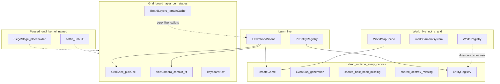

# FE Phaser architecture audit — dual-plane islands and unused board kernel

**Date:** 2026-09-06  
**Scope:** Phaser 4 game islands under `web/fusion-rpg-web/src/game/` — lawn, world, and the
`board-render` generic layer that was built to serve siege/battle. Stage hosts that create/destroy
those islands.  
**Out of scope:** World turn engine, React HUD/inspector catalog, Unity injector canvas, art, a
refactor program name or plan.  
**Status:** Research reference. **Audit only — no build authorized.** Verified against code
2026-09-06.

**Governed by:** [fe-game-foundation.md](fe-game-foundation.md) (DPLP) ·
[game-gui-principles.md](game-gui-principles.md) (GG-1, GG-11, GG-38) ·
[design/information-architecture.md](../design/information-architecture.md) ·
[world-map-runtime/spec-world-map-runtime.md](world-map-runtime/spec-world-map-runtime.md) ·
[base-defense/spec-board-render.md](base-defense/spec-board-render.md) ·
[base-defense-map.md](base-defense-map.md) (`siege-stage` / `battle-stage` pause rows) ·
[tasks/base-defense-todo.md](../../tasks/base-defense-todo.md) PAUSED annotations ·
`package.json` `"phaser": "^4.2.1"`.

**Why this file exists.** Owner asked whether the game FE Phaser architecture is scattered and
unreusable across scenes. A same-day code survey already measured duplication and paused
`siege-stage` 21.3+ / all of `battle-stage` so a third parallel stack would not land
([tasks/base-defense-todo.md](../../tasks/base-defense-todo.md) ~1045–1091). This audit re-verifies
those counts against HEAD, separates **locked dual-plane lifetime** from **accidental kernel clone**,
and names seams a later `/idea` can plan against — without inventing a second generic layer beside
`src/game/board/`.

---

## DESIGN-GATE §5 checklist (this session)

```
[x] I identified the subsystem(s) this touches.
    — FE game foundation (DPLP), world-map Phaser plane, player UI stage lifetime,
      base-defense board-render / paused siege-stage & battle-stage, standalone web capability.
[x] I read every doc in the §1 row(s) for those subsystems, this session.
    — software-architecture · decisions (Game GUI / Standalone-first / Lawn projector grep) ·
      fe-game-foundation · game-gui-principles · design/README · information-architecture ·
      world-map-runtime-ideal · spec-world-map-runtime (folder/lifetime/systems) ·
      world-map-runtime-map · standalone-rpg-map · spec-board-render · base-defense-map pause rows ·
      base-defense-todo PAUSED headers. Phaser 4.2 lifecycle via phaser-core skill.
[x] I checked decisions.md for a lock covering this.
    — Game GUI (stage+layers); Standalone-first; Lawn projector (Phaser 4 observe); board-render
      Decision 40 (grid layer serves siege AND battle — not world map).
[x] Every factual claim cites file:line (or path + measured LOC from this pass).
[x] I verified claims against CODE, not comments.
[x] I read the surrounding section of every rule I quoted.
[ ] I tested (not assumed) any constraint I am reporting — "moves goldens",
    "needs sign-off", "breaks X" — and said what I ran.
    — Honest gap: did not re-run `npm run check:bundle` or Playwright this session.
      Bundle claims cite prior `tech-stack.md` / board-render task evidence and `routes.tsx` lazy
      imports only.
[x] Nothing contradicts a §2 invariant, or I named the contradiction explicitly.
    — No contradiction proposed. Wrong-fix callouts (global Game; GridSpec-for-world) are
      rejected, not recommended.
[x] Corrections are propagated to prose, Structure, Testing, Boundaries, map, and tasks.
    — N/A for an audit-only deliverable. Cross-link from fe-game-foundation Implementation status.
```

**Honest unread / unrun:** full [world-map-program.md](world-map-program.md) (turn engine — out of
Phaser scope); full [spec-world-map-gaps.md](world-map-runtime/spec-world-map-gaps.md) (program marked
complete); full [spec-siege-stage.md](base-defense/spec-siege-stage.md) /
[spec-battle-stage.md](base-defense/spec-battle-stage.md) interiors (pause headers + map rows
suffice); live `check:bundle` / Playwright this session.

---

## 1. Executive verdict

**The scatter instinct is measured and correct.** Lawn and world each own a full Phaser island
(camera, sync, registry, pick, React host, destroy checklist). The only genuinely shared *runtime*
entry point is `createGame()` ([createGame.ts:49](../../web/fusion-rpg-web/src/game/createGame.ts)).

**Two corrections so a later refactor does not over-unify:**

1. **Wrong fix:** one app-lifetime `Phaser.Game` with `scene.start` between lawn and world. That
   fights GG-11 / D2 and the world-map lifetime lock (Game created on entering a stage, destroyed on
   leaving it; lawn Game and world Game never coexist —
   [spec-world-map-runtime.md](world-map-runtime/spec-world-map-runtime.md) §Lifetime).
2. **Wrong reuse:** stuffing the **world map** into `GridSpec` / `BoardLayers` / cell `bindCamera`.
   World is a pan/zoom **graph** island. Lawn `ensureGrid` and world `drawPlaceholderGrid` look
   related; they are not the same problem.
   [spec-board-render.md](base-defense/spec-board-render.md):15–17 still says the FE has “exactly one
   Phaser integration … lawn-shaped” — **stale after the world Phaser island shipped 2026-09-06**.

**Two kernels, not one:**

| Kernel | Consumers | Candidate code (do not rewrite first) |
|---|---|---|
| **Island runtime** (every canvas stage) | lawn, world, later siege/battle/delve | `createGame`, destroy checklist, generation-scoped bus, React host buffer/resize, `EntityRegistry` |
| **Grid board layer** (cell stages only) | lawn (retrofit), siege, battle | `GridSpec`, `pickCell`, `BoardLayers`, `terrainCache`, `bindCamera` contain-fit, `keyboardNav`, `visualMapping` — **already built**, mostly unwired |

**Sharpest finding:** `board-render` was built to *be* the shared grid fix, then left mostly
test-only. The intended kernel is **itself part of the scatter** — a well-tested fourth
implementation sitting beside two live ones. Only the contain-fit camera bridge is live in a real
scene (`LawnWorldScene` → `bindCamera`).

**Paused, not cancelled:** `siege-stage` 21.3+ and all of `battle-stage` 22.x
([base-defense-map.md:118](base-defense-map.md), [base-defense-map.md:123](base-defense-map.md);
[tasks/base-defense-todo.md](../../tasks/base-defense-todo.md) ~1045–1091). Resume only after a
refactor program **names what those stages build against**.

---

## 2. As-built map



### Folder shape (verified)

```text
web/fusion-rpg-web/src/
  game/                          # Phaser island (RT-09 / folder law)
    EventBus.ts                  # lawn:* AND world:* maps; shared allocGameGeneration
    createGame.ts                # generic factory
    createLawnGame.ts            # BootScene + LawnWorldScene + destroyLawnGame
    createWorldGame.ts           # WorldMapScene only + destroyWorldGame
    camera/bindCamera.ts         # contain-fit — live in lawn only
    entities/EntityRegistry.ts   # generic — live only via PtrEntityRegistry
    entities/PtrEntityRegistry.ts
    scenes/BootScene.ts          # lawn-only; hardcodes LawnWorldScene handoff
    scenes/LawnWorldScene.ts
    systems/*                    # lawn Sync / Layout / StatusFx / Pick / ActorHud
    board/*                      # board-render grid kernel (mostly test-only consumers)
    world/                       # world island (systems/objects/registry/scene)
  features/lawn/LawnGameHost.tsx # lawn host (not under stages/)
  stages/world/host/WorldGameHost.tsx
  stages/siege/SiegeStage.tsx    # shell placeholder — zero Phaser
```

DPLP folder law ([fe-game-foundation.md](fe-game-foundation.md) §8) put Phaser under `src/game/` and
lawn React under `features/lawn/`. World followed the same island rule under `game/world/` +
`stages/world/host/`. Host location is already inconsistent (features vs stages) — island-runtime
debt, not a plane-lock violation.

---

## 3. Scatter table — re-verified 2026-09-06

LOC = non-blank lines via `Measure-Object -Line` on HEAD. Prior same-day notes were approximate;
**code wins**.

| Concern | Lawn | World | Shared? | Measured |
|---|---|---|---|---|
| Camera | `bindCamera.ts` **80** | `worldCameraSystem.ts` **236** + `worldCameraMath.ts` **51** = **287** | No | Prior note ~91 / ~313 — close |
| Grid/board paint | `LawnWorldScene.ensureGrid` ([LawnWorldScene.ts:203](../../web/fusion-rpg-web/src/game/scenes/LawnWorldScene.ts)) | `WorldMapScene.drawPlaceholderGrid` ([WorldMapScene.ts:224](../../web/fusion-rpg-web/src/game/world/scenes/WorldMapScene.ts)) | No | Plus **third** `BoardLayers`/`terrainCache` — **zero production importers** |
| Entity sync | `SyncFromModelSystem.ts` **477** | `syncWorldSystem` **300** + `worldOverlaySystem` **335** + `worldOverlayPlan` **429** = **1064** | No | Prior ~510 / ~1150 |
| Registry | `PtrEntityRegistry` wraps `EntityRegistry` | `WorldRegistry` — three hand-rolled `Map`s | No | World never imports `EntityRegistry` |
| Pick/input | `PickSystem.ts` **91** | `worldPickSystem` **185** + `worldPickHit` **79** + `worldPickCoords` **48** = **312** | No | Prior ~100 / ~354 |
| React host | `LawnGameHost.tsx` **167** | `WorldGameHost.tsx` **258** | No | Same resize / buffer-until-ready / generation pattern |
| Factory | `createLawnGame` → `createGame` | `createWorldGame` → `createGame` | **`createGame` only** | Production callers of `createGame(`: exactly those two wrappers |

**Destroy checklist cloned:** `destroyLawnGame` ([createLawnGame.ts:26–48](../../web/fusion-rpg-web/src/game/createLawnGame.ts)) and `destroyWorldGame` ([createWorldGame.ts:30–47](../../web/fusion-rpg-web/src/game/createWorldGame.ts)) — tweens → named scene `shutdown` → bus `*:destroyed` → `game.destroy(true)`.

**Bus:** [EventBus.ts](../../web/fusion-rpg-web/src/game/EventBus.ts) keeps **separate** `lawnListeners` / `worldListeners` maps on purpose (crosstalk ban); only `allocGameGeneration()` is shared ([EventBus.ts:174–178](../../web/fusion-rpg-web/src/game/EventBus.ts)).

---

## 4. Stage matrix

| Stage | Route | Phaser today | Kernel needed | Blocker to canvas |
|---|---|---|---|---|
| Sanctum | `#/sanctum` | None | — | — |
| World | `#/world` | `WorldMapScene` via `WorldGameHost` | Island runtime (graph camera/overlays stay world-specific) | — |
| Lawn | `#/lawn/{matchKey}` | `BootScene` → `LawnWorldScene` via `LawnGameHost` | Island + **grid** (retrofit) | — |
| Battle | `#/battle/{id}` declared | **Unbuilt** | Island + **grid** (`board-render` Decision 40) | PAUSED — [base-defense-todo.md](../../tasks/base-defense-todo.md) 22.x |
| Siege | `#/siege/:siegeId` | Shell only (`SiegeStage.tsx` placeholder) | Island + **grid** | PAUSED at 21.3 — same todo ~1045 |
| Delve | `#/delve/{id}` IA stub | None | TBD (own stage; not board-render Decision 40) | Not in this audit’s resume condition |

**Resume condition (from the pause record):** a cross-program Phaser refactor exists and **names** the
island-runtime + grid-layer APIs siege/battle must call — not “copy world” or “copy lawn” by feel.

---

## 5. `board-render` inventory (built / wiring / gap)

Source of intent: [spec-board-render.md](base-defense/spec-board-render.md) §1 five extractions + §2–§5.
Module closed 2026-09-06 with green unit tests; most pieces were proven **standalone** rather than
retrofit into `LawnWorldScene` (see board-render task evidence in
[tasks/base-defense-todo.md](../../tasks/base-defense-todo.md) module 20).

| File | Intent | Live production callers | Status |
|---|---|---|---|
| `createGame.ts` (**47** LOC) | Injected scene list | `createLawnGame.ts:23`, `createWorldGame.ts:21` | **Built + wired** |
| `EntityRegistry.ts` (**52**) | Generic key/record map | Only via `PtrEntityRegistry` | **Built + wired (lawn)**; world ignores it |
| `PtrEntityRegistry.ts` (**45**) | Lawn wrapper | Lawn scene + systems | **Built + wired** |
| `bindCamera.ts` (**80**) | Contain-fit, model→Phaser write-only | `LawnWorldScene.ts:167`; `gridMath` imports `computeCameraFit` | **Built + wired (lawn)** |
| `GridSpec.ts` (**58**) | Rows/cols/terrain data | `gridMath.ts:3` (`makeGridSpec` for pick) | **Built + partial wire** via lawn adapter |
| `pickCell.ts` (**24**) | Pointer → cell | `gridMath.worldToCell` ([gridMath.ts:27–38](../../web/fusion-rpg-web/src/game/gridMath.ts)) | **Built + wired** through lawn adapter |
| `BoardLayers.ts` (**35**) | terrain→structures→units→overlays | **None** (tests only) | **Built, unwired** |
| `terrainCache.ts` (**66**) | Paint once per `GridSpec` ref | **None** (tests only) | **Built, unwired** |
| `keyboardNav.ts` (**76**) | Arrows + confirm | **None** (tests only); lawn pick is pointer-only | **Built, unwired** |
| `visualMapping.ts` (**16**) | kind → descriptor map | **None** (tests only) | **Built, unwired** |
| `WorldRegistry.ts` (**54**) | sector/lane/force maps | World scene + systems | **Built + wired** — does **not** compose `EntityRegistry` |

**Lawn adapter seam:** `gridMath.ts` already delegates cell pick to `pickCell` + `makeGridSpec` and
camera fit math to `computeCameraFit`. The lawn scene still paints the checkerboard in
`ensureGrid` instead of `BoardLayers`/`terrainCache`, and never calls `wireKeyboardNav`.

**Spec success criteria vs reality:**

| Criterion ([spec-board-render.md](base-defense/spec-board-render.md) §Success) | Today |
|---|---|
| Lawn byte-identical after extractions | Factory/registry/camera/pick extracted; **layers/terrain/keyboard not in the live scene** |
| Generic layer imports nothing lawn-specific | Hold for `board/*` files (import-scan tests) |
| Proven by **two** callers (Decision 40) | **Zero** live board consumers of `BoardLayers`/`terrainCache`; battle/siege paused |
| Entry chunk / Phaser lazy | Stage routes are `lazy()` in `routes.tsx`; live `check:bundle` **not re-run this session** |

---

## 6. Phaser 4.2 lifecycle notes

Pinned major: `"phaser": "^4.2.1"` ([package.json:33](../../web/fusion-rpg-web/package.json)). Do not
rewrite as Phaser 3.

| Topic | Lawn | World | Risk |
|---|---|---|---|
| Boot | `BootScene` preloads placeholder, `scene.start("LawnWorldScene")` ([BootScene.ts:17–20](../../web/fusion-rpg-web/src/game/scenes/BootScene.ts)) | No Boot (spec: framed placeholders in scene; D10) | Boot hardcodes lawn handoff — not reusable |
| Generation | `init(data)` sets generation ([LawnWorldScene.ts:103–105](../../web/fusion-rpg-web/src/game/scenes/LawnWorldScene.ts)) | Set in `create()` from registry ([WorldMapScene.ts:39–40](../../web/fusion-rpg-web/src/game/world/scenes/WorldMapScene.ts)) | Prefer `init` for restart hygiene |
| Registries | `private ptrRegistry = new PtrEntityRegistry()` class field ([LawnWorldScene.ts:82](../../web/fusion-rpg-web/src/game/scenes/LawnWorldScene.ts)) | `private worldRegistry = new WorldRegistry()` ([WorldMapScene.ts:27](../../web/fusion-rpg-web/src/game/world/scenes/WorldMapScene.ts)) | Constructor-once fields + incomplete `init` reset = classic Phaser restart-state bug if a scene is restarted without destroy |
| HUD scene | None — React owns chrome (DPLP §9) | None — React owns chrome | Correct; do not add Phaser `UIScene` for Almanac |
| Parallel scenes | Single world scene after Boot | Single `WorldMapScene` | No `launch` HUD (intentional) |

---

## 7. Plane locks

| Lock | Hold? | Evidence |
|---|---|---|
| Phaser never owns HTTP/SignalR Intent path | **Hold** (Intent stays React → `lib/bus`) | DPLP §6–§7 |
| Phaser under `src/game/` | **Hold** | Folder tree above |
| World `game/world` bans React / `@/lib/bus` / `*Dto` | **Hold** | [importGuard.test.ts](../../web/fusion-rpg-web/src/game/world/importGuard.test.ts) |
| Lawn Phaser free of `@/lib/bus` | **Fail** | `LawnWorldScene.ts:19` `subscribeIconEpoch`; `SyncFromModelSystem.ts:7` / `iconUrl.ts:1–2` `apiBase` + icon epoch |
| Lawn Phaser free of `@/features/lawn` | **Documented bend** | Scene + systems import view-model / sync gate / pick budget — world-map-runtime **copy law** allows view imports; stricter than DPLP “no React in game/” but looser than “game never imports features” |
| System allow-list (lawn Sync/Layout/Fx/Pick) | **Hold** | [LawnWorldScene.ts:75–77](../../web/fusion-rpg-web/src/game/scenes/LawnWorldScene.ts) comment + update pipeline |
| World four systems (Sync/Camera/Pick/Overlay) | **Hold** | [WorldMapScene.ts:19–22](../../web/fusion-rpg-web/src/game/world/scenes/WorldMapScene.ts) |
| GG-11 stage survives layers | **Hold** (tested) | Lawn/World stage tests assert Game not recreated on panel open |
| No FE prediction | **Hold** | DPLP RT-15; `board-render` restates; `noClientPrediction.test.ts` tripwire on `board/` + `camera/` |

World import guard without a lawn equivalent means lawn plane leaks can grow unnoticed.

---

## 8. Finding register

Severity: **lock** (must not break) · **wiring** (built but inert / cloned) · **gap** (missing) ·
**stale doc**.

| ID | Severity | Finding |
|---|---|---|
| F1 | wiring | Lawn/world clone host, destroy, camera, sync, registry, pick — only `createGame` shared |
| F2 | wiring | `BoardLayers` / `terrainCache` / `keyboardNav` / `visualFor` have **zero** production importers |
| F3 | wiring | `WorldRegistry` ignores `EntityRegistry` despite the generic existing for this purpose |
| F4 | wiring | `board-render` “closed” as a module while Decision 40’s two consumers (siege/battle) are paused and lawn never adopted layers/terrain/keyboard |
| F5 | gap | No shared `PhaserGameHost` / shared destroy helper — each island reimplements buffer-until-ready |
| F6 | gap | Lawn has no `importGuard` analogue for `@/lib/bus` |
| F7 | gap | BootScene is lawn-hardcoded; world skipped Boot by design — no generic Boot for cell stages |
| F8 | stale doc | `decisions.md` Lawn projector row still says **Implementation deferred**; [fe-game-foundation.md](fe-game-foundation.md) Implementation status says W6–W7 **shipped** |
| F9 | stale doc | [spec-board-render.md](base-defense/spec-board-render.md):15–17 “exactly one Phaser integration” — false after world island |
| F10 | lock | Do not merge lawn+world into one Game; do not force world onto `GridSpec` |
| F11 | lock | Siege/battle PAUSED pending named kernel — [tasks/base-defense-todo.md](../../tasks/base-defense-todo.md) ~1045–1091 |
| F12 | wiring | Host paths split: `features/lawn/LawnGameHost` vs `stages/world/host/WorldGameHost` |

---

## 9. Built / wiring / gap (summary tables)

### Island runtime

| Piece | Built | Wired | Gap |
|---|---|---|---|
| `createGame` | Yes | Lawn + world | Siege/battle not yet |
| Generation bus | Yes (dual maps) | Yes | Shared factory OK; keep maps separate |
| Destroy checklist | Yes ×2 | Yes | Extract one helper |
| React host buffer/resize | Yes ×2 | Yes | Shared hook/component |
| `EntityRegistry` | Yes | Lawn only | World compose |

### Grid board layer

| Piece | Built | Wired | Gap |
|---|---|---|---|
| `GridSpec` / `pickCell` | Yes | Via `gridMath` | Lawn scene still owns paint |
| `bindCamera` contain-fit | Yes | Lawn | Siege/battle |
| `BoardLayers` / `terrainCache` | Yes | **No** | Lawn retrofit first |
| `keyboardNav` | Yes | **No** | Lawn (pointer-only today) |
| `visualMapping` | Yes | **No** | Callers supply maps |

### World graph (not grid)

| Piece | Built | Wired | Gap |
|---|---|---|---|
| Pan/zoom/edge-scroll camera | Yes | World | Do not replace with contain-fit |
| Pin/lane/force factories | Yes | World | — |
| Overlay/lens systems | Yes | World | Fifth system needs ADR/spec sentence |

---

## 10. Refactor seams (input to a later `/idea` — not a plan)

A later program should be **cross-stage**, not a `base-defense` module (spans lawn / world / siege /
battle). **Before inventing APIs, open the existing `src/game/board/` and `src/game/camera/` files.**

### Suggested order

1. **Island runtime extraction** — shared host (generation, buffer-until-ready, ResizeObserver,
   ready flush), shared `destroyGame({ sceneKey, emitDestroyed })`, keep separate `lawn:*` /
   `world:*` bus maps.
2. **Lawn grid retrofit** — replace `ensureGrid` with `BoardLayers` + `terrainCache`; optionally
   wire `keyboardNav`; keep lawn byte-identical (spec acceptance bar). This gives `board-render` its
   first *live* consumer.
3. **World registry compose** — `WorldRegistry` internals on `EntityRegistry` (or three typed
   registries); **do not** adopt `GridSpec`.
4. **Camera adapters** — two named adapters (contain-fit vs pan/zoom), not one class that pretends
   they are the same.
5. **Name the APIs** siege 21.3 / battle 22.x must import — then unpause those modules.

### Explicit non-goals

- Phaser `UIScene` for Almanac / inspector chrome  
- One global `Phaser.Game` for all stages  
- Phaser 3 migration  
- FE simulation / client prediction  
- A second generic folder beside `src/game/board/`  
- Forcing the world map through `GridSpec` / cell layers  

### What “reusable for multiple scenes” means here

Reusable **island runtime + (for cell stages) grid layer**, each stage supplying scenes, systems,
and view-model events. Not one Scene Manager owning lawn and world at once.

---

## 11. Evidence index (primary paths)

| Path | Role |
|---|---|
| [createGame.ts](../../web/fusion-rpg-web/src/game/createGame.ts) | Shared factory |
| [createLawnGame.ts](../../web/fusion-rpg-web/src/game/createLawnGame.ts) / [createWorldGame.ts](../../web/fusion-rpg-web/src/game/createWorldGame.ts) | Thin wrappers + cloned destroy |
| [EventBus.ts](../../web/fusion-rpg-web/src/game/EventBus.ts) | Dual bus + generation |
| [LawnWorldScene.ts](../../web/fusion-rpg-web/src/game/scenes/LawnWorldScene.ts) | Lawn island |
| [WorldMapScene.ts](../../web/fusion-rpg-web/src/game/world/scenes/WorldMapScene.ts) | World island |
| [LawnGameHost.tsx](../../web/fusion-rpg-web/src/features/lawn/LawnGameHost.tsx) / [WorldGameHost.tsx](../../web/fusion-rpg-web/src/stages/world/host/WorldGameHost.tsx) | Cloned hosts |
| [board/](../../web/fusion-rpg-web/src/game/board/) | Grid kernel |
| [SiegeStage.tsx](../../web/fusion-rpg-web/src/stages/siege/SiegeStage.tsx) | Placeholder — no Phaser |
| [tasks/base-defense-todo.md](../../tasks/base-defense-todo.md) | Pause SSOT for siege/battle |

---

## 12. Next step (not this audit)

**Idea captured 2026-09-06:** [phaser-kernel-ideal.md](phaser-kernel-ideal.md) — two kernels (island
runtime + grid board), dual-track (new path tested before old clones retire). Next is `/spec` once
the owner graduates it. Until that map **names** APIs, leave `siege-stage` 21.3+ and `battle-stage`
22.x paused.

**Prior art:** [../research/phaser-architecture-prior-art-2026-09-06.md](../research/phaser-architecture-prior-art-2026-09-06.md)
