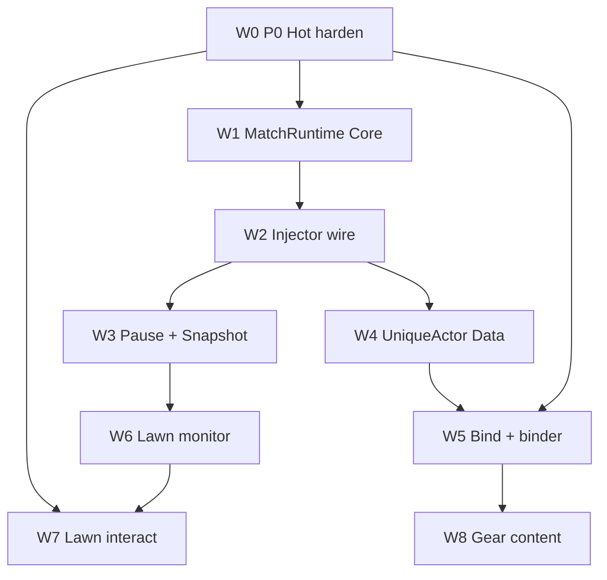

# Implementation roadmap + checklist (overlay / dual FSM / lawn FE)

**Status:** Docs checklist only — **no wave implemented from this file yet.** All slice rows `pending` until a code plan ships them.  
**Authority:** this file + linked SSOTs. Specs stay SSOT for design; this file is **order + prove gates**.  
**Related:** [overlay-control-loops.md](overlay-control-loops.md), [p0-hot-path-hardening.md](p0-hot-path-hardening.md), [match-runtime.md](match-runtime.md), [unique-actor-runtime.md](unique-actor-runtime.md), [lawn-projector.md](lawn-projector.md), [fe-game-foundation.md](fe-game-foundation.md), [../research/architecture-stress/00-index.md](../research/architecture-stress/00-index.md), [../database/persistence-implement-checklist.md](../database/persistence-implement-checklist.md) (Data already live).

**Workstream rule for *this* doc’s creation:** markdown only. Executing a wave = separate implementation plan.

---

## One-line map

| Wave | Outcome |
|---|---|
| W0 | P0 Hot hardening (withdraw / Admit / guards / hit surface / rehydrate) |
| W1–W3 | MatchRuntime FSM + injector wire + pause + Snapshot observe |
| W4–W5 | UniqueActor Data FSM + bind/binder/ops |
| W6–W7 | FE game foundation docs (W6-0) → Phaser lawn monitor → Intent interact |
| W8–W9 | Gear/specimen XP + Secondary content kit |
| W10–W12 | Dual-host adapters + guards expand + stress P2–P3 triage |

```text
W0 → W1 → W2 → W3
         ↘ W4 → W5 → W8
W0 ────────↗︎ W5
W3 → W6-0 → W6 → W7 (needs W0 Admit)
W2 → W9
W10 / W11 ongoing; W12 product-pick
```



---

## Full layer inventory

Every row is **Shipped** | **Wave** | **Triage** | **Anti**. Do not invent layers outside this list without updating [decisions.md](decisions.md).

### A. Runtime / game loop (sim + live)

| Layer | Class | Notes |
|---|---|---|
| Unity Board physics | Shipped | Engine SSOT |
| Capture Emit + ingest Channel | Shipped | [data-flow.md](data-flow.md) |
| Capture fps / batch flush | Shipped | 120fps design |
| SimEngine (`FUSIONRPG_SIM=1`) | Shipped | Not player zip |
| Sim vs injector mutual exclusion | Shipped | 409 when live |
| Test probes reset/snapshot/probe | Shipped | |
| MatchValidator.Replay | **W1** | Offline fold |
| SimEngine → MatchRuntime (A8) | **W1/W2** | No second living SSOT |

### B. Hot overlay (Effects + stats)

| Layer | Class | Notes |
|---|---|---|
| StatSystem + EntityApply single writer | Shipped | `guard-single-writer` |
| Apply scope match/type/entity | Shipped | |
| EffectBag FA1–FA9 sealed | Shipped | Contract v1 frozen |
| Secondary Grant-only law | Shipped (law + W9 content) | Plugins + offline scenarios |
| Effect catalog push / revision | Shipped partial | |
| P0 withdraw entity grants on die | **W0-A** | |
| P0 Admit before FA4/Intent Create | **W0-B** | |
| P0 `instance:` Resolve guard | **W0-C** | |
| P0 FT* = TakeDamage + melee | **W0-D** | shipped |
| P0 rehydrate grants on hello | **W0-E** | shipped (session); ActiveBound W5+ |
| ICD / proc budget | Triage **W12** | B-PROC-BUDGET |
| Status method vs float VFX | Triage **W12** | B-STATUS-LOOK |
| Alt damage sinks / DEF bypass | Shipped (**W11-C** inventory) | B-ALT-DAMAGE |
| LimHealth vs Writer LIVE | Shipped (**W11-B** Bend; gate off) | B-LIMHEALTH |
| HitLand coverage | Triage **W12** | B-HITLAND |
| DoT lucky budget | Triage **W12** | B-DOT-BUDGET |
| guard-secondary-no-unity | Shipped (**W11-A**) | |
| `player:` ownerKey real filter | Reserved | match stub today |

### C. Dual FSMs

| Layer | Class | Notes |
|---|---|---|
| MatchRuntime FSM | **W1–W3** | [match-runtime.md](match-runtime.md) |
| BoardProjection spawn/die; place ignored | **W1** | |
| CapPolicy | **W0-B** interim → **W1** | bullets −1 until die |
| UniqueBindings | **W5** | |
| Effect ClearAll Starting/Ending | **W2** | |
| DebugSession facet | **W2** | |
| Pause NotifyPaused | **W3** | B-PAUSE-WIRE |
| MatchSnapshot observe API | **W3** | not Admit |
| debug.run.cap | **W0-B / W3** | observe |
| CheatState.Living* migration | **W2** | |
| UniqueActor FSM | **W4–W5** | [unique-actor-runtime.md](unique-actor-runtime.md) |
| rpg_unique_* tables | **W4** | Data only |
| Deploy Intent + correlation | **W4** | B-DEPLOY-IDEMP |
| Bind timeout / stale ActiveBound / Storage-bound | **W5** | |
| instance→entity binder | **W5** | |
| Absolute spawn loadout | **W5** | with deploy |
| Specimen XP / equipment content | **W8** | |
| Type RpgProgression | Shipped | orthogonal |

### D. Control loops (locks)

| Layer | Class | Notes |
|---|---|---|
| Hot / Cold / Intent | Spec locked | [overlay-control-loops.md](overlay-control-loops.md) |
| Reject Server-on-hit RNG | Locked | workshop |
| Stress eval pack | Docs done | architecture-stress |

### E. Middle layer + durable

| Layer | Class | Notes |
|---|---|---|
| PvzStats / Activity / Intent | Shipped | |
| Type XP from Activity | Shipped | power handlers deferred |
| Luck → pvz.spawn.extra | Shipped pattern | |
| FusionRpg.Data + guard-dal | Shipped | persistence checklist |
| Hot/media/archive + Storage | Shipped | |
| Deep cold query / auto GC | Anti / product ADR | stubs |
| Cap config copy-on-start (Cheats) | **W2/W3** | MatchRuntime |

### F. FE / launcher / hosts

| Layer | Class | Notes |
|---|---|---|
| React Almanac + bus | Shipped | [../web/spec.md](../web/spec.md) |
| Lawn Phaser 4 projector | **W6–W7** | [lawn-projector.md](lawn-projector.md), [fe-game-foundation.md](fe-game-foundation.md) |
| FE game foundation (docs) | **W6-0** | [fe-game-foundation.md](fe-game-foundation.md) |
| LawnViewModel fold | **W6** | |
| Lawn monitor | **W6** | |
| Lawn Intent interact | **W7** | needs W0 Admit |
| Unique roster FE | **W8-C** | shipped |
| Mid-run equip UX | Triage **W12** | B-EQUIP-UX |
| Launcher + DropIntoGame | Shipped | |
| Dual-host artifacts | Shipped (**W10**) | dual-host-roadmap |
| Game profile Bridges | Shipped (**W10**) | game-versioning |
| Contracts + hand TS | Shipped pattern | |

### G. Validators / guards / CI

| Layer | Class | Notes |
|---|---|---|
| guard-dal / guard-single-writer | Shipped | |
| Core / Guard / Web tests | Shipped | |
| MatchRuntime Replay tests | **W1** | |
| No MatchRuntime→Data ProjectReference | **W1** | |
| instance: architecture test | **W0-C** | |
| FE no rollups-as-living | **W6** | |
| Secondary no Unity guard | Shipped (**W11-A**) | |
| Activity kill dedupe harden | Triage **W12** | B-KILL-DEDUPE |

### H. Capture / match identity

| Layer | Class | Notes |
|---|---|---|
| matchKey / runs mapping | Shipped | |
| match.result vs board.end for XP | Shipped rule | |
| spawn_stats / entities observe | Shipped | |
| Icon / almanac media | Shipped | |

---

## Anti-list (never treat as missing roadmap layers)

- Server-owned on-hit proc RNG  
- Second Unity physics / HP shadow world in MatchRuntime  
- AdmitSpawn from SQLite `entities` or Activity rollups  
- Secondary → Unity / StatusExecutor shortcuts  
- Multi-board `MatchRuntimeHub` (v1 non-goal)  
- Replacing type RpgProgression PK with specimens  
- Auto archive GC / deep cold Log fan-in (needs new product decision)  
- Auth / OpenAPI generator  

---

## Wave checklists

Mark `[x]` only when that wave’s **prove gate** passes in a code workstream.

### W0 — P0 Hot hardening

**SSOT:** [p0-hot-path-hardening.md](p0-hot-path-hardening.md), stress [05-p0-workshop-verdict.md](../research/architecture-stress/05-p0-workshop-verdict.md)  
**Depends:** Effects sealed  
**Order:** A → C → B → D → E

| ID | Slice | Prove gate | Status |
|---|---|---|---|
| W0-A | Withdraw entity grants on die (+ ForgetEntity) | Unit + LIVE: no FA1 leak on ptr reuse | shipped (unit); LIVE operator |
| W0-B | Admit/CapPolicy before FA4 / our Create | Cap reject; vanilla wave uncapped | shipped (unit); LIVE operator |
| W0-C | Reject `instance:` in Hot Resolve | Core.Tests fail if matches | shipped (unit) |
| W0-D | FT* SSOT TakeDamage + melee; adapter align | Docs + adapter path | shipped (docs + adapter) |
| W0-E | Rehydrate grants on injector hello | Disconnect → hello → bag restored | shipped (session grants) |

**Out:** UniqueActor schema, pause wire, Server RNG.  
**Wave status:** **Closed** (unit/docs). Deferred Out → Next/Later/Ignore map: [p0-hot-path-hardening.md](p0-hot-path-hardening.md) § W0 closed. **Next code wave:** W1.

---

### W1 — MatchRuntime Core + offline validator

**SSOT:** [match-runtime.md](match-runtime.md), [effect-testing.md](effect-testing.md) A8  
**Depends:** W0-B interim CapPolicy absorbable here  
**Sim loop:** Core fold API ready for live Emit (W2) and Replay

| ID | Slice | Prove gate | Status |
|---|---|---|---|
| W1-A | MatchRuntime + MatchPhase + MatchState facets | Unit phase transitions; mid-match `board.start` ignored | shipped (unit) |
| W1-B | BoardProjection spawn/die; place ignored | Apply-sequence unit tests | shipped (unit) |
| W1-C | CapPolicy + GateResult reasons | Admit matrix tests | shipped (unit) |
| W1-D | MatchValidator.Replay → Snapshot | Deterministic Replay | shipped (unit) |
| W1-E | Guard: no `FusionRpg.Data` ProjectReference | Guard test / grep | shipped (unit) |
| W1-F | SimEngine synthetic Emit **or** wrap (not second SSOT) | Offline board fold OK | shipped (unit) |

**Out:** Injector wire **shipped W2**. Pause + Snapshot **shipped W3**. UniqueActor Data+Server FSM **shipped W4**. UniqueBindings / binder / ops **shipped W5**. See [deferred map](match-runtime.md#w1-closed--deferred-map-scope-creep-lock). **Build next:** pre-play lawn observe.

---

### W2 — Injector MatchRuntime wire + migration

**SSOT:** match-runtime migration §, overlay Hot path  
**Depends:** W1  
**Sim loop:** Emit → `Apply` on main thread; async events still observe-only

| ID | Slice | Prove gate | Status |
|---|---|---|---|
| W2-A | Emit → MatchRuntime.Apply | LIVE board.start→InMatch | shipped |
| W2-B | FA4/Intent uses TryAdmitSpawn (replace interim) | Cap + phase.paused ready | shipped |
| W2-C | Effect ClearAll on Starting/Ending | Grants cleared on match edges | shipped |
| W2-D | CheatState.Living* → BoardProjection writers | No parallel living maps | shipped |
| W2-E | CapPolicyConfig RAM (+ optional Cheats copy-on-start) | Never Data per Admit | shipped |
| W2-F | DebugSession facet policy | Documented sync | shipped |

---

### W3 — Pause + Snapshot observe

**SSOT:** match-runtime pause §; overlay observe≠control  
**Depends:** W2

| ID | Slice | Prove gate | Status |
|---|---|---|---|
| W3-A | NotifyPaused / match.pause capture | Admit rejects phase.paused | shipped |
| W3-B | MatchSnapshot GET and/or SignalR | FE can poll; lag OK | shipped (poll `debug.snapshot` nested `match`) |
| W3-C | optional debug.run.cap on Admit reject | events observe | shipped |

---

### W4 — UniqueActor Data + Server FSM

**SSOT:** [unique-actor-runtime.md](unique-actor-runtime.md)  
**Depends:** W2–W3; Data DAL  
**Requires W0-E before unique gear LIVE prove**

| ID | Slice | Prove gate | Status |
|---|---|---|---|
| W4-A | DDL `rpg_unique_actors` (+ equipment/stat_mods stubs OK) | Migrator + Data tests | shipped |
| W4-B | UniqueActor phase machine Server | Roster↔Deploying↔… | shipped |
| W4-C | Deploy Intent + idempotent correlationId | No double Create | shipped |
| W4-D | Recovering on die/end observe | Phase returns Roster | shipped |

**Out:** FE roster polish (W8).

---

### W5 — Bind + binder + ops

**SSOT:** unique-entity-effects, UniqueBindings  
**Depends:** W0-A, W4

| ID | Slice | Prove gate | Status |
|---|---|---|---|
| W5-A | MatchRuntime UniqueBindings | Pending→Bound→Cleared | shipped |
| W5-B | Binder `instance:` → `entity:{ptr}` at deploy | Hot Resolve never sees instance: | shipped |
| W5-C | Absolute loadout Writer on ptr only | No type-wide leak | shipped |
| W5-D | Bind timeout → Roster | No stuck Deploying | shipped |
| W5-E | Stale ActiveBound sweeper on Server boot | Crash recover | shipped |
| W5-F | Storage purge rejected while ActiveBound | API 4xx | shipped |

**Out:** FE roster **shipped W8-C** / equipment **shipped W8-A** / specimen XP **shipped W8-B**. **Build next:** pre-play lawn observe.

---

### W6-0 — FE game foundation (docs)

**SSOT:** [fe-game-foundation.md](fe-game-foundation.md)  
**Depends:** lawn-projector design accepted

| ID | Slice | Prove gate | Status |
|---|---|---|---|
| W6-0 | DPLP architecture + patterns + red-team invariants + cross-links | Doc review; no Phaser code | **shipped** |

**Out:** `phaser` npm, `#/lawn` route, Playwright, W6-A–D implement.

---

### W6 — Lawn projector monitor (Phaser 4)

**SSOT:** [lawn-projector.md](lawn-projector.md), [fe-game-foundation.md](fe-game-foundation.md), [../web/spec.md](../web/spec.md)  
**Depends:** W6-0; W3 Snapshot preferred; events fold Bend OK

| ID | Slice | Prove gate | Status |
|---|---|---|---|
| W6-A | Pure `LawnViewModel` fold (+ Vitest) | place≠living; die removes | **shipped** |
| W6-B | `#/lawn` + Phaser 4 island (bus only) | Mount/unmount; no fetch in scene | **shipped** |
| W6-C | Grid + icons + phase HUD + select inspector | Monitor stats/status | **shipped** |
| W6-D | FE living not from Activity rollups | Review / lint note | **shipped** |

**Out:** Intent buttons (**shipped W7**). **Build next:** pre-play lawn observe.

---

### W7 — Lawn interact

**SSOT:** lawn-projector interaction map; pvz-intent  
**Depends:** W0 Admit, W6

| ID | Slice | Prove gate | Status |
|---|---|---|---|
| W7-A | Spawn / status / debug enqueue via bus | Injector applies; Admit gates | **shipped** |
| W7-B | Select Bound → show instanceId when present | Links Cold observe | **shipped** |

**Out:** Full gear shop polish (W12 B-EQUIP-UX). Unique-gear interact LIVE after W0-E + W5. **Build next:** pre-play lawn observe.

---

### W8 — Equipment + specimen XP + roster FE

**SSOT:** unique-actor reserved tables; Cold loop  
**Depends:** W5, W0-E

| ID | Slice | Prove gate | Status |
|---|---|---|---|
| W8-A | Equipment equip → grant templates push | Next hits see bag | **shipped** |
| W8-B | Specimen XP grain (not type PK) | Orthogonal to RpgProgression | **shipped** |
| W8-C | Roster FE | Deploy from UI | **shipped** |

**Out:** Full gear shop polish (W12). **Build next:** pre-play lawn observe.

---

### W9 — Secondary content kit

**SSOT:** effect-system Secondary law  
**Depends:** W2 ClearAll lifecycle

| ID | Slice | Prove gate | Status |
|---|---|---|---|
| W9-A | IEffectGrantPlugin OnMatchStart/Ending | Grant/Withdraw only | shipped |
| W9-B | Offline Secondary scenarios | sim/effect CI | shipped |

**Out:** UniqueActor loadout/owner plugin hooks. Secondary no-Unity **shipped W11-A**. **Build next:** pre-play lawn observe.

---

### W10 — Dual-host / game-version adapters

**SSOT:** [game-versioning.md](game-versioning.md), dual-host-roadmap  
**Depends:** as needed for packs

| ID | Slice | Prove gate | Status |
|---|---|---|---|
| W10-A | Profile Bridges health width / SetZombie arity | Correct pack DLL | shipped |
| W10-B | Melon/BepInEx DropIntoGame matrix | Never dual-load | shipped |

**Out:** BepInEx × 3.9 cell; new `pvzrh-4.x` profile; dual-load. Secondary no-Unity **shipped W11-A**. **Build next:** pre-play lawn observe.

---

### W11 — Guards expand + stress P1 leftovers

**SSOT:** stress [04-enhancement-backlog.md](../research/architecture-stress/04-enhancement-backlog.md) P1  
**Depends:** ongoing

| ID | Slice | Prove gate | Status |
|---|---|---|---|
| W11-A | Secondary no-Unity apply guard script | CI fail on refs | shipped |
| W11-B | LimHealth LIVE prove or document Bend | Checklist note | shipped (Bend; gate off) |
| W11-C | Alt damage sink inventory | Doc + optional capture | shipped (inventory; no new Harmony) |

**Out:** HitLand capture; DEF on Real/Body/Apply; UniqueActor loadout plugins; `SYS-LIMHEALTH-GATE` default on. **Build next:** pre-play lawn observe (W12 P2–P3 **not scheduled**).

---

### W12 — Stress P2–P3 triage (product pick)

| Seed | Topic | Status |
|---|---|---|
| B-PROC-BUDGET | Per-frame / onKill depth | triage |
| B-STACK-POLICY | match vs entity stack | triage |
| B-STATUS-LOOK | FA2 method path | triage |
| B-EQUIP-UX | Mid-run equip copy | triage |
| B-KILL-DEDUPE | Activity dedupe storms | triage |
| B-HITLAND | Ground hit coverage | triage |
| B-DOT-LUCKY | DoT proc budget | triage |
| B-BULLET-DIE | Bullet destroy before caps | triage |
| B-HYPNO-FILTER | Secondary hypno filter | triage |

Do not schedule W12 items without an explicit product pick. **Not scheduled** this workstream — next implement = **pre-play lawn observe** (HP / ATK / armor / status / tiles on `#/lawn`).

---

## Prove matrix (cross-cutting)

| Concern | Wave | Gate |
|---|---|---|
| Sim / live fold same kinds | W1–W2 | Replay + LIVE board.start |
| Run FSM | W1–W3 | Phase + Admit + pause |
| RPG UniqueActor FSM | W4–W5 | Deploy bind recover |
| FE lawn | W6–W7 | Fold tests + canvas + Intent |
| Validators | W0-C, W1-E, W11 | Guards green |
| Unique gear safe | W0 + W5 + W0-E | No grant leak; bag rehydrate |

---

## Execution notes

1. Persistence / DAL is **already complete** — do not reopen in this roadmap ([persistence-implement-checklist.md](../database/persistence-implement-checklist.md)).  
2. Foundation FA* opcodes stay frozen unless ADR.  
3. Implementing a wave = new plan citing this checklist row IDs.  
4. Update checkbox status in this file when a wave seals (optional hygiene).

---

## See also

- [decisions.md](decisions.md) — Overlay P0, MatchRuntime, UniqueActor, Lawn projector rows  
- [overview.md](overview.md) — module map  
