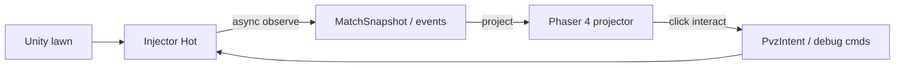

# Lawn projector — Phaser 4 FE mirror of a run (design spec)

**Status:** Design / reverse architecture only. **No Phaser code or `#/lawn` route in this workstream.**  
**Related:** [fe-game-foundation.md](fe-game-foundation.md) (runtime SSOT — DPLP / EventBus / systems), [overlay-control-loops.md](overlay-control-loops.md), [match-runtime.md](match-runtime.md), [unique-actor-runtime.md](unique-actor-runtime.md), [pvz-intent.md](pvz-intent.md), [web/spec.md](../web/spec.md), [protocol/events.md](../protocol/events.md).

Projection model + observe≠control live here. **Phaser runtime foundation SSOT:** [fe-game-foundation.md](fe-game-foundation.md) (**W6-0**). Implement W6-A–D after that foundation.

---

## 1. Purpose and non-goals

### Purpose

Provide a **perfect projection** of an in-progress run for RPG interaction: every lawn **cell (tile)**, plants/zombies on tiles, their **stats / status**, and click/tap affordances to **monitor**, **spawn**, **use items**, and related Intent/debug actions.

This GUI is the player-facing RPG lawn console — not a second game engine.

### Non-goals

| Non-goal | Why |
|---|---|
| Replace Unity Board / camera / physics | Unity remains physics SSOT |
| Hot AdmitSpawn / CapPolicy in the browser | MatchRuntime / injector only ([overlay-control-loops.md](overlay-control-loops.md)) |
| On-hit proc RNG or grant math in FE | Hot EffectBag only |
| Pixel-parity with Unity rendering | Almanac-quality projection is enough |
| Implementing Phaser / npm / routes here | Spec only |
| Shipping unique-gear lawn interactions before P0 hardening | Recommended gate: [p0-hot-path-hardening.md](p0-hot-path-hardening.md) |

---

## 2. Plane rules (light audit)



| FE must | FE must not |
|---|---|
| Project run phase + grid + entities (eventual consistency OK) | Be living-count SSOT or physics SSOT |
| Show stats/status from observe payloads | Roll freeze/heal procs |
| Enqueue Intent / debug mutations via `lib/bus` | Call AdmitSpawn or invent caps from Activity rollups |
| Map selected Bound unique → `instanceId` when present | Treat `ptr` as durable specimen id |

**Observe ≠ control:** lawn FE never waits on SQLite for interact enqueue; Server may reject Intent; projector stays eventual.

---

## 3. Projection model

### Grid

| Field | Notes |
|---|---|
| `rows` | 5 (Fusion adventure) |
| `cols` | **12** on canvas (plantable 0–9 + spawn lanes 10–11). Zombie cell uses Unity `Column`, not saturated `GetColumnFromX`. |
| Cell key | `(row, col)` integer |

### Occupant (per living entity)

| Field | Source |
|---|---|
| `ptr` | Capture hex |
| `side` | `plant` \| `zombie` (bullets optional layer — v1 lawn FE may omit or overlay) |
| `typeId` / `typeName` | Spawn/place payload |
| `row` / `col` | From spawn/place when present; zombies may be x-based — project to nearest col or “lane row only” with documented Bend |
| `hp` / `maxHp` | Latest dump / `entity.stats` / board-stats observe |
| `atk` | `attack` / `attackDamage` / `theAttackDamage` on spawn, `entity.stats`, board-stats |
| `armor` / `armorMax` | Unity armor/shield (`armor`, `theFirstArmorHealth`, plant `theShieldHealth`) — **not** overlay `defensePercent` |
| `armor2` / `armor2Max` | Zombie `theSecondArmorHealth` / Max (spawn dump / board-stats) |
| `speed` / `interval` | Zombie `theSpeed`; plant `thePlantAttackInterval` |
| `statusChips` | Butter / freeze / cold / poison / hypno from `zombie.status`, `zombie.hypno`, `debug.status.*`, `pvz.status.*` |
| `flags.hypnotized` | From `zombie.hypno` fold or spawn `isMindControlled` |
| `flags.mixed` / `unique` / `crashed` | `plant.mix` / `plant.unique` / `plant.crash` |
| `instanceId?` | When UniqueBindings observe ships |
| `selected` | FE-only UI state |

### Board view model (pure TS, testable)

```text
LawnViewModel {
  matchKey?, phase, revision,
  rows, cols,
  cells: Map<cellKey, Occupant[]>,
  orphans: Occupant[],
  tiles: Map<ptr, LawnTile>,         // grid.place / grid.die
  mowers / pets: Map<ptr, LawnMarker>,
  hand[], travelBuffs[],
  levelName?, result?, lastInvade?, lastAction?, lastHit?,
  economy?: { sun, money, points, wave, hugeWave, ... }
}
```

Phaser **renders** this model; it does not own fold logic. Cards / travel / result / last-hit are **inspector only**. No bullet sprites. No FE HP subtraction from `combat.hit`.

---

## 4. State sources (priority)

| Priority | Source | When |
|---|---|---|
| 1 | `MatchSnapshot` / board projection DTO (SignalR push or `GET`) | After MatchRuntime ships |
| 2 | Live `events` ring fold (spawn/die, status, grid, mower/pet, economy, result, cards/travel inspector) | Interim — documented **Bend** (lag, missing col) |
| 3 | REST run/spawn dumps for inspector panel | Cold inspect, not frame sync |

`#/lawn` **host** may `POST /api/debug/board-stats` while phase is InMatch so HP/ATK/armor stay fresh. Phaser scene stays bus-only (RT-08).

### Capture vs live vs fold

Injector **Emit** is not the same as `#/lawn` seeing it.

| Layer | What |
|---|---|
| Capture | Harmony `Emit(kind)` → persist SQLite |
| Live | SignalR `EventBatch` of **non-noisy** kinds only |
| Fold | `lawnProjectorFold` switch — previously ignored most live kinds |

**Noisy (SQLite only, not live, not folded):** `plant.damage`, `zombie.damage`, `bullet.init`, `bullet.place`, `item.drop`, `pet.xp`. Keep noisy — HP comes from spawn / `entity.stats` / board-stats poll.

**Live and folded:** spawn/die/place-hint, `zombie.hypno`, `zombie.status`, `debug.status.*`, `pvz.status.*`, `grid.*`, `mower.*`, `pet.spawn`, economy deltas, `match.result`/`invade`/`win`/`lose`, mix/unique/crash, cards/travel/last-action inspector, `stat.applied` stats copy, `combat.hit` as last-hit only.

**Not captured (hard out this wave):** pea `attackerPtr` on bullets; jala/kelp/garlic family; HitZombie/HitPlant (unsafe flag off). Overlay `defensePercent` is never Occupant armor.

**Banned as control input:** Activity rollups as living set; SQLite `entities` for Admit-like decisions.

Until MatchRuntime exists, the projector **folds spawn/die only** for membership (same rule as BoardProjection: **ignore `place` for living** — place may still update cell hint if spawn lacked col).

---

## 5. MatchPhase chrome (HUD)

Mirror observe phase labels (not FE-owned FSM):

| Phase | HUD |
|---|---|
| Idle | “No match” — grid empty / dimmed |
| Starting | Spinner / “Starting…” |
| InMatch | Live grid |
| Paused | Overlay badge; interact may still enqueue Intent (Server/injector reject `phase.paused` if wired) |
| Ending | Fade / clear pending |

Phase comes from Snapshot or inferred from `board.start` / `board.end` / `match.result` events.

---

## 6. Interaction map

Select **tile** and/or **occupant** → React side panel (Almanac kit), not modals inside Phaser.

| Action | Bus / API | Notes |
|---|---|---|
| Monitor | Show dump/stats/status from last payloads | Read-only |
| Spawn plant/zombie | Existing debug / sim / `pvz.spawn.extra` mutations | Injector Admit applies Hot |
| Apply status | Debug status routes | Not Secondary Grant math |
| Use item (future) | Intent / Cold equip then re-push grants | Unique gear: prefer P0 withdraw/Admit first |
| Focus unique | If `instanceId` known → link UniqueActor observe | Cold |

**No grant compose in FE.** No “FE rolled 5% freeze.”

---

## 7. Phaser 4 island

**Runtime SSOT:** [fe-game-foundation.md](fe-game-foundation.md) (Dual-Plane Lawn Projector — EventBus, scenes, registry, systems, FX, InteractionMode, red-team invariants).

| Rule | Spec |
|---|---|
| Version | **Phaser 4** — pin `phaser@^4.2` (no Phaser 3 fallback in this product) |
| Host | React feature `#/lawn` mounts a canvas container |
| Ownership | Phaser: render + pointer pick; React: panels, mutations, routing |
| Data | EventBus from fold/`lib/bus` only — **no `fetch` / SignalR inside Phaser scenes** |
| Layout | Prefer `Split`: canvas | inspector panel |
| Lifecycle | Destroy Phaser `Game` on route unmount (checklist in fe-game-foundation) |

Locked folder layout (impl later) — Phaser under `src/game/`, not nested `phaser/`:

```text
features/lawn/           # React host + fold + InteractionMode
  LawnPage.tsx
  lawnProjectorFold.ts
  interactionMode.ts
game/                    # Phaser-only island
  EventBus.ts
  createLawnGame.ts
  scenes/BootScene.ts
  scenes/LawnWorldScene.ts
  entities/PtrEntityRegistry.ts
  systems/...
  fx/FxPool.ts
```

---

## 8. Asset strategy

| Asset | Source |
|---|---|
| Plant/zombie icons | Existing `/api/icons/{side}/{typeId}.png` (almanac dump) |
| Tile soil / lawn | Theme-colored rectangles or simple tile sprite pack later |
| Status chips | UI badge colors / small icons |
| Missing icon | `#typeId` placeholder (same as Progression) |

Do not block projector on full Unity atlas extract.

---

## 9. Perf / scale

| Constraint | Guidance |
|---|---|
| Grid | ~5×9 cells |
| Sprites | On order of CapPolicy observe (e.g. ≤50 plants / ≤80 zombies) — not thousands |
| Updates | Diff LawnViewModel → tweak sprites; avoid full scene rebuild per event |
| Events | Consume bus ring / Snapshot revision; throttle UI to animation frame if flooded |

---

## 10. Test contract (when implemented)

| Test | Expect |
|---|---|
| Pure fold unit | Event list → cell occupants; place does not create living without spawn |
| Die removes occupant | ptr gone from model |
| Hypno sets flag | Still zombie side |
| Phaser | Not in Vitest unit path — optional Playwright “canvas mounts” smoke later |

---

## 11. Relation to UniqueActor / MatchRuntime

- **MatchRuntime Snapshot** is the preferred feed once implemented.  
- **UniqueBindings** expose `instanceId` on selected Bound entities for RPG panels.  
- Lawn FE does not write UniqueActor tables; deploy/equip stay Cold/Intent.

---

## 12. Implementation status

**W6-A–D shipped:** `phaser@^4.2`, `#/lawn`, fold + Phaser island under `features/lawn/` + `src/game/`. See [fe-game-foundation.md](fe-game-foundation.md).  
**W7 shipped:** Intent/debug spawn + occupant kill/status enqueue; Bound Cold UniqueActor observe when `instanceId` present.

**Still out:** Playwright lawn e2e; full gear shop polish (W12).

**Recommended before unique-gear lawn interact LIVE:** P0 slices in [p0-hot-path-hardening.md](p0-hot-path-hardening.md) (withdraw-on-die, Admit, rehydrate).

**Roadmap:** 12×5 observe + mix `usedPtrs` shipped. W12 P2–P3 **deferred** — [implementation-roadmap.md](implementation-roadmap.md).
