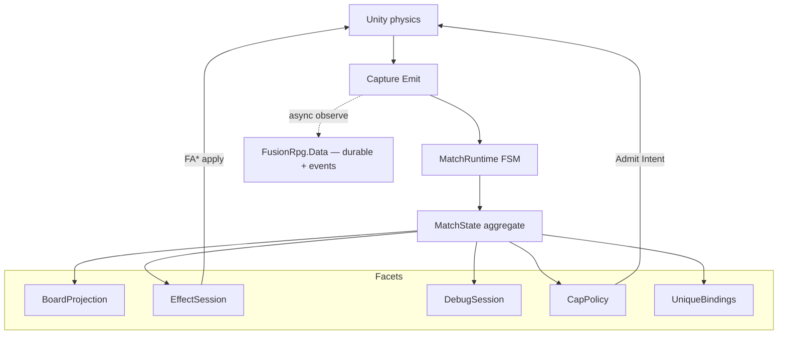
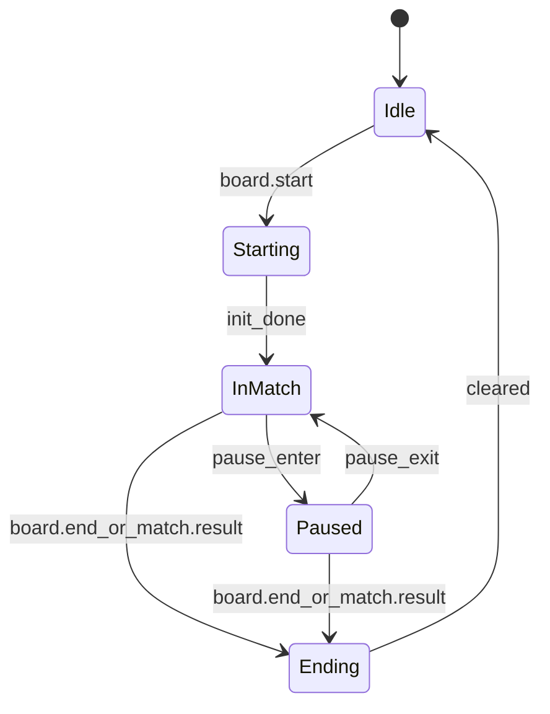
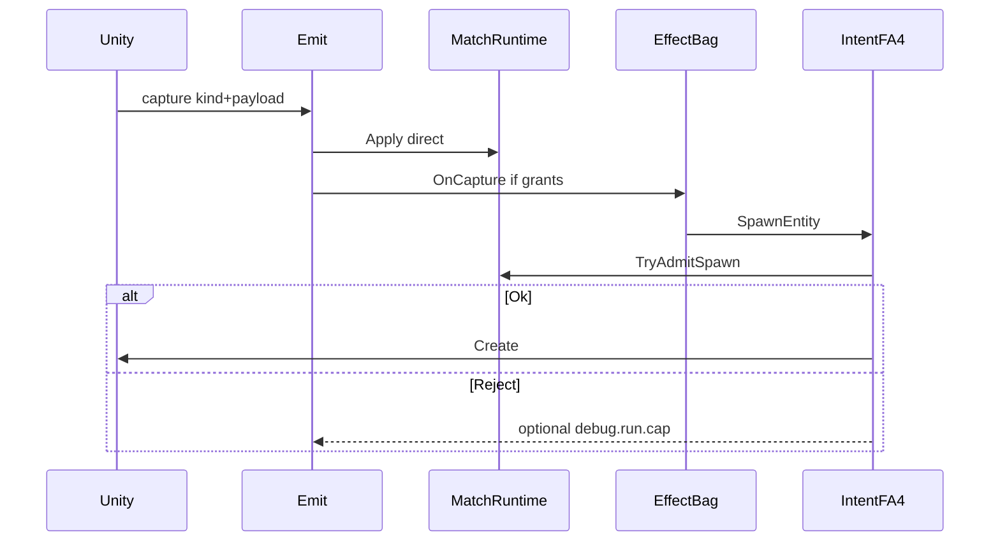

# MatchRuntime — centralized live match state (design spec)

**Status:** Spec + **W1 Core closed** + **W2 Injector wire shipped** + **W3 pause + Snapshot observe shipped** + **W4 UniqueActor Data+Server FSM shipped** + **W5 UniqueBindings + binder + ops shipped**. Mid-match `board.start` ignored on MatchRuntime; Injector auto-ends before start if not Idle. Bullets/hypno deferred.  
**Contract:** `MatchRuntimeContractVersion = 1` (Snapshot / GateResult shape).  
**Related:** [effect-system.md](effect-system.md), [effect-testing.md](effect-testing.md), [unique-actor-runtime.md](unique-actor-runtime.md) (durable specimens — dual FSM), [overlay-control-loops.md](overlay-control-loops.md) (Hot / Cold / Intent), [lawn-projector.md](lawn-projector.md) (FE Phaser observe), [pvz-middle-layer.md](pvz-middle-layer.md), [rpg-progression.md](rpg-progression.md), [protocol/events.md](../protocol/events.md), [stat-system.md](stat-system.md), [p0-hot-path-hardening.md](p0-hot-path-hardening.md), [implementation-roadmap.md](implementation-roadmap.md).

Core fold / Admit / Replay **shipped (W1)**. LIVE Emit / Admit / ClearAll / Caps **shipped (W2)**. Pause + Snapshot observe **shipped (W3)**. UniqueBindings + binder + loadout + Deploying timeout + ActiveBound sweeper + purge-while-bound **shipped (W5)**.

---

## W1 closed — deferred map (scope creep lock)

Do **not** reopen W1 for these. Class = **Next** (was W2/W3 — now shipped) | **Later** | **Ignore**.

| Out / deferred | Class | Wave / note |
|---|---|---|
| Emit → `MatchRuntime.Apply` | **Done** | W2-A (`MatchHost`) |
| FA4/Intent → `TryAdmitSpawn` | **Done** | W2-B (`SpawnAdmit` delegates) |
| Effect `ClearAll` on Starting/Ending | **Done** | W2-C |
| `CheatState.Living*` → BoardProjection | **Done** | W2-D (Living* dicts removed) |
| Cheats copy-on-start Caps | **Done** | W2-E |
| DebugSession facet sync | **Done** | W2-F (policy below) |
| Pause capture / LIVE `NotifyPaused` from Emit | **Done** | W3-A (`UIMgr.EnterPauseMenu` / `BackToGame`; observe `match.pause`/`match.resume`) |
| MatchSnapshot GET / SignalR | **Done** | W3-B (poll `debug.snapshot` nested `match`; lag OK — no Server MatchRuntime) |
| `debug.run.cap` on Admit reject | **Done** | W3-C (SpawnAdmit Emit; prove via events) |
| UniqueBindings Bound/Cleared | **Done** | W5-A |
| `bullet.init` / bullet die fold | **Later** | after destroy capture proven LIVE |
| `zombie.hypno` flag fold | **Later** | BoardProjection Flags |
| Product `match.restart` / Ending-then-start LIVE | **Later** | Injector auto-ends before start; product restart story TBD |
| Cap vanilla Harmony waves | **Ignore** | only our Create |
| Admit from SQLite / Data | **Ignore** | Data ban |
| Multi-board `MatchRuntimeHub` | **Ignore** | v1 non-goal |
| Caps as `record` type | **Ignore** | polish only |
| Second Unity physics in MatchRuntime | **Ignore** | banned |

**Build next:** pre-play lawn observe. W12 P2–P3 product pick is **deferred**. Do **not** pull bullets/hypno forward “to finish UniqueActor.”

**W2 LIVE prove checklist:** `board.start` → InMatch; Admit at cap emits `debug.run.cap`; `board.end` / `match.result` ClearAll grants + `GameHooks.MatchKey` null.

**W3 LIVE prove checklist:** pause menu → Admit `phase.paused` + `debug.run.cap`; `GET /api/debug/snapshot` then `GET /api/debug/events?kinds=debug.snapshot` shows nested `match.phase=Paused`; resume → InMatch; Admit at plant cap still emits `debug.run.cap`.

**W5 prove checklist:** Pending→Bound→Cleared unit; Deploying timeout → Roster + Injector `unique.binding.clear` GC Pending; boot sweeper ActiveBound → Roster; purge while ActiveBound → `unique.active_bound` 409 / refused.

**W4 prove (Cold):** create specimen → Roster; deploy → Deploying + Intent; ack → ActiveBound; die/end → Roster; duplicate `correlationId` does not double-queue.

### W2-F — DebugSession policy

| Plane | Owner | Role |
|---|---|---|
| Server `DebugSessionState` | Server HTTP/debug API | Cold debug sessions; not LIVE Admit SSOT |
| Injector `MatchDebugSessionFacet` | `MatchState.Debug` | Match-scoped overlay flags (`scenarioId`, `active`) |
| Sync | **None required for W2** | Prefer setting `scenarioId` on MatchState when injector-driven (W3+ if FE needs it) |

---

## 1. Purpose and non-goals

### Purpose

Provide a **centralized match state machine** for the FusionRpg overlay so live decisions (entity caps, Secondary validation context, Effect session lifecycle, debug scenario alignment) share one RAM aggregate — game-architecture best practice — instead of many competing stores.

### Non-goals

| Non-goal | Why |
|---|---|
| Replace Unity `Board` / physics loop | Closed game; we **analyze capture**, we do not own the loop |
| SQLite as live board SSOT | Too slow; wrong plane — durable RPG already has SQLite |
| Cap vanilla wave spawn via Harmony | Caps gate **our** Intent / FA4 / debug extras only |
| Multi-board / multi-match hub | Product v1 = one Board per process |
| Implementing C# / tests / deploy in this workstream | Spec-first; W1-A+ code lands in Core under separate plans |

---

## 2. Problem: fragmented live state

| Fragment | Store | Issue |
|---|---|---|
| Unity | Engine objects | True physics SSOT — leave alone |
| `CheatState.LivingPlants` / `LivingZombies` | **Removed (W2-D)** — BoardProjection via Emit Apply | Was parallel living set |
| `EffectRuntime` grants + ClearAll | Injector RAM | Separate lifecycle |
| `DebugSessionState` | Server RAM | Divergent “session active” |
| `SimEngine` Plants/Zombies lists | Core RAM | Competing board picture |
| Server `runs` / `entities` | SQLite | Lagged observe — not Admit control |
| Progression `rpg_*` | SQLite | Save-scoped (correct) — not frame state |

**Target:** one **`MatchRuntime` + `MatchPhase` FSM + `MatchState` aggregate (RAM)** for all *overlay* live decisions.

---

## 3. Data planes

| Plane | SSOT | Scope | Used for AdmitSpawn? |
|---|---|---|---|
| **Unity world** | Engine | Physics entities | No (we observe via capture) |
| **MatchRuntime** | RAM aggregate + FSM | Live overlay match | **Yes** |
| **Durable RPG** | SQLite via **`FusionRpg.Data` only** | Progression, Activity, PvzStats, Cheats document | **No** |
| **Telemetry** | SQLite `events` via **`FusionRpg.Data` only** | Observe / LIVE prove | **No** |

**Durable / Telemetry gate:** any database read/write for those planes goes through `FusionRpg.Data` (Server-side). Not ad-hoc SQLite from Server controllers, Injector, Web, Core MatchRuntime, or CapPolicy. See [ledger-snapshot.md](../database/ledger-snapshot.md) and [architecture-map.md](../contributing/architecture-map.md).

**MatchRuntime ↔ Data ban:** `MatchRuntime`, `BoardProjection`, `CapPolicy`, and related Core match types **must not** reference `FusionRpg.Data`, `IRpgDb`, or `RpgStore`. Live control stays RAM-only; injector stays SQL-free.

Capture **forks** on Emit: (1) synchronous `MatchRuntime.Apply` on main thread; (2) async enqueue to server `events` (Server persists via Data) — same payload, different planes.

---

## 4. Patterns (locked)

| Pattern | Use |
|---|---|
| **State machine** | `MatchPhase` |
| **Aggregate root** | `MatchState` |
| **Single writer** | Only `MatchRuntime` mutates the aggregate |
| **Event projection** | Capture kinds → BoardProjection |
| **Strategy** | `ICapPolicy` / `CapPolicyConfig` |
| **Gate** | `TryAdmitSpawn` before our Create |
| **Snapshot** | Cold `MatchSnapshot` only |
| **Facade** | `MatchValidator.Replay` (offline) |
| **Skip-reason result** | `GateResult` |

### Hot-path bans

MediatR / generic bus · SQLite CQRS for live reads · **any `FusionRpg.Data` / `IRpgDb` / `RpgStore` reference from MatchRuntime types** · Actor/mailbox · Observer fan-out on every spawn · Retaining full spawn dumps in MatchState · Virtual Unity physics engine · Optimistic entity add on Admit.

**Emit must call `Apply` directly** (preferred choke: after payload is built in `GameHooks.Emit`).

---

## 5. MatchPhase FSM

| Phase | Board fold (Apply) | TryAdmitSpawn | EffectSession |
|---|---|---|---|
| `Idle` | No entity upsert/remove | Reject `phase.idle` | Cleared |
| `Starting` | Reset aggregate; set MatchKey | Reject `phase.starting` | **ClearAll on enter** |
| `InMatch` | spawn/die (+ hypno/bullet per §7) | CapPolicy | Active |
| `Paused` | Fold if Emit continues | Reject `phase.paused` | Grants **retained**; no new Intent extras |
| `Ending` | Optional final folds then clear | Reject `phase.ending` | **ClearAll on enter** |

### 5.1 Starting → InMatch

- Enter **Starting** on Applied `board.start`.
- **init_done:** same Apply may transition to **InMatch** immediately after Reset (v1: no async load gate). Spec allows a future explicit `MatchRuntime.NotifyReady()` if needed; default = auto InMatch at end of `board.start` handling.

### 5.2 Pause (required)

| Item | Spec |
|---|---|
| Purpose | Freeze **our** AdmitSpawn / Secondary-driven extras during pause UI |
| Unity pause | Engine-owned (`Time.timeScale` / pause menu); we only mirror overlay phase |
| Enter | `MatchRuntime.NotifyPaused(true)` **or** future capture kind `match.pause` |
| Exit | `NotifyPaused(false)` / `match.resume` |
| **Hook target (research note)** | **Shipped (W3-A):** `UIMgr.EnterPauseMenu` / `InGameUI.PauseGame` → `MatchHost.NotifyPaused(true)`; `UIMgr.BackToGame` / `BackToMenu` → `NotifyPaused(false)`. Observe-only Emit `match.pause` / `match.resume` ([events.md](../protocol/events.md)) — not Core Apply phase kinds. `CheatActions` timeScale path is **not** automatically Paused phase (non-goal). |
| If Emit silenced | BoardProjection stops updating; still valid |

### 5.3 Multi-board stance (non-goal)

- LIVE: **exactly one** `MatchRuntime` per game process.
- No multi-board API in contract v1.
- Future seam only (non-goal): `MatchRuntimeHub[matchKey]` — do not invent a second singleton mid-feature.

---

## 6. MatchRuntime API (spec shape — not shipped code)

Conceptual surface for a future Core type:

| Method | Role |
|---|---|
| `Apply(kind, payload)` | Single-writer fold + phase transitions from capture |
| `NotifyPaused(bool)` | Enter/leave Paused without requiring a capture kind |
| `TryAdmitSpawn(side, out GateResult)` | Gate before our Intent/FA4/debug Create |
| `ToSnapshot()` | Cold immutable DTO |
| `Reset` / transition helpers | Used internally on Starting/Ending |

**Cardinality LIVE:** process singleton. **Offline Replay:** new instance per `MatchValidator.Replay` (isolation).

---

## 7. Data entities and DTOs

### 7.1 `MatchRuntimeContractVersion`

Constant **`1`**. Bump when `MatchSnapshot` or `GateResult` shape breaks. Orthogonal to `FoundationContractVersion` (Effect Plans).

### 7.2 `BoardEntity`

| Field | Type | Required | Notes |
|---|---|---|---|
| `Ptr` | string | yes | Hex identity; compare ordinal-ignore-case |
| `Side` | `plant` \| `zombie` \| `bullet` | yes | Cap bucket |
| `TypeId` | int | no | Default `-1`; from payload `type` / `typeId` / … |
| `Flags` | flags | no | At least `Hypnotized` |

**Identity:** upsert on spawn same ptr; die removes; missing ptr on die = no-op; duplicate spawn = upsert (idempotent).

### 7.3 `BoardProjection`

| Field | Type | Notes |
|---|---|---|
| `Plants` | map ptr → BoardEntity | Living plants |
| `Zombies` | map ptr → BoardEntity | Living zombies |
| `Bullets` | map ptr → BoardEntity | Optional; see bullets policy |
| `PlantCount` / `ZombieCount` / `BulletCount` | int | Maintained O(1) on add/remove |

**Living plants/zombies membership:** `plant.spawn` / `zombie.spawn` + `plant.die` / `zombie.die` only.  
**`plant.place` / `zombie.place`:** **ignored** for living set (avoids double-count with spawn; place remains Activity/runs semantics — see [decisions.md](decisions.md)).

### 7.4 Bullets policy

| Decision | Spec |
|---|---|
| Track | Yes — `Bullets` map + `BulletCount` |
| Input kinds | `bullet.init` upsert; bullet destroy/die **when a reliable capture kind exists** |
| Cap | `MaxLivingBullets`; **default `-1` = unlimited** until die/destroy capture is proven LIVE |
| AdmitSpawn(`bullet`) | If max ≥ 0 and count ≥ max → `cap.bullets` |
| Rationale | Do not couple plant/zombie lag caps to pea spam without destroy events |

### 7.5 Hypno / mind control

| Event | Behavior |
|---|---|
| `zombie.hypno` | If ptr in Zombies: set `Flags.Hypnotized = true`. **Do not** move to Plants dict |
| Clear hypno | On `zombie.die` (no dedicated un-hypno capture assumed) |
| Cap bucket | Remains **zombie** (occupies zombie living slot) |

Secondary may filter `Hypnotized` later; Foundation Effects unchanged.

### 7.6 `MatchState` facets

| Facet | Contents |
|---|---|
| **Board** | BoardProjection |
| **EffectSession** | Access to process EffectBag; ClearAll on Starting/Ending enter |
| **DebugSession** | `scenarioId`, `active` — align overlay debug with matchKey policy |
| **Caps** | `CapPolicyConfig` |
| **UniqueBindings** | Ephemeral `instanceId ↔ ptr` map for durable specimens — see §7.10 |

Durable specimen SSOT (level, gear, UniqueActor phase) lives on Server / `FusionRpg.Data` — [unique-actor-runtime.md](unique-actor-runtime.md). MatchRuntime holds **bindings only**.

### 7.7 `CapPolicyConfig`

| Field | Type | Default |
|---|---|---|
| `MaxLivingPlants` | int | `50` |
| `MaxLivingZombies` | int | `80` |
| `MaxLivingBullets` | int | `-1` (unlimited) |

`-1` on any max = unlimited for that side.

### 7.8 `GateResult`

| Field | Type |
|---|---|
| `Ok` | bool |
| `Reason` | string (empty if Ok) |

#### Reason codes

| Code | Meaning |
|---|---|
| `cap.plants` | At max plants |
| `cap.zombies` | At max zombies |
| `cap.bullets` | At max bullets (when enabled) |
| `cap.invalid_side` | Side not plant/zombie/bullet |
| `phase.idle` | Not in match |
| `phase.starting` | Init |
| `phase.paused` | Paused — no our extras |
| `phase.ending` | Tearing down |

### 7.9 `MatchSnapshot` (cold)

| Field | Type |
|---|---|
| `ContractVersion` | int (= 1) |
| `MatchKey` | string? |
| `Phase` | MatchPhase |
| `Revision` | int |
| `PlantCount` / `ZombieCount` / `BulletCount` | int |
| `Entities` | BoardEntity[] (minimal) |
| `Caps` | CapPolicyConfig copy |
| `Bindings` | optional `UniqueBinding[]` (cold observe; omit on hot path) |

Never allocate Snapshot on hot Emit path.

### 7.10 `UniqueBindings` (ephemeral — **shipped W5**)

Facet for unique plant/zombie specimens that persist across runs on the Server. LIVE map only; durable SSOT remains UniqueActor in Data.

| Field | Type | Meaning |
|---|---|---|
| `InstanceId` | string (GUID) | Durable specimen id from Server roster |
| `Ptr` | string? | Unity hex while Bound; null when Pending/Cleared |
| `Side` / `TypeId` | plant\|zombie + int | Spawn template |
| `BindingPhase` | enum | `PendingSpawn` \| `Bound` \| `Cleared` |
| `CorrelationId` | string? | Ties Intent deploy to the spawn capture |
| `LoadoutJson` | string? | Minimal absolutes/grants (not W8 shop) |

#### Binding transitions

| Event | BindingPhase |
|---|---|
| Unique deploy Admit accepted / Intent enqueued (`TryBeginPending`) | → `PendingSpawn` |
| Applied `*.spawn` / `pvz.spawn.extra.ack` matching correlation / instanceId | → `Bound` (`instanceId ↔ ptr`); binder + ptr-only loadout |
| Applied `*.die` for that ptr | → `Cleared` |
| Enter Ending / Idle reset | All bindings → `Cleared` |

**Rules:**

- MatchRuntime **never** writes UniqueActor / equipment tables (Data ban unchanged).
- Lawn Effects for a specimen use **`entity:{ptr}`** only while Bound — `UniqueOwnerBinder` translates durable `instance:{guid}` at Bound.
- CapPolicy / AdmitSpawn unchanged: unique deploy is still “our” Intent extra.
- Three IDs stay orthogonal: `typeId` ≠ `ptr` ≠ `instanceId`.
- Snapshot `Bindings` is cold observe only (never allocate on hot Emit).
- FailDeploy / Deploying timeout → Data Roster **and** Injector command `unique.binding.clear` (Pending GC).

---

## 8. Apply kind routing

| Kind | MatchState change |
|---|---|
| `board.start` | Enter Starting → Reset board/debug/**bindings** as needed → set MatchKey → Effect ClearAll → InMatch (auto) → revision++ |
| `board.end` | Enter Ending → Effect ClearAll → clear board + **clear all UniqueBindings** → Idle → revision++ |
| `match.result` | Same as `board.end` (prefer clear living) |
| `plant.spawn` | Upsert Plants[ptr] if phase allows fold; if PendingSpawn correlation matches → Binding `Bound` |
| `zombie.spawn` | Upsert Zombies[ptr]; same binding rule |
| `plant.die` | Remove Plants[ptr]; if Bound unique → Binding `Cleared` |
| `zombie.die` | Remove Zombies[ptr]; if Bound unique → Binding `Cleared` |
| `plant.place` / `zombie.place` | **No living fold** |
| `zombie.hypno` | Flag Hypnotized on zombie entity |
| `bullet.init` | Upsert Bullets[ptr] |
| bullet destroy (future kind) | Remove Bullets[ptr] |
| other | No-op (O(1) return) |

**Fail-closed Apply:** missing ptr on spawn/die → ignore fold; **do not throw** on LIVE hot path.

### Fold vs phase

| Phase | spawn/die/hypno/bullet fold |
|---|---|
| Idle | No |
| Starting | Reset only (no entity folds mid-start) |
| InMatch | Yes |
| Paused | Yes if Emit fires |
| Ending | Allowed until clear completes |

---

## 9. Admit matrix (phase × side × caps)

`TryAdmitSpawn(side)`:

1. If phase ∉ { InMatch } → reject corresponding `phase.*` (Paused/Idle/Starting/Ending).
2. If side invalid → `cap.invalid_side`.
3. Else CapPolicy: compare living count for side to max (`-1` = skip check).
4. On reject, implementation **may** Emit telemetry `debug.run.cap` (observe only).

| Phase \ Side | plant | zombie | bullet |
|---|---|---|---|
| Idle | phase.idle | phase.idle | phase.idle |
| Starting | phase.starting | phase.starting | phase.starting |
| InMatch | cap.plants or Ok | cap.zombies or Ok | cap.bullets or Ok / always Ok if max=-1 |
| Paused | phase.paused | phase.paused | phase.paused |
| Ending | phase.ending | phase.ending | phase.ending |

### Ordering (Admit vs Apply)

1. **Admit before our Create.**
2. **BoardProjection adds entity only when `*.spawn` / `bullet.init` is Applied** (after Unity created).
3. **No optimistic add on Admit** (avoids ghosts if Create fails).
4. Between Admit and spawn Emit, counts may be briefly understated — accepted.

---

## 10. Architecture locks (binding)

1. **Main-thread affinity (LIVE):** mutate MatchRuntime only on Unity main thread (Emit / EntityApply / Effect sink). No SignalR/ingest callback may Apply or Admit.
2. **MatchKey SSOT:** `MatchState.MatchKey` after `board.start`; `GameHooks.MatchKey` must stay in sync on start transition — one writer path.
3. **Admit before Create; fold on spawn capture only.**
4. **Fail-closed:** no throw on hot Apply; CapPolicy never null on LIVE (constructed with runtime).
5. **Cap config in RAM** — never SQLite / `FusionRpg.Data` per Admit.
6. **One LIVE MatchRuntime per process.**
7. **EffectBag = grant/ICD/Plan math; MatchRuntime = lifecycle** (when ClearAll / matchKey).
8. **Observe ≠ control** — FE / Data / `events` must not be required for Admit.
9. **`MatchRuntimeContractVersion = 1`.**
10. **Deterministic Replay** — same event list → same Snapshot counts/phase (no wall clock in fold).
11. **No Data from MatchRuntime:** Core match/cap types never take or call `FusionRpg.Data`. Injector remains SQL-free; durable/telemetry persistence is Server → Data only.
12. **UniqueBindings are ephemeral:** durable specimen SSOT is UniqueActor on Server ([unique-actor-runtime.md](unique-actor-runtime.md)); live facet only maps `instanceId ↔ ptr`.

---

## 11. Cap config source and observe plane

### Config SSOT

| Source | When | Hot Admit? |
|---|---|---|
| Defaults in CapPolicyConfig | Runtime construction | Yes (RAM) |
| Explicit `MatchRuntime` setter | Main thread; revision++ | Yes |
| Cheats document / server push | **Copy into RAM on Starting only** (Server may load Cheats via Data, then push) | Yes after copy — **never** read Data/SQLite inside Admit |

### Telemetry (observe)

| Kind | When | Plane |
|---|---|---|
| `debug.run.cap` | Optional on Admit reject | Emit → Server → **`FusionRpg.Data`** `events` |
| Existing capture kinds | Unchanged | same Data gate |

Payload sketch for `debug.run.cap`: `{ side, reason, plantCount, zombieCount, bulletCount, maxPlants, maxZombies, maxBullets, matchKey, scenarioId? }`.

### FE

- Control path never waits on FE.
- Optional observe: Snapshot via future debug/list API or SignalR — eventual consistency OK.
- FE must not drive Grants from Activity rollups as living counts.

---

## 12. EffectSession and Secondary

LIVE hook order is **outside** `MatchRuntime.Apply` (`MatchHost` / `SimEffectHost`):

| Edge | EffectSession |
|---|---|
| `board.start` / `BeginMatch` | `ClearAll` (bag-only) → `NotifyMatchStart` (plugin Grant) |
| `board.end` / `match.result` / `EndMatch` | `NotifyRemoved` (plugin Withdraw) → `ClearAll` |
| Enter Paused | No clear — grants retained |
| InMatch | Normal OnCapture → Plans → sink; FA4 Create must `TryAdmitSpawn` first |

**Secondary plugins:** `OnMatchStart` / `OnRemoved` align with those edges — still **Grant/Withdraw only** ([effect-system.md](effect-system.md) hard law). Scenario `matchStart` uses the scenario `matchKey`.

**Boundary:** MatchRuntime does not implement FA*; EffectBag does not own living counts.

---

## 13. Data flows

### Hot (LIVE)

**Hot path law:** Emit → MatchRuntime.Apply + EffectBag OnCapture in-process. Server / Data receive the same payload only as an **async observe fork** — never as a gate before FA* apply or Admit. Combat procs (freeze/heal on hit) stay on this Hot loop; see [overlay-control-loops.md](overlay-control-loops.md).

### Cold (Secondary / future tests)

`MatchValidator.Replay(IEnumerable of kind+payload in RAM)` → Apply each → `ToSnapshot()`.  
Fixtures must **not** require SQLite `events` reads in v1 test contract (keep plane B independent).

---

## 14. Anti-fragmentation rules

1. No new living ptr dictionaries outside `MatchState.Board`.
2. No free-floating `inMatch` / `sessionActive` bools outside `MatchPhase` / Debug facet.
3. Clear paths go through Starting/Ending transitions (fan-out Effect clear + board clear).
4. Server `entities` / other Data tables never queried for LIVE AdmitSpawn.
5. `SimEngine` must not remain a long-term competing Plants/Zombies SSOT — feed MatchRuntime via synthetic capture or wrap.
6. No ProjectReference from Core match types (or Injector) to `FusionRpg.Data` for MatchRuntime.
7. Do not store specimen level/gear inside BoardEntity or UniqueBindings — those belong on UniqueActor / Data.

---

## 15. Migration end-state (for future implementation plan)

| Current fragment | Target end-state |
|---|---|
| `CheatState.LivingPlants` / `LivingZombies` | **Removed** — writers were BoardProjection via Emit; debug counts from MatchSnapshot |
| `EffectRuntime.ClearAll` call sites | Invoked from MatchRuntime Starting/Ending (match reset / reload still OK if they call runtime transition) |
| `DebugSessionState` (server) | Document sync policy: server session for HTTP debug vs injector Debug facet; prefer scenarioId on MatchState when injector-driven |
| `SimEngine` entity lists | Synthetic Emit into MatchRuntime **or** thin adapter; not second SSOT |
| Server `entities` | Observe/history only |

### Suggested implementation order (not this workstream)

1. Core MatchRuntime + BoardProjection + CapPolicy + unit Replay tests (**no** `FusionRpg.Data` reference)  
2. Injector Emit → Apply; FA4/Intent Admit (injector stays SQL-free)  
3. Wire Effect ClearAll to phase transitions  
4. Collapse CheatState.Living*  
5. Pause NotifyPaused / capture kinds  
6. Optional FE Snapshot observe (Server may expose RAM Snapshot or history via Data — live Admit still RAM-only)  

---

## 16. Test contract (when implementation starts)

Future `FusionRpg.Core.Tests` must cover (no tests authored in this design workstream):

| Case | Expect |
|---|---|
| board.start → InMatch; MatchKey set | Phase + key |
| spawn/die counts | O(1) membership |
| place does not increase living | Counts unchanged |
| Admit at cap | `cap.plants` / `cap.zombies` |
| Admit in Paused | `phase.paused` |
| hypno sets flag; still zombie cap | Flag + bucket |
| bullet unlimited default | Admit bullet Ok with max=-1 |
| Replay determinism | Same list → same Snapshot |
| No `FusionRpg.Data` / `RpgStore` / `IRpgDb` from MatchRuntime / CapPolicy types | Architecture grep + ProjectReference check |
| UniqueBinding Bound then Cleared on die; no Data call | Unit Replay with synthetic deploy correlation |

---

## 17. Research notes (pause / bullet die)

| Gap | Note |
|---|---|
| Pause enter/exit | **Shipped (W3):** `MatchHost.NotifyPaused` + observe `match.pause`/`match.resume` in [events.md](../protocol/events.md); Core fold stays NotifyPaused-only |
| Bullet destroy kind | `bullet.init` exists ([GameHooks](../../src/FusionRpg.Injector/GameHooks.cs)); destroy/die capture to be confirmed before enabling `MaxLivingBullets ≥ 0` |

---

## 18. Implementation status

**Out of scope for this document’s workstream:** any code under `src/`, `tests/`, deploy, or LIVE prove of MatchRuntime.

When implementing, open a **separate** plan that cites this file as SSOT and does not reopen Foundation Effects contract v1 opcodes without an ADR. Dual-FSM specimen work cites [unique-actor-runtime.md](unique-actor-runtime.md) as well.
