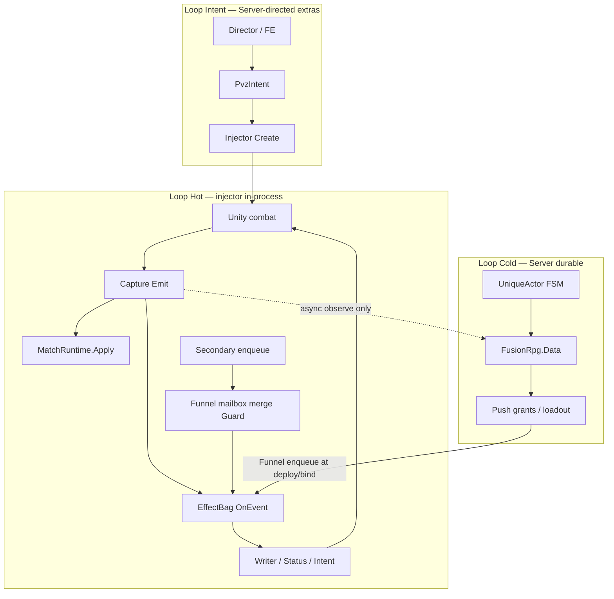

# Overlay control loops — dual authority (design lock)

**Status:** Architecture lock / design spec. No new runtime code in this workstream.  
**Related:** [effect-runtime.md](effect-runtime.md), [effect-system.md](effect-system.md), [effect-funnel.md](effect-funnel.md) (Hot mailbox between Secondary and Bag), [match-runtime.md](match-runtime.md), [unique-actor-runtime.md](unique-actor-runtime.md), [unique-entity-effects.md](unique-entity-effects.md), [pvz-middle-layer.md](pvz-middle-layer.md), [pvz-intent.md](pvz-intent.md).

---

## 1. The hard problem

A naive overlay loop looks like:

```text
game mutate → capture → Server FSM → RPG logic → apply request → injector → game
```

That loop is **correct for cold durable work** (deploy loadout, XP, equip item, recover specimen).  
It is **fatal for combat-reactive “delay effects”** (5% freeze on hit, 10% heal on hit): network + SQLite + Server FSM latency means the `ptr` may already be dead or reused, Unity has already resolved the hit, and the lawn desyncs.

**Architecture stands on two truths:**

1. **Unity** is SSOT for physics / vanilla combat timing / entity lifetime.
2. **RPG overlay** is SSOT for specimen / loadout / progression — but its **hot evaluation must not require a Server round-trip**.

Sealed Foundation Effects already host the bag on the Injector ([effect-runtime.md](effect-runtime.md)). This document **names the control loops** so UniqueActor / MatchRuntime / directors never get wired into the hit path.

---

## 2. “Delay effect” ≠ network delay

| Term | Meaning here |
|---|---|
| **Product “delay / triggered effect”** | Probabilistic, ICD-gated, on-hit Secondary content |
| **Network / Server delay** | SignalR + Data latency — **banned** on combat apply |

Triggered gear procs execute on the **Hot** loop (injector in-process). They are “delayed” relative to vanilla game design (chance, ICD), not relative to the RPG server.

---

## 3. Three control loops (locked)



| Loop | Latency OK? | Who decides | Who applies to Unity | Examples |
|---|---|---|---|---|
| **Hot** | Same process as capture (no Server await) | Injector `EffectBag` + **Funnel** + **ActorHub** (derived at Apply) + **StatusRuntime** (design) | Writer / StatusExecutor / Intent / FA10 **Add** | 5% freeze on hit; DoT pulse; ICD; counter burst |
| **Cold** | Seconds OK | Server UniqueActor + Data | Never directly — **pushes grants/loadout**; Hot applies later | Equip item, level-up mod defs, roster deploy templates |
| **Intent** | Human / director scale OK | Server feature → `pvz.*` | Injector after MatchRuntime Admit | Extra spawn, unique deploy Create |

### Hard ban

**Server FSM (UniqueActor or any “in-run game logic” on Server) must not sit between `combat.hit` (or equivalent capture) and FA* apply.**

No: capture → Server roll → apply request → injector for hit procs.

---

## 4. Dual SSOT without fighting

| Domain | SSOT | Must not claim |
|---|---|---|
| Physics, vanilla damage resolution, entity lifetime | **Unity** | RPG “true HP before hit” mid-frame |
| Current HP after spawn | **Unity** (vanilla TakeDamage + FA10 Writer Add) | RPG snapshot SetHp; `pushScales` now ratio-remaps live HP (does not write `y.Hp`) |
| Living overlay set, Admit, bind `instanceId ↔ ptr` | **MatchRuntime RAM** | Durable gear / XP |
| Specimen phase, equipment, level, personal mod *definitions* | **UniqueActor / Data** | Per-hit proc rolls |
| Active grant bag + ICD clocks for this process | **EffectBag (Injector)** | SQLite mid-proc |
| Active status instances on actors | **StatusRuntime (Injector RAM)** — [status-ssot.md](status-ssot.md) | Durable status rows in SQLite mid-match |
| Derived power/resist at Status Apply | **Actor Hub** — [actor-hub-ssot.md](actor-hub-ssot.md) | Primary `hp`/`atk` or StatSystem-only resist |
| Secondary→Foundation command buffer | **Funnel mailbox (Injector / Core)** | Absolute HP from overlay snapshot; Server RTT |
| Almanac type XP | **RpgProgression** | Lawn `ptr` identity |

**Decoupling rule:** Overlay **projects** Unity via capture; it never replaces the engine. Overlay **mutates** Unity only through Foundation (`EntityApply` / StatusExecutor / Intent / v2 FA10 Writer **Add**) — [pvz-middle-layer.md](pvz-middle-layer.md), [effect-funnel.md](effect-funnel.md). Vanilla peas/bites stay Unity `TakeDamage`; overlay deltas do not re-enter that Prefix.

MatchRuntime and EffectBag are **overlay** SSOTs for live decisions; they are not a second physics engine.

---

## 5. Worked examples (equipment procs)

### Cold — equip once

```text
Equip "Frost Edge" on instanceId (FE / API)
  → FusionRpg.Data: equipment row + Secondary grant templates
       (e.g. 5% freeze on hit, 10% restore 500 HP on hit as ResourceDelta not SetHp)
  → On deploy/bind: Server pushes Grant templates **through Funnel** (no plugin→Bag)
  → Binder: ownerKey instance:{guid} → entity:{ptr} while Bound
  → EffectBag RAM holds grants + overlays (chance, icd_ms, magnitudes)
```

### Hot — every combat.hit

```text
Unity hit → Capture Emit
  → MatchRuntime.Apply (board fold / binding; no Data)
  → EffectBag.OnEvent (FT*)
  → local chance + ICD
  → FA2 StatusExecutor (freeze/butter) on target ptr
  → Secondary mutations enqueue Funnel mailbox (not SetHp)
  → flush barrier (re-entry depth 0): Guard → FA10 Writer Add (Die if HP≤0)
  → and/or FA1 Writer ModifyStat on owner or target ptr
  → async fork: events → Server / Data (observe, Activity) — NOT a decision gate
```

Funnel flush is in-process next to `EffectBag.OnEvent`. It is **not** injector ingest 256/16ms (`RpgClient.TryFlush`) — that Channel is telemetry only. FA10 must **not** call Unity `TakeDamage` (Prefix DEF + `combat.hit` loop). See [effect-funnel.md](effect-funnel.md).

Past hits are never rewritten when Cold re-pushes grants mid-run; **next** hits see the new bag.

---

## 6. Fail-closed Hot rules

1. Missing / dead `ptr` → skip apply; **do not throw**.
2. Target already gone → skip.
3. **Never await** SignalR, HTTP, or SQLite for the roll or apply.
4. Withdraw `entity:{ptr}` grants on die **before** IL2CPP reuses the ptr ([unique-entity-effects.md](unique-entity-effects.md)).
5. Cap / Admit for our Create stays MatchRuntime RAM — not Server living counts.
6. Funnel **never** emits absolute HP/ATK from an RPG overlay snapshot (`hp=4000`). Mutations are signed deltas; `mode=set` on current HP is reject.
7. FA10 **never** calls Unity `TakeDamage`. Re-entry depth = 0: overlay apply must not emit `combat.hit` that nested-flushes Funnel.

---

## 7. What Server “in a run” may do

UniqueActor `ActiveBound` / Server match observe **may**:

- Track `matchKey`, last known `ptr`, binding phase (eventual consistency)
- Append Activity / telemetry via Data
- Accept **non-combat** Intent (deploy, retire)
- Mid-run equip that **re-pushes grants** (Hot bag updates; no rewind)

UniqueActor / Server **must not**:

- Recompute vanilla hit damage
- Own authoritative proc RNG for lawn hits
- Block or await before injector Hot apply
- Gate AdmitSpawn from Data living counts
- Treat UniqueActor phase transitions as combat proc outcomes

Combat procs do **not** drive UniqueActor FSM transitions. Die/end → Recovering is observe/recover, not “Server decided the freeze.”

---

## 8. Mapping to existing pieces

| Piece | Loop |
|---|---|
| `EffectBag` + `InjectorEffectActionSink` | **Hot** |
| Funnel mailbox + Guard ([effect-funnel.md](effect-funnel.md)) | **Hot** (same process; not ingest Channel) |
| MatchRuntime `Apply` / `TryAdmitSpawn` | **Hot** (local); Server sees async observe |
| UniqueActor FSM + reserved tables | **Cold** |
| Catalog / grant push at deploy | **Cold → Hot** (hydrate bag) |
| `pvz.spawn.extra` / unique deploy Create | **Intent** |
| SQLite `events` / Activity | Observe after Hot/Intent — never Admit/proc gate |

---

## 9. Anti-patterns (do not build)

| Anti-pattern | Why it breaks |
|---|---|
| Server rolls 5% freeze on each `combat.hit` then POSTs apply | Lag, ptr reuse, desync |
| MatchRuntime reads Data for living counts mid-hit | Wrong plane; Admit/Data ban |
| Secondary plugin calls Unity / StatusExecutor / `Bag.Grant` | Hard law — Funnel enqueue only ([effect-funnel.md](effect-funnel.md)) |
| Treating type XP actor as specimen gear owner | Orthogonal grains |
| Optimistic Server “true HP” shadow world | Second physics SSOT |
| RPG Funnel output `{ hp: 4000 }` from last capture | Stale vs live Unity HP; use FA10 Writer Add |
| FA10 calls Unity `TakeDamage` | Prefix DEF + `combat.hit` re-entry; double-dip with future CombatMath |
| Flush Funnel on ingest 256/16ms Channel | Telemetry path; not combat apply |

---

## 10. Implementation status

This document locks **control-plane architecture**. It does not ship new FA*, move the bag to Server, or implement UniqueActor.

When implementing gear procs: Cold grant templates **through Funnel** + Hot `OnEvent` only. Combat HP mutations go Secondary → **Funnel** → FA10 Writer Add, not FA1 `SetHp`, not `TakeDamage`. Cite this file + [effect-runtime.md](effect-runtime.md) + [effect-funnel.md](effect-funnel.md) + [unique-actor-runtime.md](unique-actor-runtime.md).

**Stress evaluation (research):** situations that try to break these locks — [../research/architecture-stress/00-index.md](../research/architecture-stress/00-index.md).  
**P0 hardening plan:** [p0-hot-path-hardening.md](p0-hot-path-hardening.md) (after [workshop verdict](../research/architecture-stress/05-p0-workshop-verdict.md)).  
**FE lawn mirror:** [lawn-projector.md](lawn-projector.md) (Phaser 4 observe + Intent; not Hot).  
**Implement order:** [implementation-roadmap.md](implementation-roadmap.md) (W0–W12).
