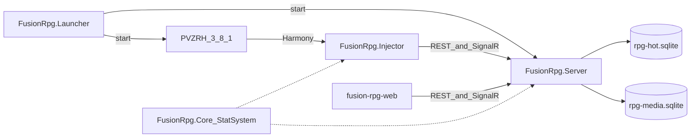

# Architecture overview

v1 is a pipe, not a full RPG: **hook the game, store in SQLite, control from a browser**.

No loot, XP, or per-plant loadouts in v1.

## Modules



| Module | Process | May touch | Must not touch |
|---|---|---|---|
| **Launcher** | Own WPF process | Game folder, plugin copy, start/stop server+game, port pick, GitHub releases API | Unity, SQLite schema, Cheats UI |
| **Core StatSystem** | Shared library | Modifier bag, plugins, compose | Unity, SQLite |
| **Injector** | Inside `PlantsVsZombiesRH.exe` (BepInEx) | Harmony, Unity via **EntityApply → EntityStatWriter only**, HTTP/SignalR client | SQLite, inventing per-feature apply math, combat field writes outside Writer |
| **Server** | Own `dotnet` process | SQLite, REST, SignalR hub, same plugins for sim | Unity, BepInEx, game DLLs |
| **Web** | Static files inside the server (`wwwroot`) | Server HTTP + SignalR | The game, the injector |

Server and web are **game-agnostic**: every payload has `game` + `kind` + JSON. Only the injector knows `Plant` / `Zombie`. Combat formulas and plugin registration live in Core — see [stat-system.md](stat-system.md).

**Foundation Effects** (sealed v1): [effect-system.md](effect-system.md), [effect-data.md](effect-data.md), [effect-runtime.md](effect-runtime.md), [effect-testing.md](effect-testing.md). Secondary Effects grant/overlay only — never apply to Unity.

**MatchRuntime** (design spec only): centralized live match FSM / BoardProjection / AdmitSpawn above Effects — [match-runtime.md](match-runtime.md). Implementation is a separate plan.

**UniqueActor** (design spec only): durable unique plant/zombie specimens across runs — [unique-actor-runtime.md](unique-actor-runtime.md); lawn power path [unique-entity-effects.md](unique-entity-effects.md). Dual FSM with MatchRuntime UniqueBindings.

**Lawn projector** (design spec only): Phaser 4 FE `#/lawn` observes the run grid for RPG interact — [lawn-projector.md](lawn-projector.md).

**Implementation order:** [implementation-roadmap.md](implementation-roadmap.md) — W0–W12 checklist across P0 Hot, MatchRuntime, UniqueActor, lawn FE, guards (docs; waves pending).

## v1 features

- Debug logging of board / spawn / death / mowers / GameOver (damage hits **on** by default this dump)
- `type` + `typeName` + `displayName` on dumps; `types` catalog (names only; first-seen sample is not SSOT)
- `spawn_stats` full live dumps per capture
- Metrics counters in SQLite
- **StatSystem**: Y0 + plugin modifier bag; cheat scale/absolute plugins; stub class/item/achievement/buff plugins
- **Single Unity writer**: Tab A / Tab B / spawn share `EntityApply.Run*` → `EntityStatWriter`
- Live status: server up, injector connected
- Web editor to save stats and push reload to the injector (feeds `cheat.scale` plugin)

## v1 out of scope

Real player class / XP / loot / achievement content UIs (stubs only). Per-type loadouts. God mode / plant-anywhere remain cheat-menu concerns, not StatSystem. The `types` catalog is capture only.

## Game id

`pvzrh-*` game profile on every event (default `pvzrh-3.8.1`; see [game-versioning.md](game-versioning.md)).

## Local ports

| Who | URL |
|---|---|
| Players (server hosts the UI) | `http://127.0.0.1:{port}` (default **5088**; launcher may hop) |
| Developers only (Vite hot reload) | `http://127.0.0.1:5173` |

Players never run Node. Vite `npm run build` is copied into the server `wwwroot` before we zip a release.

No auth in v1. Localhost only.

## Repo (after docs gate)

```text
plant-vs-zombie-rise-of-summoner/
  docs/
  src/FusionRpg.Contracts/     net6 DTOs + ModDocument
  src/FusionRpg.CheatCore/     schema, strip/migrate, codec
  src/FusionRpg.Core/          net6 StatSystem + StatMath + SimEngine
  src/FusionRpg.Server/        net8 (fallback net6)
  src/FusionRpg.Launcher/      net8-windows WPF player entry
  src/FusionRpg.Injector/           shared game logic + RpgHost facade
  src/FusionRpg.Injector.BepInEx/   BepInEx 6 IL2CPP host → FusionRpg.Injector.dll
  src/FusionRpg.Injector.MelonLoader/ MelonMod host (optional FUSIONRPG_ML_GAMEDIR)
  tests/                       CheatCore + Core unit + server e2e + Launcher
  web/fusion-rpg-web/          Vite + React + TS (Cheats SSOT UI)
  dist/FusionRpg/              published player folder (gitignored)
    FusionRpg.Launcher.exe
    Server/                    self-contained server + wwwroot + data/
    DropIntoGame/              plugin payload
```

Injector build copies to the game folder (set `FUSIONRPG_GAME_DIR` or default OutputPath):

`<your game folder>\BepInEx\plugins\FusionRpg\`
