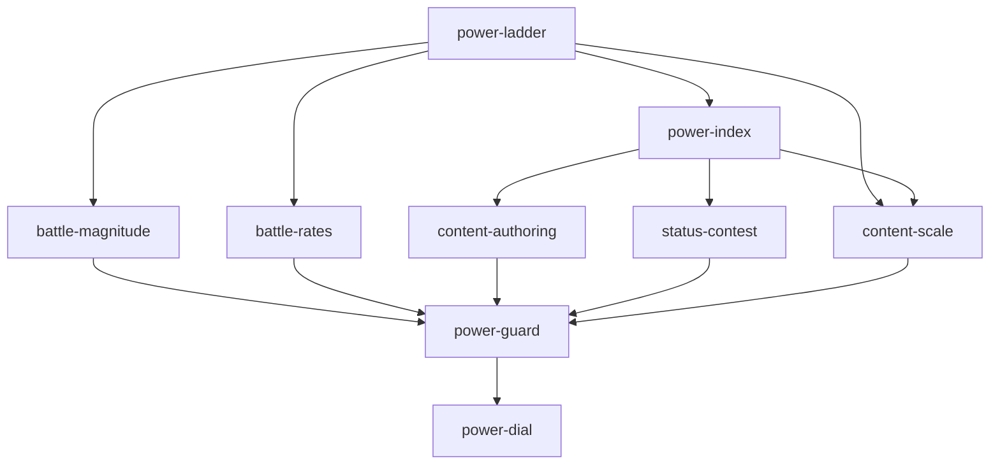

# Capability map: power program

**Status:** **Map drafted 2026-08-23, every open question closed the same day. Owner approved the map and all ten module specs 2026-08-24 — build authorized.**
**Inventory:** the SSOT's §10 sweep found **14** power-shaped scales; 6 collapse into `Θ`, 8 are bounded or relative and stay. That table is now closed — a scale not in it has no permission to exist.
**Parent SSOT:** [power/ssot-power-scale.md](power/ssot-power-scale.md) (reconciled 2026-08-23).
**Adversarial audit:** [power/audit-2026-08-23.md](power/audit-2026-08-23.md) — 8 findings, 5 critical, all adjudicated and applied.
**Grounding:** [decisions.md](decisions.md) P1 · [actor-hub-ssot.md](actor-hub-ssot.md) §3.B–D, §4 ·
[rpg-progression.md](rpg-progression.md) · [economy-principles.md](economy-principles.md) ·
[empire-economy-ssot.md](empire-economy-ssot.md) §4 · [item/ssot-generation.md](item/ssot-generation.md) §4.1.

## What this program is

**One power ladder, read by every system that produces a number.** Today three incompatible curves
ship simultaneously — `BattleRuleset.Base*` (linear), `ProgressionPowerCurve` (`2^min(L,12)`), and an
unwritten item scale. This program replaces all three with a single index `Θ` and a single function
`P(Θ)`, then migrates every consumer onto it and installs a guard so the drift cannot return.

## Locked shape (from the SSOT — not re-opened here)

1. **`P(Θ) = C + A·Θ + B·Θ(Θ−1)/2`** — arithmetic progression on the increment, matching the shipped
   XP curve's shape. `B` is the only balance dial; `A` is derived from the pin.
2. **`P(20) = 680` is pinned**, so retuning `B` never moves the item corpus.
3. **`B = 0` reproduces `BattleRuleset.BaseHp` exactly.** The shipped curve is the special case, which
   is what makes a zero-golden-movement migration possible.
4. **Contests read `Θ`; magnitudes read `P(Θ)`** (PS-3). Never the reverse.
5. **A magnitude is scaled exactly once** (PS-2).
6. **`progression.realm` stays 1.0 permanently** — realm advancement is additive in `Θ`, never a
   contest multiplier.
7. Integer per-mille throughout; `Θ(Θ−1)` is always even, so the triangular term is exact.
8. **A cap on a magnitude is a progression ceiling until proven otherwise** (PS-8, SSOT §11).
   Endless grind is the SSOT other systems reconcile *to* — but it is unbounded in **depth**, not in
   income: deliberate economy throttles stay.
9. **No power constant lives in code** (PS-7). Every weight and `B` is read from
   `data/tuning/power-scale.v{n}.json`; `A` is derived from the pin and never authored. A balance
   change is a config version, never a refactor — enforced by `power-guard`.

## Modules

| Module id | Responsibility | Depends on | Wave |
|---|---|---|---|
| `power-ladder` | The function and its tuning: `PowerLadder.Value(Θ)`, **config loader** (`power-scale.v1.json`), `A` derived from the pin at load, `Wm: null` fails loudly, overflow assert. **Zero numeric literals outside the loader.** Pure, no consumers, no behaviour change | — | **1** |
| `power-index` | Composing `Θ`: `Θ_actor` / `Θ_content` from the five ladders (all uncapped), `IPowerIndexProvider`, hydration from progression + world, **per-axis share report** (PS-6). Replaces `IProgressionPowerProvider`'s curve role | `power-ladder` | **1** |
| `battle-magnitude` | `BattleRuleset.BaseHp/BaseAtk/BaseDefense` derive from `P(Θ)`. **Proof obligation: byte-identical at `B=0`** | `power-ladder` | **2** |
| `battle-rates` | `BaseAccuracy/BaseDodge/BaseCritRate/BaseCritResist` read **`Θ`**, not `P(Θ)` (PS-3). Re-assert parity invariance against the shipped rate tests | `power-ladder` | **2** |
| `content-authoring` | Wave `RecommendedLevel` (1/3/6/10) and expedition tiers (2/5/9/14) re-authored as `Θ_content` | `power-index` | **2** |
| `status-contest` | `progression.power = Θ` (retires `2^min(L,12)`); `ResistFromPowerRatio = 0 → 1.0`; deletes `RpgXpPowerScale` (SSOT §10.1 row 4). **Amends ADR P1.** Carries the SSOT §6 red test | `power-index` | **3** |
| `content-scale` | `contentScale = P(Θ_content) / 680`, applied **once** at drop; the seedsmith/instantiator seam | `power-ladder`, `power-index` | **3** |
| `caps-reconcile` | Lift the ceilings that wall the grind (SSOT §11.1): `ShieldMath.MaxInput` and `ResourceDeltaMath.AmountCap` (both `1e9`, both **silently clamping**) → derive from the overflow bound and **throw**; `ContractPolicy.MaxSlots = 48` → **removed**, the arithmetic slot price was already the cap | `content-scale` | **3** |
| `power-guard` | Four checks (SSOT §9.2): no literal curve in code · no private `f(level)` outside `Core/Power` · §10 inventory closed · the pin holds for every tuning version. The thing that stops §0's drift returning | waves 1–3 | **4** |
| `power-dial` | Turn `B` from `0` to its shipped value. `RulesetVersion` bump + knowing golden re-bless. **The only golden-moving change in the program** | everything | **4** |

**Module specs** — all ten drafted 2026-08-23, approved and **built 2026-08-24** (power-todo.md T1.1–T4.2, Checkpoints 1–4 all passed):
[power-ladder](power/spec-power-ladder.md) · [power-index](power/spec-power-index.md) ·
[battle-magnitude](power/spec-battle-magnitude.md) · [battle-rates](power/spec-battle-rates.md) ·
[content-authoring](power/spec-content-authoring.md) · [status-contest](power/spec-status-contest.md) ·
[content-scale](power/spec-content-scale.md) · [power-guard](power/spec-power-guard.md) ·
[caps-reconcile](power/spec-caps-reconcile.md) · [power-dial](power/spec-power-dial.md)

**Build order:** `power-ladder` → `power-index` → (`battle-magnitude` ∥ `battle-rates` ∥ `content-authoring`) → (`status-contest` ∥ `content-scale`) → `caps-reconcile` → `power-guard` → `power-dial`

## Not owned by this program

| Owed by | What | Why not here |
|---|---|---|
| **World program** | Nothing — may *revise* `Wm` | **Closed.** `mapLevel(M) = 5 · DangerBand(M)`, the weight derived from the shipped `SectorTypeCatalog` bands 0–6 (SSOT §5.3). The world program can move a tuning weight if it disagrees; it owes nothing |
| **Economy SSOT owner** | Nothing — may *retune* its own constants | **Decided.** Rule PS-5: within one loop, faucet and sink scale on the same read or neither. Applied — **loam stays `Θ`-invariant** (it is the world-scoped throttle; escalation already arrives via size tier and Fracture intensity), **souls / essence / materials scale on `P(Θ)`** because they cross into the permanent treasury and are spent against `P(Θ)`-scaled content |
| **Atom layer (E9)** | Nothing — `PowerVector` stays scale-free | It prices *relative* content; the magnitudes it prices are already scaled. Scaling it double-counts (`ssot-power-scale` §1) |

## Checkpoints

All five passed 2026-08-24 (power-todo.md Checkpoints 1–4; wave 3's own gate is Checkpoint 3's 3b).

| After | Gate |
|---|---|
| Wave 1 | `PowerLadder` unit tests: `B=0 → A=30`; `P(20)=680` for every `B`; `Θ(Θ−1)/2` integer-exact; overflow assert fires |
| Wave 2 | **The zero-movement proof.** Full suite green with **no golden re-blessed**, and the shipped battle rate tests still assert parity `P(hit) 0.90±0.02` |
| Wave 3 | The SSOT §6 red test flips: matched pair at `Θ=12` goes `netFactor 4096 → 1.0` |
| Wave 4a | `power-guard` fails on a planted violation, passes on `main` |
| Wave 4b | `power-dial` — every moved golden is attributable to `B`, and the diff touches one constant |

## Hazards

1. **Wave 2 and wave 4b must not be combined.** If the refactor and the dial land together, every moved
   golden is ambiguous between "the refactor broke something" and "the dial did its job." The whole
   two-step structure exists for this.
2. **`status-contest` fix order.** `ResistFromPowerRatio = 1.0` alone fixes matched pairs at every
   level *even under the exponential* (`delta = 0` regardless of shape). The curve change is needed for
   *mismatched* pairs — at `Θ=12` vs `11` the gap is still `4096 − 2048`. Land the ratio first; it
   makes the system safe to look at while the curve is decided.
3. **`power-index` replaces a shipped interface.** `IProgressionPowerProvider` has an injector
   implementation whose `SetLevel` has **zero callers** — the migration is cheap now and expensive
   after the ADR's promised "SQLite hydrate later" lands.
4. **PS-2 is easy to violate during migration.** Each consumer moved must *remove* whatever scaling it
   did before, not add `contentScale` on top. Two 1.5×s and nobody can find the 2.25×.

## Decisions — all closed 2026-08-23

The SSOT's §10 sweep and the owner's calls closed every open question. **Nothing in this program is
waiting on a judgement.**

| Decision | Value |
|---|---|
| `B` — the curve dial | **0.4** (local exponent 1.28 → 1.88) |
| `Wa` : `Wd` | **25 : 1** — a retired world ≈ 25 Dave levels |
| PvZ run axis | **Uncapped**, `Wr = 0.25`. One-axis rule held by weight + measurement (PS-6), not a ceiling |
| `mapLevel(M)` | **`5 · DangerBand(M)`** — weight derived from the shipped catalog (SSOT §5.3) |
| Depth | Adds enemy level (`Θ_content`, here) **and** count (encounter design, not here) |
| `progression.realm` | Stays **1.0** permanently; realm advancement is additive in `Θ` |
| Loam economy | Stays **`Θ`-invariant**. Souls / essence / materials scale on `P(Θ)` |
| 1.75 affix tier ladder | **Not a conflict** — bounded at 5 rungs, level-free |
| Tuning | **All constants are config** (PS-7); `A` derived, never authored |

**Every number above is a starting value, not a validated one** — chosen so the system runs, in the
same sense `tier-bands.v1.json` says of its own. PS-7 is what makes that acceptable: being wrong
costs a config version, not a refactor.

**Still needed from outside this program** — none of it blocking waves 1–2:

1. ~~ADR P1 amendment~~ — **written into `decisions.md`** 2026-08-23, **built 2026-08-24** (T3.1/T3.2).
2. ~~Economy owner ratifies §10.4~~ — **decided**: loam `Θ`-invariant, souls scale on `P(Θ)`.
3. ~~`Wm` from the world program~~ — **decided**: `Wm = 5`, derived from the shipped catalog.

## Artifact paths

`SPEC.md` is held by **vfx-v3**; `tasks/plan.md` / `tasks/todo.md` by the **perf** stream. This program
uses the prefixed convention from [AGENTS.md](../../AGENTS.md):

| Artifact | Path |
|---|---|
| Capability map | `docs/architecture/power-map.md` (this file) |
| Parent SSOT | `docs/architecture/power/ssot-power-scale.md` |
| Module specs | `docs/architecture/power/spec-<module-id>.md` |
| Plan | `tasks/power-plan.md` |
| Task list | `tasks/power-todo.md` |
