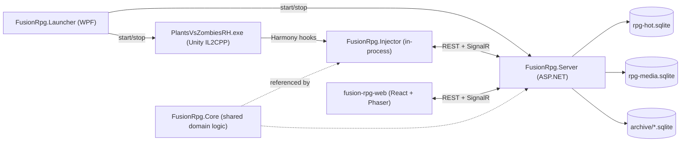
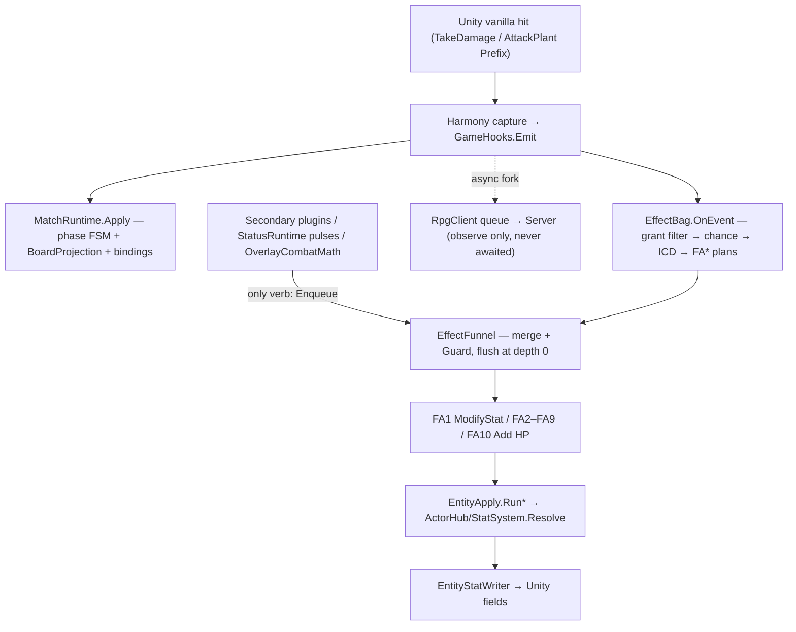

# Software architecture — Rise of Summoner (FusionRpg)

One-page-per-topic map of how the whole system fits together. Read this first, then drill into the per-subsystem SSOT docs linked throughout. Companion doc: [data-architecture.md](data-architecture.md).

> **The system in one sentence:** a WPF **Launcher** starts a legal PVZ Fusion install with a Harmony **Injector** inside it and an independent **Server** (SQLite + REST + SignalR) beside it; a React **Web** control room (served from the server's `wwwroot`) observes everything and issues commands — the RPG overlay *projects* Unity via capture and *mutates* it only through a small set of guarded apply paths.

## 1. Top-level shape

- **Injector never talks to the browser.** Both talk to the server at `http://127.0.0.1:5088` (launcher may hop ports; 5173 is reserved for Vite dev).
- Server and web are **game-agnostic**: every payload is `game` + `kind` + JSON. Only the injector knows `Plant` / `Zombie`.
- No auth in v1. Localhost only.

## 2. Processes, modules, and boundaries

| Module | Project | TFM | May touch | Must not touch |
|---|---|---|---|---|
| **Launcher** | `src/FusionRpg.Launcher` | net8-windows | Game folder, loader install (official GitHub pins only), plugin copy, start/stop server+game, port pick, self-update | Unity, SQLite schema, Cheats UI, the game binary |
| **Injector (shared)** | `src/FusionRpg.Injector` | net6 | Harmony, Unity via **EntityApply → EntityStatWriter only**, HTTP/SignalR client | SQLite, player ids, per-feature apply math, combat writes outside the Writer |
| **Injector hosts** | `.BepInEx` / `.MelonLoader` / `.MelonLoader.39` | net6 | Loader bootstrap → `RpgHost` facade | Game logic (thin shims only) |
| **CheatCore** | `src/FusionRpg.CheatCore` | net6 | Cheat schema, identity/strip rules, `ModDocument` codec, debug scenarios, probe packs | Unity, SQL |
| **Core** | `src/FusionRpg.Core` | net6 | StatSystem, ActorHub, StatusRuntime, ElementHub, overlay combat, EffectBag/Funnel, MatchRuntime, SimEngine | Unity, SQL (`FusionRpg.Data` is never referenced from the hot plane) |
| **Contracts** | `src/FusionRpg.Contracts` | net6 | Wire DTOs, `ModDocument`, `FoundationContractVersion` | Logic |
| **Data** | `src/FusionRpg.Data` | net8 | **All** SQLite (sole DAL, `RpgStore*`), cold archive, compaction, storage purge | Unity, HTTP |
| **Server** | `src/FusionRpg.Server` | net8 | REST, SignalR hub, event ingest, hosted workers, static SPA | Unity, BepInEx, game DLLs, **any SQL** (goes through Data) |
| **Web** | `web/fusion-rpg-web` | Vite/React/TS | Server HTTP + SignalR via `src/lib/bus` only | The game, the injector, direct fetch from feature screens |

## 3. The overlay principle (the one rule everything hangs off)

**Unity is SSOT for physics, vanilla combat, entity lifetime, and current HP.** The RPG overlay:

1. **Projects** Unity through Harmony capture (events → server → SQLite → web), and
2. **Mutates** Unity only through Foundation paths: `EntityApply`/`EntityStatWriter` (stats), the Unity CC executor in `InjectorEffectActionSink` (status), FA10 Writer **Add** (HP deltas), and `pvz.*` Intent (spawns).

Two apply pipelines (vanilla vs overlay), **one HP SSOT (Unity)**. Everything in §5–§7 exists to keep that true at 120 fps without crashing the game.

## 4. Runtime subsystem inventory

| Subsystem | Purpose | Status | Lives in | Doc |
|---|---|---|---|---|
| **StatSystem** | Forward-only `Y = Compose(Y0, bag)` over primary channels (hp/maxHp/atk/def/armor) | Shipped | `Core/Stats` | [stat-system.md](stat-system.md) |
| **EntityApply / EntityStatWriter** | The *only* legal Unity combat-field write path | Shipped | `Injector/Stats` | [stat-system.md](stat-system.md) |
| **Actor Hub** | Second compose pass → `ActorDerivedSnapshot` (progression / status / combat channels) | Shipped (status path; combat channels C0) | `Core/Stats/Derived` | [actor-hub-ssot.md](actor-hub-ssot.md) |
| **StatusRuntime + ResistanceEvaluator** | Timed status instances on `entity:{ptr}`: ICD, two-phase resistance, contagion | Shipped (S0–S7) | `Core/Status` | [status-ssot.md](status-ssot.md) |
| **Element Hub** | Element roster (fire/ice/air/earth + omni), ring matchup matrix, dual-type math | Shipped (C1) | `Core/Combat/Element` | [element-hub-ssot.md](element-hub-ssot.md) |
| **Overlay combat (CombatMath)** | Typed power/defense + matchup + hit + crit → one signed HP delta | Shipped, flag-gated (`OVERLAY-COMBAT`) | `Core/Combat` | [combat-damage-ssot.md](combat-damage-ssot.md) |
| **Foundation Effects (EffectBag)** | Sealed FA1–FA10 opcode engine; grants, FT1–FT4 triggers, chance/ICD/stacks | Shipped, sealed (v2) | `Core/Effects` + `Injector/Effects` | [effect-system.md](effect-system.md) |
| **EffectFunnel + Guard** | Sole Secondary→Foundation command buffer (merge, guard, then FA*) | Shipped | `Core/Effects` | [effect-funnel.md](effect-funnel.md) |
| **MatchRuntime** | Live match FSM + `MatchState` RAM aggregate; `TryAdmitSpawn` gate | Shipped (W1–W5) | `Core/Match` + `Injector/Match` | [match-runtime.md](match-runtime.md) |
| **UniqueActor** | Durable specimen FSM (instanceId, level, gear) across runs | Shipped (W4/W5, W8) | `Data` + `Server` + FE `#/roster` | [unique-actor-runtime.md](unique-actor-runtime.md) |
| **RpgProgression** | Per-save type XP/levels + ledger; power curve feeds status resistance | Shipped (P1/P2) | `Core/Progression` + `Data` | [rpg-progression.md](rpg-progression.md) |
| **Pvz middle layer** | PvzStats (modifiers) / PvzActivity (facts) / PvzIntent (`pvz.*` commands) | Shipped | `Data` + `Server` + Injector | [pvz-middle-layer.md](pvz-middle-layer.md) |
| **Lawn Projector (DPLP)** | Phaser 4 observe-mirror of the run + Intent-only interaction on `#/lawn` | Shipped (W6–W7) | `web/.../features/lawn` + `src/game` | [fe-game-foundation.md](fe-game-foundation.md) |
| **Overlay control loops** | Names the Hot / Cold / Intent authority split | Design lock (doc only) | — | [overlay-control-loops.md](overlay-control-loops.md) |

> Status conflicts between [decisions.md](decisions.md) and per-doc headers are resolved in favor of the **per-doc status headers** (decisions.md still carries some pre-ship rows).

## 5. The hot path (one frame, injector game thread)

Layer ownership (status view): L0 capture emits · L1 EffectBag grants/rolls · L2 StatusRuntime owns instances + status ICD · L2b ResistanceEvaluator owns apply-time immunity/power-vs-resist · L3 combat builds instant `DamagePacket`s · L4 apply (FA10 Writer Add, Unity CC executor, FX). Three ICD clocks — grant `icd_ms` (L1), status `icd_ms` (L2), `periodMs` (pulse cadence) — are never merged.

How the numeric subsystems relate: **ActorHub** is the shared substrate (only place derived channels are registered/composed) → **StatusRuntime** reads `status.*` at Apply and emits HP pulses through the Funnel → **ElementHub** reads type metadata and returns per-component matchup bonuses → **overlay combat** reads `combat.*` + ElementHub bonuses and produces the final signed delta. Status and overlay combat are independent in v1 (no status-on-hit bridge).

## 6. Load-bearing invariants (locked)

1. **Single Unity writer** — only `EntityStatWriter.cs` assigns Plant/Zombie combat fields (`guard-single-writer.ps1`).
2. **Secondary never touches Unity** — no `UnityEngine`, `HarmonyLib`, Writer, `TakeDamage`, and no `Bag.Grant`; Secondary's only verb is `Funnel.Enqueue` (`guard-secondary-no-unity.ps1`).
3. **FA10 = HP, add only** — reads *live* Unity HP, writes `live + amount`; never calls `TakeDamage` (would double-dip vanilla DEF + re-enter `combat.hit`).
4. **Funnel guard** — rejects `mode=set` / absolute HP from overlay snapshots; dead ptr → skip, never throw; depth and `|amount|` caps; nested flush is a no-op (`guard-funnel-delta.ps1`).
5. **Forward-only stats** — never `Xi = f(Y)`; persist Y0 + modifier state, never final `Y`. Y0 is immutable; progression flats ride `progression.bonus.*` only.
6. **Modifier vs mutation never mix** — modifiers keep identity per `grantId` (exact withdraw); mutations sum.
7. **Catalog discipline** — unknown derived channel / `statusId` / overlay key → reject, log, skip. Omni is additive-only (`omni × X` banned).
8. **Current HP is Unity-owned after spawn** — compose writes max/ATK; current HP is ratio-remapped only when max changes.
9. **No Data in the hot plane** — `MatchRuntime`/`BoardProjection`/`CapPolicy` never reference `FusionRpg.Data`; injector is SQL-free; all SQL lives in Data (`guard-dal.ps1`).
10. **No server round-trip on the hit path** — see §7.

## 7. Dual authority — three control loops

| Loop | Latency budget | Decider | Applier | Examples |
|---|---|---|---|---|
| **Hot** | Same process as capture; never awaits Server | Injector: EffectBag + Funnel + ActorHub + StatusRuntime + MatchRuntime | Writer / CC executor / FA10 Add | proc on hit, DoT pulse, ICD, crit, AdmitSpawn |
| **Cold** | Seconds OK | Server UniqueActor + Data | **Never directly** — pushes grants/loadouts; Hot applies later | equip, level-up mod defs, XP persist |
| **Intent** | Human scale | Server feature → `pvz.*` command | Injector, after `MatchRuntime.TryAdmitSpawn` | extra spawn, unique deploy |

**Hard ban:** no Server FSM may sit between `combat.hit` and FA* apply. Combat procs never drive UniqueActor transitions; mid-run equip re-pushes grants (future hits only — past hits are never rewritten).

## 8. The three FSMs and the three IDs

- **MatchPhase** (Hot, `Core/Match`, contract v1): `Idle → Starting → InMatch ⇄ Paused → Ending → Idle`. Only `MatchRuntime` mutates `MatchState`; living membership comes from `*.spawn`/`*.die` only; caps via `CapPolicy` (plants 50 / zombies 80 / bullets unlimited); deterministic replay (`MatchValidator.Replay`).
- **UniqueActor** (Cold, Server + Data): `Roster → Deploying → ActiveBound → (Recovering) → Roster`, terminal `Retired`; deploy idempotent on `correlationId`; watchdog + boot sweeper recover stuck states.
- **UniqueBindings** (the seam, ephemeral MatchRuntime facet): `PendingSpawn → Bound (instanceId ↔ ptr) → Cleared`. `UniqueOwnerBinder` rewrites `instance:{guid}` scopes to `entity:{ptr}` at Bound — `instance:` never appears in a Hot resolve.

**Three orthogonal IDs — never collapse:** `typeId` (catalog species; almanac XP), `ptr` (one Unity object in one match; `entity:{ptr}` grants), `instanceId` (durable specimen GUID; gear, cross-run).

## 9. Communication

- **Event envelope:** `{ t, game, kind, matchKey?, payload }`. Server stamps `id`/`player_id`/`run_id` on store — the injector never sends player ids. Full kind families in [../protocol/events.md](../protocol/events.md).
- **REST** ([../protocol/rest.md](../protocol/rest.md)): `/health`, `/api/players`, `/api/stats`, `/api/events`, `/api/types|recipes|runs|metrics`, `/api/cheats/*`, `/api/pvz-stats/*`, `/api/pvz-activity/*`, `/api/pvz-intent/*`, `/api/rpg/progression/*`, `/api/unique/*`, `/api/icons/*` + `/api/almanac/*`, `/api/storage/*`, `/api/debug/*` (always on), `/api/sim/*` + `/api/test/*` (only under `FUSIONRPG_SIM=1`).
- **SignalR** ([../protocol/signalr.md](../protocol/signalr.md)): hub `/hub/rpg`, groups `injector` / `web`. Injector sends `Hello`/`Events`/`Metrics`/`Heartbeat`; server pushes `Event(Batch)`, `Health`, `StatsUpdated`, `Command`, and `*Updated` invalidations. On `Hello`, the server rehydrates match-scoped effect grants (`effects.grants.apply`).
- **HTTP inbox fallback:** every web→injector command is also queued in `InjectorCommandInbox` (in-memory, cap 2000); the injector polls `GET /api/cheats/commands/pending` when SignalR delivery is unreliable.
- **Injector transport** (`RpgClient`): non-blocking `ConcurrentQueue`, flush ≤256 events / 16 ms, one in-flight send, HTTP fallback, 50k cap dropping noisy kinds first. Harmony patches never block on network.
- **Ingest:** enqueue → Channel → one writer thread → one SQLite transaction per 500–1000 events → projections → `EventBatch` broadcast (noisy kinds persisted but never live-pushed).

## 10. Guard scripts (CI + `deploy-play.ps1` + `tests/FusionRpg.Guard.Tests`)

| Script | Enforces |
|---|---|
| `guard-single-writer.ps1` | No combat field assigns outside `EntityStatWriter.cs` |
| `guard-secondary-no-unity.ps1` | Secondary plugins are Unity/Harmony/Writer-free |
| `guard-funnel-delta.ps1` | Secondary never calls `TakeDamage`/`SetHp`/`Bag.Grant`; FA10 sink is the only HP-delta writer |
| `guard-dal.ps1` | Zero SQL/Sqlite outside `FusionRpg.Data` (empty allowlist) |
| `guard-game-profile.ps1` | Build inputs match the declared game profile (`pvzrh-3.8.1` / `pvzrh-3.9`) |

## 11. Build, release, contracts

- **Dev loop:** `scripts/deploy-play.ps1` — guards → build injector into the game folder → publish server to `dist/FusionRpg.Server` → launch game. MelonLoader via `FUSIONRPG_ML_GAMEDIR` + `-LoaderHost MelonLoader`.
- **Player release:** `scripts/publish-player.ps1` — Vite build into `wwwroot` → self-contained Server + Launcher publishes → injector drop fan-out into `DropIntoGame/{profile}/{loader}` → `dist/FusionRpg` zip. Players double-click `FusionRpg.Launcher.exe`; nobody installs Node or a .NET SDK.
- **Contract versions (orthogonal):** `FoundationContractVersion = 2` (FA10 exists; surfaced at `GET /api/debug/effects/contract`) · `MatchRuntimeContractVersion = 1` (Snapshot/GateResult shape).
- **Game profiles:** `pvzrh-3.8.1` (default, BepInEx + MelonLoader) and `pvzrh-3.9` (MelonLoader, auto-detected by `GameAssembly.dll` size). Build-level only — not a DB column. See [game-versioning.md](game-versioning.md).

## 12. Where to go next

| Question | Doc |
|---|---|
| Where does each table live and who owns it? | [data-architecture.md](data-architecture.md) |
| What are the exact routes / hub methods / event kinds? | [../protocol/rest.md](../protocol/rest.md) · [../protocol/signalr.md](../protocol/signalr.md) · [../protocol/events.md](../protocol/events.md) |
| How do I run it locally? | [../runbook/local-dev.md](../runbook/local-dev.md) |
| What was decided and locked? | [decisions.md](decisions.md) |
| Full doc map | [../README.md](../README.md) |
