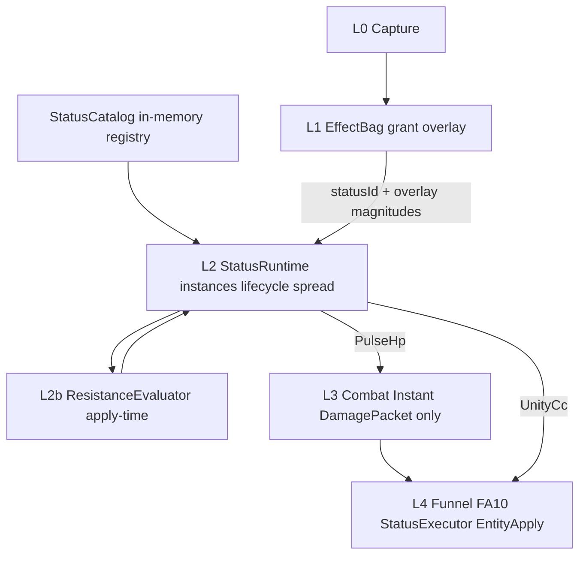

# Status SSOT — actor instances, ICD, lifecycle

**Status:** Design locked (docs). **Implementation deferred** — [actor-hub-status-implement-plan.md](actor-hub-status-implement-plan.md) (S0–S7; **S4+ blocked until S1**).  
**Parent:** [decisions.md](decisions.md) (ADR row **Status SSOT**). Derived inputs: [actor-hub-ssot.md](actor-hub-ssot.md) (**implementation blocked until S1**). Combat instant HP: [combat-damage-ssot.md](combat-damage-ssot.md). Apply path: [effect-funnel.md](effect-funnel.md), [effect-runtime.md](effect-runtime.md).

**ICD** in this repo means **Internal Cooldown** (proc gate), not an interface-control document.

---

## 1. Problem

Overlay **timed state** (DoT scheduler, counter meters) today lives on `EffectBag` under `DeliverySpec.OverTime|Counter`, while **Unity crowd control** (butter/freeze/poison) is a separate FA2 `ApplyStatus` sink. That splits one concept — *what is on this actor, for how long* — across combat delivery and status apply.

**Goal:** one Hot **StatusRuntime** SSOT for instances, lifecycle, resistance at Apply, and contagion hops. **Combat SSOT** stays **Instant-only**: status *pulses* emit `DamagePacket` → TargetResolver → Funnel → FA10.

This does **not** replace Unity physics or vanilla `TakeDamage`. It **does** replace `DeliverySpec` scheduling as the owner of DoT/counter **state** when the code plan lands.

---

## 2. Layer model (locked)



| Layer | Owns | Must not |
|---|---|---|
| **L1 Grant** | Listener `ownerKey`, `chance`, grant `icd_ms`, overlay numbers | Tick clocks, resistance values, Unity calls |
| **StatusCatalog** | `statusId` → def skeleton (kind, categories, stacking, family, payload kinds) | Per-match magnitudes |
| **L2 StatusRuntime** | `entity:{ptr}` instances, status ICD, counters, contagion hops | Funnel enqueue, hardcoded balance |
| **L2b ResistanceEvaluator** | Apply-time immunity + power/resist on **attacker and defender** derived snapshots | Status defs, file I/O |
| **L3 Combat** | Instant packets, TargetResolver, CombatMath stub | OverTime/Counter delivery |
| **L4 Apply** | FA10 Writer Add, StatusExecutor, EntityApply, FX | Timers, status bag mutation from Secondary |

**Three ICD clocks (never merge):**

| Clock | Layer | Question |
|---|---|---|
| Grant `icd_ms` | L1 `EffectProcPolicy` | May this *listener* try Apply/Refresh again? |
| Status `icd_ms` | L2 instance / family | May this *status* be re-applied on this ptr? |
| `periodMs` | L2 | Pulse cadence — **not** ICD |

---

## 3. Extensibility (code-first, no runtime loader)

Fusion lawn overlay is **simple**. Scale by **adding code and grant rows**, not by loading external YAML at runtime.

| Mechanism | v1 design | Later (explicit plan only) |
|---|---|---|
| **StatusDef catalog** | In-memory `StatusCatalog` in Core (same pattern as `FoundationHarness` / effect defs) | Optional SQLite catalog if Cold authoring needs it |
| **Magnitudes / spread** | Grant `overlay_json` (Server push, debug API, Secondary enqueue) | Same |
| **New status id** | Register def in Core catalog + grant content | Mod `IStatusDefProvider` assembly — **not v1** |
| **Hot reload / YAML loader** | **Not shipped** | Revisit only if modding plan demands it |

Secondary never applies; it enqueues grants. Modders/plugins: **future optional surface** only — stable `statusId` + overlay schema documented here.

---

## 4. Actor SSOT

- **One bag**, index `entity:{ptr}` — plants and zombies alike.
- **Side** is L4 adapter metadata (`BoardSnapshot.FindPtr`), not a parallel status index.
- Grant **listener** (`ownerKey`) ≠ status **host** (`TargetSpec` / event target).
- Counter scope: `TargetPtr` or `ActorPtr` — not Side.

```text
EffectEvent (ActorPtr, TargetPtr)
  → Grant fires
  → StatusRuntime.Apply(statusId, hostPtr=resolved target, sourceGrantId)
  → instance on hostPtr until Expire/Withdraw/die
  → PulseHp ticks → L3 Instant packet → Funnel
```

---

## 5. Status def vs overlay vs actor runtime

| Layer | Owns | Where (v1 design) |
|---|---|---|
| **StatusDef** | `statusId`, `kind`, `categories[]`, `tags[]`, stacking, family, payload *kinds* | Core `StatusCatalog` registry |
| **Grant overlay** | `periodMs`, `durationMs`, `amount`, `stat`, `spread`, `chance`, `icd_ms` | `foundation_effect_grant.overlay_json` |
| **Actor runtime** | Active instances; Apply-time derived power/resist inputs | L2 RAM + **ActorDerivedSnapshot** (composed at Apply — [actor-hub-ssot.md](actor-hub-ssot.md)) |

Grants reference `statusId` + overlay — not a full embedded status blob in engine code. Unknown `statusId` → reject action (log + skip), same as unknown FA overlay keys.

---

## 6. Resistance / immunity (Apply-time)

Design reference (do not vendor): Chaos `status-core` + Element Core probability — see [../research/status-core-chaos-mapping.md](../research/status-core-chaos-mapping.md). Derived inputs: [actor-hub-ssot.md](actor-hub-ssot.md) **ActorDerivedSnapshot** (blocked until Actor Hub code lands).

**Prerequisite:** L2b reads **attacker** and **defender** derived snapshots — not primary `hp`/`atk`. v1 uses hardcoded `progression.power = 1.0` stub until power ADR.

### Two-phase resolve (locked)

| Phase | Question | Formula |
|---|---|---|
| **1 — Apply chance** | Will status land? | `p_apply = sigmoid(delta / effectiveApplyScale)` |
| **2 — Potency** | How strong / long? | `effectiveMagnitude = base × netFactor`, same for duration |

```text
// tierPower = progression.power × progression.realm (see actor-hub-ssot.md)
totalAttackerPower = tierPower(attacker)
                   + status.power.omni + status.power.{category} + status.power.{statusId}

totalDefenderResist = tierPower(defender) × StatusPolicy.ResistFromPowerRatio   // ratio 0 v1 stub
                    + status.resist.omni + status.resist.{category} + status.resist.{statusId}

delta = totalAttackerPower - totalDefenderResist
netFactor = clamp(delta, Min, Max); if delta = 0 exactly → netFactor = 1.0 for potency

matchPower = avg(tierPower(attacker), tierPower(defender))
effectiveApplyScale = max(StatusPolicy.ApplyScaleFloor, StatusPolicy.ApplyScaleK.{category} × matchPower)

p_apply = sigmoid(delta / effectiveApplyScale)
p_final = grant.chance × p_apply    // chance defaults 1.0 — effect-data.md
```

**Do not** use `p_apply` for potency — apply uses sigmoid; potency uses linear netFactor.

**Attacker-less:** no ActorPtr → `tierPower = 1.0` stub, `status.power.* = 0`.

```text
Apply(hostPtr, statusId, baseMagnitude, baseDuration):
  Validate def + family mutex
  → Complete immunity → Resisted
  → Resolve attacker + defender ActorDerivedSnapshot
  → delta, netFactor; partial immunity: netFactor *= (1 - immuneReduction.{tag})
  → if netFactor <= 0 → Resisted (reason: potency_floor) — skip roll
  → Phase 1: roll rng < p_final else Resisted (reason: apply_roll)
  → Phase 2: effectiveMagnitude = base × netFactor; effectiveDuration = base × netFactor
  → If useless → Resisted
  → Else create/refresh instance (snapshot at Apply v1)
```

- **Power/resist SSOT on actor derived catalog** — e.g. `status.resist.{category}`, `status.power.{category}`, `progression.power`; not on StatusDef payload.
- **Category resist cap:** `status.resist.{category}` capped at **`StatusPolicy.CategoryResistCap` (0.95)** before sum; **`status.resist.omni` uncapped**. Deprecated alias: `ResistanceCap`.
- **Dynamic ApplyScale (Fusion lock):** divisor scales with `avg(progression.power)` — differs from Chaos fixed `trigger_scale`; see [actor-hub-ssot.md §5](actor-hub-ssot.md).
- **v1 stub:** `progression.power = 1.0` → `effectiveApplyScale = 100` (default K).
- **v1:** snapshot derived values at Apply/Refresh; mid-duration re-eval is an open question (§12).
- **Contagion** re-runs full Apply on each new host (infection can fail).

Telemetry (when implemented): `debug.status.resisted` (`reason: potency_floor` | `apply_roll` | `immunity`), `debug.status.partial`.

---

## 7. Lifecycle (controller-driven)

`StatusRuntime.Tick` (~100ms coalesce, injector Hot loop) drives:

`Apply → Tick/Pulse → Refresh → Expire/Remove`

| Event | Meaning |
|---|---|
| **Apply** | Resistance + mutex → create instance; UnityCc → StatusExecutor |
| **Tick / Pulse** | OverTime → Instant packet. Counter increments on events; burst = nested Instant |
| **Spread** | Contagion on pulse (optional `spread.onExpire` from overlay) |
| **Refresh** | Reset duration; stacking policy from def |
| **Expire / Remove** | Withdraw grant, die (`WithdrawEntity` — [p0-hot-path-hardening.md](p0-hot-path-hardening.md) P0), dispel, `debug.effect.clear` |
| **Capture upsert** | Vanilla CC we did not grant → instance `source=unity` |

Stacking defaults:

- Overlay DoT (`wither`): **Refresh** same `(statusId, grantId, hostPtr)`.
- Counter (`bond`): one meter per `(grantId, scopeKey)`.
- Unity CC: **Replace** same status id.

---

## 8. Payload kinds (catalog shape, magnitudes in overlay)

| Kind | Sink | Notes |
|---|---|---|
| `PulseHp` | L3 Instant → Funnel FA10 | DoT, burst, HOT |
| `UnityCc` | L4 StatusExecutor | butter … kelp |
| `ModifyStat` | L4 EntityApply / FA1 | rally, expose |
| `Spread` | L2 re-Apply on neighbors | contagion — uses existing TargetSpec |

Status **pulses** never bypass Funnel for HP.

---

## 9. Locked status catalog (21 named ids)

Magnitudes stay in grant overlay. This table is id + kind + host + notes only.

### 9.1 Families (mutex)

| Family | Members | Rule |
|---|---|---|
| `elemental` | `freeze`, `cold`, `poison`, `jala` | **Replace** within family (Fusion Cryo / Enflamed / Poison mutex) |
| `mixer` | `ember` | **Coexists** with all Unity CC |
| `slow` | `kelp` | Coexists with Cryo; **Replace** on same `kelp` id |
| `overlay` | custom overlay ids below | May coexist with Unity CC; overlay DoT never calls `SetPoison` unless def is `UnityCc` poison |
| `cc` | `butter`, `hypno` | Unity CC; hypno stays zombie bucket ([match-runtime.md](match-runtime.md)) |

### 9.2 Engine wraps (UnityCc)

| Id | Unity method | Family | Host | Notes |
|---|---|---|---|---|
| `butter` | `Buttered` | `cc` | actor ptr | Immobilize |
| `freeze` | `SetFreeze` | `elemental` | actor ptr | Cryo hard freeze |
| `cold` | `SetCold` | `elemental` | actor ptr | Chill |
| `poison` | `SetPoison` | `elemental` | actor ptr | Unity poison DoT — not overlay `wither` |
| `hypno` | `SetMindControl` | `cc` | actor ptr | Flag only; do not move ptr to plants |
| `ember` | `SetEmbered` | `mixer` | actor ptr | Fusion mixer |
| `jala` | `SetJalaed` | `elemental` | actor ptr | Fire/jala |
| `kelp` | `SetKelped` | `slow` | actor ptr | Kelp slow |

**Stub only (methods exist, not in v1 palette):** `Garliced`, `SetPortaled`, garlic point systems.

### 9.3 Overlay-authored (any actor)

| Id | Kind | Host | Role |
|---|---|---|---|
| `wither` | OverTime PulseHp | Actor | Overlay DoT |
| `bond` | Counter | Actor | Hit streak → Instant burst |
| `rally` | Buff ModifyStat | Actor | Timed ATK More |
| `leech` | OverTime dual pulse | Actor host | Hurt target, heal ActorPtr |
| `expose` | Debuff tag | Actor | More overlay HP taken (CombatMath later) |
| `command` | Meter | Actor | Stacks when you apply statuses |
| `shatter` | Consume window | Actor | Brief amp after freeze expires |
| `charm_pulse` | CrowdControl UnityCc | actor ptr | Short hypno; L4 zombie adapter |

### 9.4 Contagion overlay ids

| Id | Typical spread (Secondary chooses) | Role |
|---|---|---|
| `blight` | `Area` `Row`, `side: both` | Lane rot |
| `rot` | `Area` `Column` | Vertical drip |
| `spark` | `Area` `Square` | Neighborhood jump |
| `pact_mark` | `Random` + overlay count/side | Curse hop |
| `spore` | `Area` `Rectangle` | Cloud |

Contagion: overlay `spread.chance` + `spread.target` + hop ICD + `maxHops` + `ProcDepthLimit`. Re-run resistance per host. No hardcoded plague constants in Core.

**StatusPolicy defaults (design):** `CategoryResistCap` **0.95** (alias `ResistanceCap` deprecated); inherit match `ProcDepthLimit` (default **6**) for spread re-entry; contagion `maxHops` and spread `icd_ms` come from grant overlay only — Core supplies gates, not balance numbers.

### 9.5 L2b category registry (normative)

ResistanceEvaluator uses **`status.power.{category}`** / **`status.resist.{category}`** where `{category}` is the **primary L2b category** for the status id. StatusDef `categories[]` must include this primary; extra entries are for immunity tags only.

| statusId | Primary L2b category | Notes |
|---|---|---|
| `wither`, `poison`, `leech`, `bond`, `rally`, `expose`, `command`, `shatter` | `dot` | overlay DoT, counters, buffs, debuff tags |
| `butter`, `freeze`, `cold`, `hypno`, `ember`, `jala`, `kelp`, `charm_pulse` | `cc` | Unity CC + overlay CC pulse |
| `blight`, `rot`, `spark`, `pact_mark`, `spore` | `contagion` | spread re-Apply |

**Per-id override:** when `status.power.{statusId}` or `status.resist.{statusId}` is set, it **adds** to category + omni totals (additive only).

**Immunity tags:** StatusDef `tags[]` match `status.immune.{tag}` / `status.immuneReduction.{tag}` — separate from resist category.

Examples: [examples/status/](examples/status/).

---

## 10. Migration from DeliverySpec (when code plan lands)

| Today (shipped) | After StatusRuntime |
|---|---|
| `delivery.mode = OverTime` on FA10 grant | Grant overlay + `statusId: wither` (or contagion id) |
| `delivery.mode = Counter` | `statusId: bond` + overlay `everyHits`, `burst` |
| `DoTTickScheduler` on EffectBag | Private to StatusRuntime |
| `CounterProcState` on EffectBag | Private to StatusRuntime |
| FA2 `ApplyStatus` only | Status Apply with `UnityCc` payload kind |
| Debug `/api/debug/effect/dots`, `/counters` | Fold into `/api/debug/status` (aliases ok) |

Keep scenario ids (`combat-dot`, `combat-counter-*`); change overlay shape per [examples/status/wither.overlay.json](examples/status/wither.overlay.json).

---

## 11. Ban list

- StatusRuntime must not call `TakeDamage` or snapshot `SetHp`.
- Secondary must not mutate status bag (Funnel enqueue grant only).
- No Server RTT on Apply/Tick/Spread.
- No runtime YAML/file catalog loader in v1.
- No hardcoded contagion/resistance magnitudes in Core beyond documented policy defaults.
- Resistance / power on **actor** derived catalog ([actor-hub-ssot.md](actor-hub-ssot.md)), not StatusDef payload.
- StatusRuntime **blocked** until Actor Hub derived resolve + `progression.power` stub exist.
- No plant/zombie parallel status index for overlay family.
- Status HP pulses must not bypass Funnel.

---

## 12. Open questions (document only)

1. Mid-duration resistance refresh when a buff expires — snapshot vs re-eval each tick?
2. Persist active statuses across match pause / reload — likely **no** (session RAM).
3. When to promote catalog entries to SQLite — when Cold Secondary authoring needs non-deploy edits.

---

## 13. Architecture audit (locked resolutions)

### Strengths (keep)

1. **Clean split:** Status = state over time; Combat = instant HP planning; Funnel = sole HP mailbox.
2. **Reuses shipped pieces:** TargetResolver, Funnel, FA10, EffectBag grants, StatSystem — no parallel combat engine.
3. **Actor-neutral overlay** fits summoner fantasy (buff plants, curse zombies, blight both).
4. **Resistance on actor derived catalog** enables gear progression without editing each status def — via [actor-hub-ssot.md](actor-hub-ssot.md).
5. **Code-first catalog** matches project scale; avoids premature Chaos parity.

### Risks and mitigations

| Risk | Mitigation (doc lock) |
|---|---|
| StatusRuntime duplicates EffectBag | EffectBag **listens only**; all timed state moves to L2. Single `Tick()` owner. |
| Migration breaks combat-dot scenarios | §10 migration table: `delivery.mode=OverTime` → `statusId: wither`. Keep scenario ids; change overlay shape. |
| Contagion lawn wipe | `maxHops`, spread ICD, `ProcDepthLimit`, resist on each hop — StatusPolicy gates (§9.4). |
| Unity CC + overlay double DoT | Overlay family never calls `SetPoison` unless def payload is `UnityCc` poison (§9.1). |
| Resistance stale mid-buff | v1: snapshot at Apply (§6); §12 open question for v2. |
| StatusRuntime before Actor Hub | **Blocked** — derived snapshot + `progression.power` stub required ([actor-hub-ssot.md](actor-hub-ssot.md)). |
| Server creep into Hot path | Ban unchanged: no Server roll between capture and FA* (§11). |
| Catalog drift vs grants | Unknown `statusId` → reject grant action (log + skip), same as unknown FA overlay keys (§5). |

### Debates resolved

| Question | Decision |
|---|---|
| Config loader / hot reload? | **No** v1. Scale by code registry + grants (§3). |
| Mod plugins? | **Deferred** — hook name `IStatusDefProvider` only; no implementation. |
| Where do StatusDefs live? | Core in-memory catalog; not files at runtime (§3). |
| DeliverySpec OverTime/Counter? | **Removed from combat SSOT** — scheduling belongs to StatusRuntime ([combat-damage-ssot.md](combat-damage-ssot.md)). |
| Chaos Element Core bridge? | Map to **L2b category** registry (§9.5), not element mastery SQL |
| Category power default 0? | **Yes** — neutral stub delta; see [actor-hub-ssot.md](actor-hub-ssot.md) |
| Potency floor before sigmoid? | **Yes** — `netFactor <= 0` → skip roll |
| Plant status apply for Unity CC? | L4 adapter may **no-op** until plant CC probed; L2 index still `entity:{ptr}`. |
| Chaos plugin registry? | **Not ported** — see chaos mapping not-shipped list. |

---

## 14. Related docs

- [actor-hub-status-implement-plan.md](actor-hub-status-implement-plan.md) — S0–S7 implement checklist, prove gates
- [actor-hub-ssot.md](actor-hub-ssot.md) — derived snapshot, `progression.power`, dynamic ApplyScale (**StatusRuntime blocked on S1**)
- [combat-damage-ssot.md](combat-damage-ssot.md) — Instant `DamagePacket`, TargetSpec
- [effect-funnel.md](effect-funnel.md) — FA10 add-only
- [effect-runtime.md](effect-runtime.md) — StatusExecutor = L4 sink
- [effect-data.md](effect-data.md) — grant overlay keys
- [overlay-control-loops.md](overlay-control-loops.md) — Hot loop
- [../research/status-core-chaos-mapping.md](../research/status-core-chaos-mapping.md) — resistance borrow
- [../research/effect-runtime/03-status-and-spawn-surface.md](../research/effect-runtime/03-status-and-spawn-surface.md) — Unity method surface
