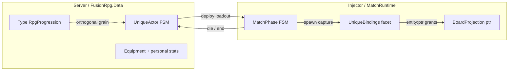
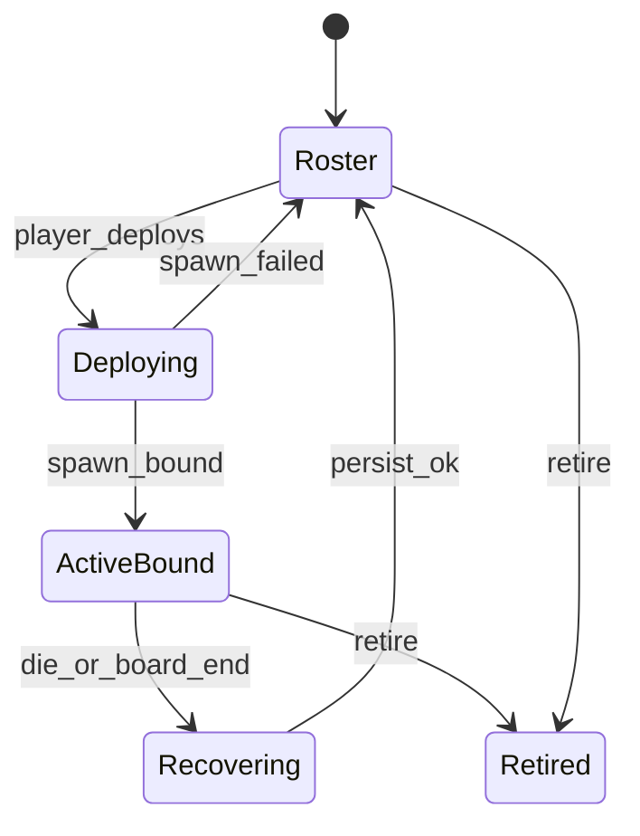

# UniqueActor runtime — durable specimens across runs (design spec)

**Status:** Spec + **W4 Data + Server FSM shipped** (`rpg_unique_*` DDL, `UniqueActorService`, `/api/unique/*`, deploy Intent + ack/die/end observe) + **W5 UniqueBindings / binder / loadout / ops shipped** + **W8-A equipment → mods_json grants shipped** + **W8-B specimen XP awards shipped** + **W8-C roster FE shipped** (`#/roster`).  
**Related:** [match-runtime.md](match-runtime.md) (live run FSM + ephemeral bindings), [unique-entity-effects.md](unique-entity-effects.md) (lawn power path), [overlay-control-loops.md](overlay-control-loops.md) (Hot vs Cold vs Intent), [lawn-projector.md](lawn-projector.md) (FE select Bound → instanceId), [rpg-progression.md](rpg-progression.md) (type almanac XP — orthogonal), [stat-system.md](stat-system.md), [effect-runtime.md](effect-runtime.md), [ledger-snapshot.md](../database/ledger-snapshot.md), [implementation-roadmap.md](implementation-roadmap.md).

Cold specimen SSOT is live in `FusionRpg.Data` + Server. MatchRuntime UniqueBindings + binder + ptr-only Bound loadout + Deploying timeout + ActiveBound boot sweeper + purge-while-bound are live (W5).

---

## 1. Purpose and non-goals

### Purpose

Reserve a **server-side UniqueActor FSM** and identity grammar so future unique plant/zombie **specimens** (individual level, equipment, personal stats, many runs) land without refactoring:

- MatchRuntime / BoardProjection / AdmitSpawn
- FA1 apply scope (`StatApplyScope` / `entity:{ptr}`)
- Type-scoped RpgProgression `(player_id, kind, type_id)`

### Non-goals (remaining after W5)

| Non-goal | Why |
|---|---|
| FE roster / equipment content | **W8-C roster + W8-A equip shipped**; full shop polish = W12 |
| Specimen XP curves / balance | Stub thresholds shipped W8-B; balance product later |
| Server between combat.hit and FA* | Overlay lock |
| Equipment balance / specimen XP formulas | Product later |
| New Unity `typeId` / Plants+ prefabs | Specimens reuse normal `typeId` as spawn template |
| Teaching `StatSystem` about `FusionRpg.Data` | Binder rewrites durable keys at Bound |

---

## 2. Locked plane split

| Plane | SSOT | Owns |
|---|---|---|
| **Live run** | MatchRuntime RAM | `MatchPhase`, BoardProjection, **ephemeral** `instanceId ↔ ptr` ([match-runtime.md](match-runtime.md) UniqueBindings) |
| **Durable specimen** | `FusionRpg.Data` (Server) | UniqueActor row: phase, level, gear, personal mods |
| **Type almanac XP** | Existing `rpg_actor_progression` | Species grain — **not** replaced by specimens |



**Data gate:** all UniqueActor / equipment / durable personal-mod R/W goes through **`FusionRpg.Data` only**. MatchRuntime and Injector never open SQLite for specimens.

---

## 3. Identity grammar (three orthogonal IDs)

Never collapse these:

| ID | Lifetime | Used for |
|---|---|---|
| `typeId` | Catalog species | Almanac XP, `plant:N` / `zombie:N` scope, spawn template |
| `ptr` | One Unity object in one match | BoardProjection, `entity:{ptr}` grants while living |
| `instanceId` | Durable specimen (GUID) | UniqueActor PK, equipment, specimen level, cross-run |

### Owner-key reserve

| Key | When | Hot Unity Resolve? |
|---|---|---|
| `entity:{ptr}` | LIVE lawn apply (shipped) | Yes |
| `instance:{guid}` | Durable grants / personal mods on Server | **No** — injector binder translates to `entity:{ptr}` only while Bound |
| `plant:N` / `zombie:N` / `match` | Type / match scope (shipped) | Yes |

**Rule:** Core `StatApplyScope` stays lawn-oriented. Durable `instance:` must not appear in hot Resolve until a thin deploy binder rewrites it. Avoids StatSystem ↔ Data coupling.

---

## 4. UniqueActor FSM (Server)



| Phase | Meaning |
|---|---|
| `Roster` | Durable individual exists; not on lawn |
| `Deploying` | Deploy accepted; waiting for MatchRuntime bind (`PendingSpawn` → `Bound`) |
| `ActiveBound` | In a run; Server may hold `matchKey` + last known `ptr` for **observe** only |

**ActiveBound is not combat authority.** Hit procs (freeze, heal, ICD) run on the Injector **Hot** loop ([overlay-control-loops.md](overlay-control-loops.md)). UniqueActor phase transitions are deploy/bind/recover — **not** per-hit decisions. Combat procs never drive UniqueActor FSM transitions.
| `Recovering` | Died or board ended — persist XP/gear deltas, clear bind metadata |
| `Retired` | Tombstone; no redeploy |

### Transition notes

| Event | From → To | Side effects (design) |
|---|---|---|
| Player deploys | Roster → Deploying | Load loadout from Data; enqueue Intent (typeId + instanceId + absolutes + grant templates) |
| Spawn bound | Deploying → ActiveBound | Correlate capture/`correlationId` with `instanceId`; store observe ptr |
| Spawn failed / timeout | Deploying → Roster | No lawn grants applied |
| Die or board end | ActiveBound → Recovering | Observe path from events; Injector withdraws `entity:{ptr}` grants **before** ptr reuse |
| Persist OK | Recovering → Roster | Clear matchKey/ptr on row; specimen survives |
| Retire | Roster or ActiveBound → Retired | Soft-delete; ActiveBound path still withdraws lawn grants |

**W4 recover note:** Data persists **ActiveBound → Roster in one write** (`revision + 2`); `Recovering` is not an observable intermediate row (diagram remains the logical model).

**W5-D:** Stuck `Deploying` past timeout (default 30s) → `FailExpiredUniqueDeploys` / `UniqueActorDeployWatchdog` → Roster; Server also enqueues Injector `unique.binding.clear` so MatchRuntime PendingSpawn is GC’d (redeploy can begin).

**W5-E:** Boot `SweepStaleActiveBoundUniqueActors` — ActiveBound with missing/stale `match_key` (no open run) → Roster. Observe lag OK; no Hot coupling.

**W4 deploy Intent:** `pvz.spawn.extra` honors payload `side` (`plant` \| `zombie`, default `zombie` for legacy callers) and emits `pvz.spawn.extra.ack` for Server observe → ActiveBound. W5 adds `instanceId` + `loadoutJson` and MatchRuntime Pending→Bound.

**Observe ≠ control:** Server UniqueActor phase must not gate MatchRuntime AdmitSpawn. Live caps stay CapPolicy RAM. Server must not sit between `combat.hit` and FA* apply ([overlay-control-loops.md](overlay-control-loops.md)).

---

## 5. Data tables (W4 shipped)

| Table | Role |
|---|---|
| `rpg_unique_actors` | Specimen SSOT: `instance_id`, `player_id`, `side`, `type_id`, `phase`, level/xp, `match_key?`, `last_ptr?`, `deploy_correlation_id?`, revision |
| `rpg_unique_equipment` | Gear slots / item refs per `instance_id` (stub table OK) |
| `rpg_unique_stat_mods` | Optional durable personal modifiers JSON (stub table OK) |

All access via `FusionRpg.Data` only ([ledger-snapshot.md](../database/ledger-snapshot.md) hard rule). Do **not** overload `rpg_actor_progression` PK for specimens.

---

## 6. Dual-FSM handshake (deploy / recover)

### Deploy

```text
FE/API: deploy instanceId
  → Server UniqueActor: Roster → Deploying (Data)
  → Intent to injector: typeId + instanceId + absolute loadout + grant templates
  → MatchRuntime: AdmitSpawn → PendingSpawn binding
  → Unity Create → *.spawn capture
  → MatchRuntime: Bound (instanceId ↔ ptr)
  → Injector: Writer absolutes on ptr + Grant(..., ownerKey=entity:{ptr})
  → Server: Deploying → ActiveBound (observe matchKey/ptr via events or ack)
```

### Recover

```text
*.die or board.end / match.result
  → MatchRuntime: binding Cleared; Effect withdraw entity grants + ForgetEntity
  → events / ack → Server: ActiveBound → Recovering
  → Data persist specimen deltas → Roster
```

**Invariant:** withdraw `entity:{ptr}` grants before IL2CPP reuses the ptr ([unique-entity-effects.md](unique-entity-effects.md)).

MatchRuntime **never** writes UniqueActor tables.

---

## 7. Relationship to type RpgProgression

| Grain | Key | Example |
|---|---|---|
| Type almanac | `(player_id, kind, type_id)` | All Peashooters share one plant actor XP |
| Unique specimen | `instance_id` (+ `player_id`) | One named Peashooter with gear/level across runs |

Both may award from Activity later; formulas are out of scope here. Specimens **must not** replace type actors.

---

## 8. Relationship to MatchRuntime UniqueBindings

Live facet (design in [match-runtime.md](match-runtime.md)):

| Field | Meaning |
|---|---|
| `InstanceId` | Durable GUID |
| `Ptr` | Unity hex while Bound; null when Pending/Cleared |
| `TypeId` / `Side` | Spawn template |
| `BindingPhase` | `PendingSpawn` \| `Bound` \| `Cleared` |

Cleared on die/Ending; Server FSM is the durable truth after recover.

---

## 9. Apply-scope fit (no Core change required now)

Shipped scopes already cover reverse-arch lawn targeting:

- Species-wide → `plant:N` / `zombie:N`
- This lawn object → `entity:{ptr}` after bind
- Match-wide → `match`

Future unique power path uses **bind then `entity:{ptr}`** only. Durable `instance:{guid}` stays Server/Data until binder translation.

---

## 10. Test contract (when implementation starts)

Future tests (not authored here):

| Case | Expect |
|---|---|
| Three IDs never conflated in DTOs | Separate fields |
| Deploy → bind → Grants use `entity:{ptr}` | No `instance:` in StatSystem Resolve |
| Die → withdraw before second spawn at same ptr | No grant leak |
| Type XP row unchanged when specimen levels | Orthogonal grain |
| MatchRuntime types have no Data ProjectReference | Guard / grep |
| UniqueActor R/W only in `FusionRpg.Data` | `guard-dal.ps1` |

---

## 11. Implementation status

**W4 shipped:** DDL + `RpgStore.UniqueActors` CRUD/transitions; Server `UniqueActorService` + `/api/unique/*`; EventIngest observe (`pvz.spawn.extra.ack`, die, board.end / match.result). ActiveBound is Cold bookkeeping only. Recover collapsed to one Roster write; Injector `pvz.spawn.extra` honors `side`.

**W5 shipped:** MatchRuntime UniqueBindings Pending→Bound→Cleared; `UniqueOwnerBinder` `instance:` → `entity:{ptr}`; ptr-only absolute loadout + entity grants on Bound; Deploying timeout + Injector Pending GC (`unique.binding.clear`); ActiveBound boot sweeper; Storage purge refused while ActiveBound (`unique.active_bound`).

**W8-A shipped:** Roster-only `GET/PUT/DELETE /api/unique/actors/{id}/equipment` (slots `weapon|armor|trinket`; known stubs `stub.atk_ring` / `stub.butter_bead` / `stub.hp_charm` only — `unknown_item` 400); `RebuildUniqueModsFromEquipment` merges grants into `mods_json` (preserves nested + flat absolutes; GrantIds stamped `base:slot`); deploy empty loadout falls back to mods for Bound. Mid-run ActiveBound equip held.

**W8-B shipped:** `POST /api/unique/actors/{id}/xp` awards specimen XP/level (100 XP/level stub; finite positive delta only — `bad_delta` 400); refuses Retired; never writes `rpg_actor_progression`. Roster FE Award XP.

**W8-C shipped:** `#/roster` create/deploy/retire + equip panel + XP award.

**Still out:** Full gear shop polish (W12); ActiveBound mid-match equip / Hot re-push; specimen XP balance curves; full ActiveBound Hello rehydrate of gear catalogs.

When extending, cite this file + [match-runtime.md](match-runtime.md) and do not reopen Foundation Effects contract v1 opcodes without an ADR.
