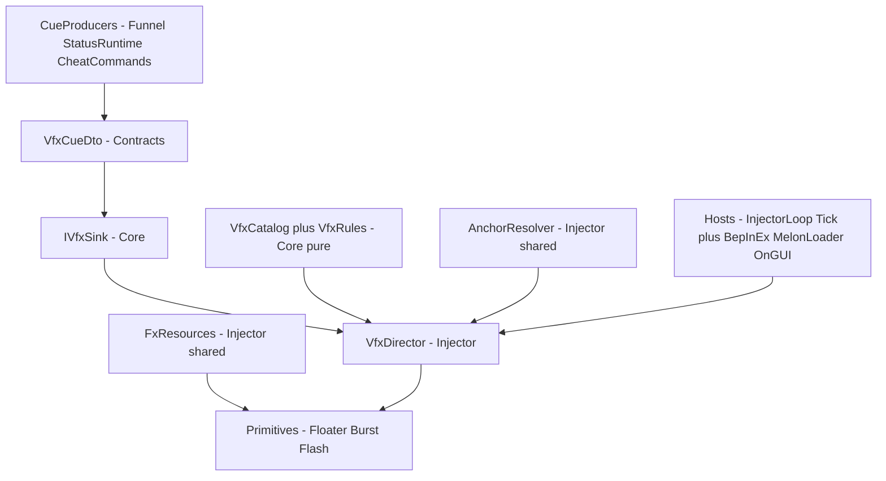

# VFX SSOT — cue → recipe → primitive presentation layer

**Status:** **Locked (2026-08-20); LIVE-proven (2026-08-21, 43/43 + owner visual confirmation)** — migration phases 1–4 in code: the §16 element extension, the `status.{id}.apply` producer path (all 21 catalog statuses seeded), burst shapes, crit-pop/amount-tier floaters with shadow pass, idle-cheap tick, registry-based anchors, element-only hit accents, and the three LIVE render fixes (§10, §16.4). Verdict: `docs/research/effect-runtime/_prove-vfx.json`. See [../../SPEC.md](../../SPEC.md) + `tasks/vfx-v2-todo.md`.
**Parent:** [decisions.md](decisions.md) (ADR row **VFX**). Cue producers: [effect-funnel.md](effect-funnel.md), [status-ssot.md](status-ssot.md), [combat-damage-ssot.md](combat-damage-ssot.md). Current implementation being replaced: `src/FusionRpg.Injector/Fx/*`, `src/FusionRpg.Core/Effects/DamageFx.cs`.

This spec defines the **presentation layer** for RPG overlay visual feedback. It does **not** own gameplay state, and it does **not** replace vanilla PVZ animations or particles.

---

## 1. Problem

FusionRpg has exactly one VFX today — damage floaters plus a world burst — and it works, but it scales by copy-paste:

1. `IDamageFxSink` + `DamageFxDto` are damage-specific. Every new VFX kind (status apply, shield break, spawn puff, death pop) would need its own DTO, sink interface, static overlay class, `InjectorLoop` tick registration, and host `OnGUI` hook.
2. `OverlayWorldFx` mixes four concerns in one class: resource acquisition (shader probe, texture stealing), visual recipe (hardcoded burst count / speed / size), lifecycle (cap, tick, destroy), and spawn API. A second particle style duplicates ~80% of it.
3. `DamageFxOverlay.TryResolve` runs `FindObjectsOfType<Zombie>/<Plant>` per FX event — O(scene) per cue. A DoT-heavy board firing many cues per tick makes this the hot path.
4. Visual tuning is compiled C# scattered across classes. Palette and floater timing live in core (good, testable), but there is no single place that says "what does cue X look like".

Without a VFX SSOT, every new effect invents its own wiring and the presentation layer diverges the same way combat math would have without the combat SSOT.

---

## 2. Product boundary

This layer is intentionally presentation-only.

- VFX **never** writes HP, stats, status state, or any gameplay value. HP stays on the Funnel → FA10 Writer path.
- VFX **never** blocks or reorders gameplay. A failed or skipped VFX is invisible to game logic.
- VFX **never** throws into the game loop. Every Unity call is guarded; failure emits a `debug.fx.skipped` event and returns.
- Vanilla PVZ animations, projectile sprites, and built-in particles stay untouched. This layer only **adds** overlay visuals.
- Game logic emits **semantic cues** ("what happened"), never draw calls. What a cue looks like is owned entirely by this layer.

The VFX layer answers only these questions:

- Given a semantic cue, what should the player see?
- Where on screen / in the world is it anchored?
- How many effects may be alive at once, and which get dropped under pressure?

---

## 3. Layer model



| Layer | Owns | Must not |
|---|---|---|
| **Cue producers** (Funnel, StatusRuntime, cheat commands) | When a cue fires, cue id choice, anchor + payload values | Reference primitives, colors, timings, Unity types |
| **Contracts** (`VfxCueDto`) | Wire shape of a cue | Carry visual parameters (color, count, curve) |
| **Core VFX** (`VfxCatalog`, `VfxRules`, `IVfxSink`) | Cue id vocabulary, recipes, caps, curves, rate limits | Touch Unity APIs |
| **VfxDirector** (injector, the only production sink) | Catalog lookup, anchor resolution call, primitive lifecycle, cap/rate enforcement, debug events | Contain per-cue visual logic (that is recipe data) |
| **Primitives** (injector) | One render style each: spawn / tick / draw / dispose | Know cue ids, look up the catalog, resolve anchors |
| **AnchorResolver** (injector, shared) | ptr → Transform cache, cell/world → position math via `LawnCoords` | Spawn or own visuals |
| **FxResources** (injector, shared) | Shader probe, cached materials, cached textures | Per-effect state |
| **Hosts** | Single `Tick(dt)` + single `Draw()` call into the director | Reference individual primitives or effects |

Rule: **new VFX never touch `InjectorLoop` or host `OnGUI` again.** The director owns the one registration.

---

## 4. Cue vocabulary

### 4.1 Cue id naming (locked shape)

Cue ids are lowercase dotted strings, `domain.subject[.event]`:

```text
combat.hit          damage landed (replaces DamageFxDto path)
combat.heal         positive HP delta
combat.crit         reserved — v1 folds crit into combat.hit via Tag
status.{statusId}.apply    e.g. status.burn.apply, status.butter.apply
status.{statusId}.expire
status.{statusId}.tick     DoT pulse visuals
match.spawn         admitted overlay spawn puff
match.death         overlay-owned death pop
debug.probe         cheat-only test cue, always in catalog
```

Rules:

- An unknown cue id is a **skip + `debug.fx.skipped` (reason `unknown-cue`)**, never a throw. Producers may emit cues before art exists.
- Cue ids are the SSOT vocabulary. Recipes, debug boards, prove scripts, and cheat commands all key on them.
- One cue = one semantic moment. Producers do not emit "combined" cues; the recipe decides if a cue renders multiple primitives.

### 4.2 v1 cue roster (locked)

Phases 1–3 ship exactly three cues: `combat.hit`, `combat.heal`, `debug.probe`.

Status cues are added by **criterion, not list**: a status gets `status.{id}.apply` in phase 4 when its LIVE prove pack next runs — the pack gains one `fx.play`/assert line at the same time. No status cue lands without a prove line.

**Phase 4 complete (vfx-v2, 2026-08-21):** all 21 catalog statuses had prove coverage, so the full roster is seeded (`VfxSeedCatalog.StatusFx` — one statusId→RGB row each). The producer is `StatusRuntime.OnApplied` (fires on definitive apply only, spread hops included; resists and StatusICD emit nothing), wired to `VfxDirector.Sink` in `EffectRuntime.Ensure`. Adding a status VFX is now one `StatusFx` row.

---

## 5. Contracts

One DTO for all cues, in `FusionRpg.Contracts`:

```csharp
public sealed class VfxCueDto
{
    public string CueId { get; set; } = "";

    // Anchor: exactly one of the three forms. Precedence: TargetPtr > Cell > World.
    public string? TargetPtr { get; set; }     // actor anchor (follows the unit)
    public int? Col { get; set; }               // lawn cell anchor
    public int? Row { get; set; }
    public float? WorldX { get; set; }          // raw world anchor (escape hatch)
    public float? WorldY { get; set; }

    // Semantic payload — the recipe decides how (and whether) to show these.
    public long Amount { get; set; }            // damage/heal magnitude for labels
    public DamageFxTag? Tag { get; set; }       // palette + label hint (existing enum)
    public List<ElementPayloadComponentDto>? Elements { get; set; }  // element coloring (§16); reuses the combat contract type

    // Per-emit modifiers (rare; recipes own the defaults).
    public float ScaleMul { get; set; } = 1f;
    public float LifeMul { get; set; } = 1f;
}
```

Rules:

- The DTO carries **semantics, not visuals**. No color, no particle counts, no curve ids.
- `DamageFxTag` stays — it is a semantic classification (crit / dodge / resist / heal), not a visual one. The palette that maps tag → RGB moves into recipe/rules data.
- `DamagePacket.FxTag` and the existing Funnel path keep working: the Funnel adapter translates its damage result into a `VfxCueDto { CueId = "combat.hit", ... }`.

Sink interface, in `FusionRpg.Core`:

```csharp
public interface IVfxSink
{
    void Play(VfxCueDto cue);
}
```

- `NoopVfxSink` — server / headless / tests that ignore visuals.
- `RecordingVfxSink` — test double, mirrors `RecordingDamageFxSink`.
- `VfxDirector` — the single production sink in the injector.

**Threading contract (locked):** `IVfxSink.Play` is callable from **any thread**. The director implementation only enqueues the DTO into a thread-safe queue; all Unity work happens when the main-thread `Tick` drains it. Today every producer already runs on the main thread (Harmony postfixes; `CheatCommandRunner.Drain` in `InjectorLoop.Tick`), so the queue costs at most one frame of latency — and it permanently removes the crash class where a future server endpoint or async continuation calls `Play` off-thread and touches Unity APIs.

`IDamageFxSink` becomes a thin adapter over `IVfxSink` during migration (§13) and is deleted at the end of it.

---

## 6. Recipe model (core, pure)

A **recipe** is data describing what one cue looks like: an ordered list of primitive specs.

```csharp
public sealed class VfxRecipe
{
    public string CueId { get; init; } = "";
    public IReadOnlyList<VfxPrimitiveSpec> Primitives { get; init; } = Array.Empty<VfxPrimitiveSpec>();
    public VfxRateLimit? RateLimit { get; init; }   // null → rules default
}

public sealed class VfxPrimitiveSpec
{
    public VfxPrimitiveKind Kind { get; init; }     // Floater | Burst | Flash
    public VfxColorSource Color { get; init; }      // FromTagPalette | Fixed(r,g,b)
    public VfxLabelSource Label { get; init; }      // None | FromTagAmount | Fixed(text)
    public float LifeSeconds { get; init; }
    public float SizeScale { get; init; } = 1f;     // multiplier over cell-size basis
    public int Count { get; init; } = 1;            // e.g. particle emit count
    public float DelaySeconds { get; init; }        // stagger within one cue
}
```

### 6.1 v1 primitive kinds (locked)

| Kind | Renders | Source of truth today |
|---|---|---|
| `Floater` | Rising IMGUI text label following an anchor | `DamageFxOverlay` |
| `Burst` | Additive particle burst at a position | `OverlayWorldFx` (pooled per §8.4) |
| `Flash` | Brief tint on the anchored unit's renderer | new — phase 3 only, material rules in §8.5 |

New kinds (beam, ring, screen shake, trail) are **new spec rows in this table + one injector class each**, added only when a recipe needs them. Primitives are deliberately few and heavily reused.

### 6.2 Catalog

- `VfxCatalog` maps cue id → recipe; seeded in C# via `VfxSeedCatalog.CreateAll()`, mirroring `EffectSeedCatalog`.
- **[OPEN]** JSON-loadable recipes (like `tests/fixtures/effects/scenarios`) are deferred until the recipe schema stops churning. v1 = C# seeds only. Revisit when a non-programmer needs to tune visuals.
- Replacing a recipe replaces the whole entry — no partial merge semantics.
- The palette (`DamageFxTag` → RGB) and label rules (`DamageFxPalette` today) become catalog-owned data referenced by `VfxColorSource.FromTagPalette` / `VfxLabelSource.FromTagAmount`. Same values, new owner.

---

## 7. Rules and budgets (core, pure)

`VfxRules` generalizes `DamageFxFloaterRules`. All constants live here so tests can lock them.

| Policy key | Role | v1 value |
|---|---|---|
| `VfxRules.FloaterCap` | Max live floaters | **64** (unchanged) |
| `VfxRules.BurstCap` | Max live burst GameObjects | **24** (unchanged) |
| `VfxRules.FloaterLifeSeconds` | Default floater life | **0.9** (unchanged) |
| `VfxRules.BurstLifeSeconds` | Default burst life | **0.55** (unchanged) |
| `VfxRules.RisePixels` | Floater rise distance | **56** (unchanged) |
| `VfxRules.FloaterRateLimitSeconds` | Min interval per `(cueId, TargetPtr)` for floaters | **0.05** |
| `VfxRules.BurstRateLimitSeconds` | Min interval per `(cueId, cell)` for bursts/flashes | **0.15** |
| `VfxRules.GlobalCuePerTickCap` | Max cues admitted per tick | **32** |

Rules:

- Curves (`T(age)`, `Alpha(t)`, `GuiY(...)`) move verbatim from `DamageFxFloaterRules` — they are already correct and test-locked.
- **Overflow policy: drop oldest** (matches current behavior in both overlays).
- **Rate limit** is the ICD idea applied to presentation: a 20-target AoE emits 20 `combat.hit` cues, but redundant renders collapse. Dropped cues still emit `debug.fx.skipped` (reason `rate-limited`) so proofs can count them.
- **Grouping keys (locked):** floaters group per `(cueId, TargetPtr)` — damage numbers on **distinct units never collapse**; bursts and flashes group per `(cueId, cell)` — an AoE hitting a cell renders one burst, not N. `VfxRecipe.RateLimit` overrides the interval per recipe, never the grouping key.
- 0.05s for floaters only collapses same-frame multi-hit spam (vanilla pea cadence and DoT ticks are slower); 0.15s for bursts is below flicker-fusion for the 0.55s burst life, so collapsed AoE still reads as continuous.
- **Deferred:** amount-batching (merging dropped floaters' `Amount` into the live label). Revisit only if rate-limit drops prove confusing in play; not v1 machinery.

---

## 8. VfxDirector (injector)

The director is the only production `IVfxSink` and the only object hosts talk to.

Responsibilities, in order, per `Play(cue)`:

1. Master toggle check (`CheatState`, §11) → skip (`disabled`).
2. Catalog lookup → skip (`unknown-cue`).
3. Rate limit + global cap check → skip (`rate-limited` / `cap`).
4. Anchor resolution via `AnchorResolver` → skip (`missing`).
5. Instantiate primitive instances from the recipe specs (honoring `DelaySeconds`).
6. Emit `debug.fx.shown` with `cueId`.

### 8.1 Lifecycle

- Hosts call exactly `VfxDirector.Tick(unscaledDeltaTime)` and `VfxDirector.Draw()`. Tick drains the cue queue (§5 threading contract) first, then advances live primitive instances and enforces caps.
- Every step is guarded; exceptions are swallowed and emitted, mirroring the current `try/catch` discipline in `InjectorLoop`.
- **Match-end clear (locked):** on `Board.Die` (hook already exists in `GameHooks`) the director calls `ClearAll()` — destroys/releases every live primitive instance and flushes the cue queue. Primitives must additionally tolerate their anchor being destroyed mid-life at any moment (expire silently, current floater behavior). Never rely on the clear alone.

### 8.2 Time base (locked)

VFX animate on **`unscaledDeltaTime`**, matching today. Deliberate: floaters/bursts stay debuggable while the game is paused or speed-cheated, and presentation never depends on gameplay timescale. Do not "fix" this to scaled time.

### 8.3 IMGUI rules (locked)

- `OnGUI` runs multiple times per frame (Layout, Repaint, input events). `VfxDirector.Draw()` **must early-return unless `Event.current.type == EventType.Repaint`** — the current `DamageFxOverlay.Draw` does the full label loop on every event and this audit retires that.
- Use one cached `GUIStyle` (constructed once from `GUI.skin.label`) instead of mutating and restoring the shared skin style per call.
- `Camera.main` performs a tag lookup per call on this Unity version; the director resolves it **once per Tick**, caches it for the frame, and re-resolves on null (scene change).

### 8.4 Burst pooling (locked)

`OverlayWorldFx` today creates a `GameObject` + `AddComponent<ParticleSystem>` per burst and `Destroy`s it ~0.55s later — allocation and IL2CPP interop churn on the hottest visual path. `BurstPrimitive` instead owns a **fixed pool** of `ParticleSystem` objects:

- Pool size = `VfxRules.BurstCap` (24), created lazily, `HideAndDontSave`, one shared cached material from `FxResources`.
- Playing a burst = take next pool slot (round-robin; stealing the oldest live slot when full preserves the drop-oldest policy), reposition, `Clear()`, `Emit(...)`. No per-burst instantiate/destroy.
- Scene unload may destroy pool objects externally; the pool detects dead entries (Unity null) and rebuilds them lazily. `ClearAll()` stops all systems but keeps the pool.

### 8.5 Renderer material rules (locked — applies to `FlashPrimitive` and any future tint)

- **Never** access `renderer.material` — in IL2CPP each call instantiates a leaked material copy. Tint via `SpriteRenderer.color` (capture original once, restore on expiry) or `MaterialPropertyBlock` for non-sprite renderers.
- At most **one flash per renderer at a time**: a re-trigger resets the timer but keeps the originally captured color, so restore never writes a mid-flash color back as "original".
- The game applies its own tints (freeze/butter visuals). Last-writer-wins during the flash is accepted; the capture/restore rule bounds the damage to ≤ one flash duration.
- If the anchored unit has no accessible renderer, the flash skips (reason `particle-fail` family) — never a throw.

---

## 9. Anchor resolution (injector, shared)

`AnchorResolver` replaces per-overlay `TryResolve`:

- ptr → `Transform` lookups served from a cache — never `FindObjectsOfType` per cue.
- **Fill strategy (locked, updated vfx-v2 T1): the shared `InjectorEntityRegistry`.** `AnchorResolver` is a thin facade over the combat path's hook-fed, IntPtr-keyed registry (`FindZombie/FindPlant(ptrHex)?.transform`) — VFX owns no cache and no scan of its own. A miss triggers the registry's frame-throttled resync (`ResyncFrames = 1024`, the mid-match-attach backstop); repeat misses inside the window skip with reason `missing`. The original VFX-private cache + 0.5s sweep was retired when the registry (built later for the event pipeline) superseded it.
- Cell anchors go through `LawnCoords.CellCenter` + `ClampCol/ClampRow`; unit anchors through `LawnCoords.BodyWorld`. `EstimateCellSize` moves here from `OverlayWorldFx` as the shared size basis primitives scale against.
- A destroyed/missing anchor at spawn time = skip. A destroyed anchor mid-life = the primitive instance expires silently (current floater behavior).

---

## 10. FxResources (injector, shared)

- Absorbs `OverlayShaderProbe` (candidate list, live `Shader.Find`, probe events) unchanged.
- Owns the cached material(s) and textures (`StealParticleTexture`, `SoftDisc`) currently in `OverlayWorldFx`.
- Primitives request materials by role (`AdditiveParticle`, future `SpriteTint`); FxResources caches per role.
- No shader available → primitives that need one skip with reason `no-shader`, floaters still work (IMGUI needs no shader). This matches today's degradation.
- Texture is **always the generated soft disc** (changed 2026-08-21): the v1 steal-first rule rendered arbitrary vanilla imagery inside our bursts (electric/lightning sprite sheets — LIVE finding), nondeterministic per scene. The steal is deleted, which also makes all VFX code `FindObjectsOfType`-free (guard-pinned).
- Shader preference is **alpha-blend first** (`Sprites/Default`, then unlit particle shaders): additive blending washed pale element colors to near-white over the bright lawn (LIVE finding). The pooled systems also disable Unity's default emission module — auto rate-emission painted default-white circles over every burst until this was killed.
- Render ordering constants (today's magic `sortingOrder = 80`) live here as named constants — one place to move VFX above/below future overlays.

---

## 11. Observability and debug

House pattern, extended:

| Surface | Rule |
|---|---|
| `debug.fx.shown` | Always includes `cueId`, anchor fields, primitive kinds rendered |
| `debug.fx.skipped` | Always includes `cueId` + enumerated `reason`: `disabled`, `unknown-cue`, `muted`, `rate-limited`, `cap`, `missing`, `no-shader`, `particle-fail`, `no-element` |
| `debug.fx.world.shown` / `.skipped` | **Retired in phase 2** — folded into the two events above. Phase 2 must update [../protocol/events.md](../protocol/events.md) §fx row and the curl example in [../runbook/debug-pipeline.md](../runbook/debug-pipeline.md) in the same change |
| `debug.fx.world-flash` | **Command/scenario step name survives unchanged** — it is locked into `DebugScenarios.AllowedStepNames` (test-pinned) and the `/fx/world-flash` endpoint. It becomes an alias for `fx.play debug.probe <col> <row>` |
| CheatState `SYS-DAMAGE-FX` | **Locked: keep the id, no rename.** It is baked into `CheatSchema`, `CheatRegistry`, `CheatState`, E2E tests, README, and runbooks; a rename buys naming honesty and nothing else. Its documented meaning widens to "all overlay VFX" |
| Per-cue mute | `fx.mute <cueId>` / `fx.unmute <cueId>` cheat commands for debugging noise |
| `fx.play <cueId> [col row \| ptr]` | Cheat command to preview any catalog cue in-game; the existing cell-flash command becomes the alias above |
| `fx.list` | Dump catalog cue ids + recipe summaries |
| `scripts/prove-vfx.ps1` | Plays every catalog cue via `fx.play`, asserts one `debug.fx.shown` per cue (or expected skip), catches broken recipes and stripped shaders in one pass |

---

## 12. Testing model

- Core tests (no Unity): catalog completeness (every cue id has a recipe; every recipe references known primitive kinds), rules constants locked, rate-limit math, `RecordingVfxSink` assertions on producer wiring (Funnel emits `combat.hit` with correct tag/amount).
- Existing `OverlayCombat*` and `OverlayProc*` tests pin producer behavior through the migration — they must pass unmodified in every phase.
- Injector-side behavior (shader fallback, anchor cache) is proven LIVE via `prove-vfx.ps1` + debug events, matching the existing prove-pack culture. No Unity test framework is introduced.

---

## 13. Migration plan (each phase ships green)

| Phase | Change | Proof |
|---|---|---|
| **1** | Add `VfxCueDto`, `IVfxSink`, `VfxCatalog` (+`combat.hit`/`combat.heal`/`debug.probe` recipes), `VfxDirector` delegating internally to existing `DamageFxOverlay`/`OverlayWorldFx`. `IDamageFxSink` becomes an adapter emitting cues. | All existing tests green; LIVE damage floaters unchanged |
| **2** | Extract `AnchorResolver` (hook-fed cache, §9) + `FxResources`; rewrite the two overlays as `FloaterPrimitive` + pooled `BurstPrimitive` (§8.4) driven by recipe specs; Repaint gating + cached style + camera cache (§8.3); `ClearAll` on `Board.Die` (§8.1); retire `debug.fx.world.*` events. Hosts call director only. | `prove-vfx.ps1` v1; [../protocol/events.md](../protocol/events.md) + [../runbook/debug-pipeline.md](../runbook/debug-pipeline.md) updated in-change |
| **3** | `fx.play` / `fx.list` / `fx.mute` commands + rate limiting + `FlashPrimitive`. | Prove script asserts rate-limit skips |
| **4** | First new content cues (`status.{id}.apply` roster) as pure catalog + producer-emit changes. | One prove line per new cue |

Delete list at end of phase 2: `DamageFxOverlay`, `OverlayWorldFx` (as public API), `IDamageFxSink` direct implementations. `OverlayShaderProbe` survives inside `FxResources`.

---

## 14. Rejected paths / ban list

- No timeline / keyframe / sequencing DSL. A recipe is primitives + params + optional per-primitive delay. If a cue needs choreography beyond that, that is a design smell — split the cue.
- No runtime YAML/JSON recipe registry in v1 (C# seed catalog only).
- No per-VFX sink interfaces, DTOs, or static overlay classes ever again.
- No `FindObjectsOfType` in the per-cue path; reconciliation sweeps throttled per §9.
- No `renderer.material` access anywhere in VFX code (§8.5).
- No per-burst GameObject instantiate/destroy — pooled systems only (§8.4).
- No draw work outside `EventType.Repaint` (§8.3).
- No Unity API calls from `IVfxSink.Play` — enqueue only (§5).
- No gameplay reads or writes from any VFX class (HP, stats, status, RNG that gameplay observes).
- No vanilla particle/animation replacement — overlay additions only.
- No new asset pipeline (bundles, sprite imports) in v1 — generated textures + stolen game textures + IMGUI, as today.
- No Unity test framework; injector behavior is proven LIVE.
- No throw may escape into `InjectorLoop`, `OnGUI`, or Funnel flush.

---

## 15. Sealed decisions (Unity audit, 2026-08-20)

Resolutions of the draft's open questions, plus what the audit added:

| # | Question | Resolution | Why |
|---|---|---|---|
| 1 | v1 cue roster | **Criterion, not list** (§4.2): a status gets its cue when its LIVE prove pack next runs | Ties every cue to a proof line; no unproven art debt |
| 2 | Rate-limit defaults + grouping | **Floaters 0.05s per `(cueId, TargetPtr)`; bursts 0.15s per `(cueId, cell)`** (§7) | Distinct-unit damage numbers never collapse; AoE bursts do |
| 3 | Global cue-per-tick cap | **32** (§7) | 2× worst observed AoE fan-out headroom; drop-oldest beyond |
| 4 | Anchor cache fill | **Incremental via existing spawn/die Harmony hooks + sweep fallback throttled to 0.5s** (§9) | Hooks already exist and are O(1); per-tick IL2CPP sweeps are the hot path this spec removes |
| 5 | `SYS-DAMAGE-FX` rename | **Keep the id forever; widen its documented meaning** (§11) | Baked into schema, registry, E2E tests, README, runbooks — pure churn |
| 6 | JSON recipe loading | **Deferred** until schema stable + a non-programmer tuning need exists (§6.2) | Unchanged from draft |
| 7 | `combat.crit` cue | **Folded into `combat.hit` via `Tag`** (§4.1) | Matches current semantics; crit is a hit classification, not a moment |

Audit additions that were not open questions in the draft:

| Addition | Section | Trigger |
|---|---|---|
| Thread-safe cue queue, drain on main-thread Tick | §5, §8.1 | Nothing enforced main-thread for future callers (server endpoints, async continuations) |
| `Draw()` gated on `EventType.Repaint`; cached `GUIStyle`; per-tick `Camera.main` cache | §8.3 | `OnGUI` runs multiple times per frame; current code pays the full loop each time |
| Pooled `ParticleSystem` bursts (no per-burst instantiate/destroy) | §8.4 | GameObject churn on the hottest visual path |
| `renderer.material` ban; `SpriteRenderer.color` / `MaterialPropertyBlock` capture-restore rules | §8.5 | IL2CPP material instantiation leaks; game-owned tints (freeze/butter) must survive a flash |
| `ClearAll()` on `Board.Die` | §8.1 | Live primitives outliving the match reference destroyed transforms |
| `debug.fx.world-flash` **command** survives event retirement as `fx.play` alias | §11 | The step name is test-pinned in `DebugScenarios.AllowedStepNames` |
| unscaled time locked as deliberate | §8.2 | Prevents a future "fix" to scaled time breaking pause debugging |

---

## 16. Extension: element damage visuals (locked 2026-08-20)

First content consumer of this spec: overlay damage hits colored by element. Element Hub semantics stay in [element-hub-ssot.md](element-hub-ssot.md); this section owns only what elements **look like**.

### 16.1 Shape

- **No new cue ids.** Element data rides on `combat.hit` via `VfxCueDto.Elements` (§5), copied verbatim from `DamagePacket.ElementPayload` by the Funnel adapter. Missing/empty list = neutral hit = exactly today's visuals.
- Rendering is recipe **color-source** logic, not new primitives: `VfxColorSource` gains `FromElementPayload`.

### 16.2 Element palette (locked v1)

| Element | RGB | Rationale |
|---|---|---|
| `omni` / no payload | 255, 255, 255 | **White — identical to the existing damage overlay.** Neutral hits look unchanged |
| `fire` | 255, 90, 40 | Ember orange-red |
| `ice` | 110, 210, 255 | Glacial cyan |
| `air` | 190, 255, 170 | Pale gust green (white is taken by omni) |
| `earth` | 210, 160, 70 | Amber ochre |
| `light` | 255, 232, 120 | Radiant gold (roster growth 2026-08-21; membership via `ElementRoster`) |
| `dark` | 150, 90, 220 | Umbral violet |

Single-element payload → that element's color for floater text and burst particles.

### 16.3 Hybrid rule (locked v1) — "rainbow"

A payload with **≥ 2 concrete elements** renders multi-colored, cost-free:

- **Burst:** particles are already emitted one-by-one with a per-particle `Color32` (§8.4 pool `Emit` call). Hybrid bursts sample particle colors across the payload's element colors proportionally to weight, plus a small hue spread — zero extra draw calls, zero material changes.
- **Floater:** `GUI.color` is set per label per draw anyway; hybrid floaters cycle hue across the component colors over the 0.9s life. One `Color.Lerp` per frame per floater.
- Banned implementations of "rainbow": gradient textures, per-frame `material.SetColor`, shader work, more than one label per hit. The effect is per-particle/per-draw color only.

### 16.4 Color precedence (locked)

| Hit classification | Color | Label |
|---|---|---|
| `Dodge`, `Block`, `Null`, `Absorb`, `Reflect`, `Heal`, `Weak`, `Resist` | Tag palette (unchanged) | Tag label (unchanged) |
| Plain damage, element payload present | Element color / hybrid | Amount |
| `Crit`, element payload present | Element color / hybrid, **1.25× font size** | Amount |
| Plain damage or `Crit`, no payload | Current palette (white / crit orange) | Amount |

Rationale: semantic outcomes (MISS/BLOCK/…) must stay instantly readable and keep their colors; element identity takes over only where color was previously just "white number". Crit keeps distinctness through size instead of color, because crit-orange collides with fire.

**vfx-v2 additions (2026-08-21, SPEC W3/W4 — all pure `VfxRules` math, test-pinned):**

- Crit size is a **pop curve**, not a flat 1.25×: starts at `CritPopStartScale` (1.5×), settles to 1.25× by normalized life t = 0.3. Applies to every crit, element payload or not.
- **Amount tiers** scale numeric labels: |amount| < 50 → 0.9×, < 200 → 1.0×, ≥ 200 → 1.15×. Semantic labels (MISS/BLOCK/heal "+n") never scale.
- Floaters draw with a **1px black shadow pass** (two labels per floater, Repaint-only) for readability on bright lawns.
- Bursts have a **shape** (`Radial` — the legacy default, `Rising`, `Directional`) computed by pure `VfxBurstMath`; `combat.heal` uses Rising motes, and `combat.hit` now includes the `Flash` primitive (first user of §8.5).
- **Element-only hit accents (owner call, 2026-08-21 LIVE feedback):** `combat.hit`'s burst and flash carry `RequireElement` — plain/omni damage renders the number only (no white puff; it fires on every hit and carries no signal), so the colored burst *is* the element signal. A cue whose renderable specs were all element-gated skips with reason `no-element`. `SYS-ELEMENT-FX` off degrades element hits to the same plain path.

### 16.5 Toggle (locked)

New CheatState toggle **`SYS-ELEMENT-FX`**, default **on**, registered in `CheatSchema`/`CheatRegistry` like `SYS-DAMAGE-FX` — which makes it settable through the existing cheats API (web/server document → command inbox → injector) with no new endpoint work:

- `SYS-DAMAGE-FX` off → no VFX at all (master, unchanged).
- `SYS-ELEMENT-FX` off → element hits render exactly as today (white/tag palette); coloring and hybrid sampling are skipped entirely.

This is the crowded-board relief valve: heavy fights can drop back to plain white numbers via API without losing damage feedback.

### 16.6 Performance budget (locked gate)

Element coloring must add **zero** per-hit allocations, **zero** material or shader changes, and **zero** new objects: colors are precomputed constants; hybrid = per-particle `Color32` at emit + one lerp per floater draw. Worst-case live object count is **unchanged** from the sealed caps (64 floaters, 24 pooled bursts, §7 rate limits apply as-is) — element FX cannot exceed the ceiling plain damage FX already has. If an implementation needs to break any of these to look right, the look changes, not the budget.

### 16.7 Order and proof

Lands as **migration phase 4** content — phases 1–3 (director, pooling, `fx.play`) must ship first; coloring pooled primitives before pooling exists would be building on the code this spec deletes. Proof: `prove-vfx.ps1` gains `fx.play combat.hit` variants for each single element and one hybrid payload, asserting `debug.fx.shown` per variant, plus one `SYS-ELEMENT-FX`-off run asserting the neutral path.

---

## 17. Related docs

- [element-hub-ssot.md](element-hub-ssot.md) — element roster and payload semantics that §16 renders
- [effect-funnel.md](effect-funnel.md) — the producer that emits `combat.hit`/`combat.heal`; Funnel flush must never see a VFX throw
- [combat-damage-ssot.md](combat-damage-ssot.md) — where `FxTag` semantics are decided
- [status-ssot.md](status-ssot.md) — future `status.*` cue producers
- [decisions.md](decisions.md) — ADR row lands when this doc locks
- [../runbook/debug-live-checklist.md](../runbook/debug-live-checklist.md) — LIVE checks to update in migration phase 2
- [../research/effect-runtime/05-icd-audit.md](../research/effect-runtime/05-icd-audit.md) — the ICD idea the rate limiter borrows
