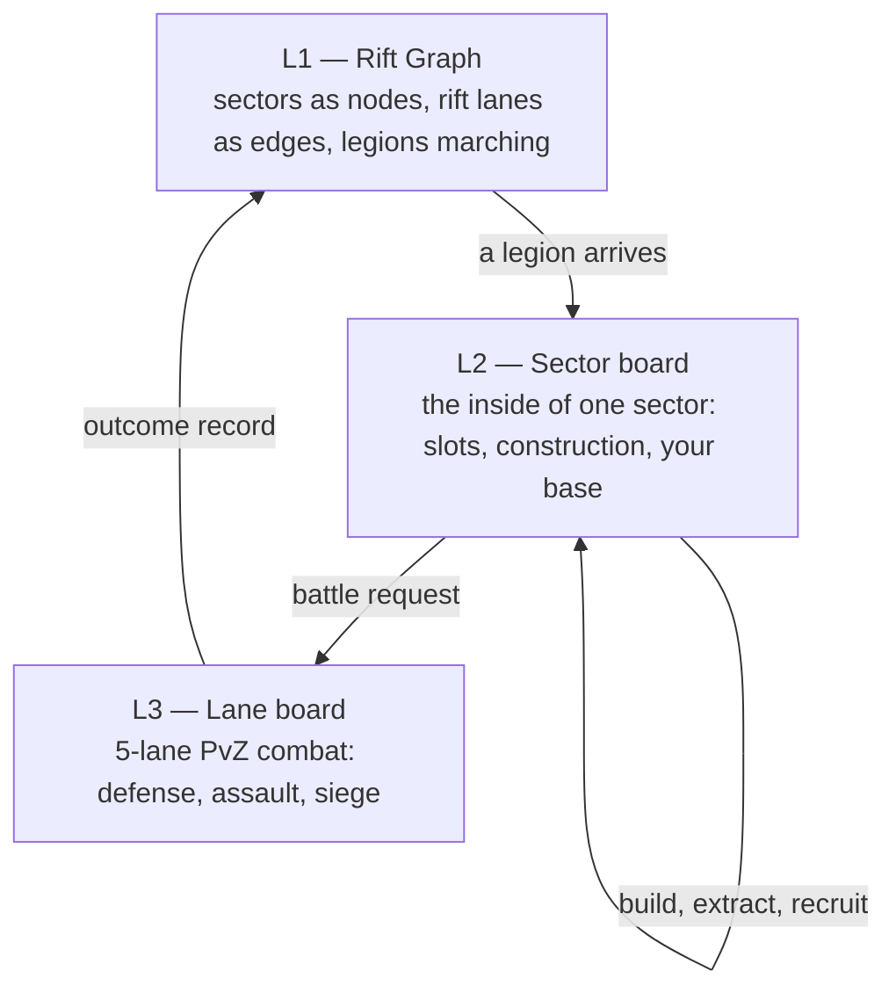

# The ideal — Rift Graph: a PvZ multiverse as a living strategy map

**Status:** **Ideal capture (2026-08-21)** — a vision document, not a spec. No module ids, no build order, no acceptance criteria, nothing committed. It exists to be argued with, edited, and cut down before anything becomes a capability map. Grounding audit: [rpg-mechanism-audit-2026-08-21.md](rpg-mechanism-audit-2026-08-21.md). Prior art in §14.

**Owner picks (2026-08-21):**

- World state = **full simulation**; the map **replaces** expedition tiers.
- Core map gameplay is **strategy** in the Endless Space shape: **sectors** are the graph's nodes, each sector is a **board-level map** holding constructible objects — resource generators, buildings, defenses — and your base sits inside one. Build economy → build army → expand territory → **defeat Dr. Zomboss**.
- Sectors have **specific environments**, and not all of them are claimable: base-capable, no-base, boss, unknown, neutral, allied.
- The map's mobile unit is a **legion**, and the player fields several. **Hero recruitment comes later** — heroes will fill a commander slot that already exists.
- **The player is Dave, and the capital is his homeworld.** Losing it carries heavy consequences; how heavy is deliberately deferred (§10.5).
- **Time model: turn-based at the SSOT. Locked.** Not "one actor at a time" — a turn resolves **every** entity simultaneously (WEGO / deterministic-lockstep shape), and the turn barrier simply has no deadline: it lasts until every commander (the human, Zomboss, the neutrals) has committed. Removing that lock is precisely what would make it an RTS, so `step` is written never to know why the barrier released (§3). Existing real-time features (expeditions' `due_utc`) get refactored onto turns **after** the world map is complete.
- **Scope of that clock: the strategy map only.** Combat has its own clock and its own turn management, owned by a different stream — they build turns for *actors in a battle*, we build turns for *commanders on a map*. The two never share a unit and never read each other's internals (§3.13).
- Assets stay simple. Depth is bought with rules.

---

## 1. The premise

Canon we lean on, not invent: Zomboss's time machine **malfunctioned and scattered its pieces across time and space**, and he sent zombies through the eras to recover them; Crazy Dave chases him with Penny. PvZ2's eras run Jurassic Marsh → Frostbite Caves → Ancient Egypt → Dark Ages → Pirate Seas → Lost City → Wild West → Big Wave Beach → Neon Mixtape Tour → Player's House → Far Future.

**Our branch:** where a shard landed, plant and zombie *fused*. That is what the Fusion mod is, told as lore.

**You are Dave.** The demons are what the fracture made of his lawn's plants and his lawn's zombies; **the capital is his homeworld**, the one timeline still his; Penny is how legions reach the other eras at all. Everything the player owns — roster, reserve, altar, fusion lab, atlas, stored haul — lives at home, which is what makes defending it the spine rather than one more objective.

**Win condition:** find Zomboss's fortress sector and take it. **Lose condition:** the homeworld falls.

---

## 2. Three layers



**L1 is where you decide. L2 is where you build. L3 is where it is tested.** Every one of them is small, readable, and made of the pieces the codebase already has.

**L1 and L2 are this design's scope. L3 is a neighbour, not a component** — combat runs its own clock and its own turn management under a different stream. This document only specifies what crosses the line between them (§3.13).

---

## 3. The simulation SSOT — a deterministic step behind a command barrier

> **Scope: the strategy map.** Everything in this section is the clock for *commanders moving on a graph*. A battle's internal clock — rounds, initiative, cooldowns, status ticks — is a separate domain with its own turn management, owned by a different stream. The seam between them is §3.13, and it is deliberately narrow: the map hands a battle a request and consumes an outcome. Neither side reads the other's internals.

**Yes, this works, and it is the standard architecture for exactly what you described.** It has two names in two traditions, and they are the same machine:

- **WEGO** in wargames: everyone plots orders in a decision phase, then all orders execute *simultaneously* in an execution phase. Combat Mission, Frozen Synapse, Dominions.
- **Deterministic lockstep** in RTS: the sim is sliced into turns; every commander's inputs for a turn are gathered; once all inputs are in, every peer advances one simulation step with them. Age of Empires ran this at ~200 ms per turn with commands scheduled two turns out — which is why an RTS is not really "real time" either.

Our model is that machine with one setting changed: **the barrier has no deadline.**

### 3.1 The model in one line

```
state(turn N+1) = step( state(turn N), commands(N) from every commander )
```

`commands(N)` is the union of what **all** commanders submitted for turn N — the human, Zomboss, neutral clans, rivals. Nothing in `step` cares who issued what. There is no "active player", no acting-one-at-a-time pipeline, and no wall clock inside the model.

### 3.2 The barrier is the time model — and yes, removing the lock makes it an RTS

The only thing that decides *when* a turn fires is one policy:

| Barrier policy | The game you get |
|---|---|
| `fire when every commander has committed` | **turn-based (WEGO)** — our lock; a turn lasts as long as thinking takes |
| `fire when every commander has committed **or** the deadline elapses` (uncommitted = stand-fast) | **real-time strategy** — the deadline is the tick rate |
| `fire on the deadline, no waiting` | twitchy RTS with input lag, the AoE model |

So the answer to your question is literally yes: **RTS is this design with a timeout on the barrier.** That is not an analogy — a fixed tick rate is a barrier deadline. Which gives us a strong architectural rule to build under:

> Write `step` so it never knows why the barrier released. Then turn-based today and real-time later is a **policy change, not a rewrite**.

Layers may even choose different policies: the world map runs `wait for all`, while an L3 lane board is naturally a fast local loop. A board is a black box the world consumes the *result* of — so the world's turn stays deterministic even when the board it contains was played by human hands in real time (§3.9).

### 3.3 Two clocks: the turn and the sim step

A turn is not one instant. It is **N deterministic sim steps** executed after the barrier releases — the same way an RTS runs many sim frames, just without a stopwatch pacing them.

| Clock | Scale | Purpose |
|---|---|---|
| **Turn** | a day | the barrier unit; where commands are committed and the calendar rolls |
| **Sim step** | a slice of that day | where movement, interception, and contact actually happen |

Sub-steps are what make simultaneity feel real instead of arbitrary: two legions marching toward each other along one lane **meet in the middle**, at the step where their positions cross, rather than one of them teleporting past the other because it was processed first.

### 3.4 Simultaneity — the part that is actually work

Everything moving at once means conflicts, and conflicts need rules that are stated, not emergent. Order within a turn:

```
Commit → Reveal → [ sim steps: Move → Contact → Combat ] → Sieges →
Construction & Production → Growth → Pressure spread → Events/Calendar → Snapshot
```

**No order may read another commander's orders for the same turn.** Orders are sealed at Commit and revealed together. That is what makes simultaneity fair, and it is also what makes the AI honest — it cannot counter what it has not seen.

Conflicts and their rulings:

| Situation | Ruling |
|---|---|
| Two forces enter the same empty sector | they meet — a battle where neither side is "the defender" (no fortification bonus) |
| Two forces cross on the same lane | they meet at the crossing step and fight *on the lane*, not at either end |
| A force attacks another that is leaving | zone of control halts the mover on entry, so leaving must be ordered *before* contact — retreat is a decision, not a reflex |
| Two claims on one slot | higher initiative claims; the loser keeps its movement and is simply blocked |
| Mutual destruction | allowed. Both sides can lose everything in one turn |
| Anything still tied | stable sort by entity id — never by dictionary order |

### 3.5 Determinism rules (the same discipline the battle engine already runs)

Integer or fixed-point only in game-affecting branches · stable ordering by entity id, never dictionary enumeration · seeded per-system RNG streams · no wall-clock reads anywhere in `step` · every resolution stamped with `(engineVersion, rulesetVersion, seed)`.

The payoff: a save is `(worldSeed, command log)`, a golden test is a turn log with an expected end state, a bug report is reproducible by construction, and **one turn is one transaction** — correlation-idempotent, exactly like a summon or a fusion today.

### 3.6 Commanders — the human is not special

Zomboss, neutral clans, and rival summoners submit the **same command objects** through the same interface as the player. Consequences, all good:

- The AI is auditable — it cannot cheat without someone writing a cheat, visibly.
- Difficulty is a *policy*, not hidden bonuses.
- A headless all-AI game runs in CI: balance sweeps, regression seeds, "does Zomboss win if nobody stops him" as an automated test.
- The autopilot policy that plays a delve, the defense policy that holds a base, and the Zomboss brain are the same kind of object.

### 3.7 Playback — turn-based truth, real-time feel

Because a turn is many sim steps, the client can **replay those steps as an animation**: legions actually walk their lanes, meet, and fight. That is the WEGO playback trick, and it is how a turn-based SSOT can look alive without a single new asset — the world moves, you just do not fight the clock while deciding.

### 3.8 What must never be written (or the RTS switch closes)

- No code that assumes one entity acts at a time.
- No code that reads a wall clock inside `step`.
- No code that assumes the human is the only decision-maker, or that a turn has exactly one author.
- No per-turn work that could not run a hundred times faster if the deadline shrank.

### 3.9 The one honest caveat

A hand-played L3 board is a human in real time; it is not reproducible from a seed. So the world consumes its **recorded outcome** as an authoritative fact, and world replay uses that record rather than re-simulating the board. Auto-resolved boards stay fully reproducible. That split is normal for this architecture and worth stating plainly rather than discovering later.

### 3.10 What the world does while everyone plots

| Force (world) | Behavior | Counter-force (player) |
|---|---|---|
| Instability drift | sectors trend back toward unstable | stabilize with shards |
| Incursion pressure | accumulates at tears and warcamps, **spreads along lanes** | garrison, ward a lane, raze the source |
| Depletion | worked deposits yield less, recover slowly | rotate territory, build refineries |
| Roaming powers | warlords patrol, grow, claim lairs | hunt and bind them |
| Era events | timed rule overlays across a cluster | plan around them, or exploit them |
| Shard gravity | the more shards you hold, the harder Zomboss looks for home | spend, hide, or fortify |

### 3.11 The calendar — day, week, month

A turn is a **day**. Seven days make a **week**, four weeks a **month**, and the boundaries are where the world gets its rhythm — the proven cadence from the genre, and it lands perfectly on systems we already have:

| Boundary | What it does |
|---|---|
| **Every week** | lairs and hatcheries release their accumulated recruits — your army arrives in pulses, not a trickle |
| **Special week** (a minority of weeks) | one species or element grows far faster — a windfall that rewards holding the right ground |
| **Special month** (occasionally) | the month opens with doubled growth — the moment to plan an offensive around |
| **Plague month** (rare) | stocks are halved and growth stops for a week — the moment you find out whether your defenses depend on fresh bodies |
| **Era events** | blood moon, eclipse, temporal storm: rolled at month boundaries, running for a stated number of turns |

Weekly recruitment pulses are the single most valuable thing turns buy us: they give the whole game a heartbeat, they make "hold this lair for three more weeks" a real plan, and they let an attack be timed against a known refresh.

### 3.12 Movement and multi-turn work

Legions get **movement points per turn**, spent across the turn's sim steps; lane length and hazard set the cost, corridors are cheaper, ley lanes are cheaper for matching banners, and an enemy's zone of control stops a march dead at the step it makes contact. Construction, sector projects, sieges, and long delves span turns — you commit, and the work advances each turn.

Which makes the forecast exact rather than approximate: **"warband of five, fire-typed, arrives on turn 11"** is a computed fact — though only as good as your intel, since it assumes they do not change their orders.

### 3.13 Two clocks that never touch — strategy turns vs combat rounds

Two separate domains, two separate streams, two separate vocabularies:

| | **Strategy clock** (this design) | **Combat clock** (other stream) |
|---|---|---|
| Unit | **turn** — a day on the map | **round** — a beat inside one battle |
| Who acts | commanders: the player, Zomboss, neutrals | actors: individual demons and structures |
| Question it answers | who moves where, what gets built, what is claimed | who hits whom, in what order, for how much |
| Barrier | every commander commits (§3.2) | its own, owned by that stream |
| Owner | this document | the combat/actor stream |

**Vocabulary rule:** a map step is always a **turn**, a battle step is always a **round**. Never "turn" for a battle beat in our docs, never "round" for a map step in theirs. The two streams can then read each other's specs without ambiguity.

**Never convert between them.** One turn is not N rounds. A battle occupies whatever map time the *world* says it does — normally the turn it happened in — no matter whether it internally ran three rounds or thirty. The moment a formula multiplies turns by rounds, the seam has leaked.

#### The seam

```
world turn  ──BattleRequest──▶  combat domain (its own clock, its own turns)
            ◀──OutcomeRecord──
```

**What the map sends:** who is fighting (composition, levels, elements, traits, wounds carried in), the board layout when there is one (base defense or siege), the sector's climate and any active overlay rule ids, the objective (annihilate · hold N · breach), and a **derived seed** so the result is reproducible.

**What the map consumes:** the result (victory · defeat · stalemate · rout), per-actor end state (survivors, HP, wounds, deaths, captures), anything earned (XP, loot, essence), and an event log for presentation. Nothing else.

#### Invariants that keep it clean

1. **Combat is stateless between turns.** Anything that must persist — wall damage, wounds, a depleted garrison — comes back in the outcome and is stored by the **world**. A multi-turn siege is therefore a fresh engagement each turn, built from world-held state, not a battle left paused in memory.
2. **Combat never writes world state.** It does not claim sectors, spend shards, or move legions. It reports; the world decides consequences. (Same shape as the existing rule that combat effects never write ledgers directly.)
3. **The world never reads combat internals** — no round counts, no cooldowns, no millisecond durations in any map-side formula. A battle's duration is informational.
4. **Outcomes are records, not dependencies.** Each is stamped with the combat engine and ruleset version. World replay reuses the stored record rather than re-simulating a battle — which is also what makes a hand-played board legal (§3.9).
5. **Many battles per turn.** Several engagements can resolve in one turn; they are independent and could run in parallel, with deterministic ordering used only when their world-side effects are applied.

The payoff of the split: the combat stream can change rounds, initiative, cooldowns, or its whole resolution model without touching a line of map code — and this design can go real-time (§3.2) without asking them for anything.

### 3.14 Could this later become an idle/persistent game? (Rise of Kingdoms shape)

**Yes — it is the third barrier policy, not a third architecture.**

| Mode | Barrier policy | Plays like |
|---|---|---|
| **Turn** (our default) | fire when every commander has committed | HOMM3, WEGO wargames |
| **Real-time** | fire on a short deadline; uncommitted = stand fast | RTS |
| **Idle / persistent** | fire on a **wall-clock period** (a turn every hour, or every four); absent commanders auto-commit their **standing orders** | Rise of Kingdoms, Galaxy Online |

Same `step`, same commands, same determinism. The mode is three stored fields: `turnPeriod` (null = wait for all), `lastAdvancedAtUtc`, `catchUpCap`.

#### Two ways to run idle, and only one needs a scheduler

- **Lazy catch-up (preferred).** On any read, compute `K = min(catchUpCap, floor((now − lastAdvanced) / turnPeriod))` and run K steps with AI and standing-order policies committing for everyone. No background job, fully deterministic, replayable — and it honors the existing lazy-resolution lock untouched.
- **Scheduled advance.** A recurring job ticks the world on a clock. Only actually needed when the world must move *for other people* while you are away (multiplayer) or when a push notification has to fire with no client present. That would need a decisions.md amendment, so it should be a deliberate choice, not a convenience.

#### What idle mode really costs — design, not plumbing

The hard part is not advancing turns without you. It is **being able to express intent that survives your absence.**

1. **Standing orders become the game.** Build queue, project queue, march queue with waypoints, repeat-recruit, stances like "hold, do not chase". The Rise of Kingdoms loop is literally *keep your queues full* — the player's job shifts from issuing moves to authoring policy.
2. **Queue count is the progression.** That game unlocks march queues one at a time as your city hall grows; ours already has the same knob in legion capacity and command capacity. How many things you can have running *is* the meta-progression.
3. **A catch-up cap is mandatory**, and it is a feature. Roughly a day of accumulation is the genre norm: it bounds simulation cost, and it creates a daily rhythm without punishing a missed day. It does reintroduce a small drift horizon — but only in idle mode, and for a good reason.
4. **Each mode needs its own tuning profile.** Idle turns are numerous and cheap; turn-mode turns are few and deliberate. The same production numbers in both modes make idle trivially rich or turn mode agonisingly slow.
5. **The absent-player policy is now playing your empire**, so it must be conservative, legible, and *reported* — the turn log is the interface, and "here is what your commanders did while you were away" is the screen the whole mode lives or dies on.
6. **Notifications need a scheduler or they happen at login.** For single-player, discovering a siege when you open the game is fine. Push is what changes the calculus.

#### What to preserve now to keep the door open (all cheap today)

- `step` never reads a wall clock — already a rule (§3.8).
- Every commander is a policy object, the human's stand-in included. The autopilot and defense policies we already need make this nearly free.
- Commands stay plain data, so a queued standing order and a live order are the same object.
- A turn's cost stays bounded and small, so catch-up of a few hundred steps is uninteresting.
- Balance constants live in a **profile object**, not scattered through the code, so a mode retunes without a fork.

#### The honest caveats

Switching modes *mid-campaign* is a balance problem, not a technical one — stamp a world with its mode and profile version at creation and treat a switch like a difficulty change, rather than promising it casually. And the genuinely expensive part of the Rise of Kingdoms comparison is not idle turns at all: it is **multiplayer** — shared worlds, alliances, PvP, always-on authority. That is a separate decision an order of magnitude larger than the mode switch, and nothing here commits to it.

---

## 4. First gameplay — the loop as the player lives it

### 4.1 The opening turns

| Turn | What you do |
|---|---|
| **1** | Dave's homeworld, front lawn only. Penny has one lane open. Your first legion — three demons — marches into the **unknown** sector beyond it |
| **2** | Arrival reveals the sector board: four slots — an ice essence deposit under a light guard, a lair, a ruin, one buildable wildland. The guard is a short chain of fights; you play the first one yourself |
| **3** | Guard cleared, sector contested. You order an **outpost** on the wildland. It will take two turns |
| **5** | Outpost stands, the sector is yours. You order an **essence extractor** on the deposit — ice essence, the exact material the fusion lab at home demands for ice demons |
| **6** | You clear the **lair** and claim it. It will release recruits at the start of every week |
| **7** | Week boundary: the lair's first pulse arrives. Enough bodies for a second legion — one to hold, one to push |
| **8** | Your watchpost catches a warband that a rift tear two lanes away has been feeding: *"Five, fire-typed, arrives turn 11."* You have three turns |
| **9–10** | Prepare: a wall in lane two, an ice tower where the fire wave will funnel, garrison demons in the slots behind. The second legion is recalled to stand in the line |
| **11** | It arrives. You play the defense yourself — or let the layout resolve it |
| **12** | Held. Now push: the rich sector next door has a shard vein, and a heavier guard |

That opening teaches the whole game and uses nothing the codebase does not already have: battles, elements, essences, recruits, seeds, deterministic resolution.

### 4.2 The repeating loop

```
        ┌──────────────────────────────────────────────┐
        ↓                                              │
  scout → delve → clear → claim → construct → defend → project
        (unknown)   (guards)  (base)  (economy)  (TD)   (next sector)
```

Every arrow is a place to spend legions, Souls, shards, or attention — and every one can be taken back by the world.

### 4.3 The campaign arc

| Act | What it feels like |
|---|---|
| **Frontier** | a handful of sectors, one legion, everything is new; the map is bigger than you |
| **Border** | your territory meets Zomboss's clusters; warcamps push back; allies become worth courting |
| **Escalation** | shards accumulate → **shard gravity** rises → his raids reach deeper, and the homeworld starts seeing real attacks |
| **Fortress** | era gates open, boss sectors fall, the fortress sector becomes reachable |
| **The last lawn** | he stops sending warbands and comes for the house |

---

## 5. Sector anatomy

A sector is a node on L1 and a small board at L2.

| Attribute | Meaning |
|---|---|
| **Environment** | its era climate (element) plus a hazard profile — this is the sector's identity |
| **Size** | how many slots it holds (roughly 3–8) |
| **Slots** | what is actually inside it (§5.1) |
| **Lanes** | its edges on the rift graph, with width and hazard |
| **Danger band** | how strong its guards are — and therefore how rich it is (§7.2) |
| **Phase** | unknown → explored → contested → held → developed → besieged → lost |
| **Development level** | raised by projects; unlocks slot capacity, defense layers, legion capacity |
| **Stability / pressure** | the living-world state that drifts while you are away |

### 5.1 Slots — what a sector contains

| Slot | What it offers | Built on it |
|---|---|---|
| **Wildland** | empty ground | outpost, stronghold, any building |
| **Essence deposit** | element essence (fusion demands it) | extractor → refinery |
| **Shard vein** | rift shards — the strategic currency | shard tap |
| **Material seam** | construction and fusion stock | quarry |
| **Lair** | recruits of its species over time | hatchery (raises rate and quality) |
| **Rift tear** | pressure source; shards if tapped | seal, or a tap that accepts the risk |
| **Ruin / vault** | one-shot: relic, recipe, atlas entry | nothing — it is opened, not developed |
| **Anomaly** | rotating content; sometimes opens a board | observatory (predicts its window) |
| **Hazard** | unusable ground: ash, flood, temporal scar | cleared by a project, then becomes wildland |
| **Seat** | the one slot in a sector that can host a stronghold | stronghold and its build tree |

**A sector with no Seat slot is a no-base sector** — you can extract from it, garrison an outpost on a wildland, and march through it, but you can never make it a capital. That single rule creates buffer zones, chokepoints, and contested ground that neither side can properly hold.

### 5.2 The sector's life

```
unknown ──scout──> explored ──clear guards──> contested ──claim──> held
   ↑                                                                │
   └──────────── lost ◀── besieged ◀── developed ◀── construct ─────┘
```

Three phases, three different games: **exploring** it is a roguelite delve, **developing** it is a builder, **defending** it is tower defense. The same sector cycles through all three, which is why one map can carry three genres without three content pipelines.

---

## 6. Sector types — the environments

| Type | What it is | Verbs |
|---|---|---|
| **Homeworld** | Dave's own timeline; unique; front lawn, pool, roof, night garden as defense in depth | build, defend, everything meta |
| **Stable** | ordinary claimable ground, balanced slots | the bread and butter of expansion |
| **Rich** | deposit-heavy prize, guards scaled to match | claim early and defend hard, or leave it |
| **No-base** | no Seat slot — deep rift, ash waste, flooded era | traverse, extract, outpost only |
| **Storm** | hazard environment: attrition while inside, intel blocked, shards abundant | raid it, never live in it |
| **Warcamp** | enemy staging ground; spawns warbands on a cadence | raze to stop the faucet, or occupy to own it |
| **Unknown** | contents hidden until scouted; could be a cache, a nest, or a rival's forward base | scout, then decide |
| **Neutral clan** | a minor faction lives here; it defends but never expands | conquer, or contract (§8.2) |
| **Allied enclave** | a faction that already likes you | trade, request reinforcement, take their quests |
| **Boss lair** | a lieutenant's fortress; heavy guard, big prize | kill or bind it; usually opens an era gate |
| **Nexus** | a chokepoint sector joining clusters; often boss-gated | hold it and the whole cluster behind it is safer |
| **Fortress** | Zomboss himself; gated behind shards and gates | the campaign's end |
| **Collapsed** | a sector that already fell; ruined slots, cheap to retake, poor until repaired | rebuild, or use as a shield |

Twelve environment types times six climates times a slot roll is thousands of distinct sectors from one table — and not one of them needs new art.

---

## 7. Construction — what you build inside a sector

### 7.1 Two build layers

| Layer | Examples | Effect |
|---|---|---|
| **Slot buildings** | extractor · refinery · quarry · hatchery · watchpost · seal · observatory | develop one slot's output |
| **Sector projects** | development level · defense grid · supply hub · gate anchor · barracks · workshop | raise the whole sector: more slot capacity, better defense, legion capacity, faster building, recall |

Projects cost **turns and materials, never a hidden industry stat** — a project is "this sector is doing this for the next three turns," and it advances in the Upkeep phase.

### 7.2 Generators and the economy they feed

| Generator | Produces | Feeds |
|---|---|---|
| **Essence extractor** | the sector's element essence | fusion, which already demands element-matched essences |
| **Shard tap** | rift shards | stabilization, projects, capacity |
| **Quarry** | materials | buildings and fusion shards |
| **Soul conduit** | Souls | summons, recruitment, upkeep |
| **Hatchery** (on a lair) | recruits of that species | legions and garrisons |

Everything a sector produces is computed **on read** from "what was here, how long since I looked" — no ticking, no scheduler, and the same math that already resolves an expedition.

### 7.3 Defense construction

Separate from economy and deliberately so: **walls, towers, moat, traps, totem, depot, rally point, last stand** are laid out on the base's lane board (§10.2). Economy decides whether you can afford an army; defense decides whether the army you did not build still costs you the sector.

---

## 8. Who else is out there

### 8.1 Zomboss's war machine

Pressure is not weather — it has a source. **Warcamps and unsealed tears spawn warbands**, warbands march lanes toward your bases, lieutenants hold boss sectors, and shard gravity means the more you win the harder he looks. Raze a warcamp and that faucet stops; ignore it and the tap runs.

### 8.2 Neutral clans — minor factions worth talking to

A neutral clan holds one sector, defends itself, and never expands. Three ways to make it yours, and all three are gameplay:

| Path | How | Reward |
|---|---|---|
| **Conquest** | take the sector by force | the sector, developed, plus their species' lair |
| **Contract** | pay their price — which is *what they actually want* | the sector joins you intact, plus a standing bonus |
| **Ignore** | leave them be | a neutral buffer nobody else can easily cross |

The known failure of this pattern elsewhere is uniform clans with quests disconnected from who they are. Ours must be the opposite: **a clan's price is its personality.** The ice-marsh clan wants a warcamp razed on their border. The scavenger clan wants a caravan escorted three times. The fungal enclave wants a specimen of their own species freed from your reserve. Each is a query over world state (§12.1), so none of them is an authored quest.

### 8.3 Allies

An allied enclave shares intel across its lanes, opens trade at better rates, and can be **asked for a legion** during a war. Defending an ally when they are attacked is the cheapest reputation the design has — and losing one hurts, because their lanes go dark.

---

## 9. Legions and war

> **Legions take. Garrisons hold.** Demons parked in a sector defend it and suppress pressure; only a legion breaks guards, claims, delves, assaults, and builds.

| Property | Meaning |
|---|---|
| **Capacity** | how many demons it fields; grows with legion tier |
| **Commander** | a designated specimen — **recruited heroes fill this slot later** |
| **Banner element** | from its members' mix; drives ley-lane cost and climate synergy (§11) |
| **Movement** | points per turn, spent on lane cost; corridors and matching ley lanes are cheaper; enemy zone of control stops a march dead |
| **Stance** | March · Scout · Raid · Siege · Escort · Hold (becomes garrison) |
| **Supply** | in supply near held sectors and outposts; outside, attrition each Upkeep phase |
| **State** | idle · marching (lane + turns remaining) · delving · sieging · routed |

**Rout, not annihilation:** a beaten legion falls back to held ground, wounded recover, unbanked haul is lost. **Legion count is the parallelism budget** and retires expedition slots outright.

**Zone of control:** a hostile force in a sector halts marches entering it and severs supply through it. A warband does not need to beat you to hurt you.

**Guards scale to reward:** every claimable thing is guarded in proportion to what it is worth. Difficulty is legible before you commit, progression self-paces without level gates, and the generator can place value freely because value carries its own defense.

**Three jobs for a demon:** legion (marching and fighting), garrison (standing on a defense board), work crew (extraction, construction, refining). Everything you own is working, holding, or fighting — and moving one out of a job costs something elsewhere.

**Expansion has a price:** no hard cap, a curve. Every sector held beyond capacity raises instability everywhere — faster pressure, hungrier garrisons, quicker drift. Hold four sectors well, or seven badly?

---

## 10. Bases and the tower defense

### 10.1 Three tiers

| Base | Where | Board | Role |
|---|---|---|---|
| **The Homeworld** | Dave's timeline | the house and its lawns; more ground unlocks across the campaign | roster, reserve, altar, fusion lab, atlas, haul; Penny, the gate to every era |
| **Stronghold** | a sector's Seat slot | 5 lanes, depth by development level | regional capital: production, projection, legion capacity, siege board |
| **Outpost** | any wildland slot | 3 short lanes | forward presence: supply, watch, a speed bump that buys days |

The homeworld is a small *region* rather than one board — **front lawn, backyard and pool, roof, night garden** — each its own board, each unlocking as it tiers up. The oldest progression in the series becomes defense in depth, at zero art cost.

### 10.2 The lane board is a lawn you design

Per base, a persistent layout: **garrison slots** (your defenders are your roster) · **towers** · **wall segments** · **moat / trap row** · **totem** (element aura) · **depot** (starting resource for the fight) · **rally point** (mid-fight reinforcement from barracks) · **last stand** (the mower, earned rather than given).

Twelve pieces, endless arrangements, and every arrangement is a plan that gets tested.

### 10.3 Defense resolves with or without you at the board

Same layout, two drivers: **played** (real tower defense, era rules live) or **auto** (deterministic resolution from layout, garrison, and structures). Playing it yourself should be meaningfully better, never mandatory — a campaign where every skirmish on every front must be hand-played turns a good turn into a chore. *The base you built fights when you decide not to.*

### 10.4 Forecast → prepare → defend

**The wave that reaches you is exactly the force you watched marching.** Warbands leave a source, spend movement down lanes, and arrive on a turn you can count to. A watchpost or a scouting legion tells you the size, the element, and the exact arrival: *"five, fire-typed, turn 11."* Tower defense with a forecast — and the reason element counters stop being trivia and become the reason you built ice towers this week.

### 10.5 What losing means

| Base | On defeat |
|---|---|
| **Outpost** | razed — a delaying cost you chose to pay |
| **Stronghold** | **captured** — the sector flips, its output feeds whoever took it, and the layout you designed is now theirs |
| **Homeworld** | **heavy — exact penalty deferred (owner decision pending)** |

The menu for that decision, softest to harshest: **sacked** (haul looted, buildings offline until repaired, roster safe) · **occupied** (the above, plus the enemy holds it until you retake it — Penny is cut, so every legion abroad is stranded) · **scattered** (occupied, plus the reserve disperses and specimens must be found again) · **run over** (campaign ends, world rerolls, a small legacy carries).

My read is **occupied**: it makes the homeworld what every other system is protecting, and turns a loss into a situation rather than an ending. Two guardrails regardless of the choice — the loss must be **visible coming**, and **recoverable by playing** rather than by waiting.

---

## 11. Element as territory

The elements already ship, so putting them at sector scale is nearly free depth.

- **Every sector has an element climate.** Its deposits produce that essence, its lairs recruit that element's species, and fights inside it apply the climate through the existing ring and the light/dark pair.
- **Holding ice ground is how you fuse ice demons** — fusion already demands element-matched essences, so the map becomes the supply chain of a system that exists today.
- **Ley lanes** reward banner-matched legions with speed.
- **A base can be attuned** to an element, projecting that aura over its sector and onto its board totem — the patron aura math applied to ground.

Spread across climates for flexible fusion and safe defense, or specialize for raw strength and accept that someone will bring your counter.

---

## 12. The catalog

### 12.1 The grammar

Every object answers four questions or it is decoration: **agenda** (what it does with elapsed time), **verbs** (why a legion goes there), **flow** (what it consumes and produces), **becoming** (what it turns into, and how it dies). Objects first, objectives derived — a contract is a **query over object state**, never an authored quest.

### 12.2 Lanes

| Lane | Behavior |
|---|---|
| **Rift lane** | the default link |
| **Corridor** | stabilized between held sectors: faster marches, stronger supply |
| **Ley lane** | element-typed: matching banners march faster |
| **Warded** | a player brake on pressure crossing it |
| **Gated** | needs a key or a boss killed |
| **Deep rift** | long hazardous shortcut between clusters |
| **One-way current** | passable in one direction only |
| **Severed** | cut, by you or by the world |

Attributes: **length** (march time) · **width** (how large a force crosses at once — the knob that makes chokepoints real) · **hazard** · **visibility**.

### 12.3 Mobiles

Your legions · incursion warbands (the waves you will defend against) · warlords (the hunt) · wild packs (captures and materials) · caravans (escort, or watch a market wither) · rival legions · scavengers (why presence matters) · refugee columns (escort for recruits and atlas entries).

### 12.4 Overlays, intel, transformations

**Overlays** — era events, anomaly windows, active sieges, bounties, lane weather: pure `(seed, window, rule)`, no art, no persistent state.

**Intel** — per sector: **unknown · rumored · scouted · watched · track**. The map shows what was true when last seen, stamped with when. Deposits announce themselves at range; warlords and rival legions do not. The codex grows into an **atlas**.

**Transformations** — `object × object = new object`:

| Combination | Becomes |
|---|---|
| Lair beside an unsealed tear | **Nest** — spawns elites, feeds pressure |
| Deposit under a refinery | refined output instead of raw |
| Two adjacent held sectors | **Corridor** — cheap travel, joint defense |
| Vault during an era event | **Awakened vault** — better loot, fights back |
| Warlord long undisturbed | **Den** — a fixture until it dies |
| Stronghold with defense grid + warden post | **Fortress** — projects control a lane out |
| Nexus with a gate anchor | **Waygate** — instant transit between held clusters |
| Tear unsealed too long | **Maw** — a permanent warcamp |

### 12.5 The determinism budget

Turns make this section short, which is the point.

| Class | Resolved as | Cost |
|---|---|---|
| Overlays | started and expired in the Event phase; a window is a turn range | free |
| Generators, depletion, recruit stock | one Upkeep-phase step per held sector | trivial |
| Drift and pressure | one spread pass over lanes per turn | bounded by graph size |
| Enemy mobiles | one movement step per turn, from their orders — no route functions, no reconciliation | ordinary |
| Your legions | movement points spent in the Command phase | ordinary |
| Battles | **delegated** — a request out, an outcome record in; the map stores the record and never re-simulates (§3.13) | not ours to pay |
| **The whole world** | `state(turn N+1) = step(state(turn N), commands)` | one bounded pass; a save is the seed plus the command log |

### 12.6 How much is enough

~12 sector types · 10 slot types · 8 lane types · 6 climates · ~12 buildings · 8 mobiles · 8 board pieces · 8 transformations. Roughly seventy authored things producing thousands of distinct situations — before a single new sprite. Three clusters at launch beats eleven recolors.

---

## 13. The rest of the stack

**Delve (exploring a sector).** An unknown sector's slots are revealed by working through a small seeded chain of encounters — the roguelite layer. Fairness rules worth copying: guaranteed shapes (the first encounter is an ordinary fight, a middle one is a cache, the last before the guard is a rest), at least two routes, nothing unreachable. Wounds persist; haul is unbanked until you extract; extraction is always available.

**Two drivers, one engine.** Delves, defenses, and rival legions all run the same resolver; who decides is a parameter — **autopilot policy** (today's expedition, generalized) or **player**. Same seed, same rewards, with a decision premium for playing it yourself.

**Economy.** Souls buy roster power; **shards buy position** (stabilize, build, raise capacity); essences and materials feed fusion and construction; **presence** — demons in jobs — is a sink made of bodies with upkeep; unbanked haul is what you can lose. Depletion caps farming without a cooldown, nothing expires unclaimed, and there is no stamina.

**Real PvZ.** A live run *is* a base defense: when an incursion reaches one of your sectors you can answer it in the actual game — that lawn is that base's board, that wave is that warband, and winning pushes the front line back. One axis, breadth and access, never power.

**Prerequisites** (from the audit): enemies must read rarity · enemy trait budgets must match the player's · content must stop being parallel string switches — sector templates and data-driven layouts make this existential · statuses and skills should reach battles before boons, climates, and towers can mean anything.

---

## 14. Open threads

1. ~~Time model~~ — **settled: turn-based at the SSOT, simultaneous resolution, no barrier deadline** (§3). Follow-on questions it opens: how many sim steps make a turn (movement granularity)? does a hand-played board cost anything a turn cannot afford? how long is a campaign in turns? do we keep the RTS switch genuinely open, or accept it as a nice property we never use? and what happens to the shipped real-time expedition system (owner: refactor after the world map is complete)?
2. **What does losing the homeworld actually cost?** (§10.5 menu.) The biggest tone decision left in the design.
3. **Legion pacing** — how many, how earned, what the commander slot does before heroes exist.
4. **How strong is the rival summoner** — a racer for shards, or an enemy that takes sectors and holds your old lawn?
5. **Does recruitment threaten the gacha?** Territory supplies numbers, summoning supplies rarity — where is the line?
6. **How many clusters and sectors at launch?** Three clusters, ~20 sectors is my instinct.
7. **Do demons remember?** Frost-scars, a warlord that remembers losing, a garrison that survived a siege.
8. **How stale can intel get before it lies?** Drama at a week, frustration at a month.

---

## 15. Prior art

| Source | Teaches | We take |
|---|---|---|
| **Endless Space 2** | a starlane graph; systems as containers of planets; slot buildings vs system-wide development projects; deposits auto-exploited once claimed; overcolonization penalties; minor factions assimilated by force, price, or quest | §5 sector anatomy, §7 construction, §8.2 clans, expansion price |
| **Heroes of Might and Magic III** | day/week/month turn cadence with weekly creature growth, special weeks and months, and a plague month; mobile forces take while garrisons hold; flagged mines and dwellings yield; guards scale to reward; sieges use walls, moat, towers | §3.2 calendar, §9, §10 |
| **HOMM3 random-map templates** | typed zones with size, density, guarantees, value budgets, guarded connections | sector generation |
| **Endless Legend** | one city per region, hard borders | one stronghold per sector |
| **Wargame zone of control / supply** | adjacency halts movement and severs supply | §9 |
| **Slay the Spire** | seeded layered DAG, guaranteed floors, multiple routes | §13 delve |
| **FTL** | sector-typed event pools; some objects visible one jump out | §12.4 intel |
| **Battle Brothers** | locations buy parties with agendas; contracts are readouts of world state | §12.1 grammar |
| **Loop Hero** | adjacency transforms objects into new objects | §12.4 transformations |
| **Plants vs. Zombies itself** | a lawn you lay out, waves you can see coming, a mower as the last line | §10 |
| **Deterministic lockstep RTS** (Age of Empires and successors) | slice the sim into turns, gather every commander's inputs, advance one step when they are all in — an RTS is a barrier with a deadline | §3.1–3.3, §3.5 |
| **WEGO wargames** (Combat Mission, Frozen Synapse, Dominions) | plot simultaneously, execute simultaneously, watch the playback | §3.4 simultaneity rules, §3.7 playback |

---

## 16. Sources

- [Dr. Zomboss](https://plantsvszombies.fandom.com/wiki/Dr._Zomboss) · [Timeline of PvZ History](https://plantsvszombies.fandom.com/wiki/Timeline_of_Plants_Vs_Zombies_History) · [Plants vs. Zombies 2](https://plantsvszombies.fandom.com/wiki/Plants_vs._Zombies_2) · [Penny](https://plantsvszombies.fandom.com/wiki/Penny) · [Crazy Dave](https://plantsvszombies.fandom.com/wiki/Crazy_Dave)
- [Endless Space 2 — Colonization](https://endless-space-2.fandom.com/wiki/Colonization) · [System Improvements](https://endless-space-2.fandom.com/wiki/System_Improvements) · [System Development](https://endless-space-2.fandom.com/wiki/System_Development) · [FIDSI](https://endless-space-2.fandom.com/wiki/FIDSI) · [Minor Factions](https://endless-space-2.fandom.com/wiki/Category:Minor_Factions) · [Systems and travelling](https://www.gamepressure.com/endless-space-2/systems-and-ways-of-travelling/z29c4b)
- [HOMM3 adventure map](https://heroes.thelazy.net/index.php/Adventure_map) · [Adventure map structures](https://mightandmagic.fandom.com/wiki/List_of_adventure_map_structures_in_Heroes_III) · [Growth (weekly, special weeks/months)](https://heroes.thelazy.net/index.php/Growth) · [Plague](https://heroes.thelazy.net/index.php/Plague) · [Siege](http://heroes.thelazy.net/index.php/Siege) · [Garrison](https://heroes.thelazy.net/index.php/Garrison) · [Template Editor](https://heroes.thelazy.net/index.php/Template_Editor) · [Template-based map generator (paper)](https://jakubkowalski.tech/Supervising/Skowronek2025DesigningTemplateBased.pdf)
- [Endless Legend — Cities](https://endlesslegend.wiki.gg/wiki/Cities)
- [Zone of control](https://en.wikipedia.org/wiki/Zone_of_control)
- [1500 Archers on a 28.8: Network Programming in Age of Empires and Beyond (discussion)](https://news.ycombinator.com/item?id=34395153) · [Lockstep as the RTS gold standard](https://www.socratopia.app/library/math-for-game-devs-en/chapter-30) · [What every programmer needs to know about game networking](https://gafferongames.com/post/what_every_programmer_needs_to_know_about_game_networking/) · [Age of Empires and networking](https://samu.space/Age-of-Empires-and-networking/)
- [Turn-based debate: WEGO vs IGOUGO](https://rpgcodex.net/forums/threads/turn-based-debate-wego-vs-igougo.151914/) · [WEGO overview](https://wegowargo.com/about-wargo/)
- [Rise of Kingdoms march/build/research queues](https://riseofkingdomsguides.com/rise-of-kingdoms-troop-capacity-and-march-queue-guide/) · [RoK city development](https://heaven-guardian.com/rise-of-kingdoms-buildings-guide-city-development/) · [Offline progression math and caps](https://www.geekextreme.com/idle-games-offline-progression-math/) · [Melvor Idle offline progression](https://wiki.melvoridle.com/w/Offline_Progression)
- [Slay the Spire — Map Generation](https://slaythespire.wiki.gg/wiki/Map_Generation) · [FTL — Beacons](https://ftl.fandom.com/wiki/Beacons) · [FTL — Sectors](https://ftl.fandom.com/wiki/Sectors)
- [Battle Brothers — Strategic Worldmap](https://battlebrothersgame.com/strategic-worldmap/) · [Dev Blog #19: On Worldmap Locations](https://battlebrothersgame.com/dev-blog-19-on-worldmap-locations/) · [Dev Blog #26: Mercenary Contracts](https://battlebrothersgame.com/dev-blog-26-mercenary-contracts-greenlight-update/)
- [Loop Hero — Synergy](https://loophero.fandom.com/wiki/Synergy) · [Loop Hero tile combos](https://www.pcgamer.com/loop-hero-combos-cards-tile/)
- [The limits of procedural generation and lazy simulation in games](https://pchiusano.github.io/2014-09-16/lod-simulation.html)
