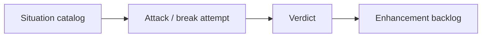

# Architecture stress evaluation — index

**Status:** Research evaluation only. **Does not** change architecture locks or ship code.  
**Purpose:** Catalog situations the dual-authority design must handle, attempt to **break** it on paper, and leave a brainstorm backlog.

## Documents in this pack

| Doc | Role |
|---|---|
| [01-situation-catalog.md](01-situation-catalog.md) | Situations the architecture must handle (IDs + sources) |
| [02-break-matrix.md](02-break-matrix.md) | Attacks + Hold / Bend / Break / Unknown |
| [03-external-patterns.md](03-external-patterns.md) | Web authority / prediction patterns — transfer vs non-transfer |
| [04-enhancement-backlog.md](04-enhancement-backlog.md) | Prioritized seeds for a **later** workshop (not decisions) |
| [05-p0-workshop-verdict.md](05-p0-workshop-verdict.md) | **Done:** Breaker/Defender/Judge on P0 — ADR + [p0-hot-path-hardening.md](../../architecture/p0-hot-path-hardening.md) |

## System under evaluation (locked SSOTs)

| Spec | Path |
|---|---|
| Control loops | [../../architecture/overlay-control-loops.md](../../architecture/overlay-control-loops.md) |
| MatchRuntime | [../../architecture/match-runtime.md](../../architecture/match-runtime.md) |
| UniqueActor | [../../architecture/unique-actor-runtime.md](../../architecture/unique-actor-runtime.md) |
| Effects | [../../architecture/effect-runtime.md](../../architecture/effect-runtime.md), [unique-entity-effects.md](../../architecture/unique-entity-effects.md) |
| Middle layer / Data | [../../architecture/pvz-middle-layer.md](../../architecture/pvz-middle-layer.md), [../../database/ledger-snapshot.md](../../database/ledger-snapshot.md) |
| Decisions | [../../architecture/decisions.md](../../architecture/decisions.md) |

## Method

### Verdict meanings

| Verdict | Meaning |
|---|---|
| **Hold** | Current locks handle it without change |
| **Bend** | Works via fail-closed / eventual consistency; UX or edge pain |
| **Break** | Locks contradict or leave a hole that forces redesign *if* product requires this situation |
| **Unknown** | Research gap; cannot judge without LIVE / more dump proof |

### Risk

`P0` (blocks unique gear / dual FSM) → `P3` (nice / distant).

## Honest summary (spoiler)

Not everything Holds. Clusters that **Bend** or **Break** (see matrix):

- Hit capture gaps (Hit* overrides / alternate damage sinks) → procs miss → **Bend/Unknown**
- Auto withdraw-on-die + ptr reuse not implemented → grant leak → **Break** if unique gear ships without it
- Mid-run Server crash / injector reconnect while Bound → UniqueActor phase vs Hot bag → **Bend**
- Product desire for Server-owned proc RNG → contradicts Hot lock → **Break** *if* that product rule is chosen
- LimHealth / Start overwrite races → Hot Writer vs Unity → **Unknown**

Enhancement brainstorm belongs in [04-enhancement-backlog.md](04-enhancement-backlog.md) — do not treat backlog rows as ADRs.

## Out of scope

Changing architecture markdown SSOTs (except a one-line pointer), implementing fixes, LIVE prove of this pack, production commits for features.
