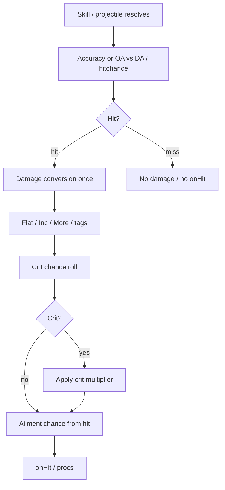

# Hit, crit, and damage conversion (inspiration)

Observation from Diablo-like ARPGs. Not a FusionRpg product ADR.

## Mechanism summary

### Hit pipeline (composite)

Exact order differs by game (crit before/after some More; conversion timing is the fragile part).

### Grim Dawn — OA / DA

- **Offensive Ability (OA)** vs **Defensive Ability (DA)** → probability to hit (PTH).
- Crit chance/tier often rises with OA advantage, not only a flat CHC affix.
- Teaches: hitchance can be a **first-class RPG stat**, not assumed 100%.

### Path of Exile — accuracy / crit

- Accuracy vs enemy evasion → hit.
- Crit chance from tree/gear/spells; crit multi separate.
- **Damage conversion**: skill local convert first, then global convert; **convert once** per portion — you do not convert the already-converted part again endlessly.

### Diablo IV — crit / Vulnerable baselines

- Crit and Vulnerable act as known **multiplicative buckets** with baseline contribution (community shorthand often cites ~×50% crit damage and ~×20% Vulnerable as design targets that shifted by patch).
- Lesson for FusionRpg: if you add these, fix **baselines + few sources**, not infinite affixes.

### Conversion order (PoE / GD-shaped rule)

1. Skill specifies base damage types.
2. **Skill-local** conversion (this skill’s fire→cold).
3. **Global** conversion (gear/tree).
4. Scale each resulting type with that type’s Increased/More.
5. Never reconvert the same damage portion.

## Steal / adapt / avoid

| | Guidance |
|---|---|
| **Steal** | Convert-once rule; explicit miss vs hit if projectile accuracy ever matters |
| **Adapt** | Crit as tag on hit with one More-like multiplier + CHC Increased; Vulnerable-like as enemy debuff amp with fixed baseline |
| **Avoid** | Convert loops; treating every % damage type as More; OA/DA complexity before hitchance is even visible in PvZ |

## Sources

- [Grim Dawn combat (OA/DA)](https://www.grimdawn.com/guide/gameplay/combat.php)
- [PoE Accuracy](https://www.poewiki.net/wiki/Accuracy)
- [PoE Critical strike](https://www.poewiki.net/wiki/Critical_strike)
- [PoE Damage conversion](https://www.poewiki.net/wiki/Damage_conversion)
- [Diablo IV Critical Strikes](https://diablo4.wiki.fextralife.com/Critical+Strikes)

## Open questions for FusionRpg

1. Are plant projectiles allowed to miss, or is hit always true on collision (Unity today)?
2. Crit — visual only, or real damage bucket in compose?
3. Element conversion for fusion plants (fire pea → ice) — skill-local only?
4. Does Vulnerable-like belong on zombies as a short debuff from butter/freeze break?
