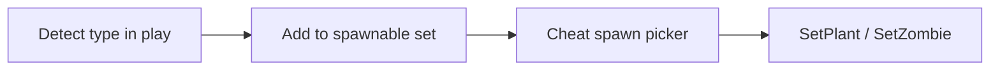

# Cheat menu coverage (proof suite)

Debug **in-game cheat menu** for FusionRpg injector — prove every gameplay knob before RPG design.

**Not** player-facing RPG. **Not** a static full PlantType/ZombieType encyclopedia.

Product injector “must not” (GodMode, write sun, timeScale, …) is **relaxed here for proof only**. Still never patch: `GameAPP.Start`, gameplay `Update` spam, EventNodes, `Board.OnPlantDie` / `OnPlantCreate`. No third-party source copy.

Related: [modifiable-gameplay.md](modifiable-gameplay.md), [game-types-381.md](game-types-381.md), [stat-fields.md](stat-fields.md).

---

## 1. Cheat definition

A **cheat** is one controlled mutation or action with a stable identity. Coverage IDs are cheats (or small cheat groups).

| Field | Meaning |
|---|---|
| `id` | Stable string (`A-P-HP`, `Z-GOD`, `B-SUN-SET`, …) |
| `name` | Short English label |
| `group` | Tab A–J |
| `kind` | `toggle` / `slider` / `number` / `action` / `select` / `probe` |
| `enabled` | On/off for continuous writers; actions are fire-and-forget |
| `value` | Payload (percent, flat, row/col, type id, timescale, …) |
| `defaults` | Values on Reset |
| `target` | `global` / `nextSpawn` / `allLiving` / `selectedPtr` / `board` / `catalog` |
| `apply` | `onSpawn` / `onClick` / `onBoardAwake` / `prefix` / `onDetect` / `continuous` |
| `gameTarget` | Field, API, or Harmony Prefix |
| `proof` | Event + field (`cheat.apply`, dump key, visual) |
| `phase` | P0 / P1 / P2 |
| `persist` | **session** default; optional `cheat-state.json` + web `/api/cheats` |
| `conflicts` | Mutually exclusive probes / godmode vs DEF |
| `status` | `missing` / `partial` / `done` |
| `risk` | crash / other-mod / needs-probe / dynamic-only |

### Shared runtime

| ID | Role |
|---|---|
| `SYS-REGISTRY` | `CheatState` map by `id` |
| `SYS-SELECT` | `selectedPtr` = **last placed plant/zombie** or **last almanac/card type’s last living instance**; clear button |
| `SYS-RESET-ALL` | Reset all cheats to defaults |
| `SYS-RESET-GROUP` | Reset current tab |
| `SYS-MENU` | BepInEx config: cheat menu enabled (off for future player builds) |
| `SYS-PULL-STATS` | Tab A ← server `StatsConfig` |
| `SYS-PUSH-STATS` | Tab A → server `StatsConfig` |
| `SYS-EMIT-PROOF` | Toggle emit `cheat.apply` / `cheat.enrich` |

Local Tab A overrides win until Pull. F8 toggles menu visibility.

### Phases

| Phase | Scope |
|---|---|
| **P0** | Global scale, plant/zombie writers, DEF paths, Board.config, dynamic spawn, economy/time, system |
| **P1** | QoL (plant-anywhere, no-CD, unlimited mowers) when Harmony target is safe |
| **P2** | Homing/type-swap bullets, auto-collect, travel buff inject, status slows, pet/grid spawn |

### Status today

**Implemented** (injector F8 Tabs A–J + web `/cheats` + persist + `FusionRpg.CheatCore` CI): coverage IDs in scope for the cheat menu.

**Partial:** `I-TRAVEL-BUFF` (stub note), `P-LIMDMG` (read-only), `H-MOWER-INF` (blocks `Mower.Die`, does not respawn).

**Known risks / fixes:** DEF %/flat scales only on `Plant`/`Zombie.TakeDamage`; `P-DEF-REAL` / `Z-DEF-BODY` / `Z-DEF-APPLY` only zero damage under godmode (no stacked DEF). `Board.Awake` respects `BoardConfigLocked` for `E-*`. `G-AUTOCOLLECT` credits sun/money then Die (never Die-alone). `D-HOMING` sets `Bullet.MoveWay.Track`. Banned Harmony unused.

### Play smoke checklist (out of CI)

After `.\scripts\deploy-play.ps1`:

1. Web `#/cheats` → run **Smoke core** probe pack (or F8 Tab J same id).
2. Place a plant / play briefly; soft checklist should show `cheat.inject` (+ `stat.applied` / `plant.spawn` / `plant.place` when they fire).
3. **Open log filtered** by `probeId` (`#/log?q=…`).
4. Optional: `pack.board-e`, `pack.economy`, godmode visual; enrich via place+almanac; Board.config lock across new board; autocollect credit; mower Die block.

Manual F8 still works for single knobs; packs are the fast path.

---

## 2. Dynamic spawn catalog (locked)

No pretreat full enum. Enrich over play.

### Enrich sources

| ID | Source | Side | When |
|---|---|---|---|
| `SP-ENRICH-PLACE-P` | `plant.place` / mix / unique / attributes | plant | First `type` |
| `SP-ENRICH-SPAWN-P` | `plant.spawn` | plant | First `type` |
| `SP-ENRICH-ALMANAC` | Almanac `SelectCard` | plant or zombie | Browse |
| `SP-ENRICH-PLACE-Z` | `zombie.place` | zombie | First `type` |
| `SP-ENRICH-SPAWN-Z` | `zombie.spawn` / `InitHealth` | zombie | First `type` |
| `SP-ENRICH-INITZ` | `InitZombieList` → `catalog.zombies` | zombie | Level pool |
| `SP-ENRICH-CONVEY` | `convey.pool` | plant | Conveyor |
| `SP-ENRICH-CARD` | `InitBoard.CreateCard` / card.bank | plant/zombie/function | Cards dealt |
| `SP-ENRICH-TRAVEL` | travel unlock/pick type ids | plant/zombie | When present |
| `SP-ENRICH-MANUAL` | Manual type id box | either | Escape hatch |

### Entry fields

`side`, `type`, `typeName`, `displayName?`, `firstSeenUtc`, `lastSeenUtc`, `sources[]`, `spawnOk`, `lastError?`

### UI rules

- Picker = enriched only (+ raw int).
- Empty: “Play or open almanac to discover types.”
- Skip `Nothing`. Names on **main thread** when first seen — no bulk `Lawnf.GetName` at connect.
- Failed factory spawn → keep entry, `spawnOk=false`.

| ID | name | kind | apply | gameTarget | proof | phase | status | risk |
|---|---|---|---|---|---|---|---|---|
| `SP-CAT-PLANT` | Plant spawn list | select | onDetect | in-memory set | catalog size | P0 | done | dynamic-only |
| `SP-CAT-ZOMBIE` | Zombie spawn list | select | onDetect | in-memory set | catalog size | P0 | done | dynamic-only |
| `SP-PLANT` | Spawn plant | action | onClick | `CreatePlant.SetPlant` | `plant.place` + `spawnOk` | P0 | done | other-mod |
| `SP-ZOMBIE` | Spawn zombie | action | onClick | `CreateZombie.SetZombie` | `zombie.place` + `spawnOk` | P0 | done | other-mod |
| `SP-ZOMBIE-MC` | Spawn mind-controlled | action | onClick | `SetZombieWithMindControl` | `zombie.place` | P0 | done | needs-probe |
| `SP-MANUAL-ID` | Add type by int | number+action | onClick | catalog | enrich event | P0 | done | dynamic-only |
| `SP-CLEAR-FAILED` | Clear failed marks | action | onClick | catalog | UI | P0 | done | — |
| `SP-LAST-ALMANAC` | Spawn last almanac | action | onClick | last SelectCard + factory | place event | P0 | done | — |

---

## 3. Tab tables

Columns: id, name, kind, target, apply, gameTarget, proof, phase, status, risk. Defaults implied (identity / off / 1.0 / 0).

### Tab A — Global scale

| ID | name | kind | target | apply | gameTarget | proof | phase | status | risk |
|---|---|---|---|---|---|---|---|---|---|
| `A-APPLY` | Apply stats master | toggle | global | onSpawn | `StatsConfig.applyStats` | `stat.applied` absent when off | P0 | done | — |
| `A-P-HP%` | Plant HP % | slider | nextSpawn | onSpawn | `thePlantHealth/Max` | dump `hp` | P0 | done | — |
| `A-P-HP+` | Plant HP flat | number | nextSpawn | onSpawn | same | dump `hp` | P0 | done | — |
| `A-P-ATK%` | Plant ATK % | slider | nextSpawn | onSpawn | `attackDamage` | dump `attack` | P0 | done | needs-probe |
| `A-P-ATK+` | Plant ATK flat | number | nextSpawn | onSpawn | `attackDamage` | dump `attack` | P0 | done | needs-probe |
| `A-P-DEF%` | Plant DEF % | slider | global | prefix | `Plant.TakeDamage` | `plant.damage` before/after | P0 | done | — |
| `A-P-DEF+` | Plant DEF flat | number | global | prefix | same | same | P0 | done | — |
| `A-Z-HP%` | Zombie HP % | slider | nextSpawn | onSpawn | body+armor | dump `hp`/`armor` | P0 | done | — |
| `A-Z-HP+` | Zombie HP flat | number | nextSpawn | onSpawn | same | dump | P0 | done | — |
| `A-Z-ATK%` | Zombie ATK % | slider | nextSpawn | onSpawn | `theAttackDamage` | dump `attack` | P0 | done | — |
| `A-Z-ATK+` | Zombie ATK flat | number | nextSpawn | onSpawn | same | dump | P0 | done | — |
| `A-Z-DEF%` | Zombie DEF % | slider | global | prefix | `Zombie.TakeDamage` | `zombie.damage` | P0 | done | — |
| `A-Z-DEF+` | Zombie DEF flat | number | global | prefix | same | same | P0 | done | — |
| `A-REAPPLY` | Reapply all living | action | allLiving | onClick | walk board plants/zombies | `stat.applied` ×N | P0 | done | other-mod |
| `A-PUSH-NOW` | Push to board now | action | allLiving | onClick | same | dumps | P0 | done | other-mod |

Conflicts: none within Tab A. `A-P-ATK*` conflicts with Tab D bullet-only probe when both on.

### Tab B — Plant writers

| ID | name | kind | target | apply | gameTarget | proof | phase | status | risk |
|---|---|---|---|---|---|---|---|---|---|
| `P-HP` | Set plant HP | number | selectedPtr/allLiving/nextSpawn | onClick/onSpawn | `thePlantHealth` | dump | P0 | done | — |
| `P-MAXHP` | Set plant max HP | number | same | same | `thePlantMaxHealth` | dump | P0 | done | — |
| `P-SHIELD` | Set shield HP | number | same | same | `theShieldHealth` | dump | P0 | done | needs-probe |
| `P-ATK` | Set attackDamage | number | same | same | `attackDamage` | dump + DPS | P0 | done | needs-probe |
| `P-ATK-INT` | Attack interval | number | same | same | `thePlantAttackInterval` | dump + fire rate | P0 | done | needs-probe |
| `P-ATK-CD` | Attack countdown | number | same | same | `thePlantAttackCountDown` | visual | P0 | done | needs-probe |
| `P-ATK-ADD` | attackSpeedAdder | number | same | same | `attackSpeedAdder` | dump | P0 | done | needs-probe |
| `P-PROD-INT` | Produce interval | number | same | same | `thePlantProduceInterval` | sun timing | P0 | done | needs-probe |
| `P-PROD-CD` | Produce countdown | number | same | same | `thePlantProduceCountDown` | visual | P0 | done | needs-probe |
| `P-SPEED` | thePlantSpeed | number | same | same | `thePlantSpeed` | visual | P0 | done | needs-probe |
| `P-MOVE` | moveSpeed | number | same | same | `moveSpeed` | visual | P0 | done | needs-probe |
| `P-LEVEL` | theLevel | number | same | same | `theLevel` | dump | P0 | done | needs-probe |
| `P-SHOOTLVL` | shootingLevel | number | same | same | `shootingLevel` | dump | P0 | done | needs-probe |
| `P-LIMDMG` | LimDamage | number | same | same | `LimDamage` | dump | P0 | partial | needs-probe |
| `P-MOD-HP` | Use ModifyHealth | probe | same | onClick | `ModifyHealth` | dump vs raw | P0 | done | needs-probe |
| `P-MOD-ATK` | Use ModifyDamage | probe | same | onClick | `ModifyDamage` | dump vs raw | P0 | done | needs-probe |
| `P-DEF-REAL` | RealTakeDamage godmode gate | toggle | global | prefix | `RealTakeDamage` (godmode zero only; % DEF on TakeDamage) | `plant.damage` path=real | P0 | done | — |
| `P-GOD` | Plant godmode | toggle | global | prefix | skip Take/Real/Crashed | no HP loss | P0 | done | conflicts DEF |
| `P-GOD-DIE` | Block plant Die | toggle | global | prefix | `Plant.Die` except shovel | immortal | P0 | done | crash |

Grid col/row: capture-only for spawn placement UI (`SP-PLANT` row/col), not separate writers.

### Tab C — Zombie writers

| ID | name | kind | target | apply | gameTarget | proof | phase | status | risk |
|---|---|---|---|---|---|---|---|---|---|
| `Z-HP` | Body HP | number | selected/all/next | onClick/onSpawn | `theHealth` | dump | P0 | done | — |
| `Z-MAXHP` | Body max HP | number | same | same | `theMaxHealth` | dump | P0 | done | — |
| `Z-ARM1` | Armor1 HP | number | same | same | `theFirstArmorHealth` | dump | P0 | done | — |
| `Z-ARM1MAX` | Armor1 max | number | same | same | `theFirstArmorMaxHealth` | dump | P0 | done | — |
| `Z-ARM2` | Armor2 HP | number | same | same | `theSecondArmorHealth` | dump | P0 | done | — |
| `Z-ARM2MAX` | Armor2 max | number | same | same | `theSecondArmorMaxHealth` | dump | P0 | done | — |
| `Z-ATK` | theAttackDamage | number | same | same | `theAttackDamage` | dump | P0 | done | — |
| `Z-ARMOR-F` | theArmor float | number | same | same | `theArmor` | dump | P0 | done | needs-probe |
| `Z-TAKEMULT` | takeDmgMultiplier | number | same | same | `takeDmgMultiplier` | dump | P0 | done | needs-probe |
| `Z-SPD-U` | uniqueSpeed | number | same | same | `uniqueSpeed` | visual | P0 | done | needs-probe |
| `Z-SPD` | theSpeed | number | same | same | `theSpeed` | visual | P0 | done | needs-probe |
| `Z-SPD-O` | theOriginSpeed | number | same | same | `theOriginSpeed` | visual | P0 | done | needs-probe |
| `Z-SLOW-*` | Status slows | number | same | same | freeze/cold/butter… | visual | P2 | done | needs-probe |
| `Z-DEF-BODY` | BodyTakeDamage godmode gate | toggle | global | prefix | `BodyTakeDamage` (godmode zero only; % DEF on TakeDamage) | damage event | P0 | done | — |
| `Z-DEF-APPLY` | ApplyDamage godmode gate | toggle | global | prefix | `ApplyDamage` (godmode zero only; % DEF on TakeDamage) | damage event | P0 | done | — |
| `Z-GOD` | Zombie godmode | toggle | global | prefix | skip TakeDamage paths | immortal | P0 | done | conflicts DEF |
| `Z-KILL-ALL` | Kill all zombies | action | board | onClick | Die/Destory each | `zombie.die` | P0 | done | other-mod |
| `Z-HYPNO-ALL` | Hypnotize all | action | board | onClick | `SetMindControl` | `zombie.hypno` | P0 | done | needs-probe |
| `Z-ONESHOT` | One-shot selected | action | selectedPtr | onClick | set HP 0 / Die | die event | P0 | done | — |
| `Z-REAPPLY-RC` | Reapply after recapture | toggle | nextSpawn | onDetect | after reinforce/setHealth | second spawn_stats | P0 | done | — |

`DamageMultiplier` get-only → **N/A write** (audit).

### Tab D — Bullets

| ID | name | kind | target | apply | gameTarget | proof | phase | status | risk |
|---|---|---|---|---|---|---|---|---|---|
| `D-DMG-SET` | Set Bullet.Damage | number | global | onSpawn | `Bullet.InitData` / SetBullet | `bullet.init` | P0 | done | needs-probe |
| `D-DMG-%` | Scale bullet damage | slider | global | onSpawn | same | same | P0 | done | needs-probe |
| `D-PROBE-PLANT` | ATK via plant field only | probe | global | onSpawn | disable bullet write | DPS test | P0 | done | conflicts D-PROBE-BULLET |
| `D-PROBE-BULLET` | ATK via bullet only | probe | global | onSpawn | disable plant ATK write | DPS test | P0 | done | conflicts D-PROBE-PLANT |
| `D-HOMING` | Homing bullets | toggle | global | TBD | TBD | visual | P2 | done | needs-probe |
| `D-TYPE-SWAP` | Change bullet type | select | global | TBD | TBD | visual | P2 | done | needs-probe |

### Tab E — Board.config

| ID | name | kind | target | apply | gameTarget | proof | phase | status | risk |
|---|---|---|---|---|---|---|---|---|---|
| `E-ZH` | zombieHealthMultiplier | slider | board | onBoardAwake+onClick | `Board.config` | `board.modifiers` | P0 | done | needs-probe |
| `E-ZD` | zombieDamageMultiplier | slider | board | same | same | same | P0 | done | needs-probe |
| `E-ZS` | zombieSpeedMultiplier | slider | board | same | same | same | P0 | done | needs-probe |
| `E-ZC` | zombieCountMultiplier | slider | board | same | same | same | P0 | done | needs-probe |
| `E-ZARM` | zombieStartAmmor | number | board | same | same | same | P0 | done | needs-probe |
| `E-PMIN` | plantModifyMin | number | board | same | same | same | P0 | done | needs-probe |
| `E-PMAX` | plantModifyMax | number | board | same | same | same | P0 | done | needs-probe |
| `E-ZMIN` | zombieModifyMin | number | board | same | same | same | P0 | done | needs-probe |
| `E-ZMAX` | zombieModifyMax | number | board | same | same | same | P0 | done | needs-probe |
| `E-WAVE-I` | waveInterval | number | board | same | same | wave timing | P0 | done | needs-probe |
| `E-CONV-I` | conveyInterval | number | board | same | same | convey | P0 | done | needs-probe |
| `E-APPLY-NOW` | Apply config now | action | board | onClick | write live config | modifiers event | P0 | done | needs-probe |

### Tab F — Spawn / wave (see also §2)

| ID | name | kind | target | apply | gameTarget | proof | phase | status | risk |
|---|---|---|---|---|---|---|---|---|---|
| `F-DEL-P` | Delete all plants | action | board | onClick | iterate Die | plant.die | P0 | done | other-mod |
| `F-DEL-Z` | Delete all zombies | action | board | onClick | Die/Destory | zombie.die | P0 | done | other-mod |
| `F-SUMMON` | SummonZombies(wave) | number+action | board | onClick | `BoardSpawner.SummonZombies` | `wave.spawn` | P0 | done | needs-probe |
| `F-HUGE` | Huge wave | action | board | onClick | `HugeWaveEvent` | `wave.huge` | P0 | done | needs-probe |
| `F-WAVE-T` | Set timeUntilNextWave | number | board | onClick | `Board.timeUntilNextWave` | poll | P0 | done | needs-probe |
| `F-WAVE-FREEZE` | Freeze wave timer | toggle | board | continuous | keep timer | poll | P0 | done | needs-probe |

(`SP-*` IDs live in §2; they are Tab F controls too.)

### Tab G — Economy / time

| ID | name | kind | target | apply | gameTarget | proof | phase | status | risk |
|---|---|---|---|---|---|---|---|---|---|
| `G-SUN-SET` | Set sun | number | board | onClick | `Board.theSun` | `board.economy` | P0 | done | — |
| `G-SUN-ADD` | Add sun | number | board | onClick | theSun += | economy | P0 | done | — |
| `G-MONEY-SET` | Set money | number | board | onClick | `theMoney` | economy | P0 | done | — |
| `G-MONEY-ADD` | Add money | number | board | onClick | theMoney += | economy | P0 | done | — |
| `G-PTS-SET` | Set points | number | board | onClick | `thePoints` | economy | P0 | done | — |
| `G-PTS-ADD` | Add points | number | board | onClick | thePoints += | economy | P0 | done | — |
| `G-MAXSUN` | maxSun | number | board | onClick | `maxSun` | dump | P0 | done | needs-probe |
| `G-MAXMONEY` | maxMoney | number | board | onClick | `maxMoney` | dump | P0 | done | needs-probe |
| `G-TIMESCALE` | Time.timeScale | slider | board | continuous | `Time.timeScale` | visual | P0 | done | — |
| `G-TIMEFREEZE` | Freeze time | toggle | board | continuous | timeScale=0 | visual | P0 | done | — |
| `G-AUTOCOLLECT` | Auto-collect | toggle | board | TBD | TBD | coins | P2 | done | needs-probe |
| `G-FREE-SET` | Free SetPlant | toggle | global | TBD | isFreeSet path | place | P2 | done | needs-probe |

### Tab H — QoL (P1)

| ID | name | kind | target | apply | gameTarget | proof | phase | status | risk |
|---|---|---|---|---|---|---|---|---|---|
| `H-ANYWHERE` | Plant anywhere | toggle | global | prefix | Mouse/CreatePlant gate (hypothesis) | place off-grid | P1 | done | needs-probe |
| `H-NOCD-CARD` | No card CD | toggle | global | prefix | CardUI CD (hypothesis) | spam place | P1 | done | needs-probe |
| `H-NOCD-GLOVE` | No glove CD | toggle | global | prefix | Glove (hypothesis) | spam | P1 | done | needs-probe |
| `H-NOCD-HAMMER` | No hammer CD | toggle | global | prefix | Hammer | spam | P1 | done | needs-probe |
| `H-NOCD-WHEEL` | No wheel CD | toggle | global | prefix | Wheel | spam | P1 | done | needs-probe |
| `H-MOWER-INF` | Unlimited mowers | toggle | board | TBD | mower respawn (hypothesis) | mower.place | P1 | partial | needs-probe |

Skip if only possible via banned Harmony.

### Tab I — Travel / mix / meta

| ID | name | kind | target | apply | gameTarget | proof | phase | status | risk |
|---|---|---|---|---|---|---|---|---|---|
| `I-RECIPES` | Dump recipes | action | catalog | onClick | ChildToParents | `catalog.recipes` | P0 | done | — |
| `I-REINFORCE` | Reinforce selected | action | selectedPtr | onClick | ReinforcePlant/Zombie | `entity.stats` | P0 | done | — |
| `I-SET-ZHP` | Lawnf.SetZombieHealth style | action | selectedPtr | onClick | set health API | spawn_stats | P0 | done | — |
| `I-TRAVEL-BUFF` | Inject travel buff | action | board | onClick | TBD | travel.buff | P2 | partial | needs-probe |
| `I-PET-SPAWN` | Spawn pet | action | board | onClick | `MiniPet.SetPet` | pet.spawn | P2 | done | needs-probe |
| `I-GRID-SPAWN` | Spawn grid item | action | board | onClick | `SetGridItem` | grid.place | P2 | done | needs-probe |
| `I-BUCKET` | Spawn bucket | action | board | onClick | `SetBucket` | item.bucket | P2 | done | needs-probe |
| `I-PRESENT` | Trigger present | action | board | onClick | Present.RandomPlant | present.open | P2 | done | needs-probe |

Observe-only (no cheat write ID; capture remains): shovel, fertilize, hammer, wheel use, prize click, match restart, card pick/place — listed in audit as **N/A action**.

### Tab J — System

| ID | name | kind | target | apply | gameTarget | proof | phase | status | risk |
|---|---|---|---|---|---|---|---|---|---|
| `SYS-MENU` | Menu enabled | toggle | global | continuous | BepInEx config | F8 works | P0 | done | — |
| `SYS-SELECT` | Show/clear selection | action | selectedPtr | onClick | CheatState | overlay ptr | P0 | done | — |
| `SYS-RESET-ALL` | Reset all | action | global | onClick | CheatState | defaults | P0 | done | — |
| `SYS-RESET-GROUP` | Reset tab | action | global | onClick | CheatState | defaults | P0 | done | — |
| `SYS-PULL-STATS` | Pull server stats | action | global | onClick | StatsConfig | Tab A values | P0 | done | — |
| `SYS-PUSH-STATS` | Push server stats | action | global | onClick | PUT/reload | web matches | P0 | done | — |
| `SYS-EMIT-PROOF` | Emit proof events | toggle | global | continuous | Event enqueue | SQLite | P0 | done | — |
| `SYS-CAT-COUNT` | Show enrich counts | — | catalog | — | UI footer | numbers | P0 | done | — |

Hard bans (document only, not cheats): `BAN-GAMEAPP-START`, `BAN-UPDATE-SPAM`, `BAN-EVENTNODES`, `BAN-ONPLANTDIE`, `BAN-CHECKMIX`.

---

## 4. Master checklist (flat)

| ID | group | phase | status |
|---|---|---|---|
| A-APPLY | A | P0 | done |
| A-P-HP% A-P-HP+ A-P-ATK% A-P-ATK+ A-P-DEF% A-P-DEF+ | A | P0 | done |
| A-Z-HP% A-Z-HP+ A-Z-ATK% A-Z-ATK+ A-Z-DEF% A-Z-DEF+ | A | P0 | done |
| A-REAPPLY A-PUSH-NOW | A | P0 | done |
| P-HP P-MAXHP P-SHIELD P-ATK P-ATK-INT P-ATK-CD P-ATK-ADD | B | P0 | done |
| P-PROD-INT P-PROD-CD P-SPEED P-MOVE P-LEVEL P-SHOOTLVL | B | P0 | done |
| P-LIMDMG | B | P0 | partial |
| P-MOD-HP P-MOD-ATK P-DEF-REAL P-GOD P-GOD-DIE | B | P0 | done |
| Z-HP Z-MAXHP Z-ARM1 Z-ARM1MAX Z-ARM2 Z-ARM2MAX Z-ATK | C | P0 | done |
| Z-ARMOR-F Z-TAKEMULT Z-SPD-U Z-SPD Z-SPD-O | C | P0 | done |
| Z-DEF-BODY Z-DEF-APPLY Z-GOD Z-KILL-ALL Z-HYPNO-ALL Z-ONESHOT Z-REAPPLY-RC | C | P0 | done |
| Z-SLOW-* | C | P2 | done |
| D-DMG-SET D-DMG-% D-PROBE-PLANT D-PROBE-BULLET | D | P0 | done |
| D-HOMING D-TYPE-SWAP | D | P2 | done |
| E-ZH E-ZD E-ZS E-ZC E-ZARM E-PMIN E-PMAX E-ZMIN E-ZMAX E-WAVE-I E-CONV-I E-APPLY-NOW | E | P0 | done |
| SP-CAT-PLANT SP-CAT-ZOMBIE SP-ENRICH-* SP-PLANT SP-ZOMBIE SP-ZOMBIE-MC SP-MANUAL-ID SP-CLEAR-FAILED SP-LAST-ALMANAC | F | P0 | done |
| F-DEL-P F-DEL-Z F-SUMMON F-HUGE F-WAVE-T F-WAVE-FREEZE | F | P0 | done |
| G-SUN-SET G-SUN-ADD G-MONEY-SET G-MONEY-ADD G-PTS-SET G-PTS-ADD G-MAXSUN G-MAXMONEY G-TIMESCALE G-TIMEFREEZE | G | P0 | done |
| G-AUTOCOLLECT G-FREE-SET | G | P2 | done |
| H-ANYWHERE H-NOCD-* | H | P1 | done |
| H-MOWER-INF | H | P1 | partial |
| I-RECIPES I-REINFORCE I-SET-ZHP | I | P0 | done |
| I-TRAVEL-BUFF | I | P2 | partial |
| I-PET-SPAWN I-GRID-SPAWN I-BUCKET I-PRESENT | I | P2 | done |
| SYS-* | J | P0 | done |

---

## 5. Audit gap table

Every source item → coverage ID or N/A. **No missing rows.**

### From modifiable-gameplay / dumps

| Source | Mapping |
|---|---|
| Plant HP/max | A-P-HP*, P-HP, P-MAXHP |
| Plant attackDamage | A-P-ATK*, P-ATK, D-PROBE-* |
| Plant TakeDamage DEF | A-P-DEF* |
| Plant RealTakeDamage DEF | P-DEF-REAL |
| theShieldHealth | P-SHIELD |
| Attack interval/CD/adder | P-ATK-INT/CD/ADD |
| Produce interval/CD | P-PROD-INT/CD |
| thePlantSpeed / moveSpeed | P-SPEED / P-MOVE |
| theLevel / shootingLevel / LimDamage | P-LEVEL / P-SHOOTLVL / P-LIMDMG |
| ModifyHealth / ModifyDamage | P-MOD-HP / P-MOD-ATK |
| Plant Crashed | P-GOD (skip) |
| Col/row | SP-PLANT placement UI |
| Zombie body/armor HP | A-Z-HP*, Z-HP*, Z-ARM* |
| theAttackDamage | A-Z-ATK*, Z-ATK |
| TakeDamage DEF | A-Z-DEF* |
| BodyTakeDamage / ApplyDamage DEF | Z-DEF-BODY / Z-DEF-APPLY |
| theArmor / takeDmgMultiplier | Z-ARMOR-F / Z-TAKEMULT |
| DamageMultiplier (get-only) | **N/A write** |
| uniqueSpeed / theSpeed / theOriginSpeed | Z-SPD-* |
| Status slows | Z-SLOW-* (P2) |
| Mind control | Z-HYPNO-ALL; capture `zombie.hypno` |
| Recapture reinforce/setHealth | Z-REAPPLY-RC, I-REINFORCE, I-SET-ZHP |
| CurrentAllHealth / TotalAllHealth | **N/A write** (computed; proof via dump) |
| Bullet.Damage | D-DMG-* |
| SetBullet place | capture; D writers on init |
| Homing / type swap | D-HOMING / D-TYPE-SWAP (P2) |
| SetPlant / SetZombie | SP-PLANT / SP-ZOMBIE (dynamic) |
| Mix/unique/attributes | SP-ENRICH-PLACE-P |
| SummonZombies / HugeWave | F-SUMMON / F-HUGE |
| InitZombieList | SP-ENRICH-INITZ |
| Almanac SelectCard | SP-ENRICH-ALMANAC, SP-LAST-ALMANAC |
| Board.config all keys | E-* |
| Wave timer | F-WAVE-T / F-WAVE-FREEZE |
| theSun / money / points | G-* |
| maxSun / maxMoney | G-MAXSUN / G-MAXMONEY |
| Wave HP pools / counts / BoardStatistics | **N/A write** (capture/poll proof only) |
| Mowers | H-MOWER-INF (P1); place/start capture |
| Time.timeScale | G-TIMESCALE / G-TIMEFREEZE |
| Recipes | I-RECIPES |
| Travel buffs/picks | SP-ENRICH-TRAVEL; I-TRAVEL-BUFF P2; capture N/A write |
| Cards/shovel/glove/fertilize/hammer/wheel | **N/A write** (capture); H-NOCD-* for CD |
| Pets/grid/present/bucket/prizes | I-*-P2; prize **N/A write** |
| Plant-anywhere / no-CD | H-* |
| GodMode / write sun / timeScale product OUT | Allowed as proof cheats P-GOD, G-*, G-TIMESCALE |
| Banned Harmony | BAN-* only |

### GameDumps BoardStats / LiveBoard extras

| Field | Mapping |
|---|---|
| theWave / theMaxWave / isHugeWave | poll proof; F-HUGE |
| zombieCurrent/Spawn/TotalHealth | **N/A write** |
| plantedCount / theCurrentPlantCount / theTotalNumOfZombie | **N/A write** |
| levelType / boardLevel | capture on board.start |
| sunProduced/Consumed etc. | snapshot **N/A write** |

### Capture hooks → enrich or N/A

| Hook/event | Mapping |
|---|---|
| plant.place/mix/unique/spawn | SP-ENRICH-* |
| zombie.place/spawn | SP-ENRICH-* |
| convey.pool | SP-ENRICH-CONVEY |
| card.bank / card.drop | SP-ENRICH-CARD |
| almanac.select | SP-ENRICH-ALMANAC |
| catalog.zombies | SP-ENRICH-INITZ |
| travel.* | SP-ENRICH-TRAVEL / I-TRAVEL-BUFF |
| sun/money/points events | proof for G-* |
| match.invade / restart | **N/A cheat** |
| pet.xp | **N/A write** |

**Gaps remaining in audit sense:** none — every dump/config/mod-gameplay row maps to an ID or explicit N/A.

---

## 6. Remaining gaps / N/A (not forgotten)

| Item | Handling |
|---|---|
| Homing / change bullet type | P2 D-HOMING / D-TYPE-SWAP |
| Auto-collect / free SetPlant | P2 G-AUTOCOLLECT / G-FREE-SET |
| Travel buff inject | P2 I-TRAVEL-BUFF |
| Status slow writes | P2 Z-SLOW-* |
| Pet / grid / bucket / present spawn | P2 I-* |
| Weather / FPS / Discord / cosmetics | **N/A** — out of proof suite |
| Persist cheats across restarts | Done (`cheat-state.json` + `/api/cheats`) |
| Full web UI for every cheat | Done (`/cheats` Tabs A–J) |
| Exact Harmony for H-* | Hypothesis until probed |
| DamageMultiplier write | **N/A** get-only |
| Writing BoardStatistics / wave HP pools | **N/A** |

---

## 7. Proof protocol

| Group | How to prove |
|---|---|
| Probe packs | `#/cheats` pack button → `probe.start` + `cheat.inject` with `probeId` → play → outcomes tagged with same `probeId` |
| Tab A / B / C writers | Spawn → overlay note + `spawn_stats` / `stat.applied` / `cheat.inject` in log/SQLite |
| DEF Prefix | `plant.damage` / `zombie.damage` `before` vs `after` (SQLite; noisy) |
| ATK plant vs bullet | Enable only D-PROBE-PLANT then only D-PROBE-BULLET; compare kills/time |
| Board.config | `board.modifiers` after E-APPLY / `pack.board-e` |
| Dynamic spawn | Almanac browse → SP-CAT grows → SP-PLANT succeeds → `spawnOk` |
| Economy | `board.economy` after G-SUN / `pack.economy` |
| Time | Visible slow-mo / freeze |
| Godmode | Entity HP unchanged under fire (`pack.god-plant`) |

### Automated CI (see [testing/foundation.md](../testing/foundation.md))

`CheatCore` unit tests + `CheatsE2ETests` + web Cheats page Vitest/Playwright. Harmony writers remain play-smoke only.

---

## 8. Non-goals

- Static full-type spawn encyclopedia
- RPG XP / loot / per-type loadouts (next phase after proof)
- Copying third-party cheat UI or source
- Patching banned Harmony targets
- Claiming product-safe GodMode/sun/timeScale outside this proof suite

---

## Next step (not this doc)

Play-smoke F8 menu against this checklist; keep RPG progression out of scope until knobs are proven.
